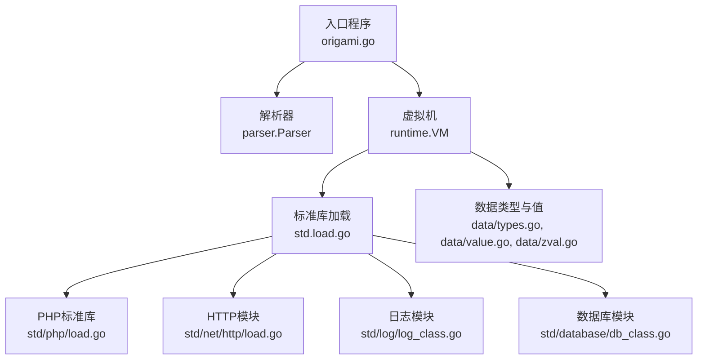
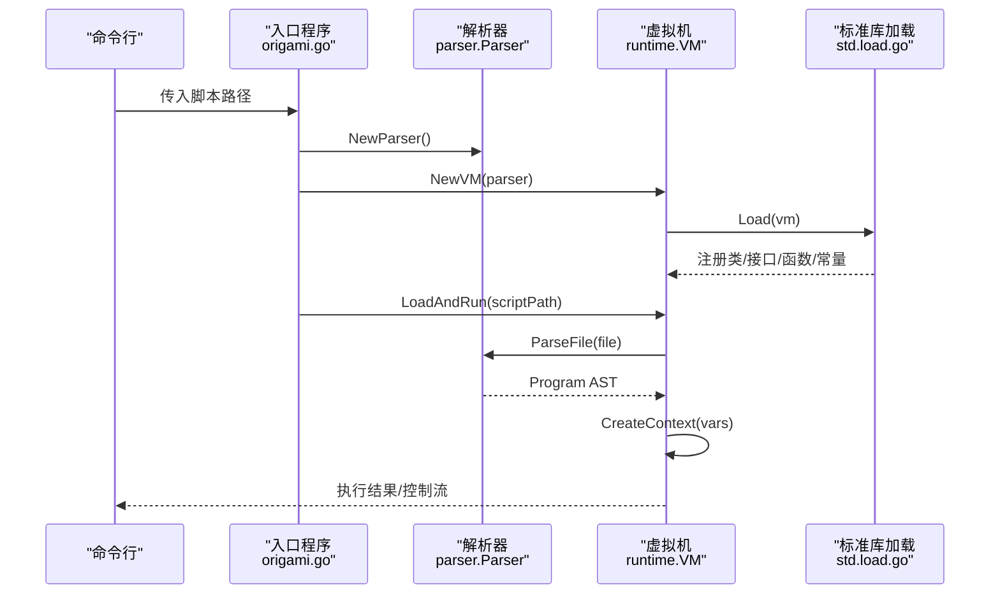
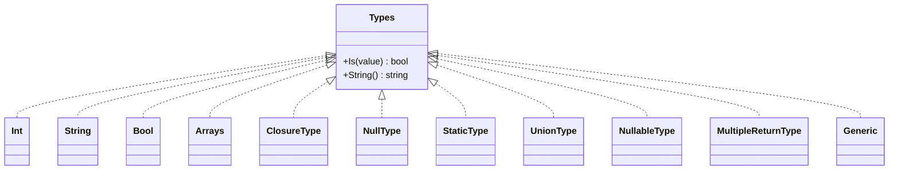
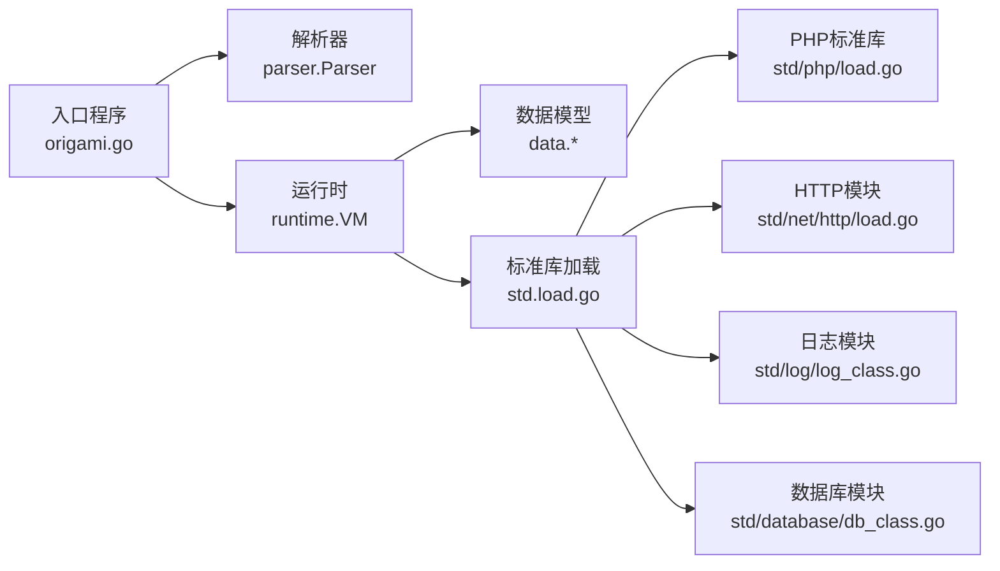

# API参考

<cite>
**本文引用的文件**
- [README.md](file://README.md)
- [origami.go](file://origami.go)
- [std/load.go](file://std/load.go)
- [runtime/vm.go](file://runtime/vm.go)
- [data/types.go](file://data/types.go)
- [data/zval.go](file://data/zval.go)
- [data/value.go](file://data/value.go)
- [data/type_int.go](file://data/type_int.go)
- [data/type_string.go](file://data/type_string.go)
- [data/type_bool.go](file://data/type_bool.go)
- [data/type_array.go](file://data/type_array.go)
- [std/php/load.go](file://std/php/load.go)
- [std/net/http/load.go](file://std/net/http/load.go)
- [std/log/log_class.go](file://std/log/log_class.go)
- [std/database/db_class.go](file://std/database/db_class.go)
</cite>

## 目录
1. [简介](#简介)
2. [项目结构](#项目结构)
3. [核心组件](#核心组件)
4. [架构总览](#架构总览)
5. [详细组件分析](#详细组件分析)
6. [依赖分析](#依赖分析)
7. [性能考虑](#性能考虑)
8. [故障排查指南](#故障排查指南)
9. [结论](#结论)
10. [附录](#附录)

## 简介
本参考文档面向Origami API使用者与集成者，系统性梳理以下内容：
- 标准库模块API：HTTP服务器、数据库ORM、日志系统、系统工具、反射、并发通道、循环容器等
- 数据类型API：基础类型、联合类型、可空类型、泛型类型、类型判断与字符串化
- 运行时API：虚拟机接口、上下文管理、异常处理回调、常量与全局变量注册
- 编译器API：解析器入口、类路径管理、作用域与变量、控制流与错误定位
- 使用示例与参数说明：以“代码片段路径”形式指引到仓库源码，便于对照实现

注意：当前版本尚未完成性能优化，请勿用于生产环境。

章节来源
- [README.md:1-69](file://README.md#L1-L69)

## 项目结构
项目采用分层与模块化组织方式：
- 入口与运行时：主程序入口负责初始化解析器与虚拟机，并加载标准库；运行时负责类/接口/函数/常量注册、上下文创建、异常处理与执行
- 标准库：按功能域拆分为http、database、log、php、system、reflect、channel、loop等子包
- 数据模型：统一的值与类型体系，支撑类型判断、序列化/反序列化、ZVal包装
- 解析器与语法树：解析器负责词法/语法分析、作用域管理与类路径解析
- 文档与示例：docs目录提供语言与标准库参考，examples与tests提供使用范式

图表来源
- [origami.go:34-67](file://origami.go#L34-L67)
- [std/load.go:14-38](file://std/load.go#L14-L38)
- [runtime/vm.go:14-33](file://runtime/vm.go#L14-L33)
- [data/types.go:1-262](file://data/types.go#L1-L262)
- [data/value.go:1-39](file://data/value.go#L1-L39)
- [data/zval.go:1-18](file://data/zval.go#L1-L18)

章节来源
- [origami.go:34-67](file://origami.go#L34-L67)
- [std/load.go:14-38](file://std/load.go#L14-L38)
- [runtime/vm.go:14-33](file://runtime/vm.go#L14-L33)

## 核心组件
本节聚焦运行时与数据模型的核心接口与职责。

- 虚拟机（VM）
  - 职责：注册类/接口/函数/常量；创建上下文；加载并执行脚本；异常处理回调；全局变量与ZVal管理
  - 关键方法：AddClass/AddInterface/AddFunc/SetConstant/LoadAndRun/CreateContext/SetExceptionHandler等
  - 异常处理：优先调用PHP级set_exception_handler回调，否则回退至底层处理

- 数据类型与值
  - 类型体系：基础类型（int、string、bool、array）、联合类型、可空类型、静态类型、闭包类型、泛型类型
  - 值接口：Value、CallableValue、GetProperty/PropertyZVal、GetMethod、GetSource等
  - ZVal：对任意Value的包装，用于变量存储与传递

- 解析器与类路径
  - 负责文件解析、作用域变量收集、类/接口自动加载与路径管理

章节来源
- [runtime/vm.go:118-213](file://runtime/vm.go#L118-L213)
- [runtime/vm.go:271-289](file://runtime/vm.go#L271-L289)
- [runtime/vm.go:334-390](file://runtime/vm.go#L334-L390)
- [data/types.go:34-262](file://data/types.go#L34-L262)
- [data/value.go:1-39](file://data/value.go#L1-L39)
- [data/zval.go:1-18](file://data/zval.go#L1-L18)

## 架构总览
下图展示从入口到标准库加载、再到运行时执行的关键交互：

图表来源
- [origami.go:34-67](file://origami.go#L34-L67)
- [std/load.go:14-38](file://std/load.go#L14-L38)
- [runtime/vm.go:275-289](file://runtime/vm.go#L275-L289)

## 详细组件分析

### 运行时API（VM）
- 初始化与配置
  - NewVM：创建虚拟机实例，绑定解析器与上下文
  - SetThrowControl：自定义异常抛出处理回调
  - SetExceptionHandler/GetExceptionHandler：注册与获取PHP级异常处理回调
- 名称空间与类加载
  - AddClass/AddInterface：注册类与接口，冲突检测
  - GetOrLoadClass/GetOrLoadInterface：按名称加载类或接口（含自动加载）
  - LoadPkg：按命名空间解析类或接口
- 函数与常量
  - AddFunc：注册函数
  - SetConstant/GetConstant：设置与获取全局常量
- 上下文与执行
  - CreateContext：基于解析器收集的变量创建上下文
  - LoadAndRun/ParsingFile：解析并执行脚本，支持注入对象属性到文件域
- 全局变量与ZVal
  - EnsureGlobalZVal/RegisterGlobalContext：确保全局ZVal存在并登记顶层变量

章节来源
- [runtime/vm.go:14-33](file://runtime/vm.go#L14-L33)
- [runtime/vm.go:69-116](file://runtime/vm.go#L69-L116)
- [runtime/vm.go:118-181](file://runtime/vm.go#L118-L181)
- [runtime/vm.go:183-243](file://runtime/vm.go#L183-L243)
- [runtime/vm.go:245-269](file://runtime/vm.go#L245-L269)
- [runtime/vm.go:334-390](file://runtime/vm.go#L334-L390)

### 数据类型API
- 类型定义与判断
  - 基础类型：Int/String/Bool/Arrays/ClosureType/NullType/StaticType
  - 组合类型：UnionType（联合类型）、NullableType（可空类型）、MultipleReturnType（多返回值）、Generic（泛型）
  - 判断逻辑：各类型实现Is(value)进行兼容性判断；String()返回类型字符串
- 类型构造
  - NewBaseType/NewNullableType/NewMultipleReturnType/NewGenericType：根据字符串或组合构造具体类型
  - ISBaseType：判断是否为基础类型标识符
- 值接口与ZVal
  - Value/CallableValue：值与可调用值抽象
  - SetProperty/GetProperty/GetPropertyZVal/GetMethod/GetSource：属性与方法访问、来源信息
  - ZVal：对任意Value的包装，支持GetZVal接口

图表来源
- [data/types.go:34-262](file://data/types.go#L34-L262)

章节来源
- [data/types.go:34-262](file://data/types.go#L34-L262)
- [data/value.go:1-39](file://data/value.go#L1-L39)
- [data/zval.go:1-18](file://data/zval.go#L1-L18)
- [data/type_int.go:1-17](file://data/type_int.go#L1-L17)
- [data/type_string.go:1-17](file://data/type_string.go#L1-L17)
- [data/type_bool.go:1-22](file://data/type_bool.go#L1-L22)
- [data/type_array.go:1-20](file://data/type_array.go#L1-L20)

### 标准库API概览

#### 日志模块（Log）
- 类：Log
- 方法族：debug、error、fatal、info、notice、trace、warn（均支持静态与实例两种调用）

章节来源
- [std/log/log_class.go:8-113](file://std/log/log_class.go#L8-L113)

#### HTTP模块（Net/Http）
- 类：Server、Handler、Cookie、ResponseWriter、Request
- 函数：app（应用入口）

章节来源
- [std/net/http/load.go:7-16](file://std/net/http/load.go#L7-L16)

#### PHP标准库（std/php）
- 函数注册：时间、字符串、数组、JSON、序列化、文件、进程、流、国际化、正则等大量函数
- 类注册：Closure、BackedEnum、StdClass、Normalizer、反射类、目录迭代器、数组迭代器等
- 接口注册：ArrayAccess
- 异常类：LogicException、InvalidArgumentException、RuntimeException
- 默认常量：路径分隔符、数组过滤标志、排序常量、错误级别、PHP版本与系统信息、数学常量、布尔常量等

章节来源
- [std/php/load.go:19-212](file://std/php/load.go#L19-L212)

#### 数据库模块（Database）
- 类：Database\DB（泛型类，泛型参数M）
- 构造与链式查询：__construct、get、first、where、table、select、orderBy、groupBy、limit、offset、join
- CRUD：insert、update、delete
- 原生SQL：query、exec
- 方法均通过CloneWithSource/Clone生成具体实现

章节来源
- [std/database/db_class.go:7-168](file://std/database/db_class.go#L7-L168)

### 编译器API（解析器与类路径）
- 入口：NewParser创建解析器实例
- 文件解析：ParseFile(file)返回AST与控制流
- 类路径管理：GetClassPathManager().LoadClass(pkg, parser)用于自动加载类/接口
- 作用域与变量：GetVariables()收集顶层变量，CreateContext(vars)创建上下文
- 控制流与错误定位：ShowControl用于输出错误位置与上下文

章节来源
- [origami.go:35-45](file://origami.go#L35-L45)
- [runtime/vm.go:275-289](file://runtime/vm.go#L275-L289)
- [runtime/vm.go:162-181](file://runtime/vm.go#L162-L181)
- [runtime/vm.go:183-213](file://runtime/vm.go#L183-L213)

## 依赖分析
- 入口程序依赖解析器与运行时，并显式加载标准库与HTTP/PHP/System模块
- 运行时依赖解析器与数据模型，提供类/接口/函数/常量注册与执行环境
- 标准库模块彼此独立，通过VM集中注册
- 数据类型与值接口为上层模块提供统一抽象

图表来源
- [origami.go:8-14](file://origami.go#L8-L14)
- [std/load.go:3-12](file://std/load.go#L3-L12)
- [runtime/vm.go:14-33](file://runtime/vm.go#L14-L33)

章节来源
- [origami.go:8-14](file://origami.go#L8-L14)
- [std/load.go:3-12](file://std/load.go#L3-L12)
- [runtime/vm.go:14-33](file://runtime/vm.go#L14-L33)

## 性能考虑
- 当前版本未进行性能优化，不建议在生产环境使用
- 建议关注以下方面以提升性能：
  - 解析与AST构建的内存占用与GC压力
  - 运行时上下文创建与变量查找的开销
  - 标准库函数与类的调用路径与内联策略
  - 数据类型判断与ZVal包装的热点路径

章节来源
- [README.md:7-11](file://README.md#L7-L11)

## 故障排查指南
- 常见问题
  - 文件不存在：入口程序会提示错误并显示帮助信息
  - 同名冲突：注册类/接口/函数时若重名，将返回错误控制流
  - 未捕获异常：可通过SetExceptionHandler注册回调；若回调内部再次抛出异常，将回退至底层处理
  - 类/接口自动加载失败：检查类名与文件名一致性及命名空间
- 定位手段
  - ShowControl：输出错误位置与上下文
  - LSP/诊断：底层处理可用于LSP诊断与错误提示

章节来源
- [origami.go:47-66](file://origami.go#L47-L66)
- [runtime/vm.go:69-116](file://runtime/vm.go#L69-L116)
- [runtime/vm.go:118-152](file://runtime/vm.go#L118-L152)
- [runtime/vm.go:162-181](file://runtime/vm.go#L162-L181)

## 结论
本文档系统梳理了Origami的运行时、数据类型、标准库与编译器接口，给出了API职责、方法签名与参数说明的参考路径。建议结合examples与tests目录中的脚本与测试用例，进一步理解各模块的实际使用方式。

## 附录
- 快速开始与文档中心入口见项目根README
- 语言参考、数据类型、函数、类、数组方法、Go集成、数据库模块、标准库参考等详见docs目录

章节来源
- [README.md:43-57](file://README.md#L43-L57)