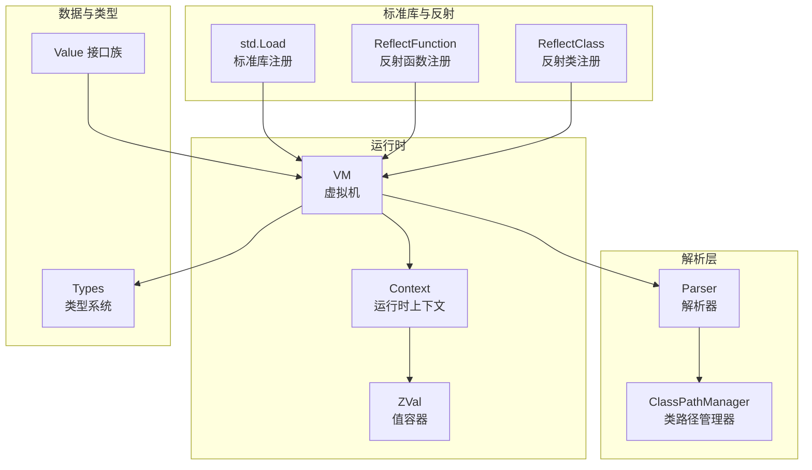
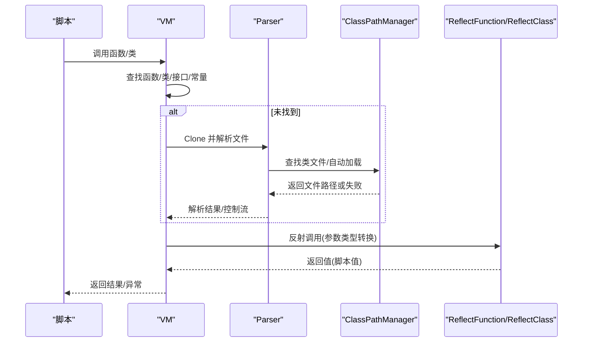
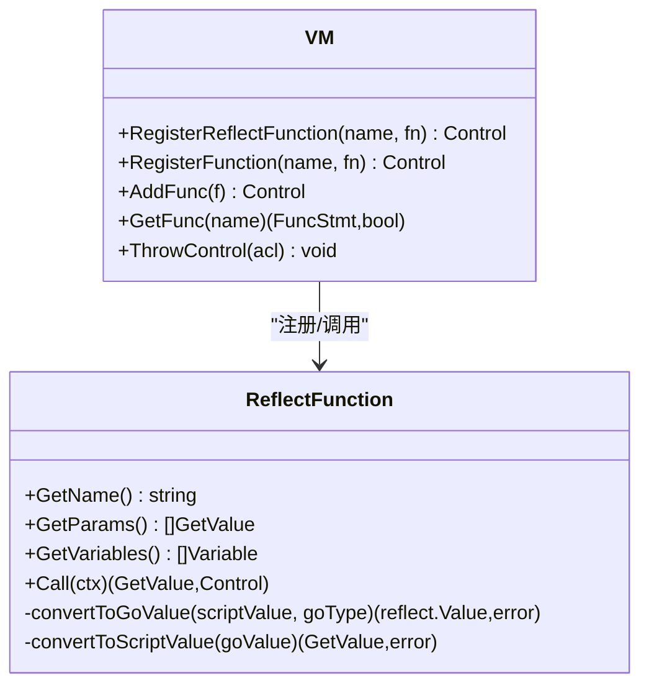
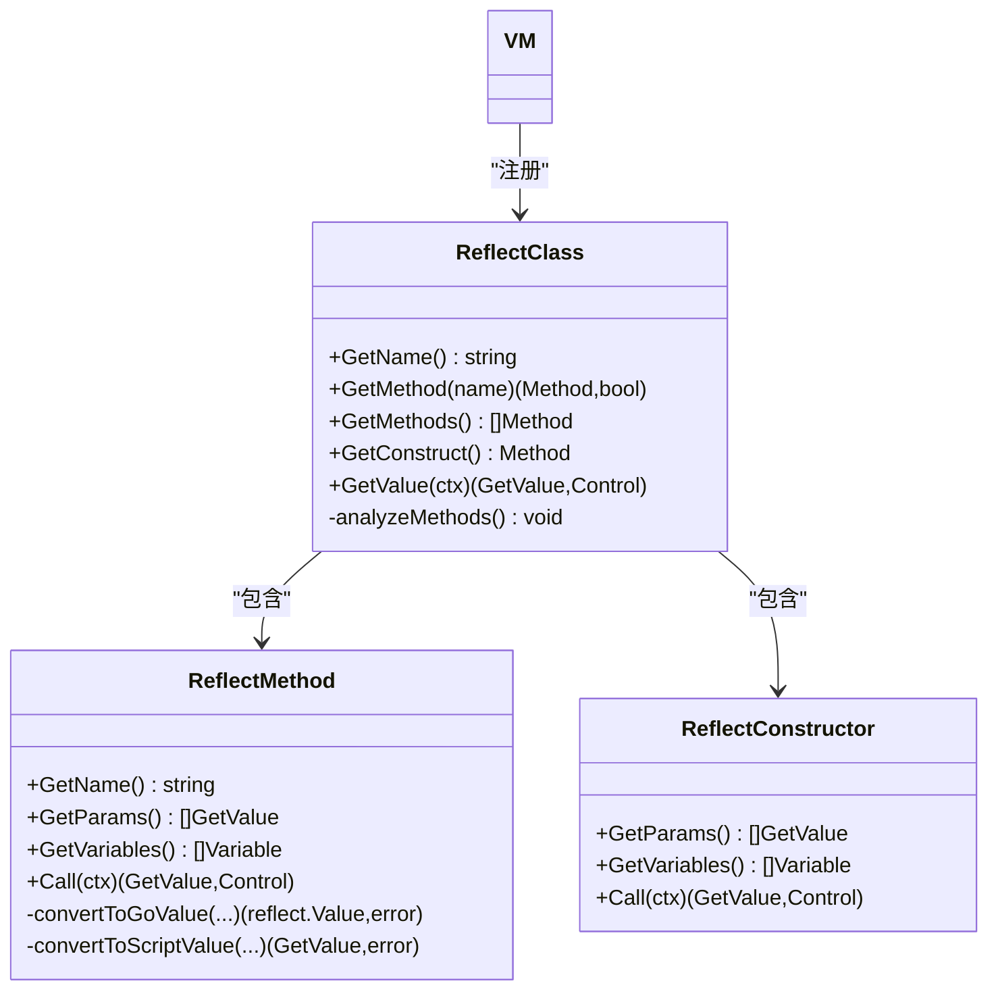
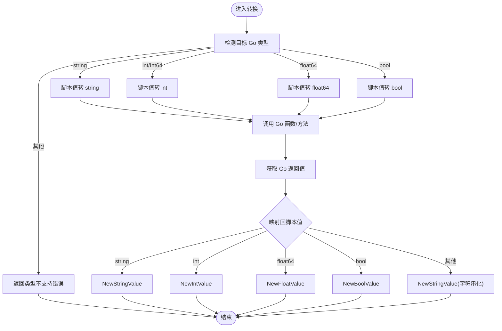
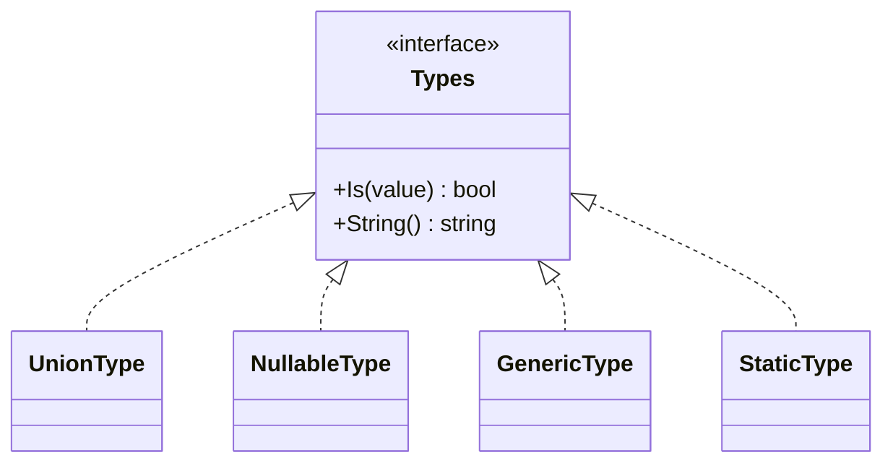
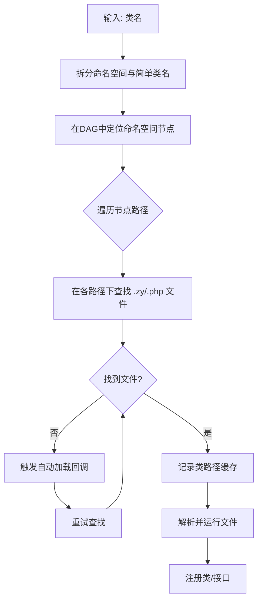
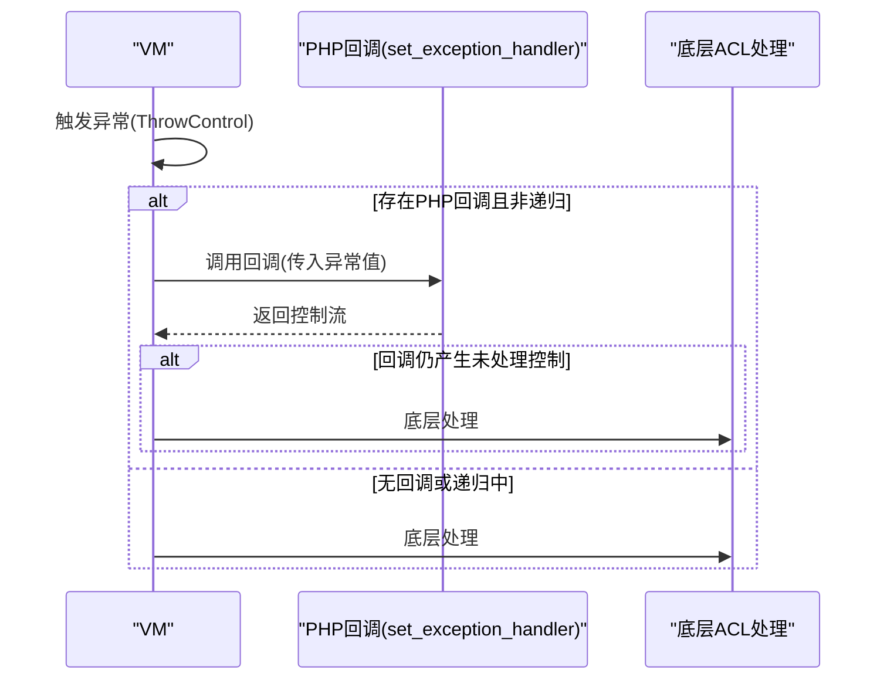
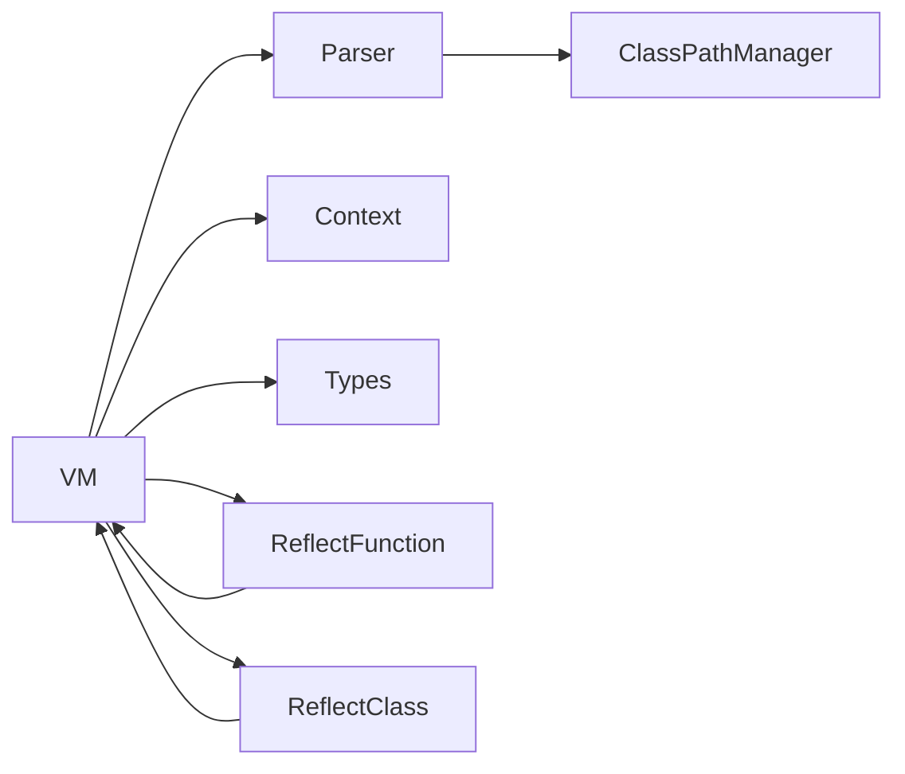

# PHP集成API

<cite>
**本文引用的文件**
- [runtime/vm.go](file://runtime/vm.go)
- [runtime/context.go](file://runtime/context.go)
- [runtime/reflect_register.go](file://runtime/reflect_register.go)
- [runtime/reflect_class.go](file://runtime/reflect_class.go)
- [parser/class_path_manager.go](file://parser/class_path_manager.go)
- [data/types.go](file://data/types.go)
- [data/value.go](file://data/value.go)
- [data/zval.go](file://data/zval.go)
- [std/load.go](file://std/load.go)
- [std/convert_object.go](file://std/convert_object.go)
- [std/convert_string.go](file://std/convert_string.go)
- [node/function.go](file://node/function.go)
- [docs/go-integration.md](file://docs/go-integration.md)
</cite>

## 目录
1. [简介](#简介)
2. [项目结构](#项目结构)
3. [核心组件](#核心组件)
4. [架构总览](#架构总览)
5. [详细组件分析](#详细组件分析)
6. [依赖分析](#依赖分析)
7. [性能考虑](#性能考虑)
8. [故障排查指南](#故障排查指南)
9. [结论](#结论)
10. [附录](#附录)

## 简介
本文件为 PHP 集成系统的完整 API 参考，聚焦于将 Go 函数与结构体无缝集成到脚本运行时，涵盖以下主题：
- Go 函数注册与调用：参数传递、返回值处理、异常转换与错误报告
- Go 结构体集成：类包装、方法调用、属性访问
- 类型转换：PHP 类型到 Go 类型的映射与转换机制
- 反射 API：动态类型检查、方法调用与属性访问
- 命名空间处理：类路径解析、类查找与自动加载
- 错误处理：异常回调、错误传播与调试

## 项目结构
系统围绕运行时虚拟机、解析器、数据模型与标准库展开，形成“解析 → 绑定 → 运行”的闭环。

图表来源
- [runtime/vm.go:14-391](file://runtime/vm.go#L14-L391)
- [runtime/context.go:12-140](file://runtime/context.go#L12-L140)
- [parser/class_path_manager.go:13-428](file://parser/class_path_manager.go#L13-L428)
- [data/types.go:1-262](file://data/types.go#L1-L262)
- [data/value.go:1-39](file://data/value.go#L1-L39)
- [data/zval.go:1-18](file://data/zval.go#L1-L18)
- [std/load.go:14-39](file://std/load.go#L14-L39)
- [runtime/reflect_register.go:180-200](file://runtime/reflect_register.go#L180-L200)
- [runtime/reflect_class.go:519-524](file://runtime/reflect_class.go#L519-L524)

章节来源
- [runtime/vm.go:14-391](file://runtime/vm.go#L14-L391)
- [runtime/context.go:12-140](file://runtime/context.go#L12-L140)
- [parser/class_path_manager.go:13-428](file://parser/class_path_manager.go#L13-L428)
- [data/types.go:1-262](file://data/types.go#L1-L262)
- [data/value.go:1-39](file://data/value.go#L1-L39)
- [data/zval.go:1-18](file://data/zval.go#L1-L18)
- [std/load.go:14-39](file://std/load.go#L14-L39)

## 核心组件
- 虚拟机 VM：负责函数/类/接口/常量/全局变量的注册与查找，异常处理回调注册，文件解析与运行
- 上下文 Context：变量符号表、命名空间、调用参数记录、VM 绑定
- 类路径管理器 ClassPathManager：命名空间到物理路径映射、类文件查找、自动加载
- 类型系统 Types：基础类型、联合类型、可空类型、泛型类型、静态类型等
- 反射注册：函数反射注册 RegisterReflectFunction 与类反射注册 RegisterReflectClass
- 标准库注册：std.Load 将内置函数、类与接口注册到 VM

章节来源
- [runtime/vm.go:14-391](file://runtime/vm.go#L14-L391)
- [runtime/context.go:12-140](file://runtime/context.go#L12-L140)
- [parser/class_path_manager.go:13-428](file://parser/class_path_manager.go#L13-L428)
- [data/types.go:1-262](file://data/types.go#L1-L262)
- [runtime/reflect_register.go:180-200](file://runtime/reflect_register.go#L180-L200)
- [runtime/reflect_class.go:519-524](file://runtime/reflect_class.go#L519-L524)
- [std/load.go:14-39](file://std/load.go#L14-L39)

## 架构总览
下图展示从脚本调用到 Go 侧执行的关键流程，包括函数/类注册、参数解析、类型转换与异常处理。

图表来源
- [runtime/vm.go:275-332](file://runtime/vm.go#L275-L332)
- [parser/class_path_manager.go:327-382](file://parser/class_path_manager.go#L327-L382)
- [runtime/reflect_register.go:66-105](file://runtime/reflect_register.go#L66-L105)
- [runtime/reflect_class.go:230-274](file://runtime/reflect_class.go#L230-L274)

## 详细组件分析

### Go 函数集成 API
- 注册方式
  - 通过 VM.RegisterReflectFunction 或 RegisterFunction 将 Go 函数注册为脚本函数
  - 通过 VM.AddFunc 注册自定义实现 data.FuncStmt 的函数
- 参数传递与类型转换
  - 反射函数在 Call 时从上下文获取参数值，逐个转换为 Go 类型
  - 支持 string/int/float64/bool 等基本类型转换；失败返回错误控制
- 返回值处理
  - 将 Go 返回值转换为脚本值（如 NewStringValue/NewIntValue 等）
- 异常与错误
  - 参数/返回值转换失败时返回控制流错误
  - VM.ThrowControl 优先调用 PHP 级 set_exception_handler 回调，否则回退至底层处理

图表来源
- [runtime/reflect_register.go:12-105](file://runtime/reflect_register.go#L12-L105)
- [runtime/reflect_register.go:180-200](file://runtime/reflect_register.go#L180-L200)
- [runtime/vm.go:245-269](file://runtime/vm.go#L245-L269)
- [runtime/vm.go:69-116](file://runtime/vm.go#L69-L116)

章节来源
- [runtime/reflect_register.go:12-105](file://runtime/reflect_register.go#L12-L105)
- [runtime/reflect_register.go:180-200](file://runtime/reflect_register.go#L180-L200)
- [runtime/vm.go:245-269](file://runtime/vm.go#L245-L269)
- [runtime/vm.go:69-116](file://runtime/vm.go#L69-L116)
- [docs/go-integration.md:16-110](file://docs/go-integration.md#L16-L110)

### Go 结构体集成 API
- 类包装与反射
  - 通过 VM.RegisterReflectClass 将 Go 结构体包装为脚本类
  - 反射类在 GetValue 时创建新的实例并分析方法，支持构造函数与公开方法
- 方法调用
  - ReflectMethod 从上下文获取参数并转换为 Go 类型，调用反射方法，再将返回值转换为脚本值
- 属性访问
  - 当前实现聚焦方法与构造函数；属性访问可通过字段名映射到公开字段或自定义 Property 实现
- 最佳实践
  - 仅暴露公开字段与方法；注意字段类型与脚本值的转换一致性

图表来源
- [runtime/reflect_class.go:12-131](file://runtime/reflect_class.go#L12-L131)
- [runtime/reflect_class.go:143-274](file://runtime/reflect_class.go#L143-L274)
- [runtime/reflect_class.go:349-448](file://runtime/reflect_class.go#L349-L448)
- [runtime/reflect_class.go:519-524](file://runtime/reflect_class.go#L519-L524)

章节来源
- [runtime/reflect_class.go:12-131](file://runtime/reflect_class.go#L12-L131)
- [runtime/reflect_class.go:143-274](file://runtime/reflect_class.go#L143-L274)
- [runtime/reflect_class.go:349-448](file://runtime/reflect_class.go#L349-L448)
- [runtime/reflect_class.go:519-524](file://runtime/reflect_class.go#L519-L524)
- [docs/go-integration.md:112-246](file://docs/go-integration.md#L112-L246)

### 类型转换 API
- PHP 到 Go 的映射
  - string → reflect.String
  - int → reflect.Int/Int64
  - float64 → reflect.Float64
  - bool → reflect.Bool
- Go 到 PHP 的映射
  - string/int/float64/bool → 对应脚本值类型
  - 其他类型 → 字符串化
- 类型系统
  - 基础类型、联合类型、可空类型、泛型类型、静态类型等统一由 Types 接口族描述

图表来源
- [runtime/reflect_register.go:107-178](file://runtime/reflect_register.go#L107-L178)
- [runtime/reflect_class.go:276-347](file://runtime/reflect_class.go#L276-L347)
- [data/types.go:142-262](file://data/types.go#L142-L262)

章节来源
- [runtime/reflect_register.go:107-178](file://runtime/reflect_register.go#L107-L178)
- [runtime/reflect_class.go:276-347](file://runtime/reflect_class.go#L276-L347)
- [data/types.go:142-262](file://data/types.go#L142-L262)

### 反射 API
- 动态类型检查
  - Types.Is(value) 判定值是否符合类型约束
  - 支持联合类型、可空类型、泛型与静态类型
- 动态方法调用
  - ReflectMethod 通过反射调用 Go 方法，参数与返回值均进行双向转换
- 动态属性访问
  - 通过字段名映射到公开字段；属性读写需结合 ZVal 与 Context 的变量表

图表来源
- [data/types.go:5-106](file://data/types.go#L5-L106)
- [data/types.go:190-262](file://data/types.go#L190-L262)

章节来源
- [data/types.go:5-106](file://data/types.go#L5-L106)
- [data/types.go:190-262](file://data/types.go#L190-L262)

### 命名空间处理 API
- 命名空间到路径映射
  - DefaultClassPathManager 维护命名空间有向无环图，支持多路径配置
- 类查找与加载
  - FindClassFile 根据命名空间与类名查找文件；LoadClass 支持自动加载与重复加载防护
- 自动加载
  - 通过 AddAutoLoad 注册自动加载回调，遇未找到类时依次调用

图表来源
- [parser/class_path_manager.go:147-209](file://parser/class_path_manager.go#L147-L209)
- [parser/class_path_manager.go:327-382](file://parser/class_path_manager.go#L327-L382)
- [parser/class_path_manager.go:384-427](file://parser/class_path_manager.go#L384-L427)

章节来源
- [parser/class_path_manager.go:147-209](file://parser/class_path_manager.go#L147-L209)
- [parser/class_path_manager.go:327-382](file://parser/class_path_manager.go#L327-L382)
- [parser/class_path_manager.go:384-427](file://parser/class_path_manager.go#L384-L427)

### 错误处理 API
- 异常回调
  - VM.SetExceptionHandler 注册 PHP 级异常处理回调；VM.ThrowControl 优先调用回调，避免递归
- 控制流与错误传播
  - data.Control 用于携带错误/返回/yield 等控制信息；VM.AddFunc/AddClass 等返回控制流以统一错误处理
- 标准库与内置函数
  - std.Load 注册 dump/string/int/bool/float/object 等内置函数，便于调试与类型转换

图表来源
- [runtime/vm.go:69-116](file://runtime/vm.go#L69-L116)
- [std/load.go:14-39](file://std/load.go#L14-L39)

章节来源
- [runtime/vm.go:69-116](file://runtime/vm.go#L69-L116)
- [std/load.go:14-39](file://std/load.go#L14-L39)

## 依赖分析
- 组件耦合
  - VM 依赖 Parser、Context、ZVal、Types；反射注册模块依赖 VM
  - ClassPathManager 与 Parser 协作完成类加载与自动加载
- 外部依赖
  - 反射 API 依赖 Go 标准库 reflect
  - 类型系统与值接口定义位于 data 包

图表来源
- [runtime/vm.go:14-391](file://runtime/vm.go#L14-L391)
- [runtime/reflect_register.go:180-200](file://runtime/reflect_register.go#L180-L200)
- [runtime/reflect_class.go:519-524](file://runtime/reflect_class.go#L519-L524)
- [parser/class_path_manager.go:13-428](file://parser/class_path_manager.go#L13-L428)

章节来源
- [runtime/vm.go:14-391](file://runtime/vm.go#L14-L391)
- [runtime/reflect_register.go:180-200](file://runtime/reflect_register.go#L180-L200)
- [runtime/reflect_class.go:519-524](file://runtime/reflect_class.go#L519-L524)
- [parser/class_path_manager.go:13-428](file://parser/class_path_manager.go#L13-L428)

## 性能考虑
- 反射调用成本较高，建议在热点路径使用直接实现的 FuncStmt/Method，减少反射开销
- 参数与返回值转换为类型断言与基本类型转换，避免复杂对象深拷贝
- 合理使用 VM 的类路径缓存与重复加载防护，减少重复解析
- 对长生命周期对象，避免在反射方法中频繁分配临时对象

## 故障排查指南
- 类/接口未找到
  - 检查命名空间路径是否正确注册；确认类文件存在且扩展名为 .zy 或 .php
  - 若使用自动加载，确认回调返回 true 且文件中确实定义了类
- 类型转换失败
  - 确认脚本传入值类型与 Go 参数类型一致；必要时在脚本侧先进行类型转换
- 异常未被捕获
  - 检查是否设置了 PHP 级异常处理回调；避免回调内部再次抛出未捕获异常导致递归
- 反射方法不可见
  - 确保方法首字母大写（公开）；参数与返回值类型受支持

章节来源
- [parser/class_path_manager.go:327-382](file://parser/class_path_manager.go#L327-L382)
- [runtime/reflect_register.go:107-178](file://runtime/reflect_register.go#L107-L178)
- [runtime/vm.go:69-116](file://runtime/vm.go#L69-L116)
- [runtime/reflect_class.go:511-517](file://runtime/reflect_class.go#L511-L517)

## 结论
本系统通过 VM、Context、反射注册与类路径管理，实现了 PHP 脚本与 Go 语言的深度集成。开发者可便捷地将 Go 函数与结构体暴露给脚本，配合完善的类型转换与错误处理机制，满足高性能与强类型需求。建议在关键路径采用直接实现而非反射，合理利用自动加载与缓存策略，以获得更优的运行时表现。

## 附录
- 集成示例与最佳实践可参考官方文档：[Go 集成指南:1-643](file://docs/go-integration.md#L1-L643)
- 标准库注册入口：[std.Load:14-39](file://std/load.go#L14-L39)
- 类型系统参考：[data/types.go:142-262](file://data/types.go#L142-L262)
- 值接口族：[data/value.go:1-39](file://data/value.go#L1-L39)
- ZVal 容器：[data/zval.go:1-18](file://data/zval.go#L1-L18)
- 函数节点与参数：[node/function.go:152-290](file://node/function.go#L152-L290)
- 类型转换函数：[std/convert_object.go:10-67](file://std/convert_object.go#L10-L67)、[std/convert_string.go:8-39](file://std/convert_string.go#L8-L39)