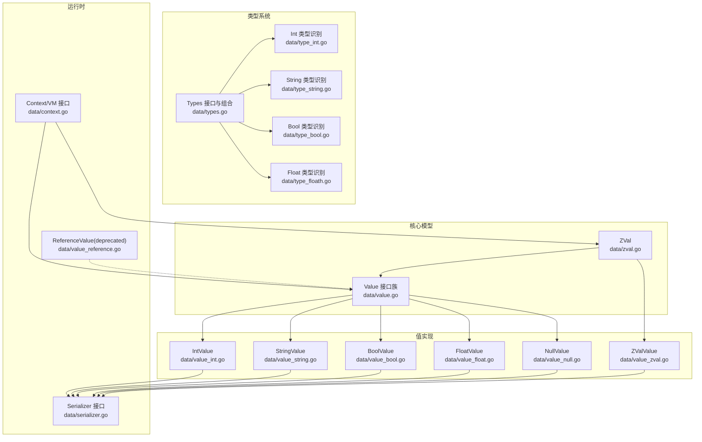
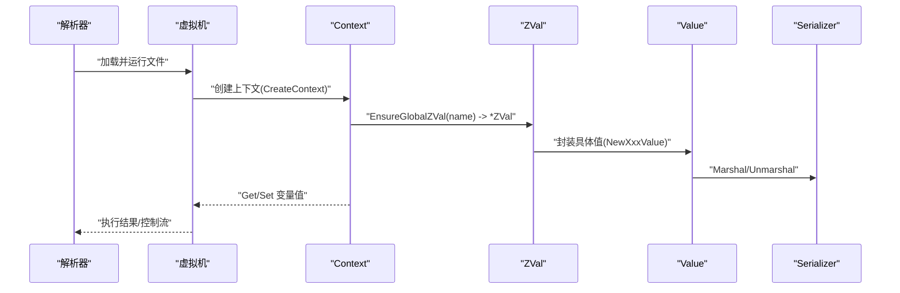
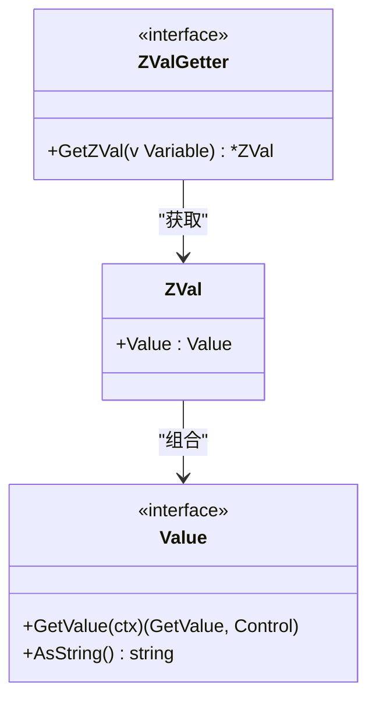
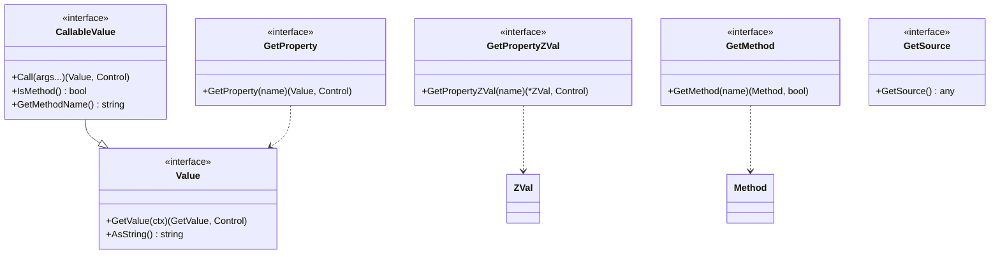
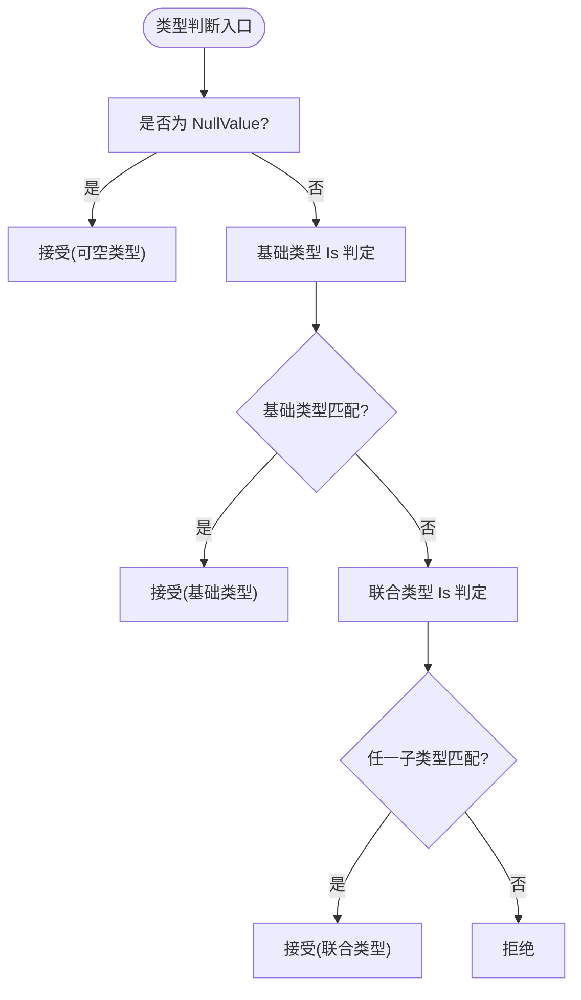
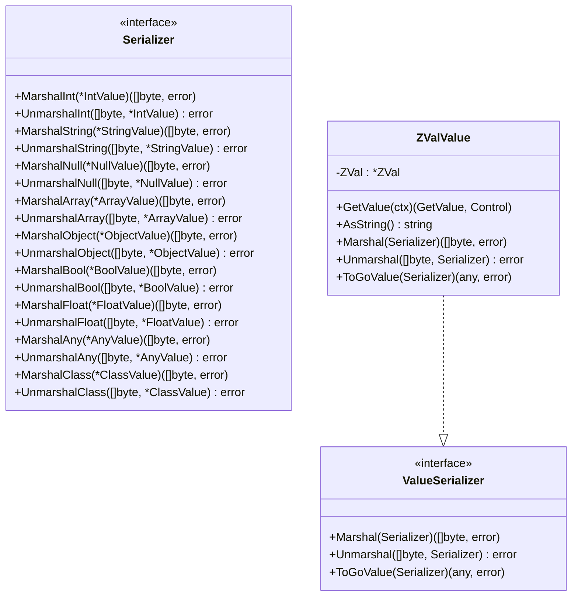
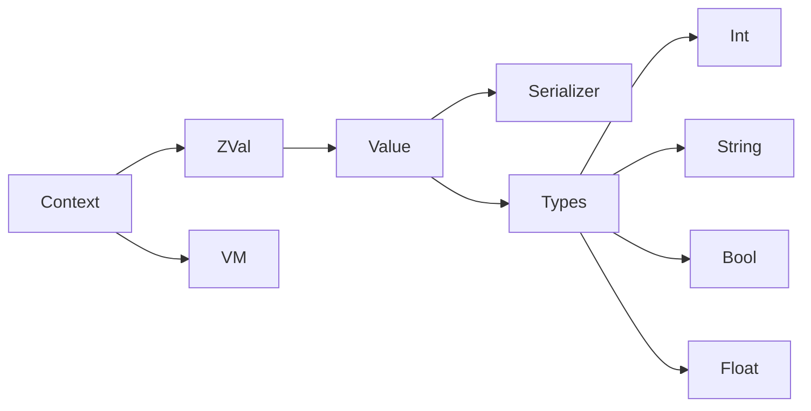

# ZVal核心结构

<cite>
**本文引用的文件**
- [zval.go](file://data/zval.go)
- [value_zval.go](file://data/value_zval.go)
- [value.go](file://data/value.go)
- [types.go](file://data/types.go)
- [type_int.go](file://data/type_int.go)
- [type_string.go](file://data/type_string.go)
- [type_bool.go](file://data/type_bool.go)
- [type_floath.go](file://data/type_floath.go)
- [value_int.go](file://data/value_int.go)
- [value_string.go](file://data/value_string.go)
- [value_bool.go](file://data/value_bool.go)
- [value_float.go](file://data/value_float.go)
- [value_null.go](file://data/value_null.go)
- [serializer.go](file://data/serializer.go)
- [context.go](file://data/context.go)
- [value_reference.go](file://data/value_reference.go)
</cite>

## 目录
1. [简介](#简介)
2. [项目结构](#项目结构)
3. [核心组件](#核心组件)
4. [架构总览](#架构总览)
5. [详细组件分析](#详细组件分析)
6. [依赖分析](#依赖分析)
7. [性能考量](#性能考量)
8. [故障排查指南](#故障排查指南)
9. [结论](#结论)
10. [附录](#附录)

## 简介
本文件系统性阐述 ZVal 的设计与实现，重点覆盖以下方面：
- 设计理念：以 Go 语言模拟 PHP 的 zval 结构，统一承载运行时值及其元信息，支持类型抽象、序列化与跨语言互操作。
- 字段结构：ZVal 包含一个 Value 接口字段，通过组合不同 Value 实现表达整数、字符串、布尔、浮点、空值、数组、对象等。
- 构造与工厂：提供 NewZVal 与各类型 Value 的 NewXxxValue 工厂方法，确保类型安全与一致性。
- Value 接口与设计模式：Value 抽象出“可取值”“字符串化”等通用能力，并通过 CallableValue、GetProperty、GetMethod 等扩展接口实现方法调用、属性访问与反射式行为。
- 生命周期与内存：ZVal 与 Value 作为值对象存在，生命周期由运行时上下文管理；序列化路径通过 Serializer 接口解耦，避免直接内存拷贝。
- 性能与最佳实践：建议优先使用具体 Value 类型，减少类型断言与装箱成本；在频繁序列化场景下复用 Serializer 实现。

## 项目结构
围绕 ZVal 的相关代码主要位于 data 目录，按职责划分为：
- 核心模型：zval.go 定义 ZVal 与工厂；value.go 定义 Value 接口族。
- 类型系统：types.go 提供类型识别与组合（联合、可空、多返回值）；type_* 系列文件定义基础类型识别器。
- 值实现：value_* 系列文件提供具体值类型（整数、字符串、布尔、浮点、空值）及序列化、类型转换方法。
- 序列化与上下文：serializer.go 定义序列化接口；context.go 定义运行时上下文、变量与 VM 接口。
- 引用与兼容：value_reference.go 提供旧版引用值实现（已标注 deprecated），便于理解历史演进。



图表来源
- [zval.go:1-18](file://data/zval.go#L1-L18)
- [value.go:1-39](file://data/value.go#L1-L39)
- [types.go:1-262](file://data/types.go#L1-L262)
- [type_int.go:1-17](file://data/type_int.go#L1-L17)
- [type_string.go:1-17](file://data/type_string.go#L1-L17)
- [type_bool.go:1-22](file://data/type_bool.go#L1-L22)
- [type_floath.go:1-16](file://data/type_floath.go#L1-L16)
- [value_int.go:1-52](file://data/value_int.go#L1-L52)
- [value_string.go:1-86](file://data/value_string.go#L1-L86)
- [value_bool.go:1-47](file://data/value_bool.go#L1-L47)
- [value_float.go:1-63](file://data/value_float.go#L1-L63)
- [value_null.go:1-45](file://data/value_null.go#L1-L45)
- [value_zval.go:1-41](file://data/value_zval.go#L1-L41)
- [serializer.go:1-31](file://data/serializer.go#L1-L31)
- [context.go:1-349](file://data/context.go#L1-L349)
- [value_reference.go:1-70](file://data/value_reference.go#L1-L70)

章节来源
- [zval.go:1-18](file://data/zval.go#L1-L18)
- [value.go:1-39](file://data/value.go#L1-L39)
- [types.go:1-262](file://data/types.go#L1-L262)
- [serializer.go:1-31](file://data/serializer.go#L1-L31)
- [context.go:1-349](file://data/context.go#L1-L349)

## 核心组件
- ZVal：承载一个 Value 的容器，对应 PHP 的 zval 结构，提供统一的值包装与传递机制。
- Value 接口族：抽象值的行为，包含取值、字符串化；扩展接口支持可调用、属性访问、方法查找、源码映射等。
- 类型识别 Types：提供类型判断与字符串化，支持联合类型、可空类型、多返回值类型等组合。
- 具体值类型：IntValue、StringValue、BoolValue、FloatValue、NullValue 等，实现序列化、类型转换与运行时行为。
- Serializer：定义序列化协议，使 Value 实现与序列化器解耦。
- Context/VM：提供变量存取、作用域管理、VM 生命周期与全局状态。

章节来源
- [zval.go:1-18](file://data/zval.go#L1-L18)
- [value.go:1-39](file://data/value.go#L1-L39)
- [types.go:1-262](file://data/types.go#L1-L262)
- [serializer.go:1-31](file://data/serializer.go#L1-L31)
- [context.go:1-349](file://data/context.go#L1-L349)

## 架构总览
ZVal 的运行时交互围绕 Context 展开：解析器生成 AST 节点，执行期通过 Context 查询变量、设置 ZVal、调用方法与访问属性。Value 通过 Serializer 支持序列化与反序列化，类型识别器贯穿赋值与返回值校验。



图表来源
- [context.go:18-64](file://data/context.go#L18-L64)
- [zval.go:8-13](file://data/zval.go#L8-L13)
- [serializer.go:3-22](file://data/serializer.go#L3-L22)

## 详细组件分析

### ZVal 结构与工厂
- 字段
  - Value: 组合具体值类型，承载真实数据与行为。
- 构造
  - NewZVal(v Value): 将任意 Value 封装为 ZVal 指针。
- 扩展
  - ZValGetter: 用于从变量中提取 ZVal 的接口，便于属性/方法访问。



图表来源
- [zval.go:4-6](file://data/zval.go#L4-L6)
- [zval.go:8-13](file://data/zval.go#L8-L13)
- [value.go:4-7](file://data/value.go#L4-L7)
- [zval.go:15-17](file://data/zval.go#L15-L17)

章节来源
- [zval.go:1-18](file://data/zval.go#L1-L18)
- [value.go:1-39](file://data/value.go#L1-L39)

### Value 接口与设计模式
- Value：统一取值与字符串化能力。
- CallableValue：扩展可调用行为（Call、IsMethod、GetMethodName）。
- 属性与方法访问：
  - SetProperty/GetProperty/GetPropertyZVal：属性写入与读取。
  - GetMethod：方法查找。
- 源映射：GetSource 提供底层源对象访问。



图表来源
- [value.go:4-38](file://data/value.go#L4-L38)

章节来源
- [value.go:1-39](file://data/value.go#L1-L39)

### 类型系统与识别
- Types 接口：Is 判断值是否匹配类型，String 返回类型字符串。
- 组合类型：
  - NullableType：可空类型，接受 NullValue 或基础类型。
  - UnionType：联合类型，任一子类型匹配即通过。
  - MultipleReturnType：多返回值类型，要求数组元素与类型列表一一对应。
- 基础类型识别器：Int/Bool/Float/String 通过类型断言或接口判定实现弱类型语义。



图表来源
- [types.go:34-49](file://data/types.go#L34-L49)
- [types.go:83-106](file://data/types.go#L83-L106)
- [types.go:51-81](file://data/types.go#L51-L81)
- [type_int.go:6-12](file://data/type_int.go#L6-L12)
- [type_bool.go:6-17](file://data/type_bool.go#L6-L17)
- [type_floath.go:6-11](file://data/type_floath.go#L6-L11)
- [type_string.go:6-11](file://data/type_string.go#L6-L11)

章节来源
- [types.go:1-262](file://data/types.go#L1-L262)
- [type_int.go:1-17](file://data/type_int.go#L1-L17)
- [type_string.go:1-17](file://data/type_string.go#L1-L17)
- [type_bool.go:1-22](file://data/type_bool.go#L1-L22)
- [type_floath.go:1-16](file://data/type_floath.go#L1-L16)

### 具体值类型与序列化
- IntValue/BoolValue/FloatValue/StringValue/NullValue：实现 GetValue、AsString、类型转换与序列化。
- ZValValue：包装 ZVal 并实现序列化桥接，委托内部 Value 的 ValueSerializer 实现。
- Serializer 接口：定义各类值的 Marshal/Unmarshal 与 ToGoValue，实现与具体序列化器解耦。



图表来源
- [serializer.go:3-31](file://data/serializer.go#L3-L31)
- [value_zval.go:5-40](file://data/value_zval.go#L5-L40)
- [value_int.go:42-51](file://data/value_int.go#L42-L51)
- [value_string.go:75-85](file://data/value_string.go#L75-L85)
- [value_bool.go:36-46](file://data/value_bool.go#L36-L46)
- [value_float.go:52-62](file://data/value_float.go#L52-L62)
- [value_null.go:35-44](file://data/value_null.go#L35-L44)

章节来源
- [serializer.go:1-31](file://data/serializer.go#L1-L31)
- [value_zval.go:1-41](file://data/value_zval.go#L1-L41)
- [value_int.go:1-52](file://data/value_int.go#L1-L52)
- [value_string.go:1-86](file://data/value_string.go#L1-L86)
- [value_bool.go:1-47](file://data/value_bool.go#L1-L47)
- [value_float.go:1-63](file://data/value_float.go#L1-L63)
- [value_null.go:1-45](file://data/value_null.go#L1-L45)

### 上下文与变量管理
- Context：提供变量存取、索引 ZVal 管理、VM 注入、调用参数记录等。
- VM：提供类/接口/函数注册、常量管理、全局 ZVal 确保等。
- Variable/Parameter：类型约束与默认值处理，SetValue 时进行类型校验。

```mermaid
sequenceDiagram
participant Ctx as "Context"
participant Var as "Variable"
participant Par as "Parameter"
participant VM as "VM"
participant Z as "ZVal"
Ctx->>Var : "SetValue(ctx, value)"
Var->>Ctx : "类型校验(Type.Is)"
alt 校验通过
Ctx-->>Var : "成功"
else 校验失败
Ctx-->>Var : "抛出错误"
end
Ctx->>Par : "GetValue(ctx)"
Par->>Ctx : "GetVariableValue(p)"
Par-->>Ctx : "返回值或默认值"
VM->>Ctx : "EnsureGlobalZVal(name) -> *ZVal"
Ctx-->>VM : "返回 ZVal 指针"
```

图表来源
- [context.go:12-20](file://data/context.go#L12-L20)
- [context.go:167-201](file://data/context.go#L167-L201)
- [context.go:230-296](file://data/context.go#L230-L296)
- [context.go:55-64](file://data/context.go#L55-L64)

章节来源
- [context.go:1-349](file://data/context.go#L1-L349)

### 引用值（已弃用）
- ReferenceValue/IndexReferenceValue：通过变量或表达式间接取值，现已标注 deprecated，仅保留兼容性用途。
- 与当前 ZVal 设计的区别：不再直接持有 Value，而是延迟到 GetValue 时再解析。

章节来源
- [value_reference.go:1-70](file://data/value_reference.go#L1-L70)

## 依赖分析
- 组件内聚与耦合
  - ZVal 与 Value 低耦合：通过接口组合，ZVal 不关心具体值类型。
  - Value 与 Serializer 解耦：通过 ValueSerializer 接口，实现与序列化器分离。
  - 类型识别器独立：Types/UnionType/NullableType 独立于具体值类型，仅依赖 Value 的类型断言或接口。
- 外部依赖
  - 运行时依赖 Context/VM 提供变量与执行环境。
  - 序列化依赖 Serializer 实现，支持多种格式（JSON/自定义）。



图表来源
- [zval.go:4-6](file://data/zval.go#L4-L6)
- [value.go:4-7](file://data/value.go#L4-L7)
- [serializer.go:3-31](file://data/serializer.go#L3-L31)
- [types.go:34-49](file://data/types.go#L34-L49)
- [type_int.go:6-12](file://data/type_int.go#L6-L12)
- [type_string.go:6-11](file://data/type_string.go#L6-L11)
- [type_bool.go:6-17](file://data/type_bool.go#L6-L17)
- [type_floath.go:6-11](file://data/type_floath.go#L6-L11)
- [context.go:12-20](file://data/context.go#L12-L20)

章节来源
- [zval.go:1-18](file://data/zval.go#L1-L18)
- [value.go:1-39](file://data/value.go#L1-L39)
- [types.go:1-262](file://data/types.go#L1-L262)
- [serializer.go:1-31](file://data/serializer.go#L1-L31)
- [context.go:1-349](file://data/context.go#L1-L349)

## 性能考量
- 类型装箱与断言
  - 优先使用具体 Value 类型（如 IntValue、StringValue）以减少断言与装箱成本。
  - 在高频路径避免重复类型判断，可在上层缓存类型信息。
- 序列化开销
  - 通过 Serializer 接口复用实现，避免在热路径中频繁创建临时对象。
  - 对大对象序列化建议分块或流式处理（若扩展实现支持）。
- 内存分配
  - ZVal 与 Value 为值对象，生命周期由 Context/VM 管理；避免在热路径中频繁分配新 ZVal。
  - 合理使用全局 ZVal 缓存（EnsureGlobalZVal）降低重复创建成本。
- 类型校验
  - 在赋值与返回前进行类型校验，尽早失败以减少后续昂贵操作。

## 故障排查指南
- 类型不匹配
  - 症状：SetValue 抛出类型不一致错误。
  - 排查：确认 Variable/Parameter 的 Types 设置与赋值值类型一致；必要时使用类型识别器验证。
- 序列化失败
  - 症状：Marshal/Unmarshal 返回错误。
  - 排查：确认 Value 实现了 ValueSerializer；检查 Serializer 实现是否支持该类型。
- ZVal 未初始化
  - 症状：GetPropertyZVal 返回空指针或访问异常。
  - 排查：使用 EnsureGlobalZVal 确保全局 ZVal 存在；检查变量索引与命名空间。
- 引用值兼容问题
  - 症状：使用已弃用的 ReferenceValue 导致行为异常。
  - 排查：替换为直接 ZVal/Value 访问方式，避免间接取值带来的延迟与不确定性。

章节来源
- [context.go:167-201](file://data/context.go#L167-L201)
- [context.go:230-296](file://data/context.go#L230-L296)
- [value_zval.go:21-40](file://data/value_zval.go#L21-L40)
- [value_reference.go:11-70](file://data/value_reference.go#L11-L70)

## 结论
ZVal 通过简洁的组合模型模拟 PHP 的 zval，将值抽象与运行时上下文解耦，既保证了类型安全，又提供了良好的扩展性。配合类型识别器与序列化接口，ZVal 能够在复杂运行时中稳定地承载与传递值，满足高性能与可维护性的双重需求。

## 附录
- 最佳实践清单
  - 使用 NewZVal 与各类型 NewXxxValue 工厂方法创建值。
  - 在赋值与返回前进行类型校验，避免运行时类型断言。
  - 优先实现 ValueSerializer 以支持序列化与跨语言互操作。
  - 使用 EnsureGlobalZVal 管理全局状态，减少重复创建。
  - 避免使用已弃用的 ReferenceValue，采用直接 ZVal/Value 访问。