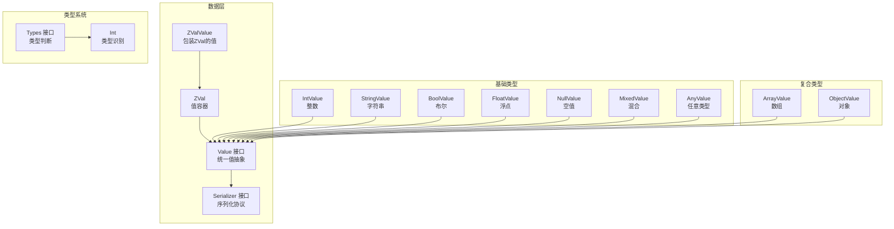
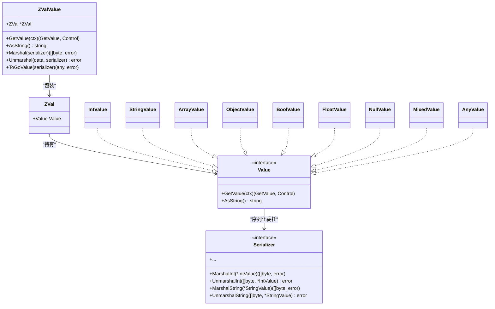
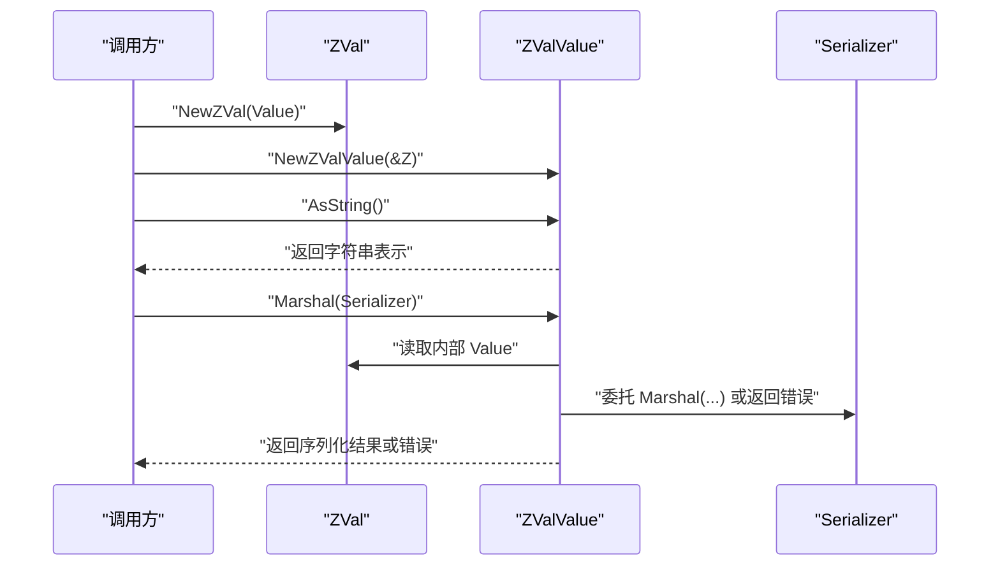
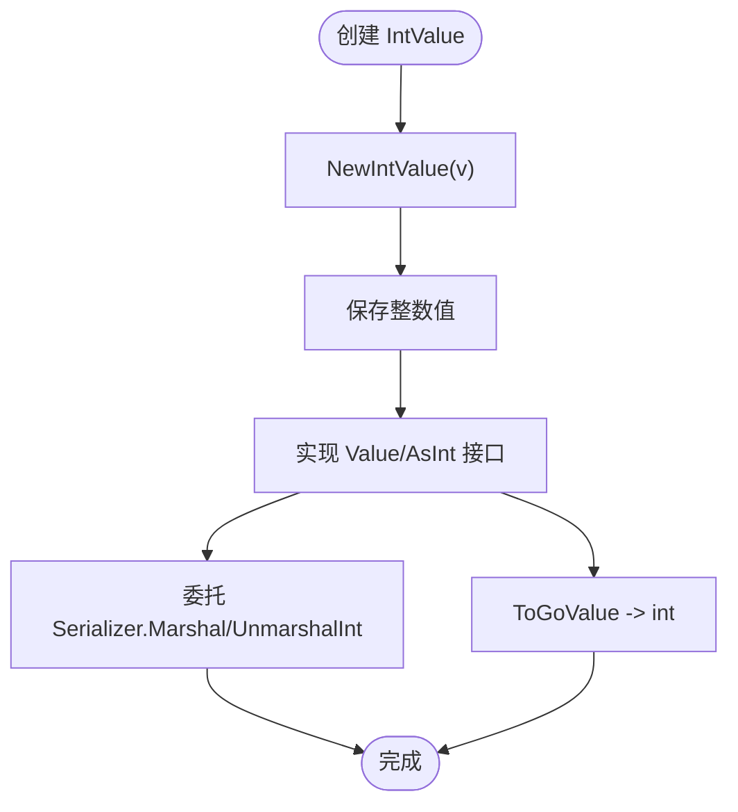
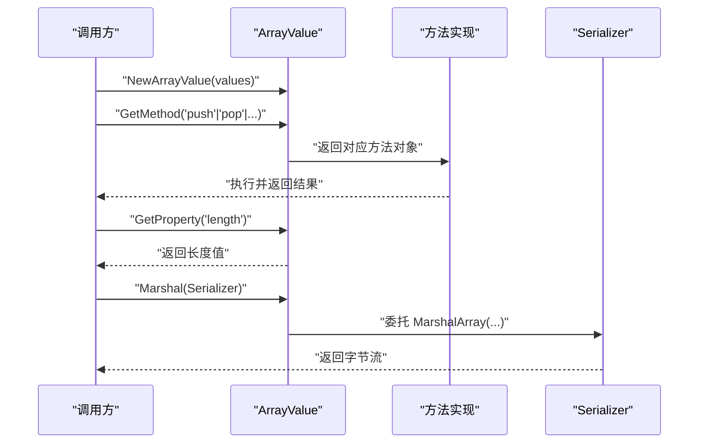
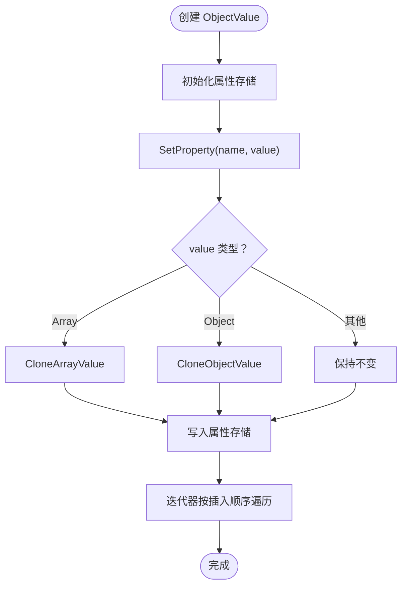
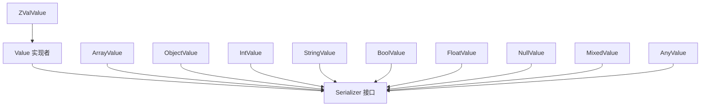

# 值包装器API

<cite>
**本文引用的文件**
- [zval.go](file://data/zval.go)
- [value.go](file://data/value.go)
- [value_zval.go](file://data/value_zval.go)
- [types.go](file://data/types.go)
- [type_int.go](file://data/type_int.go)
- [value_int.go](file://data/value_int.go)
- [value_string.go](file://data/value_string.go)
- [value_array.go](file://data/value_array.go)
- [value_object.go](file://data/value_object.go)
- [value_bool.go](file://data/value_bool.go)
- [value_null.go](file://data/value_null.go)
- [value_float.go](file://data/value_float.go)
- [value_mixed.go](file://data/value_mixed.go)
- [value_any.go](file://data/value_any.go)
- [serializer.go](file://data/serializer.go)
</cite>

## 目录
1. [简介](#简介)
2. [项目结构](#项目结构)
3. [核心组件](#核心组件)
4. [架构总览](#架构总览)
5. [详细组件分析](#详细组件分析)
6. [依赖分析](#依赖分析)
7. [性能考量](#性能考量)
8. [故障排查指南](#故障排查指南)
9. [结论](#结论)
10. [附录](#附录)

## 简介
本文件为值包装器系统的详细API文档，聚焦于ZVal与Value接口的设计与实现，涵盖以下方面：
- 值的创建、访问、修改与销毁流程
- 各类值包装器（整数、字符串、数组、对象、布尔、浮点、混合、任意类型、空值）的实现要点
- 生命周期管理、内存分配策略与性能优化
- 值的比较与类型检查机制
- 序列化与反序列化接口
- 使用示例与最佳实践

## 项目结构
值包装器系统位于data目录下，围绕Value接口与ZVal容器展开，配合类型系统Types与具体值类型实现，形成统一的运行时值模型。

**图表来源**
- [zval.go:1-18](file://data/zval.go#L1-L18)
- [value.go:1-39](file://data/value.go#L1-L39)
- [value_zval.go:1-41](file://data/value_zval.go#L1-L41)
- [serializer.go:1-31](file://data/serializer.go#L1-L31)
- [types.go:1-262](file://data/types.go#L1-L262)
- [type_int.go:1-17](file://data/type_int.go#L1-L17)
- [value_int.go:1-52](file://data/value_int.go#L1-L52)
- [value_string.go:1-86](file://data/value_string.go#L1-L86)
- [value_array.go:1-162](file://data/value_array.go#L1-L162)
- [value_object.go:1-190](file://data/value_object.go#L1-L190)
- [value_bool.go:1-47](file://data/value_bool.go#L1-L47)
- [value_null.go:1-45](file://data/value_null.go#L1-L45)
- [value_float.go:1-63](file://data/value_float.go#L1-L63)
- [value_mixed.go:1-34](file://data/value_mixed.go#L1-L34)
- [value_any.go:1-34](file://data/value_any.go#L1-L34)

**章节来源**
- [zval.go:1-18](file://data/zval.go#L1-L18)
- [value.go:1-39](file://data/value.go#L1-L39)
- [serializer.go:1-31](file://data/serializer.go#L1-L31)
- [types.go:1-262](file://data/types.go#L1-L262)

## 核心组件
- ZVal：值容器，持有Value接口实例，提供NewZVal构造函数。
- Value接口：统一的值抽象，定义GetValue与AsString；扩展接口包括CallableValue、GetProperty/PropertyZVal、GetMethod、GetSource等。
- ZValValue：将ZVal包装为Value，支持序列化协议委托给内部Value实现。
- Serializer接口：定义各类值类型的Marshal/Unmarshal与ToGoValue约定。
- Types接口与具体类型：提供类型判断与字符串化，支持联合类型、可空类型、多返回值类型等。

**章节来源**
- [zval.go:1-18](file://data/zval.go#L1-L18)
- [value.go:1-39](file://data/value.go#L1-L39)
- [value_zval.go:1-41](file://data/value_zval.go#L1-L41)
- [serializer.go:1-31](file://data/serializer.go#L1-L31)
- [types.go:1-262](file://data/types.go#L1-L262)

## 架构总览
值包装器采用“容器+接口+具体类型”的分层设计：
- 容器层：ZVal承载任意Value
- 抽象层：Value接口统一行为
- 实现层：各具体值类型实现Value及可选扩展接口
- 协议层：Serializer定义序列化契约
- 类型层：Types提供类型识别与组合

**图表来源**
- [zval.go:1-18](file://data/zval.go#L1-L18)
- [value.go:1-39](file://data/value.go#L1-L39)
- [value_zval.go:1-41](file://data/value_zval.go#L1-L41)
- [serializer.go:1-31](file://data/serializer.go#L1-L31)
- [value_int.go:1-52](file://data/value_int.go#L1-L52)
- [value_string.go:1-86](file://data/value_string.go#L1-L86)
- [value_array.go:1-162](file://data/value_array.go#L1-L162)
- [value_object.go:1-190](file://data/value_object.go#L1-L190)
- [value_bool.go:1-47](file://data/value_bool.go#L1-L47)
- [value_float.go:1-63](file://data/value_float.go#L1-L63)
- [value_null.go:1-45](file://data/value_null.go#L1-L45)
- [value_mixed.go:1-34](file://data/value_mixed.go#L1-L34)
- [value_any.go:1-34](file://data/value_any.go#L1-L34)

## 详细组件分析

### ZVal与ZValValue
- ZVal：包含Value字段，提供NewZVal工厂函数。
- ZValValue：包装*ZVal，实现Value接口；AsString通过格式化输出ZVal指针；序列化委托给内部Value实现（若其实现ValueSerializer）。

**图表来源**
- [zval.go:1-18](file://data/zval.go#L1-L18)
- [value_zval.go:1-41](file://data/value_zval.go#L1-L41)

**章节来源**
- [zval.go:1-18](file://data/zval.go#L1-L18)
- [value_zval.go:1-41](file://data/value_zval.go#L1-L41)

### 整数值 IntValue
- 创建：NewIntValue(v int)返回*IntValue
- 类型断言：实现AsInt接口，提供AsInt/AsFloat/AsBool
- 序列化：委托Serializer.Marshal/UnmarshalInt
- 转Go值：ToGoValue返回原始int

**图表来源**
- [value_int.go:1-52](file://data/value_int.go#L1-L52)

**章节来源**
- [value_int.go:1-52](file://data/value_int.go#L1-L52)
- [type_int.go:1-17](file://data/type_int.go#L1-L17)

### 字符串值 StringValue
- 创建：NewStringValue(s string)
- 方法与属性：实现Value接口；提供Get方法映射（indexOf、substring、length、toLowerCase、toUpperCase、trim、replace、split、startsWith、endsWith）；属性length返回长度
- 类型转换：AsInt/AsFloat基于字符串解析；AsBool非空即真
- 序列化：委托Serializer.Marshal/UnmarshalString

**章节来源**
- [value_string.go:1-86](file://data/value_string.go#L1-L86)

### 数组值 ArrayValue
- 创建：NewArrayValue([]Value)，内部将每个Value封装为*ZVal
- 迭代器：Current/Key/Next/Rewind/Valid实现迭代控制
- 方法映射：push/pop/shift/unshift/slice/splice/join/reverse/sort/indexOf/includes/forEach/map/filter/reduce/concat/every/some/find/findIndex/flat/flatMap
- 属性length：返回元素数量
- 序列化：委托Serializer.Marshal/UnmarshalArray
- 深拷贝策略：CloneArrayValue进行切片浅拷贝，元素仍按ZVal语义工作

**图表来源**
- [value_array.go:1-162](file://data/value_array.go#L1-L162)

**章节来源**
- [value_array.go:1-162](file://data/value_array.go#L1-L162)

### 对象值 ObjectValue
- 创建：NewObjectValue()初始化属性存储
- 拷贝策略：CloneObjectValue浅拷贝属性存储，按插入顺序复制键值对，避免共享导致的副作用
- 属性存取：SetProperty根据属性值类型（数组/对象）进行Copy-on-Write克隆；GetProperty返回属性或length
- 迭代器：按插入顺序实现Rewind/Valid/Current/Key/Next
- 序列化：委托Serializer.Marshal/UnmarshalObject
- 转Go值：ToGoValue返回序列化结果

**图表来源**
- [value_object.go:1-190](file://data/value_object.go#L1-L190)

**章节来源**
- [value_object.go:1-190](file://data/value_object.go#L1-L190)

### 布尔值 BoolValue
- 创建：NewBoolValue(v bool)
- 类型转换：AsBool返回原始布尔；AsString返回"true"/"false"
- 序列化：委托Serializer.Marshal/UnmarshalBool

**章节来源**
- [value_bool.go:1-47](file://data/value_bool.go#L1-L47)

### 浮点值 FloatValue
- 创建：NewFloatValue(v float64)
- 类型转换：AsInt/AsFloat/AsFloat32；AsBool大于0为真
- 序列化：委托Serializer.Marshal/UnmarshalFloat

**章节来源**
- [value_float.go:1-63](file://data/value_float.go#L1-L63)

### 空值 NullValue
- 创建：NewNullValue()
- 类型转换：AsInt/AsFloat返回0；AsBool返回false；AsString为空字符串
- 序列化：委托Serializer.Marshal/UnmarshalNull

**章节来源**
- [value_null.go:1-45](file://data/value_null.go#L1-L45)

### 混合值 MixedValue
- 创建：NewMixedValue(v interface{})
- 类型转换：AsInt/AsFloat/AsBool返回默认值
- 用途：承载未知或动态类型值

**章节来源**
- [value_mixed.go:1-34](file://data/value_mixed.go#L1-L34)

### 任意值 AnyValue
- 创建：NewAnyValue(v any)
- 序列化：委托Serializer.Marshal/UnmarshalAny
- 转Go值：ToGoValue返回序列化结果

**章节来源**
- [value_any.go:1-34](file://data/value_any.go#L1-L34)

### 类型系统 Types
- Types接口：Is判断值是否匹配类型；String返回类型字符串
- 支持：
  - 基础类型：int/string/bool/array/object/float/callable/static/null/self/closure
  - 联合类型：|连接的多种类型
  - 可空类型：?前缀
  - 多返回值类型：数组形式的多类型元组
  - 泛型类型：名称+类型参数列表
- 示例类型映射参考：
  - NewBaseType("int") -> Int
  - NewNullableType(Int{}) -> ?int
  - NewUnionType([]Types{Int{}, String{}}) -> int|string
  - NewMultipleReturnType([]Types{Int{}, String{}}) -> (int,string)

**章节来源**
- [types.go:1-262](file://data/types.go#L1-L262)
- [type_int.go:1-17](file://data/type_int.go#L1-L17)

## 依赖分析
- 组件耦合
  - Value实现者彼此独立，通过接口解耦
  - ZValValue依赖内部Value实现是否满足序列化协议
  - ArrayValue/ObjectValue依赖Serializer进行序列化
- 外部依赖
  - Serializer接口由上层实现提供（例如JSON序列化器）
  - 类型系统Types用于静态/运行时类型检查

**图表来源**
- [serializer.go:1-31](file://data/serializer.go#L1-L31)
- [value_zval.go:1-41](file://data/value_zval.go#L1-L41)
- [value_array.go:1-162](file://data/value_array.go#L1-L162)
- [value_object.go:1-190](file://data/value_object.go#L1-L190)
- [value_int.go:1-52](file://data/value_int.go#L1-L52)
- [value_string.go:1-86](file://data/value_string.go#L1-L86)
- [value_bool.go:1-47](file://data/value_bool.go#L1-L47)
- [value_float.go:1-63](file://data/value_float.go#L1-L63)
- [value_null.go:1-45](file://data/value_null.go#L1-L45)
- [value_mixed.go:1-34](file://data/value_mixed.go#L1-L34)
- [value_any.go:1-34](file://data/value_any.go#L1-L34)

**章节来源**
- [serializer.go:1-31](file://data/serializer.go#L1-L31)

## 性能考量
- 浅拷贝策略
  - ArrayValue.CloneArrayValue：复制切片头，元素仍共享，减少内存分配，但需注意写时复制语义下的副作用
  - ObjectValue.CloneObjectValue：复制属性存储结构，按插入顺序复制键值对，避免共享导致的并发问题
- 迭代器
  - ArrayValue/ObjectValue均维护迭代器状态，避免重复计算，提升遍历效率
- 序列化
  - 各Value实现将序列化委托给Serializer，避免在值类型内嵌套复杂逻辑，便于替换不同序列化器
- 类型检查
  - Types接口提供O(n)类型匹配（联合类型），建议在编译期或初始化阶段构建类型结构，运行时尽量复用

[本节为通用性能建议，无需特定文件来源]

## 故障排查指南
- 序列化失败
  - 现象：ZValValue/各Value在Marshal/Unmarshal时报错
  - 排查：确认内部Value是否实现了ValueSerializer；检查Serializer实现是否完整
- 类型不匹配
  - 现象：类型判断返回false
  - 排查：核对NewBaseType/NewNullableType/NewUnionType/NewMultipleReturnType的构造参数与期望类型一致
- 属性共享导致的副作用
  - 现象：对数组/对象属性修改影响其他引用
  - 排查：确保SetProperty时对数组/对象值进行CloneArrayValue/CloneObjectValue

**章节来源**
- [value_zval.go:21-40](file://data/value_zval.go#L21-L40)
- [serializer.go:24-30](file://data/serializer.go#L24-L30)
- [types.go:34-81](file://data/types.go#L34-L81)
- [value_object.go:96-107](file://data/value_object.go#L96-L107)

## 结论
值包装器系统以ZVal为核心容器，通过Value接口统一抽象，结合Serializer协议实现可插拔的序列化能力，并以Types体系提供灵活的类型判断与组合。数组与对象采用浅拷贝策略平衡性能与正确性，迭代器设计提升遍历效率。整体架构清晰、扩展性强，适合在多语言运行时中复用。

[本节为总结，无需特定文件来源]

## 附录

### API速查表
- ZVal
  - 构造：NewZVal(v Value) *ZVal
  - 访问：Value字段
- Value接口
  - 必须实现：GetValue(ctx)、AsString()
  - 可选扩展：CallableValue、GetProperty/PropertyZVal、GetMethod、GetSource
- 值类型工厂
  - NewIntValue(int)、NewStringValue(string)、NewBoolValue(bool)、NewFloatValue(float64)、NewNullValue()、NewMixedValue(interface{})、NewAnyValue(any)
- 数组与对象
  - ArrayValue：NewArrayValue([]Value)、CloneArrayValue(*ArrayValue)
  - ObjectValue：NewObjectValue()、CloneObjectValue(*ObjectValue)、SetProperty、GetProperty、迭代器方法
- 序列化
  - Serializer接口：Marshal*/Unmarshal*、ToGoValue
  - 各Value实现均委托Serializer进行序列化

**章节来源**
- [zval.go:8-13](file://data/zval.go#L8-L13)
- [value.go:3-38](file://data/value.go#L3-L38)
- [value_int.go:7-11](file://data/value_int.go#L7-L11)
- [value_string.go:8](file://data/value_string.go#L8)
- [value_array.go:7-15](file://data/value_array.go#L7-L15)
- [value_object.go:11-15](file://data/value_object.go#L11-L15)
- [serializer.go:3-22](file://data/serializer.go#L3-L22)