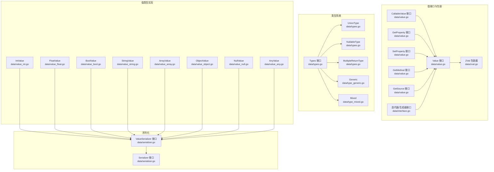
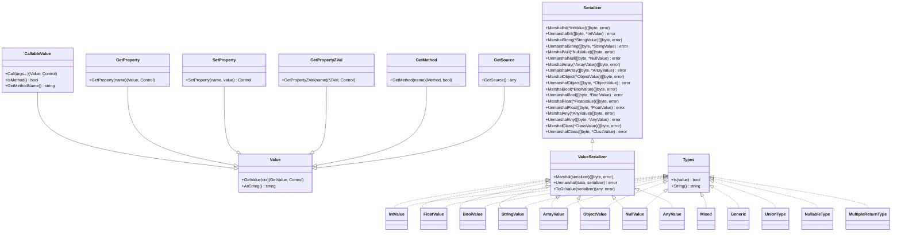
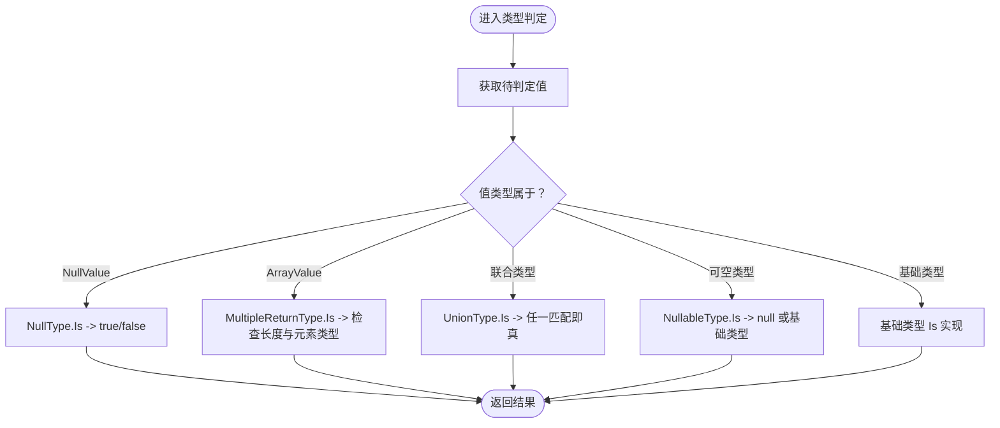
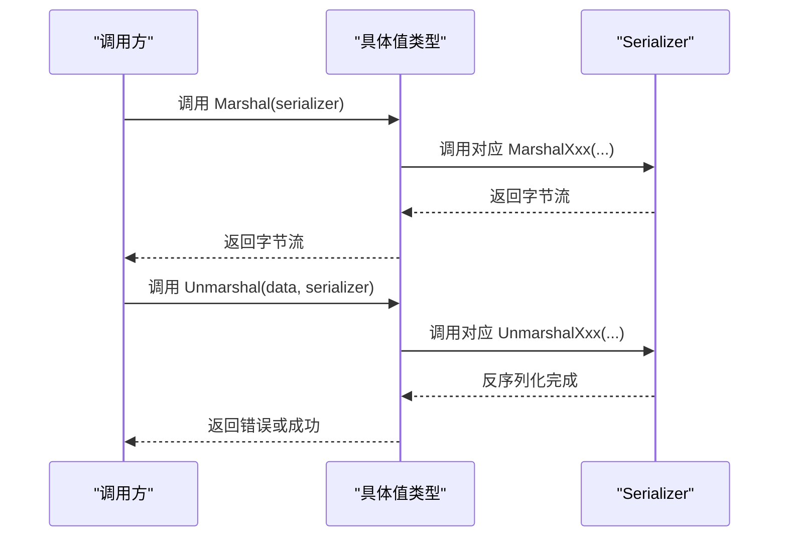
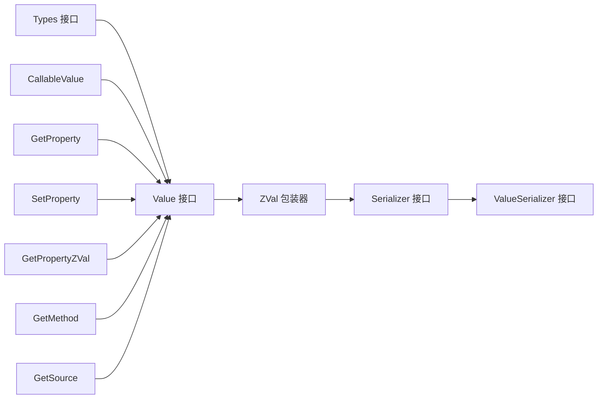

# 值操作接口

<cite>
**本文引用的文件**
- [data/value.go](file://data/value.go)
- [data/zval.go](file://data/zval.go)
- [data/serializer.go](file://data/serializer.go)
- [data/types.go](file://data/types.go)
- [data/type_generic.go](file://data/type_generic.go)
- [data/type_mixed.go](file://data/type_mixed.go)
- [data/value_any.go](file://data/value_any.go)
- [data/value_int.go](file://data/value_int.go)
- [data/value_string.go](file://data/value_string.go)
- [data/value_bool.go](file://data/value_bool.go)
- [data/value_float.go](file://data/value_float.go)
- [data/value_array.go](file://data/value_array.go)
- [data/value_object.go](file://data/value_object.go)
- [data/value_null.go](file://data/value_null.go)
- [data/interface.go](file://data/interface.go)
</cite>

## 目录
1. [简介](#简介)
2. [项目结构](#项目结构)
3. [核心组件](#核心组件)
4. [架构总览](#架构总览)
5. [详细组件分析](#详细组件分析)
6. [依赖分析](#依赖分析)
7. [性能考量](#性能考量)
8. [故障排查指南](#故障排查指南)
9. [结论](#结论)
10. [附录](#附录)

## 简介
本文件面向“值操作接口”的设计与实现，系统性梳理 Value 接口族、类型系统、序列化协议以及典型值类型的实现规范。重点覆盖以下方面：
- 值接口族：Value、CallableValue、GetProperty/SetProperty、GetMethod、GetSource 等
- 类型系统：Types 接口及常见类型（联合、可空、多返回值、泛型、Mixed）的判定与字符串化
- 序列化协议：Serializer 接口与 ValueSerializer 扩展点
- 值类型：整数、浮点、布尔、字符串、数组、对象、空值、任意值等的类型检查、转换、比较与序列化
- 克隆、赋值与销毁：针对数组与对象的 Copy-on-Write 语义与浅拷贝策略
- 扩展机制：如何新增自定义值类型与序列化器实现

## 项目结构
围绕值操作的核心目录与文件如下：
- 接口与包装：data/value.go、data/zval.go、data/interface.go
- 类型系统：data/types.go、data/type_generic.go、data/type_mixed.go
- 序列化协议：data/serializer.go
- 值类型实现：data/value_int.go、data/value_float.go、data/value_bool.go、data/value_string.go、data/value_array.go、data/value_object.go、data/value_null.go、data/value_any.go

图表来源
- [data/value.go:1-39](file://data/value.go#L1-L39)
- [data/zval.go:1-18](file://data/zval.go#L1-L18)
- [data/interface.go:1-59](file://data/interface.go#L1-L59)
- [data/types.go:1-262](file://data/types.go#L1-L262)
- [data/type_generic.go:1-18](file://data/type_generic.go#L1-L18)
- [data/type_mixed.go:1-12](file://data/type_mixed.go#L1-L12)
- [data/serializer.go:1-31](file://data/serializer.go#L1-L31)
- [data/value_int.go:1-52](file://data/value_int.go#L1-L52)
- [data/value_float.go:1-63](file://data/value_float.go#L1-L63)
- [data/value_bool.go:1-47](file://data/value_bool.go#L1-L47)
- [data/value_string.go:1-86](file://data/value_string.go#L1-L86)
- [data/value_array.go:1-162](file://data/value_array.go#L1-L162)
- [data/value_object.go:1-190](file://data/value_object.go#L1-L190)
- [data/value_null.go:1-45](file://data/value_null.go#L1-L45)
- [data/value_any.go:1-34](file://data/value_any.go#L1-L34)

章节来源
- [data/value.go:1-39](file://data/value.go#L1-L39)
- [data/zval.go:1-18](file://data/zval.go#L1-L18)
- [data/serializer.go:1-31](file://data/serializer.go#L1-L31)
- [data/types.go:1-262](file://data/types.go#L1-L262)
- [data/type_generic.go:1-18](file://data/type_generic.go#L1-L18)
- [data/type_mixed.go:1-12](file://data/type_mixed.go#L1-L12)
- [data/value_int.go:1-52](file://data/value_int.go#L1-L52)
- [data/value_float.go:1-63](file://data/value_float.go#L1-L63)
- [data/value_bool.go:1-47](file://data/value_bool.go#L1-L47)
- [data/value_string.go:1-86](file://data/value_string.go#L1-L86)
- [data/value_array.go:1-162](file://data/value_array.go#L1-L162)
- [data/value_object.go:1-190](file://data/value_object.go#L1-L190)
- [data/value_null.go:1-45](file://data/value_null.go#L1-L45)
- [data/value_any.go:1-34](file://data/value_any.go#L1-L34)
- [data/interface.go:1-59](file://data/interface.go#L1-L59)

## 核心组件
- 值接口族
  - Value：统一的值抽象，提供 GetValue 与 AsString
  - CallableValue：扩展调用能力（Call）、方法标识（IsMethod、GetMethodName）
  - GetProperty/SetProperty：属性读取与设置
  - GetPropertyZVal：以 ZVal 形式读取属性
  - GetMethod：动态获取方法
  - GetSource：获取源数据
- 类型系统
  - Types：类型判定与字符串化
  - 基础类型：Int、Float、String、Bool、Object、Arrays、Callable、NullType、StaticType、ClosureType、Mixed、Generic
  - 组合类型：UnionType、NullableType、MultipleReturnType
- 序列化协议
  - Serializer：为各值类型提供序列化/反序列化入口
  - ValueSerializer：值类型实现的序列化扩展点
- 包装器
  - ZVal：对 Value 的轻量包装，便于跨层传递

章节来源
- [data/value.go:1-39](file://data/value.go#L1-L39)
- [data/types.go:1-262](file://data/types.go#L1-L262)
- [data/serializer.go:1-31](file://data/serializer.go#L1-L31)
- [data/zval.go:1-18](file://data/zval.go#L1-L18)

## 架构总览
下图展示值接口、类型系统与序列化之间的交互关系。

图表来源
- [data/value.go:1-39](file://data/value.go#L1-L39)
- [data/serializer.go:1-31](file://data/serializer.go#L1-L31)
- [data/types.go:1-262](file://data/types.go#L1-L262)
- [data/value_int.go:1-52](file://data/value_int.go#L1-L52)
- [data/value_float.go:1-63](file://data/value_float.go#L1-L63)
- [data/value_bool.go:1-47](file://data/value_bool.go#L1-L47)
- [data/value_string.go:1-86](file://data/value_string.go#L1-L86)
- [data/value_array.go:1-162](file://data/value_array.go#L1-L162)
- [data/value_object.go:1-190](file://data/value_object.go#L1-L190)
- [data/value_null.go:1-45](file://data/value_null.go#L1-L45)
- [data/value_any.go:1-34](file://data/value_any.go#L1-L34)

## 详细组件分析

### 值接口族与职责边界
- Value：统一的值抽象，所有具体值类型均实现该接口；提供 GetValue 与 AsString
- CallableValue：用于可调用值（函数、闭包等），支持 Call、IsMethod、GetMethodName
- GetProperty/SetProperty：属性读取与设置，支持控制流返回
- GetPropertyZVal：以 ZVal 形式读取属性，便于中间层处理
- GetMethod：动态方法解析
- GetSource：暴露底层源数据（如 AST 或运行时数据）

章节来源
- [data/value.go:1-39](file://data/value.go#L1-L39)

### 类型系统与类型检查
- Types 接口：提供 Is(value) 判定与 String() 字符串化
- 基础类型
  - Int、Float、String、Bool、Object、Arrays、Callable、NullType、StaticType、ClosureType、Mixed
- 组合类型
  - UnionType：联合类型（a|b|...）
  - NullableType：可空类型（?T）
  - MultipleReturnType：多返回值类型（用于元组）
- 泛型与 Mixed
  - Generic：名称与类型参数列表
  - Mixed：任意类型

类型判定流程示意：

图表来源
- [data/types.go:34-106](file://data/types.go#L34-L106)
- [data/value_array.go:56-70](file://data/value_array.go#L56-L70)
- [data/value_null.go:23-33](file://data/value_null.go#L23-L33)

章节来源
- [data/types.go:1-262](file://data/types.go#L1-L262)
- [data/type_generic.go:1-18](file://data/type_generic.go#L1-L18)
- [data/type_mixed.go:1-12](file://data/type_mixed.go#L1-L12)

### 序列化协议与扩展点
- Serializer 接口：为每种值类型提供独立的序列化/反序列化方法
- ValueSerializer 接口：值类型实现的序列化扩展点，统一通过 Serializer 完成
- 值类型均实现 Marshal/Unmarshal/ToGoValue，确保与运行时与外部系统的互通

序列化调用时序：

图表来源
- [data/serializer.go:1-31](file://data/serializer.go#L1-L31)
- [data/value_int.go:42-47](file://data/value_int.go#L42-L47)
- [data/value_string.go:75-81](file://data/value_string.go#L75-L81)
- [data/value_bool.go:36-42](file://data/value_bool.go#L36-L42)
- [data/value_float.go:52-58](file://data/value_float.go#L52-L58)
- [data/value_array.go:143-149](file://data/value_array.go#L143-L149)
- [data/value_object.go:140-146](file://data/value_object.go#L140-L146)
- [data/value_null.go:35-40](file://data/value_null.go#L35-L40)
- [data/value_any.go:23-29](file://data/value_any.go#L23-L29)

章节来源
- [data/serializer.go:1-31](file://data/serializer.go#L1-L31)
- [data/value_int.go:1-52](file://data/value_int.go#L1-L52)
- [data/value_string.go:1-86](file://data/value_string.go#L1-L86)
- [data/value_bool.go:1-47](file://data/value_bool.go#L1-L47)
- [data/value_float.go:1-63](file://data/value_float.go#L1-L63)
- [data/value_array.go:1-162](file://data/value_array.go#L1-L162)
- [data/value_object.go:1-190](file://data/value_object.go#L1-L190)
- [data/value_null.go:1-45](file://data/value_null.go#L1-L45)
- [data/value_any.go:1-34](file://data/value_any.go#L1-L34)

### 值类型：整数、浮点、布尔、字符串
- 整数（IntValue）
  - 转换：AsInt、AsFloat、AsBool、AsString
  - 序列化：MarshalInt/UnmarshalInt
  - ToGoValue：返回原生 int
- 浮点（FloatValue）
  - 转换：AsInt、AsFloat、AsFloat32、AsBool、AsString
  - 序列化：MarshalFloat/UnmarshalFloat
  - ToGoValue：返回原生 float64
- 布尔（BoolValue）
  - 转换：AsBool、AsString
  - 序列化：MarshalBool/UnmarshalBool
  - ToGoValue：返回原生 bool
- 字符串（StringValue）
  - 转换：AsInt、AsFloat、AsBool、AsString
  - 方法：indexOf、substring、length、toLowerCase、toUpperCase、trim、replace、split、startsWith、endsWith
  - 属性：length
  - 序列化：MarshalString/UnmarshalString
  - ToGoValue：返回原生 string

章节来源
- [data/value_int.go:1-52](file://data/value_int.go#L1-L52)
- [data/value_float.go:1-63](file://data/value_float.go#L1-L63)
- [data/value_bool.go:1-47](file://data/value_bool.go#L1-L47)
- [data/value_string.go:1-86](file://data/value_string.go#L1-L86)

### 值类型：数组与对象
- 数组（ArrayValue）
  - 迭代器：Current、Key、Next、Rewind、Valid
  - 方法：push、pop、shift、unshift、slice、splice、join、reverse、sort、indexOf、includes、forEach、map、filter、reduce、concat、every、some、find、findIndex、flat、flatMap
  - 属性：length
  - 序列化：MarshalArray/UnmarshalArray
  - ToGoValue：返回序列化后的字节
  - 克隆：CloneArrayValue（浅拷贝切片，按 ZVal 语义写入不共享）
- 对象（ObjectValue）
  - 属性存储：有序映射（保持插入顺序）
  - 方法：属性读取、ZVal 读取、属性设置（含 Copy-on-Write：数组/对象属性写入时克隆）
  - 迭代器：按插入顺序遍历
  - 序列化：MarshalObject/UnmarshalObject
  - ToGoValue：返回序列化后的字节
  - 克隆：CloneObjectValue（浅拷贝属性存储，不深拷贝元素）

章节来源
- [data/value_array.go:1-162](file://data/value_array.go#L1-L162)
- [data/value_object.go:1-190](file://data/value_object.go#L1-L190)

### 值类型：空值与任意值
- 空值（NullValue）
  - 转换：AsInt、AsFloat、AsString、AsBool
  - 序列化：MarshalNull/UnmarshalNull
  - ToGoValue：返回 nil
- 任意值（AnyValue）
  - 转换：AsString（格式化输出）
  - 序列化：MarshalAny/UnmarshalAny
  - ToGoValue：返回序列化后的字节

章节来源
- [data/value_null.go:1-45](file://data/value_null.go#L1-L45)
- [data/value_any.go:1-34](file://data/value_any.go#L1-L34)

### 包装器 ZVal 与上下文
- ZVal：对 Value 的轻量包装，提供 NewZVal 工厂方法
- ZValGetter：从变量读取 ZVal
- 与 Value 的关系：ZVal.Value 指向具体值类型，贯穿 GetValue、序列化与属性访问

章节来源
- [data/zval.go:1-18](file://data/zval.go#L1-L18)

### 迭代器与生成器约束
- Iterator：Current、Key、Next、Rewind、Valid
- Generator：在 Iterator 基础上增加 Send、Throw、GetReturn
- 与值类型结合：ArrayValue、ObjectValue 实现了 Iterator 接口

章节来源
- [data/interface.go:26-59](file://data/interface.go#L26-L59)
- [data/value_array.go:37-61](file://data/value_array.go#L37-L61)
- [data/value_object.go:152-190](file://data/value_object.go#L152-L190)

## 依赖分析
- 值接口与类型系统解耦：Types 仅依赖 Value 抽象，不依赖具体值类型
- 序列化协议与值类型解耦：Serializer 提供统一入口，值类型实现 ValueSerializer
- ZVal 作为中转：贯穿 GetValue、属性访问与序列化
- 值类型内部协作：ArrayValue 与 ObjectValue 通过 ZVal 存储元素，实现共享与隔离的平衡

图表来源
- [data/value.go:1-39](file://data/value.go#L1-L39)
- [data/zval.go:1-18](file://data/zval.go#L1-L18)
- [data/serializer.go:1-31](file://data/serializer.go#L1-L31)
- [data/types.go:1-262](file://data/types.go#L1-L262)

章节来源
- [data/value.go:1-39](file://data/value.go#L1-L39)
- [data/zval.go:1-18](file://data/zval.go#L1-L18)
- [data/serializer.go:1-31](file://data/serializer.go#L1-L31)
- [data/types.go:1-262](file://data/types.go#L1-L262)

## 性能考量
- 数组浅拷贝与按 ZVal 写入
  - CloneArrayValue 仅复制切片，写入单个元素时替换对应 ZVal，避免大规模深拷贝
  - 适合频繁修改但不共享内部元素的场景
- 对象 Copy-on-Write
  - 属性写入时对数组/对象属性执行克隆，避免多变量共享同一实例导致的副作用
- 迭代器开销
  - ArrayValue/ObjectValue 的迭代器基于索引/有序映射，遍历成本低且顺序稳定
- 序列化成本
  - 不同值类型分别实现 Marshal/Unmarshal，避免不必要的装箱与反射
- ToGoValue
  - 部分操作（如数据库交互）需要原始值，ToGoValue 提供直通路径

章节来源
- [data/value_array.go:17-30](file://data/value_array.go#L17-L30)
- [data/value_object.go:17-40](file://data/value_object.go#L17-L40)
- [data/value_object.go:96-107](file://data/value_object.go#L96-L107)

## 故障排查指南
- 类型判定失败
  - 检查值是否为 NullValue，NullableType.Is 会显式允许 null
  - 检查数组长度与元素类型是否匹配 MultipleReturnType
  - 检查联合类型任一分支是否满足
- 序列化/反序列化错误
  - 确认具体值类型已实现对应 MarshalXxx/UnmarshalXxx
  - 确认 Serializer 实现完整
- 属性访问异常
  - StringValue/ArrayValue 的属性访问仅支持受控集合（如 length），其他名称会触发错误
  - ObjectValue 未找到属性时返回空值或 null
- 迭代器越界
  - 使用 Valid 检查有效性，确保在调用 Current/Key 前调用 Rewind 并循环使用 Next

章节来源
- [data/types.go:34-106](file://data/types.go#L34-L106)
- [data/value_string.go:63-69](file://data/value_string.go#L63-L69)
- [data/value_array.go:135-141](file://data/value_array.go#L135-L141)
- [data/value_object.go:79-89](file://data/value_object.go#L79-L89)
- [data/value_array.go:37-61](file://data/value_array.go#L37-L61)

## 结论
本接口体系以 Value 为核心，通过 CallableValue、GetProperty/SetProperty、GetMethod、GetSource 等扩展接口覆盖调用、属性与方法的动态解析；类型系统以 Types 为中心，支持基础类型、组合类型与字符串化；序列化协议通过 Serializer 与 ValueSerializer 解耦实现细节。数组与对象采用浅拷贝与 Copy-on-Write 语义，在性能与一致性之间取得平衡。整体设计清晰、扩展性强，适合构建高性能的运行时与工具链。

## 附录

### 值操作通用模式
- 类型检查
  - 使用 Types.Is 对值进行静态/动态类型判定
  - 对数组使用 MultipleReturnType 检查多返回值结构
- 转换
  - 优先使用 AsXxx 方法进行安全转换
  - 对字符串进行数值解析时注意错误处理
- 序列化
  - 在调用 Marshal/Unmarshal 前确保 Serializer 实现完备
  - 对需要原始值的场景使用 ToGoValue
- 迭代
  - 使用 Iterator 接口的五个方法组织遍历逻辑
  - 注意 Valid 的前置条件

### 值包装器扩展机制与自定义实现指南
- 新增值类型步骤
  - 定义结构体并实现 Value 接口（GetValue、AsString）
  - 如需序列化，实现 ValueSerializer（Marshal/Unmarshal/ToGoValue）
  - 如需类型判定，实现 Types 接口（Is/String）
  - 如需可调用，实现 CallableValue 接口
  - 如需属性访问，实现 GetProperty/SetProperty/GetPropertyZVal
  - 如需动态方法，实现 GetMethod 接口
- 新增序列化器步骤
  - 实现 Serializer 接口的全部方法
  - 在值类型中调用对应 MarshalXxx/UnmarshalXxx
- 最佳实践
  - 保持 GetValue 返回自身或可进一步 GetValue 的对象
  - AsXxx 方法应返回稳定的零值与错误
  - 属性设置时遵循 Copy-on-Write 语义，避免共享可变状态
  - 迭代器实现需保证顺序稳定与边界安全

章节来源
- [data/serializer.go:1-31](file://data/serializer.go#L1-L31)
- [data/value_int.go:15-52](file://data/value_int.go#L15-L52)
- [data/value_string.go:12-86](file://data/value_string.go#L12-L86)
- [data/value_object.go:96-107](file://data/value_object.go#L96-L107)
- [data/value_array.go:37-61](file://data/value_array.go#L37-L61)