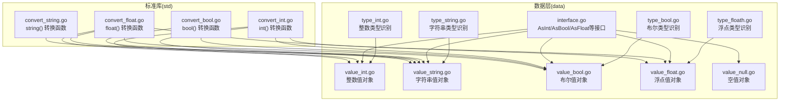
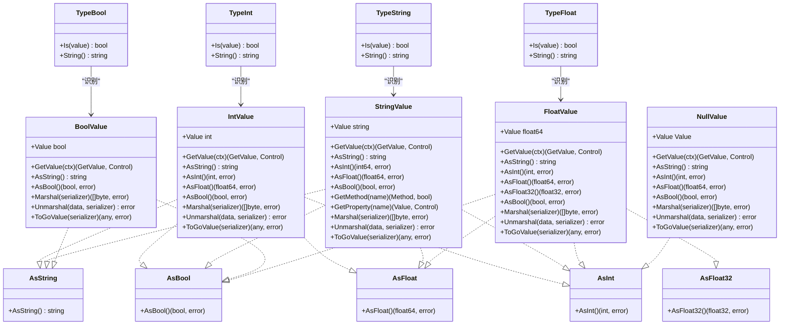
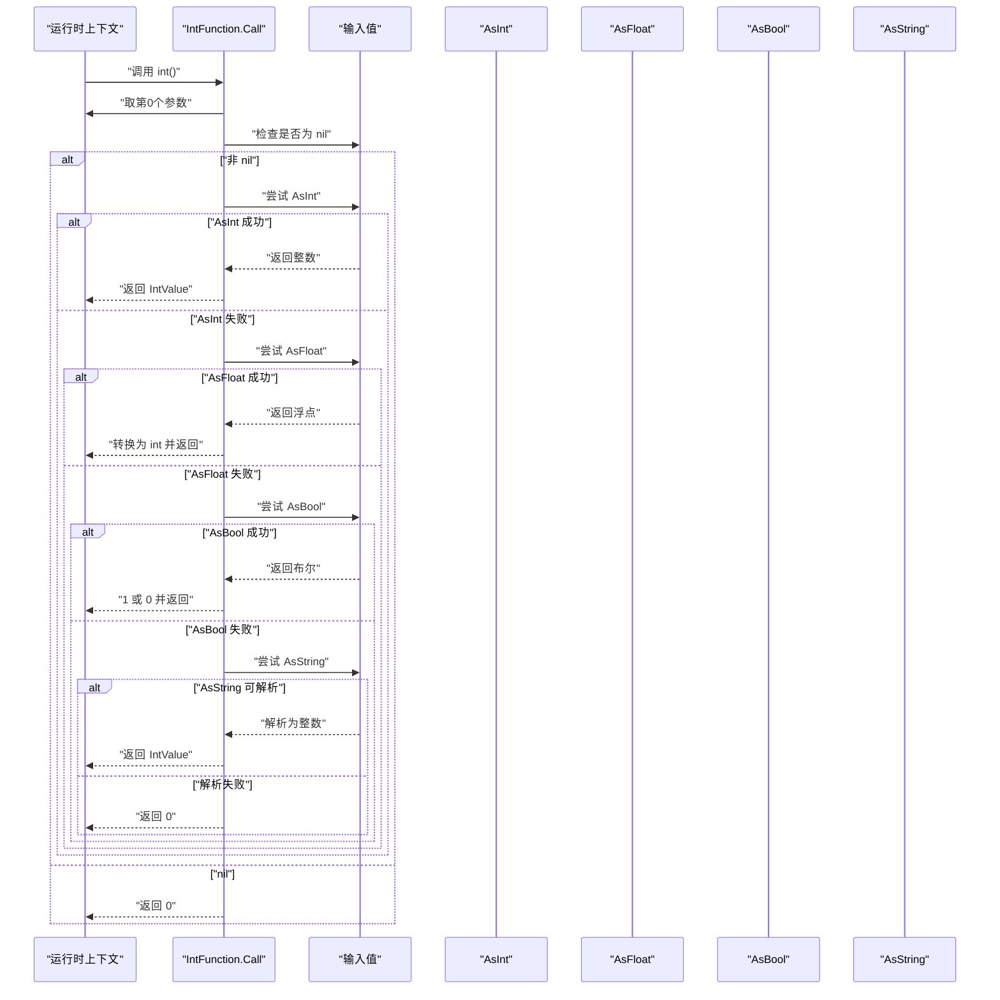
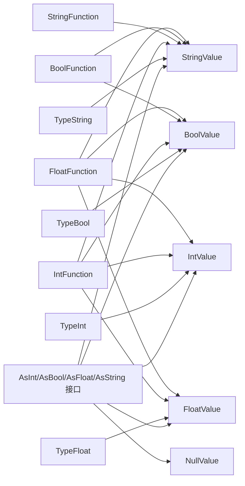

# 原始值类型

<cite>
**本文引用的文件**
- [data/type_int.go](file://data/type_int.go)
- [data/type_string.go](file://data/type_string.go)
- [data/type_bool.go](file://data/type_bool.go)
- [data/type_floath.go](file://data/type_floath.go)
- [data/value_int.go](file://data/value_int.go)
- [data/value_string.go](file://data/value_string.go)
- [data/value_bool.go](file://data/value_bool.go)
- [data/value_float.go](file://data/value_float.go)
- [data/value_null.go](file://data/value_null.go)
- [std/convert_int.go](file://std/convert_int.go)
- [std/convert_string.go](file://std/convert_string.go)
- [std/convert_bool.go](file://std/convert_bool.go)
- [std/convert_float.go](file://std/convert_float.go)
- [data/interface.go](file://data/interface.go)
</cite>

## 目录
1. [简介](#简介)
2. [项目结构](#项目结构)
3. [核心组件](#核心组件)
4. [架构总览](#架构总览)
5. [详细组件分析](#详细组件分析)
6. [依赖分析](#依赖分析)
7. [性能考虑](#性能考虑)
8. [故障排查指南](#故障排查指南)
9. [结论](#结论)
10. [附录](#附录)

## 简介
本文件系统性梳理了代码库中“原始值类型”的设计与实现，覆盖整数、字符串、布尔值、浮点数与空值五类原始值。内容包括：
- 存储机制：每种原始值的内部表示与序列化/反序列化路径
- 访问方法：如何从运行时上下文获取值、如何进行跨类型转换
- 转换规则：内置类型转换函数的行为与优先级
- 类型检查：类型识别与兼容性判断
- 比较与格式化：布尔与字符串的格式化输出策略
- 使用示例与性能优化建议：基于现有实现给出可操作指导

## 项目结构
围绕原始值类型的相关文件主要分布在 data 与 std 两个包：
- data 包含原始值的类型定义、值对象与转换接口
- std 包含与 PHP 兼容的类型转换函数（如 int、string、bool、float）

图表来源
- [data/type_int.go:1-17](file://data/type_int.go#L1-L17)
- [data/type_string.go:1-17](file://data/type_string.go#L1-L17)
- [data/type_bool.go:1-22](file://data/type_bool.go#L1-L22)
- [data/type_floath.go:1-16](file://data/type_floath.go#L1-L16)
- [data/value_int.go:1-52](file://data/value_int.go#L1-L52)
- [data/value_string.go:1-86](file://data/value_string.go#L1-L86)
- [data/value_bool.go:1-47](file://data/value_bool.go#L1-L47)
- [data/value_float.go:1-63](file://data/value_float.go#L1-L63)
- [data/value_null.go:1-45](file://data/value_null.go#L1-L45)
- [std/convert_int.go:1-65](file://std/convert_int.go#L1-L65)
- [std/convert_string.go:1-39](file://std/convert_string.go#L1-L39)
- [std/convert_bool.go:1-52](file://std/convert_bool.go#L1-L52)
- [std/convert_float.go:1-64](file://std/convert_float.go#L1-L64)
- [data/interface.go:1-59](file://data/interface.go#L1-L59)

章节来源
- [data/type_int.go:1-17](file://data/type_int.go#L1-L17)
- [data/type_string.go:1-17](file://data/type_string.go#L1-L17)
- [data/type_bool.go:1-22](file://data/type_bool.go#L1-L22)
- [data/type_floath.go:1-16](file://data/type_floath.go#L1-L16)
- [data/value_int.go:1-52](file://data/value_int.go#L1-L52)
- [data/value_string.go:1-86](file://data/value_string.go#L1-L86)
- [data/value_bool.go:1-47](file://data/value_bool.go#L1-L47)
- [data/value_float.go:1-63](file://data/value_float.go#L1-L63)
- [data/value_null.go:1-45](file://data/value_null.go#L1-L45)
- [std/convert_int.go:1-65](file://std/convert_int.go#L1-L65)
- [std/convert_string.go:1-39](file://std/convert_string.go#L1-L39)
- [std/convert_bool.go:1-52](file://std/convert_bool.go#L1-L52)
- [std/convert_float.go:1-64](file://std/convert_float.go#L1-L64)
- [data/interface.go:1-59](file://data/interface.go#L1-L59)

## 核心组件
- 类型识别器（Type Identifiers）：用于判断某个值是否属于某原始类型，例如整数、字符串、布尔、浮点。
- 值对象（Value Objects）：封装具体原始值，并提供跨类型转换、序列化、格式化等能力。
- 转换函数（Std Converters）：提供与 PHP 兼容的类型转换行为，包含优先级与回退策略。

章节来源
- [data/type_int.go:6-12](file://data/type_int.go#L6-L12)
- [data/type_string.go:6-12](file://data/type_string.go#L6-L12)
- [data/type_bool.go:6-17](file://data/type_bool.go#L6-L17)
- [data/type_floath.go:6-11](file://data/type_floath.go#L6-L11)
- [data/value_int.go:18-51](file://data/value_int.go#L18-L51)
- [data/value_string.go:16-85](file://data/value_string.go#L16-L85)
- [data/value_bool.go:17-46](file://data/value_bool.go#L17-L46)
- [data/value_float.go:25-62](file://data/value_float.go#L25-L62)
- [std/convert_int.go:14-50](file://std/convert_int.go#L14-L50)
- [std/convert_string.go:12-24](file://std/convert_string.go#L12-L24)
- [std/convert_bool.go:14-37](file://std/convert_bool.go#L14-L37)
- [std/convert_float.go:14-49](file://std/convert_float.go#L14-L49)

## 架构总览
原始值类型在运行时通过统一的 Value 接口抽象，不同原始类型以各自的值对象承载数据，并通过 AsXxx 接口族实现跨类型转换。类型识别器负责判定某值是否满足某类型要求；标准库中的转换函数提供与 PHP 兼容的转换流程。

图表来源
- [data/type_int.go:3-16](file://data/type_int.go#L3-L16)
- [data/type_string.go:3-16](file://data/type_string.go#L3-L16)
- [data/type_bool.go:3-21](file://data/type_bool.go#L3-L21)
- [data/type_floath.go:3-15](file://data/type_floath.go#L3-L15)
- [data/value_int.go:18-51](file://data/value_int.go#L18-L51)
- [data/value_string.go:16-85](file://data/value_string.go#L16-L85)
- [data/value_bool.go:17-46](file://data/value_bool.go#L17-L46)
- [data/value_float.go:25-62](file://data/value_float.go#L25-L62)
- [data/value_null.go:11-44](file://data/value_null.go#L11-L44)
- [data/interface.go:13-59](file://data/interface.go#L13-L59)

## 详细组件分析

### 整数类型（Int）
- 存储机制
  - 内部以整型字段保存值，提供 AsInt、AsString、AsFloat、AsBool 等转换方法。
  - 支持序列化与反序列化，以及与 Go 值的互转。
- 访问方法
  - 通过 GetValue 获取值容器；AsInt 返回原生整数；AsFloat 返回对应浮点；AsBool 基于大于零判断；AsString 使用十进制格式化。
- 转换规则
  - 类型识别器仅接受具体的整数值对象。
  - 标准转换函数 int() 优先尝试 AsInt/AsFloat/AsBool/AsString 的解析，最后回退为字符串解析失败则返回 0。
- 比较与格式化
  - 格式化输出为十进制字符串；布尔化规则为非零为真。
- 使用示例
  - 创建整数值对象并调用 AsInt/AsFloat/AsBool/AsString 完成跨类型访问。
  - 使用 int() 转换函数对任意可转换值进行整型转换。
- 性能优化建议
  - 避免重复字符串解析；尽量直接使用 AsInt/AsFloat/AsBool 提供的原生转换。
  - 在循环中复用已解析的中间结果，减少重复序列化/反序列化。

章节来源
- [data/value_int.go:18-51](file://data/value_int.go#L18-L51)
- [data/type_int.go:6-12](file://data/type_int.go#L6-L12)
- [std/convert_int.go:14-50](file://std/convert_int.go#L14-L50)

### 字符串类型（String）
- 存储机制
  - 内部以字符串字段保存值，提供 AsString、AsInt、AsFloat、AsBool 等转换方法。
  - 支持序列化与反序列化，以及与 Go 值的互转。
- 访问方法
  - 通过 GetValue 获取值容器；AsBool 基于非空判断；AsInt/AsFloat 使用标准库解析；支持方法与属性访问（如 length）。
- 转换规则
  - 类型识别器仅接受具体的字符串值对象。
  - 标准转换函数 string() 优先使用 AsString 接口，否则回退到通用 AsString 实现。
- 比较与格式化
  - 格式化输出即为内部字符串；布尔化规则为空字符串为假，其余为真。
- 使用示例
  - 创建字符串值对象后调用 GetMethod/GetProperty 访问字符串方法与属性。
  - 使用 string() 转换函数确保输出为字符串形式。
- 性能优化建议
  - 对频繁调用的属性（如 length）可缓存结果；避免在热路径中重复解析字符串为数字。

章节来源
- [data/value_string.go:16-85](file://data/value_string.go#L16-L85)
- [data/type_string.go:6-12](file://data/type_string.go#L6-L12)
- [std/convert_string.go:12-24](file://std/convert_string.go#L12-L24)

### 布尔类型（Bool）
- 存储机制
  - 内部以布尔字段保存值，提供 AsBool、AsString 等转换方法。
  - 支持序列化与反序列化，以及与 Go 值的互转。
- 访问方法
  - 通过 GetValue 获取值容器；AsBool 返回原生布尔；AsString 输出 "true"/"false"。
- 转换规则
  - 类型识别器对 BoolValue 严格匹配；对其他值要求实现 AsBool 接口即可视为布尔。
  - 标准转换函数 bool() 优先尝试 AsBool；若为字符串则按空白裁剪与小写映射处理，常见假值集合明确；其余默认为真。
- 比较与格式化
  - 格式化输出为 "true" 或 "false"；布尔化规则为显式假值集合外均为真。
- 使用示例
  - 创建布尔值对象并调用 AsBool/AsString 完成跨类型访问。
  - 使用 bool() 转换函数对任意可转换值进行布尔转换。
- 性能优化建议
  - 对字符串布尔转换，避免重复的小写与空白处理；可预先规范化输入。

章节来源
- [data/value_bool.go:17-46](file://data/value_bool.go#L17-L46)
- [data/type_bool.go:6-17](file://data/type_bool.go#L6-L17)
- [std/convert_bool.go:14-37](file://std/convert_bool.go#L14-L37)

### 浮点类型（Float）
- 存储机制
  - 内部以双精度浮点字段保存值，提供 AsFloat、AsFloat32、AsInt、AsBool 等转换方法。
  - 支持序列化与反序列化，以及与 Go 值的互转。
- 访问方法
  - 通过 GetValue 获取值容器；AsFloat 返回原生浮点；AsFloat32 返回单精度；AsInt 截断转换；AsBool 基于大于零判断；AsString 使用格式化输出。
- 转换规则
  - 类型识别器要求实现 AsFloat 接口。
  - 标准转换函数 float() 优先尝试 AsFloat/AsInt/AsBool/AsString 的解析，最后回退为字符串解析失败则返回 0。
- 比较与格式化
  - 格式化输出为浮点字符串；布尔化规则为非零为真。
- 使用示例
  - 创建浮点值对象并调用 AsFloat/AsFloat32/AsInt/AsBool 完成跨类型访问。
  - 使用 float() 转换函数对任意可转换值进行浮点转换。
- 性能优化建议
  - 在需要单精度场景下优先使用 AsFloat32 以节省内存；避免不必要的字符串解析。

章节来源
- [data/value_float.go:25-62](file://data/value_float.go#L25-L62)
- [data/type_floath.go:6-11](file://data/type_floath.go#L6-L11)
- [std/convert_float.go:14-49](file://std/convert_float.go#L14-L49)

### 空值类型（Null）
- 存储机制
  - 内部包装一个 Value，提供 AsString、AsInt、AsFloat、AsBool 等转换方法。
  - 支持序列化与反序列化，以及与 Go 值的互转（返回 nil）。
- 访问方法
  - 通过 GetValue 获取值容器；AsInt/AsFloat 返回 0；AsBool 返回 false；AsString 返回空字符串。
- 转换规则
  - 类型识别器要求实现 AsInt 接口（用于空值的整型化）。
  - ToGoValue 返回 nil。
- 比较与格式化
  - 格式化输出为空字符串；布尔化与数值化均返回假与零。
- 使用示例
  - 创建空值对象并调用 AsString/AsInt/AsFloat/AsBool 完成跨类型访问。
  - 使用 ToGoValue 在 Go 层面识别空值。
- 性能优化建议
  - 在 Go 层面优先使用 nil 判断而非空值对象，减少额外封装成本。

章节来源
- [data/value_null.go:11-44](file://data/value_null.go#L11-L44)

### 类型检查与兼容性
- 类型识别
  - 整数/字符串类型识别器仅接受各自的具体值对象。
  - 布尔类型识别器对 BoolValue 严格匹配，对其他值要求实现 AsBool 即可。
  - 浮点类型识别器要求实现 AsFloat 接口。
- 兼容性
  - AsInt/AsFloat/AsBool/AsString 接口族为跨类型转换提供统一入口，便于在运行时动态选择转换策略。

章节来源
- [data/type_int.go:6-12](file://data/type_int.go#L6-L12)
- [data/type_string.go:6-12](file://data/type_string.go#L6-L12)
- [data/type_bool.go:6-17](file://data/type_bool.go#L6-L17)
- [data/type_floath.go:6-11](file://data/type_floath.go#L6-L11)
- [data/interface.go:13-59](file://data/interface.go#L13-L59)

### 转换函数工作流
以下序列图展示 int() 转换函数的典型调用链路与决策分支。

图表来源
- [std/convert_int.go:14-50](file://std/convert_int.go#L14-L50)
- [data/value_int.go:30-36](file://data/value_int.go#L30-L36)
- [data/value_float.go:37-43](file://data/value_float.go#L37-L43)
- [data/value_bool.go:32-34](file://data/value_bool.go#L32-L34)
- [data/value_string.go:28-34](file://data/value_string.go#L28-L34)

## 依赖分析
- 组件耦合
  - 值对象与 AsXxx 接口强耦合，保证跨类型转换的一致性。
  - 类型识别器与值对象类型绑定，保持严格的类型边界。
  - 转换函数依赖 AsXxx 接口族，形成统一的转换协议。
- 外部依赖
  - 字符串到数字的解析依赖标准库（如字符串解析函数），影响性能与错误处理。
- 循环依赖
  - 当前结构未发现循环导入；类型识别器与值对象之间为单向依赖。

图表来源
- [data/interface.go:13-59](file://data/interface.go#L13-L59)
- [data/value_int.go:18-51](file://data/value_int.go#L18-L51)
- [data/value_string.go:16-85](file://data/value_string.go#L16-L85)
- [data/value_bool.go:17-46](file://data/value_bool.go#L17-L46)
- [data/value_float.go:25-62](file://data/value_float.go#L25-L62)
- [data/value_null.go:11-44](file://data/value_null.go#L11-L44)
- [data/type_int.go:3-16](file://data/type_int.go#L3-L16)
- [data/type_string.go:3-16](file://data/type_string.go#L3-L16)
- [data/type_bool.go:3-21](file://data/type_bool.go#L3-L21)
- [data/type_floath.go:3-15](file://data/type_floath.go#L3-L15)
- [std/convert_int.go:14-50](file://std/convert_int.go#L14-L50)
- [std/convert_string.go:12-24](file://std/convert_string.go#L12-L24)
- [std/convert_bool.go:14-37](file://std/convert_bool.go#L14-L37)
- [std/convert_float.go:14-49](file://std/convert_float.go#L14-L49)

## 性能考虑
- 解析成本
  - 字符串到整数/浮点的解析存在开销，应尽量避免在热路径重复解析。
- 转换顺序
  - 转换函数按优先级尝试 AsInt/AsFloat/AsBool/AsString，合理利用已有 AsXxx 实现可减少解析次数。
- 序列化/反序列化
  - 值对象提供 Marshal/Unmarshal，建议在批量传输或持久化时复用序列化器实例。
- 内存占用
  - 浮点类型同时提供 AsFloat32 与 AsFloat，单精度场景优先使用 AsFloat32 降低内存占用。
- 缓存策略
  - 对频繁访问的属性（如字符串长度）可缓存结果，减少重复计算。

## 故障排查指南
- 转换失败
  - 若 AsInt/AsFloat/AsBool/AsString 解析失败，转换函数通常会回退为 0/空字符串/假值。检查输入是否符合预期格式。
- 类型不匹配
  - 类型识别器对布尔与浮点有更宽松的兼容性（要求实现 AsBool/AsFloat 接口），但对整数/字符串要求严格。确认值对象类型是否正确。
- 空值处理
  - 空值对象在 Go 层面返回 nil，注意在上层逻辑中进行 nil 判断，避免误用。
- 字符串布尔映射
  - bool() 对字符串的假值集合有明确约定（如 "0"/"false"/"no"/"off"/"null"/"nil" 等）。若出现不符合预期的布尔值，检查输入是否被裁剪或大小写规范化。

章节来源
- [std/convert_int.go:14-50](file://std/convert_int.go#L14-L50)
- [std/convert_bool.go:14-37](file://std/convert_bool.go#L14-L37)
- [std/convert_float.go:14-49](file://std/convert_float.go#L14-L49)
- [data/value_null.go:42-44](file://data/value_null.go#L42-L44)

## 结论
原始值类型在本代码库中通过统一的值对象与 AsXxx 接口族实现了清晰的跨类型转换协议，配合类型识别器与标准转换函数，提供了与 PHP 兼容且可扩展的类型系统。遵循本文档的使用与优化建议，可在保证正确性的前提下提升性能与可维护性。

## 附录
- 使用示例（路径指引）
  - 整数：参考 [data/value_int.go:30-36](file://data/value_int.go#L30-L36) 与 [std/convert_int.go:14-50](file://std/convert_int.go#L14-L50)
  - 字符串：参考 [data/value_string.go:28-34](file://data/value_string.go#L28-L34) 与 [std/convert_string.go:12-24](file://std/convert_string.go#L12-L24)
  - 布尔：参考 [data/value_bool.go:32-34](file://data/value_bool.go#L32-L34) 与 [std/convert_bool.go:14-37](file://std/convert_bool.go#L14-L37)
  - 浮点：参考 [data/value_float.go:37-43](file://data/value_float.go#L37-L43) 与 [std/convert_float.go:14-49](file://std/convert_float.go#L14-L49)
  - 空值：参考 [data/value_null.go:23-33](file://data/value_null.go#L23-L33)