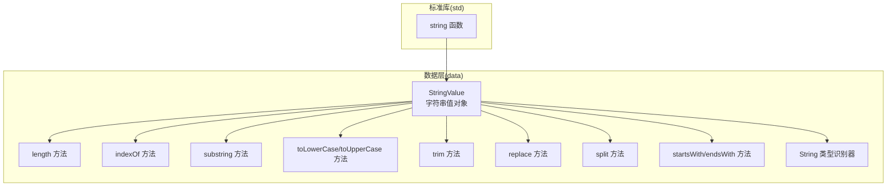
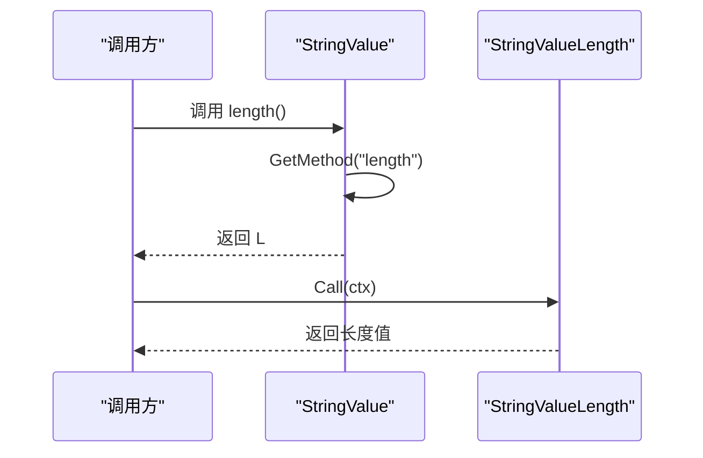
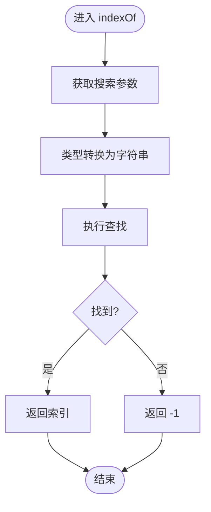
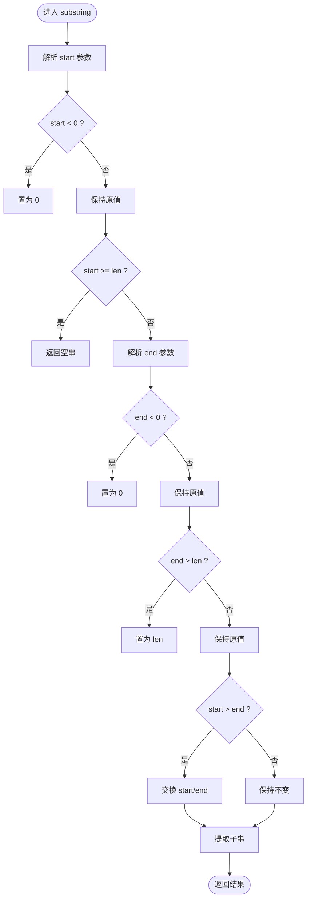
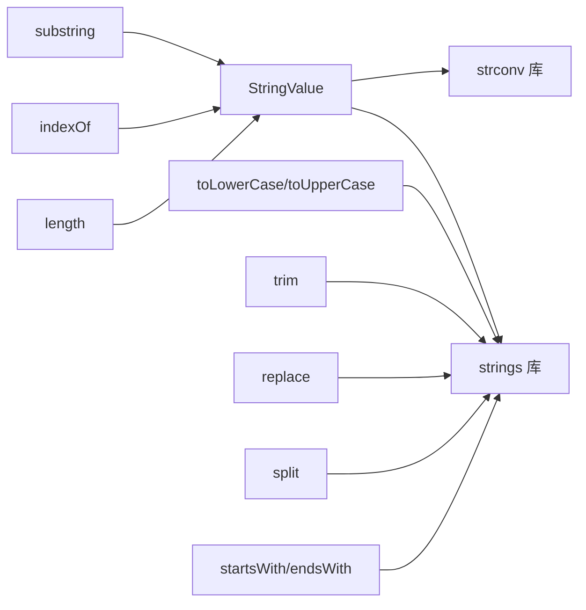

# 字符串值类型

<cite>
**本文引用的文件**
- [data/value_string.go](file://data/value_string.go)
- [data/type_string.go](file://data/type_string.go)
- [data/value_string_length.go](file://data/value_string_length.go)
- [data/value_string_index_of.go](file://data/value_string_index_of.go)
- [data/value_string_substring.go](file://data/value_string_substring.go)
- [data/value_string_to_lower_case.go](file://data/value_string_to_lower_case.go)
- [data/value_string_to_upper_case.go](file://data/value_string_to_upper_case.go)
- [data/value_string_trim.go](file://data/value_string_trim.go)
- [data/value_string_replace.go](file://data/value_string_replace.go)
- [data/value_string_split.go](file://data/value_string_split.go)
- [data/value_string_starts_with.go](file://data/value_string_starts_with.go)
- [data/value_string_ends_with.go](file://data/value_string_ends_with.go)
- [std/convert_string.go](file://std/convert_string.go)
</cite>

## 目录
1. [简介](#简介)
2. [项目结构](#项目结构)
3. [核心组件](#核心组件)
4. [架构总览](#架构总览)
5. [详细组件分析](#详细组件分析)
6. [依赖分析](#依赖分析)
7. [性能考虑](#性能考虑)
8. [故障排查指南](#故障排查指南)
9. [结论](#结论)
10. [附录：使用示例与最佳实践](#附录使用示例与最佳实践)

## 简介
本文件系统性梳理字符串值类型在运行时中的实现与API设计，覆盖字符串存储机制、字符操作方法与文本处理能力。重点包括：
- 长度计算、索引查找、子串提取
- 前缀/后缀判断、字符串替换、分割与合并
- 修剪去空格、大小写转换
- 类型识别与转换函数
- 使用示例与性能优化建议

该实现采用“值对象 + 方法表”的模式：字符串值对象持有底层字符串，通过方法表暴露标准字符串方法；同时提供类型识别与转换函数，便于与其他类型互操作。

## 项目结构
围绕字符串值类型的相关文件主要位于 data 与 std 两个目录：
- data/value_string*.go：字符串值对象及其方法实现
- data/type_string.go：字符串类型识别器
- std/convert_string.go：字符串转换函数

**图表来源**
- [data/value_string.go:1-86](file://data/value_string.go#L1-L86)
- [data/value_string_length.go:1-35](file://data/value_string_length.go#L1-L35)
- [data/value_string_index_of.go:1-77](file://data/value_string_index_of.go#L1-L77)
- [data/value_string_substring.go:1-130](file://data/value_string_substring.go#L1-L130)
- [data/value_string_to_lower_case.go:1-38](file://data/value_string_to_lower_case.go#L1-L38)
- [data/value_string_to_upper_case.go:1-38](file://data/value_string_to_upper_case.go#L1-L38)
- [data/value_string_trim.go:1-38](file://data/value_string_trim.go#L1-L38)
- [data/value_string_replace.go:1-102](file://data/value_string_replace.go#L1-L102)
- [data/value_string_split.go:1-91](file://data/value_string_split.go#L1-L91)
- [data/value_string_starts_with.go:1-72](file://data/value_string_starts_with.go#L1-L72)
- [data/value_string_ends_with.go:1-72](file://data/value_string_ends_with.go#L1-L72)
- [data/type_string.go:1-17](file://data/type_string.go#L1-L17)
- [std/convert_string.go:1-39](file://std/convert_string.go#L1-L39)

**章节来源**
- [data/value_string.go:1-86](file://data/value_string.go#L1-L86)
- [data/type_string.go:1-17](file://data/type_string.go#L1-L17)
- [std/convert_string.go:1-39](file://std/convert_string.go#L1-L39)

## 核心组件
- 字符串值对象
  - 结构：包含一个字符串字段
  - 能力：提供方法表注册、属性访问、类型序列化/反序列化、基础类型转换
- 方法表
  - 支持的方法：length、indexOf、substring、toLowerCase、toUpperCase、trim、replace、split、startsWith、endsWith
- 类型识别器
  - 判断值是否为字符串类型
- 字符串转换函数
  - 将任意值转换为字符串表示

**章节来源**
- [data/value_string.go:16-86](file://data/value_string.go#L16-L86)
- [data/type_string.go:3-16](file://data/type_string.go#L3-L16)
- [std/convert_string.go:10-24](file://std/convert_string.go#L10-L24)

## 架构总览
字符串值类型采用“值对象 + 方法表 + 类型识别 + 转换函数”的分层设计：
- 值对象负责状态与行为入口
- 方法表按需挂载具体方法实现
- 类型识别器用于类型判定
- 转换函数提供跨类型统一的字符串化能力

```mermaid
classDiagram
class StringValue {
+string Value
+GetValue(ctx) (GetValue, Control)
+AsString() string
+AsInt() (int64, error)
+AsFloat() (float64, error)
+GetMethod(name) (Method, bool)
+GetProperty(name) (Value, Control)
+AsBool() (bool, error)
+Marshal(serializer) ([]byte, error)
+Unmarshal(data, serializer) error
+ToGoValue(serializer) (any, error)
}
class StringValueLength {
+Call(ctx) (GetValue, Control)
+GetName() string
+GetModifier() Modifier
+GetIsStatic() bool
+GetParams() []GetValue
+GetVariables() []Variable
+GetReturnType() Types
}
class StringValueIndexOf {
+Call(ctx) (GetValue, Control)
+GetName() string
+GetModifier() Modifier
+GetIsStatic() bool
+GetParams() []GetValue
+GetVariables() []Variable
+GetReturnType() Types
}
class StringValueSubstring {
+Call(ctx) (GetValue, Control)
+GetName() string
+GetModifier() Modifier
+GetIsStatic() bool
+GetParams() []GetValue
+GetVariables() []Variable
+GetReturnType() Types
}
class StringValueToLowerCase {
+Call(ctx) (GetValue, Control)
+GetName() string
+GetModifier() Modifier
+GetIsStatic() bool
+GetParams() []GetValue
+GetVariables() []Variable
+GetReturnType() Types
}
class StringValueToUpperCase {
+Call(ctx) (GetValue, Control)
+GetName() string
+GetModifier() Modifier
+GetIsStatic() bool
+GetParams() []GetValue
+GetVariables() []Variable
+GetReturnType() Types
}
class StringValueTrim {
+Call(ctx) (GetValue, Control)
+GetName() string
+GetModifier() Modifier
+GetIsStatic() bool
+GetParams() []GetValue
+GetVariables() []Variable
+GetReturnType() Types
}
class StringValueReplace {
+Call(ctx) (GetValue, Control)
+GetName() string
+GetModifier() Modifier
+GetIsStatic() bool
+GetParams() []GetValue
+GetVariables() []Variable
+GetReturnType() Types
}
class StringValueSplit {
+Call(ctx) (GetValue, Control)
+GetName() string
+GetModifier() Modifier
+GetIsStatic() bool
+GetParams() []GetValue
+GetVariables() []Variable
+GetReturnType() Types
}
class StringValueStartsWith {
+Call(ctx) (GetValue, Control)
+GetName() string
+GetModifier() Modifier
+GetIsStatic() bool
+GetParams() []GetValue
+GetVariables() []Variable
+GetReturnType() Types
}
class StringValueEndsWith {
+Call(ctx) (GetValue, Control)
+GetName() string
+GetModifier() Modifier
+GetIsStatic() bool
+GetParams() []GetValue
+GetVariables() []Variable
+GetReturnType() Types
}
class String {
+Is(value) bool
+String() string
}
class StringFunction {
+Call(ctx) (GetValue, Control)
+GetName() string
+GetParams() []GetValue
+GetVariables() []Variable
}
StringValue --> StringValueLength : "注册方法"
StringValue --> StringValueIndexOf : "注册方法"
StringValue --> StringValueSubstring : "注册方法"
StringValue --> StringValueToLowerCase : "注册方法"
StringValue --> StringValueToUpperCase : "注册方法"
StringValue --> StringValueTrim : "注册方法"
StringValue --> StringValueReplace : "注册方法"
StringValue --> StringValueSplit : "注册方法"
StringValue --> StringValueStartsWith : "注册方法"
StringValue --> StringValueEndsWith : "注册方法"
String --> StringValue : "类型识别"
StringFunction --> StringValue : "构造字符串值"
```

**图表来源**
- [data/value_string.go:36-69](file://data/value_string.go#L36-L69)
- [data/value_string_length.go:3-34](file://data/value_string_length.go#L3-L34)
- [data/value_string_index_of.go:7-76](file://data/value_string_index_of.go#L7-L76)
- [data/value_string_substring.go:7-129](file://data/value_string_substring.go#L7-L129)
- [data/value_string_to_lower_case.go:5-37](file://data/value_string_to_lower_case.go#L5-L37)
- [data/value_string_to_upper_case.go:5-37](file://data/value_string_to_upper_case.go#L5-L37)
- [data/value_string_trim.go:5-37](file://data/value_string_trim.go#L5-L37)
- [data/value_string_replace.go:5-101](file://data/value_string_replace.go#L5-L101)
- [data/value_string_split.go:7-90](file://data/value_string_split.go#L7-L90)
- [data/value_string_starts_with.go:5-71](file://data/value_string_starts_with.go#L5-L71)
- [data/value_string_ends_with.go:5-71](file://data/value_string_ends_with.go#L5-L71)
- [data/type_string.go:3-16](file://data/type_string.go#L3-L16)
- [std/convert_string.go:10-24](file://std/convert_string.go#L10-L24)

## 详细组件分析

### 字符串值对象与方法表
- 存储机制
  - 内部以字符串原生存储，提供 AsString 访问
  - 支持数值转换（整数、浮点）、布尔转换、序列化/反序列化、Go 值互操作
- 方法表注册
  - 通过 GetMethod 按名称返回对应方法实例
  - 支持 length、indexOf、substring、toLowerCase、toUpperCase、trim、replace、split、startsWith、endsWith
- 属性访问
  - 支持读取 length 属性（返回整数值）

**图表来源**
- [data/value_string.go:36-69](file://data/value_string.go#L36-L69)
- [data/value_string_length.go:7-10](file://data/value_string_length.go#L7-L10)

**章节来源**
- [data/value_string.go:16-86](file://data/value_string.go#L16-L86)
- [data/value_string_length.go:1-35](file://data/value_string_length.go#L1-L35)

### 长度计算
- 行为要点
  - 返回字符串字节长度（非 Unicode 码点长度）
  - 无参数，返回整数
- 典型场景
  - 文本长度统计、边界检查

**章节来源**
- [data/value_string_length.go:1-35](file://data/value_string_length.go#L1-L35)

### 索引查找
- 行为要点
  - 接收搜索目标（可为多种类型），统一转为字符串进行查找
  - 使用内置索引查找逻辑，未命中返回 -1
- 典型场景
  - 定位子串首次出现位置

**图表来源**
- [data/value_string_index_of.go:11-47](file://data/value_string_index_of.go#L11-L47)

**章节来源**
- [data/value_string_index_of.go:1-77](file://data/value_string_index_of.go#L1-L77)

### 子串提取
- 行为要点
  - 支持 start、end 两个参数（end 可选）
  - 对 start/end 进行多类型参数解析与边界修正
  - 负索引按 0 处理；越界按边界处理；若 start > end 则交换
- 典型场景
  - 截取片段、范围提取

**图表来源**
- [data/value_string_substring.go:11-98](file://data/value_string_substring.go#L11-L98)

**章节来源**
- [data/value_string_substring.go:1-130](file://data/value_string_substring.go#L1-L130)

### 大小写转换
- toLowerCase
  - 将字符串全部转为小写
- toUpperCase
  - 将字符串全部转为大写
- 注意
  - 当前实现基于通用大小写映射，不包含区域化规则

**章节来源**
- [data/value_string_to_lower_case.go:1-38](file://data/value_string_to_lower_case.go#L1-L38)
- [data/value_string_to_upper_case.go:1-38](file://data/value_string_to_upper_case.go#L1-L38)

### 修剪去空格
- 行为要点
  - 去除字符串首尾空白字符
- 典型场景
  - 输入清洗、协议字段标准化

**章节来源**
- [data/value_string_trim.go:1-38](file://data/value_string_trim.go#L1-L38)

### 字符串替换
- 行为要点
  - 接收 search 与 replace 两个参数，均进行多类型转换
  - 执行全量替换
- 典型场景
  - 文本清洗、占位符替换

**章节来源**
- [data/value_string_replace.go:1-102](file://data/value_string_replace.go#L1-L102)

### 分割与合并
- split
  - 默认以空白字符为分隔符（保留单词边界）
  - 可传入自定义分隔符或使用默认分隔符
  - 返回数组值（元素均为字符串值）
- 合并
  - 未在当前代码中提供显式“合并”方法；可通过外部逻辑组合数组元素实现

**章节来源**
- [data/value_string_split.go:1-91](file://data/value_string_split.go#L1-L91)

### 前缀与后缀判断
- startsWith
  - 判断字符串是否以给定前缀开头
- endsWith
  - 判断字符串是否以给定后缀结尾
- 典型场景
  - 文件名/URL 校验、协议识别

**章节来源**
- [data/value_string_starts_with.go:1-72](file://data/value_string_starts_with.go#L1-L72)
- [data/value_string_ends_with.go:1-72](file://data/value_string_ends_with.go#L1-L72)

### 类型识别与转换函数
- String 类型识别器
  - Is 方法用于判断值是否为字符串类型
- string 函数
  - 将任意值转换为字符串表示（优先使用 AsString 接口）

**章节来源**
- [data/type_string.go:1-17](file://data/type_string.go#L1-L17)
- [std/convert_string.go:1-39](file://std/convert_string.go#L1-L39)

## 依赖分析
- 组件内聚与耦合
  - StringValue 与各方法实现松耦合，通过方法表注册与调用
  - 方法实现彼此独立，仅依赖字符串库与上下文参数传递
- 外部依赖
  - Go 标准库 strings 包用于大小写、前缀/后缀、分割、替换、修剪等操作
  - strconv 用于数值到字符串的转换
- 循环依赖
  - 未发现循环导入；方法实现与值对象之间为单向依赖

**图表来源**
- [data/value_string_substring.go:3-5](file://data/value_string_substring.go#L3-L5)
- [data/value_string_to_lower_case.go:3](file://data/value_string_to_lower_case.go#L3)
- [data/value_string_trim.go:3](file://data/value_string_trim.go#L3)
- [data/value_string_replace.go:3](file://data/value_string_replace.go#L3)
- [data/value_string_split.go:3-4](file://data/value_string_split.go#L3-L4)
- [data/value_string_starts_with.go:3](file://data/value_string_starts_with.go#L3)
- [data/value_string_ends_with.go:3](file://data/value_string_ends_with.go#L3)

**章节来源**
- [data/value_string_substring.go:1-130](file://data/value_string_substring.go#L1-L130)
- [data/value_string_to_lower_case.go:1-38](file://data/value_string_to_lower_case.go#L1-L38)
- [data/value_string_trim.go:1-38](file://data/value_string_trim.go#L1-L38)
- [data/value_string_replace.go:1-102](file://data/value_string_replace.go#L1-L102)
- [data/value_string_split.go:1-91](file://data/value_string_split.go#L1-L91)
- [data/value_string_starts_with.go:1-72](file://data/value_string_starts_with.go#L1-L72)
- [data/value_string_ends_with.go:1-72](file://data/value_string_ends_with.go#L1-L72)

## 性能考虑
- 字符串长度计算
  - 时间复杂度 O(1)，直接返回底层长度
- 索引查找
  - 时间复杂度近似 O(n)，n 为源串长度；建议避免在超长文本上频繁查找
- 子串提取
  - 时间复杂度 O(k)，k 为子串长度；注意 start/end 的边界修正与交换逻辑
- 大小写转换/修剪/前后缀判断
  - 时间复杂度 O(n)；strings 库已高度优化
- 替换
  - 时间复杂度 O(n+m)，n 为源串长度，m 为匹配次数；全量替换可能产生多次分配
- 分割
  - 时间复杂度 O(n)；默认按空白分割时，strings.Fields 已做高效处理
- 建议
  - 避免在热路径上对超长字符串进行重复全量替换
  - 合理缓存中间结果，减少重复转换
  - 对批量处理场景，优先使用批量接口或预处理输入

[本节为通用性能指导，无需特定文件来源]

## 故障排查指南
- 方法未找到
  - 确认方法名拼写正确且已在方法表中注册
  - 检查 GetMethod 的分支逻辑
- 参数类型异常
  - indexOf/replace/split 等方法对参数类型有容错处理；若传入未知类型，会降级为特定字符串表示
- 边界条件
  - substring 对负索引与越界有保护；如出现空串或异常截取，请核对 start/end 解析逻辑
- 大小写转换
  - 当前实现为通用映射，不包含区域化规则；如需 ICU 级别的本地化转换，需扩展实现

**章节来源**
- [data/value_string.go:36-69](file://data/value_string.go#L36-L69)
- [data/value_string_index_of.go:11-47](file://data/value_string_index_of.go#L11-L47)
- [data/value_string_replace.go:9-70](file://data/value_string_replace.go#L9-L70)
- [data/value_string_substring.go:11-98](file://data/value_string_substring.go#L11-L98)
- [data/value_string_to_lower_case.go:9-12](file://data/value_string_to_lower_case.go#L9-L12)
- [data/value_string_trim.go:9-12](file://data/value_string_trim.go#L9-L12)
- [data/value_string_starts_with.go:9-42](file://data/value_string_starts_with.go#L9-L42)
- [data/value_string_ends_with.go:9-42](file://data/value_string_ends_with.go#L9-L42)

## 结论
字符串值类型通过清晰的值对象模型与方法表设计，提供了完备的字符串操作能力。其实现遵循“单一职责、松耦合”的原则，并充分利用 Go 标准库优化关键路径。对于需要更高级别国际化与正则匹配的场景，可在现有基础上扩展相应方法，以满足更复杂的文本处理需求。

[本节为总结性内容，无需特定文件来源]

## 附录：使用示例与最佳实践
- 示例场景
  - 计算长度：调用 length 方法
  - 查找索引：调用 indexOf 并传入搜索串
  - 提取子串：调用 substring(start, end?)
  - 大小写转换：调用 toLowerCase 或 toUpperCase
  - 修剪空白：调用 trim
  - 替换文本：调用 replace(search, replace)
  - 分割字符串：调用 split(separator?)
  - 前缀/后缀判断：调用 startsWith/endsWith
- 最佳实践
  - 在热路径上避免对超长字符串进行重复全量替换
  - 合理利用默认参数（如 split 的默认空白分割）
  - 对输入进行必要的清洗与边界检查
  - 如需区域化大小写或复杂正则匹配，建议扩展相应方法并在调用侧做好性能评估

[本节为概念性内容，无需特定文件来源]