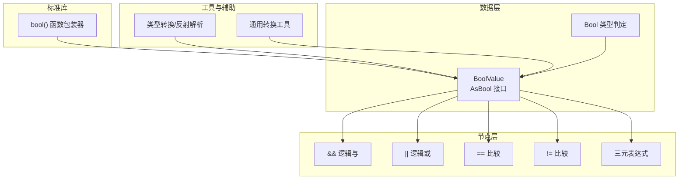
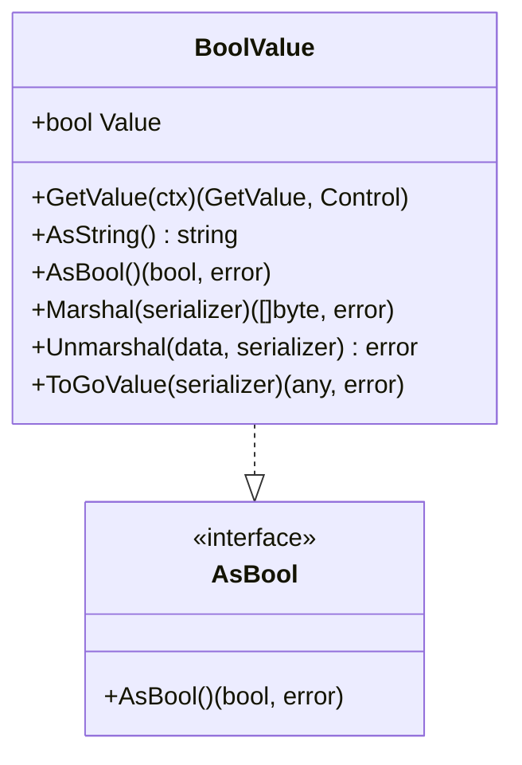
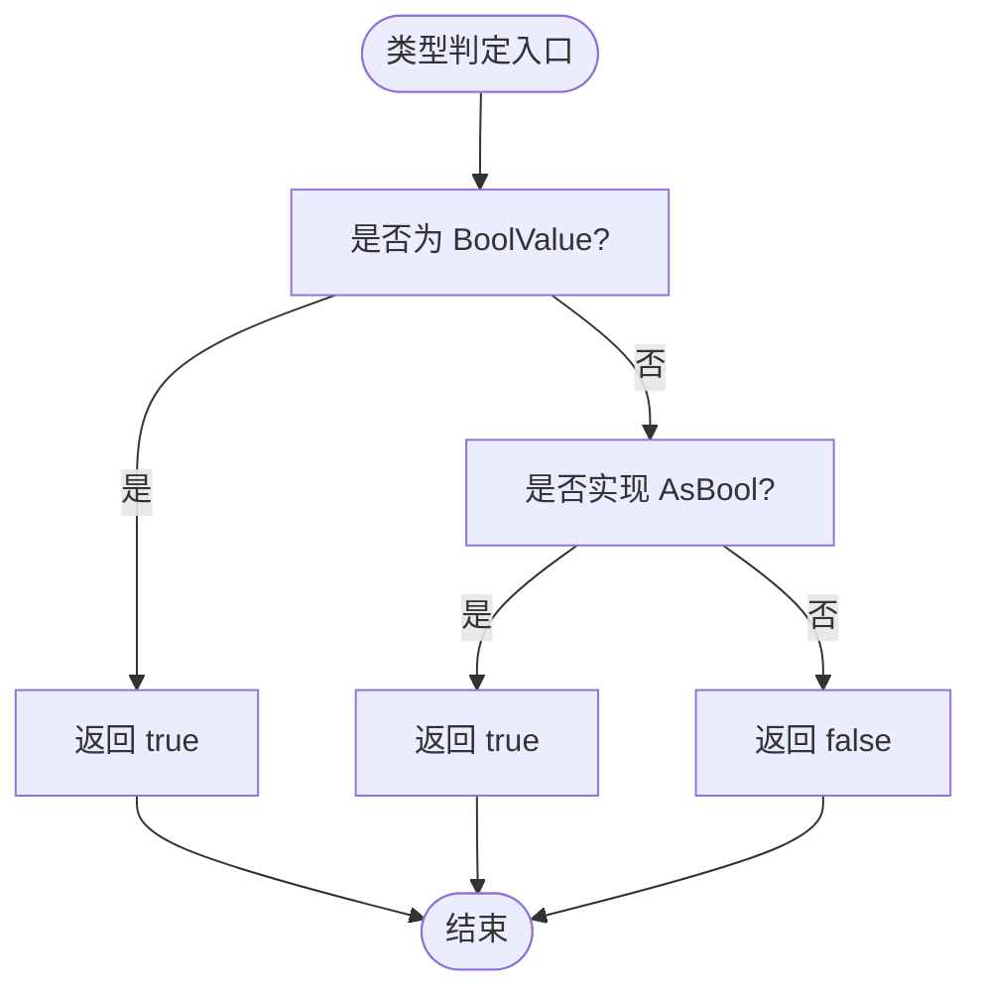
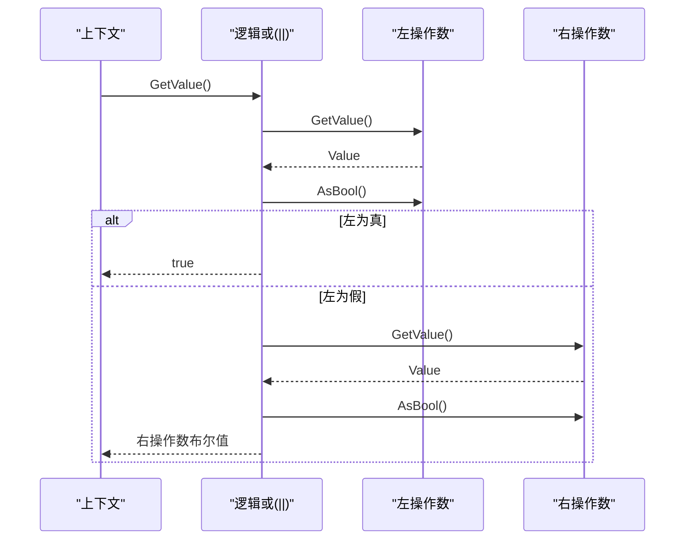
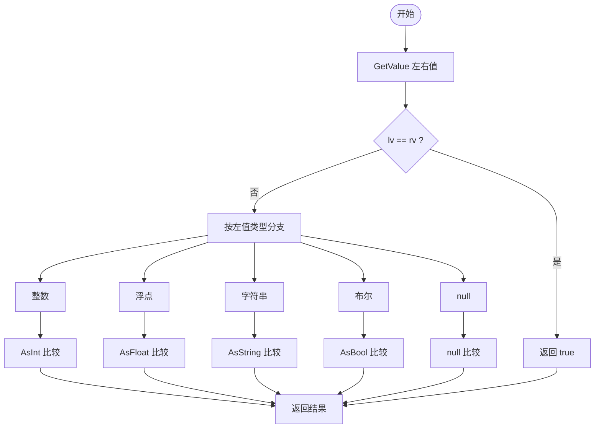
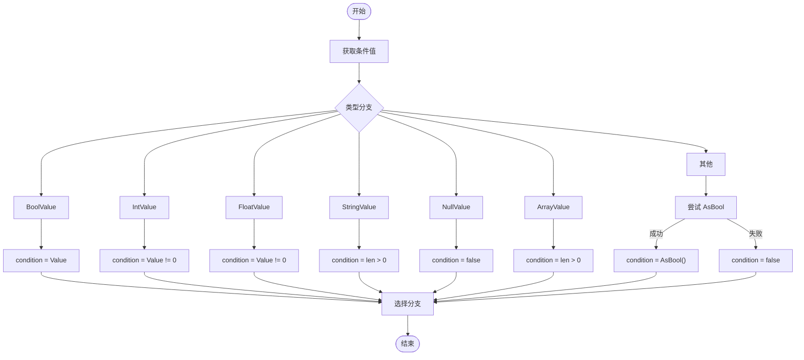
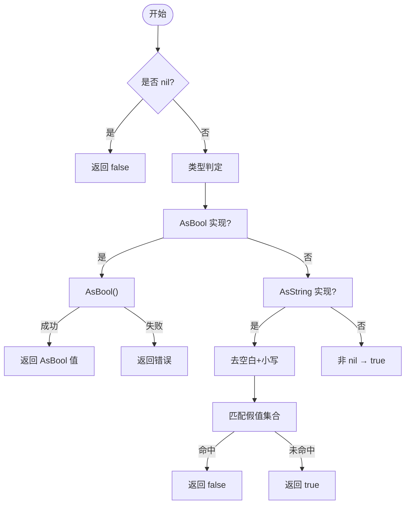
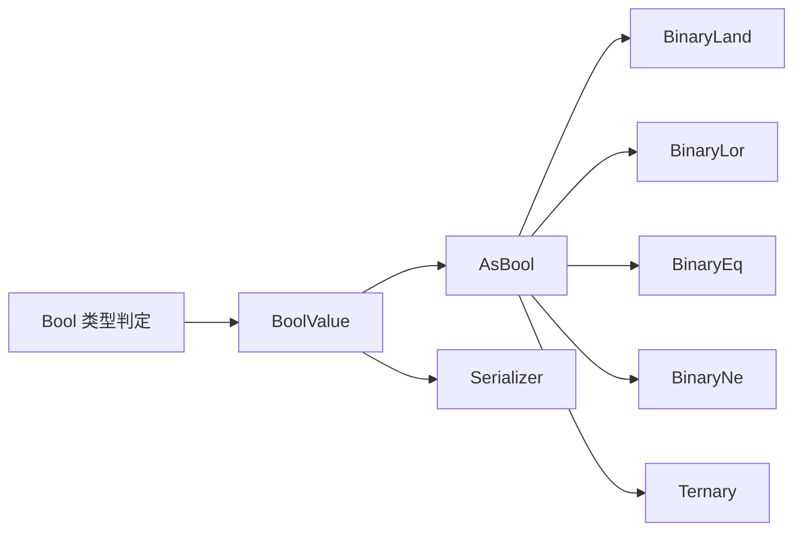

# 布尔值类型

<cite>
**本文引用的文件**
- [data/value_bool.go](file://data/value_bool.go)
- [data/type_bool.go](file://data/type_bool.go)
- [std/convert_bool.go](file://std/convert_bool.go)
- [node/binary_land.go](file://node/binary_land.go)
- [node/binary_lor.go](file://node/binary_lor.go)
- [node/binary_eq.go](file://node/binary_eq.go)
- [node/binary_ne.go](file://node/binary_ne.go)
- [node/ternary.go](file://node/ternary.go)
- [data/value_reference.go](file://data/value_reference.go)
- [data/types.go](file://data/types.go)
- [data/value.go](file://data/value.go)
- [utils/utils.go](file://utils/utils.go)
- [tests/php/bool.zy](file://tests/php/bool.zy)
</cite>

## 目录
1. [简介](#简介)
2. [项目结构](#项目结构)
3. [核心组件](#核心组件)
4. [架构总览](#架构总览)
5. [详细组件分析](#详细组件分析)
6. [依赖分析](#依赖分析)
7. [性能考量](#性能考量)
8. [故障排查指南](#故障排查指南)
9. [结论](#结论)
10. [附录](#附录)

## 简介
本文件系统化梳理布尔值类型在代码库中的实现与使用，覆盖以下方面：
- BoolValue 结构体的存储机制与接口契约
- 真值判断、逻辑与/或、比较与类型转换规则
- 与其他类型的转换逻辑与错误处理机制
- 常见使用场景与代码示例路径

## 项目结构
围绕布尔值的关键文件分布如下：
- 数据层：BoolValue、AsBool 接口、类型判定 Bool
- 标准库：bool() 函数包装器
- 节点层：逻辑与/或、比较、三元表达式求值
- 工具与辅助：类型转换、反射解析、通用转换工具



图表来源
- [data/value_bool.go:1-47](file://data/value_bool.go#L1-L47)
- [data/type_bool.go:1-22](file://data/type_bool.go#L1-L22)
- [std/convert_bool.go:1-52](file://std/convert_bool.go#L1-L52)
- [node/binary_land.go:1-49](file://node/binary_land.go#L1-L49)
- [node/binary_lor.go:1-49](file://node/binary_lor.go#L1-L49)
- [node/binary_eq.go:1-89](file://node/binary_eq.go#L1-L89)
- [node/binary_ne.go:1-85](file://node/binary_ne.go#L1-L85)
- [node/ternary.go:33-72](file://node/ternary.go#L33-L72)
- [data/value_reference.go:520-586](file://data/value_reference.go#L520-L586)
- [utils/utils.go:213-285](file://utils/utils.go#L213-L285)

章节来源
- [data/value_bool.go:1-47](file://data/value_bool.go#L1-L47)
- [data/type_bool.go:1-22](file://data/type_bool.go#L1-L22)
- [std/convert_bool.go:1-52](file://std/convert_bool.go#L1-L52)
- [node/binary_land.go:1-49](file://node/binary_land.go#L1-L49)
- [node/binary_lor.go:1-49](file://node/binary_lor.go#L1-L49)
- [node/binary_eq.go:1-89](file://node/binary_eq.go#L1-L89)
- [node/binary_ne.go:1-85](file://node/binary_ne.go#L1-L85)
- [node/ternary.go:33-72](file://node/ternary.go#L33-L72)
- [data/value_reference.go:520-586](file://data/value_reference.go#L520-L586)
- [utils/utils.go:213-285](file://utils/utils.go#L213-L285)

## 核心组件
- BoolValue：布尔值的运行时表示，实现 AsBool 接口，提供字符串化、序列化/反序列化、Go 值互操作等能力。
- AsBool 接口：统一的布尔值转换入口，支持错误传播。
- Bool 类型判定：用于类型系统中识别“可视为布尔”的值。
- 标准库 bool() 包装器：将任意输入转换为布尔值，遵循 PHP 弱类型语义。
- 节点层运算：逻辑与/或、比较、三元表达式均基于 AsBool 进行短路与类型转换。

章节来源
- [data/value_bool.go:7-47](file://data/value_bool.go#L7-L47)
- [data/type_bool.go:3-22](file://data/type_bool.go#L3-L22)
- [std/convert_bool.go:10-52](file://std/convert_bool.go#L10-L52)

## 架构总览
布尔值在系统中的流转路径：
- 输入值通过 AsBool 接口转换为布尔
- 逻辑与/或采用短路策略，遇到错误立即抛出
- 比较运算在必要时进行跨类型转换
- 三元表达式将条件值转换为布尔后选择分支

```mermaid
sequenceDiagram
participant Ctx as "上下文"
participant Left as "左操作数"
participant And as "逻辑与(&&)"
participant Right as "右操作数"
Ctx->>Left : GetValue()
Left-->>Ctx : Value
Ctx->>And : GetValue()
And->>Left : AsBool()
alt 左操作数为假
And-->>Ctx : false
else 左操作数为真
And->>Right : GetValue()
Right-->>And : Value
And->>Right : AsBool()
And-->>Ctx : 右操作数布尔值
end
```

图表来源
- [node/binary_land.go:21-48](file://node/binary_land.go#L21-L48)

## 详细组件分析

### BoolValue 结构体与接口契约
- 存储机制：内部以 bool 字段保存布尔值；NewBoolValue 提供构造入口。
- 接口实现：
  - AsBool：返回内部布尔值与错误（无错误）。
  - AsString：将布尔值格式化为字符串字面量。
  - 序列化：委托给 Serializer 的 MarshalBool/UnmarshalBool。
  - ToGoValue：返回 Go 原生 bool。
- 价值定位：作为运行时最小可用布尔单元，贯穿求值、比较、序列化等环节。



图表来源
- [data/value_bool.go:13-47](file://data/value_bool.go#L13-L47)

章节来源
- [data/value_bool.go:7-47](file://data/value_bool.go#L7-L47)

### AsBool 接口与类型判定
- AsBool：统一的布尔转换接口，支持错误传播，是所有布尔相关运算的基础。
- Bool 类型判定：当值为 BoolValue 或实现 AsBool 即视为布尔类型，遵循 PHP 弱类型语义。



图表来源
- [data/type_bool.go:6-17](file://data/type_bool.go#L6-L17)

章节来源
- [data/type_bool.go:3-22](file://data/type_bool.go#L3-L22)

### 逻辑与（&&）与逻辑或（||）
- 短路策略：
  - &&：若左操作数为假，直接返回 false；否则计算右操作数并返回其布尔值。
  - ||：若左操作数为真，直接返回 true；否则计算右操作数并返回其布尔值。
- 错误处理：任一 AsBool 转换出错即抛出异常。



图表来源
- [node/binary_lor.go:21-48](file://node/binary_lor.go#L21-L48)

章节来源
- [node/binary_land.go:21-48](file://node/binary_land.go#L21-L48)
- [node/binary_lor.go:21-48](file://node/binary_lor.go#L21-L48)

### 比较运算（== 与 !=）
- 相等性比较：
  - 若左右值为同一对象，直接返回 true。
  - 否则按类型进行转换比较：整数/浮点/字符串/布尔/null 分别处理。
- 不等比较：先按相等比较结果取反。
- 错误处理：转换过程中出现错误则抛出异常。



图表来源
- [node/binary_eq.go:21-88](file://node/binary_eq.go#L21-L88)
- [node/binary_ne.go:21-84](file://node/binary_ne.go#L21-L84)

章节来源
- [node/binary_eq.go:21-88](file://node/binary_eq.go#L21-L88)
- [node/binary_ne.go:21-84](file://node/binary_ne.go#L21-L84)

### 三元表达式中的真值判断
- 条件值优先按类型转换为布尔：
  - BoolValue：直接取值
  - 数值：0/空串/空集合为假，否则为真
  - 其他：尝试 AsBool，失败则为假
- 根据布尔结果选择真值或假值分支。



图表来源
- [node/ternary.go:33-72](file://node/ternary.go#L33-L72)

章节来源
- [node/ternary.go:33-72](file://node/ternary.go#L33-L72)

### 类型转换规则与错误处理
- 标准库 bool()：
  - nil → false
  - 已实现 AsBool：调用 AsBool
  - 实现 AsString：去除首尾空白并转小写，匹配特定字符串集为假，其余为真
  - 其他：默认为真
- 反射解析（parseToValue/parseReflectedValueToBool）：
  - 支持 bool/int/uint/float/string/slice/array/map/ptr 等，遵循 PHP 真值表
  - 默认情况下非零/非空/非空指针为真
- 通用转换工具：
  - 将布尔值转换为各数值/字符串类型时，遵循常见约定（如 1/0、true/false 字符串）



图表来源
- [std/convert_bool.go:14-37](file://std/convert_bool.go#L14-L37)
- [data/value_reference.go:540-561](file://data/value_reference.go#L540-L561)

章节来源
- [std/convert_bool.go:14-37](file://std/convert_bool.go#L14-L37)
- [data/value_reference.go:520-586](file://data/value_reference.go#L520-L586)
- [utils/utils.go:213-285](file://utils/utils.go#L213-L285)

## 依赖分析
- 组件耦合：
  - BoolValue 与 AsBool 紧密耦合，是所有布尔运算的基础
  - 逻辑与/或依赖 AsBool 的短路特性
  - 比较运算依赖各类型 AsXxx 接口进行跨类型转换
  - 三元表达式依赖 AsBool 进行条件判断
- 外部依赖：
  - 序列化器接口（Serializer）用于持久化
  - 上下文（Context）与控制流（Control）贯穿求值过程



图表来源
- [data/value_bool.go:13-47](file://data/value_bool.go#L13-L47)
- [data/type_bool.go:6-17](file://data/type_bool.go#L6-L17)
- [node/binary_land.go:21-48](file://node/binary_land.go#L21-L48)
- [node/binary_lor.go:21-48](file://node/binary_lor.go#L21-L48)
- [node/binary_eq.go:21-88](file://node/binary_eq.go#L21-L88)
- [node/binary_ne.go:21-84](file://node/binary_ne.go#L21-L84)
- [node/ternary.go:33-72](file://node/ternary.go#L33-L72)

章节来源
- [data/value_bool.go:13-47](file://data/value_bool.go#L13-L47)
- [data/type_bool.go:6-17](file://data/type_bool.go#L6-L17)
- [node/binary_land.go:21-48](file://node/binary_land.go#L21-L48)
- [node/binary_lor.go:21-48](file://node/binary_lor.go#L21-L48)
- [node/binary_eq.go:21-88](file://node/binary_eq.go#L21-L88)
- [node/binary_ne.go:21-84](file://node/binary_ne.go#L21-L84)
- [node/ternary.go:33-72](file://node/ternary.go#L33-L72)

## 性能考量
- 短路求值：逻辑与/或在左操作数已能决定结果时避免右侧求值，减少不必要的 AsBool 调用与计算。
- 类型判定优先：Bool 类型判定仅需一次类型断言，成本低。
- 反射解析：在通用转换中使用反射，适合动态场景但相较直接类型断言有额外开销；建议在热点路径尽量使用明确类型。

## 故障排查指南
- AsBool 报错：
  - 现象：逻辑与/或或比较过程中抛出异常
  - 排查：确认参与运算的值是否实现 AsBool，以及其内部转换是否可能失败
- 三元表达式分支错误：
  - 现象：条件分支不符合预期
  - 排查：检查条件值是否被正确转换为布尔（参考三元表达式真值判断流程）
- bool() 函数不可直接调用：
  - 现象：bool 是类型关键字，无法通过常规方式调用 bool() 函数
  - 处理：使用类型转换或类型声明替代

章节来源
- [node/binary_land.go:28-34](file://node/binary_land.go#L28-L34)
- [node/binary_lor.go:28-34](file://node/binary_lor.go#L28-L34)
- [node/ternary.go:33-72](file://node/ternary.go#L33-L72)
- [tests/php/bool.zy:5-22](file://tests/php/bool.zy#L5-L22)

## 结论
- BoolValue 提供了稳定、可序列化的布尔值表示，并通过 AsBool 接口统一了转换与运算入口。
- 逻辑与/或采用短路策略，比较运算支持跨类型转换，三元表达式遵循 PHP 真值语义。
- 类型转换与错误处理机制完善，既满足强类型需求，又兼容弱类型场景。

## 附录

### 常见应用场景与示例路径
- 逻辑与/或：用于条件组合与短路控制
  - 示例路径：[node/binary_land.go:21-48](file://node/binary_land.go#L21-L48)、[node/binary_lor.go:21-48](file://node/binary_lor.go#L21-L48)
- 比较运算：跨类型相等/不等判断
  - 示例路径：[node/binary_eq.go:21-88](file://node/binary_eq.go#L21-L88)、[node/binary_ne.go:21-84](file://node/binary_ne.go#L21-L84)
- 三元表达式：根据条件选择分支
  - 示例路径：[node/ternary.go:33-72](file://node/ternary.go#L33-L72)
- 类型转换：将任意值转换为布尔
  - 示例路径：[std/convert_bool.go:14-37](file://std/convert_bool.go#L14-L37)、[data/value_reference.go:520-586](file://data/value_reference.go#L520-586)
- 类型声明：识别“可视为布尔”的值
  - 示例路径：[data/type_bool.go:6-17](file://data/type_bool.go#L6-L17)、[data/types.go:142-188](file://data/types.go#L142-L188)