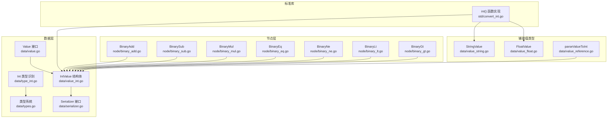
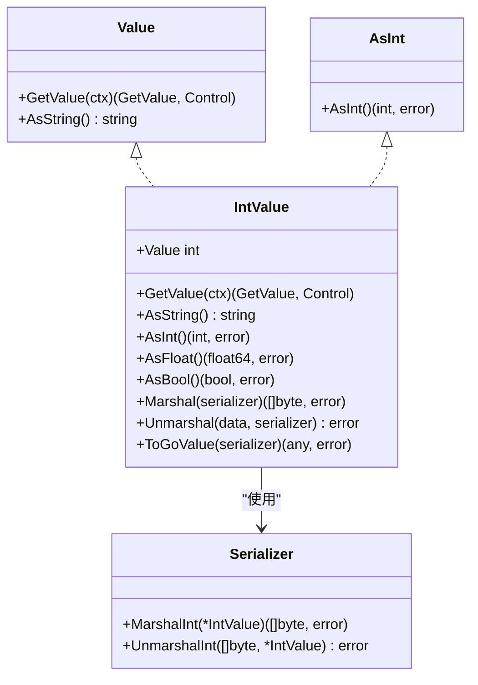
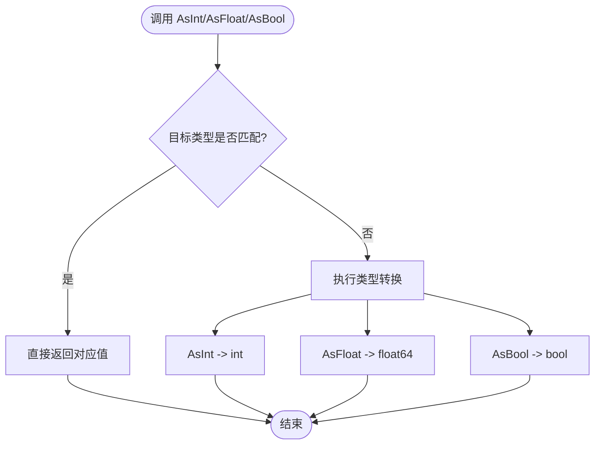
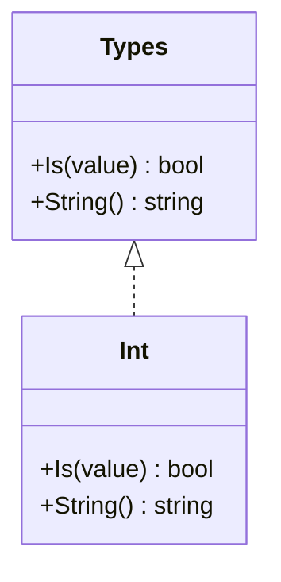
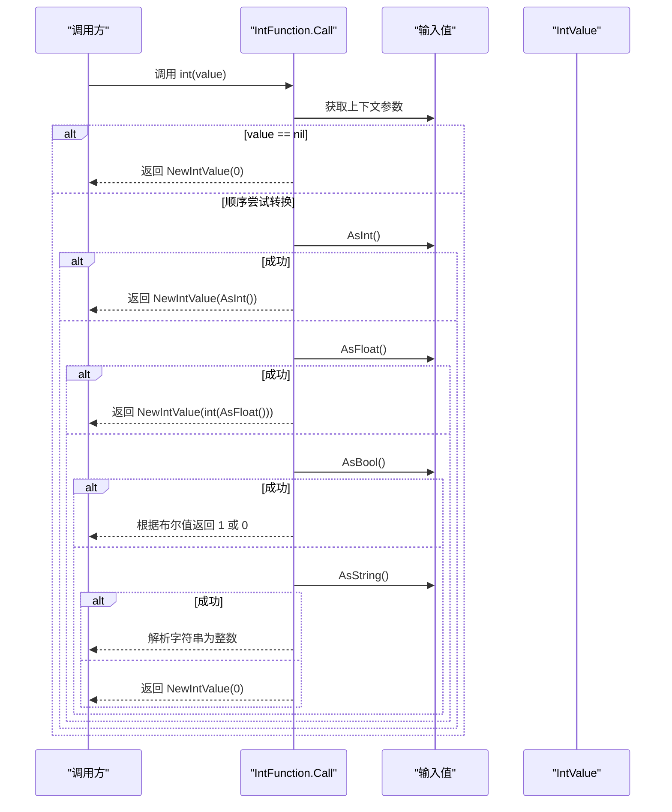
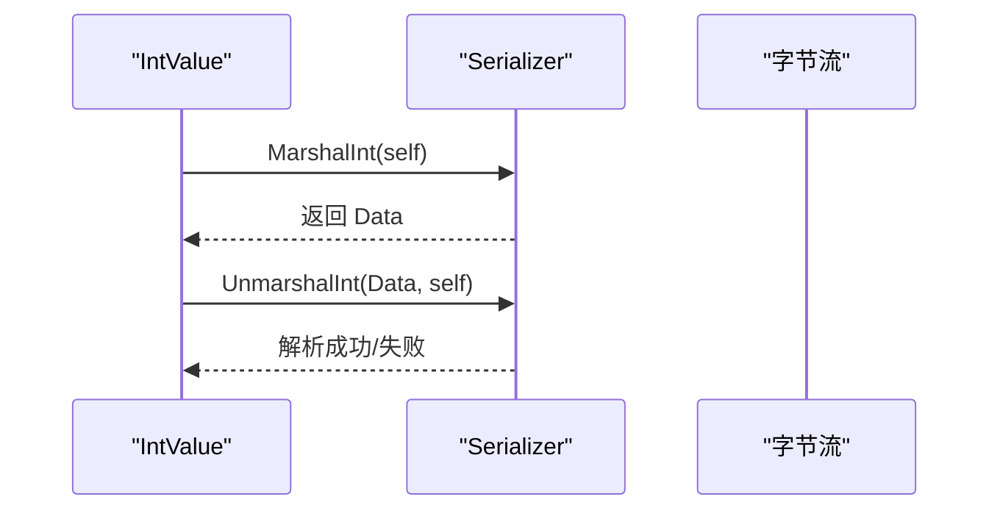
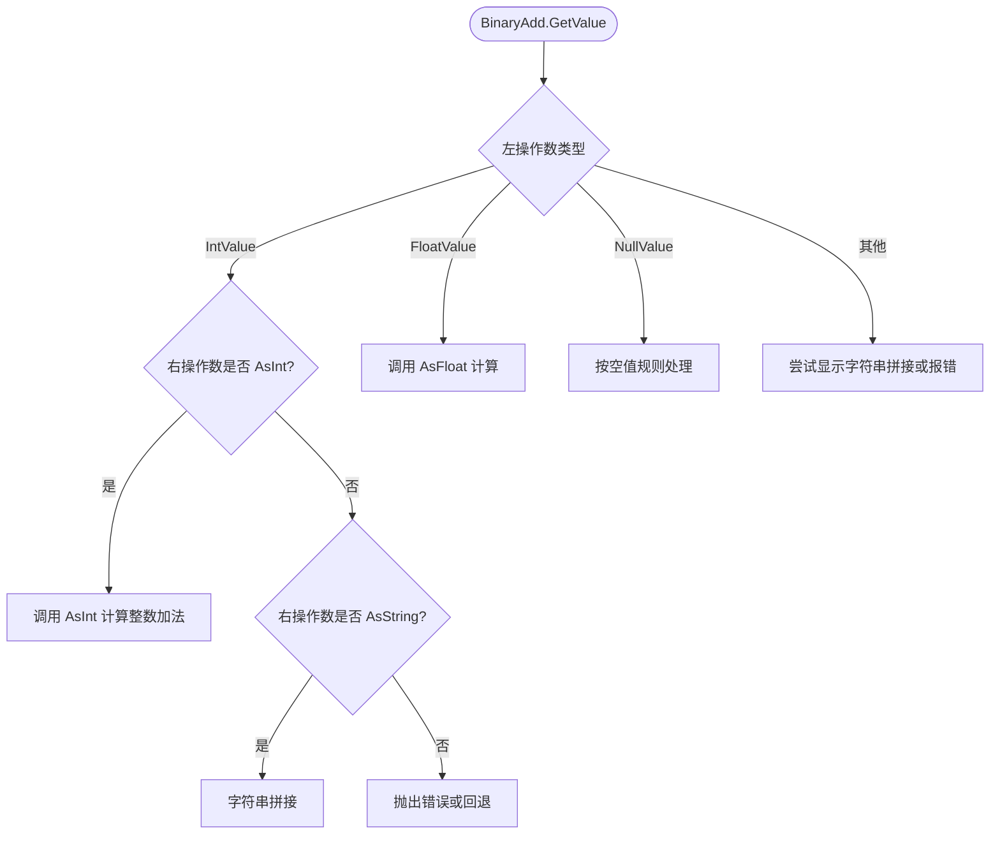
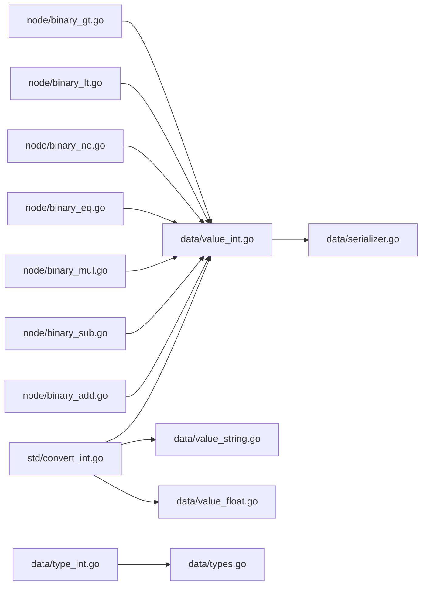

# 整数值类型

<cite>
**本文引用的文件**
- [data/value_int.go](file://data/value_int.go)
- [data/type_int.go](file://data/type_int.go)
- [std/convert_int.go](file://std/convert_int.go)
- [data/serializer.go](file://data/serializer.go)
- [data/value.go](file://data/value.go)
- [data/types.go](file://data/types.go)
- [node/binary_add.go](file://node/binary_add.go)
- [node/binary_sub.go](file://node/binary_sub.go)
- [node/binary_mul.go](file://node/binary_mul.go)
- [node/binary_eq.go](file://node/binary_eq.go)
- [node/binary_ne.go](file://node/binary_ne.go)
- [node/binary_lt.go](file://node/binary_lt.go)
- [node/binary_gt.go](file://node/binary_gt.go)
- [data/value_string.go](file://data/value_string.go)
- [data/value_float.go](file://data/value_float.go)
- [data/value_reference.go](file://data/value_reference.go)
- [tests/php/int.zy](file://tests/php/int.zy)
</cite>

## 目录
1. [简介](#简介)
2. [项目结构](#项目结构)
3. [核心组件](#核心组件)
4. [架构总览](#架构总览)
5. [详细组件分析](#详细组件分析)
6. [依赖关系分析](#依赖关系分析)
7. [性能考量](#性能考量)
8. [故障排查指南](#故障排查指南)
9. [结论](#结论)
10. [附录](#附录)

## 简介
本文件系统性地记录整数值类型的设计与实现，覆盖以下方面：
- 整数存储机制：以整型原生值封装为运行时值对象。
- 类型转换接口：AsInt、AsString、AsFloat、AsBool 的实现逻辑与行为边界。
- 序列化支持：通过统一的 Serializer 接口实现 Marshal/Unmarshal。
- 运算与比较：二元运算（加、减、乘）与比较（等于、不等、小于、大于）的类型分派与转换策略。
- 使用示例与最佳实践：结合测试用例与常见场景给出建议。

## 项目结构
围绕整数值类型的相关模块分布如下：
- 数据层：定义值接口、具体值类型（IntValue）、类型识别（Int）与序列化接口。
- 标准库函数：int() 函数实现，负责将任意值转换为整数。
- 节点层（运算与比较）：二元运算与比较节点根据左右操作数类型进行分派与转换。
- 测试：验证 int() 函数的行为与边界条件。

**图示来源**
- [data/value_int.go:1-52](file://data/value_int.go#L1-L52)
- [data/type_int.go:1-17](file://data/type_int.go#L1-L17)
- [std/convert_int.go:1-65](file://std/convert_int.go#L1-L65)
- [data/serializer.go:1-31](file://data/serializer.go#L1-L31)
- [data/value.go:1-39](file://data/value.go#L1-L39)
- [data/types.go:1-262](file://data/types.go#L1-L262)
- [node/binary_add.go:1-231](file://node/binary_add.go#L1-L231)
- [node/binary_sub.go:1-81](file://node/binary_sub.go#L1-L81)
- [node/binary_mul.go:1-61](file://node/binary_mul.go#L1-L61)
- [node/binary_eq.go:1-88](file://node/binary_eq.go#L1-L88)
- [node/binary_ne.go:1-84](file://node/binary_ne.go#L1-L84)
- [node/binary_lt.go:1-66](file://node/binary_lt.go#L1-L66)
- [node/binary_gt.go:1-66](file://node/binary_gt.go#L1-L66)
- [data/value_string.go:1-61](file://data/value_string.go#L1-L61)
- [data/value_float.go:1-62](file://data/value_float.go#L1-L62)
- [data/value_reference.go:329-353](file://data/value_reference.go#L329-L353)

**章节来源**
- [data/value_int.go:1-52](file://data/value_int.go#L1-L52)
- [data/type_int.go:1-17](file://data/type_int.go#L1-L17)
- [std/convert_int.go:1-65](file://std/convert_int.go#L1-L65)
- [data/serializer.go:1-31](file://data/serializer.go#L1-L31)
- [data/value.go:1-39](file://data/value.go#L1-L39)
- [data/types.go:1-262](file://data/types.go#L1-L262)
- [node/binary_add.go:1-231](file://node/binary_add.go#L1-L231)
- [node/binary_sub.go:1-81](file://node/binary_sub.go#L1-L81)
- [node/binary_mul.go:1-61](file://node/binary_mul.go#L1-L61)
- [node/binary_eq.go:1-88](file://node/binary_eq.go#L1-L88)
- [node/binary_ne.go:1-84](file://node/binary_ne.go#L1-L84)
- [node/binary_lt.go:1-66](file://node/binary_lt.go#L1-L66)
- [node/binary_gt.go:1-66](file://node/binary_gt.go#L1-L66)
- [data/value_string.go:1-61](file://data/value_string.go#L1-L61)
- [data/value_float.go:1-62](file://data/value_float.go#L1-L62)
- [data/value_reference.go:329-353](file://data/value_reference.go#L329-L353)

## 核心组件
- IntValue：封装 int 原生值，实现 Value 接口及类型转换方法，支持序列化与 Go 值导出。
- AsInt 接口：统一对外暴露 AsInt() 能力，便于在运算与比较中进行类型分派。
- Int 类型识别：用于判断某个 Value 是否为整数类型。
- int() 函数：标准库函数，按优先级尝试 AsInt/AsFloat/AsBool/AsString 转换，最终回退到字符串解析。
- Serializer 接口：统一的序列化协议，IntValue 通过它完成 MarshalInt/UnmarshalInt。
- 二元运算与比较节点：在 GetValue 中根据左操作数类型进行分支，再调用相应 AsXxx 方法执行计算或比较。

**章节来源**
- [data/value_int.go:7-51](file://data/value_int.go#L7-L51)
- [data/type_int.go:3-16](file://data/type_int.go#L3-L16)
- [std/convert_int.go:10-64](file://std/convert_int.go#L10-L64)
- [data/serializer.go:3-22](file://data/serializer.go#L3-L22)
- [node/binary_add.go:81-231](file://node/binary_add.go#L81-L231)
- [node/binary_sub.go:21-81](file://node/binary_sub.go#L21-L81)
- [node/binary_mul.go:23-61](file://node/binary_mul.go#L23-L61)
- [node/binary_eq.go:32-88](file://node/binary_eq.go#L32-L88)
- [node/binary_ne.go:32-84](file://node/binary_ne.go#L32-L84)
- [node/binary_lt.go:21-66](file://node/binary_lt.go#L21-L66)
- [node/binary_gt.go:21-66](file://node/binary_gt.go#L21-L66)

## 架构总览
整数值类型在运行时以 IntValue 形式存在，通过 AsInt/AsString/AsFloat/AsBool 提供跨类型转换能力；在运算与比较场景中，节点层根据左操作数类型进行分派，优先调用 AsInt/AsFloat 等方法，确保类型安全与一致性；序列化通过 Serializer 接口解耦具体实现。

**图示来源**
- [data/value.go:3-7](file://data/value.go#L3-L7)
- [data/value_int.go:13-51](file://data/value_int.go#L13-L51)
- [data/serializer.go:3-22](file://data/serializer.go#L3-L22)

## 详细组件分析

### IntValue 结构体与接口
- 存储机制：内部持有 int 原生值，封装为运行时 Value。
- 类型转换：
  - AsInt：直接返回内部值，无转换开销。
  - AsString：使用格式化输出十进制字符串。
  - AsFloat：将 int 转换为 float64。
  - AsBool：基于大于 0 的规则判定真值。
- 序列化：委托 Serializer 的 MarshalInt/UnmarshalInt 完成。
- ToGoValue：导出为 Go 原生值，便于与外部系统交互。

**图示来源**
- [data/value_int.go:26-40](file://data/value_int.go#L26-L40)

**章节来源**
- [data/value_int.go:7-51](file://data/value_int.go#L7-L51)

### 类型识别与类型系统
- Int 类型识别：Is 方法仅当值为 *IntValue 时返回 true，保证强类型约束。
- 类型系统：NewBaseType 根据字符串类型名返回对应类型对象，int 映射到 Int。

**图示来源**
- [data/type_int.go:3-16](file://data/type_int.go#L3-L16)
- [data/types.go:142-188](file://data/types.go#L142-L188)

**章节来源**
- [data/type_int.go:3-16](file://data/type_int.go#L3-L16)
- [data/types.go:142-188](file://data/types.go#L142-L188)

### int() 函数：类型转换流程
- 参数为空：返回 0。
- 优先级顺序：AsInt → AsFloat → AsBool → AsString。
- 回退策略：若直接转换失败，尝试 AsString 后使用字符串解析。
- 返回值：始终包装为 IntValue。

**图示来源**
- [std/convert_int.go:14-50](file://std/convert_int.go#L14-L50)

**章节来源**
- [std/convert_int.go:10-64](file://std/convert_int.go#L10-L64)

### 序列化支持
- IntValue 实现 ValueSerializer 接口，委托 Serializer 完成 MarshalInt/UnmarshalInt。
- Serializer 接口定义了多种值类型的序列化契约，确保扩展性与一致性。

**图示来源**
- [data/value_int.go:42-47](file://data/value_int.go#L42-L47)
- [data/serializer.go:3-22](file://data/serializer.go#L3-L22)

**章节来源**
- [data/value_int.go:42-47](file://data/value_int.go#L42-L47)
- [data/serializer.go:1-31](file://data/serializer.go#L1-L31)

### 运算与比较：二元操作
- 加法（BinaryAdd）：当左操作数为 IntValue 时，优先调用 AsInt 计算；若右操作数为 AsString，则进行字符串拼接。
- 减法（BinarySub）：当左右均为 IntValue 时，调用 AsInt 执行整数减法；否则回退到浮点或报错。
- 乘法（BinaryMul）：当左右均为数值类型时，分别调用 AsInt/AsFloat 执行计算。
- 比较（BinaryEq/Ne/Lt/Gt）：当左操作数为 IntValue 时，优先调用 AsInt 进行数值比较；否则按类型分派到 AsFloat/AsString/AsBool。

**图示来源**
- [node/binary_add.go:81-231](file://node/binary_add.go#L81-L231)
- [node/binary_sub.go:21-81](file://node/binary_sub.go#L21-L81)
- [node/binary_mul.go:23-61](file://node/binary_mul.go#L23-L61)
- [node/binary_eq.go:32-88](file://node/binary_eq.go#L32-L88)
- [node/binary_ne.go:32-84](file://node/binary_ne.go#L32-L84)
- [node/binary_lt.go:21-66](file://node/binary_lt.go#L21-L66)
- [node/binary_gt.go:21-66](file://node/binary_gt.go#L21-L66)

**章节来源**
- [node/binary_add.go:81-231](file://node/binary_add.go#L81-L231)
- [node/binary_sub.go:21-81](file://node/binary_sub.go#L21-L81)
- [node/binary_mul.go:23-61](file://node/binary_mul.go#L23-L61)
- [node/binary_eq.go:32-88](file://node/binary_eq.go#L32-L88)
- [node/binary_ne.go:32-84](file://node/binary_ne.go#L32-L84)
- [node/binary_lt.go:21-66](file://node/binary_lt.go#L21-L66)
- [node/binary_gt.go:21-66](file://node/binary_gt.go#L21-L66)

### 字符串与浮点到整数的转换
- 字符串到整数：StringValue.AsInt 使用字符串解析；value_reference.parseStringToInt 在解析后进行范围校验并转换为 IntValue。
- 浮点到整数：FloatValue.AsInt 将浮点值截断为整数。

**章节来源**
- [data/value_string.go:28-30](file://data/value_string.go#L28-L30)
- [data/value_reference.go:329-339](file://data/value_reference.go#L329-L339)
- [data/value_float.go:37-39](file://data/value_float.go#L37-L39)

## 依赖关系分析
- IntValue 依赖 Serializer 接口进行序列化。
- int() 函数依赖 AsInt/AsFloat/AsBool/AsString 接口与字符串解析。
- 二元运算与比较节点依赖 AsInt/AsFloat/AsString/AsBool 接口进行类型分派。
- 类型系统通过 NewBaseType 将字符串类型映射到具体类型对象。

**图示来源**
- [std/convert_int.go:14-50](file://std/convert_int.go#L14-L50)
- [data/value_int.go:42-47](file://data/value_int.go#L42-L47)
- [node/binary_add.go:81-231](file://node/binary_add.go#L81-L231)
- [node/binary_sub.go:21-81](file://node/binary_sub.go#L21-L81)
- [node/binary_mul.go:23-61](file://node/binary_mul.go#L23-L61)
- [node/binary_eq.go:32-88](file://node/binary_eq.go#L32-L88)
- [node/binary_ne.go:32-84](file://node/binary_ne.go#L32-L84)
- [node/binary_lt.go:21-66](file://node/binary_lt.go#L21-L66)
- [node/binary_gt.go:21-66](file://node/binary_gt.go#L21-L66)
- [data/serializer.go:3-22](file://data/serializer.go#L3-L22)
- [data/type_int.go:3-16](file://data/type_int.go#L3-L16)
- [data/types.go:142-188](file://data/types.go#L142-L188)

**章节来源**
- [std/convert_int.go:14-50](file://std/convert_int.go#L14-L50)
- [data/value_int.go:42-47](file://data/value_int.go#L42-L47)
- [node/binary_add.go:81-231](file://node/binary_add.go#L81-L231)
- [node/binary_sub.go:21-81](file://node/binary_sub.go#L21-L81)
- [node/binary_mul.go:23-61](file://node/binary_mul.go#L23-L61)
- [node/binary_eq.go:32-88](file://node/binary_eq.go#L32-L88)
- [node/binary_ne.go:32-84](file://node/binary_ne.go#L32-L84)
- [node/binary_lt.go:21-66](file://node/binary_lt.go#L21-L66)
- [node/binary_gt.go:21-66](file://node/binary_gt.go#L21-L66)
- [data/serializer.go:3-22](file://data/serializer.go#L3-L22)
- [data/type_int.go:3-16](file://data/type_int.go#L3-L16)
- [data/types.go:142-188](file://data/types.go#L142-L188)

## 性能考量
- AsInt/AsFloat/AsBool 直接返回内部值或简单转换，时间复杂度为 O(1)，空间开销极低。
- int() 函数采用“优先级尝试 + 回退”的策略，避免不必要的字符串解析；当输入已为 AsInt 时可跳过后续步骤。
- 二元运算在左操作数为 IntValue 时走 AsInt 分支，减少类型转换成本；字符串拼接仅在明确需求时触发。
- 序列化通过 Serializer 接口抽象，可在不同实现间切换，不影响上层调用。

[本节为通用性能讨论，无需特定文件来源]

## 故障排查指南
- int() 返回 0 的常见原因：
  - 输入为 nil。
  - 无法通过 AsInt/AsFloat/AsBool 转换，且 AsString 解析失败。
- 字符串解析失败：
  - 非数字字符串或超出 int 范围会触发错误；参考字符串解析与范围校验逻辑。
- 比较结果异常：
  - 当左操作数为 IntValue 但右操作数不可 AsInt 时，比较可能回退到字符串或布尔比较，导致不符合预期。
- 减法报错：
  - 当左右类型不满足 AsInt/AsFloat 时，BinarySub 会返回错误；请确保类型兼容。

**章节来源**
- [std/convert_int.go:14-50](file://std/convert_int.go#L14-L50)
- [data/value_reference.go:329-339](file://data/value_reference.go#L329-L339)
- [node/binary_sub.go:79-81](file://node/binary_sub.go#L79-L81)
- [node/binary_eq.go:87](file://node/binary_eq.go#L87)

## 结论
整数值类型在本项目中以 IntValue 为核心，配合 AsInt/AsString/AsFloat/AsBool 接口实现了清晰的类型转换与序列化路径；int() 函数提供了稳健的多类型转换策略；二元运算与比较节点在类型分派与转换上保持一致与可预测。遵循本文的最佳实践与排障建议，可在大多数场景下获得稳定、高效的整数处理体验。

[本节为总结性内容，无需特定文件来源]

## 附录

### 使用示例与最佳实践
- 基本转换：
  - 已知整数：直接使用 NewIntValue 构造。
  - 从其他类型转换：优先使用 int() 函数，避免重复解析。
- 运算与比较：
  - 优先保证左右操作数为数值类型，减少类型分派与转换开销。
  - 比较时尽量使用 AsInt/AsFloat 显式转换，避免隐式字符串比较。
- 序列化：
  - 使用统一的 Serializer 实例，确保跨模块一致性。
- 边界与容错：
  - 对字符串输入进行范围校验，避免溢出。
  - 在比较前确认类型兼容，必要时显式转换。

**章节来源**
- [tests/php/int.zy:1-88](file://tests/php/int.zy#L1-L88)
- [std/convert_int.go:14-50](file://std/convert_int.go#L14-L50)
- [data/value_reference.go:329-339](file://data/value_reference.go#L329-L339)