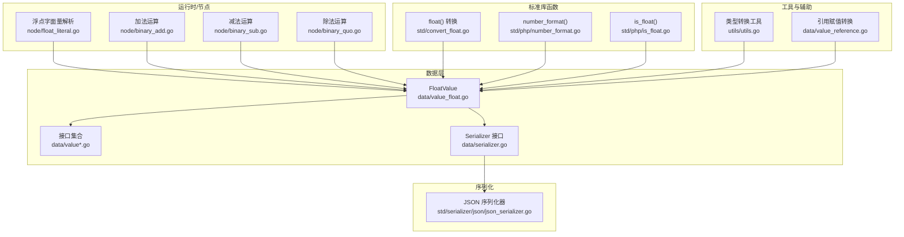
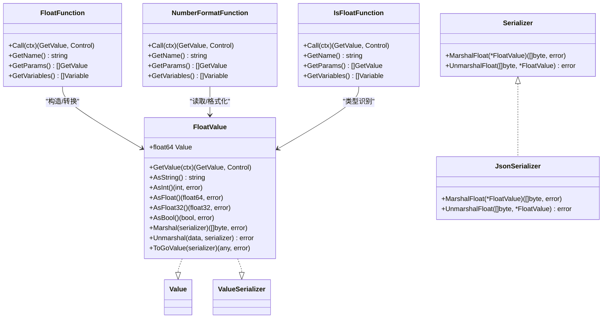
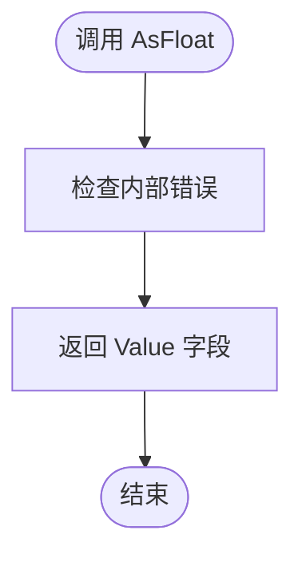
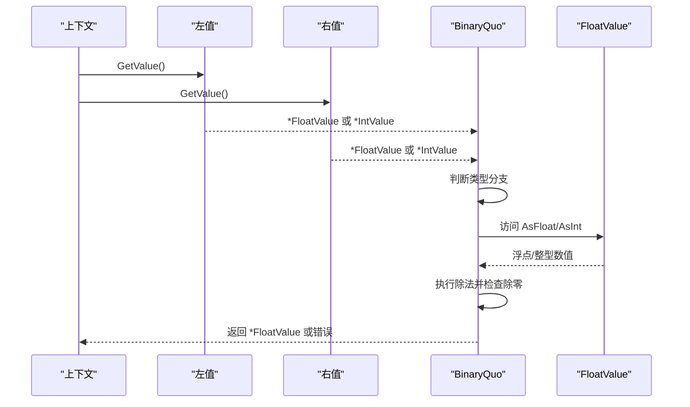
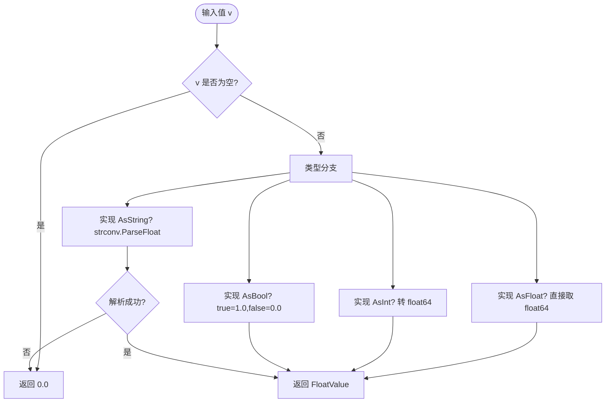
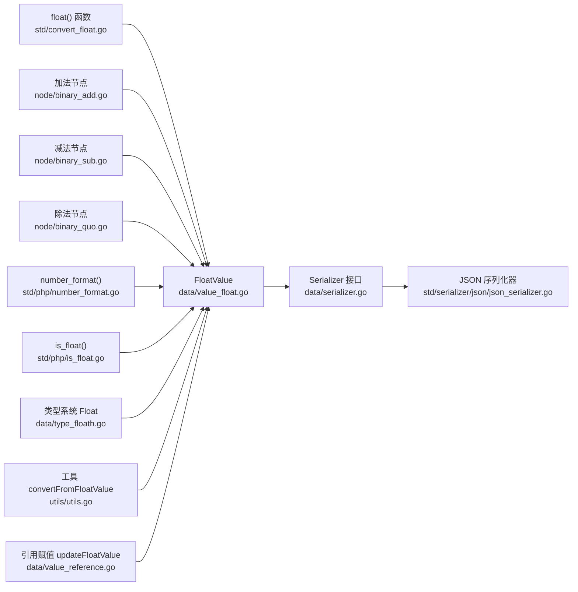

# 浮点数值类型

<cite>
**本文引用的文件**
- [data/value_float.go](file://data/value_float.go)
- [data/serializer.go](file://data/serializer.go)
- [std/serializer/json/json_serializer.go](file://std/serializer/json/json_serializer.go)
- [std/convert_float.go](file://std/convert_float.go)
- [node/float_literal.go](file://node/float_literal.go)
- [node/binary_add.go](file://node/binary_add.go)
- [node/binary_sub.go](file://node/binary_sub.go)
- [node/binary_quo.go](file://node/binary_quo.go)
- [std/php/number_format.go](file://std/php/number_format.go)
- [std/php/is_float.go](file://std/php/is_float.go)
- [data/type_floath.go](file://data/type_floath.go)
- [data/value.go](file://data/value.go)
- [data/value_int.go](file://data/value_int.go)
- [data/value_string.go](file://data/value_string.go)
- [data/value_bool.go](file://data/value_bool.go)
- [data/value_reference.go](file://data/value_reference.go)
- [utils/utils.go](file://utils/utils.go)
- [tests/php/float.zy](file://tests/php/float.zy)
- [tests/php/number_format.zy](file://tests/php/number_format.zy)
</cite>

## 目录
1. [简介](#简介)
2. [项目结构](#项目结构)
3. [核心组件](#核心组件)
4. [架构总览](#架构总览)
5. [组件详解](#组件详解)
6. [依赖关系分析](#依赖关系分析)
7. [性能考量](#性能考量)
8. [故障排查指南](#故障排查指南)
9. [结论](#结论)
10. [附录](#附录)

## 简介
本文件面向“浮点数值类型”的API与实现细节，聚焦 FloatValue 结构体及其周边生态，系统阐述以下方面：
- 存储机制：以 float64 为核心存储单元
- 精度与舍入：当前实现采用直接类型转换，未显式引入额外舍入策略
- 算术运算：加、减、除（含除零保护）、类型混合运算
- 比较与识别：is_float 识别、类型判定
- 格式化输出：AsInt/AsFloat/AsFloat32/AsString/ToGoValue
- 类型转换：float() 函数、字面量解析、引用赋值转换
- 序列化与反序列化：JSON 序列化器对接
- 使用示例与精度注意事项：结合测试用例与实现行为

## 项目结构
围绕浮点数的关键文件分布如下：
- 数据层：FloatValue 定义与基础接口
- 运行时与节点：字面量解析、二元运算（加/减/除）
- 标准库函数：float()、number_format()、is_float()
- 序列化：JSON 序列化器对接
- 工具与辅助：类型转换工具、引用赋值转换

**图示来源**
- [data/value_float.go:1-63](file://data/value_float.go#L1-L63)
- [data/serializer.go:1-31](file://data/serializer.go#L1-L31)
- [std/serializer/json/json_serializer.go:206-212](file://std/serializer/json/json_serializer.go#L206-L212)
- [std/convert_float.go:1-64](file://std/convert_float.go#L1-L64)
- [node/float_literal.go:1-34](file://node/float_literal.go#L1-L34)
- [node/binary_add.go:81-231](file://node/binary_add.go#L81-L231)
- [node/binary_sub.go:22-81](file://node/binary_sub.go#L22-L81)
- [node/binary_quo.go:23-80](file://node/binary_quo.go#L23-L80)
- [std/php/number_format.go:1-174](file://std/php/number_format.go#L1-L174)
- [std/php/is_float.go:1-42](file://std/php/is_float.go#L1-L42)
- [utils/utils.go:159-203](file://utils/utils.go#L159-L203)
- [data/value_reference.go:250-259](file://data/value_reference.go#L250-L259)

**章节来源**
- [data/value_float.go:1-63](file://data/value_float.go#L1-L63)
- [data/serializer.go:1-31](file://data/serializer.go#L1-L31)
- [std/serializer/json/json_serializer.go:206-212](file://std/serializer/json/json_serializer.go#L206-L212)
- [std/convert_float.go:1-64](file://std/convert_float.go#L1-L64)
- [node/float_literal.go:1-34](file://node/float_literal.go#L1-L34)
- [node/binary_add.go:81-231](file://node/binary_add.go#L81-L231)
- [node/binary_sub.go:22-81](file://node/binary_sub.go#L22-L81)
- [node/binary_quo.go:23-80](file://node/binary_quo.go#L23-L80)
- [std/php/number_format.go:1-174](file://std/php/number_format.go#L1-L174)
- [std/php/is_float.go:1-42](file://std/php/is_float.go#L1-L42)
- [utils/utils.go:159-203](file://utils/utils.go#L159-L203)
- [data/value_reference.go:250-259](file://data/value_reference.go#L250-L259)

## 核心组件
- FloatValue：封装 float64 的值对象，实现基础类型转换与序列化接口
- AsFloat/AsFloat32/AsFloat64：统一的浮点类型转换接口
- Serializer 接口族：MarshalFloat/UnmarshalFloat 与 ValueSerializer
- 运行时节点：字面量解析、二元运算（加/减/除）
- 标准库函数：float()/number_format()/is_float()
- 工具与辅助：convertFromFloatValue、parseToFloatValue、updateFloatValue

**章节来源**
- [data/value_float.go:25-27](file://data/value_float.go#L25-L27)
- [data/value_float.go:13-23](file://data/value_float.go#L13-L23)
- [data/serializer.go:16-17](file://data/serializer.go#L16-L17)
- [data/serializer.go:25-30](file://data/serializer.go#L25-L30)

## 架构总览
FloatValue 在系统中的位置与交互如下：

**图示来源**
- [data/value_float.go:25-62](file://data/value_float.go#L25-L62)
- [data/serializer.go:3-22](file://data/serializer.go#L3-L22)
- [std/serializer/json/json_serializer.go:206-212](file://std/serializer/json/json_serializer.go#L206-L212)
- [std/convert_float.go:10-63](file://std/convert_float.go#L10-L63)
- [std/php/number_format.go:12-112](file://std/php/number_format.go#L12-L112)
- [std/php/is_float.go:11-41](file://std/php/is_float.go#L11-L41)

## 组件详解

### FloatValue 结构体与接口
- 字段：Value 为 float64
- 基础能力：
  - AsString：使用通用格式化输出
  - AsInt/AsFloat/AsFloat32：类型转换
  - AsBool：基于大于 0 的判断
  - GetValue：作为 GetValue 返回自身
  - 序列化：委托 Serializer 的 MarshalFloat/UnmarshalFloat
  - ToGoValue：返回底层 float64

**图示来源**
- [data/value_float.go:41-43](file://data/value_float.go#L41-L43)

**章节来源**
- [data/value_float.go:25-62](file://data/value_float.go#L25-L62)

### 算术运算支持
- 加法（BinaryAdd）：支持 FloatValue 与 IntValue/FloatValue/StringValue 的混合加法；与字符串相加时将浮点数格式化为字符串再拼接
- 减法（BinarySub）：支持 FloatValue 与其他类型（含 NullValue）的减法，返回 FloatValue
- 除法（BinaryQuo）：支持 FloatValue 与 IntValue/FloatValue 的除法，并进行除零保护

**图示来源**
- [node/binary_quo.go:23-80](file://node/binary_quo.go#L23-L80)
- [data/value_float.go:37-50](file://data/value_float.go#L37-L50)

**章节来源**
- [node/binary_add.go:116-146](file://node/binary_add.go#L116-L146)
- [node/binary_sub.go:56-77](file://node/binary_sub.go#L56-L77)
- [node/binary_quo.go:23-80](file://node/binary_quo.go#L23-L80)

### 比较与识别
- is_float：识别传入值是否为 FloatValue
- Float 类型判定：类型系统中 Float.Is 判定是否满足 AsFloat 接口

**章节来源**
- [std/php/is_float.go:15-25](file://std/php/is_float.go#L15-L25)
- [data/type_floath.go:6-11](file://data/type_floath.go#L6-L11)

### 格式化输出与类型转换
- AsString：通用格式化输出
- number_format：将数值按指定小数位与分隔符格式化为字符串
- float()：将 mixed 值转换为 FloatValue（整数、布尔、字符串、已有浮点等路径均有覆盖）

**图示来源**
- [std/convert_float.go:14-49](file://std/convert_float.go#L14-L49)

**章节来源**
- [std/php/number_format.go:20-90](file://std/php/number_format.go#L20-L90)
- [std/convert_float.go:14-49](file://std/convert_float.go#L14-L49)

### 类型转换与精度控制
- convertFromFloatValue：从 FloatValue 转为目标类型 S，优先直接断言，其次按基本类型分支转换
- parseToFloatValue/updateFloatValue：将任意值解析为 FloatValue，包含字符串/[]byte/Value 等路径

注意：当前实现未显式引入额外的舍入策略或精度控制逻辑，转换以 Go 语言内置类型转换为主。

**章节来源**
- [utils/utils.go:159-203](file://utils/utils.go#L159-L203)
- [data/value_reference.go:250-259](file://data/value_reference.go#L250-L259)

### 序列化与反序列化
- Serializer 接口定义了 MarshalFloat/UnmarshalFloat
- JsonSerializer 实现了 JSON 编解码，委托标准库 json 包

**章节来源**
- [data/serializer.go:16-17](file://data/serializer.go#L16-L17)
- [std/serializer/json/json_serializer.go:206-212](file://std/serializer/json/json_serializer.go#L206-L212)

### 字面量解析
- FloatLiteral：将字符串字面量解析为 float64 并包装为 FloatValue；解析失败时回退为 0.0

**章节来源**
- [node/float_literal.go:13-33](file://node/float_literal.go#L13-L33)

## 依赖关系分析

**图示来源**
- [data/value_float.go:25-62](file://data/value_float.go#L25-L62)
- [data/serializer.go:3-22](file://data/serializer.go#L3-L22)
- [std/serializer/json/json_serializer.go:206-212](file://std/serializer/json/json_serializer.go#L206-L212)
- [std/convert_float.go:14-49](file://std/convert_float.go#L14-L49)
- [node/binary_add.go:116-146](file://node/binary_add.go#L116-L146)
- [node/binary_sub.go:56-77](file://node/binary_sub.go#L56-L77)
- [node/binary_quo.go:23-80](file://node/binary_quo.go#L23-L80)
- [std/php/number_format.go:20-90](file://std/php/number_format.go#L20-L90)
- [std/php/is_float.go:15-25](file://std/php/is_float.go#L15-L25)
- [data/type_floath.go:6-11](file://data/type_floath.go#L6-L11)
- [utils/utils.go:159-203](file://utils/utils.go#L159-L203)
- [data/value_reference.go:250-259](file://data/value_reference.go#L250-L259)

**章节来源**
- [data/value_float.go:25-62](file://data/value_float.go#L25-L62)
- [data/serializer.go:3-22](file://data/serializer.go#L3-L22)
- [std/serializer/json/json_serializer.go:206-212](file://std/serializer/json/json_serializer.go#L206-L212)
- [std/convert_float.go:14-49](file://std/convert_float.go#L14-L49)
- [node/binary_add.go:116-146](file://node/binary_add.go#L116-L146)
- [node/binary_sub.go:56-77](file://node/binary_sub.go#L56-L77)
- [node/binary_quo.go:23-80](file://node/binary_quo.go#L23-L80)
- [std/php/number_format.go:20-90](file://std/php/number_format.go#L20-L90)
- [std/php/is_float.go:15-25](file://std/php/is_float.go#L15-L25)
- [data/type_floath.go:6-11](file://data/type_floath.go#L6-L11)
- [utils/utils.go:159-203](file://utils/utils.go#L159-L203)
- [data/value_reference.go:250-259](file://data/value_reference.go#L250-L259)

## 性能考量
- 直接类型转换：AsInt/AsFloat/AsFloat32 等均直接访问底层 float64，避免多余拷贝
- 字符串拼接：加法运算中与字符串相加会格式化浮点数，建议在高频场景下尽量避免不必要的字符串拼接
- 除零保护：除法节点显式检查除数为零并抛出错误，避免运行时异常
- 序列化：JSON 序列化委托标准库，性能稳定且兼容性好

[本节为通用指导，不直接分析具体文件]

## 故障排查指南
- 除零错误：当除数为 0 时，除法节点会返回错误；请在业务侧确保除数非零
- 无效字符串转换：float() 对无法解析的字符串返回 0.0；如需严格校验，请在调用前自行验证输入
- 精度与舍入：当前未引入额外舍入策略，如遇精度问题，可在上层调用 number_format 控制小数位数
- 类型识别：is_float 仅识别 FloatValue；如需更广泛的数值识别，可结合 Float 类型判定

**章节来源**
- [node/binary_quo.go:46-48](file://node/binary_quo.go#L46-L48)
- [std/convert_float.go:42-48](file://std/convert_float.go#L42-L48)
- [std/php/is_float.go:15-25](file://std/php/is_float.go#L15-L25)
- [data/type_floath.go:6-11](file://data/type_floath.go#L6-L11)

## 结论
FloatValue 提供了简洁而完整的浮点数抽象，具备：
- 明确的存储与转换语义
- 与整数、字符串、布尔等类型的自然融合
- 完备的序列化支持
- 丰富的运行时运算与格式化能力

在实际使用中，建议：
- 明确小数位需求时使用 number_format
- 避免在热点路径中进行频繁的字符串拼接
- 对外部输入进行必要的校验与边界检查（如除零）

[本节为总结性内容，不直接分析具体文件]

## 附录

### API 一览（方法与用途）
- FloatValue.AsString：字符串化输出
- FloatValue.AsInt/AsFloat/AsFloat32：类型转换
- FloatValue.AsBool：布尔化（>0 为真）
- FloatValue.Marshal/Unmarshal：序列化编解码
- FloatValue.ToGoValue：导出为原生 Go 值
- FloatFunction.Call：将任意值转换为浮点数
- NumberFormatFunction.Call：按参数格式化数字
- IsFloatFunction.Call：识别 FloatValue
- FloatLiteral.GetValue：字面量解析
- BinaryAdd/Sub/Quo：加/减/除运算

**章节来源**
- [data/value_float.go:33-62](file://data/value_float.go#L33-L62)
- [std/convert_float.go:14-49](file://std/convert_float.go#L14-L49)
- [std/php/number_format.go:20-90](file://std/php/number_format.go#L20-L90)
- [std/php/is_float.go:15-25](file://std/php/is_float.go#L15-L25)
- [node/float_literal.go:31-33](file://node/float_literal.go#L31-L33)
- [node/binary_add.go:116-146](file://node/binary_add.go#L116-L146)
- [node/binary_sub.go:56-77](file://node/binary_sub.go#L56-L77)
- [node/binary_quo.go:23-80](file://node/binary_quo.go#L23-L80)

### 使用示例与精度注意事项
- float() 转换示例：参见测试脚本，覆盖整数、浮点、字符串、布尔、null、无效字符串等场景
- number_format() 示例：参见测试脚本，覆盖基本格式化、小数位、千分位分隔符等
- 精度注意事项：未引入额外舍入策略，如需控制精度，请在上层调用 number_format 或自定义格式化逻辑

**章节来源**
- [tests/php/float.zy:5-95](file://tests/php/float.zy#L5-L95)
- [tests/php/number_format.zy:5-43](file://tests/php/number_format.zy#L5-L43)