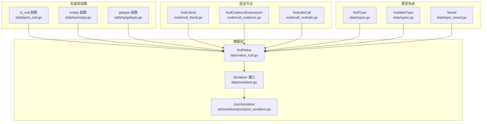
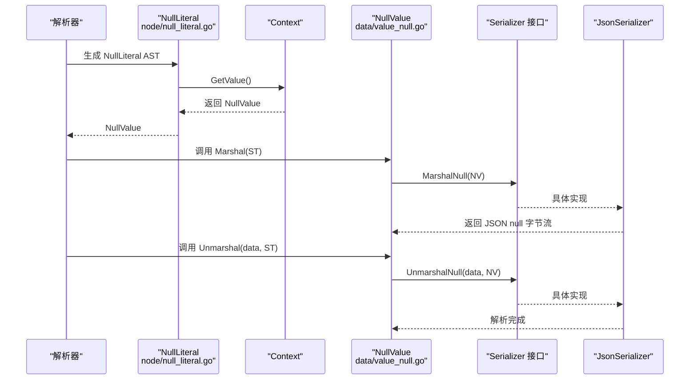
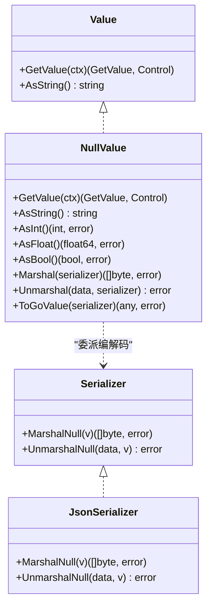
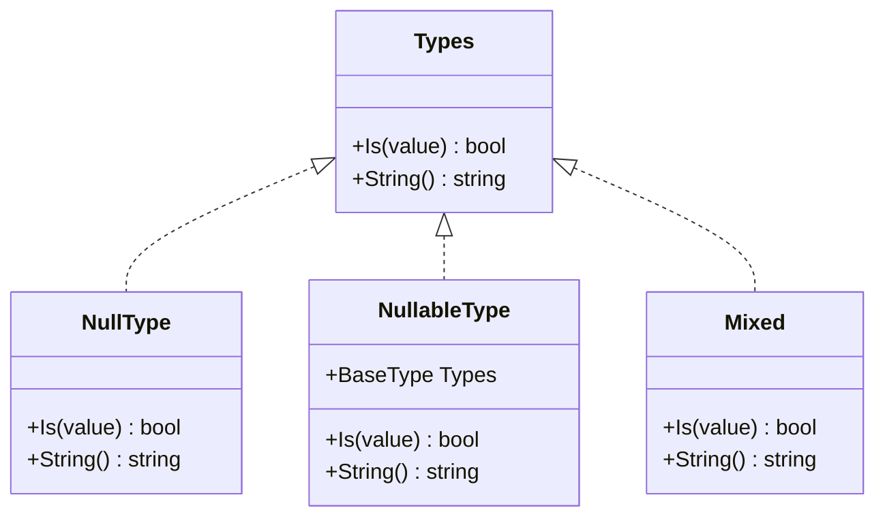
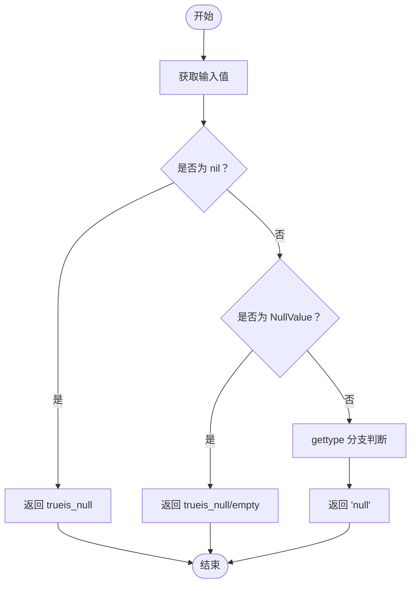
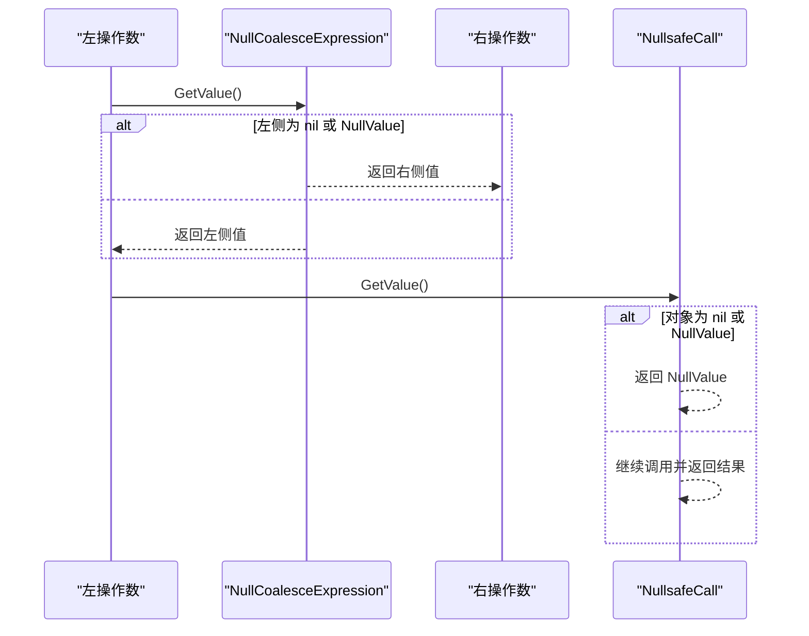
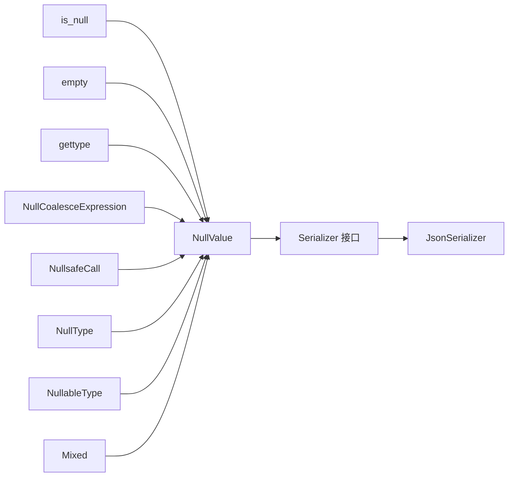

# 空值类型

<cite>
**本文引用的文件**
- [data/value_null.go](file://data/value_null.go)
- [data/serializer.go](file://data/serializer.go)
- [std/serializer/json/json_serializer.go](file://std/serializer/json/json_serializer.go)
- [std/php/is_null.go](file://std/php/is_null.go)
- [std/php/empty.go](file://std/php/empty.go)
- [std/php/gettype.go](file://std/php/gettype.go)
- [node/null_literal.go](file://node/null_literal.go)
- [node/null_coalesce.go](file://node/null_coalesce.go)
- [node/call_nullsafe.go](file://node/call_nullsafe.go)
- [node/binary_eq.go](file://node/binary_eq.go)
- [node/binary_eq_strict.go](file://node/binary_eq_strict.go)
- [data/types.go](file://data/types.go)
- [data/type_mixed.go](file://data/type_mixed.go)
- [tests/php/empty.zy](file://tests/php/empty.zy)
</cite>

## 目录
1. [简介](#简介)
2. [项目结构](#项目结构)
3. [核心组件](#核心组件)
4. [架构总览](#架构总览)
5. [详细组件分析](#详细组件分析)
6. [依赖分析](#依赖分析)
7. [性能考虑](#性能考虑)
8. [故障排查指南](#故障排查指南)
9. [结论](#结论)
10. [附录](#附录)

## 简介
本文件聚焦于空值类型 NullValue 的完整API文档，涵盖其在类型系统中的角色、与 nil 的区别、类型检查机制、占位符行为、序列化与反序列化、调试输出以及在常见操作（如空合并、空安全调用、相等比较、类型判断、空值检测）中的表现。同时提供最佳实践与注意事项，帮助开发者正确使用空值并在跨语言互操作（如JSON）中保持一致性。

## 项目结构
围绕空值类型的关键模块分布如下：
- 数据层：NullValue 定义与序列化接口
- 标准库函数：is_null、empty、gettype
- 语法节点：null 字面量、空合并、空安全调用
- 类型系统：NullType、NullableType、Mixed 类型
- JSON 序列化器：NullValue 的 JSON 编解码

图表来源
- [data/value_null.go:1-44](file://data/value_null.go#L1-L44)
- [data/serializer.go:1-31](file://data/serializer.go#L1-L31)
- [std/serializer/json/json_serializer.go:49-57](file://std/serializer/json/json_serializer.go#L49-L57)
- [std/php/is_null.go:15-25](file://std/php/is_null.go#L15-L25)
- [std/php/empty.go:46-49](file://std/php/empty.go#L46-L49)
- [std/php/gettype.go:50-51](file://std/php/gettype.go#L50-L51)
- [node/null_literal.go:17-20](file://node/null_literal.go#L17-L20)
- [node/null_coalesce.go:24-49](file://node/null_coalesce.go#L24-L49)
- [node/call_nullsafe.go:24-62](file://node/call_nullsafe.go#L24-L62)
- [data/types.go:250-261](file://data/types.go#L250-L261)
- [data/types.go:34-49](file://data/types.go#L34-L49)
- [data/type_mixed.go:1-12](file://data/type_mixed.go#L1-L12)

章节来源
- [data/value_null.go:1-44](file://data/value_null.go#L1-L44)
- [data/serializer.go:1-31](file://data/serializer.go#L1-L31)
- [std/serializer/json/json_serializer.go:49-57](file://std/serializer/json/json_serializer.go#L49-L57)
- [std/php/is_null.go:15-25](file://std/php/is_null.go#L15-L25)
- [std/php/empty.go:46-49](file://std/php/empty.go#L46-L49)
- [std/php/gettype.go:50-51](file://std/php/gettype.go#L50-L51)
- [node/null_literal.go:17-20](file://node/null_literal.go#L17-L20)
- [node/null_coalesce.go:24-49](file://node/null_coalesce.go#L24-L49)
- [node/call_nullsafe.go:24-62](file://node/call_nullsafe.go#L24-L62)
- [data/types.go:250-261](file://data/types.go#L250-L261)
- [data/types.go:34-49](file://data/types.go#L34-L49)
- [data/type_mixed.go:1-12](file://data/type_mixed.go#L1-L12)

## 核心组件
- NullValue：空值的运行时表示，实现 Value 接口，并提供类型转换、序列化与反序列化能力
- Serializer 接口：统一编解码协议，NullValue 通过它委派 JSON 编解码
- JsonSerializer：具体实现 NullValue 的 JSON 编解码
- 类型系统：NullType、NullableType、Mixed，用于类型检查与约束
- 标准库函数：is_null、empty、gettype，用于在运行时判断空值状态与类型
- 语法节点：NullLiteral、NullCoalesceExpression、NullsafeCall，用于在语法层面表达与处理空值

章节来源
- [data/value_null.go:11-44](file://data/value_null.go#L11-L44)
- [data/serializer.go:3-30](file://data/serializer.go#L3-L30)
- [std/serializer/json/json_serializer.go:49-57](file://std/serializer/json/json_serializer.go#L49-L57)
- [data/types.go:250-261](file://data/types.go#L250-L261)
- [data/types.go:34-49](file://data/types.go#L34-L49)
- [data/type_mixed.go:3-11](file://data/type_mixed.go#L3-L11)
- [std/php/is_null.go:9-25](file://std/php/is_null.go#L9-L25)
- [std/php/empty.go:46-49](file://std/php/empty.go#L46-L49)
- [std/php/gettype.go:13-56](file://std/php/gettype.go#L13-L56)
- [node/null_literal.go:5-20](file://node/null_literal.go#L5-L20)
- [node/null_coalesce.go:7-49](file://node/null_coalesce.go#L7-L49)
- [node/call_nullsafe.go:7-62](file://node/call_nullsafe.go#L7-L62)

## 架构总览
下图展示空值从“字面量”到“运行时值”的生成路径，以及在类型系统、序列化与标准库函数中的交互。

图表来源
- [node/null_literal.go:17-20](file://node/null_literal.go#L17-L20)
- [data/value_null.go:35-40](file://data/value_null.go#L35-L40)
- [data/serializer.go:8-9](file://data/serializer.go#L8-L9)
- [std/serializer/json/json_serializer.go:50-57](file://std/serializer/json/json_serializer.go#L50-L57)

## 详细组件分析

### NullValue 结构体与接口契约
- 角色定位：空值的唯一运行时表示，实现 Value 接口，提供 GetValue、类型转换（AsString/AsInt/AsFloat/AsBool）、序列化/反序列化、ToGoValue 等能力
- 特殊处理机制：
  - GetValue 返回自身，作为占位符参与求值链路
  - AsString 返回空字符串；AsInt/AsFloat 返回 0；AsBool 返回 false；ToGoValue 返回 nil
- 占位符功能：在表达式求值、数组/对象属性访问、控制流中充当“空值占位”，避免 panic 并提供一致的默认行为

图表来源
- [data/value_null.go:3-44](file://data/value_null.go#L3-L44)
- [data/serializer.go:3-22](file://data/serializer.go#L3-L22)
- [std/serializer/json/json_serializer.go:49-57](file://std/serializer/json/json_serializer.go#L49-L57)

章节来源
- [data/value_null.go:11-44](file://data/value_null.go#L11-L44)

### 类型系统中的空值
- NullType：专门匹配 NullValue 的类型，Is 判定仅当值为 NullValue 时为真
- NullableType：可空类型包装器，Is 判定允许 NullValue 或基础类型值
- Mixed：任意类型，Is 总为真
- 与 nil 的区别：nil 是 Go 语言层面的“无值”指针/接口值，而 NullValue 是运行时值类型系统中的一个具体值，二者在比较与类型检查上行为不同

图表来源
- [data/types.go:250-261](file://data/types.go#L250-L261)
- [data/types.go:34-49](file://data/types.go#L34-L49)
- [data/type_mixed.go:3-11](file://data/type_mixed.go#L3-L11)

章节来源
- [data/types.go:250-261](file://data/types.go#L250-L261)
- [data/types.go:34-49](file://data/types.go#L34-L49)
- [data/type_mixed.go:3-11](file://data/type_mixed.go#L3-L11)

### 空值检测与类型判断
- is_null：区分 nil 与 NullValue，两者均判为“空”
- empty：遇到 NullValue 直接判为“空”
- gettype：遇到 NullValue 返回 "null"

图表来源
- [std/php/is_null.go:15-25](file://std/php/is_null.go#L15-L25)
- [std/php/empty.go:46-49](file://std/php/empty.go#L46-L49)
- [std/php/gettype.go:50-51](file://std/php/gettype.go#L50-L51)

章节来源
- [std/php/is_null.go:15-25](file://std/php/is_null.go#L15-L25)
- [std/php/empty.go:46-49](file://std/php/empty.go#L46-L49)
- [std/php/gettype.go:50-51](file://std/php/gettype.go#L50-L51)

### 空合并与空安全调用
- 空合并（??）：若左侧为 nil 或 NullValue，返回右侧；否则返回左侧
- 空安全调用（?->）：若对象为 nil 或 NullValue，返回 NullValue；否则继续执行调用

图表来源
- [node/null_coalesce.go:24-49](file://node/null_coalesce.go#L24-L49)
- [node/call_nullsafe.go:24-62](file://node/call_nullsafe.go#L24-L62)

章节来源
- [node/null_coalesce.go:24-49](file://node/null_coalesce.go#L24-L49)
- [node/call_nullsafe.go:24-62](file://node/call_nullsafe.go#L24-L62)

### 相等比较与严格相等
- 非严格相等（==）：NullValue 与 NullValue 相等
- 严格相等（===）：NullValue 与 NullValue 严格相等

章节来源
- [node/binary_eq.go:81-84](file://node/binary_eq.go#L81-L84)
- [node/binary_eq_strict.go:66-70](file://node/binary_eq_strict.go#L66-L70)

### 序列化与反序列化
- 编码：NullValue.Marshal 调用 Serializer.MarshalNull，JsonSerializer 将其编码为 JSON null
- 解码：NullValue.Unmarshal 调用 Serializer.UnmarshalNull，JsonSerializer 不做额外处理（空值无需恢复）

章节来源
- [data/value_null.go:35-40](file://data/value_null.go#L35-L40)
- [data/serializer.go:8-9](file://data/serializer.go#L8-L9)
- [std/serializer/json/json_serializer.go:50-57](file://std/serializer/json/json_serializer.go#L50-L57)

### 调试输出与日志
- gettype 可输出 "null"，便于调试
- 测试用例覆盖了 empty 对 null 的判定，可用于验证行为

章节来源
- [std/php/gettype.go:50-51](file://std/php/gettype.go#L50-L51)
- [tests/php/empty.zy:12-18](file://tests/php/empty.zy#L12-L18)

## 依赖分析
- NullValue 依赖 Serializer 接口以实现跨格式编解码
- JsonSerializer 提供 JSON 编解码的具体实现
- 标准库函数与语法节点在运行时与 NullValue 打交道，形成“语法 -> 运行时 -> 类型/函数”的闭环
- 类型系统为 NullValue 提供精确的类型判定与可空约束

图表来源
- [data/value_null.go:35-40](file://data/value_null.go#L35-L40)
- [data/serializer.go:8-9](file://data/serializer.go#L8-L9)
- [std/serializer/json/json_serializer.go:50-57](file://std/serializer/json/json_serializer.go#L50-L57)
- [std/php/is_null.go:15-25](file://std/php/is_null.go#L15-L25)
- [std/php/empty.go:46-49](file://std/php/empty.go#L46-L49)
- [std/php/gettype.go:50-51](file://std/php/gettype.go#L50-L51)
- [node/null_coalesce.go:24-49](file://node/null_coalesce.go#L24-L49)
- [node/call_nullsafe.go:24-62](file://node/call_nullsafe.go#L24-L62)
- [data/types.go:250-261](file://data/types.go#L250-L261)
- [data/types.go:34-49](file://data/types.go#L34-L49)
- [data/type_mixed.go:3-11](file://data/type_mixed.go#L3-L11)

## 性能考虑
- NullValue 的类型转换均为常量时间操作，开销极低
- JSON 编解码直接映射到 JSON null，避免多余处理
- 在大规模集合中使用空值时，建议结合 NullableType 明确可空边界，减少分支判断成本

## 故障排查指南
- 现象：is_null 与 empty 行为不一致
  - 原因：is_null 会区分 nil 与 NullValue；empty 对 NullValue 判空
  - 处理：明确区分两者语义，必要时显式转换
- 现象：gettype 输出为 "null" 但业务期望为 "mixed"
  - 原因：NullValue 属于 null 类型
  - 处理：在类型声明中使用 NullableType 或 Mixed 明确意图
- 现象：空合并与空安全调用返回意外值
  - 原因：左侧为 nil 或 NullValue 时的行为已设计为返回右侧或 NullValue
  - 处理：在调用前显式检查或在上层逻辑中处理 NullValue

章节来源
- [std/php/is_null.go:15-25](file://std/php/is_null.go#L15-L25)
- [std/php/empty.go:46-49](file://std/php/empty.go#L46-L49)
- [std/php/gettype.go:50-51](file://std/php/gettype.go#L50-L51)
- [node/null_coalesce.go:24-49](file://node/null_coalesce.go#L24-L49)
- [node/call_nullsafe.go:24-62](file://node/call_nullsafe.go#L24-L62)

## 结论
NullValue 在运行时类型系统中扮演“占位符”与“空值”的双重角色：既能在表达式与控制流中提供稳定的默认值，又能在类型系统、序列化与标准库函数中被精确识别与处理。理解其与 nil 的差异、在各操作中的行为以及与类型系统的协作，是正确使用空值的关键。

## 附录
- 最佳实践
  - 显式使用 NullableType 描述可空参数与返回值，提升类型安全性
  - 在 JSON 互操作中依赖 Serializer/MarshalNull/UnmarshalNull，确保空值序列化为 JSON null
  - 使用 is_null 区分 nil 与 NullValue，使用 empty 判断“空”语义
  - 在空合并与空安全调用中，明确空值的传播策略，避免隐式错误
- 注意事项
  - 空值不是“未初始化”，而是“有值但为空”的一种确定状态
  - 在严格相等（===）与非严格相等（==）中，NullValue 的行为一致，但业务语义不同
  - 在调试时，gettype 可准确反映 NullValue 的类型