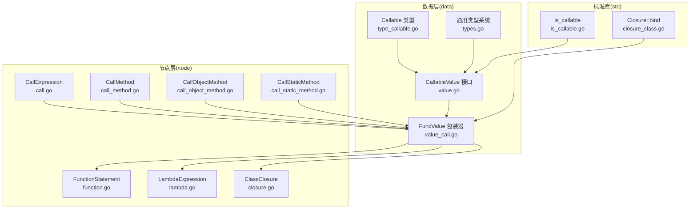
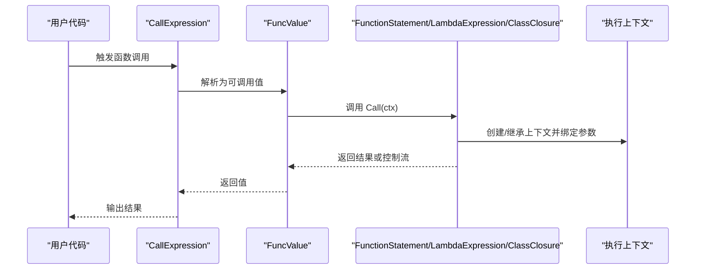
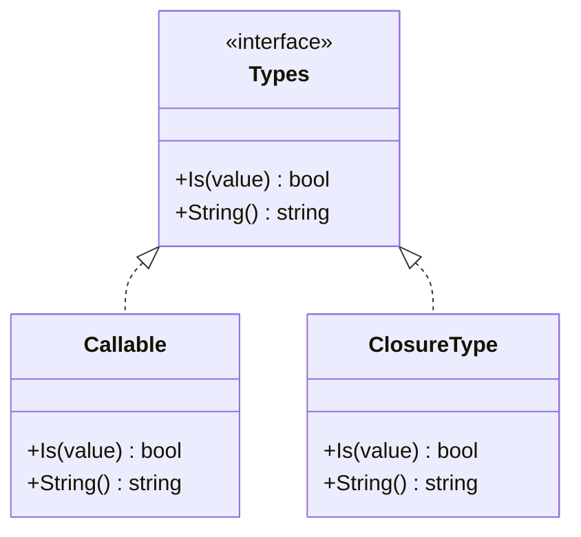
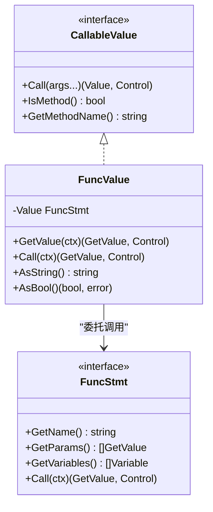
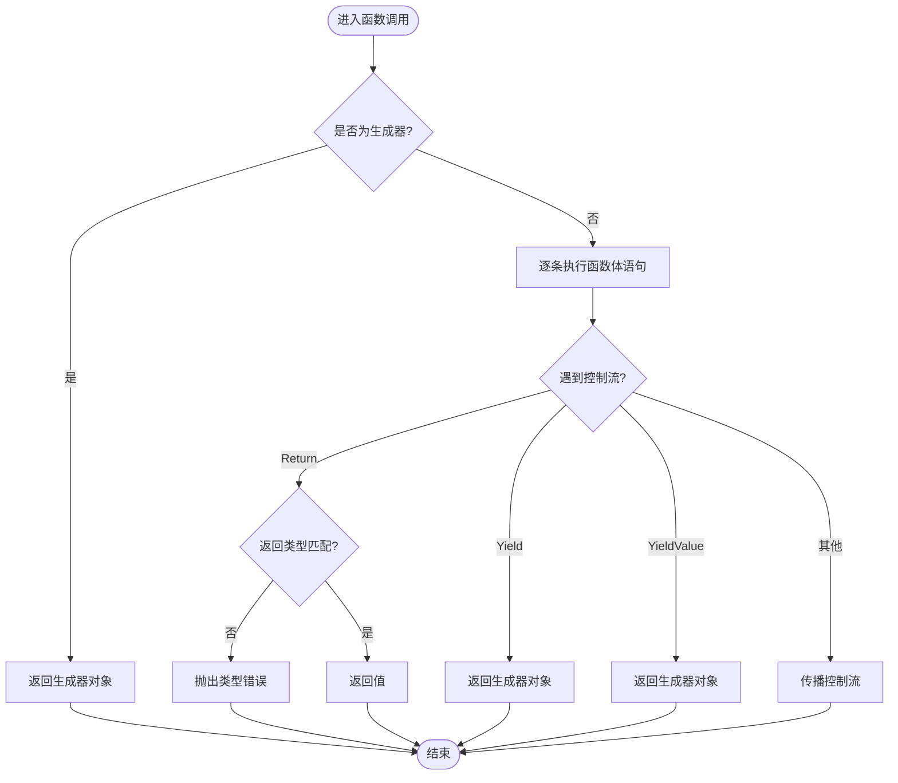
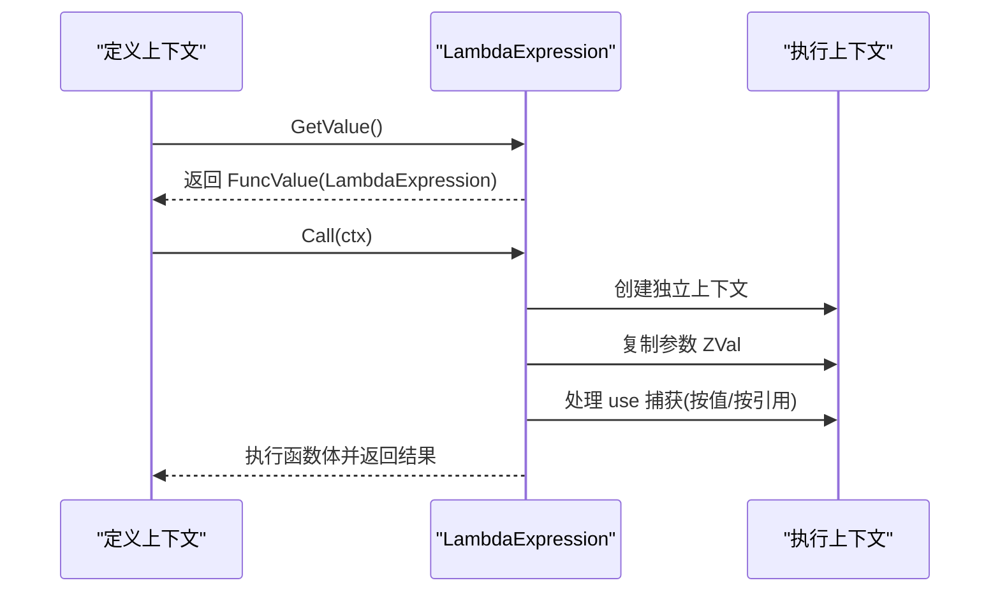
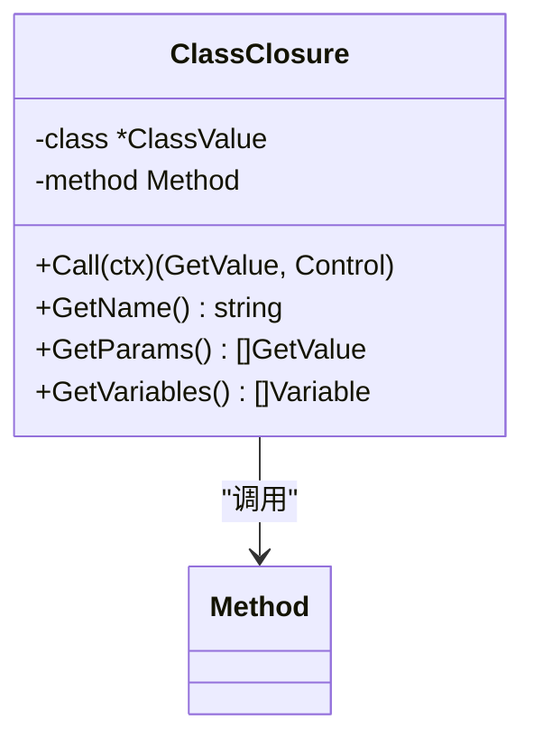
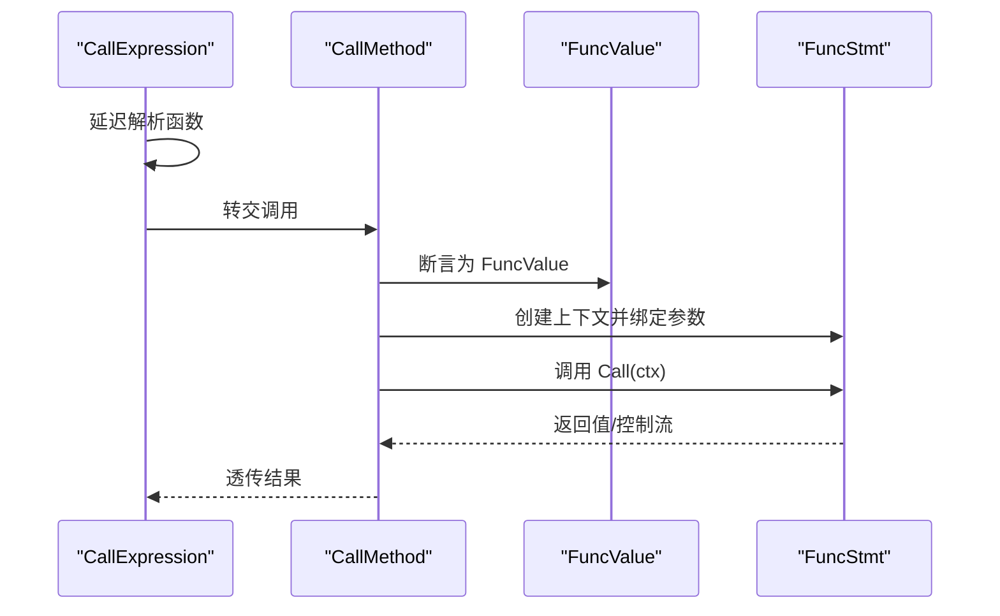
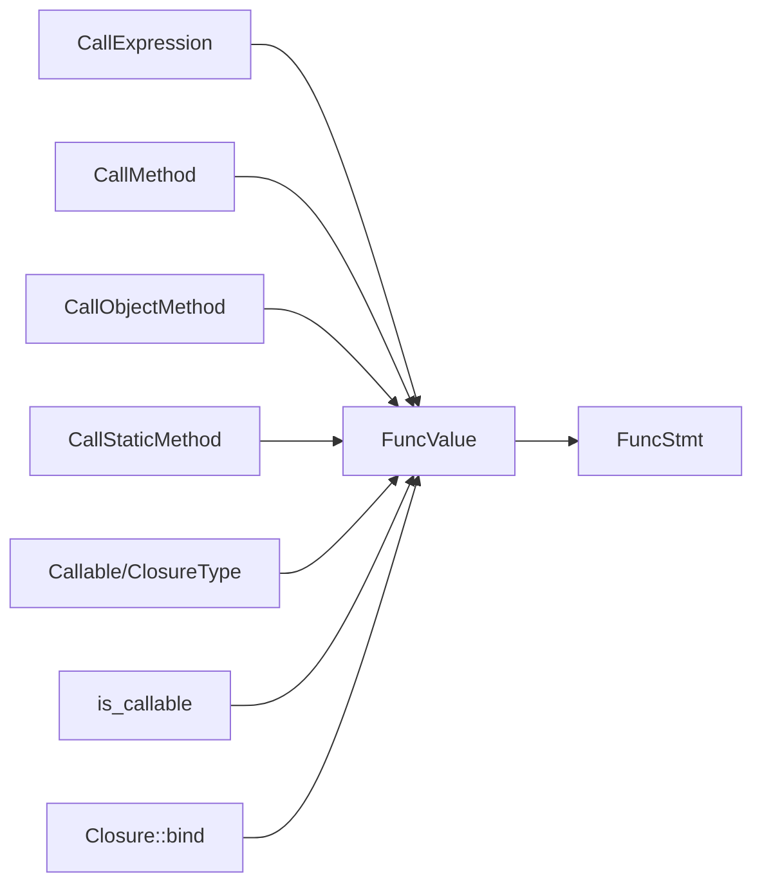

# 可调用值类型

<cite>
**本文档引用的文件**
- [type_callable.go](file://data/type_callable.go)
- [types.go](file://data/types.go)
- [value.go](file://data/value.go)
- [value_call.go](file://data/value_call.go)
- [function.go](file://node/function.go)
- [lambda.go](file://node/lambda.go)
- [closure.go](file://node/closure.go)
- [call.go](file://node/call.go)
- [call_method.go](file://node/call_method.go)
- [call_object_method.go](file://node/call_object_method.go)
- [call_static_method.go](file://node/call_static_method.go)
- [is_callable.go](file://std/php/core/is_callable.go)
- [closure_class.go](file://std/php/core/closure_class.go)
- [array_filter_callable_forms_test.php](file://tests/php/array_filter_callable_forms_test.php)
- [array_filter_callback_modes_test.php](file://tests/php/array_filter_callback_modes_test.php)
</cite>

## 目录
1. [简介](#简介)
2. [项目结构](#项目结构)
3. [核心组件](#核心组件)
4. [架构总览](#架构总览)
5. [详细组件分析](#详细组件分析)
6. [依赖分析](#依赖分析)
7. [性能考虑](#性能考虑)
8. [故障排查指南](#故障排查指南)
9. [结论](#结论)
10. [附录](#附录)

## 简介
本文件系统性梳理并记录可调用值类型（CallableValue）的设计与实现，覆盖函数、方法、闭包与匿名函数的统一调用机制；详述可调用对象的创建、参数传递、返回值处理、类型检查与错误处理；并给出常见使用场景与最佳实践。

## 项目结构
围绕可调用值类型的关键代码分布在以下模块：
- 数据层：类型系统与值抽象，定义可调用类型、函数值包装与调用接口
- 节点层：函数定义、Lambda（匿名函数）、闭包封装与调用流程
- 调用层：函数调用、对象方法调用、静态方法调用与延迟解析
- 标准库：is_callable 辅助判断、Closure 类方法（如 bind）

**图表来源**
- [type_callable.go:1-19](file://data/type_callable.go#L1-L19)
- [types.go:135-140](file://data/types.go#L135-L140)
- [value.go:9-18](file://data/value.go#L9-L18)
- [value_call.go:5-29](file://data/value_call.go#L5-L29)
- [function.go:9-101](file://node/function.go#L9-L101)
- [lambda.go:7-38](file://node/lambda.go#L7-L38)
- [closure.go:10-36](file://node/closure.go#L10-L36)
- [call.go:81-109](file://node/call.go#L81-L109)
- [call_method.go:57-159](file://node/call_method.go#L57-L159)
- [call_object_method.go:83-129](file://node/call_object_method.go#L83-L129)
- [call_static_method.go:130-232](file://node/call_static_method.go#L130-L232)
- [is_callable.go:51-102](file://std/php/core/is_callable.go#L51-L102)
- [closure_class.go:53-102](file://std/php/core/closure_class.go#L53-L102)

**章节来源**
- [type_callable.go:1-19](file://data/type_callable.go#L1-L19)
- [types.go:135-140](file://data/types.go#L135-L140)
- [value.go:9-18](file://data/value.go#L9-L18)
- [value_call.go:5-29](file://data/value_call.go#L5-L29)
- [function.go:9-101](file://node/function.go#L9-L101)
- [lambda.go:7-38](file://node/lambda.go#L7-L38)
- [closure.go:10-36](file://node/closure.go#L10-L36)
- [call.go:81-109](file://node/call.go#L81-L109)
- [call_method.go:57-159](file://node/call_method.go#L57-L159)
- [call_object_method.go:83-129](file://node/call_object_method.go#L83-L129)
- [call_static_method.go:130-232](file://node/call_static_method.go#L130-L232)
- [is_callable.go:51-102](file://std/php/core/is_callable.go#L51-L102)
- [closure_class.go:53-102](file://std/php/core/closure_class.go#L53-L102)

## 核心组件
- 可调用类型系统
  - Callable 类型用于判定值是否可被调用（函数、数组回调、字符串函数名等）
  - ClosureType 用于闭包/可调用类型判断
- CallableValue 接口
  - 统一的可调用值抽象，具备 Call、IsMethod、GetMethodName 等能力
- FuncValue 包装器
  - 将具体可调用实现（函数、Lambda、闭包）包装为可调用值，转发调用请求
- 函数定义与调用
  - FunctionStatement 定义函数体与参数，支持生成器语义与返回值类型检查
  - LambdaExpression 支持闭包捕获与独立执行上下文
  - ClassClosure 支持对象方法闭包化
- 调用入口
  - CallExpression、CallMethod、CallObjectMethod、CallStaticMethod 提供不同调用路径
  - 延迟解析 CallLater/CallStaticMethodLater 解决类/函数未加载时的调用问题

**章节来源**
- [type_callable.go:3-18](file://data/type_callable.go#L3-L18)
- [types.go:234-248](file://data/types.go#L234-L248)
- [value.go:9-18](file://data/value.go#L9-L18)
- [value_call.go:5-29](file://data/value_call.go#L5-L29)
- [function.go:9-150](file://node/function.go#L9-L150)
- [lambda.go:7-103](file://node/lambda.go#L7-L103)
- [closure.go:10-36](file://node/closure.go#L10-L36)
- [call.go:81-109](file://node/call.go#L81-L109)
- [call_method.go:57-159](file://node/call_method.go#L57-L159)
- [call_object_method.go:83-129](file://node/call_object_method.go#L83-L129)
- [call_static_method.go:130-232](file://node/call_static_method.go#L130-L232)

## 架构总览
可调用值类型通过“类型判定 + 值包装 + 调用分发”的分层设计，实现对函数、方法、闭包与匿名函数的统一调用。

**图表来源**
- [call.go:81-109](file://node/call.go#L81-L109)
- [value_call.go:15-21](file://data/value_call.go#L15-L21)
- [function.go:103-150](file://node/function.go#L103-L150)
- [lambda.go:40-102](file://node/lambda.go#L40-L102)
- [closure.go:28-36](file://node/closure.go#L28-L36)

## 详细组件分析

### 类型系统与判定
- Callable 类型
  - 判定规则：FuncValue、ArrayValue、StringValue（字符串函数名）视为可调用
- ClosureType 类型
  - 与 Callable 类似，额外支持数组回调与字符串函数名
- 基础类型工厂
  - NewBaseType 将 "callable" 映射为 Callable 类型实例

**图表来源**
- [type_callable.go:3-18](file://data/type_callable.go#L3-L18)
- [types.go:234-248](file://data/types.go#L234-L248)

**章节来源**
- [type_callable.go:6-14](file://data/type_callable.go#L6-L14)
- [types.go:135-140](file://data/types.go#L135-L140)
- [types.go:234-248](file://data/types.go#L234-L248)

### CallableValue 接口与 FuncValue 包装
- CallableValue 接口
  - 定义 Call(args...)、IsMethod()、GetMethodName() 等统一调用能力
- FuncValue
  - 将任意 FuncStmt（函数、Lambda、闭包）包装为可调用值
  - GetValue 返回自身，Call 转发至底层 FuncStmt.Call

**图表来源**
- [value.go:9-18](file://data/value.go#L9-L18)
- [value_call.go:5-29](file://data/value_call.go#L5-L29)

**章节来源**
- [value.go:9-18](file://data/value.go#L9-L18)
- [value_call.go:5-29](file://data/value_call.go#L5-L29)

### 函数定义与调用（FunctionStatement）
- 定义阶段
  - 记录名称、参数、变量表、返回类型与是否为生成器
- 调用阶段
  - 若为生成器：立即返回生成器对象，不执行函数体
  - 非生成器：顺序执行语句，处理 Return/Yield/YieldValue 控制流
  - 返回值类型检查：若声明了返回类型且不匹配，抛出类型错误

**图表来源**
- [function.go:103-150](file://node/function.go#L103-L150)

**章节来源**
- [function.go:9-150](file://node/function.go#L9-L150)

### 匿名函数（LambdaExpression）
- 定义与执行
  - GetValue 返回 FuncValue 包装的 LambdaExpression
  - Call 时创建独立执行上下文，隔离外部变量污染
  - 支持 use 捕获：按值/按引用两种方式
- 作用域与 this 语义
  - 在类方法内定义的 Lambda：使用定义时对象创建 ClassMethodContext，保证 $this 语义

**图表来源**
- [lambda.go:27-38](file://node/lambda.go#L27-L38)
- [lambda.go:40-102](file://node/lambda.go#L40-L102)

**章节来源**
- [lambda.go:7-103](file://node/lambda.go#L7-L103)

### 对象方法闭包（ClassClosure）
- 将对象方法包装为闭包，保持方法签名与变量表
- 调用时创建类方法上下文，复制调用参数 ZVal 并执行方法

**图表来源**
- [closure.go:22-36](file://node/closure.go#L22-L36)

**章节来源**
- [closure.go:10-36](file://node/closure.go#L10-L36)

### 调用入口与参数绑定
- CallExpression
  - 延迟解析：未解析到具体函数时，尝试按全局/命名空间查找并缓存
- CallMethod
  - 处理 FuncValue 调用：创建函数上下文，绑定参数（支持命名参数、默认值、引用参数限制）
  - 记录本次调用的参数表达式列表到上下文中
- CallObjectMethod
  - 对象方法调用：优先精确匹配，否则尝试 __call 魔法方法
- CallStaticMethod
  - 静态方法调用：返回 FuncValue 包装的 staticMethodFunc，确保使用 ClassMethodContext

**图表来源**
- [call.go:81-109](file://node/call.go#L81-L109)
- [call_method.go:57-159](file://node/call_method.go#L57-L159)
- [call_object_method.go:83-129](file://node/call_object_method.go#L83-L129)
- [call_static_method.go:130-232](file://node/call_static_method.go#L130-L232)

**章节来源**
- [call.go:81-109](file://node/call.go#L81-L109)
- [call_method.go:57-159](file://node/call_method.go#L57-L159)
- [call_object_method.go:83-129](file://node/call_object_method.go#L83-L129)
- [call_static_method.go:130-232](file://node/call_static_method.go#L130-L232)

### 类型检查与错误处理
- is_callable
  - 支持字符串函数名、静态方法数组回调（类名+方法名）等判定
- 参数类型检查
  - 参数类型与赋值类型不一致时抛出错误
- 引用参数约束
  - 引用参数必须为必传参数，否则抛错
- 返回值类型检查
  - 函数声明了返回类型且实际返回不匹配时抛错
- 作用域与 this
  - 静态方法调用通过 ClassMethodContext 绑定当前类，保证 self:: 可用

**章节来源**
- [is_callable.go:51-102](file://std/php/core/is_callable.go#L51-L102)
- [function.go:173-184](file://node/function.go#L173-L184)
- [call_method.go:148-151](file://node/call_method.go#L148-L151)
- [function.go:119-126](file://node/function.go#L119-L126)
- [call_static_method.go:224-232](file://node/call_static_method.go#L224-L232)

### 使用示例与最佳实践
- 字符串函数名作为回调
  - 示例：array_filter 使用字符串函数名作为回调
- 静态方法回调
  - 示例：静态类方法作为回调
- 匿名函数（闭包）
  - 示例：fn(...) 形式的匿名函数回调
- use 捕获
  - 按值/按引用捕获外部变量，注意引用捕获的副作用

**章节来源**
- [array_filter_callable_forms_test.php:20-41](file://tests/php/array_filter_callable_forms_test.php#L20-L41)
- [array_filter_callback_modes_test.php:20-61](file://tests/php/array_filter_callback_modes_test.php#L20-L61)
- [lambda.go:59-78](file://node/lambda.go#L59-L78)

## 依赖分析
- 组件耦合
  - FuncValue 依赖 FuncStmt 接口，形成委托调用链
  - 调用入口（CallExpression/CallMethod/...）依赖 FuncValue 与上下文管理
- 类型系统
  - Callable/ClosureType 与基础类型工厂协同，统一可调用判定
- 外部依赖
  - 标准库 is_callable 与 Closure::bind 提供辅助能力

**图表来源**
- [value_call.go:15-21](file://data/value_call.go#L15-L21)
- [call.go:81-109](file://node/call.go#L81-L109)
- [call_method.go:57-159](file://node/call_method.go#L57-L159)
- [call_object_method.go:83-129](file://node/call_object_method.go#L83-L129)
- [call_static_method.go:130-232](file://node/call_static_method.go#L130-L232)
- [type_callable.go:6-14](file://data/type_callable.go#L6-L14)
- [is_callable.go:51-102](file://std/php/core/is_callable.go#L51-L102)
- [closure_class.go:53-102](file://std/php/core/closure_class.go#L53-L102)

**章节来源**
- [value_call.go:15-21](file://data/value_call.go#L15-L21)
- [call.go:81-109](file://node/call.go#L81-L109)
- [call_method.go:57-159](file://node/call_method.go#L57-L159)
- [call_object_method.go:83-129](file://node/call_object_method.go#L83-L129)
- [call_static_method.go:130-232](file://node/call_static_method.go#L130-L232)
- [type_callable.go:6-14](file://data/type_callable.go#L6-L14)
- [is_callable.go:51-102](file://std/php/core/is_callable.go#L51-L102)
- [closure_class.go:53-102](file://std/php/core/closure_class.go#L53-L102)

## 性能考虑
- 上下文创建与参数绑定
  - 每次调用均需创建/继承上下文并绑定参数，建议减少深层嵌套调用
- 生成器函数
  - 生成器函数调用立即返回生成器对象，避免执行函数体，有利于惰性求值
- 延迟解析
  - CallLater/CallStaticMethodLater 在首次调用时解析符号，减少启动期开销

## 故障排查指南
- 无法调用函数
  - 检查函数名拼写与命名空间；确认函数已注册或通过 CallLater 解析
- 参数类型不匹配
  - 核对参数类型声明与传入值类型；默认值与命名参数使用是否正确
- 引用参数错误
  - 引用参数必须为必传参数；检查参数定义与调用位置
- 返回值类型错误
  - 函数声明了返回类型但实际返回不匹配；修正返回值或类型声明
- 静态方法调用失败
  - 确保通过静态方法包装器返回的 FuncValue，以便使用 ClassMethodContext

**章节来源**
- [call.go:81-109](file://node/call.go#L81-L109)
- [function.go:173-184](file://node/function.go#L173-L184)
- [call_method.go:148-151](file://node/call_method.go#L148-L151)
- [function.go:119-126](file://node/function.go#L119-L126)
- [call_static_method.go:224-232](file://node/call_static_method.go#L224-L232)

## 结论
可调用值类型通过统一的 CallableValue 接口与 FuncValue 包装器，将函数、方法、闭包与匿名函数纳入一致的调用模型；配合完善的类型系统、参数绑定与错误处理机制，既满足 PHP 语义一致性，又便于扩展与维护。实践中建议充分利用 Lambda 的 use 捕获、生成器的惰性特性与 is_callable 的辅助判断，以获得更清晰与高效的代码结构。

## 附录
- 相关测试用例
  - array_filter 多种 callable 形式与回调模式测试
- 相关标准库
  - is_callable 与 Closure::bind 的行为参考

**章节来源**
- [array_filter_callable_forms_test.php:1-45](file://tests/php/array_filter_callable_forms_test.php#L1-L45)
- [array_filter_callback_modes_test.php:1-63](file://tests/php/array_filter_callback_modes_test.php#L1-L63)
- [is_callable.go:51-102](file://std/php/core/is_callable.go#L51-L102)
- [closure_class.go:53-102](file://std/php/core/closure_class.go#L53-L102)