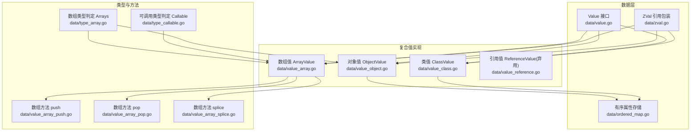
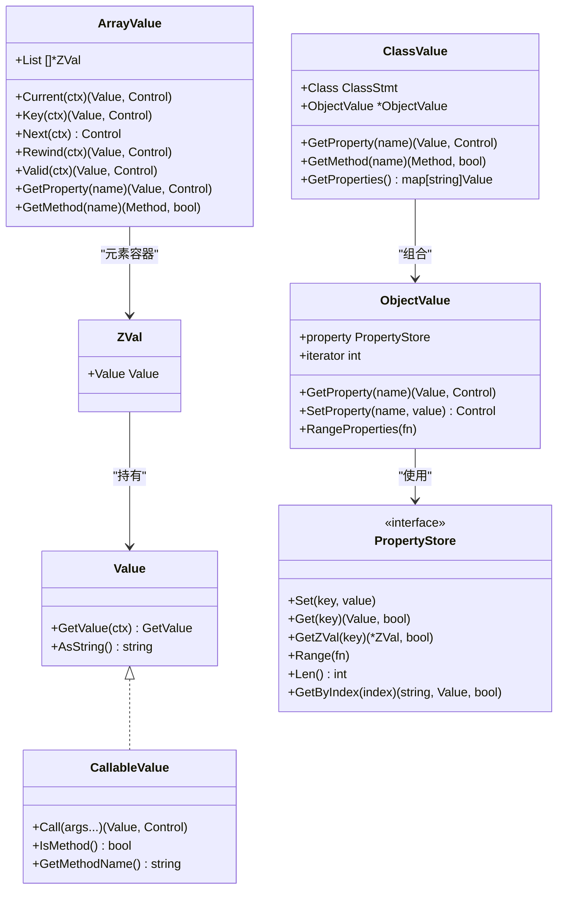
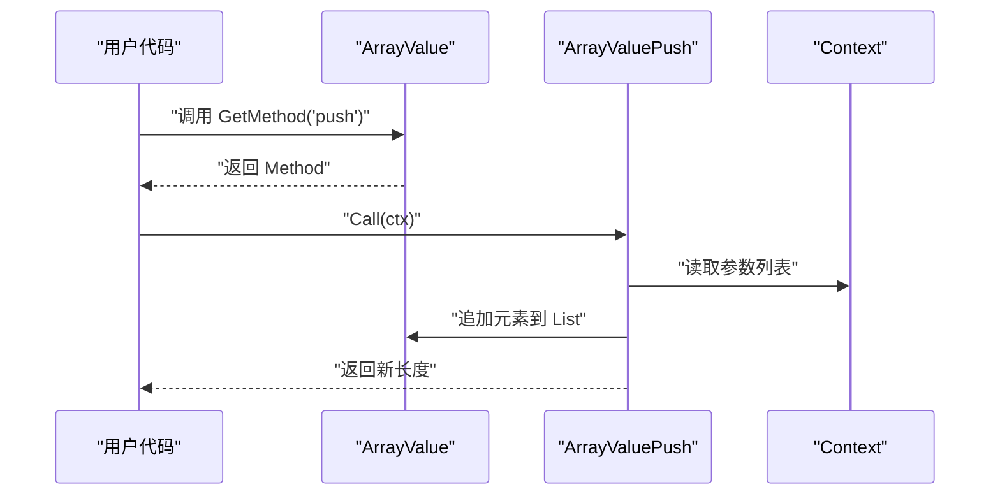
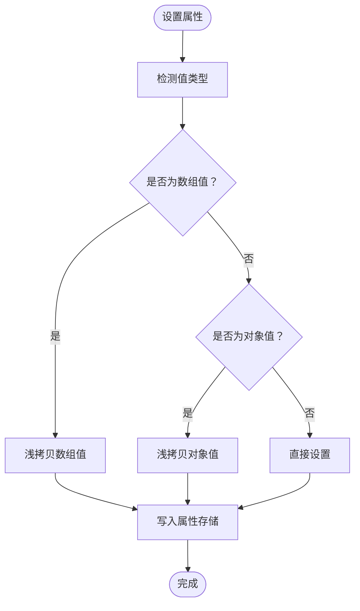
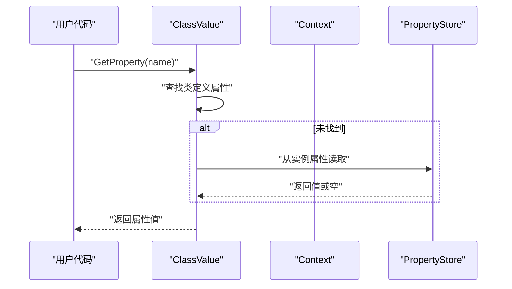
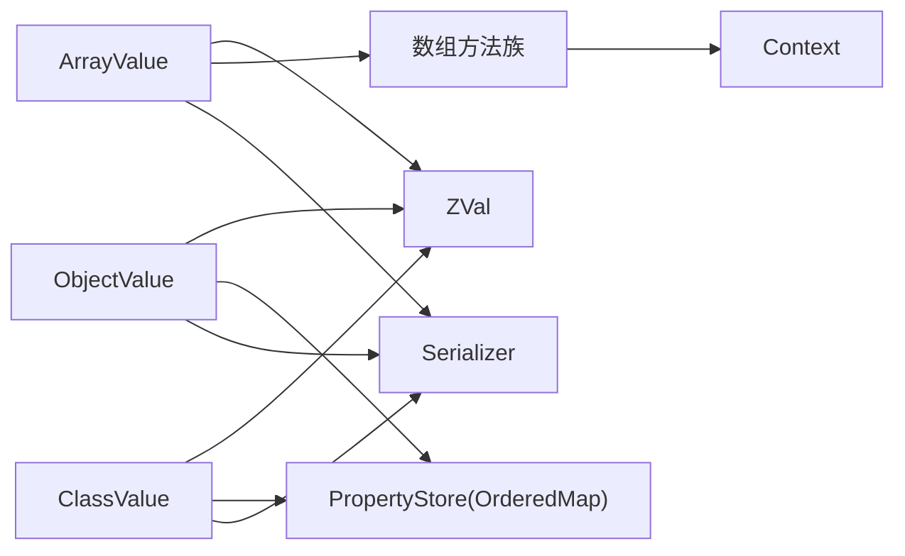

# 复合值类型

<cite>
**本文档引用的文件**
- [data/value.go](file://data/value.go)
- [data/zval.go](file://data/zval.go)
- [data/ordered_map.go](file://data/ordered_map.go)
- [data/value_array.go](file://data/value_array.go)
- [data/value_object.go](file://data/value_object.go)
- [data/value_class.go](file://data/value_class.go)
- [data/value_reference.go](file://data/value_reference.go)
- [data/type_array.go](file://data/type_array.go)
- [data/type_callable.go](file://data/type_callable.go)
- [data/value_array_push.go](file://data/value_array_push.go)
- [data/value_array_pop.go](file://data/value_array_pop.go)
- [data/value_array_splice.go](file://data/value_array_splice.go)
</cite>

## 目录
1. [简介](#简介)
2. [项目结构](#项目结构)
3. [核心组件](#核心组件)
4. [架构总览](#架构总览)
5. [详细组件分析](#详细组件分析)
6. [依赖分析](#依赖分析)
7. [性能考虑](#性能考虑)
8. [故障排查指南](#故障排查指南)
9. [结论](#结论)
10. [附录](#附录)

## 简介
本文件聚焦于复合值类型的实现与使用，涵盖数组、对象、可调用对象以及类值的内部结构、元素访问与修改方法、嵌套结构处理、序列化与反序列化、迭代器行为等。文档同时解释了与之配套的 ZVal 引用包装、有序属性存储结构、类型判定与方法分发机制，并提供创建、遍历与序列化的实践指引。

## 项目结构
复合值类型相关的核心代码位于 data 目录，围绕 Value 接口与具体实现展开；对象属性存储采用有序映射以维持插入顺序；数组与对象均支持序列化与反序列化；类值在对象值基础上附加类语义与继承查找。

图表来源
- [data/value.go:1-39](file://data/value.go#L1-L39)
- [data/zval.go:1-18](file://data/zval.go#L1-L18)
- [data/ordered_map.go:1-109](file://data/ordered_map.go#L1-L109)
- [data/value_array.go:1-162](file://data/value_array.go#L1-L162)
- [data/value_object.go:1-190](file://data/value_object.go#L1-L190)
- [data/value_class.go:1-295](file://data/value_class.go#L1-L295)
- [data/type_array.go:1-20](file://data/type_array.go#L1-L20)
- [data/type_callable.go:1-19](file://data/type_callable.go#L1-L19)
- [data/value_array_push.go:1-55](file://data/value_array_push.go#L1-L55)
- [data/value_array_pop.go:1-44](file://data/value_array_pop.go#L1-L44)
- [data/value_array_splice.go:1-111](file://data/value_array_splice.go#L1-L111)

章节来源
- [data/value.go:1-39](file://data/value.go#L1-L39)
- [data/zval.go:1-18](file://data/zval.go#L1-L18)
- [data/ordered_map.go:1-109](file://data/ordered_map.go#L1-L109)
- [data/value_array.go:1-162](file://data/value_array.go#L1-L162)
- [data/value_object.go:1-190](file://data/value_object.go#L1-L190)
- [data/value_class.go:1-295](file://data/value_class.go#L1-L295)
- [data/type_array.go:1-20](file://data/type_array.go#L1-L20)
- [data/type_callable.go:1-19](file://data/type_callable.go#L1-L19)
- [data/value_array_push.go:1-55](file://data/value_array_push.go#L1-L55)
- [data/value_array_pop.go:1-44](file://data/value_array_pop.go#L1-L44)
- [data/value_array_splice.go:1-111](file://data/value_array_splice.go#L1-L111)

## 核心组件
- Value 接口：统一的值抽象，提供字符串化与基础取值能力；可调用值扩展出调用与方法识别能力；对象/类值进一步扩展属性读写与方法查找。
- ZVal：轻量引用包装，承载 Value 并作为数组与对象元素的容器，便于共享与按需解包。
- 有序属性存储 PropertyStore：基于 OrderedMap，维护插入顺序、键到索引的快速映射与双向索引，支持并发安全的读写。
- 数组值 ArrayValue：底层以 []*ZVal 存储，提供迭代器与丰富的方法族（push/pop/shift/unshift/slice/splice/join/reverse/sort/...）。
- 对象值 ObjectValue：以 PropertyStore 存储属性，提供迭代器与属性读写；在属性赋值时对数组/对象值执行浅拷贝以模拟 PHP 的写时复制语义。
- 类值 ClassValue：在对象值基础上附加类语义，支持属性/方法的继承查找与上下文隔离。
- 类型判定：Arrays 与 Callable 提供类型识别，用于运行时判断与转换。

章节来源
- [data/value.go:1-39](file://data/value.go#L1-L39)
- [data/zval.go:1-18](file://data/zval.go#L1-L18)
- [data/ordered_map.go:1-109](file://data/ordered_map.go#L1-L109)
- [data/value_array.go:1-162](file://data/value_array.go#L1-L162)
- [data/value_object.go:1-190](file://data/value_object.go#L1-L190)
- [data/value_class.go:1-295](file://data/value_class.go#L1-L295)
- [data/type_array.go:1-20](file://data/type_array.go#L1-L20)
- [data/type_callable.go:1-19](file://data/type_callable.go#L1-L19)

## 架构总览
复合值类型围绕 Value 抽象与 ZVal 引用构建，数组与对象共享属性存储与序列化接口，类值在对象值之上叠加类语义与继承查找。方法族通过 Method 接口分发至具体实现，数组方法直接作用于底层切片，对象/类值通过属性存储与上下文协作。

图表来源
- [data/value.go:1-39](file://data/value.go#L1-L39)
- [data/zval.go:1-18](file://data/zval.go#L1-L18)
- [data/ordered_map.go:1-109](file://data/ordered_map.go#L1-L109)
- [data/value_array.go:1-162](file://data/value_array.go#L1-L162)
- [data/value_object.go:1-190](file://data/value_object.go#L1-L190)
- [data/value_class.go:1-295](file://data/value_class.go#L1-L295)

## 详细组件分析

### 数组值 ArrayValue
- 内部结构
  - 底层以 []*ZVal 列表存储元素，支持迭代器（当前索引、key/current/next/rewind/valid）。
  - 支持通过 GetProperty 访问 length 属性；通过 GetMethod 分发内置方法。
- 元素访问与修改
  - 通过迭代器顺序访问；通过方法族实现 push/pop/shift/unshift/slice/splice/join/reverse/sort/... 等。
  - CloneArrayValue 提供浅拷贝，仅复制切片头，不深拷贝每个 ZVal，满足“结构不共享”的修改隔离。
- 嵌套结构处理
  - 在对象/类值属性赋值时，若值为数组/对象，会触发浅拷贝以避免多处共享导致的副作用。
- 序列化与反序列化
  - 通过 Marshal/Unmarshal 交由 Serializer 处理，ToGoValue 返回序列化结果。
- 示例路径
  - 创建与遍历：[data/value_array.go:7-162](file://data/value_array.go#L7-L162)
  - push 方法：[data/value_array_push.go:1-55](file://data/value_array_push.go#L1-L55)
  - pop 方法：[data/value_array_pop.go:1-44](file://data/value_array_pop.go#L1-L44)
  - splice 方法：[data/value_array_splice.go:1-111](file://data/value_array_splice.go#L1-L111)

图表来源
- [data/value_array.go:84-133](file://data/value_array.go#L84-L133)
- [data/value_array_push.go:9-26](file://data/value_array_push.go#L9-L26)

章节来源
- [data/value_array.go:1-162](file://data/value_array.go#L1-L162)
- [data/value_array_push.go:1-55](file://data/value_array_push.go#L1-L55)
- [data/value_array_pop.go:1-44](file://data/value_array_pop.go#L1-L44)
- [data/value_array_splice.go:1-111](file://data/value_array_splice.go#L1-L111)

### 对象值 ObjectValue
- 内部结构
  - 基于 PropertyStore（OrderedMap）存储属性，保持插入顺序；提供迭代器接口。
- 元素访问与修改
  - GetProperty/SetProperty 支持动态属性读写；SetProperty 在赋值数组/对象时执行浅拷贝，避免共享修改。
  - RangeProperties 按插入顺序遍历，保证稳定输出。
- 嵌套结构处理
  - 对属性值为数组/对象时的浅拷贝策略，确保结构修改不影响其他引用。
- 序列化与反序列化
  - 通过 Marshal/Unmarshal 交由 Serializer 处理，ToGoValue 返回序列化结果。
- 示例路径
  - 创建与浅拷贝：[data/value_object.go:11-40](file://data/value_object.go#L11-L40)
  - 属性存取与迭代：[data/value_object.go:79-190](file://data/value_object.go#L79-L190)
  - 有序属性存储：[data/ordered_map.go:1-109](file://data/ordered_map.go#L1-L109)

图表来源
- [data/value_object.go:96-107](file://data/value_object.go#L96-L107)

章节来源
- [data/value_object.go:1-190](file://data/value_object.go#L1-L190)
- [data/ordered_map.go:1-109](file://data/ordered_map.go#L1-L109)

### 类值 ClassValue
- 内部结构
  - 组合 ObjectValue，附加 ClassStmt 与运行时上下文；支持属性/方法的继承查找。
- 元素访问与修改
  - GetProperty 优先从类定义与实例属性中获取；SetProperty 在类层面委托或执行浅拷贝后写入。
  - GetProperties 合并实例与类定义的属性，处理继承链与默认值。
- 嵌套结构处理
  - 属性赋值时对数组/对象值执行浅拷贝，避免跨引用共享。
- 序列化与反序列化
  - 通过 Marshal/Unmarshal 交由 Serializer 处理，ToGoValue 返回序列化结果。
- 示例路径
  - 类值构造与属性合并：[data/value_class.go:8-202](file://data/value_class.go#L8-L202)
  - 方法继承查找：[data/value_class.go:111-137](file://data/value_class.go#L111-L137)

图表来源
- [data/value_class.go:83-100](file://data/value_class.go#L83-L100)

章节来源
- [data/value_class.go:1-295](file://data/value_class.go#L1-L295)

### 可调用对象与类型判定
- 可调用对象
  - Callable 类型判定支持函数值、数组值与字符串值，作为 PHP 可调用形式的统一识别。
- 类型判定
  - Arrays 类型判定将数组值与对象值（关联数组在 Origami 中以对象值表示）均视为 array 类型。
- 示例路径
  - 可调用判定：[data/type_callable.go:1-19](file://data/type_callable.go#L1-L19)
  - 数组类型判定：[data/type_array.go:1-20](file://data/type_array.go#L1-L20)

章节来源
- [data/type_callable.go:1-19](file://data/type_callable.go#L1-L19)
- [data/type_array.go:1-20](file://data/type_array.go#L1-L20)

### 引用值（弃用）
- ReferenceValue/IndexReferenceValue 提供变量引用与索引引用的字符串化与序列化能力；包含数据库扫描与类型转换逻辑（弃用路径，保留参考）。
- 示例路径
  - 引用值实现：[data/value_reference.go:1-735](file://data/value_reference.go#L1-L735)

章节来源
- [data/value_reference.go:1-735](file://data/value_reference.go#L1-L735)

## 依赖分析
- 组件耦合
  - ArrayValue/ObjectValue/ClassValue 均依赖 ZVal 作为元素容器；对象/类值依赖 PropertyStore 保持属性顺序。
  - 数组方法实现通过 Method 接口与 Context 协作，直接操作底层切片。
- 外部依赖
  - Serializer 接口负责序列化/反序列化；Context 提供参数与变量访问。
- 循环依赖
  - 未发现直接循环依赖；类值通过组合对象值间接共享属性存储。

图表来源
- [data/value_array.go:1-162](file://data/value_array.go#L1-L162)
- [data/value_object.go:1-190](file://data/value_object.go#L1-L190)
- [data/value_class.go:1-295](file://data/value_class.go#L1-L295)
- [data/ordered_map.go:1-109](file://data/ordered_map.go#L1-L109)

章节来源
- [data/value_array.go:1-162](file://data/value_array.go#L1-L162)
- [data/value_object.go:1-190](file://data/value_object.go#L1-L190)
- [data/value_class.go:1-295](file://data/value_class.go#L1-L295)
- [data/ordered_map.go:1-109](file://data/ordered_map.go#L1-L109)

## 性能考虑
- 浅拷贝策略
  - CloneArrayValue/CloneObjectValue 仅复制切片头或属性存储结构，不深拷贝每个元素，降低结构修改成本。
- 并发安全
  - OrderedMap 使用读写锁保护，适合高并发下的属性读写与遍历。
- 序列化开销
  - Marshal/Unmarshal 由 Serializer 实现，建议结合具体序列化格式评估内存与 CPU 成本。
- 迭代器
  - 数组与对象均提供迭代器接口，避免一次性复制整个集合，提升遍历效率。

## 故障排查指南
- 属性值共享问题
  - 现象：对数组/对象属性进行原地修改后，其他引用也受影响。
  - 处理：确认在 SetProperty 时已触发浅拷贝；检查是否绕过属性写入直接修改底层结构。
  - 参考：[data/value_object.go:96-107](file://data/value_object.go#L96-L107)
- 迭代器越界
  - 现象：迭代过程中索引越界或重复访问。
  - 处理：确保在每次迭代前调用 Rewind，使用 Valid 判断有效性。
  - 参考：[data/value_array.go:37-61](file://data/value_array.go#L37-L61)，[data/value_object.go:154-189](file://data/value_object.go#L154-L189)
- 方法调用参数错误
  - 现象：数组方法参数类型或数量不匹配。
  - 处理：核对方法签名与参数传递；必要时在调用前进行类型转换。
  - 参考：[data/value_array_push.go:40-54](file://data/value_array_push.go#L40-L54)，[data/value_array_splice.go:92-110](file://data/value_array_splice.go#L92-L110)
- 序列化失败
  - 现象：Marshal/Unmarshal 返回错误。
  - 处理：检查 Serializer 实现与数据结构一致性；确认嵌套结构中的复合值均可序列化。
  - 参考：[data/value_array.go:143-153](file://data/value_array.go#L143-L153)，[data/value_object.go:140-150](file://data/value_object.go#L140-L150)，[data/value_class.go:284-294](file://data/value_class.go#L284-L294)

章节来源
- [data/value_object.go:96-107](file://data/value_object.go#L96-L107)
- [data/value_array.go:37-61](file://data/value_array.go#L37-L61)
- [data/value_object.go:154-189](file://data/value_object.go#L154-L189)
- [data/value_array_push.go:40-54](file://data/value_array_push.go#L40-L54)
- [data/value_array_splice.go:92-110](file://data/value_array_splice.go#L92-L110)
- [data/value_array.go:143-153](file://data/value_array.go#L143-L153)
- [data/value_object.go:140-150](file://data/value_object.go#L140-L150)
- [data/value_class.go:284-294](file://data/value_class.go#L284-L294)

## 结论
复合值类型通过统一的 Value 抽象与 ZVal 引用包装，实现了数组、对象与类值的一致性访问与修改。有序属性存储保障了属性的插入顺序与高效遍历；浅拷贝策略在写时复制语义下平衡了性能与正确性；方法族与类型判定完善了运行时行为与兼容性。配合序列化接口，复合值可在不同场景间稳定流转。

## 附录
- 创建与遍历
  - 数组：使用工厂函数创建数组值，随后通过迭代器逐项访问；或调用内置方法进行修改。
    - 参考：[data/value_array.go:7-162](file://data/value_array.go#L7-L162)
  - 对象：通过工厂函数创建对象值，使用 SetProperty/SetProperty 写入属性，使用 RangeProperties 保持顺序遍历。
    - 参考：[data/value_object.go:11-190](file://data/value_object.go#L11-L190)
  - 类值：通过类值构造函数创建，结合上下文与继承查找获取属性与方法。
    - 参考：[data/value_class.go:8-295](file://data/value_class.go#L8-L295)
- 序列化
  - 使用 Marshal/Unmarshal 或 ToGoValue 将复合值序列化为字节流或通用值。
    - 参考：[data/value_array.go:143-153](file://data/value_array.go#L143-L153)，[data/value_object.go:140-150](file://data/value_object.go#L140-L150)，[data/value_class.go:284-294](file://data/value_class.go#L284-L294)