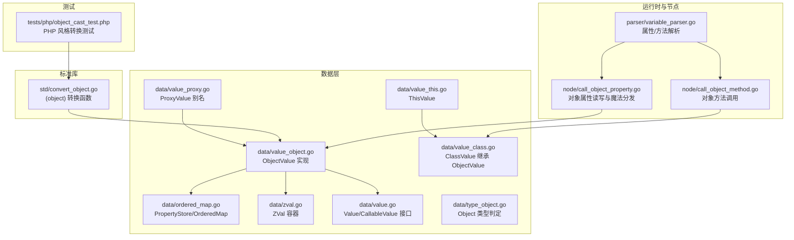
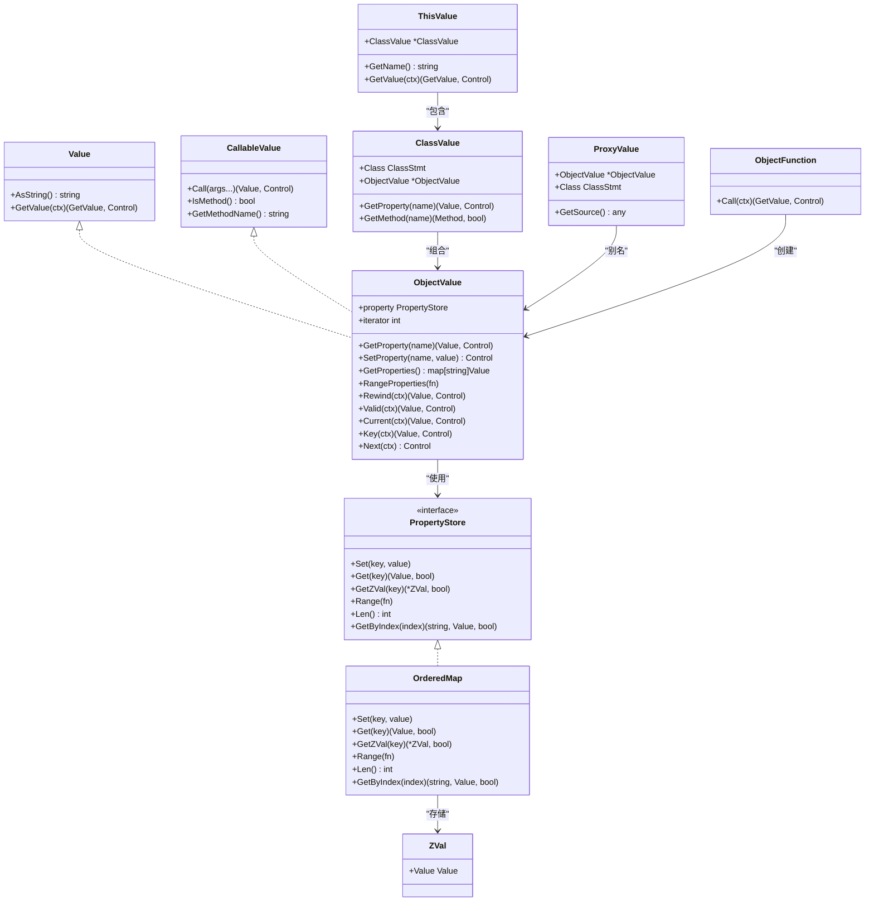
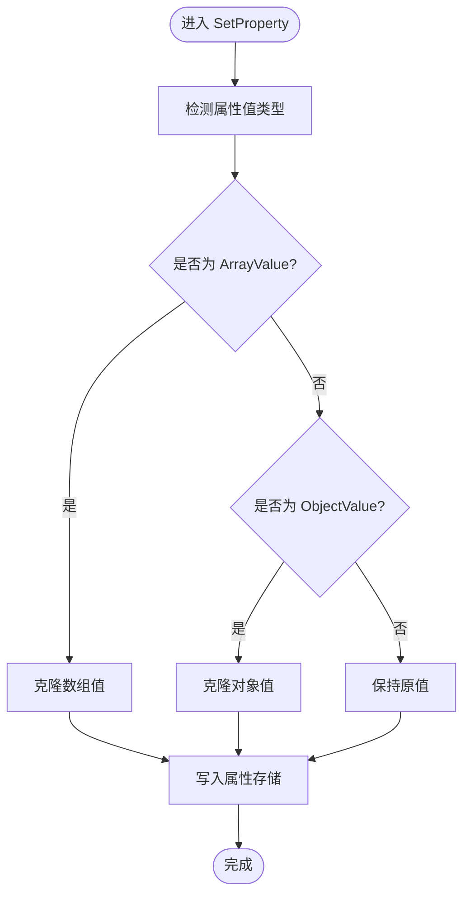
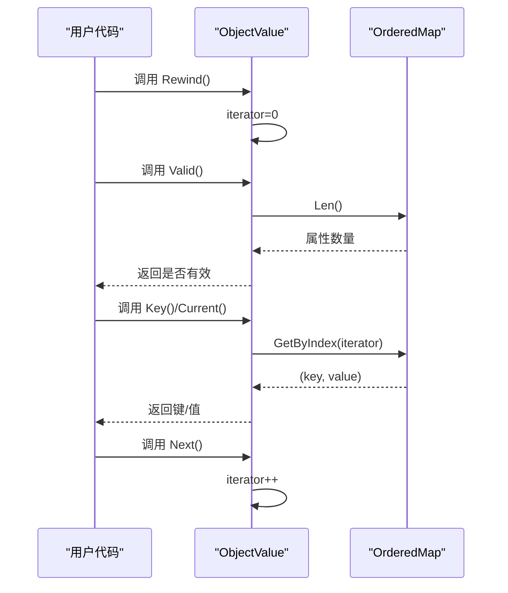
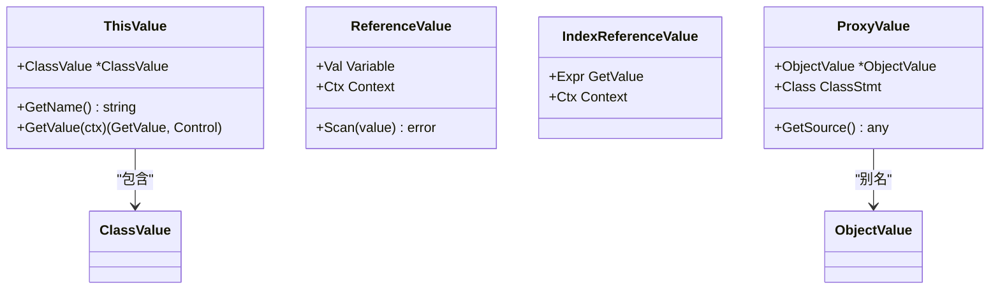
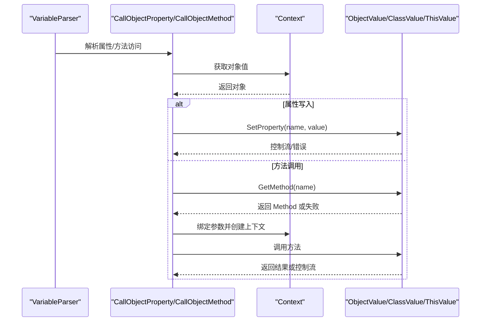
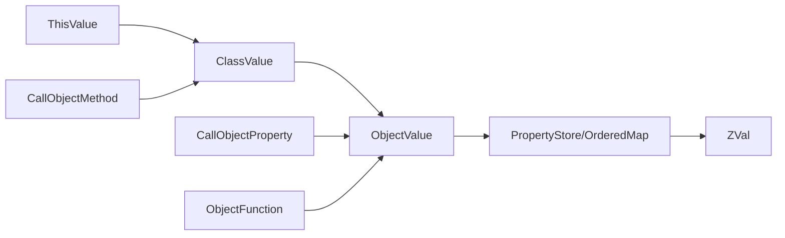

# 对象值类型

<cite>
**本文档引用的文件**
- [value_object.go](file://data/value_object.go)
- [ordered_map.go](file://data/ordered_map.go)
- [zval.go](file://data/zval.go)
- [value.go](file://data/value.go)
- [type_object.go](file://data/type_object.go)
- [value_this.go](file://data/value_this.go)
- [value_proxy.go](file://data/value_proxy.go)
- [value_class.go](file://data/value_class.go)
- [convert_object.go](file://std/convert_object.go)
- [object_cast_test.php](file://tests/php/object_cast_test.php)
- [call_object_property.go](file://node/call_object_property.go)
- [call_object_method.go](file://node/call_object_method.go)
- [variable_parser.go](file://parser/variable_parser.go)
</cite>

## 目录
1. [简介](#简介)
2. [项目结构](#项目结构)
3. [核心组件](#核心组件)
4. [架构总览](#架构总览)
5. [组件详细分析](#组件详细分析)
6. [依赖关系分析](#依赖关系分析)
7. [性能考量](#性能考量)
8. [故障排查指南](#故障排查指南)
9. [结论](#结论)
10. [附录](#附录)

## 简介
本文件面向“对象值类型”的API与实现细节，聚焦 ObjectValue 的内部结构、属性访问与方法调用机制，以及 this 值、引用值与代理值的特殊处理。文档同时覆盖对象的创建、属性设置与获取、迭代器行为、原型链与魔法方法分发、序列化与反序列化、以及内存管理与生命周期控制策略。内容以循序渐进的方式组织，既适合初学者快速上手，也便于资深开发者深入理解实现细节。

## 项目结构
围绕对象值类型的关键文件分布如下：
- 数据层：对象值、属性存储、ZVal 容器、值接口与类型判定
- 运行时与节点：对象属性访问、方法调用、变量解析
- 标准库：对象类型转换函数
- 测试：PHP 风格 (object) 转换行为验证

**图表来源**
- [value_object.go:11-47](file://data/value_object.go#L11-L47)
- [ordered_map.go:17-31](file://data/ordered_map.go#L17-L31)
- [zval.go:4-13](file://data/zval.go#L4-L13)
- [value.go:4-38](file://data/value.go#L4-L38)
- [type_object.go:3-18](file://data/type_object.go#L3-L18)
- [value_this.go:3-19](file://data/value_this.go#L3-L19)
- [value_proxy.go:3-19](file://data/value_proxy.go#L3-L19)
- [value_class.go:8-25](file://data/value_class.go#L8-L25)
- [convert_object.go:21-52](file://std/convert_object.go#L21-L52)
- [call_object_property.go:46-84](file://node/call_object_property.go#L46-L84)
- [call_object_method.go:29-45](file://node/call_object_method.go#L29-L45)
- [variable_parser.go:389-514](file://parser/variable_parser.go#L389-L514)
- [object_cast_test.php:12-41](file://tests/php/object_cast_test.php#L12-L41)

**章节来源**
- [value_object.go:11-190](file://data/value_object.go#L11-L190)
- [ordered_map.go:17-109](file://data/ordered_map.go#L17-L109)
- [zval.go:4-18](file://data/zval.go#L4-L18)
- [value.go:4-38](file://data/value.go#L4-L38)
- [type_object.go:3-18](file://data/type_object.go#L3-L18)
- [value_this.go:3-19](file://data/value_this.go#L3-L19)
- [value_proxy.go:3-19](file://data/value_proxy.go#L3-L19)
- [value_class.go:8-200](file://data/value_class.go#L8-L200)
- [convert_object.go:10-67](file://std/convert_object.go#L10-L67)
- [object_cast_test.php:12-41](file://tests/php/object_cast_test.php#L12-L41)
- [call_object_property.go:46-115](file://node/call_object_property.go#L46-L115)
- [call_object_method.go:29-45](file://node/call_object_method.go#L29-L45)
- [variable_parser.go:389-514](file://parser/variable_parser.go#L389-L514)

## 核心组件
- ObjectValue：对象值的核心实现，持有属性存储、迭代器状态，并实现值接口与迭代器接口。
- PropertyStore/OrderedMap：有序属性存储，维护插入顺序、键到索引的映射，提供并发安全的增删改查与按序遍历。
- ZVal：值容器，包装任意 Value，作为属性存储的基本单元。
- Value/CallableValue 接口：统一的值抽象与可调用值接口，支撑对象与方法调用。
- Object 类型判定：判断值是否为对象类型（ObjectValue 或 ClassValue）。
- ThisValue：this 值包装，指向 ClassValue，提供属性与方法访问。
- ProxyValue：代理值别名，基于 ObjectValue 实现。
- ClassValue：类实例值，组合 ObjectValue 并扩展类语义（属性声明、继承、方法查找）。
- (object) 转换函数：将数组/标量转换为对象，遵循 PHP 行为。
- 对象属性与方法节点：解析与执行对象属性访问、方法调用、魔法方法分发。

**章节来源**
- [value_object.go:42-47](file://data/value_object.go#L42-L47)
- [ordered_map.go:7-14](file://data/ordered_map.go#L7-L14)
- [ordered_map.go:17-31](file://data/ordered_map.go#L17-L31)
- [zval.go:4-13](file://data/zval.go#L4-L13)
- [value.go:4-38](file://data/value.go#L4-L38)
- [type_object.go:6-14](file://data/type_object.go#L6-L14)
- [value_this.go:9-19](file://data/value_this.go#L9-L19)
- [value_proxy.go:12](file://data/value_proxy.go#L12)
- [value_class.go:21-25](file://data/value_class.go#L21-L25)
- [convert_object.go:21-52](file://std/convert_object.go#L21-L52)

## 架构总览
下图展示对象值类型在系统中的角色与交互：

**图表来源**
- [value.go:4-38](file://data/value.go#L4-L38)
- [value_object.go:42-190](file://data/value_object.go#L42-L190)
- [ordered_map.go:7-109](file://data/ordered_map.go#L7-L109)
- [zval.go:4-13](file://data/zval.go#L4-L13)
- [value_this.go:9-19](file://data/value_this.go#L9-L19)
- [value_class.go:21-200](file://data/value_class.go#L21-L200)
- [value_proxy.go:12](file://data/value_proxy.go#L12)
- [convert_object.go:21-52](file://std/convert_object.go#L21-L52)

## 组件详细分析

### ObjectValue 内部结构与生命周期
- 内部结构
  - 继承自 Value 与 Context，具备上下文能力与值语义。
  - 持有属性存储 property（PropertyStore），默认使用 OrderedMap 以保持插入顺序。
  - 维护迭代器状态 iterator，支持 foreach 风格遍历。
- 生命周期控制
  - 创建：NewObjectValue 初始化属性存储。
  - 克隆：CloneObjectValue 按插入顺序复制属性，实现结构级 copy-on-write 语义，避免共享底层数组/对象导致的副作用。
  - 序列化/反序列化：委托 Serializer 的 Marshal/UnmarshalObject。
  - 转 Go 值：ToGoValue 返回序列化结果。
- 内存管理要点
  - 属性存储采用有序数组+索引映射，Set/Get/Range/GetByIndex 提供 O(1)/O(n) 的典型操作复杂度。
  - Clone 仅复制结构，不深拷贝元素，降低内存占用与写时复制成本。

**章节来源**
- [value_object.go:11-15](file://data/value_object.go#L11-L15)
- [value_object.go:22-40](file://data/value_object.go#L22-L40)
- [value_object.go:42-47](file://data/value_object.go#L42-L47)
- [value_object.go:140-150](file://data/value_object.go#L140-L150)

### 属性访问与设置机制
- GetProperty
  - 优先从属性存储获取；若未找到，对特定属性名（如 length）返回特殊值。
- SetProperty
  - 对数组/对象类型的属性值进行克隆，确保写时复制语义，避免多处共享同一底层结构。
- GetProperties/RangeProperties
  - 提供属性集合与按插入顺序遍历的能力，保证遍历一致性。
- GetZVal/SetVariableValue/GetVariableValue
  - 支持 ZVal 获取与变量值设置/获取，便于与上下文集成。

**图表来源**
- [value_object.go:96-107](file://data/value_object.go#L96-L107)

**章节来源**
- [value_object.go:79-89](file://data/value_object.go#L79-L89)
- [value_object.go:96-107](file://data/value_object.go#L96-L107)
- [value_object.go:109-125](file://data/value_object.go#L109-L125)
- [value_object.go:127-138](file://data/value_object.go#L127-L138)

### 迭代器行为与遍历
- Rewind/Valid/Current/Key/Next
  - 通过 iterator 管理当前位置，Valid 检查边界，Key/Current 返回当前键/值，Next 前移。
  - 与 OrderedMap 的 GetByIndex 协作，保证遍历顺序与插入顺序一致。

**图表来源**
- [value_object.go:155-189](file://data/value_object.go#L155-L189)
- [ordered_map.go:99-108](file://data/ordered_map.go#L99-L108)

**章节来源**
- [value_object.go:155-189](file://data/value_object.go#L155-L189)
- [ordered_map.go:99-108](file://data/ordered_map.go#L99-L108)

### this 值、引用值与代理值的特殊处理
- ThisValue
  - 包装 ClassValue，提供 GetName/GetValue，使 this 在表达式中可作为值使用。
- 引用值（ReferenceValue/IndexReferenceValue）
  - 用于变量引用与索引引用场景，支持数据库扫描等场景的类型转换与赋值。
  - 提供 Scan 方法，依据变量类型或现有值类型进行转换与赋值。
- ProxyValue
  - 代理值别名，基于 ObjectValue 实现，支持获取源信息。

**图表来源**
- [value_this.go:9-19](file://data/value_this.go#L9-L19)
- [value_reference.go:27-43](file://data/value_reference.go#L27-L43)
- [value_proxy.go:12](file://data/value_proxy.go#L12)

**章节来源**
- [value_this.go:3-19](file://data/value_this.go#L3-L19)
- [value_reference.go:73-123](file://data/value_reference.go#L73-L123)
- [value_proxy.go:3-19](file://data/value_proxy.go#L3-L19)

### 对象属性访问、方法调用与原型链处理
- 属性访问
  - 通过 CallObjectProperty 节点解析对象属性访问，支持静态与动态属性名。
  - 若属性存在且类型匹配则直接设置；否则尝试 __set 魔法方法进行分发。
- 方法调用
  - 通过 CallObjectMethod 节点解析方法调用，支持 this 与 ClassValue 的方法查找。
  - 参数绑定与上下文创建由节点负责，必要时返回闭包值。
- 原型链与魔法方法
  - ClassValue 的属性与方法查找会沿继承链向上搜索，支持父类可见性规则。
  - 未声明属性的读取通过 __get 分发，写入通过 __set 分发。

**图表来源**
- [variable_parser.go:389-514](file://parser/variable_parser.go#L389-L514)
- [call_object_property.go:46-115](file://node/call_object_property.go#L46-L115)
- [call_object_method.go:29-45](file://node/call_object_method.go#L29-L45)
- [value_class.go:58-137](file://data/value_class.go#L58-L137)

**章节来源**
- [variable_parser.go:389-514](file://parser/variable_parser.go#L389-L514)
- [call_object_property.go:46-115](file://node/call_object_property.go#L46-L115)
- [call_object_method.go:29-45](file://node/call_object_method.go#L29-L45)
- [value_class.go:58-137](file://data/value_class.go#L58-L137)

### (object) 类型转换与行为验证
- 行为概述
  - 已是对象：直接返回。
  - 数组：键作为属性名（数值键转为字符串），值作为属性值。
  - 标量：包装为带 scalar 属性的对象。
- 行为验证
  - 测试覆盖数组到对象、数值键数组到对象、标量到对象的行为，确保属性名与值符合预期。

**章节来源**
- [convert_object.go:10-67](file://std/convert_object.go#L10-L67)
- [object_cast_test.php:12-41](file://tests/php/object_cast_test.php#L12-L41)

## 依赖关系分析
- 组件耦合
  - ObjectValue 与 PropertyStore/OrderedMap 强耦合，后者提供并发安全与顺序保证。
  - ClassValue 组合 ObjectValue，扩展类语义与继承链查找。
  - ThisValue 与 ClassValue 双向协作，this 在表达式中作为值使用。
  - 节点层（CallObjectProperty/CallObjectMethod）依赖上下文与值接口，实现属性/方法解析与调用。
- 外部依赖
  - Serializer 接口用于对象的序列化与反序列化。
  - Parser 与 VM 提供类语义与继承链查询。

**图表来源**
- [value_object.go:42-47](file://data/value_object.go#L42-L47)
- [ordered_map.go:17-31](file://data/ordered_map.go#L17-L31)
- [zval.go:4-13](file://data/zval.go#L4-L13)
- [value_class.go:21-25](file://data/value_class.go#L21-L25)
- [value_this.go:9-19](file://data/value_this.go#L9-L19)
- [call_object_property.go:46-84](file://node/call_object_property.go#L46-L84)
- [call_object_method.go:29-45](file://node/call_object_method.go#L29-L45)
- [convert_object.go:21-52](file://std/convert_object.go#L21-L52)

**章节来源**
- [value_object.go:42-47](file://data/value_object.go#L42-L47)
- [ordered_map.go:17-31](file://data/ordered_map.go#L17-L31)
- [value_class.go:21-25](file://data/value_class.go#L21-L25)
- [value_this.go:9-19](file://data/value_this.go#L9-L19)
- [call_object_property.go:46-84](file://node/call_object_property.go#L46-L84)
- [call_object_method.go:29-45](file://node/call_object_method.go#L29-L45)
- [convert_object.go:21-52](file://std/convert_object.go#L21-L52)

## 性能考量
- 属性存储
  - OrderedMap 使用 RWMutex 保护，Set/Get/Range/GetByIndex 在高并发下具备良好吞吐。
  - 索引映射（indexMap/nameMap）提供 O(1) 键到索引与索引到键的快速映射。
- 写时复制
  - CloneObjectValue 仅复制结构，不深拷贝元素，降低写时复制成本。
  - SetProperty 对数组/对象属性值进行克隆，避免共享底层结构导致的竞态与副作用。
- 迭代器
  - 通过 iterator 与 GetByIndex 实现顺序遍历，避免 Go map 随机遍历带来的不确定性。

[本节为通用性能讨论，无需具体文件来源]

## 故障排查指南
- 属性类型不匹配
  - 当属性存在且类型声明不兼容时，属性写入会抛出错误。请检查属性类型声明与赋值类型。
- 未声明属性的读写
  - 读取不存在属性可通过 __get 分发；写入未声明属性可通过 __set 分发。若魔法方法签名不正确，将报错。
- 方法调用失败
  - 确认方法名正确、参数绑定与上下文创建无误；若方法返回闭包值，需按闭包语义处理。
- 序列化/反序列化异常
  - 确保 Serializer 实现正确，对象结构未被意外修改。

**章节来源**
- [call_object_property.go:55-66](file://node/call_object_property.go#L55-L66)
- [call_object_property.go:97-115](file://node/call_object_property.go#L97-L115)
- [call_object_method.go:39-45](file://node/call_object_method.go#L39-L45)

## 结论
ObjectValue 通过有序属性存储与写时复制语义，提供了高性能、可预测的对象值实现。结合 ClassValue 的类语义与继承链查找、ThisValue 的上下文绑定、以及节点层的属性/方法解析与魔法方法分发，系统在保持与 PHP 行为一致的同时，具备良好的扩展性与可维护性。配合 (object) 转换函数与测试用例，能够稳定支持常见对象操作场景。

[本节为总结性内容，无需具体文件来源]

## 附录
- API 摘要
  - 创建对象：NewObjectValue
  - 克隆对象：CloneObjectValue
  - 属性访问：GetProperty/SetProperty/GetProperties/RangeProperties
  - 迭代器：Rewind/Valid/Current/Key/Next
  - 序列化：Marshal/Unmarshal/ToGoValue
  - 类型判定：Object.Is
  - this 值：ThisValue
  - 代理值：ProxyValue
  - (object) 转换：ObjectFunction.Call

**章节来源**
- [value_object.go:11-15](file://data/value_object.go#L11-L15)
- [value_object.go:22-40](file://data/value_object.go#L22-L40)
- [value_object.go:79-125](file://data/value_object.go#L79-L125)
- [value_object.go:155-189](file://data/value_object.go#L155-L189)
- [type_object.go:6-14](file://data/type_object.go#L6-L14)
- [value_this.go:3-19](file://data/value_this.go#L3-L19)
- [value_proxy.go:3-19](file://data/value_proxy.go#L3-L19)
- [convert_object.go:21-52](file://std/convert_object.go#L21-L52)