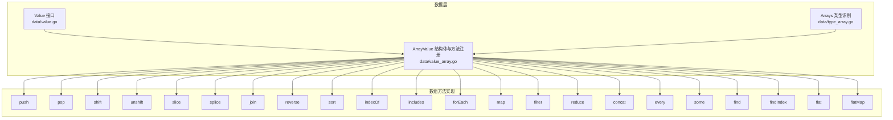
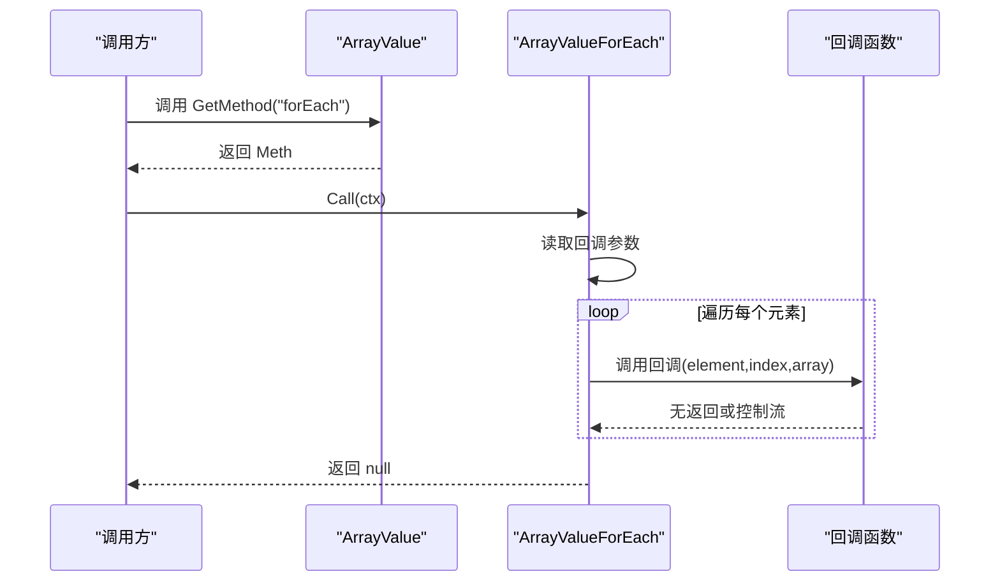
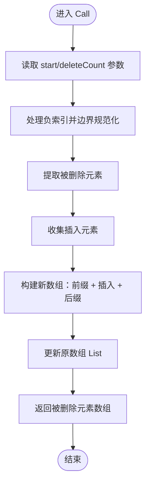
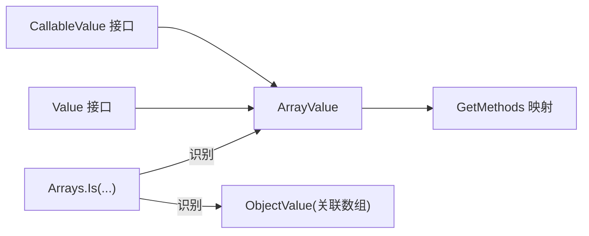

# 数组值类型

<cite>
**本文引用的文件**
- [data/value_array.go](file://data/value_array.go)
- [data/type_array.go](file://data/type_array.go)
- [data/value.go](file://data/value.go)
- [data/value_array_push.go](file://data/value_array_push.go)
- [data/value_array_pop.go](file://data/value_array_pop.go)
- [data/value_array_shift.go](file://data/value_array_shift.go)
- [data/value_array_unshift.go](file://data/value_array_unshift.go)
- [data/value_array_slice.go](file://data/value_array_slice.go)
- [data/value_array_splice.go](file://data/value_array_splice.go)
- [data/value_array_join.go](file://data/value_array_join.go)
- [data/value_array_reverse.go](file://data/value_array_reverse.go)
- [data/value_array_sort.go](file://data/value_array_sort.go)
- [data/value_array_index_of.go](file://data/value_array_index_of.go)
- [data/value_array_includes.go](file://data/value_array_includes.go)
- [data/value_array_for_each.go](file://data/value_array_for_each.go)
- [data/value_array_map.go](file://data/value_array_map.go)
- [data/value_array_filter.go](file://data/value_array_filter.go)
- [data/value_array_reduce.go](file://data/value_array_reduce.go)
- [data/value_array_concat.go](file://data/value_array_concat.go)
- [data/value_array_every.go](file://data/value_array_every.go)
- [data/value_array_some.go](file://data/value_array_some.go)
- [data/value_array_find.go](file://data/value_array_find.go)
- [data/value_array_find_index.go](file://data/value_array_find_index.go)
- [data/value_array_flat.go](file://data/value_array_flat.go)
- [data/value_array_flat_map.go](file://data/value_array_flat_map.go)
</cite>

## 目录
1. [简介](#简介)
2. [项目结构](#项目结构)
3. [核心组件](#核心组件)
4. [架构总览](#架构总览)
5. [详细组件分析](#详细组件分析)
6. [依赖分析](#依赖分析)
7. [性能考虑](#性能考虑)
8. [故障排查指南](#故障排查指南)
9. [结论](#结论)
10. [附录](#附录)

## 简介
本文件系统性梳理数组值类型 ArrayValue 的实现与 API，覆盖内部结构、迭代器机制、元素访问、创建与克隆、内存管理策略，以及全部数组方法的行为与返回类型。同时给出 length 属性与序列化能力的使用说明，并总结浅拷贝机制与性能优化策略。

## 项目结构
围绕数组值类型的关键文件组织如下：
- 值接口与数组类型识别：data/value.go、data/type_array.go
- 数组值主体与方法注册：data/value_array.go
- 数组方法实现：data/value_array_*.go（push、pop、shift、unshift、slice、splice、join、reverse、sort、indexOf、includes、forEach、map、filter、reduce、concat、every、some、find、findIndex、flat、flatMap）

图表来源
- [data/value.go:1-39](file://data/value.go#L1-L39)
- [data/type_array.go:1-20](file://data/type_array.go#L1-L20)
- [data/value_array.go:32-162](file://data/value_array.go#L32-L162)

章节来源
- [data/value.go:1-39](file://data/value.go#L1-L39)
- [data/type_array.go:1-20](file://data/type_array.go#L1-L20)
- [data/value_array.go:32-162](file://data/value_array.go#L32-L162)

## 核心组件
- ArrayValue：数组值的核心结构，持有 []*ZVal 列表与迭代器游标；提供方法注册、属性访问、序列化与迭代器接口。
- Methods：通过 GetMethod 注册 push、pop、shift、unshift、slice、splice、join、reverse、sort、indexOf、includes、forEach、map、filter、reduce、concat、every、some、find、findIndex、flat、flatMap 等方法。
- 属性与序列化：length 属性返回数组长度；Marshal/Unmarshal/ToGoValue 支持序列化。
- 迭代器：Current/Key/Next/Rewind/Valid 提供 foreach 遍历支持。

章节来源
- [data/value_array.go:32-162](file://data/value_array.go#L32-L162)

## 架构总览
下图展示 ArrayValue 与各方法实现之间的关系，以及方法如何通过 GetMethod 注册到数组实例上：

```mermaid
classDiagram
class ArrayValue {
+List []*ZVal
+iterator int
+GetMethod(name) (Method,bool)
+GetProperty(name) (Value,Control)
+Marshal(serializer) ([]byte,error)
+Unmarshal(data,serializer) error
+ToGoValue(serializer) (any,error)
+ToValueList() []Value
}
class ArrayValuePush {
+Call(ctx) (GetValue,Control)
+GetName() string
}
class ArrayValuePop {
+Call(ctx) (GetValue,Control)
}
class ArrayValueShift {
+Call(ctx) (GetValue,Control)
}
class ArrayValueUnshift {
+Call(ctx) (GetValue,Control)
}
class ArrayValueSlice {
+Call(ctx) (GetValue,Control)
}
class ArrayValueSplice {
+Call(ctx) (GetValue,Control)
}
class ArrayValueJoin {
+Call(ctx) (GetValue,Control)
}
class ArrayValueReverse {
+Call(ctx) (GetValue,Control)
}
class ArrayValueSort {
+Call(ctx) (GetValue,Control)
}
class ArrayValueIndexOf {
+Call(ctx) (GetValue,Control)
}
class ArrayValueIncludes {
+Call(ctx) (GetValue,Control)
}
class ArrayValueForEach {
+Call(ctx) (GetValue,Control)
}
class ArrayValueMap {
+Call(ctx) (GetValue,Control)
}
class ArrayValueFilter {
+Call(ctx) (GetValue,Control)
}
class ArrayValueReduce {
+Call(ctx) (GetValue,Control)
}
class ArrayValueConcat {
+Call(ctx) (GetValue,Control)
}
class ArrayValueEvery {
+Call(ctx) (GetValue,Control)
}
class ArrayValueSome {
+Call(ctx) (GetValue,Control)
}
class ArrayValueFind {
+Call(ctx) (GetValue,Control)
}
class ArrayValueFindIndex {
+Call(ctx) (GetValue,Control)
}
class ArrayValueFlat {
+Call(ctx) (GetValue,Control)
}
class ArrayValueFlatMap {
+Call(ctx) (GetValue,Control)
}
ArrayValue --> ArrayValuePush : "注册方法"
ArrayValue --> ArrayValuePop : "注册方法"
ArrayValue --> ArrayValueShift : "注册方法"
ArrayValue --> ArrayValueUnshift : "注册方法"
ArrayValue --> ArrayValueSlice : "注册方法"
ArrayValue --> ArrayValueSplice : "注册方法"
ArrayValue --> ArrayValueJoin : "注册方法"
ArrayValue --> ArrayValueReverse : "注册方法"
ArrayValue --> ArrayValueSort : "注册方法"
ArrayValue --> ArrayValueIndexOf : "注册方法"
ArrayValue --> ArrayValueIncludes : "注册方法"
ArrayValue --> ArrayValueForEach : "注册方法"
ArrayValue --> ArrayValueMap : "注册方法"
ArrayValue --> ArrayValueFilter : "注册方法"
ArrayValue --> ArrayValueReduce : "注册方法"
ArrayValue --> ArrayValueConcat : "注册方法"
ArrayValue --> ArrayValueEvery : "注册方法"
ArrayValue --> ArrayValueSome : "注册方法"
ArrayValue --> ArrayValueFind : "注册方法"
ArrayValue --> ArrayValueFindIndex : "注册方法"
ArrayValue --> ArrayValueFlat : "注册方法"
ArrayValue --> ArrayValueFlatMap : "注册方法"
```

图表来源
- [data/value_array.go:84-133](file://data/value_array.go#L84-L133)
- [data/value_array_push.go:1-55](file://data/value_array_push.go#L1-L55)
- [data/value_array_pop.go:1-44](file://data/value_array_pop.go#L1-L44)
- [data/value_array_shift.go:1-44](file://data/value_array_shift.go#L1-L44)
- [data/value_array_unshift.go:1-56](file://data/value_array_unshift.go#L1-L56)
- [data/value_array_slice.go:1-88](file://data/value_array_slice.go#L1-L88)
- [data/value_array_splice.go:1-111](file://data/value_array_splice.go#L1-L111)
- [data/value_array_join.go:1-57](file://data/value_array_join.go#L1-L57)
- [data/value_array_reverse.go:1-46](file://data/value_array_reverse.go#L1-L46)
- [data/value_array_sort.go:1-55](file://data/value_array_sort.go#L1-L55)
- [data/value_array_index_of.go:1-78](file://data/value_array_index_of.go#L1-L78)
- [data/value_array_includes.go:1-78](file://data/value_array_includes.go#L1-L78)
- [data/value_array_for_each.go:1-80](file://data/value_array_for_each.go#L1-L80)
- [data/value_array_map.go:1-90](file://data/value_array_map.go#L1-L90)
- [data/value_array_filter.go:1-95](file://data/value_array_filter.go#L1-L95)
- [data/value_array_reduce.go:1-133](file://data/value_array_reduce.go#L1-L133)
- [data/value_array_concat.go:1-59](file://data/value_array_concat.go#L1-L59)
- [data/value_array_every.go](file://data/value_array_every.go)
- [data/value_array_some.go](file://data/value_array_some.go)
- [data/value_array_find.go](file://data/value_array_find.go)
- [data/value_array_find_index.go](file://data/value_array_find_index.go)
- [data/value_array_flat.go](file://data/value_array_flat.go)
- [data/value_array_flat_map.go](file://data/value_array_flat_map.go)

## 详细组件分析

### 内部结构与迭代器机制
- 内部结构：ArrayValue.List 为 []*ZVal，每个元素封装任意 Value；iterator 字段用于 foreach 遍历。
- 迭代器接口：Current/Key/Next/Rewind/Valid 提供标准遍历行为；Valid 返回布尔值指示当前位置有效性。
- 属性访问：GetProperty 支持 "length" 返回数组长度；其他属性名将抛出错误。
- 序列化：Marshal/Unmarshal/ToGoValue 委托给 Serializer，实现数组的序列化与反序列化。

章节来源
- [data/value_array.go:32-162](file://data/value_array.go#L32-L162)

### 创建、克隆与内存管理
- 创建：NewArrayValue 接受 []Value，内部包装为 []*ZVal 并构造 ArrayValue。
- 克隆：CloneArrayValue 对 []*ZVal 进行浅拷贝（复制切片头指针与容量，但不递归克隆每个 ZVal），保证结构独立性，避免结构性修改互相影响。
- 写入语义：对单个元素赋值会替换对应 ZVal，不影响其他数组实例。

章节来源
- [data/value_array.go:7-30](file://data/value_array.go#L7-L30)

### 方法族概览与行为要点
以下方法均通过 GetMethod 注册到 ArrayValue 上，调用时由对应 Method.Call 执行逻辑。返回类型由各方法的 GetReturnType 指定。

- push
  - 功能：向数组末尾追加一个或多个元素，返回新长度。
  - 参数：可变参数 items。
  - 返回：整数（新长度）。
  - 复杂度：O(k)，k 为追加元素数量。
  
  章节来源
  - [data/value_array.go:84-97](file://data/value_array.go#L84-L97)
  - [data/value_array_push.go:1-55](file://data/value_array_push.go#L1-L55)

- pop
  - 功能：移除并返回最后一个元素；空数组返回 null。
  - 返回：任意值（最后一个元素或 null）。
  - 复杂度：O(1)。
  
  章节来源
  - [data/value_array.go:88-89](file://data/value_array.go#L88-L89)
  - [data/value_array_pop.go:1-44](file://data/value_array_pop.go#L1-L44)

- shift
  - 功能：移除并返回第一个元素；空数组返回 null。
  - 返回：任意值（第一个元素或 null）。
  - 复杂度：O(n)（需要移动后续元素）。
  
  章节来源
  - [data/value_array.go:90-91](file://data/value_array.go#L90-L91)
  - [data/value_array_shift.go:1-44](file://data/value_array_shift.go#L1-L44)

- unshift
  - 功能：向数组开头插入一个或多个元素，返回新长度。
  - 参数：可变参数 items。
  - 返回：整数（新长度）。
  - 复杂度：O(n+k)，n 为原长度，k 为插入元素数量。
  
  章节来源
  - [data/value_array.go:92-93](file://data/value_array.go#L92-L93)
  - [data/value_array_unshift.go:1-56](file://data/value_array_unshift.go#L1-L56)

- slice
  - 功能：返回从 start 到 end（不含）的浅拷贝。
  - 参数：start（可选）、end（可选）。
  - 返回：数组。
  - 负索引：自动转换为正索引。
  - 边界：规范化到 [0, len]。
  
  章节来源
  - [data/value_array.go:94-95](file://data/value_array.go#L94-L95)
  - [data/value_array_slice.go:1-88](file://data/value_array_slice.go#L1-L88)

- splice
  - 功能：删除指定数量元素并可选插入新元素，返回被删除元素组成的数组。
  - 参数：start、deleteCount（可选）、...items（可选）。
  - 返回：数组。
  - 负索引与边界：规范化处理。
  - 复杂度：O(n+m)，n 为删除/移动成本，m 为插入元素数量。
  
  章节来源
  - [data/value_array.go:96-97](file://data/value_array.go#L96-L97)
  - [data/value_array_splice.go:1-111](file://data/value_array_splice.go#L1-L111)

- join
  - 功能：用分隔符连接所有元素为字符串。
  - 参数：separator（可选，默认逗号）。
  - 返回：字符串。
  
  章节来源
  - [data/value_array.go:98-99](file://data/value_array.go#L98-L99)
  - [data/value_array_join.go:1-57](file://data/value_array_join.go#L1-L57)

- reverse
  - 功能：原地反转数组元素顺序，返回反转后的数组。
  - 返回：数组。
  - 复杂度：O(n)。
  
  章节来源
  - [data/value_array.go:100-101](file://data/value_array.go#L100-L101)
  - [data/value_array_reverse.go:1-46](file://data/value_array_reverse.go#L1-L46)

- sort
  - 功能：默认按字符串比较对数组进行排序，返回排序后数组。
  - 返回：数组。
  - 复杂度：O(n log n)。
  
  章节来源
  - [data/value_array.go:102-103](file://data/value_array.go#L102-L103)
  - [data/value_array_sort.go:1-55](file://data/value_array_sort.go#L1-L55)

- indexOf
  - 功能：从 fromIndex 开始查找第一个匹配元素的索引，未找到返回 -1。
  - 参数：searchElement、fromIndex（可选）。
  - 返回：整数。
  - 比较：基于元素字符串表示比较。
  
  章节来源
  - [data/value_array.go:104-105](file://data/value_array.go#L104-L105)
  - [data/value_array_index_of.go:1-78](file://data/value_array_index_of.go#L1-L78)

- includes
  - 功能：判断数组是否包含指定元素。
  - 参数：searchElement、fromIndex（可选）。
  - 返回：布尔值。
  - 比较：基于元素字符串表示比较。
  
  章节来源
  - [data/value_array.go:106-107](file://data/value_array.go#L106-L107)
  - [data/value_array_includes.go:1-78](file://data/value_array_includes.go#L1-L78)

- forEach
  - 功能：对每个元素调用回调函数，无返回值（返回 null）。
  - 参数：callback（必需）。
  - 回调签名：element, index, array。
  - 支持：*FuncValue 与 CallableValue。
  
  章节来源
  - [data/value_array.go:108-109](file://data/value_array.go#L108-L109)
  - [data/value_array_for_each.go:1-80](file://data/value_array_for_each.go#L1-L80)

- map
  - 功能：创建新数组，由回调函数对每个元素返回值组成。
  - 参数：callback（可选）。
  - 返回：数组。
  - 回调签名：element, index, array。
  
  章节来源
  - [data/value_array.go:110-111](file://data/value_array.go#L110-L111)
  - [data/value_array_map.go:1-90](file://data/value_array_map.go#L1-L90)

- filter
  - 功能：返回使回调函数返回“真值”的元素组成的新数组。
  - 参数：callback（可选）。
  - 返回：数组。
  - 回调签名：element, index, array。
  
  章节来源
  - [data/value_array.go:112-113](file://data/value_array.go#L112-L113)
  - [data/value_array_filter.go:1-95](file://data/value_array_filter.go#L1-L95)

- reduce
  - 功能：将数组累积为单个值；可选 initialValue。
  - 参数：callback（必需）、initialValue（可选）。
  - 返回：任意值（与回调返回一致）。
  - 回调签名：acc, element, index, array。
  
  章节来源
  - [data/value_array.go:114-115](file://data/value_array.go#L114-L115)
  - [data/value_array_reduce.go:1-133](file://data/value_array_reduce.go#L1-L133)

- concat
  - 功能：合并当前数组与若干数组/值，返回新数组。
  - 参数：可变参数 items（数组或任意值）。
  - 返回：数组。
  
  章节来源
  - [data/value_array.go:116-117](file://data/value_array.go#L116-L117)
  - [data/value_array_concat.go:1-59](file://data/value_array_concat.go#L1-L59)

- every
  - 功能：判断回调对每个元素均返回“真值”。
  - 返回：布尔值。
  
  章节来源
  - [data/value_array.go:118-119](file://data/value_array.go#L118-L119)
  - [data/value_array_every.go](file://data/value_array_every.go)

- some
  - 功能：判断回调对至少一个元素返回“真值”。
  - 返回：布尔值。
  
  章节来源
  - [data/value_array.go:120-121](file://data/value_array.go#L120-L121)
  - [data/value_array_some.go](file://data/value_array_some.go)

- find
  - 功能：返回第一个使回调返回“真值”的元素；否则返回 null。
  - 返回：任意值。
  
  章节来源
  - [data/value_array.go:122-123](file://data/value_array.go#L122-L123)
  - [data/value_array_find.go](file://data/value_array_find.go)

- findIndex
  - 功能：返回第一个使回调返回“真值”的元素索引；否则返回 -1。
  - 返回：整数。
  
  章节来源
  - [data/value_array.go:124-125](file://data/value_array.go#L124-L125)
  - [data/value_array_find_index.go](file://data/value_array_find_index.go)

- flat
  - 功能：扁平化数组（深度默认 1）。
  - 返回：数组。
  
  章节来源
  - [data/value_array.go:126-127](file://data/value_array.go#L126-L127)
  - [data/value_array_flat.go](file://data/value_array_flat.go)

- flatMap
  - 功能：先对每个元素执行回调，再将结果扁平化。
  - 返回：数组。
  
  章节来源
  - [data/value_array.go:128-129](file://data/value_array.go#L128-L129)
  - [data/value_array_flat_map.go](file://data/value_array_flat_map.go)

### API 调用序列（以 forEach 为例）

图表来源
- [data/value_array.go:84-133](file://data/value_array.go#L84-L133)
- [data/value_array_for_each.go:1-80](file://data/value_array_for_each.go#L1-L80)

### 算法流程（以 splice 为例）

图表来源
- [data/value_array_splice.go:1-111](file://data/value_array_splice.go#L1-L111)

## 依赖分析
- 类型识别：Arrays.Is 将 ArrayValue 与 ObjectValue 均视为 array 类型，便于统一处理关联数组。
- 值接口：Value/CallableValue 定义了值与可调用值的通用契约，数组方法实现遵循这些接口以支持回调与上下文传递。
- 方法注册：ArrayValue.GetMethod 将字符串方法名映射到具体 Method 实现，形成统一的动态方法调用入口。

图表来源
- [data/type_array.go:6-15](file://data/type_array.go#L6-L15)
- [data/value.go:4-38](file://data/value.go#L4-L38)
- [data/value_array.go:84-133](file://data/value_array.go#L84-L133)

章节来源
- [data/type_array.go:1-20](file://data/type_array.go#L1-L20)
- [data/value.go:1-39](file://data/value.go#L1-L39)
- [data/value_array.go:84-133](file://data/value_array.go#L84-L133)

## 性能考虑
- 浅拷贝策略：CloneArrayValue 仅复制 []*ZVal 切片头，不递归克隆 ZVal，降低克隆成本；结构修改（如 shift/push）互不影响。
- 访问与比较：indexOf/includes 使用元素字符串表示进行比较，避免深层比较开销，但需注意类型转换带来的额外成本。
- splice/map/filter/reduce：根据操作规模选择合适的数据结构；对大数组优先考虑就地算法（如 reverse）或减少中间对象创建。
- 迭代器：forEach/map/filter/reduce 在回调中尽量避免频繁分配临时对象，复用上下文与参数列表可降低 GC 压力。

## 故障排查指南
- 属性访问错误：当访问非 "length" 属性时，GetProperty 抛出错误；请确认属性名正确。
- 空数组异常：pop/shift 访问空数组时返回 null，确保在业务侧处理 null 场景。
- 参数缺失：forEach/map/filter/reduce 等方法若缺少回调参数，通常会回退到“无回调”行为（例如 map 返回原数组副本），请检查调用参数。
- 索引越界：slice/splice 的负索引与边界已做规范化处理，但仍建议在上层调用前校验输入范围。

章节来源
- [data/value_array.go:135-141](file://data/value_array.go#L135-L141)
- [data/value_array_pop.go:10-12](file://data/value_array_pop.go#L10-L12)
- [data/value_array_shift.go:10-12](file://data/value_array_shift.go#L10-L12)
- [data/value_array_for_each.go:11-14](file://data/value_array_for_each.go#L11-L14)
- [data/value_array_map.go:17-20](file://data/value_array_map.go#L17-L20)
- [data/value_array_filter.go:14-18](file://data/value_array_filter.go#L14-L18)
- [data/value_array_reduce.go:11-14](file://data/value_array_reduce.go#L11-L14)

## 结论
ArrayValue 提供了完整的 PHP 风格数组能力，结合浅拷贝与 ZVal 包装，在保证性能的同时保持了灵活性。通过统一的方法注册与回调机制，开发者可以便捷地扩展与组合数组操作。建议在大规模数据处理场景中关注拷贝与比较策略，并充分利用内置方法的返回类型与边界处理特性。

## 附录
- 使用示例（路径参考）
  - 创建数组：[data/value_array.go:7-15](file://data/value_array.go#L7-L15)
  - 克隆数组：[data/value_array.go:21-30](file://data/value_array.go#L21-L30)
  - 访问 length：[data/value_array.go:135-141](file://data/value_array.go#L135-L141)
  - 序列化数组：[data/value_array.go:143-153](file://data/value_array.go#L143-L153)
  - push 示例：[data/value_array_push.go:9-26](file://data/value_array_push.go#L9-L26)
  - pop 示例：[data/value_array_pop.go:9-19](file://data/value_array_pop.go#L9-L19)
  - shift 示例：[data/value_array_shift.go:9-19](file://data/value_array_shift.go#L9-L19)
  - unshift 示例：[data/value_array_unshift.go:9-27](file://data/value_array_unshift.go#L9-L27)
  - slice 示例：[data/value_array_slice.go:9-57](file://data/value_array_slice.go#L9-L57)
  - splice 示例：[data/value_array_splice.go:9-78](file://data/value_array_splice.go#L9-L78)
  - join 示例：[data/value_array_join.go:9-28](file://data/value_array_join.go#L9-L28)
  - reverse 示例：[data/value_array_reverse.go:9-21](file://data/value_array_reverse.go#L9-L21)
  - sort 示例：[data/value_array_sort.go:11-30](file://data/value_array_sort.go#L11-L30)
  - indexOf 示例：[data/value_array_index_of.go:9-47](file://data/value_array_index_of.go#L9-L47)
  - includes 示例：[data/value_array_includes.go:9-47](file://data/value_array_includes.go#L9-L47)
  - forEach 示例：[data/value_array_for_each.go:9-51](file://data/value_array_for_each.go#L9-L51)
  - map 示例：[data/value_array_map.go:11-61](file://data/value_array_map.go#L11-L61)
  - filter 示例：[data/value_array_filter.go:9-66](file://data/value_array_filter.go#L9-L66)
  - reduce 示例：[data/value_array_reduce.go:9-102](file://data/value_array_reduce.go#L9-L102)
  - concat 示例：[data/value_array_concat.go:9-30](file://data/value_array_concat.go#L9-L30)
  - every 示例：[data/value_array_every.go](file://data/value_array_every.go)
  - some 示例：[data/value_array_some.go](file://data/value_array_some.go)
  - find 示例：[data/value_array_find.go](file://data/value_array_find.go)
  - findIndex 示例：[data/value_array_find_index.go](file://data/value_array_find_index.go)
  - flat 示例：[data/value_array_flat.go](file://data/value_array_flat.go)
  - flatMap 示例：[data/value_array_flat_map.go](file://data/value_array_flat_map.go)