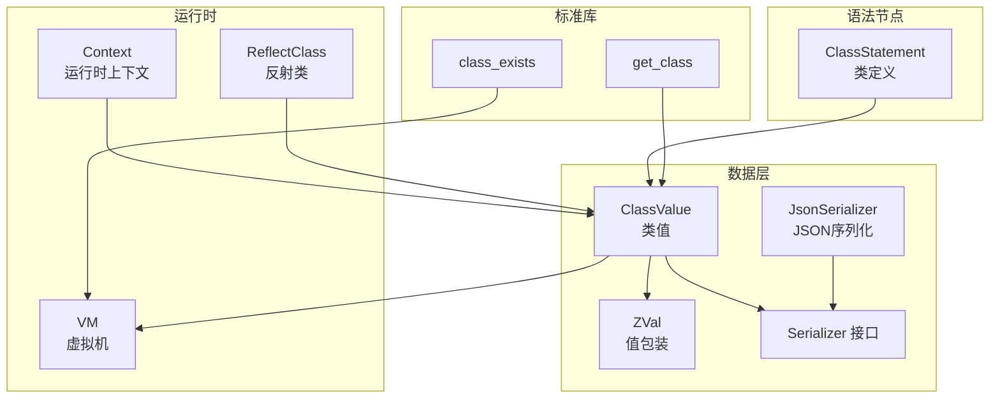
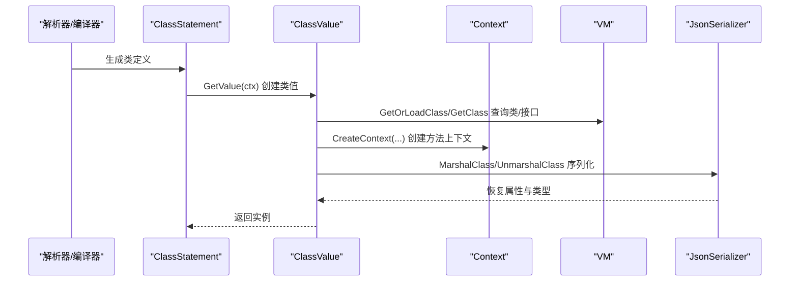
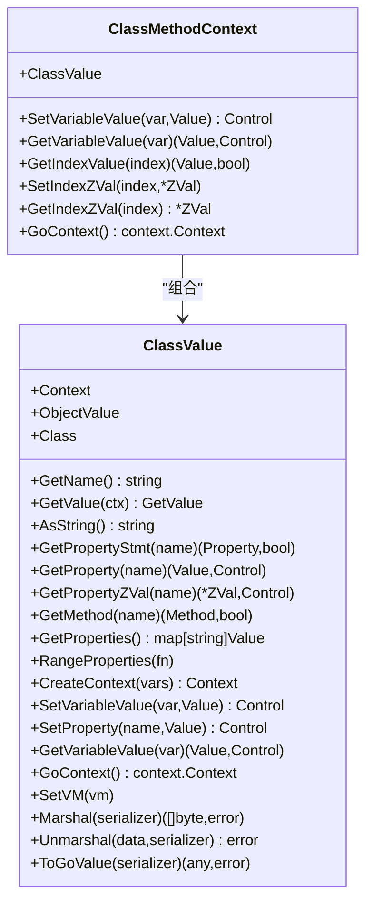
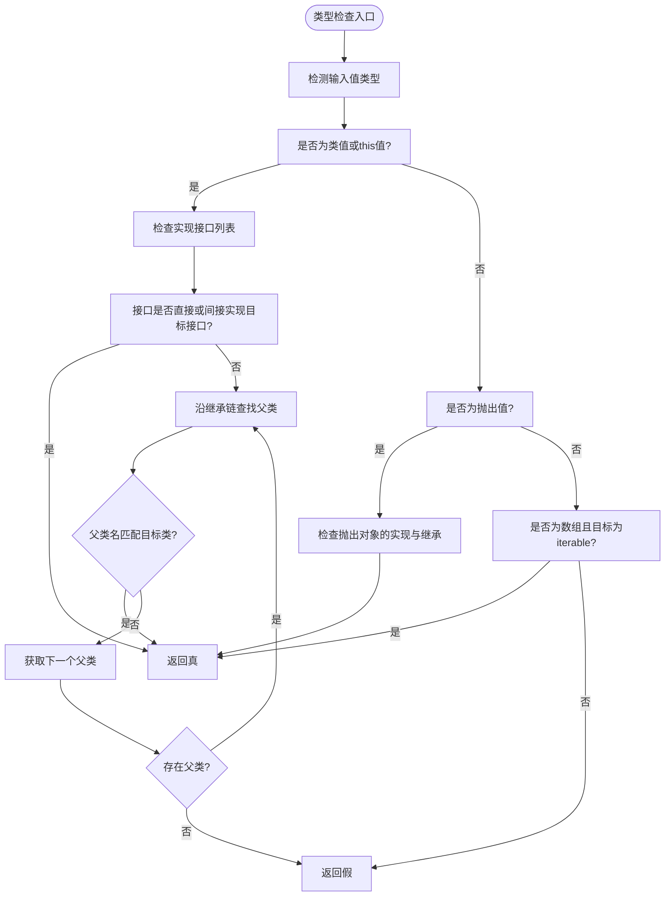
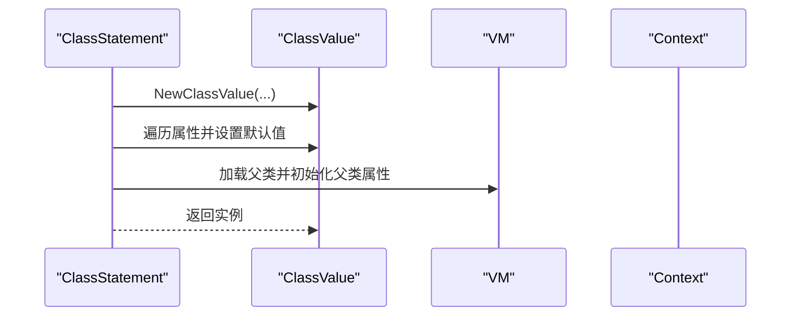
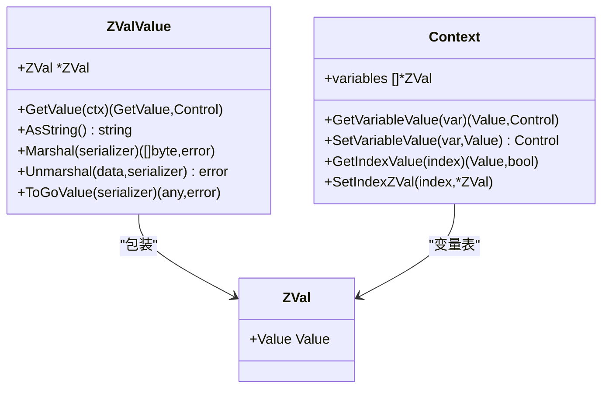
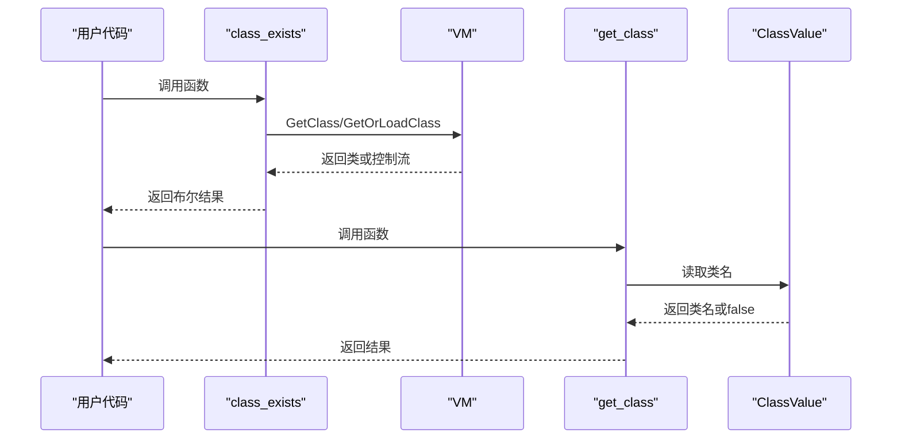
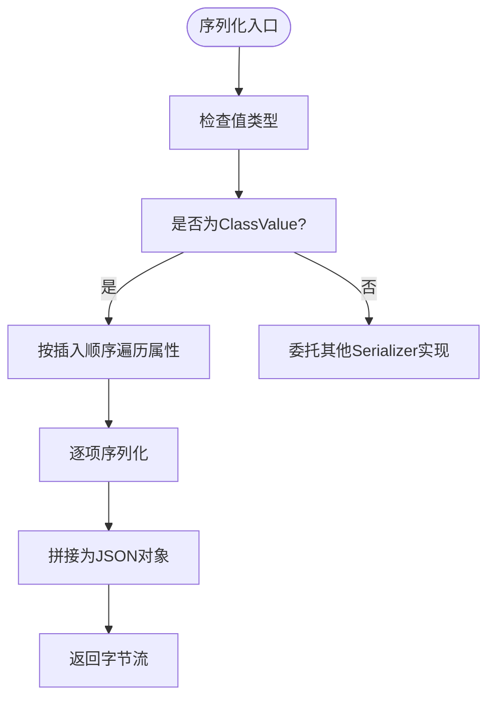
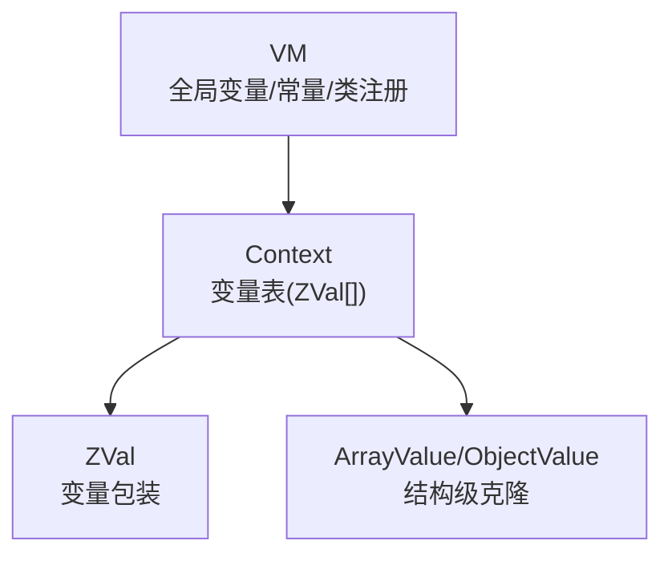
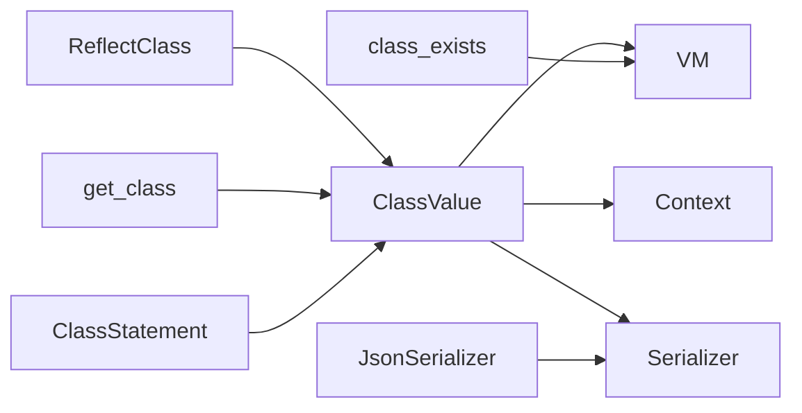

# 类值类型

<cite>
**本文档引用的文件**
- [data/value_class.go](file://data/value_class.go)
- [data/type_class.go](file://data/type_class.go)
- [runtime/reflect_class.go](file://runtime/reflect_class.go)
- [std/php/class_exists.go](file://std/php/class_exists.go)
- [std/php/get_class.go](file://std/php/get_class.go)
- [data/zval.go](file://data/zval.go)
- [data/value_zval.go](file://data/value_zval.go)
- [node/class.go](file://node/class.go)
- [data/serializer.go](file://data/serializer.go)
- [std/serializer/json/json_serializer.go](file://std/serializer/json/json_serializer.go)
- [runtime/context.go](file://runtime/context.go)
- [runtime/vm.go](file://runtime/vm.go)
- [data/context.go](file://data/context.go)
</cite>

## 目录
1. [简介](#简介)
2. [项目结构](#项目结构)
3. [核心组件](#核心组件)
4. [架构总览](#架构总览)
5. [详细组件分析](#详细组件分析)
6. [依赖关系分析](#依赖关系分析)
7. [性能考量](#性能考量)
8. [故障排查指南](#故障排查指南)
9. [结论](#结论)
10. [附录](#附录)

## 简介
本文件聚焦于“类值类型”的完整API文档，涵盖类值的元数据、构造与实例化流程、类型检查、属性与方法访问、继承关系处理、与ZVal包装器的交互、类型转换与序列化，以及运行时内存管理与垃圾回收策略。目标是帮助开发者在不深入源码的前提下，理解并正确使用类值类型。

## 项目结构
围绕类值类型的关键模块分布如下：
- 数据层：类值、ZVal、序列化接口与实现
- 运行时：VM、上下文、反射类
- 语言标准库：class_exists、get_class等内置函数
- 语法节点：类定义、属性、方法声明



**图表来源**
- [data/value_class.go:1-295](file://data/value_class.go#L1-L295)
- [data/zval.go:1-18](file://data/zval.go#L1-L18)
- [data/serializer.go:1-31](file://data/serializer.go#L1-L31)
- [std/serializer/json/json_serializer.go:1-425](file://std/serializer/json/json_serializer.go#L1-L425)
- [runtime/vm.go:1-391](file://runtime/vm.go#L1-L391)
- [runtime/context.go:1-139](file://runtime/context.go#L1-L139)
- [runtime/reflect_class.go:1-524](file://runtime/reflect_class.go#L1-L524)
- [std/php/class_exists.go:1-66](file://std/php/class_exists.go#L1-L66)
- [std/php/get_class.go:1-77](file://std/php/get_class.go#L1-L77)
- [node/class.go:1-528](file://node/class.go#L1-L528)

**章节来源**
- [data/value_class.go:1-295](file://data/value_class.go#L1-L295)
- [runtime/reflect_class.go:1-524](file://runtime/reflect_class.go#L1-L524)
- [std/php/class_exists.go:1-66](file://std/php/class_exists.go#L1-L66)
- [std/php/get_class.go:1-77](file://std/php/get_class.go#L1-L77)
- [node/class.go:1-528](file://node/class.go#L1-L528)

## 核心组件
- 类值 ClassValue：封装类的元数据与实例属性，提供属性/方法访问、继承链查询、序列化与上下文创建能力。
- ZVal：轻量的值包装器，承载任意 Value，并参与运行时变量表与参数传递。
- Serializer 接口与 JsonSerializer：统一的序列化协议，支持类值的结构化持久化与反序列化。
- VM 与 Context：运行时环境，负责类/接口注册、加载、异常处理、全局变量与参数表管理。
- 反射类 ReflectClass：将Go结构体映射为脚本类，支持构造函数与方法的反射调用。
- 标准库函数：class_exists、get_class 提供类存在性与类名查询的运行时语义。

**章节来源**
- [data/value_class.go:1-295](file://data/value_class.go#L1-L295)
- [data/zval.go:1-18](file://data/zval.go#L1-L18)
- [data/serializer.go:1-31](file://data/serializer.go#L1-L31)
- [std/serializer/json/json_serializer.go:1-425](file://std/serializer/json/json_serializer.go#L1-L425)
- [runtime/vm.go:1-391](file://runtime/vm.go#L1-L391)
- [runtime/context.go:1-139](file://runtime/context.go#L1-L139)
- [runtime/reflect_class.go:1-524](file://runtime/reflect_class.go#L1-L524)
- [std/php/class_exists.go:1-66](file://std/php/class_exists.go#L1-L66)
- [std/php/get_class.go:1-77](file://std/php/get_class.go#L1-L77)

## 架构总览
类值类型贯穿“语法节点 -> 类值 -> 运行时 -> 序列化/反射”的全链路：



**图表来源**
- [node/class.go:28-84](file://node/class.go#L28-L84)
- [data/value_class.go:8-15](file://data/value_class.go#L8-L15)
- [runtime/vm.go:162-181](file://runtime/vm.go#L162-L181)
- [std/serializer/json/json_serializer.go:228-326](file://std/serializer/json/json_serializer.go#L228-L326)

## 详细组件分析

### 类值 ClassValue
- 元数据与构造
  - 通过 NewClassValue 以 ClassStatement 与 Context 初始化，持有 Class 与 Context。
  - GetName 返回类名；AsString 输出类名与属性列表。
- 属性访问
  - GetPropertyStmt 沿继承链查找属性定义；GetProperty 获取属性值（含动态属性与默认值）。
  - GetPropertyZVal 提供 ZVal 形式的属性访问与惰性初始化。
  - GetProperties 合并实例属性与类定义属性，处理继承链非私有属性。
  - RangeProperties 保持插入顺序遍历，避免随机性。
- 方法访问
  - GetMethod 沿继承链查找方法（忽略私有方法）。
- 上下文与变量
  - CreateContext 为方法调用创建 ClassMethodContext，支持属性与变量的隔离访问。
  - SetProperty/SetVariableValue 支持数组/对象深拷贝，避免共享状态引发副作用。
- 序列化
  - Marshal/Unmarshal/ToGoValue 委托 Serializer，JSON 实现按属性顺序序列化对象。



**图表来源**
- [data/value_class.go:21-295](file://data/value_class.go#L21-L295)

**章节来源**
- [data/value_class.go:8-295](file://data/value_class.go#L8-L295)

### 类型 Class 与类型检查
- Is(value) 支持 ClassValue、ThisValue、ThrowValue 与数组（iterable）的类型判断。
- extendISClass 与 interfaceExtends 递归检查继承链与接口继承，支持 VM 中已注册接口的跨文件继承。



**图表来源**
- [data/type_class.go:7-84](file://data/type_class.go#L7-L84)

**章节来源**
- [data/type_class.go:1-146](file://data/type_class.go#L1-L146)

### 反射类 ReflectClass 与反射方法/构造
- ReflectClass 将任意 Go 实例映射为脚本类，支持：
  - GetValue 每次创建新实例并返回对应的 ClassValue。
  - 分析公开方法与属性，构建方法/属性映射。
  - GetConstruct 返回 ReflectConstructor。
- ReflectMethod
  - 从上下文参数列表获取值，按参数类型转换为 Go 值，调用反射方法，再将返回值转换为脚本值。
- ReflectConstructor
  - 通过公开字段名作为参数名，将上下文变量值设置到被代理实例对应字段。

```mermaid
classDiagram
class ReflectClass {
-string name
-reflect.Type instanceType
-map~string,Method~ methods
-map~string,Property~ properties
-instance interface{}
+GetName() string
+GetExtend() *string
+GetImplements() []string
+GetProperty(name) (Property,bool)
+GetPropertyList() []Property
+GetMethod(name) (Method,bool)
+GetMethods() []Method
+GetConstruct() Method
+GetValue(ctx) (GetValue,Control)
}
class ReflectMethod {
-string name
-reflect.Method method
-interface{} instance
-reflect.Type instanceType
+GetName() string
+GetModifier() Modifier
+GetIsStatic() bool
+GetParams() []GetValue
+GetVariables() []Variable
+GetReturnType() Types
+Call(ctx) (GetValue,Control)
-convertToGoValue(scriptValue,goType) (reflect.Value,error)
-convertToScriptValue(goValue) (GetValue,error)
}
class ReflectConstructor {
-string className
-reflect.Type instanceType
-interface{} instance
+GetName() string
+GetModifier() Modifier
+GetIsStatic() bool
+GetParams() []GetValue
+GetVariables() []Variable
+GetReturnType() Types
+Call(ctx) (GetValue,Control)
}
ReflectClass --> ReflectMethod : "方法集合"
ReflectClass --> ReflectConstructor : "构造函数"
```

**图表来源**
- [runtime/reflect_class.go:13-524](file://runtime/reflect_class.go#L13-L524)

**章节来源**
- [runtime/reflect_class.go:1-524](file://runtime/reflect_class.go#L1-L524)

### 类定义与实例化（ClassStatement）
- ClassStatement.GetValue(ctx) 创建 ClassValue，并初始化属性默认值与继承链上父类的默认属性。
- GetConstruct 返回构造函数方法；GetMethods/GetProperties 提供有序列表。



**图表来源**
- [node/class.go:28-84](file://node/class.go#L28-L84)

**章节来源**
- [node/class.go:1-528](file://node/class.go#L1-L528)

### ZVal 包装器与交互
- ZVal 作为 Value 的轻量包装，Context 通过变量索引与 ZVal 列表维护变量表。
- ClassValue 与属性访问结合 ZVal：
  - GetPropertyZVal 获取/初始化 ZVal 并返回。
  - Context.SetVariableValue/SetIndexZVal 支持数组/对象的结构级克隆，避免共享状态。
- ZValValue 将 ZVal 作为独立值类型，委托底层 Value 的序列化能力。



**图表来源**
- [data/zval.go:3-18](file://data/zval.go#L3-L18)
- [data/value_zval.go:5-41](file://data/value_zval.go#L5-L41)
- [runtime/context.go:43-87](file://runtime/context.go#L43-L87)

**章节来源**
- [data/zval.go:1-18](file://data/zval.go#L1-L18)
- [data/value_zval.go:1-41](file://data/value_zval.go#L1-L41)
- [runtime/context.go:1-139](file://runtime/context.go#L1-L139)

### 类型检查与序列化流程

#### 类型检查（class_exists / get_class）
- class_exists：在 VM 中查询类是否存在，支持 autoload 控制。
- get_class：返回对象类名或当前类名，否则返回 false。



**图表来源**
- [std/php/class_exists.go:19-47](file://std/php/class_exists.go#L19-L47)
- [std/php/get_class.go:18-60](file://std/php/get_class.go#L18-L60)
- [runtime/vm.go:154-181](file://runtime/vm.go#L154-L181)

**章节来源**
- [std/php/class_exists.go:1-66](file://std/php/class_exists.go#L1-L66)
- [std/php/get_class.go:1-77](file://std/php/get_class.go#L1-L77)

#### 序列化（JSON）
- JsonSerializer.MarshalClass/UnmarshalClass：
  - 按属性插入顺序序列化对象，支持基于属性类型/实例类型/类型猜测的反序列化策略。
  - ClassValue 的 Marshal/Unmarshal 直接委派至 Serializer。



**图表来源**
- [std/serializer/json/json_serializer.go:228-326](file://std/serializer/json/json_serializer.go#L228-L326)
- [data/value_class.go:284-295](file://data/value_class.go#L284-L295)

**章节来源**
- [data/serializer.go:1-31](file://data/serializer.go#L1-L31)
- [std/serializer/json/json_serializer.go:1-425](file://std/serializer/json/json_serializer.go#L1-L425)
- [data/value_class.go:284-295](file://data/value_class.go#L284-L295)

### 运行时上下文与内存管理
- Context 维护变量表（ZVal切片），支持参数表记录与按索引访问。
- Context.SetVariableValue 对数组/对象进行结构级克隆，避免共享状态导致的副作用。
- VM 提供全局变量表、常量表、类/接口注册与加载、异常处理回调等运行时设施。
- 反射类每次 GetValue 创建新实例，避免多处共享同一实例带来的竞态问题。



**图表来源**
- [runtime/context.go:43-87](file://runtime/context.go#L43-L87)
- [runtime/vm.go:36-56](file://runtime/vm.go#L36-L56)
- [runtime/reflect_class.go:114-131](file://runtime/reflect_class.go#L114-L131)

**章节来源**
- [runtime/context.go:1-139](file://runtime/context.go#L1-L139)
- [runtime/vm.go:1-391](file://runtime/vm.go#L1-L391)
- [runtime/reflect_class.go:114-131](file://runtime/reflect_class.go#L114-L131)

## 依赖关系分析
- 类值依赖 VM 进行类/接口查询与加载，依赖 Context 进行变量与方法上下文管理。
- 反射类依赖 Go 反射机制，将公开字段/方法映射为脚本类的属性/方法。
- 序列化器通过 Serializer 接口抽象，JSON 实现与类值强耦合但遵循统一协议。
- 标准库函数通过 VM 与 Context 提供运行时语义。



**图表来源**
- [data/value_class.go:1-295](file://data/value_class.go#L1-L295)
- [runtime/reflect_class.go:1-524](file://runtime/reflect_class.go#L1-L524)
- [std/php/class_exists.go:1-66](file://std/php/class_exists.go#L1-L66)
- [std/php/get_class.go:1-77](file://std/php/get_class.go#L1-L77)
- [node/class.go:1-528](file://node/class.go#L1-L528)
- [data/serializer.go:1-31](file://data/serializer.go#L1-L31)
- [std/serializer/json/json_serializer.go:1-425](file://std/serializer/json/json_serializer.go#L1-L425)

**章节来源**
- [data/context.go:1-349](file://data/context.go#L1-L349)
- [runtime/vm.go:1-391](file://runtime/vm.go#L1-L391)

## 性能考量
- 属性访问与继承链查询：GetProperties/GetPropertyStmt 需沿继承链遍历，建议在高频路径避免重复查询，可缓存中间结果。
- 序列化顺序：JSON 序列化使用 RangeProperties 保证顺序一致性，避免因遍历顺序不确定导致的差异。
- 反射调用：ReflectMethod/ReflectConstructor 每次调用需进行类型转换与反射调用，建议在热路径减少反射开销，或采用预编译/缓存策略。
- 变量克隆：Context.SetVariableValue 对数组/对象进行结构级克隆，避免共享状态，但会带来额外内存与时间成本，应权衡使用。

## 故障排查指南
- 类型检查失败
  - 确认目标类型是否在 VM 中已注册，接口继承链是否正确加载。
  - 使用 class_exists 检查类是否存在，必要时启用 autoload。
- 属性/方法不可见
  - 检查继承链上是否存在私有属性/方法覆盖；GetMethod 会忽略私有方法。
  - 确认属性默认值是否正确初始化，或通过 GetPropertyZVal 惰性初始化。
- 反射调用异常
  - 参数类型转换失败：确认参数类型与 Go 方法签名一致。
  - 返回值转换失败：确认返回值类型是否受支持。
- 序列化/反序列化异常
  - 属性类型不匹配：确保 JSON 字段与类定义属性类型一致，或依赖类型猜测。
  - 顺序问题：确认使用 RangeProperties 的序列化/反序列化路径。

**章节来源**
- [data/type_class.go:86-145](file://data/type_class.go#L86-L145)
- [std/php/class_exists.go:19-47](file://std/php/class_exists.go#L19-L47)
- [runtime/reflect_class.go:276-347](file://runtime/reflect_class.go#L276-L347)
- [std/serializer/json/json_serializer.go:275-326](file://std/serializer/json/json_serializer.go#L275-L326)

## 结论
类值类型在 Origami 中承担连接“语法节点—运行时—序列化—反射”的桥梁角色。通过 ClassValue 的属性/方法访问、继承链处理、ZVal 包装与序列化协议，以及 VM/Context 提供的运行时支撑，实现了与 PHP 语义一致的对象模型与运行时行为。合理利用反射类与序列化器，可在保持类型安全的同时获得良好的扩展性与性能表现。

## 附录
- 相关接口与类型
  - Context/VM：运行时环境与资源管理
  - Serializer/ValueSerializer：统一序列化协议
  - ClassStmt/Property/Method：类定义与成员抽象
  - ZVal/ZValValue：值包装与序列化适配