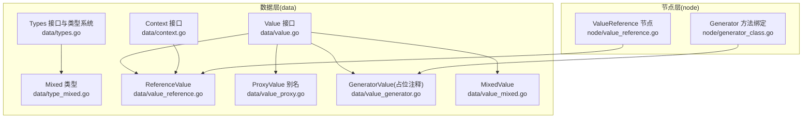
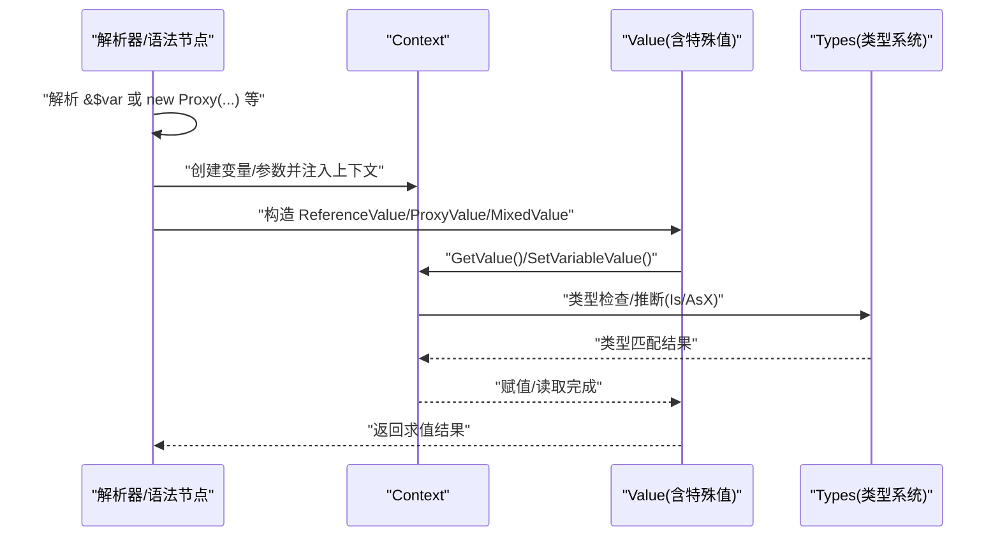
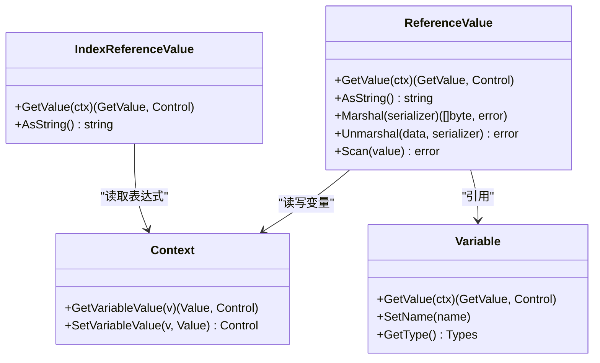
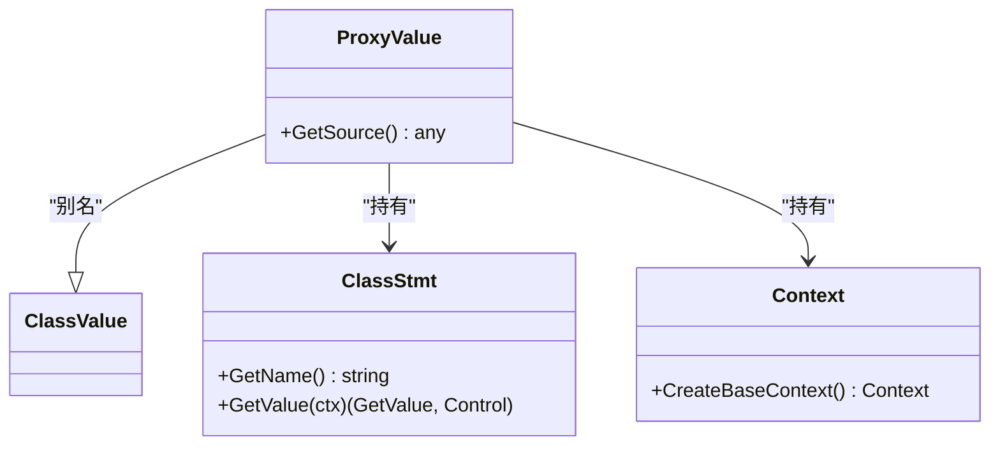
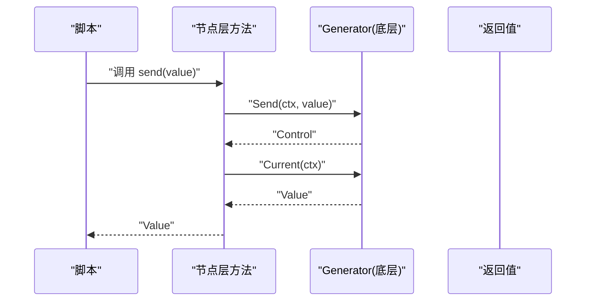
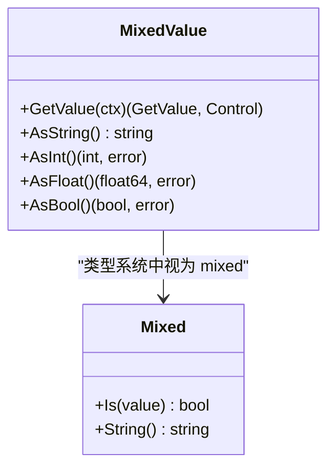
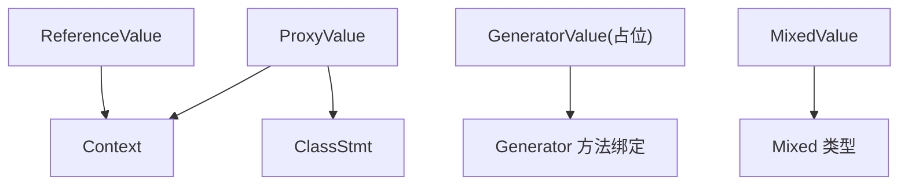

# 特殊值类型

<cite>
**本文档引用的文件**
- [data/value.go](file://data/value.go)
- [data/context.go](file://data/context.go)
- [data/types.go](file://data/types.go)
- [data/type_mixed.go](file://data/type_mixed.go)
- [data/value_reference.go](file://data/value_reference.go)
- [node/value_reference.go](file://node/value_reference.go)
- [data/value_proxy.go](file://data/value_proxy.go)
- [data/value_generator.go](file://data/value_generator.go)
- [data/value_mixed.go](file://data/value_mixed.go)
- [node/generator_class.go](file://node/generator_class.go)
</cite>

## 目录
1. [简介](#简介)
2. [项目结构](#项目结构)
3. [核心组件](#核心组件)
4. [架构总览](#架构总览)
5. [详细组件分析](#详细组件分析)
6. [依赖分析](#依赖分析)
7. [性能考虑](#性能考虑)
8. [故障排查指南](#故障排查指南)
9. [结论](#结论)
10. [附录](#附录)

## 简介
本文件聚焦于“特殊值类型”的设计与实现，涵盖以下四类：
- 引用值：通过“按引用传递”机制实现变量别名与共享状态更新。
- 代理值：包装外部类实例，作为运行时对象值参与求值与方法调用。
- 生成器值：承载生成器对象，支持迭代控制与惰性计算。
- 混合值：承载任意接口值，提供统一的字符串化能力。

文档将系统阐述这些类型的用途、行为特征、使用限制，并解释引用传递、延迟计算与类型推断的工作机制，同时给出典型使用场景与最佳实践。

## 项目结构
围绕“特殊值类型”，相关代码主要分布在 data 层（值与类型定义）、node 层（语法节点与求值入口）以及 std 层（标准库对代理值的使用示例）。下图展示关键模块之间的关系：

图表来源
- [data/value.go:4-38](file://data/value.go#L4-L38)
- [data/context.go:8-31](file://data/context.go#L8-L31)
- [data/types.go:5-262](file://data/types.go#L5-L262)
- [data/type_mixed.go:3-11](file://data/type_mixed.go#L3-L11)
- [data/value_reference.go:27-35](file://data/value_reference.go#L27-L35)
- [data/value_proxy.go:3-19](file://data/value_proxy.go#L3-L19)
- [data/value_generator.go:1-61](file://data/value_generator.go#L1-L61)
- [data/value_mixed.go:5-33](file://data/value_mixed.go#L5-L33)
- [node/value_reference.go:9-30](file://node/value_reference.go#L9-L30)
- [node/generator_class.go:265-329](file://node/generator_class.go#L265-L329)

章节来源
- [data/value.go:4-38](file://data/value.go#L4-L38)
- [data/context.go:8-31](file://data/context.go#L8-L31)
- [data/types.go:5-262](file://data/types.go#L5-L262)
- [data/type_mixed.go:3-11](file://data/type_mixed.go#L3-L11)
- [data/value_reference.go:27-35](file://data/value_reference.go#L27-L35)
- [data/value_proxy.go:3-19](file://data/value_proxy.go#L3-L19)
- [data/value_generator.go:1-61](file://data/value_generator.go#L1-L61)
- [data/value_mixed.go:5-33](file://data/value_mixed.go#L5-L33)
- [node/value_reference.go:9-30](file://node/value_reference.go#L9-L30)
- [node/generator_class.go:265-329](file://node/generator_class.go#L265-L329)

## 核心组件
- 值接口与可调用值接口：定义了统一的值抽象与调用契约，支撑后续特殊值类型的行为扩展。
- 上下文接口：提供变量读写、作用域管理、VM 注册与控制流传递等能力。
- 类型系统：包含基础类型、联合类型、可空类型、闭包类型等，用于类型推断与约束。
- 混合类型：代表“任意类型”，在类型系统中恒为真，便于动态场景使用。

章节来源
- [data/value.go:4-38](file://data/value.go#L4-L38)
- [data/context.go:8-31](file://data/context.go#L8-L31)
- [data/types.go:5-262](file://data/types.go#L5-L262)
- [data/type_mixed.go:3-11](file://data/type_mixed.go#L3-L11)

## 架构总览
下图展示了“特殊值类型”的整体交互：语法节点负责构造特殊值，上下文负责变量存取与作用域管理，类型系统贯穿其中提供类型约束与推断。

图表来源
- [node/value_reference.go:24-29](file://node/value_reference.go#L24-L29)
- [data/context.go:12-16](file://data/context.go#L12-L16)
- [data/types.go:39-44](file://data/types.go#L39-L44)
- [data/value_mixed.go:15-17](file://data/value_mixed.go#L15-L17)

## 详细组件分析

### 引用值（ReferenceValue）
- 用途与行为
  - 通过“按引用传递”实现变量别名，所有对该引用的读写均映射到原始变量。
  - 支持字符串化、序列化/反序列化、扫描数据库值等通用能力。
  - 在扫描数据库值时，依据变量类型或现有值类型进行安全转换与赋值，避免越界与类型不匹配。
- 关键实现要点
  - 引用值本身实现 GetValue，返回自身以供后续求值。
  - 字符串化委托底层变量值。
  - 扫描流程包含：空值处理、sql.Null* 类型检测与解包、基于变量类型或现有值类型的转换与赋值。
  - 提供多种 parseToXValue 函数族，覆盖整数、浮点、字符串、布尔等类型解析与范围校验。
- 使用限制
  - 仅能引用变量，不能引用表达式或常量。
  - 类型转换失败会抛出错误；数值转换需满足目标类型范围。
- 典型场景
  - 函数按引用传参，实现在调用方与被调用方之间共享状态。
  - 数据库扫描时，按变量类型或现有值类型进行安全赋值。
- 最佳实践
  - 明确变量类型，减少运行期类型推断带来的不确定性。
  - 对大整数、浮点边界进行显式校验，避免溢出。
  - 在扫描数据库值时，优先提供明确类型，提升转换准确性。

图表来源
- [data/value_reference.go:37-43](file://data/value_reference.go#L37-L43)
- [data/value_reference.go:45-56](file://data/value_reference.go#L45-L56)
- [data/value_reference.go:73-123](file://data/value_reference.go#L73-L123)
- [data/context.go:12-16](file://data/context.go#L12-L16)
- [data/context.go:157-165](file://data/context.go#L157-L165)

章节来源
- [data/value_reference.go:37-43](file://data/value_reference.go#L37-L43)
- [data/value_reference.go:45-56](file://data/value_reference.go#L45-L56)
- [data/value_reference.go:73-123](file://data/value_reference.go#L73-L123)
- [data/value_reference.go:125-171](file://data/value_reference.go#L125-L171)
- [data/value_reference.go:173-283](file://data/value_reference.go#L173-L283)
- [data/value_reference.go:285-383](file://data/value_reference.go#L285-L383)
- [data/value_reference.go:385-458](file://data/value_reference.go#L385-L458)
- [data/value_reference.go:460-512](file://data/value_reference.go#L460-L512)
- [data/value_reference.go:514-586](file://data/value_reference.go#L514-L586)
- [data/value_reference.go:588-640](file://data/value_reference.go#L588-L640)
- [data/value_reference.go:642-735](file://data/value_reference.go#L642-L735)
- [node/value_reference.go:24-29](file://node/value_reference.go#L24-L29)

### 代理值（ProxyValue）
- 用途与行为
  - 代理值是对类值的别名包装，通常用于将外部类实例（如 HTTP 请求/响应）桥接为运行时对象值。
  - 提供 GetSource 以暴露底层源对象，便于调试与集成。
- 关键实现要点
  - 代理值类型别名为 ClassValue，复用类值的大部分行为。
  - 构造时注入类声明与上下文，确保后续方法调用与属性访问可用。
- 使用限制
  - 代理值依赖有效的类声明与上下文，否则方法调用可能失败。
- 典型场景
  - 标准库中将 Go 的 HTTP 类型包装为代理值，注入到运行时上下文中，供脚本使用。
- 最佳实践
  - 确保代理值的类声明与底层实例兼容。
  - 在注入上下文后，及时清理不必要的引用，避免内存泄漏。

图表来源
- [data/value_proxy.go:3-19](file://data/value_proxy.go#L3-L19)
- [data/value_proxy.go:14-19](file://data/value_proxy.go#L14-L19)

章节来源
- [data/value_proxy.go:3-19](file://data/value_proxy.go#L3-L19)
- [data/value_proxy.go:14-19](file://data/value_proxy.go#L14-L19)

### 生成器值（GeneratorValue）
- 用途与行为
  - 生成器值用于承载 PHP 生成器对象，支持当前值、键、下一个、重绕、有效性判断、发送值与抛出异常等操作。
  - 当前仓库中生成器值仍为占位注释，未完全实现具体方法。
- 关键实现要点
  - 生成器方法（如 send、throw）在节点层实现，通过调用底层生成器对象的方法推进状态。
  - 返回类型通常为 mixed，便于与脚本侧交互。
- 使用限制
  - 由于生成器值尚未完全实现，当前阶段建议仅通过方法绑定进行调用。
- 典型场景
  - 在脚本中使用生成器进行惰性计算与流式处理。
- 最佳实践
  - 在实现完整生成器值之前，优先使用方法绑定进行调用。
  - 注意生成器状态机的生命周期管理，避免重复重绕或无效调用。

图表来源
- [node/generator_class.go:265-329](file://node/generator_class.go#L265-L329)
- [data/value_generator.go:1-61](file://data/value_generator.go#L1-L61)

章节来源
- [node/generator_class.go:265-329](file://node/generator_class.go#L265-L329)
- [data/value_generator.go:1-61](file://data/value_generator.go#L1-L61)

### 混合值（MixedValue）
- 用途与行为
  - 混合值承载任意接口值，提供统一的字符串化能力；整数/浮点/布尔转换接口返回零值与空错误，便于脚本侧安全使用。
- 关键实现要点
  - GetValue 直接返回自身，简化求值路径。
  - AsString 基于格式化输出，适配任意接口值。
  - AsInt/AsFloat/AsBool 返回零值与空错误，避免类型转换失败导致的异常。
- 使用限制
  - 由于转换接口返回零值，若业务需要严格类型校验，应结合类型系统进行前置检查。
- 典型场景
  - 动态数据处理、日志输出、调试打印等场景。
- 最佳实践
  - 在需要强类型转换时，优先使用类型系统或专用解析函数，而非依赖混合值的转换接口。

图表来源
- [data/value_mixed.go:5-33](file://data/value_mixed.go#L5-L33)
- [data/type_mixed.go:3-11](file://data/type_mixed.go#L3-L11)

章节来源
- [data/value_mixed.go:5-33](file://data/value_mixed.go#L5-L33)
- [data/type_mixed.go:3-11](file://data/type_mixed.go#L3-L11)

## 依赖分析
- 组件耦合
  - 引用值与上下文紧密耦合：通过上下文读写变量，实现引用传递的核心语义。
  - 代理值与类声明/上下文耦合：通过类声明与上下文维持对象生命周期与方法可见性。
  - 生成器值与节点层方法耦合：节点层方法负责推进生成器状态，返回混合值或脚本侧期望的值。
  - 混合值与类型系统耦合：在类型系统中被视为 mixed，提供宽松的类型匹配。
- 外部依赖
  - 反射与字符串/数值解析：引用值在类型转换时广泛使用反射与标准库解析函数，确保跨类型安全转换。
  - 数据库扫描：针对 sql.Null* 类型的特殊处理，体现对常见数据库驱动的兼容。

图表来源
- [data/value_reference.go:37-43](file://data/value_reference.go#L37-L43)
- [data/context.go:12-16](file://data/context.go#L12-L16)
- [data/value_proxy.go:3-19](file://data/value_proxy.go#L3-L19)
- [node/generator_class.go:265-329](file://node/generator_class.go#L265-L329)
- [data/value_mixed.go:5-33](file://data/value_mixed.go#L5-L33)
- [data/type_mixed.go:3-11](file://data/type_mixed.go#L3-L11)

章节来源
- [data/value_reference.go:37-43](file://data/value_reference.go#L37-L43)
- [data/context.go:12-16](file://data/context.go#L12-L16)
- [data/value_proxy.go:3-19](file://data/value_proxy.go#L3-L19)
- [node/generator_class.go:265-329](file://node/generator_class.go#L265-L329)
- [data/value_mixed.go:5-33](file://data/value_mixed.go#L5-L33)
- [data/type_mixed.go:3-11](file://data/type_mixed.go#L3-L11)

## 性能考虑
- 引用值
  - 通过直接引用变量地址实现按引用传递，避免复制开销；但在频繁写入时需注意并发安全。
  - 类型转换与范围校验涉及反射与字符串解析，建议在热点路径上缓存类型信息或预判输入范围。
- 代理值
  - 代理值本身轻量，但其背后类实例的生命周期与 GC 需要谨慎管理，避免长生命周期持有导致内存压力。
- 生成器值
  - 生成器天然惰性，适合大数据流处理；但状态机切换与上下文切换会带来额外开销，应避免过度嵌套与频繁重绕。
- 混合值
  - 字符串化成本低，但转换接口返回零值，若业务需要严格类型校验，应在上层增加显式检查，减少无效转换。

## 故障排查指南
- 引用值
  - 错误：仅能引用变量。当对非变量表达式使用按引用传递时触发。请确认语法节点构造引用值时传入的是变量。
  - 错误：扫描数据库值失败。检查变量类型、现有值类型与输入值类型是否匹配；必要时提供明确类型或修正输入。
- 代理值
  - 现象：方法调用失败。检查类声明是否正确加载、上下文是否有效。
- 生成器值
  - 现象：生成器方法不可用。当前生成器值为占位注释，尚未实现具体方法，请通过节点层方法绑定进行调用。
- 混合值
  - 现象：类型转换结果为零值。这是预期行为，若业务需要严格类型校验，请在上层增加类型检查。

章节来源
- [node/value_reference.go:24-29](file://node/value_reference.go#L24-L29)
- [data/value_reference.go:73-123](file://data/value_reference.go#L73-L123)
- [data/value_proxy.go:3-19](file://data/value_proxy.go#L3-L19)
- [node/generator_class.go:265-329](file://node/generator_class.go#L265-L329)
- [data/value_mixed.go:23-33](file://data/value_mixed.go#L23-L33)

## 结论
- 引用值、代理值、生成器值与混合值共同构成了运行时对“特殊值”的抽象与实现。
- 引用值强调按引用传递与类型安全转换；代理值强调外部实例桥接与对象生命周期管理；生成器值强调惰性计算与状态机推进；混合值强调动态与宽松类型匹配。
- 在实际使用中，应结合上下文与类型系统，明确变量类型、生成器状态与代理对象生命周期，遵循最佳实践，以获得稳定与高性能的执行效果。

## 附录
- 使用场景与最佳实践
  - 引用值：函数按引用传参、数据库扫描赋值。最佳实践：明确变量类型、校验数值范围、避免并发竞态。
  - 代理值：HTTP 请求/响应桥接、第三方库集成。最佳实践：确保类声明与上下文有效、及时清理引用。
  - 生成器值：惰性计算、流式处理。最佳实践：使用方法绑定推进状态、避免重复重绕。
  - 混合值：动态数据处理、日志输出。最佳实践：在上层增加显式类型检查，避免依赖转换接口的副作用。