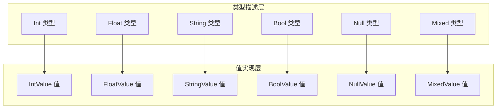
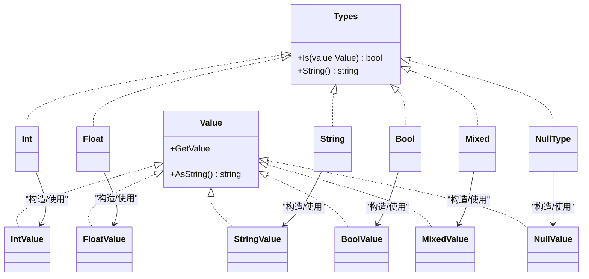
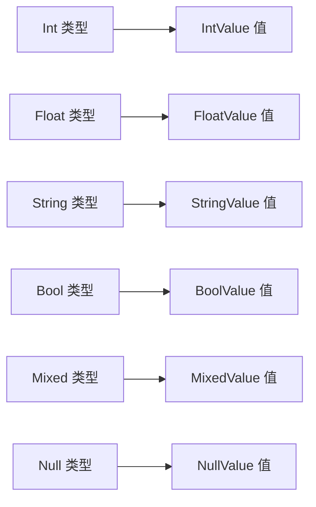

# 基础数据类型

<cite>
**本文引用的文件**
- [data/types.go](file://data/types.go)
- [data/type_int.go](file://data/type_int.go)
- [data/type_string.go](file://data/type_string.go)
- [data/type_bool.go](file://data/type_bool.go)
- [data/type_floath.go](file://data/type_floath.go)
- [data/type_mixed.go](file://data/type_mixed.go)
- [data/value.go](file://data/value.go)
- [data/value_int.go](file://data/value_int.go)
- [data/value_string.go](file://data/value_string.go)
- [data/value_bool.go](file://data/value_bool.go)
- [data/value_float.go](file://data/value_float.go)
- [data/value_null.go](file://data/value_null.go)
- [data/value_mixed.go](file://data/value_mixed.go)
</cite>

## 目录
1. [简介](#简介)
2. [项目结构](#项目结构)
3. [核心组件](#核心组件)
4. [架构总览](#架构总览)
5. [详细组件分析](#详细组件分析)
6. [依赖分析](#依赖分析)
7. [性能考虑](#性能考虑)
8. [故障排查指南](#故障排查指南)
9. [结论](#结论)

## 简介
本文件系统性梳理仓库中“基础数据类型”的定义与操作方法，覆盖以下类型：
- 整数类型（Int）
- 浮点数类型（Float）
- 字符串类型（String）
- 布尔类型（Bool）
- 空类型（Null）
- 混合类型（Mixed）

对每种类型，文档给出：
- 类型定义与职责
- 构造函数
- 类型检查方法 Is(value Value) bool
- 字符串表示方法 String() string
- 常见使用示例（以路径形式给出）
- 特点、取值范围与适用场景

## 项目结构
基础数据类型由两类构件组成：
- 类型描述层（data/types.go 中的 Types 接口及若干具体类型，如 Int、Float、String、Bool、Mixed、NullType 等）
- 值实现层（data/value_xxx.go 中的具体值类型，如 IntValue、FloatValue、StringValue、BoolValue、NullValue、MixedValue）

图表来源
- [data/types.go](file://data/types.go)
- [data/type_int.go](file://data/type_int.go)
- [data/type_string.go](file://data/type_string.go)
- [data/type_bool.go](file://data/type_bool.go)
- [data/type_floath.go](file://data/type_floath.go)
- [data/type_mixed.go](file://data/type_mixed.go)
- [data/value_int.go](file://data/value_int.go)
- [data/value_string.go](file://data/value_string.go)
- [data/value_bool.go](file://data/value_bool.go)
- [data/value_float.go](file://data/value_float.go)
- [data/value_null.go](file://data/value_null.go)
- [data/value_mixed.go](file://data/value_mixed.go)

章节来源
- [data/types.go](file://data/types.go)
- [data/value.go](file://data/value.go)

## 核心组件
- Types 接口：统一的类型抽象，包含 Is(value Value) bool 与 String() string 方法，用于类型判断与字符串化。
- Value 接口：统一的值抽象，包含 GetValue 与 AsString 等方法，用于运行期取值与字符串化。
- 各基础类型的 Is 实现：基于值类型或接口能力进行判断。
- 各基础值的 AsString/AsInt/AsFloat/AsBool/Marshal/Unmarshal/ToGoValue 等方法：提供跨语言与序列化支持。

章节来源
- [data/types.go](file://data/types.go)
- [data/value.go](file://data/value.go)

## 架构总览
类型与值之间的映射关系如下：

图表来源
- [data/types.go](file://data/types.go)
- [data/value.go](file://data/value.go)
- [data/value_int.go](file://data/value_int.go)
- [data/value_string.go](file://data/value_string.go)
- [data/value_bool.go](file://data/value_bool.go)
- [data/value_float.go](file://data/value_float.go)
- [data/value_null.go](file://data/value_null.go)
- [data/value_mixed.go](file://data/value_mixed.go)

## 详细组件分析

### 整数类型（Int）
- 类型定义与职责
  - 类型描述：Int 结构体，实现 Types 接口，用于表示整数类型。
  - Is 判断逻辑：仅当值为 IntValue 时返回真。
  - 字符串化：返回 "int"。
- 构造函数
  - NewIntValue(int) -> Value：用于创建整数值。
- 类型检查与字符串表示
  - Is(value Value) bool：基于值类型精确匹配。
  - String() string："int"。
- 常见使用示例（以路径形式）
  - 创建整数值：[data/value_int.go](file://data/value_int.go)
  - 类型判断流程：[data/type_int.go](file://data/type_int.go)
- 特点与适用场景
  - 特点：严格类型匹配，适合需要明确整数语义的场景。
  - 适用：计数、索引、位运算等。
- 性能与复杂度
  - Is 为 O(1)，字符串化为 O(1)。
- 错误处理
  - 非 IntValue 的值会被拒绝，属于显式错误。

章节来源
- [data/type_int.go](file://data/type_int.go)
- [data/value_int.go](file://data/value_int.go)

### 浮点数类型（Float）
- 类型定义与职责
  - 类型描述：Float 结构体，实现 Types 接口，用于表示浮点数类型。
  - Is 判断逻辑：当值实现 AsFloat 接口时返回真。
  - 字符串化：返回 "float"。
- 构造函数
  - NewFloatValue(float64) -> Value：用于创建浮点数值。
- 类型检查与字符串表示
  - Is(value Value) bool：基于值是否具备 AsFloat 能力。
  - String() string："float"。
- 常见使用示例（以路径形式）
  - 创建浮点数值：[data/value_float.go](file://data/value_float.go)
  - 类型判断流程：[data/type_floath.go](file://data/type_floath.go)
- 特点与适用场景
  - 特点：通过接口能力判断，兼容性强；值对象同时提供 AsFloat/AsFloat32。
  - 适用：科学计算、货币计算、百分比等。
- 性能与复杂度
  - Is 为 O(1)，字符串化为 O(1)。
- 错误处理
  - 不满足 AsFloat 的值会被拒绝。

章节来源
- [data/type_floath.go](file://data/type_floath.go)
- [data/value_float.go](file://data/value_float.go)

### 字符串类型（String）
- 类型定义与职责
  - 类型描述：String 结构体，实现 Types 接口，用于表示字符串类型。
  - Is 判断逻辑：仅当值为 StringValue 时返回真。
  - 字符串化：返回 "string"。
- 构造函数
  - NewStringValue(string) -> Value：用于创建字符串值。
- 类型检查与字符串表示
  - Is(value Value) bool：基于值类型精确匹配。
  - String() string："string"。
- 常见使用示例（以路径形式）
  - 创建字符串值：[data/value_string.go](file://data/value_string.go)
  - 类型判断流程：[data/type_string.go](file://data/type_string.go)
- 特点与适用场景
  - 特点：严格类型匹配；值对象提供丰富的字符串方法与属性访问。
  - 适用：文本处理、模板渲染、URL 拼接等。
- 性能与复杂度
  - Is 为 O(1)，字符串化为 O(1)。
- 错误处理
  - 非 StringValue 的值会被拒绝。

章节来源
- [data/type_string.go](file://data/type_string.go)
- [data/value_string.go](file://data/value_string.go)

### 布尔类型（Bool）
- 类型定义与职责
  - 类型描述：Bool 结构体，实现 Types 接口，用于表示布尔类型。
  - Is 判断逻辑：当值为 BoolValue 或实现 AsBool 接口时返回真。
  - 字符串化：返回 "bool"。
- 构造函数
  - NewBoolValue(bool) -> Value：用于创建布尔值。
- 类型检查与字符串表示
  - Is(value Value) bool：基于值类型或 AsBool 能力。
  - String() string："bool"。
- 常见使用示例（以路径形式）
  - 创建布尔值：[data/value_bool.go](file://data/value_bool.go)
  - 类型判断流程：[data/type_bool.go](file://data/type_bool.go)
- 特点与适用场景
  - 特点：支持弱类型语义（AsBool），便于与标量互换。
  - 适用：条件判断、开关控制、状态标记等。
- 性能与复杂度
  - Is 为 O(1)，字符串化为 O(1)。
- 错误处理
  - 不满足 AsBool 的值会被拒绝。

章节来源
- [data/type_bool.go](file://data/type_bool.go)
- [data/value_bool.go](file://data/value_bool.go)

### 空类型（Null）
- 类型定义与职责
  - 类型描述：NullType 结构体，实现 Types 接口，用于表示空类型。
  - Is 判断逻辑：仅当值为 NullValue 时返回真。
  - 字符串化：返回 "null"。
- 构造函数
  - NewNullValue() -> Value：用于创建空值。
- 类型检查与字符串表示
  - Is(value Value) bool：基于值类型精确匹配。
  - String() string："null"。
- 常见使用示例（以路径形式）
  - 创建空值：[data/value_null.go](file://data/value_null.go)
  - 类型判断流程：[data/types.go](file://data/types.go)
- 特点与适用场景
  - 特点：严格类型匹配；值对象提供 AsInt/AsFloat/AsBool 的零值行为。
  - 适用：占位、默认值、可选字段等。
- 性能与复杂度
  - Is 为 O(1)，字符串化为 O(1)。
- 错误处理
  - 非 NullValue 的值会被拒绝。

章节来源
- [data/types.go](file://data/types.go)
- [data/value_null.go](file://data/value_null.go)

### 混合类型（Mixed）
- 类型定义与职责
  - 类型描述：Mixed 结构体，实现 Types 接口，用于表示混合类型。
  - Is 判断逻辑：始终返回真，表示“任何值”。
  - 字符串化：返回 "mixed"。
- 构造函数
  - NewMixedValue(interface{}) -> Value：用于创建混合值。
- 类型检查与字符串表示
  - Is(value Value) bool：总是真。
  - String() string："mixed"。
- 常见使用示例（以路径形式）
  - 创建混合值：[data/value_mixed.go](file://data/value_mixed.go)
  - 类型判断流程：[data/type_mixed.go](file://data/type_mixed.go)
- 特点与适用场景
  - 特点：宽松类型，适合动态场景；值对象提供通用字符串化。
  - 适用：动态语言风格、反射、桥接外部系统。
- 性能与复杂度
  - Is 为 O(1)，字符串化为 O(1)。
- 错误处理
  - 由于 Is 总为真，不会拒绝任何值。

章节来源
- [data/type_mixed.go](file://data/type_mixed.go)
- [data/value_mixed.go](file://data/value_mixed.go)

## 依赖分析
- 类型到值的依赖
  - Int -> IntValue
  - Float -> FloatValue
  - String -> StringValue
  - Bool -> BoolValue
  - Mixed -> MixedValue
  - NullType -> NullValue
- 类型判断的依赖
  - Int/Bool/Float/String/NullType 依赖值类型或接口能力
  - Mixed 对所有值放行
- 值对象的通用接口
  - 所有值均实现 Value 接口，提供 GetValue 与 AsString 等能力

图表来源
- [data/types.go](file://data/types.go)
- [data/value_int.go](file://data/value_int.go)
- [data/value_string.go](file://data/value_string.go)
- [data/value_bool.go](file://data/value_bool.go)
- [data/value_float.go](file://data/value_float.go)
- [data/value_null.go](file://data/value_null.go)
- [data/value_mixed.go](file://data/value_mixed.go)

## 性能考虑
- 类型判断（Is）均为 O(1)，通过类型断言或接口能力判断，避免昂贵的解析或格式化。
- 字符串化（String）均为 O(1)，直接返回预定义标识。
- 值对象的 AsXxx 方法按需进行转换，避免不必要的计算。
- 建议在高频路径中优先使用精确类型（如 Int/Float/String/Bool/NullType），减少 Mixed 的使用以提升静态约束与性能。

## 故障排查指南
- 类型不匹配
  - 症状：Is 返回假，导致类型校验失败。
  - 排查：确认传入值是否为对应值类型或是否实现相应 AsXxx 接口。
  - 参考：各类型 Is 的实现路径。
- 字符串化异常
  - 症状：输出不符合预期。
  - 排查：确认使用的类型与值对象是否正确，以及 AsString 的实现。
- 混合类型滥用
  - 症状：类型安全降低、调试困难。
  - 排查：尽量使用更具体的类型，减少 Mixed 的使用。

章节来源
- [data/type_int.go](file://data/type_int.go)
- [data/type_string.go](file://data/type_string.go)
- [data/type_bool.go](file://data/type_bool.go)
- [data/type_floath.go](file://data/type_floath.go)
- [data/type_mixed.go](file://data/type_mixed.go)
- [data/value_int.go](file://data/value_int.go)
- [data/value_string.go](file://data/value_string.go)
- [data/value_bool.go](file://data/value_bool.go)
- [data/value_float.go](file://data/value_float.go)
- [data/value_null.go](file://data/value_null.go)
- [data/value_mixed.go](file://data/value_mixed.go)

## 结论
本仓库的基础数据类型体系以 Types 与 Value 为核心抽象，通过精确类型与能力接口相结合的方式，既保证了类型安全，又提供了必要的灵活性。Int/Float/String/Bool/Null/Mixed 各自职责清晰，配合对应的值对象，能够满足从强类型到动态语言风格的多种使用场景。建议在工程实践中优先选择精确类型，以获得更好的性能与可维护性。