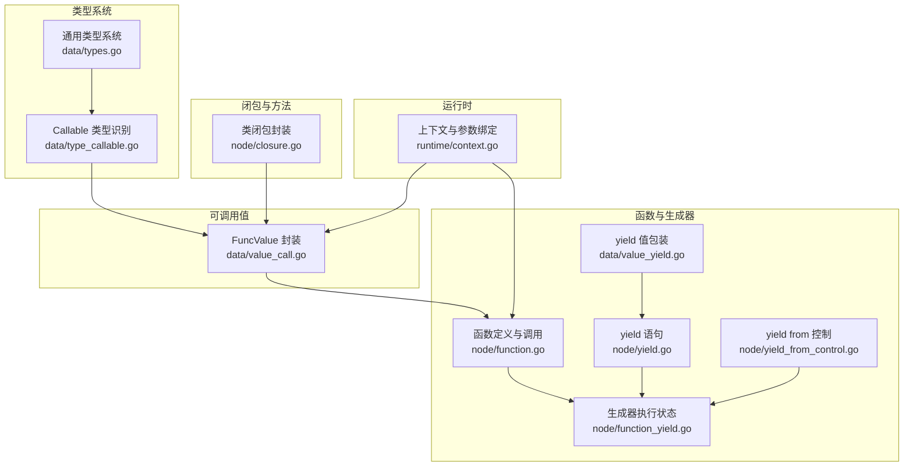
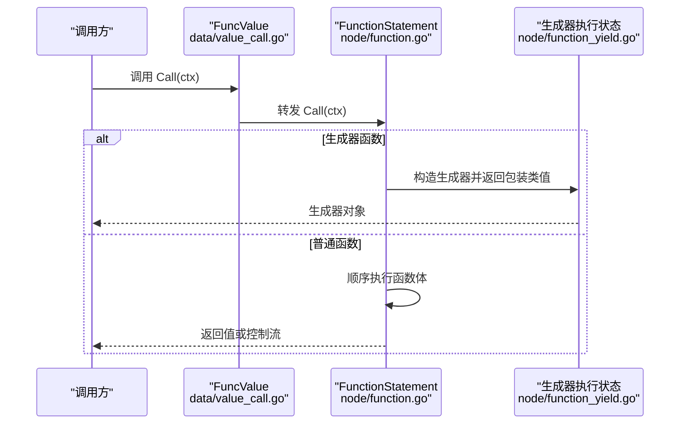
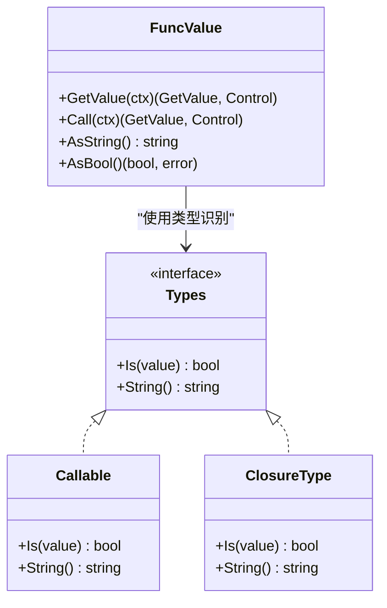
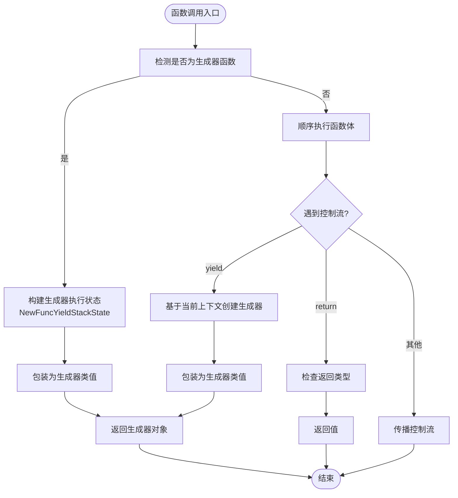
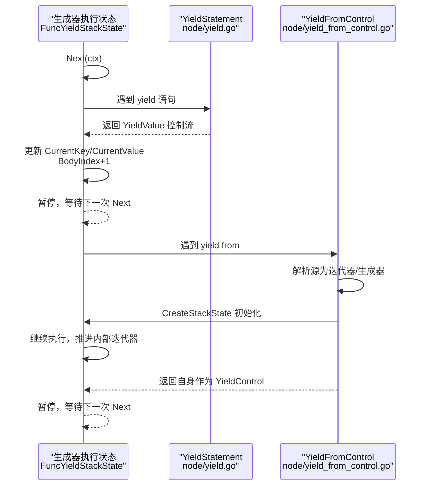
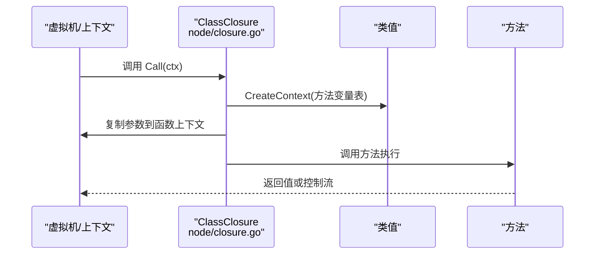
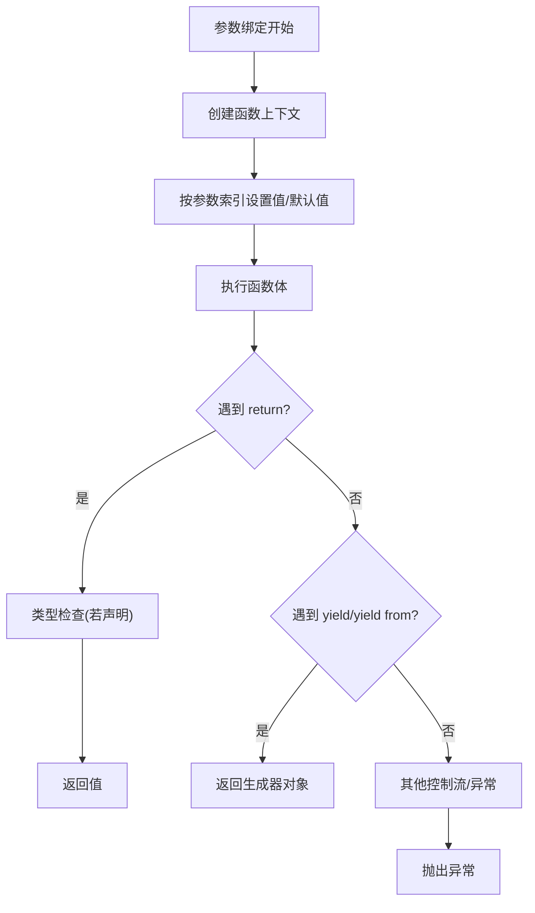
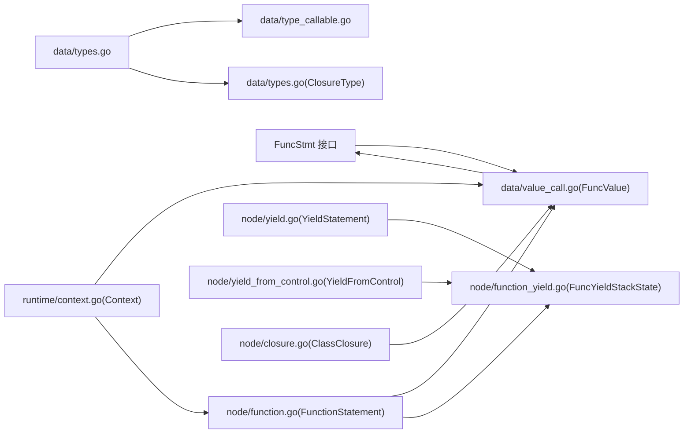

# 可调用类型

<cite>
**本文引用的文件**
- [type_callable.go](file://data/type_callable.go)
- [types.go](file://data/types.go)
- [value_call.go](file://data/value_call.go)
- [closure.go](file://node/closure.go)
- [function.go](file://node/function.go)
- [yield.go](file://node/yield.go)
- [yield_from_control.go](file://node/yield_from_control.go)
- [function_yield.go](file://node/function_yield.go)
- [value_yield.go](file://data/value_yield.go)
- [context.go](file://runtime/context.go)
- [yield.zy](file://tests/basic/yield.zy)
</cite>

## 目录
1. [简介](#简介)
2. [项目结构](#项目结构)
3. [核心组件](#核心组件)
4. [架构总览](#架构总览)
5. [详细组件分析](#详细组件分析)
6. [依赖分析](#依赖分析)
7. [性能考量](#性能考量)
8. [故障排查指南](#故障排查指南)
9. [结论](#结论)
10. [附录](#附录)

## 简介
本文件系统性梳理并记录可调用类型（callable/closure）在运行时的类型识别、统一调用接口与控制流机制，覆盖函数、方法、闭包与生成器的统一抽象。重点说明：
- 可调用类型的类型识别与判定
- call 方法的参数传递、返回值处理与异常传播
- 生成器函数的 yield 机制、协程调度与异步执行模式
- 可调用对象的创建、调用与控制流管理的实际示例

## 项目结构
围绕可调用类型与生成器的关键模块分布如下：
- 类型系统与识别：data/types.go、data/type_callable.go
- 可调用值封装与调用：data/value_call.go
- 函数与生成器语义：node/function.go、node/function_yield.go、node/yield.go、node/yield_from_control.go
- 闭包与方法调用桥接：node/closure.go
- 上下文与参数绑定：runtime/context.go
- 示例与测试：tests/basic/yield.zy

**图表来源**
- [type_callable.go:1-19](file://data/type_callable.go#L1-L19)
- [types.go:135-148](file://data/types.go#L135-L148)
- [value_call.go:5-29](file://data/value_call.go#L5-L29)
- [function.go:103-150](file://node/function.go#L103-L150)
- [function_yield.go:9-26](file://node/function_yield.go#L9-L26)
- [yield.go:21-55](file://node/yield.go#L21-L55)
- [yield_from_control.go:28-108](file://node/yield_from_control.go#L28-L108)
- [value_yield.go:7-14](file://data/value_yield.go#L7-L14)
- [closure.go:10-36](file://node/closure.go#L10-L36)
- [context.go:89-113](file://runtime/context.go#L89-L113)

**章节来源**
- [type_callable.go:1-19](file://data/type_callable.go#L1-L19)
- [types.go:135-148](file://data/types.go#L135-L148)
- [value_call.go:5-29](file://data/value_call.go#L5-L29)
- [function.go:103-150](file://node/function.go#L103-L150)
- [function_yield.go:9-26](file://node/function_yield.go#L9-L26)
- [yield.go:21-55](file://node/yield.go#L21-L55)
- [yield_from_control.go:28-108](file://node/yield_from_control.go#L28-L108)
- [value_yield.go:7-14](file://data/value_yield.go#L7-L14)
- [closure.go:10-36](file://node/closure.go#L10-L36)
- [context.go:89-113](file://runtime/context.go#L89-L113)

## 核心组件
- 可调用类型识别
  - Callable 类型用于识别可调用值，支持函数、数组、字符串等形式的可调用形态。
  - ClosureType 用于识别闭包类型（函数、数组、字符串）。
- 可调用值封装与调用
  - FuncValue 封装任意 FuncStmt，统一提供 Call 接口，转发至底层函数实现。
- 函数与生成器
  - FunctionStatement 在调用时根据是否为生成器函数（含 yield）决定行为：直接返回生成器对象或顺序执行函数体。
  - 生成器执行状态由 FuncYieldStackState 管理，支持 Next/Current/Key/Rewind/Send/Throw/GetReturn 等协程操作。
- yield/yield from
  - YieldStatement 产生 YieldValue 控制流；YieldFromControl 委托其他生成器或可迭代对象。
- 闭包与方法
  - ClassClosure 将对象方法包装为闭包，建立类上下文并绑定参数。

**章节来源**
- [type_callable.go:6-14](file://data/type_callable.go#L6-L14)
- [types.go:234-248](file://data/types.go#L234-L248)
- [value_call.go:15-21](file://data/value_call.go#L15-L21)
- [function.go:103-150](file://node/function.go#L103-L150)
- [function_yield.go:28-37](file://node/function_yield.go#L28-L37)
- [yield.go:21-55](file://node/yield.go#L21-L55)
- [yield_from_control.go:28-108](file://node/yield_from_control.go#L28-L108)
- [closure.go:22-36](file://node/closure.go#L22-L36)

## 架构总览
可调用类型体系通过“类型识别 → 值封装 → 语义执行”的分层设计，实现函数、方法、闭包与生成器的统一调用入口。

**图表来源**
- [value_call.go:19-21](file://data/value_call.go#L19-L21)
- [function.go:103-150](file://node/function.go#L103-L150)
- [function_yield.go:188-192](file://node/function_yield.go#L188-L192)

**章节来源**
- [value_call.go:19-21](file://data/value_call.go#L19-L21)
- [function.go:103-150](file://node/function.go#L103-L150)
- [function_yield.go:188-192](file://node/function_yield.go#L188-L192)

## 详细组件分析

### 可调用类型识别与统一接口
- Callable/ClosureType 识别规则
  - 支持函数、数组、字符串等可调用形态；ClosureType 同时识别闭包类型。
- FuncValue 统一调用
  - 通过 GetValue 返回自身，Call 转发至底层 FuncStmt，实现对不同可调用实体的统一调用。

**图表来源**
- [type_callable.go:3-18](file://data/type_callable.go#L3-L18)
- [types.go:234-248](file://data/types.go#L234-L248)
- [value_call.go:11-29](file://data/value_call.go#L11-L29)

**章节来源**
- [type_callable.go:6-14](file://data/type_callable.go#L6-L14)
- [types.go:234-248](file://data/types.go#L234-L248)
- [value_call.go:15-29](file://data/value_call.go#L15-L29)

### 函数与生成器的统一调用机制
- 生成器函数判定
  - 通过函数体扫描判断是否包含 yield/yield from，若存在则标记为生成器函数。
- 调用行为
  - 生成器函数：立即返回生成器对象（包装为类值），不执行函数体。
  - 普通函数：顺序执行函数体，处理 return/yield/yield from 等控制流。
- 返回值类型校验
  - 若函数声明了返回类型，调用时会对返回值进行类型检查，不匹配则抛出错误。

**图表来源**
- [function.go:34-70](file://node/function.go#L34-L70)
- [function.go:103-150](file://node/function.go#L103-L150)

**章节来源**
- [function.go:34-70](file://node/function.go#L34-L70)
- [function.go:103-150](file://node/function.go#L103-L150)

### yield 机制与协程调度
- yield 语句
  - 解析键与值，生成 YieldValue 控制流，携带上下文以便后续恢复执行。
- yield from
  - 将源表达式解析为生成器或数组，委托内部迭代器推进；首次遇到时通过 CreateStackState 初始化生成器状态。
- 生成器执行状态
  - FuncYieldStackState 维护当前键/值、自动键索引与 BodyIndex，Next 逐步执行函数体，遇到 yield/yield from 时暂停并保存状态。
  - 支持 Rewind/Valid/Current/Key/Send/Throw/GetReturn 等标准生成器操作。

**图表来源**
- [yield.go:21-55](file://node/yield.go#L21-L55)
- [yield_from_control.go:61-108](file://node/yield_from_control.go#L61-L108)
- [function_yield.go:60-123](file://node/function_yield.go#L60-L123)

**章节来源**
- [yield.go:21-55](file://node/yield.go#L21-L55)
- [yield_from_control.go:61-108](file://node/yield_from_control.go#L61-L108)
- [function_yield.go:60-123](file://node/function_yield.go#L60-L123)

### 闭包与方法调用
- 类闭包封装
  - NewClassClosure 基于类值与方法名获取方法，创建 ClassClosure 并绑定类上下文。
- 参数绑定与执行
  - Call 时创建函数上下文，将调用参数复制到函数局部变量，再调用方法执行。

**图表来源**
- [closure.go:10-36](file://node/closure.go#L10-L36)

**章节来源**
- [closure.go:10-36](file://node/closure.go#L10-L36)

### 参数传递、返回值处理与异常传播
- 参数传递
  - 通过 Context.CreateContext 创建函数上下文，按参数索引设置 ZVal 或值；支持默认值、可变参数与引用参数等。
- 返回值处理
  - 普通函数：遇到 return 控制流时返回值；若声明返回类型则进行类型校验。
  - 生成器：返回生成器对象，后续通过 Next/current/key 等方法消费。
- 异常传播
  - 通过 data.Control 传播异常；错误包装为 ThrowValue，包含消息与堆栈信息。

**图表来源**
- [context.go:89-113](file://runtime/context.go#L89-L113)
- [function.go:116-127](file://node/function.go#L116-L127)
- [value_call.go:19-21](file://data/value_call.go#L19-L21)

**章节来源**
- [context.go:89-113](file://runtime/context.go#L89-L113)
- [function.go:116-127](file://node/function.go#L116-L127)
- [value_call.go:19-21](file://data/value_call.go#L19-L21)

## 依赖分析
- 类型系统
  - Callable/ClosureType 依赖 data.Types 接口；types.go 提供基础类型与联合/可空类型。
- 可调用值
  - FuncValue 依赖 FuncStmt 接口，统一承载函数/方法/闭包等可调用实体。
- 函数与生成器
  - FunctionStatement 依赖 node 层的 yield/yield from 控制流；生成器状态由 function_yield.go 管理。
- 闭包
  - ClassClosure 依赖类值与方法元数据，桥接对象方法与闭包语义。
- 上下文
  - Context 提供变量表、ZVal 存取与函数上下文创建。

**图表来源**
- [types.go:135-148](file://data/types.go#L135-L148)
- [type_callable.go:3-18](file://data/type_callable.go#L3-L18)
- [value_call.go:5-29](file://data/value_call.go#L5-L29)
- [function.go:103-150](file://node/function.go#L103-L150)
- [function_yield.go:9-26](file://node/function_yield.go#L9-L26)
- [yield.go:21-55](file://node/yield.go#L21-L55)
- [yield_from_control.go:28-108](file://node/yield_from_control.go#L28-L108)
- [closure.go:10-36](file://node/closure.go#L10-L36)
- [context.go:89-113](file://runtime/context.go#L89-L113)

**章节来源**
- [types.go:135-148](file://data/types.go#L135-L148)
- [type_callable.go:3-18](file://data/type_callable.go#L3-L18)
- [value_call.go:5-29](file://data/value_call.go#L5-L29)
- [function.go:103-150](file://node/function.go#L103-L150)
- [function_yield.go:9-26](file://node/function_yield.go#L9-L26)
- [yield.go:21-55](file://node/yield.go#L21-L55)
- [yield_from_control.go:28-108](file://node/yield_from_control.go#L28-L108)
- [closure.go:10-36](file://node/closure.go#L10-L36)
- [context.go:89-113](file://runtime/context.go#L89-L113)

## 性能考量
- 生成器惰性求值
  - 生成器函数在调用时不执行函数体，仅返回生成器对象，避免不必要的计算开销。
- 协程状态复用
  - 生成器执行状态在 Next 中逐步推进，避免重复解析与重建执行环境。
- 参数绑定优化
  - 通过 Context.SetIndexZVal 直接设置 ZVal，减少拷贝与类型转换成本。

[本节为通用指导，无需具体文件分析]

## 故障排查指南
- 返回值类型不匹配
  - 现象：函数返回值与声明的返回类型不一致时报错。
  - 处理：检查函数返回路径与类型注解，确保返回值满足类型约束。
- yield/yield from 使用错误
  - 现象：yield from 需要可迭代对象，否则抛出错误。
  - 处理：确认源表达式为生成器或数组；必要时使用数组生成器包装。
- 生成器异常终止
  - 现象：调用 Throw 导致生成器异常终止，后续调用无效。
  - 处理：捕获异常并重新创建生成器实例。

**章节来源**
- [function.go:119-125](file://node/function.go#L119-L125)
- [yield_from_control.go:79-84](file://node/yield_from_control.go#L79-L84)
- [function_yield.go:157-166](file://node/function_yield.go#L157-L166)

## 结论
本体系通过类型识别、值封装与语义执行三层抽象，实现了对函数、方法、闭包与生成器的统一调用接口。生成器采用协程状态机模型，结合 yield/yield from 控制流，提供高效的惰性迭代能力。配合完善的参数绑定与异常传播机制，可调用类型在复杂业务场景中具备良好的扩展性与可控性。

[本节为总结性内容，无需具体文件分析]

## 附录

### 实际示例与用法指引
- 生成器创建与迭代
  - 使用函数定义生成器，调用后返回生成器对象；通过 valid/current/next 等方法消费。
- yield/yield from 委托
  - 在生成器中使用 yield from 委托其他生成器或数组，实现组合式迭代。
- 闭包与方法调用
  - 通过 ClassClosure 将对象方法包装为闭包，在不同上下文中复用。

**章节来源**
- [yield.zy:4-178](file://tests/basic/yield.zy#L4-L178)