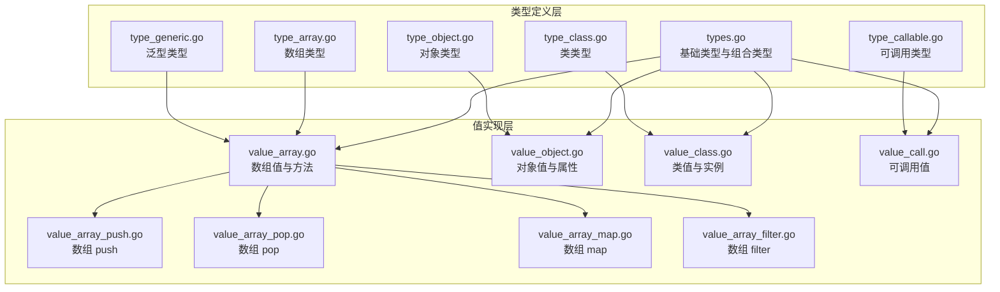
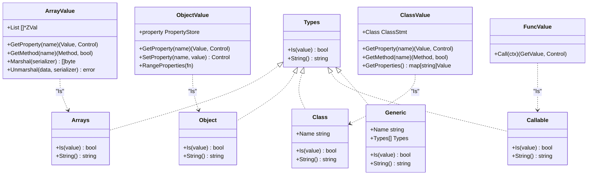
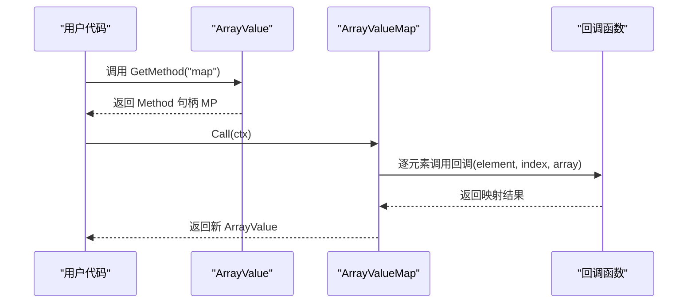
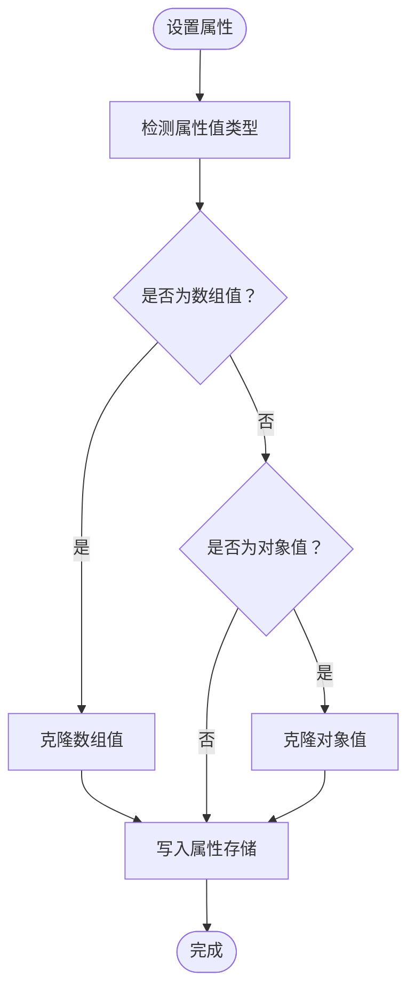
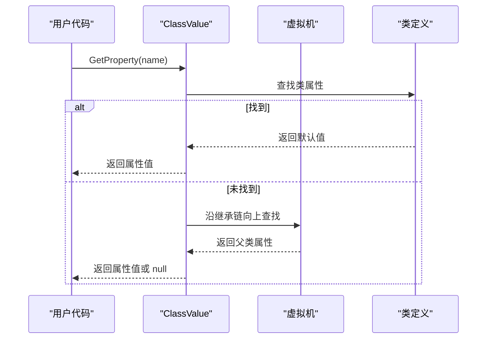
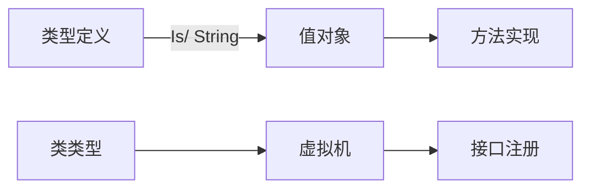

# 复合数据类型

<cite>
**本文档引用的文件**
- [types.go](file://data/types.go)
- [type_array.go](file://data/type_array.go)
- [type_object.go](file://data/type_object.go)
- [type_class.go](file://data/type_class.go)
- [type_callable.go](file://data/type_callable.go)
- [type_generic.go](file://data/type_generic.go)
- [value_array.go](file://data/value_array.go)
- [value_array_push.go](file://data/value_array_push.go)
- [value_array_pop.go](file://data/value_array_pop.go)
- [value_array_map.go](file://data/value_array_map.go)
- [value_array_filter.go](file://data/value_array_filter.go)
- [value_object.go](file://data/value_object.go)
- [value_class.go](file://data/value_class.go)
- [value_call.go](file://data/value_call.go)
- [array_merge.zy](file://tests/php/array_merge.zy)
- [array_pop.zy](file://tests/php/array_pop.zy)
- [array_push.zy](file://tests/php/array_push.zy)
</cite>

## 目录
1. [简介](#简介)
2. [项目结构](#项目结构)
3. [核心组件](#核心组件)
4. [架构总览](#架构总览)
5. [详细组件分析](#详细组件分析)
6. [依赖分析](#依赖分析)
7. [性能考量](#性能考量)
8. [故障排查指南](#故障排查指南)
9. [结论](#结论)
10. [附录](#附录)

## 简介
本文件聚焦于复合数据类型的完整API文档，涵盖以下类型与能力：
- 数组类型（Array）：索引访问、迭代、切片、拼接、排序、映射、过滤、查找、统计等。
- 对象类型（Object）：属性读取/设置、动态属性、有序遍历、复制语义。
- 类类型（Class）：实例化、属性与方法解析、继承链与接口实现判定。
- 可调用类型（Callable）：函数、闭包、字符串形式的可调用识别与执行。
- 泛型类型（Generic）：参数化占位与类型范围描述。

文档同时说明各类型的构造方式、属性访问、方法调用与类型检查机制，并给出使用示例与最佳实践。

## 项目结构
复合数据类型相关的核心代码位于 data 目录，围绕“类型定义”和“值实现”两条主线组织：
- 类型定义层：位于 data/types.go 及其子文件，定义各类型的识别规则与字符串表示。
- 值实现层：位于 data/value_*.go，提供具体值对象及其方法/属性访问、序列化、迭代等行为。

图表来源
- [types.go:142-219](file://data/types.go#L142-L219)
- [type_array.go:3-19](file://data/type_array.go#L3-L19)
- [type_object.go:3-18](file://data/type_object.go#L3-L18)
- [type_class.go:3-65](file://data/type_class.go#L3-L65)
- [type_callable.go:3-18](file://data/type_callable.go#L3-L18)
- [type_generic.go:6-17](file://data/type_generic.go#L6-L17)
- [value_array.go:32-162](file://data/value_array.go#L32-L162)
- [value_object.go:42-190](file://data/value_object.go#L42-L190)
- [value_class.go:21-295](file://data/value_class.go#L21-L295)
- [value_call.go:5-30](file://data/value_call.go#L5-L30)
- [value_array_push.go:3-55](file://data/value_array_push.go#L3-L55)
- [value_array_pop.go:3-44](file://data/value_array_pop.go#L3-L44)
- [value_array_map.go:5-90](file://data/value_array_map.go#L5-L90)
- [value_array_filter.go:5-95](file://data/value_array_filter.go#L5-L95)

章节来源
- [types.go:142-219](file://data/types.go#L142-L219)
- [value_array.go:32-162](file://data/value_array.go#L32-L162)
- [value_object.go:42-190](file://data/value_object.go#L42-L190)
- [value_class.go:21-295](file://data/value_class.go#L21-L295)
- [value_call.go:5-30](file://data/value_call.go#L5-L30)

## 核心组件
- 类型接口与工厂
  - 类型接口：统一的 Is(value) 类型检查与 String() 字符串表示。
  - 基础类型工厂：根据字符串标识创建基础类型（int/string/bool/array/object/callable/static/null/closure）。
  - 组合类型：可空类型、联合类型、多返回值类型、泛型类型。
- 复合类型定义
  - 数组类型：识别 ArrayValue 与部分关联数组（ObjectValue）。
  - 对象类型：识别 ObjectValue 与 ClassValue。
  - 类类型：基于类名、继承链与接口实现进行识别。
  - 可调用类型：识别函数、数组、字符串形式的可调用。
  - 泛型类型：名称与参数列表，当前 Is 为占位实现。

章节来源
- [types.go:5-262](file://data/types.go#L5-L262)
- [type_array.go:3-19](file://data/type_array.go#L3-L19)
- [type_object.go:3-18](file://data/type_object.go#L3-L18)
- [type_class.go:3-65](file://data/type_class.go#L3-L65)
- [type_callable.go:3-18](file://data/type_callable.go#L3-L18)
- [type_generic.go:6-17](file://data/type_generic.go#L6-L17)

## 架构总览
复合数据类型的运行时交互流程如下：
- 类型检查：由 Types.Is(value) 判断值是否匹配类型定义。
- 值对象：ArrayValue/ObjectValue/ClassValue 提供属性访问、方法调用、迭代与序列化。
- 可调用：FuncValue 包装函数定义，支持 Call 执行。
- 泛型：Generic 作为占位，配合 NewGenericType 生成类型描述。

图表来源
- [types.go:5-262](file://data/types.go#L5-L262)
- [type_array.go:3-19](file://data/type_array.go#L3-L19)
- [type_object.go:3-18](file://data/type_object.go#L3-L18)
- [type_class.go:3-65](file://data/type_class.go#L3-L65)
- [type_callable.go:3-18](file://data/type_callable.go#L3-L18)
- [type_generic.go:6-17](file://data/type_generic.go#L6-L17)
- [value_array.go:32-162](file://data/value_array.go#L32-L162)
- [value_object.go:42-190](file://data/value_object.go#L42-L190)
- [value_class.go:21-295](file://data/value_class.go#L21-L295)
- [value_call.go:5-30](file://data/value_call.go#L5-L30)

## 详细组件分析

### 数组类型（Array）
- 定义与类型检查
  - 类型识别：Arrays.Is 识别 ArrayValue 与部分关联数组（ObjectValue）。
  - 字符串表示：返回 "array"。
- 构造方式
  - 通过 NewArrayValue(v []Value) 构造，内部持有 []*ZVal 列表。
  - CloneArrayValue 支持浅拷贝，保持结构独立性。
- 属性访问
  - GetProperty 支持 "length" 属性，返回数组长度。
- 方法调用
  - GetMethod 返回内置方法句柄（push/pop/shift/unshift/slice/splice/join/reverse/sort/indexOf/includes/forEach/map/filter/reduce/concat/every/some/find/findIndex/flat/flatMap）。
  - 具体方法实现位于独立文件中，例如：
    - push：向末尾追加元素并返回新长度。
    - pop：移除并返回最后一个元素，空数组返回 null。
    - map：对每个元素应用回调，返回新数组。
    - filter：对每个元素应用回调，返回满足条件的元素组成的新数组。
- 序列化与转换
  - Marshal/Unmarshal 支持序列化与反序列化。
  - ToGoValue 返回 Go 值。
- 迭代
  - 实现迭代器接口：Current/Key/Next/Rewind/Valid，支持 foreach 风格遍历。

图表来源
- [value_array.go:84-133](file://data/value_array.go#L84-L133)
- [value_array_map.go:11-61](file://data/value_array_map.go#L11-L61)
- [value_call.go:19-21](file://data/value_call.go#L19-L21)

章节来源
- [type_array.go:3-19](file://data/type_array.go#L3-L19)
- [value_array.go:7-162](file://data/value_array.go#L7-L162)
- [value_array_push.go:9-26](file://data/value_array_push.go#L9-L26)
- [value_array_pop.go:9-19](file://data/value_array_pop.go#L9-L19)
- [value_array_map.go:11-61](file://data/value_array_map.go#L11-L61)
- [value_array_filter.go:9-66](file://data/value_array_filter.go#L9-L66)

### 对象类型（Object）
- 定义与类型检查
  - 类型识别：Object.Is 识别 ObjectValue 与 ClassValue。
  - 字符串表示：返回 "object"。
- 构造方式
  - NewObjectValue 创建空对象，内部使用有序属性存储（PropertyStore）。
  - CloneObjectValue 支持浅拷贝，遵循 PHP 数组的 copy-on-write 语义。
- 属性访问
  - GetProperty 支持读取已存在属性；若属性不存在，动态属性返回 null。
  - SetProperty 在设置数组/对象属性时进行克隆，避免共享导致的副作用。
  - GetProperties 返回所有属性的映射；RangeProperties 按插入顺序遍历。
- 迭代
  - 实现迭代器接口：Rewind/Valid/Current/Key/Next，支持 foreach 遍历。
- 序列化与转换
  - Marshal/Unmarshal 支持序列化与反序列化。
  - ToGoValue 返回 Go 值。

图表来源
- [value_object.go:96-107](file://data/value_object.go#L96-L107)

章节来源
- [type_object.go:3-18](file://data/type_object.go#L3-L18)
- [value_object.go:11-190](file://data/value_object.go#L11-L190)

### 类类型（Class）
- 定义与类型检查
  - 类型识别：Class.Is 支持 ClassValue/ThisValue/ThrowValue，以及 "iterable" 特殊情况。
  - 继承与接口：通过 extendISClass 与 interfaceExtends 递归检查父类与接口继承链。
  - 字符串表示：返回类名。
- 实例化与属性/方法解析
  - NewClassValue 从类定义与上下文创建 ClassValue。
  - GetProperty/GetMethod 优先从当前类查找，再沿继承链向上查找。
  - GetProperties 合并实例属性与类默认属性，处理继承链上的非私有属性。
- 上下文与作用域
  - CreateContext 为方法调用创建带类值的上下文。
  - ClassMethodContext 支持变量读写与索引访问。

图表来源
- [value_class.go:83-100](file://data/value_class.go#L83-L100)
- [value_class.go:111-137](file://data/value_class.go#L111-L137)
- [type_class.go:67-84](file://data/type_class.go#L67-L84)
- [type_class.go:88-145](file://data/type_class.go#L88-L145)

章节来源
- [type_class.go:3-65](file://data/type_class.go#L3-L65)
- [value_class.go:8-295](file://data/value_class.go#L8-L295)

### 可调用类型（Callable）
- 定义与类型检查
  - 类型识别：Callable.Is 识别函数值（FuncValue）、数组值、字符串值。
  - 字符串表示：返回 "callable"。
- 执行
  - FuncValue.Call 将调用委托给函数定义的 Call。
- 使用场景
  - 作为数组 map/filter 等高阶函数的回调参数。

章节来源
- [type_callable.go:3-18](file://data/type_callable.go#L3-L18)
- [value_call.go:19-21](file://data/value_call.go#L19-L21)

### 泛型类型（Generic）
- 定义与类型检查
  - 结构：包含名称与参数类型列表。
  - 当前 Is 实现为占位，尚未启用严格检查。
  - 字符串表示：返回名称。
- 参数化机制
  - NewGenericType 支持基础类型与自定义泛型名称的参数化描述。

章节来源
- [type_generic.go:6-17](file://data/type_generic.go#L6-L17)
- [types.go:200-219](file://data/types.go#L200-L219)

## 依赖分析
- 类型与值的耦合
  - 类型定义（Types 实现）与值对象（ArrayValue/ObjectValue/ClassValue/FuncValue）通过 Is/String 协议解耦。
  - 值对象通过 GetMethod/GetProperty 暴露能力，类型系统仅负责识别。
- 继承与接口检查
  - Class.Is 依赖 VM 注册的类与接口信息，interfaceExtends 通过队列遍历接口 extends 链。
- 方法实现分布
  - 数组方法分散在独立文件中，便于维护与扩展。

图表来源
- [types.go:5-262](file://data/types.go#L5-L262)
- [value_array.go:84-133](file://data/value_array.go#L84-L133)
- [type_class.go:88-145](file://data/type_class.go#L88-L145)

章节来源
- [types.go:5-262](file://data/types.go#L5-L262)
- [type_class.go:88-145](file://data/type_class.go#L88-L145)

## 性能考量
- 数组与对象的浅拷贝
  - CloneArrayValue/CloneObjectValue 仅复制切片或属性存储结构，避免深拷贝带来的开销。
- 迭代器语义
  - ArrayValue/ObjectValue 的迭代器字段减少重复计算，提升遍历效率。
- 回调执行
  - map/filter 等方法在回调执行时按需创建上下文，避免不必要的内存分配。

[本节为通用性能建议，无需特定文件来源]

## 故障排查指南
- 数组 push/pop 语义不符
  - 确认调用的是 ArrayValue 的 push/pop 方法句柄，而非普通函数。
  - 检查参数是否为数组值，必要时先转换为 ArrayValue。
- map/filter 回调异常
  - 确保回调为可调用值（FuncValue 或 CallableValue），并正确传入元素、索引与数组。
- 对象属性克隆问题
  - 设置数组/对象属性时应触发克隆，避免多个引用共享同一底层结构。
- 类型检查失败
  - 检查类名、继承链与接口实现是否已在 VM 中注册；接口 extends 链是否正确。

章节来源
- [value_array_push.go:9-26](file://data/value_array_push.go#L9-L26)
- [value_array_pop.go:9-19](file://data/value_array_pop.go#L9-L19)
- [value_array_map.go:25-58](file://data/value_array_map.go#L25-L58)
- [value_array_filter.go:23-63](file://data/value_array_filter.go#L23-L63)
- [value_object.go:96-107](file://data/value_object.go#L96-L107)
- [type_class.go:67-84](file://data/type_class.go#L67-L84)

## 结论
本系统通过清晰的类型接口与值对象分离，提供了完善的复合数据类型支持：
- 数组与对象具备丰富的内置方法与迭代能力；
- 类类型支持继承与接口实现的动态判定；
- 可调用类型统一了函数与闭包的识别与执行；
- 泛型类型提供参数化描述能力。

建议在实际使用中结合测试用例验证行为一致性，并遵循浅拷贝与 copy-on-write 语义以避免副作用。

[本节为总结性内容，无需特定文件来源]

## 附录

### 使用示例与最佳实践
- 数组操作示例
  - push/pop：参考测试用例路径 [array_push.zy](file://tests/php/array_push.zy)、[array_pop.zy](file://tests/php/array_pop.zy)。
  - map/filter：参考测试用例路径 [array_merge.zy](file://tests/php/array_merge.zy)（用于理解数组合并与行为预期）。
- 最佳实践
  - 在设置对象属性时，确保数组/对象值会被克隆，避免共享底层结构。
  - 在调用 map/filter 等高阶函数时，明确回调签名（元素、索引、数组）。
  - 类型检查失败时，优先确认 VM 中类/接口注册状态与 extends 链。

章节来源
- [array_push.zy:1-34](file://tests/php/array_push.zy#L1-L34)
- [array_pop.zy:1-34](file://tests/php/array_pop.zy#L1-L34)
- [array_merge.zy:1-48](file://tests/php/array_merge.zy#L1-L48)