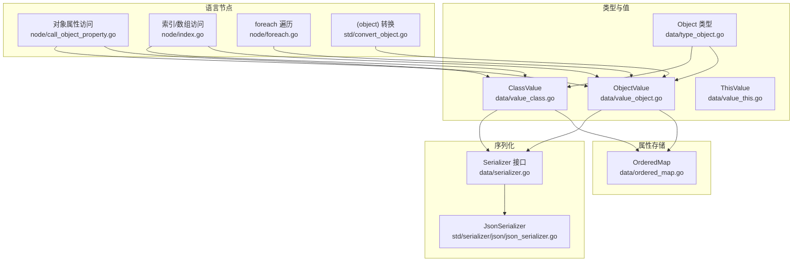
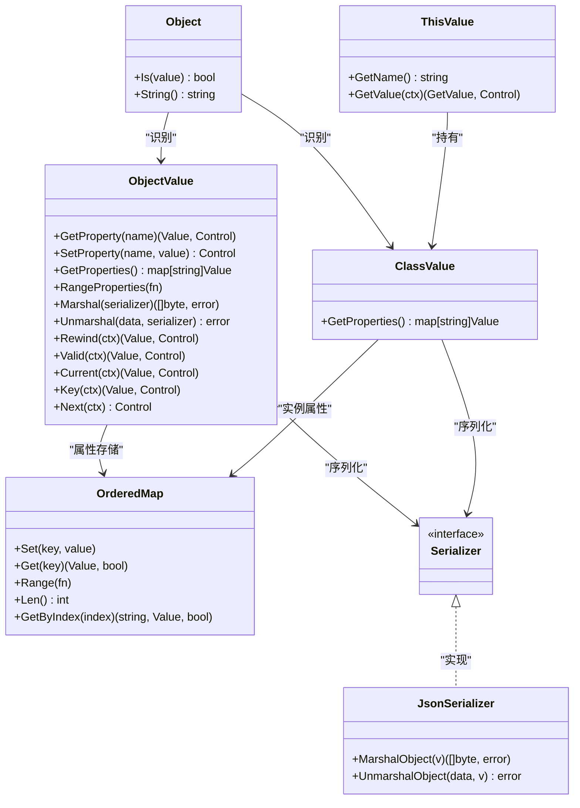
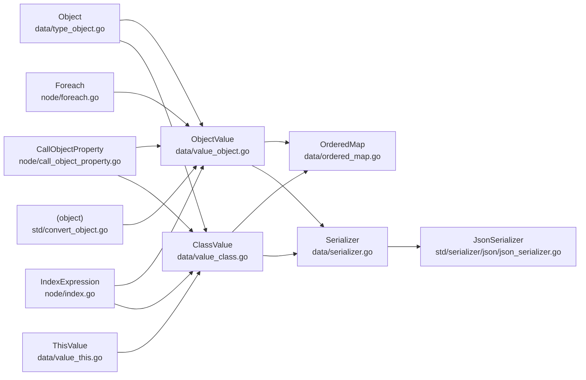

# 对象类型

<cite>
**本文档引用的文件**
- [data/type_object.go](file://data/type_object.go)
- [data/value_object.go](file://data/value_object.go)
- [data/ordered_map.go](file://data/ordered_map.go)
- [data/serializer.go](file://data/serializer.go)
- [std/convert_object.go](file://std/convert_object.go)
- [std/serializer/json/json_serializer.go](file://std/serializer/json/json_serializer.go)
- [data/value_this.go](file://data/value_this.go)
- [node/call_object_property.go](file://node/call_object_property.go)
- [data/value_class.go](file://data/value_class.go)
- [node/index.go](file://node/index.go)
- [node/foreach.go](file://node/foreach.go)
- [tests/php/object_cast_test.php](file://tests/php/object_cast_test.php)
- [tests/php/serialize_object_test.php](file://tests/php/serialize_object_test.php)
</cite>

## 目录
1. [简介](#简介)
2. [项目结构](#项目结构)
3. [核心组件](#核心组件)
4. [架构总览](#架构总览)
5. [详细组件分析](#详细组件分析)
6. [依赖分析](#依赖分析)
7. [性能考量](#性能考量)
8. [故障排查指南](#故障排查指南)
9. [结论](#结论)
10. [附录](#附录)

## 简介
本章节面向对象类型（Object）的完整API文档，涵盖类型检查机制、字符串表示、对象值创建、属性访问与修改、this引用机制、属性查找与原型链访问策略、以及对象的序列化与反序列化流程。同时提供属性遍历、类型检查与动态属性操作的最佳实践与示例路径。

## 项目结构
对象类型系统由以下模块协同构成：
- 类型与值层：类型识别与对象值实现
- 属性存储层：有序属性存储与遍历
- 序列化层：统一序列化接口与JSON实现
- 语言节点层：属性访问、索引访问、遍历与this引用
- 标准库函数：(object) 类型转换

**图表来源**
- [data/type_object.go:1-18](file://data/type_object.go#L1-L18)
- [data/value_object.go:1-190](file://data/value_object.go#L1-L190)
- [data/ordered_map.go:1-109](file://data/ordered_map.go#L1-L109)
- [data/serializer.go:1-31](file://data/serializer.go#L1-L31)
- [std/serializer/json/json_serializer.go:1-424](file://std/serializer/json/json_serializer.go#L1-L424)
- [node/call_object_property.go:76-118](file://node/call_object_property.go#L76-L118)
- [node/index.go:76-415](file://node/index.go#L76-L415)
- [node/foreach.go:108-310](file://node/foreach.go#L108-L310)
- [std/convert_object.go:1-67](file://std/convert_object.go#L1-L67)
- [data/value_this.go:1-20](file://data/value_this.go#L1-L20)

**章节来源**
- [data/type_object.go:1-18](file://data/type_object.go#L1-L18)
- [data/value_object.go:1-190](file://data/value_object.go#L1-L190)
- [data/ordered_map.go:1-109](file://data/ordered_map.go#L1-L109)
- [data/serializer.go:1-31](file://data/serializer.go#L1-L31)
- [std/serializer/json/json_serializer.go:1-424](file://std/serializer/json/json_serializer.go#L1-L424)
- [node/call_object_property.go:76-118](file://node/call_object_property.go#L76-L118)
- [node/index.go:76-415](file://node/index.go#L76-L415)
- [node/foreach.go:108-310](file://node/foreach.go#L108-L310)
- [std/convert_object.go:1-67](file://std/convert_object.go#L1-L67)
- [data/value_this.go:1-20](file://data/value_this.go#L1-L20)

## 核心组件
- Object 类型：提供对象类型识别与字符串表示，识别 ObjectValue 与 ClassValue。
- ObjectValue：对象值容器，维护有序属性存储、属性访问/设置、遍历、序列化/反序列化、迭代器协议。
- OrderedMap：有序属性存储，支持按插入顺序遍历、快速索引与键值对访问。
- Serializer 接口与 JsonSerializer：统一序列化协议，JSON 实现负责对象属性的稳定序列化与反序列化。
- 语言节点：对象属性访问、索引访问、foreach 遍历、(object) 类型转换、this 引用。

**章节来源**
- [data/type_object.go:1-18](file://data/type_object.go#L1-L18)
- [data/value_object.go:1-190](file://data/value_object.go#L1-L190)
- [data/ordered_map.go:1-109](file://data/ordered_map.go#L1-L109)
- [data/serializer.go:1-31](file://data/serializer.go#L1-L31)
- [std/serializer/json/json_serializer.go:118-194](file://std/serializer/json/json_serializer.go#L118-L194)
- [node/call_object_property.go:76-118](file://node/call_object_property.go#L76-L118)
- [node/index.go:380-415](file://node/index.go#L380-L415)
- [node/foreach.go:140-189](file://node/foreach.go#L140-L189)
- [std/convert_object.go:10-52](file://std/convert_object.go#L10-L52)
- [data/value_this.go:1-20](file://data/value_this.go#L1-L20)

## 架构总览
对象类型系统围绕“类型识别—对象值—属性存储—序列化—语言节点”的层次化设计展开，既满足PHP风格的对象语义，又提供稳定的序列化与遍历能力。

**图表来源**
- [data/type_object.go:1-18](file://data/type_object.go#L1-L18)
- [data/value_object.go:42-190](file://data/value_object.go#L42-L190)
- [data/ordered_map.go:7-109](file://data/ordered_map.go#L7-L109)
- [data/serializer.go:3-31](file://data/serializer.go#L3-L31)
- [std/serializer/json/json_serializer.go:118-194](file://std/serializer/json/json_serializer.go#L118-L194)
- [data/value_this.go:3-20](file://data/value_this.go#L3-L20)

## 详细组件分析

### 类型检查与字符串表示
- 类型识别：Object.Is 接受任意 Value，若为 ObjectValue 或 ClassValue 则返回真；否则为假。
- 字符串表示：Object.String 返回固定标识字符串，便于调试与日志输出。

最佳实践
- 使用 Object.Is 进行运行时类型判断，避免类型断言错误。
- 在日志与错误消息中使用 Object.String 以统一输出对象类型标识。

**章节来源**
- [data/type_object.go:6-18](file://data/type_object.go#L6-L18)

### 对象值创建与属性管理
- 创建对象值：NewObjectValue 初始化空对象，内部使用 OrderedMap 存储属性。
- 属性访问：GetProperty 支持普通属性与特殊属性（如 length）；GetZVal 提供 ZVal 访问。
- 属性设置：SetProperty 自动对数组/对象类型的值执行浅拷贝，避免共享状态导致的副作用。
- 属性遍历：GetProperties 返回映射；RangeProperties 按插入顺序遍历，保证一致性。
- 迭代器协议：实现 Rewind/Valid/Current/Key/Next，支持 foreach 语义。

最佳实践
- 优先使用 RangeProperties 进行属性遍历，确保顺序稳定。
- 写入数组/对象属性前，依赖 SetProperty 的浅拷贝语义，避免外部状态污染。
- 使用 GetProperties 获取快照，避免遍历时并发修改。

**章节来源**
- [data/value_object.go:11-15](file://data/value_object.go#L11-L15)
- [data/value_object.go:79-107](file://data/value_object.go#L79-L107)
- [data/value_object.go:109-125](file://data/value_object.go#L109-L125)
- [data/value_object.go:154-189](file://data/value_object.go#L154-L189)

### 属性存储与有序遍历
- OrderedMap 提供 Set/Get/Range/GetByIndex/Length 等能力，内部维护索引映射与插入顺序。
- 通过互斥锁保障并发安全，适合多线程环境下的属性读写。

最佳实践
- 使用 GetByIndex 与 Length 实现稳定的迭代器行为。
- 遍历时尽量使用 Range，避免重复查询索引。

**章节来源**
- [data/ordered_map.go:7-109](file://data/ordered_map.go#L7-L109)

### this 引用机制
- ThisValue 包装 ClassValue，提供 GetName 与 GetValue，使 this 在表达式求值阶段可直接作为对象值使用。
- this 的典型来源为方法调用上下文，通过 ThisValue 将当前类实例暴露给属性访问与方法调用。

最佳实践
- 在自定义节点或方法中，通过 ThisValue.GetValue 获取底层 ClassValue，再进行属性读写。

**章节来源**
- [data/value_this.go:3-20](file://data/value_this.go#L3-L20)
- [data/value_class.go:139-176](file://data/value_class.go#L139-L176)

### 属性查找与原型链访问
- 对象属性访问：CallObjectProperty 支持 __get/__set 魔法方法的自动分发，读取不存在或不可见属性时调用 __get，写入时调用 __set。
- 索引访问：IndexExpression 对 ObjectValue 支持整数/字符串索引，整数索引转换为字符串键进行属性查找；对 ClassValue 若实现 ArrayAccess 则走 offsetGet，否则仅允许公开属性访问。
- foreach 遍历：若目标为对象且非 Iterator 实例，则使用 RangeProperties 按插入顺序遍历属性。

注意
- 当前实现未提供显式的“原型链”查找；属性查找遵循对象实例与类定义的组合视图（参见 ClassValue.GetProperties）。

最佳实践
- 优先使用 -> 属性语法访问公开属性；需要动态属性或跨可见性访问时，利用 __get/__set。
- 索引访问时，整数键会转换为字符串键，需注意键名一致性。

**章节来源**
- [node/call_object_property.go:76-118](file://node/call_object_property.go#L76-L118)
- [node/index.go:380-415](file://node/index.go#L380-L415)
- [node/foreach.go:140-189](file://node/foreach.go#L140-L189)
- [data/value_class.go:139-176](file://data/value_class.go#L139-L176)

### 序列化与反序列化
- 统一接口：ObjectValue/ClassValue 实现 ValueSerializer，委托 Serializer 接口完成序列化与反序列化。
- JSON 实现：JsonSerializer.MarshalObject/UnmarshalObject 保证属性顺序与类型推断；支持基于现有属性类型或类定义属性类型的精准反序列化。
- 顺序与类型：使用 RangeProperties 与 unmarshalWithExpected 保证输出与输入的稳定性。

最佳实践
- 使用 JsonSerializer 进行跨语言传输或持久化，确保属性顺序与类型一致。
- 反序列化时优先提供已有属性类型信息，以获得更精确的结果。

**章节来源**
- [data/serializer.go:3-31](file://data/serializer.go#L3-L31)
- [std/serializer/json/json_serializer.go:118-194](file://std/serializer/json/json_serializer.go#L118-L194)
- [std/serializer/json/json_serializer.go:414-424](file://std/serializer/json/json_serializer.go#L414-L424)

### (object) 类型转换
- 行为概览：(object) 将数组（含数值键）转换为对象，数值键转为字符串属性名；已为对象的值直接返回；其它标量值包装为带 scalar 属性的对象。
- 实现入口：ObjectFunction.Call 根据输入类型分支处理。

最佳实践
- 使用 (object) 将数组转换为对象，以便在动态属性访问场景中复用对象语义。
- 注意数值键到字符串键的转换规则，避免键名歧义。

**章节来源**
- [std/convert_object.go:10-52](file://std/convert_object.go#L10-L52)

### 字符串表示
- ObjectValue.AsString 逐项拼接属性键值，形成结构化的对象字符串，便于调试与日志输出。

最佳实践
- 在开发与排障阶段，使用 AsString 输出对象快照，辅助定位属性问题。

**章节来源**
- [data/value_object.go:57-73](file://data/value_object.go#L57-L73)

### 示例与最佳实践
- 动态属性操作：通过 __get/__set 实现动态属性读写，参考对象属性访问节点的魔法方法分发。
- 属性遍历：使用 RangeProperties 保证遍历顺序与插入顺序一致；在 foreach 中可直接遍历对象属性。
- 类型检查：使用 Object.Is 判断值是否为对象类型（ObjectValue/ClassValue）。
- (object) 转换：参考数组到对象的转换与标量包装行为。
- 序列化：使用 JsonSerializer 进行对象序列化与反序列化，确保类型与顺序稳定。

**章节来源**
- [node/call_object_property.go:76-118](file://node/call_object_property.go#L76-L118)
- [node/foreach.go:140-189](file://node/foreach.go#L140-L189)
- [data/type_object.go:6-14](file://data/type_object.go#L6-L14)
- [std/convert_object.go:10-52](file://std/convert_object.go#L10-L52)
- [std/serializer/json/json_serializer.go:118-194](file://std/serializer/json/json_serializer.go#L118-L194)

## 依赖分析
对象类型系统的关键依赖关系如下：

**图表来源**
- [data/type_object.go:1-18](file://data/type_object.go#L1-L18)
- [data/value_object.go:1-190](file://data/value_object.go#L1-L190)
- [data/ordered_map.go:1-109](file://data/ordered_map.go#L1-L109)
- [data/serializer.go:1-31](file://data/serializer.go#L1-L31)
- [std/serializer/json/json_serializer.go:1-424](file://std/serializer/json/json_serializer.go#L1-L424)
- [node/call_object_property.go:76-118](file://node/call_object_property.go#L76-L118)
- [node/index.go:76-415](file://node/index.go#L76-L415)
- [node/foreach.go:108-310](file://node/foreach.go#L108-L310)
- [std/convert_object.go:1-67](file://std/convert_object.go#L1-L67)
- [data/value_this.go:1-20](file://data/value_this.go#L1-L20)

**章节来源**
- [data/type_object.go:1-18](file://data/type_object.go#L1-L18)
- [data/value_object.go:1-190](file://data/value_object.go#L1-L190)
- [data/ordered_map.go:1-109](file://data/ordered_map.go#L1-L109)
- [data/serializer.go:1-31](file://data/serializer.go#L1-L31)
- [std/serializer/json/json_serializer.go:1-424](file://std/serializer/json/json_serializer.go#L1-L424)
- [node/call_object_property.go:76-118](file://node/call_object_property.go#L76-L118)
- [node/index.go:76-415](file://node/index.go#L76-L415)
- [node/foreach.go:108-310](file://node/foreach.go#L108-L310)
- [std/convert_object.go:1-67](file://std/convert_object.go#L1-L67)
- [data/value_this.go:1-20](file://data/value_this.go#L1-L20)

## 性能考量
- 属性存储：OrderedMap 使用互斥锁保护读写，适合高并发场景；遍历通过 Range 顺序访问，避免随机性带来的不稳定。
- 浅拷贝语义：SetProperty 对数组/对象属性进行浅拷贝，降低共享状态引发的竞态风险，但不替代深拷贝。
- 序列化：JsonSerializer 使用 RangeProperties 保证顺序，unmarshalWithExpected 优先按类型反序列化，减少类型猜测成本。
- 迭代器：ObjectValue 的迭代器基于索引访问，时间复杂度 O(1) 定位，整体遍历 O(n)。

[本节为通用性能讨论，不直接分析具体文件]

## 故障排查指南
- 属性不可见或访问异常
  - 检查是否需要魔法方法 __get/__set；若属性非公开或不存在，将触发魔法分发。
  - 参考对象属性访问节点的魔法方法调用路径。
- 索引访问失败
  - 确认索引类型：整数索引会被转换为字符串键；字符串索引直接使用。
  - 对类实例访问属性时，仅允许公开属性；若实现 ArrayAccess，将走 offsetGet。
- 遍历顺序不一致
  - 使用 RangeProperties 或 foreach 语义遍历，避免依赖 Go map 的随机遍历。
- 序列化/反序列化结果异常
  - 确保使用 JsonSerializer；优先提供属性类型信息以提升反序列化精度。
- this 引用无效
  - 确认当前上下文存在有效的 ThisValue；通过 GetValue 获取底层 ClassValue。

**章节来源**
- [node/call_object_property.go:76-118](file://node/call_object_property.go#L76-L118)
- [node/index.go:380-415](file://node/index.go#L380-L415)
- [node/foreach.go:140-189](file://node/foreach.go#L140-L189)
- [std/serializer/json/json_serializer.go:118-194](file://std/serializer/json/json_serializer.go#L118-L194)

## 结论
对象类型系统在保持PHP风格对象语义的同时，提供了稳定的属性存储、遍历与序列化能力。通过类型识别、有序属性存储、魔法方法分发、迭代器协议与JSON序列化，开发者可以安全地进行动态属性操作与跨语言数据交换。建议在实际工程中结合本文的最佳实践，确保类型检查、属性遍历与序列化的一致性与可维护性。

[本节为总结性内容，不直接分析具体文件]

## 附录
- 示例路径
  - (object) 类型转换示例：[tests/php/object_cast_test.php:1-43](file://tests/php/object_cast_test.php#L1-L43)
  - 对象序列化兼容性示例：[tests/php/serialize_object_test.php:1-32](file://tests/php/serialize_object_test.php#L1-L32)

**章节来源**
- [tests/php/object_cast_test.php:1-43](file://tests/php/object_cast_test.php#L1-L43)
- [tests/php/serialize_object_test.php:1-32](file://tests/php/serialize_object_test.php#L1-L32)