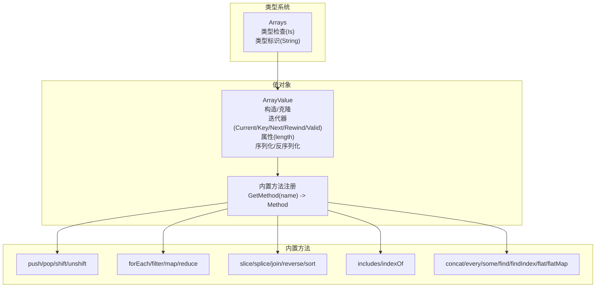
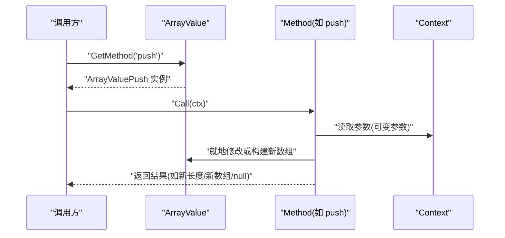
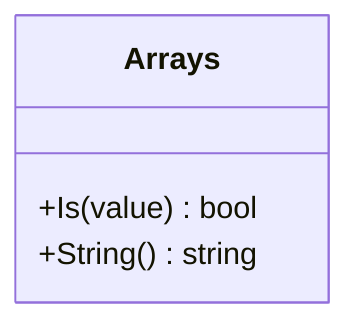
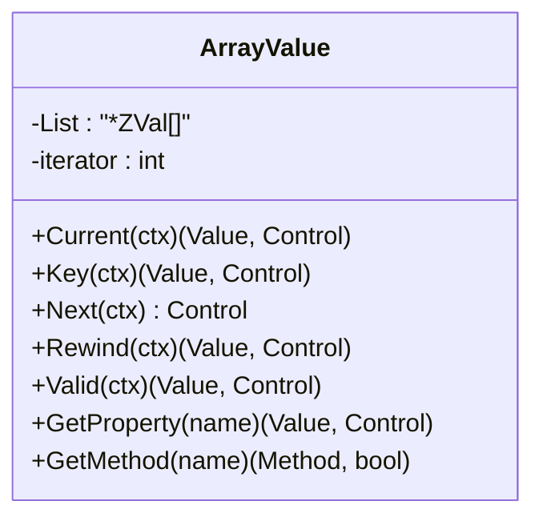
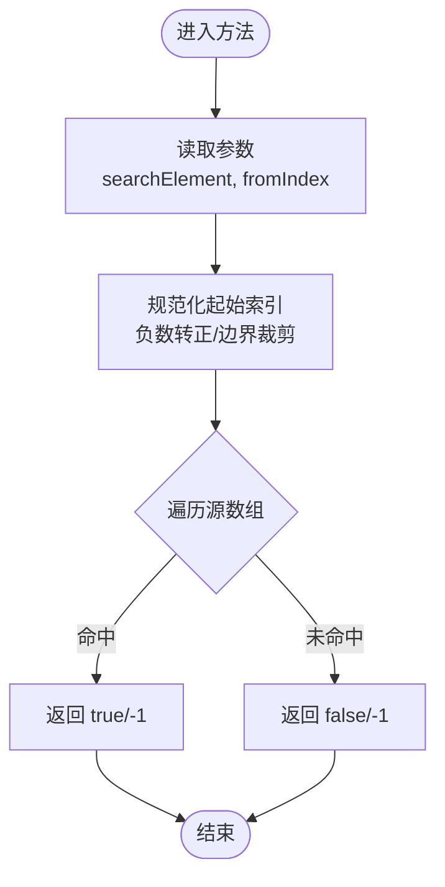
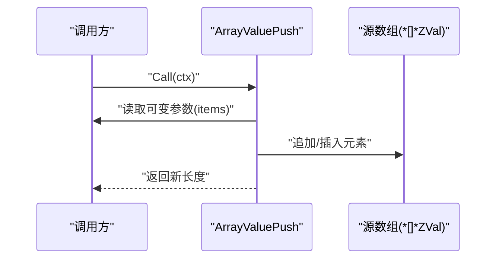
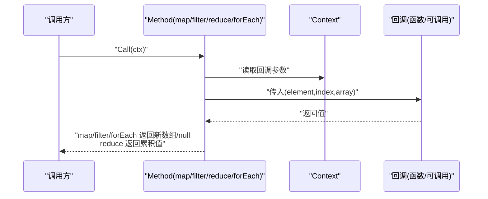
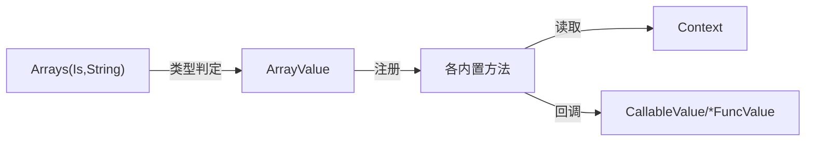

# 数组类型

<cite>
**本文引用的文件**
- [data/type_array.go](file://data/type_array.go)
- [data/value_array.go](file://data/value_array.go)
- [data/value_array_concat.go](file://data/value_array_concat.go)
- [data/value_array_filter.go](file://data/value_array_filter.go)
- [data/value_array_map.go](file://data/value_array_map.go)
- [data/value_array_reduce.go](file://data/value_array_reduce.go)
- [data/value_array_push.go](file://data/value_array_push.go)
- [data/value_array_pop.go](file://data/value_array_pop.go)
- [data/value_array_shift.go](file://data/value_array_shift.go)
- [data/value_array_unshift.go](file://data/value_array_unshift.go)
- [data/value_array_for_each.go](file://data/value_array_for_each.go)
- [data/value_array_includes.go](file://data/value_array_includes.go)
- [data/value_array_index_of.go](file://data/value_array_index_of.go)
- [data/value_array_join.go](file://data/value_array_join.go)
- [data/value_array_reverse.go](file://data/value_array_reverse.go)
- [data/value_array_sort.go](file://data/value_array_sort.go)
</cite>

## 目录
1. [简介](#简介)
2. [项目结构](#项目结构)
3. [核心组件](#核心组件)
4. [架构总览](#架构总览)
5. [详细组件分析](#详细组件分析)
6. [依赖分析](#依赖分析)
7. [性能考量](#性能考量)
8. [故障排查指南](#故障排查指南)
9. [结论](#结论)
10. [附录](#附录)

## 简介
本文件系统性梳理 Origami 中“数组类型”的设计与实现，覆盖以下方面：
- 类型标识与检查：Arrays.Is 的类型判定逻辑，以及 String 的类型标识输出。
- 数组值的构造与基础属性：ArrayValue 的数据结构、迭代器行为、length 属性。
- 常用索引与访问：indexOf、includes 等方法的实现要点。
- 内置方法族：concat、filter、map、reduce、push、pop、shift、unshift、forEach、join、reverse、sort、flat、flatMap、every、some、find、findIndex 等。
- PHP 关联数组在 Origami 的表示：ObjectValue 的兼容性处理。
- 示例与性能建议：通过方法调用流程图展示典型操作，给出性能与内存优化建议。

## 项目结构
数组类型相关代码主要位于 data 目录下，围绕两类核心对象展开：
- 类型系统：Arrays（类型检查与标识）
- 值对象：ArrayValue（数组值、迭代器、内置方法注册）

图表来源
- [data/type_array.go:1-20](file://data/type_array.go#L1-L20)
- [data/value_array.go:1-162](file://data/value_array.go#L1-L162)
- [data/value_array_push.go:1-55](file://data/value_array_push.go#L1-L55)
- [data/value_array_filter.go:1-95](file://data/value_array_filter.go#L1-L95)
- [data/value_array_map.go:1-90](file://data/value_array_map.go#L1-L90)
- [data/value_array_reduce.go:1-133](file://data/value_array_reduce.go#L1-L133)
- [data/value_array_concat.go:1-59](file://data/value_array_concat.go#L1-L59)
- [data/value_array_for_each.go:1-80](file://data/value_array_for_each.go#L1-L80)
- [data/value_array_join.go:1-57](file://data/value_array_join.go#L1-L57)
- [data/value_array_reverse.go:1-46](file://data/value_array_reverse.go#L1-L46)
- [data/value_array_sort.go:1-55](file://data/value_array_sort.go#L1-L55)
- [data/value_array_includes.go:1-78](file://data/value_array_includes.go#L1-L78)
- [data/value_array_index_of.go:1-78](file://data/value_array_index_of.go#L1-L78)

章节来源
- [data/type_array.go:1-20](file://data/type_array.go#L1-L20)
- [data/value_array.go:1-162](file://data/value_array.go#L1-L162)

## 核心组件
- 类型系统：Arrays 提供类型检查与标识
  - Is：判断值是否为数组类型，包含对 ObjectValue 的兼容（PHP 关联数组在 Origami 中以 ObjectValue 表示）。
  - String：返回类型标识字符串“array”。
- 值对象：ArrayValue
  - 构造：NewArrayValue 接受 []Value，内部以 []*ZVal 存储；CloneArrayValue 浅拷贝切片，保持结构独立。
  - 迭代器：Current/Key/Next/Rewind/Valid 支持 foreach 风格遍历。
  - 属性：length 读取当前元素数量。
  - 序列化：Marshal/Unmarshal/ToGoValue 交由 Serializer 处理。
  - 方法注册：GetMethod(name) 将方法名映射到具体 Method 实现。

章节来源
- [data/type_array.go:6-19](file://data/type_array.go#L6-L19)
- [data/value_array.go:7-30](file://data/value_array.go#L7-L30)
- [data/value_array.go:37-61](file://data/value_array.go#L37-L61)
- [data/value_array.go:135-141](file://data/value_array.go#L135-L141)
- [data/value_array.go:143-153](file://data/value_array.go#L143-L153)
- [data/value_array.go:84-133](file://data/value_array.go#L84-L133)

## 架构总览
数组类型在运行时的交互路径如下：调用方通过 ArrayValue.GetMethod 获取方法实例，再调用其 Call 执行具体逻辑。部分方法会读取上下文参数（ctx.GetIndexValue），并对源数组进行就地修改或返回新数组。

图表来源
- [data/value_array.go:84-133](file://data/value_array.go#L84-L133)
- [data/value_array_push.go:9-26](file://data/value_array_push.go#L9-L26)

## 详细组件分析

### 类型系统：Arrays
- Is：识别 ArrayValue 或 ObjectValue（兼容 PHP 关联数组）。
- String：返回“array”。

图表来源
- [data/type_array.go:3-19](file://data/type_array.go#L3-L19)

章节来源
- [data/type_array.go:6-19](file://data/type_array.go#L6-L19)

### 值对象：ArrayValue
- 构造与克隆：NewArrayValue/CloneArrayValue，浅拷贝切片，避免重复分配 ZVal。
- 迭代器：Current/Key/Next/Rewind/Valid，支持 foreach。
- 属性：length 读取当前长度。
- 方法注册：GetMethod 将方法名映射到具体 Method。

图表来源
- [data/value_array.go:32-61](file://data/value_array.go#L32-L61)
- [data/value_array.go:135-141](file://data/value_array.go#L135-L141)
- [data/value_array.go:84-133](file://data/value_array.go#L84-L133)

章节来源
- [data/value_array.go:7-30](file://data/value_array.go#L7-L30)
- [data/value_array.go:37-61](file://data/value_array.go#L37-L61)
- [data/value_array.go:135-141](file://data/value_array.go#L135-L141)
- [data/value_array.go:84-133](file://data/value_array.go#L84-L133)

### 索引与访问：includes 与 indexOf
- includes：从指定起始位置开始，逐项比较元素字符串表示，命中返回 true，否则 false。
- indexOf：同 includes，但返回首个匹配元素的索引，未命中返回 -1。

图表来源
- [data/value_array_includes.go:9-47](file://data/value_array_includes.go#L9-L47)
- [data/value_array_index_of.go:9-47](file://data/value_array_index_of.go#L9-L47)

章节来源
- [data/value_array_includes.go:1-78](file://data/value_array_includes.go#L1-L78)
- [data/value_array_index_of.go:1-78](file://data/value_array_index_of.go#L1-L78)

### 修改类方法：push、pop、shift、unshift
- push：将一个或多个元素追加到数组末尾，返回新长度。
- pop：移除并返回最后一个元素，空数组返回 null。
- shift：移除并返回第一个元素，空数组返回 null。
- unshift：将一个或多个元素插入到数组开头，返回新长度。

图表来源
- [data/value_array_push.go:9-26](file://data/value_array_push.go#L9-L26)
- [data/value_array_pop.go:9-19](file://data/value_array_pop.go#L9-L19)
- [data/value_array_shift.go:9-19](file://data/value_array_shift.go#L9-L19)
- [data/value_array_unshift.go:9-27](file://data/value_array_unshift.go#L9-L27)

章节来源
- [data/value_array_push.go:1-55](file://data/value_array_push.go#L1-L55)
- [data/value_array_pop.go:1-44](file://data/value_array_pop.go#L1-L44)
- [data/value_array_shift.go:1-44](file://data/value_array_shift.go#L1-L44)
- [data/value_array_unshift.go:1-56](file://data/value_array_unshift.go#L1-L56)

### 遍历与转换：forEach、map、filter、reduce
- forEach：对每个元素调用回调（element, index, array），无返回值。
- map：对每个元素调用回调，返回由回调结果组成的新数组。
- filter：对每个元素调用回调，返回满足条件的元素组成的新数组。
- reduce：对元素进行累积计算，支持初始值，返回最终累积值。

图表来源
- [data/value_array_for_each.go:9-51](file://data/value_array_for_each.go#L9-L51)
- [data/value_array_map.go:11-61](file://data/value_array_map.go#L11-L61)
- [data/value_array_filter.go:9-66](file://data/value_array_filter.go#L9-L66)
- [data/value_array_reduce.go:9-102](file://data/value_array_reduce.go#L9-L102)

章节来源
- [data/value_array_for_each.go:1-80](file://data/value_array_for_each.go#L1-L80)
- [data/value_array_map.go:1-90](file://data/value_array_map.go#L1-L90)
- [data/value_array_filter.go:1-95](file://data/value_array_filter.go#L1-L95)
- [data/value_array_reduce.go:1-133](file://data/value_array_reduce.go#L1-L133)

### 组合与结构变换：concat、join、reverse、sort、slice、splice、flat、flatMap、every、some、find、findIndex
- concat：合并多个数组或元素，返回新数组。
- join：用分隔符连接所有元素为字符串。
- reverse：原地反转数组，返回新数组。
- sort：基于字符串比较的稳定排序，更新原数组并返回新数组。
- slice/splice：截取/替换子数组（slice 返回新数组，splice 就地修改并返回被删除元素组成的数组）。
- flat/flatMap：扁平化与映射后扁平化。
- every/some/find/findIndex：逻辑判断与检索。

```mermaid
classDiagram
class ArrayValueConcat {
+Call(ctx) GetValue
+GetName() string
+GetParams() []GetValue
+GetReturnType() Types
}
class ArrayValueJoin {
+Call(ctx) GetValue
+GetParams() []GetValue
+GetReturnType() Types
}
class ArrayValueReverse {
+Call(ctx) GetValue
+GetReturnType() Types
}
class ArrayValueSort {
+Call(ctx) GetValue
+GetReturnType() Types
}
class ArrayValueSlice {
+Call(ctx) GetValue
}
class ArrayValueSplice {
+Call(ctx) GetValue
}
class ArrayValueFlat {
+Call(ctx) GetValue
}
class ArrayValueFlatMap {
+Call(ctx) GetValue
}
class ArrayValueEvery {
+Call(ctx) GetValue
}
class ArrayValueSome {
+Call(ctx) GetValue
}
class ArrayValueFind {
+Call(ctx) GetValue
}
class ArrayValueFindIndex {
+Call(ctx) GetValue
}
```

图表来源
- [data/value_array_concat.go:3-30](file://data/value_array_concat.go#L3-L30)
- [data/value_array_join.go:7-28](file://data/value_array_join.go#L7-L28)
- [data/value_array_reverse.go:9-21](file://data/value_array_reverse.go#L9-L21)
- [data/value_array_sort.go:11-29](file://data/value_array_sort.go#L11-L29)
- [data/value_array.go:94-129](file://data/value_array.go#L94-L129)

章节来源
- [data/value_array_concat.go:1-59](file://data/value_array_concat.go#L1-L59)
- [data/value_array_join.go:1-57](file://data/value_array_join.go#L1-L57)
- [data/value_array_reverse.go:1-46](file://data/value_array_reverse.go#L1-L46)
- [data/value_array_sort.go:1-55](file://data/value_array_sort.go#L1-L55)
- [data/value_array.go:94-129](file://data/value_array.go#L94-L129)

## 依赖分析
- 类型系统与值对象解耦：Arrays 仅负责类型判定，不直接操作数组内容。
- 值对象与方法实现松耦合：ArrayValue 通过 GetMethod 注册方法，具体方法实现独立于 ArrayValue。
- 方法实现依赖 Context 读取参数，回调统一走 CallableValue/*FuncValue 两种路径。
- 迭代器与属性访问：ArrayValue 提供迭代器接口，GetProperty 仅暴露 length。

图表来源
- [data/type_array.go:6-19](file://data/type_array.go#L6-L19)
- [data/value_array.go:84-133](file://data/value_array.go#L84-L133)
- [data/value_array_for_each.go:21-48](file://data/value_array_for_each.go#L21-L48)
- [data/value_array_map.go:25-58](file://data/value_array_map.go#L25-L58)
- [data/value_array_filter.go:23-63](file://data/value_array_filter.go#L23-L63)
- [data/value_array_reduce.go:21-99](file://data/value_array_reduce.go#L21-L99)

章节来源
- [data/type_array.go:6-19](file://data/type_array.go#L6-L19)
- [data/value_array.go:84-133](file://data/value_array.go#L84-L133)
- [data/value_array_for_each.go:1-80](file://data/value_array_for_each.go#L1-L80)
- [data/value_array_map.go:1-90](file://data/value_array_map.go#L1-L90)
- [data/value_array_filter.go:1-95](file://data/value_array_filter.go#L1-L95)
- [data/value_array_reduce.go:1-133](file://data/value_array_reduce.go#L1-L133)

## 性能考量
- 浅拷贝策略：CloneArrayValue 复制切片指针，避免重复分配 ZVal，降低内存与时间开销。
- 就地修改与返回新数组：push/pop/shift/unshift 等就地修改源数组，减少额外分配；而 concat/map/filter/reduce 等返回新数组，便于链式组合但增加内存占用。
- 字符串比较排序：sort 使用字符串比较，简单高效，若需数值排序应自定义比较器或预处理。
- 回调调用成本：forEach/map/filter/reduce 在回调路径上创建上下文与参数列表，频繁调用时应尽量简化回调逻辑。
- 迭代器开销：Current/Key/Next/Rewind/Valid 为 O(1) 操作，适合 foreach 场景。

## 故障排查指南
- 空数组访问
  - pop/shift 访问空数组返回 null，注意判空后再使用返回值。
- 参数缺失
  - reduce 在无初始值且数组为空时返回 null；includes/indexOf 缺少参数时按默认行为处理。
- 回调异常
  - forEach/map/filter/reduce 的回调若抛出控制流，将中断执行并返回控制信号；确保回调内部错误处理正确。
- 类型不匹配
  - Arrays.Is 会将 ObjectValue 视为数组类型，若业务期望严格区分，请在上层做额外校验。

章节来源
- [data/value_array_pop.go:10-19](file://data/value_array_pop.go#L10-L19)
- [data/value_array_shift.go:10-19](file://data/value_array_shift.go#L10-L19)
- [data/value_array_reduce.go:12-14](file://data/value_array_reduce.go#L12-L14)
- [data/value_array_reduce.go:44-46](file://data/value_array_reduce.go#L44-L46)
- [data/type_array.go:10-12](file://data/type_array.go#L10-L12)

## 结论
Origami 的数组类型以 ArrayValue 为核心，配合 Arrays 类型系统与丰富的内置方法，提供了与 PHP 数组语义相近的能力集。通过浅拷贝与就地修改策略平衡了性能与易用性；同时，将 PHP 关联数组以 ObjectValue 表示，增强了生态兼容性。建议在高频回调场景下优化回调复杂度，在需要保留原数组的场景优先选择返回新数组的方法。

## 附录
- PHP 关联数组在 Origami 中以 ObjectValue 表示，Arrays.Is 将其归类为数组类型，便于统一处理。
- 方法返回类型与参数约定：
  - length：整数类型
  - includes/indexOf：布尔/整数类型
  - join：字符串类型
  - forEach：无返回值（null）
  - map/filter/reduce：数组/任意类型（取决于回调与 reduce 初始值）
  - push/unshift：返回新长度（整数）
  - pop/shift：返回被移除元素或 null

章节来源
- [data/type_array.go:10-12](file://data/type_array.go#L10-L12)
- [data/value_array.go:137-139](file://data/value_array.go#L137-L139)
- [data/value_array_includes.go:75-77](file://data/value_array_includes.go#L75-L77)
- [data/value_array_index_of.go:74-77](file://data/value_array_index_of.go#L74-L77)
- [data/value_array_join.go:54-56](file://data/value_array_join.go#L54-L56)
- [data/value_array_for_each.go:77-79](file://data/value_array_for_each.go#L77-L79)
- [data/value_array_map.go:87-89](file://data/value_array_map.go#L87-L89)
- [data/value_array_filter.go:92-94](file://data/value_array_filter.go#L92-L94)
- [data/value_array_reduce.go:130-132](file://data/value_array_reduce.go#L130-L132)
- [data/value_array_push.go:52-54](file://data/value_array_push.go#L52-L54)
- [data/value_array_unshift.go:53-55](file://data/value_array_unshift.go#L53-L55)