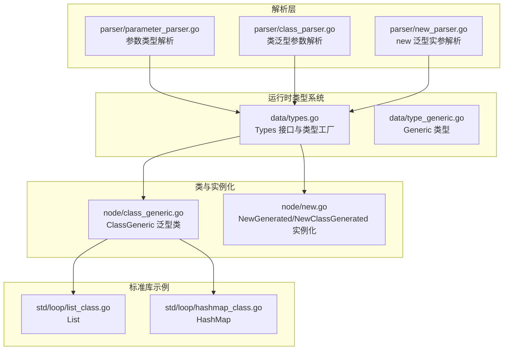
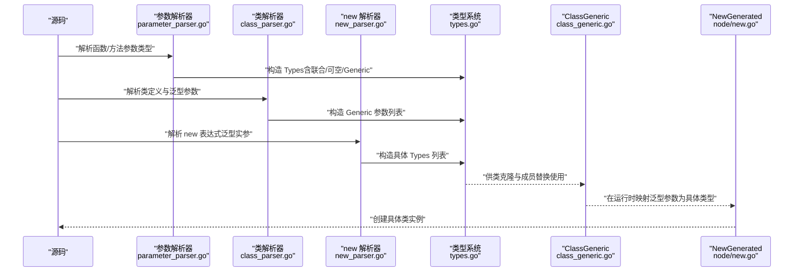
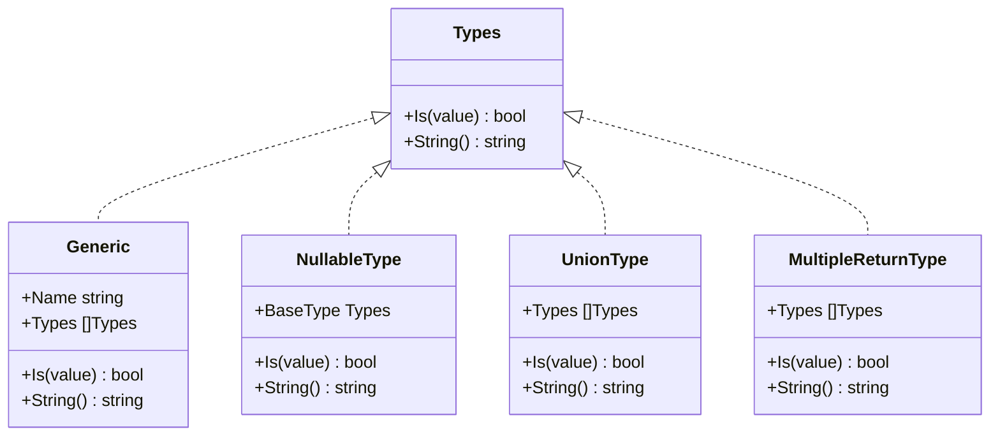
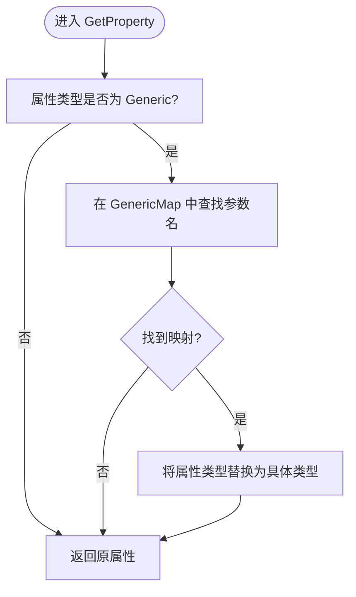
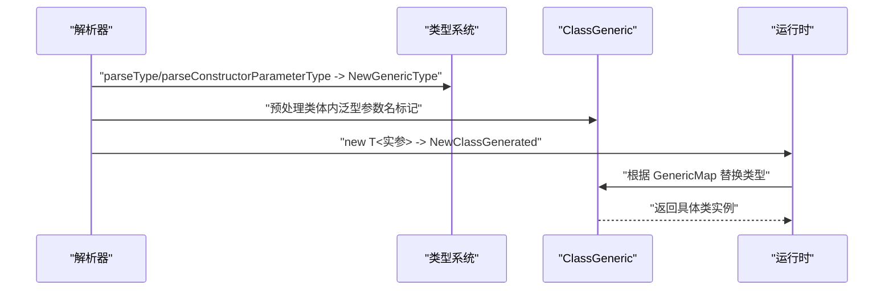
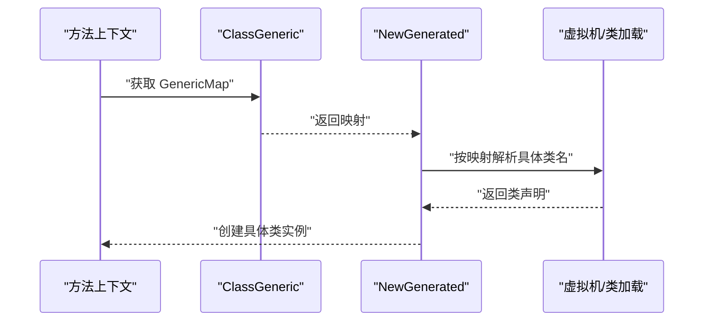
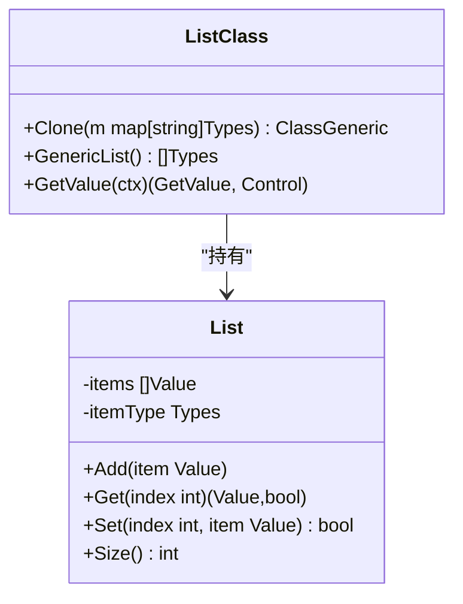
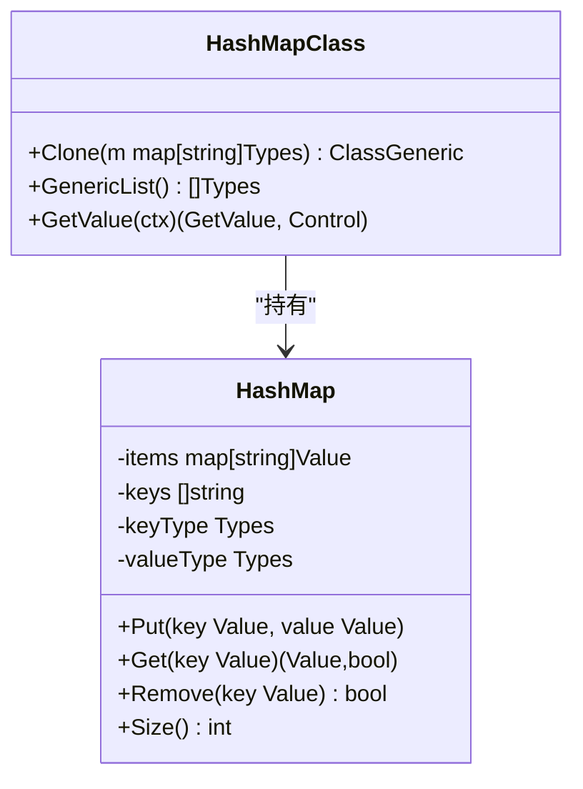
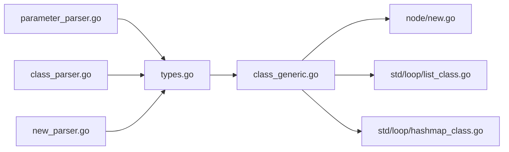

# 泛型类型

<cite>
**本文档引用的文件**
- [data/types.go](file://data/types.go)
- [data/type_generic.go](file://data/type_generic.go)
- [node/class_generic.go](file://node/class_generic.go)
- [parser/parameter_parser.go](file://parser/parameter_parser.go)
- [parser/class_parser.go](file://parser/class_parser.go)
- [parser/new_parser.go](file://parser/new_parser.go)
- [node/new.go](file://node/new.go)
- [std/loop/list_class.go](file://std/loop/list_class.go)
- [std/loop/hashmap_class.go](file://std/loop/hashmap_class.go)
</cite>

## 目录
1. [简介](#简介)
2. [项目结构](#项目结构)
3. [核心组件](#核心组件)
4. [架构总览](#架构总览)
5. [详细组件分析](#详细组件分析)
6. [依赖分析](#依赖分析)
7. [性能考虑](#性能考虑)
8. [故障排查指南](#故障排查指南)
9. [结论](#结论)
10. [附录](#附录)

## 简介
本文件系统性梳理仓库中的泛型类型体系，覆盖以下主题：
- 参数化类型系统与类型推导机制
- 泛型类、泛型函数与泛型接口的定义方式
- 类型参数的约束、边界与继承关系
- 类型擦除、类型检查与运行时类型验证
- 泛型编程的实际示例：容器类、算法函数与接口约束的使用场景

## 项目结构
围绕“泛型类型”的关键代码分布在以下模块：
- 类型系统与运行时检查：data/types.go、data/type_generic.go
- 泛型类与类成员替换：node/class_generic.go
- 语法解析与类型推导：parser/parameter_parser.go、parser/class_parser.go、parser/new_parser.go
- 运行时实例化与类型映射：node/new.go
- 标准库容器示例：std/loop/list_class.go、std/loop/hashmap_class.go

**图表来源**
- [parser/parameter_parser.go:1-353](file://parser/parameter_parser.go#L1-L353)
- [parser/class_parser.go:56-111](file://parser/class_parser.go#L56-L111)
- [parser/new_parser.go:166-227](file://parser/new_parser.go#L166-L227)
- [data/types.go:1-262](file://data/types.go#L1-L262)
- [data/type_generic.go:1-18](file://data/type_generic.go#L1-L18)
- [node/class_generic.go:1-67](file://node/class_generic.go#L1-L67)
- [node/new.go:312-347](file://node/new.go#L312-L347)
- [std/loop/list_class.go:143-222](file://std/loop/list_class.go#L143-L222)
- [std/loop/hashmap_class.go:149-231](file://std/loop/hashmap_class.go#L149-L231)

**章节来源**
- [data/types.go:1-262](file://data/types.go#L1-L262)
- [parser/parameter_parser.go:1-353](file://parser/parameter_parser.go#L1-L353)
- [parser/class_parser.go:56-111](file://parser/class_parser.go#L56-L111)
- [parser/new_parser.go:166-227](file://parser/new_parser.go#L166-L227)
- [node/class_generic.go:1-67](file://node/class_generic.go#L1-L67)
- [node/new.go:312-347](file://node/new.go#L312-L347)
- [std/loop/list_class.go:143-222](file://std/loop/list_class.go#L143-L222)
- [std/loop/hashmap_class.go:149-231](file://std/loop/hashmap_class.go#L149-L231)

## 核心组件
- 类型系统与工厂
  - Types 接口定义了运行时类型检查与字符串标识能力
  - NewBaseType/ NewGenericType/ NewNullableType/ NewUnionType 等工厂函数构建具体类型
  - Generic 结构体承载泛型参数名与子类型列表
- 泛型类与成员替换
  - ClassGeneric 维护泛型参数列表与类型映射，getProperty 时将 Generic 名称替换为具体类型
- 语法解析与类型推导
  - 参数解析支持联合类型、可空类型、命名参数等
  - 类解析支持泛型参数列表与类体内泛型参数名的标记
  - new 表达式支持传入泛型实参并生成相应类型
- 运行时实例化
  - NewGenerated/NewClassGenerated 在运行时根据上下文中的泛型映射创建具体类实例

**章节来源**
- [data/types.go:5-262](file://data/types.go#L5-L262)
- [data/type_generic.go:5-18](file://data/type_generic.go#L5-L18)
- [node/class_generic.go:5-67](file://node/class_generic.go#L5-L67)
- [parser/parameter_parser.go:231-353](file://parser/parameter_parser.go#L231-L353)
- [parser/class_parser.go:56-111](file://parser/class_parser.go#L56-L111)
- [parser/new_parser.go:166-227](file://parser/new_parser.go#L166-L227)
- [node/new.go:312-347](file://node/new.go#L312-L347)

## 架构总览
下图展示从“语法解析”到“运行时类型系统”再到“类与实例化”的整体流程。

**图表来源**
- [parser/parameter_parser.go:231-353](file://parser/parameter_parser.go#L231-L353)
- [parser/class_parser.go:56-111](file://parser/class_parser.go#L56-L111)
- [parser/new_parser.go:166-227](file://parser/new_parser.go#L166-L227)
- [data/types.go:142-219](file://data/types.go#L142-L219)
- [node/class_generic.go:13-36](file://node/class_generic.go#L13-L36)
- [node/new.go:317-341](file://node/new.go#L317-L341)

## 详细组件分析

### 类型系统与工厂
- Types 接口
  - Is(value) bool：运行时类型检查
  - String() string：类型标识（不含泛型信息）
- 基础类型与复合类型
  - NewBaseType：支持 int/string/bool/float/array/object/callable/self/static/null/false/closure 等
  - NewNullableType：可空包装
  - NewUnionType：联合类型（a|b|...）
  - NewMultipleReturnType：多返回值类型
  - NewGenericType：泛型类型（名称 + 子类型列表）
- Generic 类型
  - 字段：Name（参数名）、Types（子类型）
  - Is/String：当前实现为占位，具体校验逻辑需结合上下文完善

**图表来源**
- [data/types.go:5-262](file://data/types.go#L5-L262)
- [data/type_generic.go:5-18](file://data/type_generic.go#L5-L18)

**章节来源**
- [data/types.go:5-262](file://data/types.go#L5-L262)
- [data/type_generic.go:5-18](file://data/type_generic.go#L5-L18)

### 泛型类与成员替换
- ClassGeneric
  - 维护 Generic 参数列表与类型映射（GenericMap）
  - Clone：基于映射克隆出具体类实例
  - GetProperty：当属性类型为 Generic 时，依据映射替换为具体类型
- 运行时行为
  - 通过 GenericMap 将泛型参数名映射到具体 Types
  - 成员访问时即时替换，体现“编译期参数化、运行期替换”的特征

**图表来源**
- [node/class_generic.go:24-36](file://node/class_generic.go#L24-L36)

**章节来源**
- [node/class_generic.go:5-67](file://node/class_generic.go#L5-L67)

### 语法解析与类型推导
- 参数类型解析
  - 支持联合类型（a|b）、可空类型（?T）、命名参数（name:type）、引用参数（&$var）、可变参数（...$vars）
  - parseConstructorParameterType 与 parseType 负责联合/可空/泛型的解析
  - 当遇到 GENERIC_TYPE 令牌时，构造 Generic 类型
- 类泛型参数解析
  - 解析类定义中的泛型参数列表，收集参数名
  - 预处理阶段将类体内的泛型参数名标记为 GENERIC_TYPE，便于后续替换
- new 表达式泛型实参
  - 解析 new T<实参> 的实参列表，生成 NewClassGenerated 节点
  - 运行时根据上下文映射生成具体实例

**图表来源**
- [parser/parameter_parser.go:295-353](file://parser/parameter_parser.go#L295-L353)
- [parser/class_parser.go:56-111](file://parser/class_parser.go#L56-L111)
- [parser/new_parser.go:166-227](file://parser/new_parser.go#L166-L227)
- [node/class_generic.go:13-36](file://node/class_generic.go#L13-L36)

**章节来源**
- [parser/parameter_parser.go:231-353](file://parser/parameter_parser.go#L231-L353)
- [parser/class_parser.go:56-111](file://parser/class_parser.go#L56-L111)
- [parser/new_parser.go:166-227](file://parser/new_parser.go#L166-L227)

### 运行时实例化与类型映射
- NewGenerated/NewClassGenerated
  - 在方法上下文中，若存在 ClassGeneric 与泛型映射，则根据映射创建具体类实例
  - 若映射缺失或无效，返回错误控制流
- 类型擦除与验证
  - 类型系统以 Types 抽象存储，运行时通过 Is(value) 进行验证
  - 泛型参数在运行时被替换为具体类型，避免了传统 JVM/C# 的“类型擦除”复杂度

**图表来源**
- [node/new.go:317-341](file://node/new.go#L317-L341)

**章节来源**
- [node/new.go:312-347](file://node/new.go#L312-L347)

### 泛型编程示例

#### 容器类：List<T>
- 泛型参数
  - GenericList 返回 []Types{Generic{Name: "T"}}
- 运行时行为
  - Clone 时从映射取 T 作为元素类型，构造具体 List 实例
  - 所有方法共享同一实现，但操作的元素类型由 T 决定

**图表来源**
- [std/loop/list_class.go:143-222](file://std/loop/list_class.go#L143-L222)

**章节来源**
- [std/loop/list_class.go:143-222](file://std/loop/list_class.go#L143-L222)

#### 容器类：HashMap<K,V>
- 泛型参数
  - GenericList 返回 []Types{Generic{Name: "K"}, Generic{Name: "V"}}
- 运行时行为
  - Clone 时从映射取 K/V 分别作为键类型与值类型
  - 提供键值对增删查改与迭代器接口

**图表来源**
- [std/loop/hashmap_class.go:149-231](file://std/loop/hashmap_class.go#L149-L231)

**章节来源**
- [std/loop/hashmap_class.go:149-231](file://std/loop/hashmap_class.go#L149-L231)

## 依赖分析
- 解析层依赖类型系统：参数与类解析均通过 NewBaseType/NewGenericType 等工厂生成 Types
- 运行时依赖类与上下文：ClassGeneric 依赖 GenericMap；NewGenerated 依赖方法上下文中的 ClassGeneric
- 标准库容器依赖泛型类：ListClass/HashMapClass 通过 GenericList 暴露参数，Clone 时应用映射

**图表来源**
- [parser/parameter_parser.go:295-353](file://parser/parameter_parser.go#L295-L353)
- [parser/class_parser.go:56-111](file://parser/class_parser.go#L56-L111)
- [parser/new_parser.go:166-227](file://parser/new_parser.go#L166-L227)
- [data/types.go:142-219](file://data/types.go#L142-L219)
- [node/class_generic.go:13-36](file://node/class_generic.go#L13-L36)
- [node/new.go:317-341](file://node/new.go#L317-L341)
- [std/loop/list_class.go:143-222](file://std/loop/list_class.go#L143-L222)
- [std/loop/hashmap_class.go:149-231](file://std/loop/hashmap_class.go#L149-L231)

**章节来源**
- [data/types.go:142-219](file://data/types.go#L142-L219)
- [node/class_generic.go:13-36](file://node/class_generic.go#L13-L36)
- [node/new.go:317-341](file://node/new.go#L317-L341)
- [std/loop/list_class.go:143-222](file://std/loop/list_class.go#L143-L222)
- [std/loop/hashmap_class.go:149-231](file://std/loop/hashmap_class.go#L149-L231)

## 性能考虑
- 类型检查开销
  - UnionType/NullableType 的 Is 检查为线性遍历，复杂度 O(n)，其中 n 为联合/子类型数
  - 建议在高频路径中缓存类型检查结果或减少联合类型层级
- 泛型替换成本
  - ClassGeneric.GetProperty 在每次访问时进行替换，建议在热点路径中复用已替换后的属性引用
- 运行时映射
  - NewGenerated 依赖上下文中的 GenericMap，确保映射构建一次、多次使用

[本节为通用指导，无需列出具体文件来源]

## 故障排查指南
- 泛型参数未正确替换
  - 检查 ClassGeneric.Clone 是否传入正确的 GenericMap
  - 确认属性类型为 Generic 且映射键与参数名一致
- new 泛型实参解析失败
  - 确认 new 表达式中泛型实参列表合法，且 parseType 能正确识别
  - 检查 NewGenerated 的上下文是否存在有效的 ClassGeneric
- 类型检查总是返回 true/false
  - 检查 Generic.Is/String 的实现是否符合预期
  - 确认 NewGenericType 的 name 与 NewBaseType 的基础类型分支一致

**章节来源**
- [node/class_generic.go:24-36](file://node/class_generic.go#L24-L36)
- [parser/new_parser.go:166-227](file://parser/new_parser.go#L166-L227)
- [node/new.go:317-341](file://node/new.go#L317-L341)
- [data/type_generic.go:11-13](file://data/type_generic.go#L11-L13)

## 结论
本仓库实现了较为完整的泛型类型系统：
- 语法层支持参数类型、类泛型参数与 new 泛型实参
- 运行时通过 Types 抽象与 ClassGeneric 的映射替换实现类型参数化
- 标准库容器示例展示了 List<T> 与 HashMap<K,V> 的典型用法
- 类型擦除与运行时验证在现有实现中通过“运行期替换 + 类型检查”达成平衡

[本节为总结性内容，无需列出具体文件来源]

## 附录

### 类型参数的约束与边界
- 约束
  - 泛型参数名在类体内通过预处理标记为 GENERIC_TYPE，确保替换一致性
  - 参数解析支持联合/可空/命名/引用/可变参数等组合
- 边界
  - NewGenericType 对基础类型关键字进行分支处理，其余作为类名或泛型处理
  - Generic.Is/String 当前为占位，建议在后续版本完善

**章节来源**
- [parser/class_parser.go:56-111](file://parser/class_parser.go#L56-L111)
- [parser/parameter_parser.go:231-353](file://parser/parameter_parser.go#L231-L353)
- [data/types.go:200-219](file://data/types.go#L200-L219)
- [data/type_generic.go:11-17](file://data/type_generic.go#L11-L17)