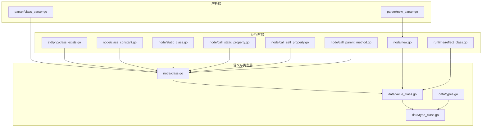
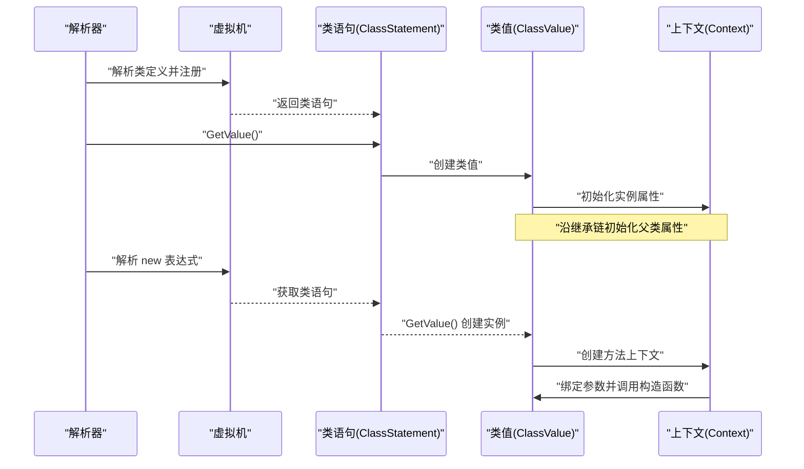
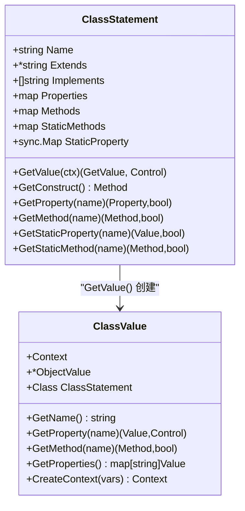
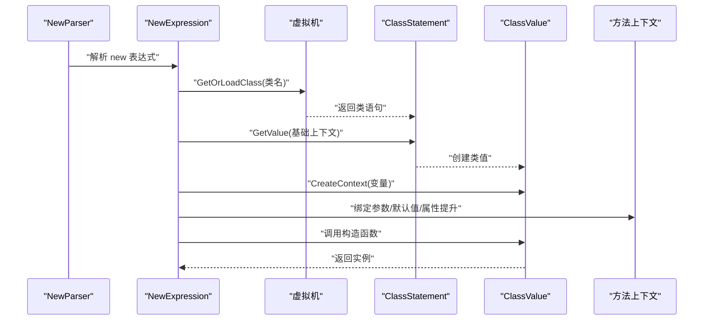
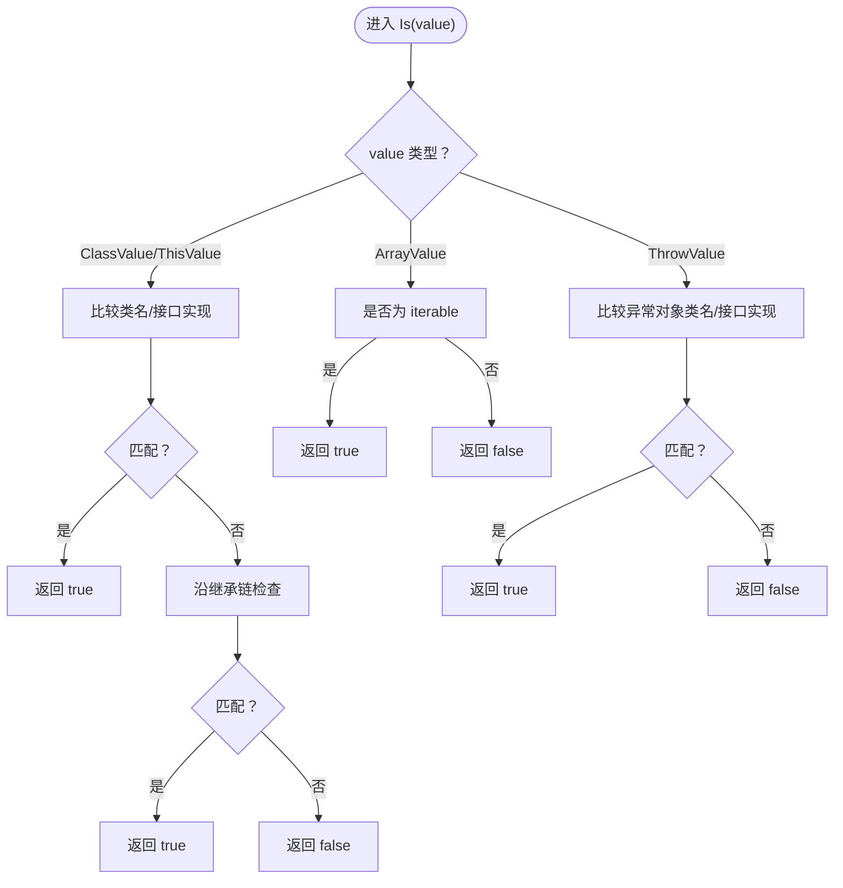
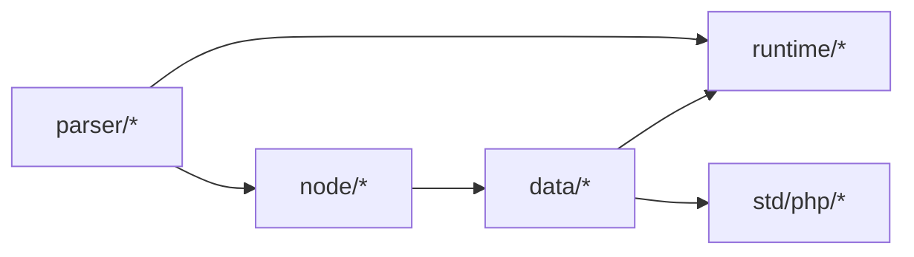

# 类类型

<cite>
**本文档引用的文件**
- [data/type_class.go](file://data/type_class.go)
- [data/value_class.go](file://data/value_class.go)
- [node/class.go](file://node/class.go)
- [parser/class_parser.go](file://parser/class_parser.go)
- [runtime/reflect_class.go](file://runtime/reflect_class.go)
- [node/new.go](file://node/new.go)
- [parser/new_parser.go](file://parser/new_parser.go)
- [data/types.go](file://data/types.go)
- [std/php/class_exists.go](file://std/php/class_exists.go)
- [node/class_constant.go](file://node/class_constant.go)
- [node/static_class.go](file://node/static_class.go)
- [node/call_static_property.go](file://node/call_static_property.go)
- [node/call_self_property.go](file://node/call_self_property.go)
- [node/call_parent_method.go](file://node/call_parent_method.go)
- [docs/classes.md](file://docs/classes.md)
- [tests/php/interface_inheritance_test.php](file://tests/php/interface_inheritance_test.php)
- [tests/basic/static_return_type.zy](file://tests/basic/static_return_type.zy)
</cite>

## 目录
1. [简介](#简介)
2. [项目结构](#项目结构)
3. [核心组件](#核心组件)
4. [架构总览](#架构总览)
5. [详细组件分析](#详细组件分析)
6. [依赖分析](#依赖分析)
7. [性能考虑](#性能考虑)
8. [故障排查指南](#故障排查指南)
9. [结论](#结论)
10. [附录](#附录)

## 简介
本文件围绕“类类型”这一核心主题，系统梳理并阐述该代码库中类类型的类型系统实现、类型检查机制、类定义与实例化流程、继承与接口实现关系、类值创建、方法调用机制、属性访问控制、构造函数调用、静态成员访问以及类常量使用。文档同时提供继承、多态与封装的实际应用示例，帮助读者从概念到实现全面掌握类类型在该引擎中的工作原理。

## 项目结构
类类型系统由以下层次构成：
- 词法与语法层：解析类定义、new 表达式、静态成员访问等。
- 语义与类型层：类语句、类值、类型系统（含 Class 类型）、运行时上下文。
- 运行时层：实例化、构造函数调用、方法与属性访问、反射桥接。

**图表来源**
- [parser/class_parser.go:1-1197](file://parser/class_parser.go#L1-L1197)
- [parser/new_parser.go:49-227](file://parser/new_parser.go#L49-L227)
- [node/class.go:1-528](file://node/class.go#L1-L528)
- [data/value_class.go:1-295](file://data/value_class.go#L1-L295)
- [data/type_class.go:1-146](file://data/type_class.go#L1-L146)
- [data/types.go:1-262](file://data/types.go#L1-L262)
- [runtime/reflect_class.go:1-524](file://runtime/reflect_class.go#L1-L524)
- [node/new.go:1-481](file://node/new.go#L1-L481)
- [std/php/class_exists.go:1-66](file://std/php/class_exists.go#L1-L66)
- [node/class_constant.go:1-83](file://node/class_constant.go#L1-L83)
- [node/static_class.go:1-42](file://node/static_class.go#L1-L42)
- [node/call_static_property.go:62-167](file://node/call_static_property.go#L62-L167)
- [node/call_self_property.go:54-146](file://node/call_self_property.go#L54-L146)
- [node/call_parent_method.go:54-97](file://node/call_parent_method.go#L54-L97)

**章节来源**
- [parser/class_parser.go:1-1197](file://parser/class_parser.go#L1-L1197)
- [node/class.go:1-528](file://node/class.go#L1-L528)
- [data/value_class.go:1-295](file://data/value_class.go#L1-L295)
- [data/type_class.go:1-146](file://data/type_class.go#L1-L146)
- [data/types.go:1-262](file://data/types.go#L1-L262)
- [runtime/reflect_class.go:1-524](file://runtime/reflect_class.go#L1-L524)
- [node/new.go:1-481](file://node/new.go#L1-L481)
- [std/php/class_exists.go:1-66](file://std/php/class_exists.go#L1-L66)
- [node/class_constant.go:1-83](file://node/class_constant.go#L1-L83)
- [node/static_class.go:1-42](file://node/static_class.go#L1-L42)
- [node/call_static_property.go:62-167](file://node/call_static_property.go#L62-L167)
- [node/call_self_property.go:54-146](file://node/call_self_property.go#L54-L146)
- [node/call_parent_method.go:54-97](file://node/call_parent_method.go#L54-L97)

## 核心组件
- 类语句（ClassStatement）：描述类的元数据（名称、继承、实现、属性、方法、静态成员等），并提供 GetValue 以创建类值。
- 类值（ClassValue）：承载实例属性、方法查找、属性/方法访问、上下文管理、序列化等能力。
- 类型系统（Types/Class 类型）：提供运行时类型检查（instanceof 语义），支持类与接口实现关系的判定。
- 解析器（ClassParser/NewParser）：负责解析类定义、new 表达式、静态成员访问等语法节点。
- 运行时（VM/Context）：提供类加载、上下文切换、参数绑定、方法调用栈等支撑。
- 反射桥接（ReflectClass）：将 Go 结构体映射为脚本类，实现方法与构造函数的反射调用。

**章节来源**
- [node/class.go:11-26](file://node/class.go#L11-L26)
- [data/value_class.go:21-25](file://data/value_class.go#L21-L25)
- [data/type_class.go:3-5](file://data/type_class.go#L3-L5)
- [parser/class_parser.go:28-343](file://parser/class_parser.go#L28-L343)
- [parser/new_parser.go:49-227](file://parser/new_parser.go#L49-L227)
- [runtime/reflect_class.go:12-39](file://runtime/reflect_class.go#L12-L39)

## 架构总览
类类型系统的关键交互如下：
- 类定义解析：ClassParser 生成 ClassStatement，包含类名、继承、实现、属性、方法、静态成员等。
- 类值创建：ClassStatement.GetValue 返回 ClassValue，初始化实例属性与父类属性。
- 实例化与构造函数：NewParser 生成 NewExpression，node/new.go 负责实例化与参数绑定、构造函数调用。
- 类型检查：data/type_class.go 提供 Class 类型的 Is 方法，支持类与接口实现关系的运行时判定。
- 静态成员与常量：支持 self::class、static::class、类常量、静态属性/方法访问。
- 反射集成：runtime/reflect_class.go 将 Go 类型映射为脚本类，支持反射方法与构造函数。

**图表来源**
- [parser/class_parser.go:28-84](file://parser/class_parser.go#L28-L84)
- [node/class.go:29-84](file://node/class.go#L29-L84)
- [node/new.go:11-75](file://node/new.go#L11-L75)

**章节来源**
- [parser/class_parser.go:28-84](file://parser/class_parser.go#L28-L84)
- [node/class.go:29-84](file://node/class.go#L29-L84)
- [node/new.go:11-75](file://node/new.go#L11-L75)

## 详细组件分析

### 类定义与语义（ClassStatement）
- 字段与职责
  - 名称、继承、实现接口、属性索引与映射、方法映射、静态属性/方法、注解等。
  - 提供 GetConstruct、GetProperty、GetMethod、GetStaticProperty、GetStaticMethod 等查询接口。
- 属性初始化
  - GetValue 中会遍历继承链，逐层初始化父类属性（仅初始化子类未覆盖的属性）。
- 构造函数处理
  - 若未显式定义构造函数，解析器会沿继承链查找父类构造函数并注入。

**图表来源**
- [node/class.go:12-26](file://node/class.go#L12-L26)
- [node/class.go:146-182](file://node/class.go#L146-L182)
- [data/value_class.go:21-25](file://data/value_class.go#L21-L25)

**章节来源**
- [node/class.go:12-26](file://node/class.go#L12-L26)
- [node/class.go:29-84](file://node/class.go#L29-L84)
- [node/class.go:146-182](file://node/class.go#L146-L182)

### 类值与实例化（ClassValue 与 NewExpression）
- 类值（ClassValue）
  - 维护实例属性、方法查找、属性/方法访问、上下文管理、序列化等。
  - GetProperty/GetMethod 支持沿继承链查找，处理属性默认值与父类属性合并。
- 实例化流程（NewExpression）
  - NewParser 解析 new 表达式，生成 NewExpression/NewSelfExpression/NewStaticExpression 等节点。
  - node/new.go 的 createInstanceAndCallConstructor 负责：
    - 获取类语句并创建类值；
    - 绑定参数（支持命名参数、引用参数、可变参数、属性提升等）；
    - 调用构造函数，处理未传参的默认值与属性提升赋值。

**图表来源**
- [parser/new_parser.go:49-227](file://parser/new_parser.go#L49-L227)
- [node/new.go:11-75](file://node/new.go#L11-L75)
- [node/new.go:192-292](file://node/new.go#L192-L292)

**章节来源**
- [parser/new_parser.go:49-227](file://parser/new_parser.go#L49-L227)
- [node/new.go:11-75](file://node/new.go#L11-L75)
- [node/new.go:192-292](file://node/new.go#L192-L292)

### 类型系统与类型检查（Class 类型）
- Class 类型
  - data/type_class.go 定义 Class{Name}，Is 方法支持：
    - 对象值（ClassValue/ThisValue）的类名匹配；
    - 接口实现关系（直接实现与接口继承链）；
    - 继承链上的类匹配（extendISClass）。
- 接口继承检查
  - interfaceExtends 通过 VM 中已注册接口进行继承链查找，支持多父接口。

**图表来源**
- [data/type_class.go:7-61](file://data/type_class.go#L7-L61)
- [data/type_class.go:67-84](file://data/type_class.go#L67-L84)
- [data/type_class.go:86-145](file://data/type_class.go#L86-L145)

**章节来源**
- [data/type_class.go:7-61](file://data/type_class.go#L7-L61)
- [data/type_class.go:67-84](file://data/type_class.go#L67-L84)
- [data/type_class.go:86-145](file://data/type_class.go#L86-L145)

### 继承关系与接口实现
- 继承链遍历
  - ClassStatement.GetValue 与 ClassValue.GetProperties/GetMethod 均沿 Extends 链向上查找。
- 接口实现
  - Class.Is 与 extendISClass 支持接口实现与接口继承链检查。
- 接口继承测试
  - tests/php/interface_inheritance_test.php 验证接口继承链上的 instanceof 与类型提示。

**章节来源**
- [node/class.go:29-84](file://node/class.go#L29-L84)
- [data/value_class.go:139-202](file://data/value_class.go#L139-L202)
- [data/type_class.go:7-61](file://data/type_class.go#L7-L61)
- [tests/php/interface_inheritance_test.php:1-54](file://tests/php/interface_inheritance_test.php#L1-L54)

### 方法调用机制与多态
- 方法查找
  - ClassValue.GetMethod 沿继承链查找，忽略私有方法。
- 返回类型检查
  - node/class.go 的 ClassMethod.Call 对返回类型进行检查，支持 __toString 自动转换为字符串。
- 静态返回类型（static）
  - data/types.go 的 StaticType 支持 PHP 8+ static 返回类型，实际检查在调用时进行。

**章节来源**
- [data/value_class.go:111-137](file://data/value_class.go#L111-L137)
- [node/class.go:379-440](file://node/class.go#L379-L440)
- [data/types.go:221-232](file://data/types.go#L221-L232)
- [tests/basic/static_return_type.zy:1-52](file://tests/basic/static_return_type.zy#L1-L52)

### 属性访问控制与封装
- 访问修饰符
  - ClassProperty.GetModifier 控制属性可见性；ClassValue.GetMethod 忽略私有方法。
- 动态属性
  - ClassValue.GetProperty 支持动态属性（通过 SetProperty 存入 ObjectValue.property）。
- 属性提升（PromotedParameter）
  - 构造函数参数可直接提升为属性，node/new.go 在构造函数调用后赋值给对象属性。

**章节来源**
- [node/class.go:290-293](file://node/class.go#L290-L293)
- [data/value_class.go:83-100](file://data/value_class.go#L83-L100)
- [node/new.go:254-282](file://node/new.go#L254-L282)

### 构造函数调用与默认值处理
- 参数绑定
  - node/new.go.paramSetValue 支持命名参数、引用参数、可变参数、属性提升、AST 参数等。
- 默认值与未传参处理
  - 未传参时触发参数默认值计算；属性提升参数在构造后赋值到对象属性。

**章节来源**
- [node/new.go:77-190](file://node/new.go#L77-L190)
- [node/new.go:237-282](file://node/new.go#L237-L282)

### 静态成员访问与类常量
- self::class 与 static::class
  - node/class_constant.go 与 node/static_class.go 提供类常量表达式支持。
- 静态属性/方法
  - node/call_static_property.go 与 node/call_self_property.go 支持静态属性的读取/设置与自引用静态属性。
- 类存在性检测
  - std/php/class_exists.go 提供 class_exists 函数，支持 autoload 控制。

**章节来源**
- [node/class_constant.go:23-82](file://node/class_constant.go#L23-L82)
- [node/static_class.go:23-41](file://node/static_class.go#L23-L41)
- [node/call_static_property.go:62-167](file://node/call_static_property.go#L62-L167)
- [node/call_self_property.go:54-146](file://node/call_self_property.go#L54-L146)
- [std/php/class_exists.go:19-66](file://std/php/class_exists.go#L19-L66)

### 反射桥接（Go 类型到脚本类）
- runtime/reflect_class.go
  - NewReflectClass 将 Go 结构体映射为脚本类，分析公开方法与字段，支持反射构造函数与方法调用。
  - 反射方法参数与返回值在脚本与 Go 之间进行类型转换。

**章节来源**
- [runtime/reflect_class.go:21-131](file://runtime/reflect_class.go#L21-L131)
- [runtime/reflect_class.go:230-274](file://runtime/reflect_class.go#L230-L274)
- [runtime/reflect_class.go:424-448](file://runtime/reflect_class.go#L424-L448)

### 示例与应用场景
- 基本类与继承
  - docs/classes.md 展示了基本类定义、访问修饰符、构造函数、继承与多接口实现。
- 静态方法继承调用
  - tests/basic/static_return_type.zy 验证 static 返回类型在继承链中的行为。
- 接口继承
  - tests/php/interface_inheritance_test.php 验证 instanceof 与类型提示在接口继承链上的正确性。

**章节来源**
- [docs/classes.md:1-453](file://docs/classes.md#L1-L453)
- [tests/basic/static_return_type.zy:1-52](file://tests/basic/static_return_type.zy#L1-L52)
- [tests/php/interface_inheritance_test.php:1-54](file://tests/php/interface_inheritance_test.php#L1-L54)

## 依赖分析
- 组件耦合
  - ClassStatement 与 ClassValue 强关联：前者提供语义，后者提供运行时行为。
  - NewParser 与 node/new.go 协作完成实例化与构造函数调用。
  - data/type_class.go 与 data/types.go 共同提供类型系统支撑。
- 外部依赖
  - VM 提供类/接口加载与命名空间解析。
  - 反射模块 runtime/reflect_class.go 与 Go 类型系统对接。

**图表来源**
- [parser/class_parser.go:1-1197](file://parser/class_parser.go#L1-L1197)
- [node/class.go:1-528](file://node/class.go#L1-L528)
- [data/value_class.go:1-295](file://data/value_class.go#L1-L295)
- [runtime/reflect_class.go:1-524](file://runtime/reflect_class.go#L1-L524)

**章节来源**
- [parser/class_parser.go:1-1197](file://parser/class_parser.go#L1-L1197)
- [node/class.go:1-528](file://node/class.go#L1-L528)
- [data/value_class.go:1-295](file://data/value_class.go#L1-L295)
- [runtime/reflect_class.go:1-524](file://runtime/reflect_class.go#L1-L524)

## 性能考虑
- 类与接口加载
  - 通过 VM 缓存类/接口，避免重复加载；接口继承链查找使用队列与去重避免重复访问。
- 实例属性合并
  - ClassValue.GetProperties 仅在必要时填充父类默认值，减少不必要的计算。
- 反射调用
  - 反射方法分析在类级别进行一次，实例共享被代理实例，降低反射开销。

[本节为通用指导，无需特定文件引用]

## 故障排查指南
- 构造函数参数错误
  - 未传参且无默认值：node/new.go 会在处理未传参时抛出错误。
- 父类方法不可见
  - 私有方法被忽略：ClassValue.GetMethod 会跳过私有方法。
- 接口继承链问题
  - data/type_class.go 的 interfaceExtends 与 extendISClass 会沿继承链查找，若类/接口未加载会尝试加载。
- 静态属性访问失败
  - node/call_static_property.go 与 node/call_self_property.go 提供延迟加载与错误提示。

**章节来源**
- [node/new.go:237-252](file://node/new.go#L237-L252)
- [data/value_class.go:111-137](file://data/value_class.go#L111-L137)
- [data/type_class.go:86-145](file://data/type_class.go#L86-L145)
- [node/call_static_property.go:107-140](file://node/call_static_property.go#L107-L140)
- [node/call_self_property.go:123-146](file://node/call_self_property.go#L123-L146)

## 结论
该类类型系统以 ClassStatement 为核心语义载体，配合 ClassValue 提供运行时行为；通过 data/type_class.go 与 data/types.go 实现类型检查与静态类型支持；解析器与运行时协同完成类定义、实例化、方法与属性访问、静态成员与常量处理，以及反射桥接。整体设计清晰、职责分明，既满足 PHP 语义要求，又具备良好的扩展性与可维护性。

[本节为总结性内容，无需特定文件引用]

## 附录
- 继承与多态示例参考：docs/classes.md
- 接口继承测试参考：tests/php/interface_inheritance_test.php
- static 返回类型测试参考：tests/basic/static_return_type.zy

**章节来源**
- [docs/classes.md:148-243](file://docs/classes.md#L148-L243)
- [tests/php/interface_inheritance_test.php:1-54](file://tests/php/interface_inheritance_test.php#L1-L54)
- [tests/basic/static_return_type.zy:1-52](file://tests/basic/static_return_type.zy#L1-L52)