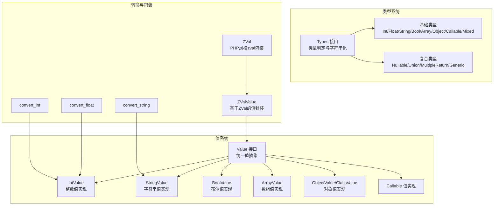
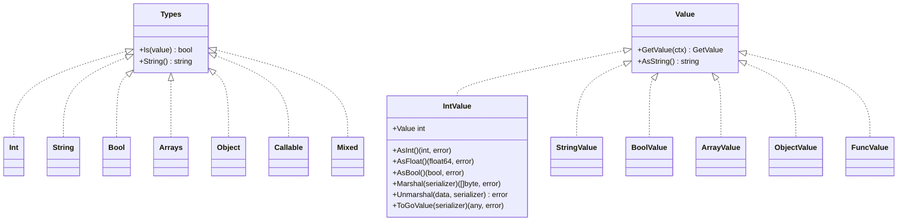
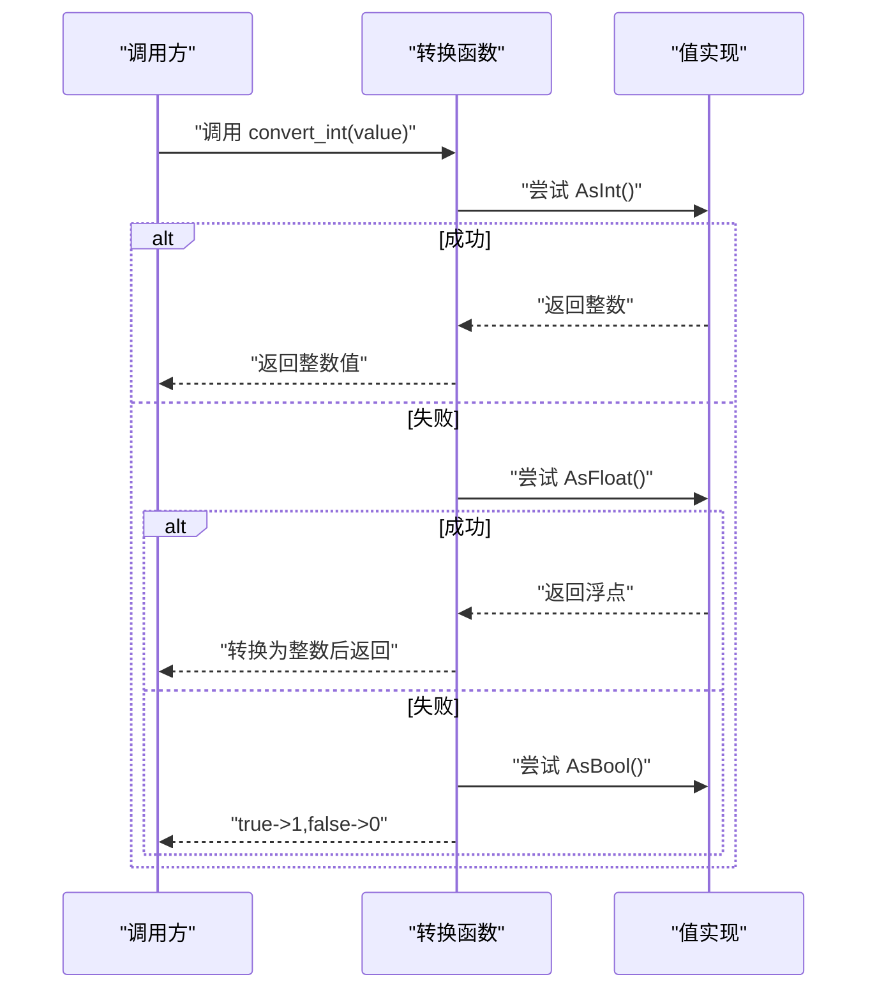
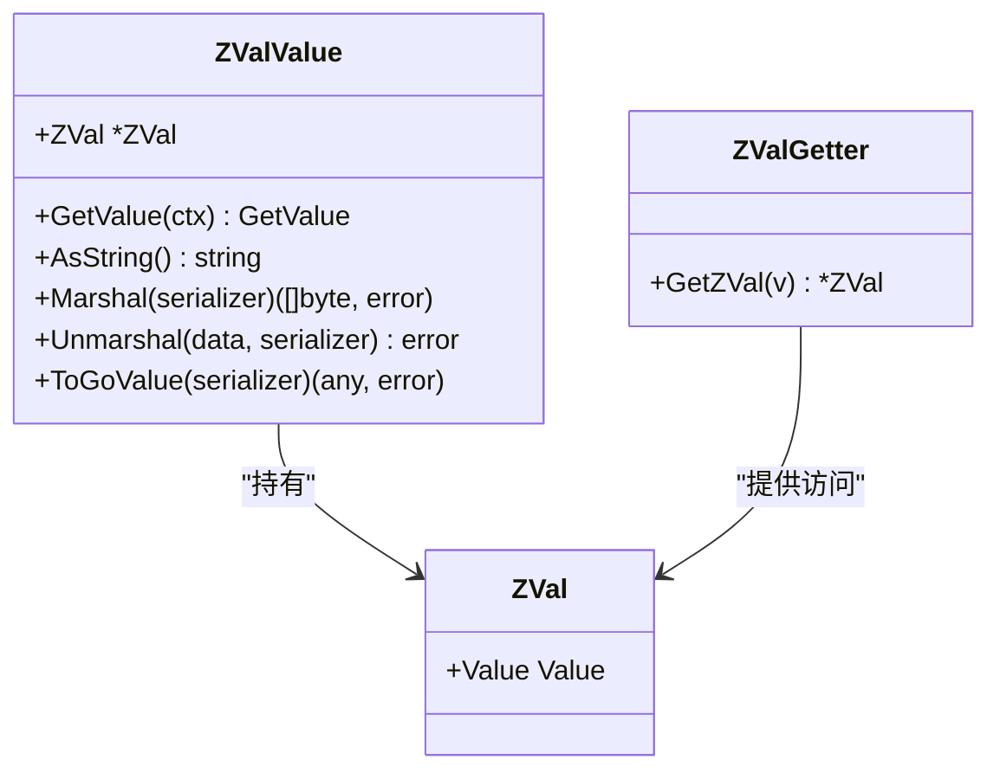
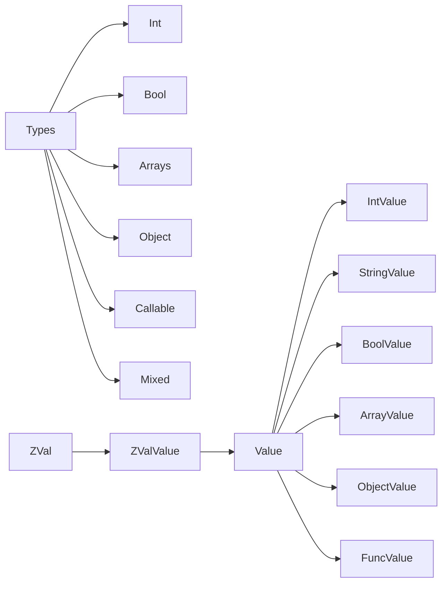

# 数据类型API

<cite>
**本文引用的文件**
- [data/types.go](file://data/types.go)
- [data/zval.go](file://data/zval.go)
- [data/value_zval.go](file://data/value_zval.go)
- [data/value.go](file://data/value.go)
- [data/value_int.go](file://data/value_int.go)
- [std/convert_int.go](file://std/convert_int.go)
- [std/convert_float.go](file://std/convert_float.go)
- [std/convert_string.go](file://std/convert_string.go)
- [data/type_int.go](file://data/type_int.go)
- [data/type_string.go](file://data/type_string.go)
- [data/type_bool.go](file://data/type_bool.go)
- [data/type_array.go](file://data/type_array.go)
- [data/type_object.go](file://data/type_object.go)
- [data/type_callable.go](file://data/type_callable.go)
- [data/type_mixed.go](file://data/type_mixed.go)
- [data/type_generic.go](file://data/type_generic.go)
</cite>

## 目录
1. [简介](#简介)
2. [项目结构](#项目结构)
3. [核心组件](#核心组件)
4. [架构总览](#架构总览)
5. [详细组件分析](#详细组件分析)
6. [依赖分析](#依赖分析)
7. [性能考虑](#性能考虑)
8. [故障排查指南](#故障排查指南)
9. [结论](#结论)
10. [附录](#附录)

## 简介
本文件为数据类型系统的完整API参考文档，覆盖基础类型（整数、浮点、字符串、布尔）、复合类型（数组、对象）、特殊类型（空、混合、可调用）以及类型转换与类型检查API，并说明值包装器ZVal的创建、访问与序列化能力。文档以循序渐进的方式组织，既适合快速查阅，也便于深入理解系统设计。

## 项目结构
数据类型系统主要由以下模块构成：
- 类型定义与类型检查：位于 data/types.go，包含基础类型、联合类型、可空类型、多返回值类型等。
- 值抽象与值实现：位于 data/value*.go，统一的 Value 接口及各具体值类型（如 IntValue、StringValue 等）。
- 类型描述：位于 data/type_*.go，对基础类型进行语义判定（Is）与字符串化（String）。
- 类型转换函数：位于 std/convert_*.go，提供 convert_int、convert_float、convert_string 等函数式API。
- 值包装器：位于 data/zval.go 与 data/value_zval.go，提供 ZVal 包装与序列化支持。

图表来源
- [data/types.go:5-262](file://data/types.go#L5-L262)
- [data/value.go:4-39](file://data/value.go#L4-L39)
- [data/value_int.go:7-52](file://data/value_int.go#L7-L52)
- [std/convert_int.go:10-65](file://std/convert_int.go#L10-L65)
- [std/convert_float.go:10-64](file://std/convert_float.go#L10-L64)
- [std/convert_string.go:8-39](file://std/convert_string.go#L8-L39)
- [data/zval.go:3-18](file://data/zval.go#L3-L18)
- [data/value_zval.go:5-41](file://data/value_zval.go#L5-L41)

章节来源
- [data/types.go:5-262](file://data/types.go#L5-L262)
- [data/value.go:4-39](file://data/value.go#L4-L39)
- [data/zval.go:3-18](file://data/zval.go#L3-L18)

## 核心组件
- 类型接口与工厂
  - Types 接口：定义 Is(value) 判定与 String() 字符串化。
  - NewBaseType：根据字符串类型名创建基础类型（如 int、string、bool、array、object、callable、null、mixed 等）。
  - NewNullableType、NewUnionType、NewMultipleReturnType：构建复合类型。
- 值接口与值实现
  - Value 接口：统一的值抽象，包含 GetValue 与 AsString。
  - 各具体值类型：IntValue、StringValue、BoolValue、ArrayValue、ObjectValue、ClassValue、FuncValue 等。
- 类型描述
  - 各基础类型（Int、String、Bool、Arrays、Object、Callable、Mixed）通过 Is 判断值是否属于该类型。
- 类型转换函数
  - convert_int、convert_float、convert_string：将任意值转换为目标类型，遵循从高精度到低精度的优先策略与回退逻辑。
- 值包装器
  - ZVal：模仿 PHP zval 的通用容器。
  - ZValValue：基于 ZVal 的值封装，支持序列化与反序列化。

章节来源
- [data/types.go:5-262](file://data/types.go#L5-L262)
- [data/value.go:4-39](file://data/value.go#L4-L39)
- [data/value_int.go:7-52](file://data/value_int.go#L7-L52)
- [std/convert_int.go:10-65](file://std/convert_int.go#L10-L65)
- [std/convert_float.go:10-64](file://std/convert_float.go#L10-L64)
- [std/convert_string.go:8-39](file://std/convert_string.go#L8-L39)
- [data/zval.go:3-18](file://data/zval.go#L3-L18)
- [data/value_zval.go:5-41](file://data/value_zval.go#L5-L41)

## 架构总览
类型系统采用“类型描述 + 值实现”的分层设计：
- 类型描述层：Types 实现类型判定与字符串化，用于静态类型检查与运行时类型匹配。
- 值实现层：Value 接口统一值的表达与转换，具体值类型实现 AsInt/AsFloat/AsBool/AsString 等能力。
- 转换层：std 下的 convert_* 函数以函数式方式执行类型转换，内部按优先级尝试不同转换路径。
- 包装层：ZVal 提供跨层的通用值容器，ZValValue 将其接入 Value 序列化体系。

图表来源
- [data/types.go:5-262](file://data/types.go#L5-L262)
- [data/value.go:4-39](file://data/value.go#L4-L39)
- [data/value_int.go:7-52](file://data/value_int.go#L7-L52)
- [data/type_int.go:3-17](file://data/type_int.go#L3-L17)
- [data/type_string.go:3-17](file://data/type_string.go#L3-L17)
- [data/type_bool.go:3-22](file://data/type_bool.go#L3-L22)
- [data/type_array.go:3-20](file://data/type_array.go#L3-L20)
- [data/type_object.go:3-19](file://data/type_object.go#L3-L19)
- [data/type_callable.go:3-19](file://data/type_callable.go#L3-L19)
- [data/type_mixed.go:3-12](file://data/type_mixed.go#L3-L12)

## 详细组件分析

### 基础类型 API
- 整数类型（Int）
  - 类型定义：类型描述 Int，Is 仅匹配 IntValue。
  - 方法：String 返回 "int"。
  - 使用示例：见 [data/type_int.go:6-16](file://data/type_int.go#L6-L16)。
- 字符串类型（String）
  - 类型定义：类型描述 String，Is 仅匹配 StringValue。
  - 方法：String 返回 "string"。
  - 使用示例：见 [data/type_string.go:6-16](file://data/type_string.go#L6-L16)。
- 布尔类型（Bool）
  - 类型定义：类型描述 Bool，Is 对 BoolValue 严格匹配；对实现 AsBool 的值视为可接受。
  - 方法：String 返回 "bool"。
  - 使用示例：见 [data/type_bool.go:6-17](file://data/type_bool.go#L6-L17)。
- 数组类型（Arrays）
  - 类型定义：类型描述 Arrays，Is 匹配 ArrayValue 或 ObjectValue（PHP关联数组在系统中可能以对象值表示）。
  - 方法：String 返回 "array"。
  - 使用示例：见 [data/type_array.go:6-15](file://data/type_array.go#L6-L15)。
- 对象类型（Object）
  - 类型定义：类型描述 Object，Is 匹配 ObjectValue 或 ClassValue。
  - 方法：String 返回 "object"。
  - 使用示例：见 [data/type_object.go:6-14](file://data/type_object.go#L6-L14)。
- 可调用类型（Callable）
  - 类型定义：类型描述 Callable，Is 匹配 FuncValue、ArrayValue 或实现 AsString 的值。
  - 方法：String 返回 "callable"。
  - 使用示例：见 [data/type_callable.go:6-14](file://data/type_callable.go#L6-L14)。
- 混合类型（Mixed）
  - 类型定义：类型描述 Mixed，Is 总是返回 true。
  - 方法：String 返回 "mixed"。
  - 使用示例：见 [data/type_mixed.go:5-11](file://data/type_mixed.go#L5-L11)。

章节来源
- [data/type_int.go:3-17](file://data/type_int.go#L3-L17)
- [data/type_string.go:3-17](file://data/type_string.go#L3-L17)
- [data/type_bool.go:3-22](file://data/type_bool.go#L3-L22)
- [data/type_array.go:3-20](file://data/type_array.go#L3-L20)
- [data/type_object.go:3-19](file://data/type_object.go#L3-L19)
- [data/type_callable.go:3-19](file://data/type_callable.go#L3-L19)
- [data/type_mixed.go:3-12](file://data/type_mixed.go#L3-L12)

### 类型工厂与复合类型
- NewBaseType
  - 支持基础类型："int"、"string"、"bool"、"array"、"object"、"callable"、"null"、"mixed"、"void" 等。
  - 支持联合类型："A|B|..."。
  - 支持可空类型："?T"。
  - 使用示例：见 [data/types.go:142-188](file://data/types.go#L142-L188)。
- NullableType
  - Is：接受 NullValue 或基础类型的值。
  - String：前缀加问号。
  - 使用示例：见 [data/types.go:39-49](file://data/types.go#L39-L49)。
- UnionType
  - Is：任一子类型匹配即为真。
  - String：用竖线连接子类型字符串。
  - 使用示例：见 [data/types.go:88-106](file://data/types.go#L88-L106)。
- MultipleReturnType
  - Is：要求值为数组且长度与子类型一致，对应位置逐项匹配。
  - String：逗号分隔子类型字符串。
  - 使用示例：见 [data/types.go:56-81](file://data/types.go#L56-L81)。
- Generic
  - 用于泛型场景，当前 Is 返回 true（占位实现），String 输出名称。
  - 使用示例：见 [data/type_generic.go:11-17](file://data/type_generic.go#L11-L17)。

章节来源
- [data/types.go:142-188](file://data/types.go#L142-L188)
- [data/types.go:39-49](file://data/types.go#L39-L49)
- [data/types.go:88-106](file://data/types.go#L88-L106)
- [data/types.go:56-81](file://data/types.go#L56-L81)
- [data/type_generic.go:11-17](file://data/type_generic.go#L11-L17)

### 类型转换API
- convert_int
  - 功能：将输入值转换为整数。
  - 优先级：AsInt > AsFloat > AsBool > AsString（尝试解析为整数）。
  - 回退：若无法解析，返回 0。
  - 参数：value（mixed）。
  - 返回：整数值。
  - 示例路径：见 [std/convert_int.go:14-50](file://std/convert_int.go#L14-L50)。
- convert_float
  - 功能：将输入值转换为浮点数。
  - 优先级：AsFloat > AsInt > AsBool > AsString（尝试解析为浮点）。
  - 回退：若无法解析，返回 0。
  - 参数：value（mixed）。
  - 返回：浮点数值。
  - 示例路径：见 [std/convert_float.go:14-49](file://std/convert_float.go#L14-L49)。
- convert_string
  - 功能：将输入值转换为字符串。
  - 优先级：若实现 AsString 则直接使用；否则使用值的 AsString。
  - 回退：空字符串。
  - 参数：value（mixed）。
  - 返回：字符串值。
  - 示例路径：见 [std/convert_string.go:12-24](file://std/convert_string.go#L12-L24)。

图表来源
- [std/convert_int.go:14-50](file://std/convert_int.go#L14-L50)
- [data/value_int.go:30-40](file://data/value_int.go#L30-L40)

章节来源
- [std/convert_int.go:14-50](file://std/convert_int.go#L14-L50)
- [std/convert_float.go:14-49](file://std/convert_float.go#L14-L49)
- [std/convert_string.go:12-24](file://std/convert_string.go#L12-L24)
- [data/value_int.go:30-40](file://data/value_int.go#L30-L40)

### 类型检查API
- is_array
  - 语义：判断值是否为数组或关联数组（在系统中可能映射为对象值）。
  - 实现：Arrays.Is。
  - 示例路径：见 [data/type_array.go:6-15](file://data/type_array.go#L6-L15)。
- is_object
  - 语义：判断值是否为对象或类实例。
  - 实现：Object.Is。
  - 示例路径：见 [data/type_object.go:6-14](file://data/type_object.go#L6-L14)。
- is_string
  - 语义：判断值是否为字符串。
  - 实现：String.Is。
  - 示例路径：见 [data/type_string.go:6-16](file://data/type_string.go#L6-L16)。
- is_bool/is_int/is_callable
  - 语义：分别判断布尔、整数、可调用。
  - 实现：Bool/Int/Callable.Is。
  - 示例路径：见 [data/type_bool.go:6-17](file://data/type_bool.go#L6-L17)、[data/type_int.go:6-16](file://data/type_int.go#L6-L16)、[data/type_callable.go:6-14](file://data/type_callable.go#L6-L14)。

章节来源
- [data/type_array.go:6-15](file://data/type_array.go#L6-L15)
- [data/type_object.go:6-14](file://data/type_object.go#L6-L14)
- [data/type_string.go:6-16](file://data/type_string.go#L6-L16)
- [data/type_bool.go:6-17](file://data/type_bool.go#L6-L17)
- [data/type_int.go:6-16](file://data/type_int.go#L6-L16)
- [data/type_callable.go:6-14](file://data/type_callable.go#L6-L14)

### 值包装器API（ZVal）
- ZVal 定义
  - 字段：Value（通用值）。
  - 构造：NewZVal(v)。
  - 访问：GetZVal(v)（ZValGetter 接口）。
  - 示例路径：见 [data/zval.go:4-17](file://data/zval.go#L4-L17)。
- ZValValue
  - 作用：将 ZVal 包装为 Value，支持序列化与反序列化。
  - 方法：GetValue、AsString、Marshal、Unmarshal、ToGoValue。
  - 示例路径：见 [data/value_zval.go:5-41](file://data/value_zval.go#L5-L41)。

图表来源
- [data/zval.go:4-17](file://data/zval.go#L4-L17)
- [data/value_zval.go:9-41](file://data/value_zval.go#L9-L41)

章节来源
- [data/zval.go:4-17](file://data/zval.go#L4-L17)
- [data/value_zval.go:5-41](file://data/value_zval.go#L5-L41)

### 值接口与序列化
- Value 接口
  - 统一抽象：GetValue、AsString。
  - 扩展：CallableValue（可调用）、GetProperty/SetProperty（属性访问）、GetMethod（方法查找）、GetSource（源信息）。
  - 示例路径：见 [data/value.go:4-39](file://data/value.go#L4-L39)。
- 值序列化
  - 各值类型实现 Marshal/Unmarshal/ToGoValue，ZValValue 在此基础上委托底层值实现。
  - 示例路径：见 [data/value_int.go:42-51](file://data/value_int.go#L42-L51)、[data/value_zval.go:21-40](file://data/value_zval.go#L21-L40)。

章节来源
- [data/value.go:4-39](file://data/value.go#L4-L39)
- [data/value_int.go:42-51](file://data/value_int.go#L42-L51)
- [data/value_zval.go:21-40](file://data/value_zval.go#L21-L40)

## 依赖分析
- 类型层依赖
  - Types 接口被各基础类型（Int/Bool/Arrays/Object/Callable/Mixed）实现。
  - NewBaseType 根据字符串解析生成具体类型，支持联合与可空组合。
- 值层依赖
  - Value 接口被各类值实现（IntValue/...）实现。
  - 转换函数依赖值实现的 AsXxx 接口完成转换。
- 包装层依赖
  - ZValValue 依赖底层值实现的序列化接口。

图表来源
- [data/types.go:5-262](file://data/types.go#L5-L262)
- [data/value.go:4-39](file://data/value.go#L4-L39)
- [data/zval.go:4-17](file://data/zval.go#L4-L17)
- [data/value_zval.go:9-41](file://data/value_zval.go#L9-L41)

章节来源
- [data/types.go:5-262](file://data/types.go#L5-L262)
- [data/value.go:4-39](file://data/value.go#L4-L39)
- [data/zval.go:4-17](file://data/zval.go#L4-L17)
- [data/value_zval.go:9-41](file://data/value_zval.go#L9-L41)

## 性能考虑
- 类型判定
  - 基础类型（Int/Bool/Arrays/Object/Callable/Mixed）的 Is 通常为 O(1)，通过类型断言快速判断。
  - 联合类型（UnionType）的 Is 需遍历子类型，复杂度 O(n)。
  - 可空类型（NullableType）先检查 NullValue 再委托基础类型，整体 O(1)。
- 转换函数
  - 优先尝试 AsXxx 接口，避免字符串解析开销；字符串解析失败时回退到 0/空字符串，保证稳定性。
- 序列化
  - ZValValue 将序列化委托到底层值实现，避免重复序列化逻辑，减少内存与CPU消耗。

## 故障排查指南
- 类型转换失败
  - 现象：convert_int/convert_float 返回 0 或 0.0。
  - 排查：确认输入值是否实现 AsInt/AsFloat/AsString；若未实现，检查是否可通过 AsString 解析。
  - 参考：见 [std/convert_int.go:20-50](file://std/convert_int.go#L20-L50)、[std/convert_float.go:20-49](file://std/convert_float.go#L20-L49)。
- 类型判定异常
  - 现象：is_array/is_object 判定不符合预期。
  - 排查：确认值是否为 ArrayValue/ObjectValue/ClassValue；PHP关联数组可能映射为对象值。
  - 参考：见 [data/type_array.go:6-15](file://data/type_array.go#L6-L15)、[data/type_object.go:6-14](file://data/type_object.go#L6-L14)。
- ZVal 序列化失败
  - 现象：Marshal/Unmarshal 报错“cannot marshal/unmarshal ZValValue”。
  - 排查：确认 ZVal.Value 是否实现 ValueSerializer 接口。
  - 参考：见 [data/value_zval.go:21-40](file://data/value_zval.go#L21-L40)。

章节来源
- [std/convert_int.go:20-50](file://std/convert_int.go#L20-L50)
- [std/convert_float.go:20-49](file://std/convert_float.go#L20-L49)
- [data/type_array.go:6-15](file://data/type_array.go#L6-L15)
- [data/type_object.go:6-14](file://data/type_object.go#L6-L14)
- [data/value_zval.go:21-40](file://data/value_zval.go#L21-L40)

## 结论
本数据类型系统通过清晰的类型描述与值实现分离，提供了稳定、可扩展的类型判定与转换能力。配合 ZVal 包装器与序列化机制，满足跨语言与跨层交互需求。建议在业务中优先使用类型检查与转换函数，确保类型安全与性能平衡。

## 附录
- 常用API速查
  - 类型定义：Int/String/Bool/Arrays/Object/Callable/Mixed。
  - 类型工厂：NewBaseType/NewNullableType/NewUnionType/NewMultipleReturnType。
  - 转换函数：convert_int、convert_float、convert_string。
  - 类型检查：is_array、is_object、is_string、is_bool、is_int、is_callable。
  - 值包装：ZVal、ZValValue。
- 示例路径
  - 类型定义与工厂：见 [data/types.go:142-188](file://data/types.go#L142-L188)。
  - 转换函数实现：见 [std/convert_int.go:14-50](file://std/convert_int.go#L14-L50)、[std/convert_float.go:14-49](file://std/convert_float.go#L14-L49)、[std/convert_string.go:12-24](file://std/convert_string.go#L12-L24)。
  - 值接口与序列化：见 [data/value.go:4-39](file://data/value.go#L4-L39)、[data/value_int.go:42-51](file://data/value_int.go#L42-L51)、[data/value_zval.go:21-40](file://data/value_zval.go#L21-L40)。