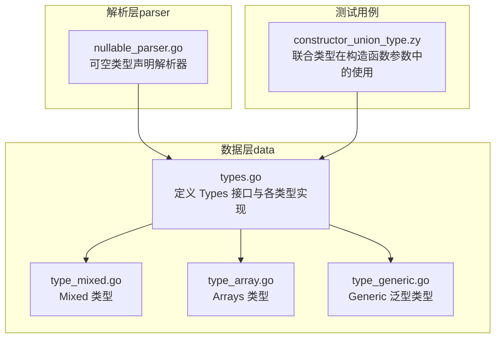
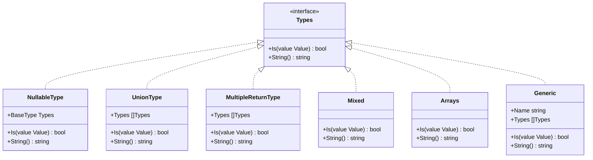
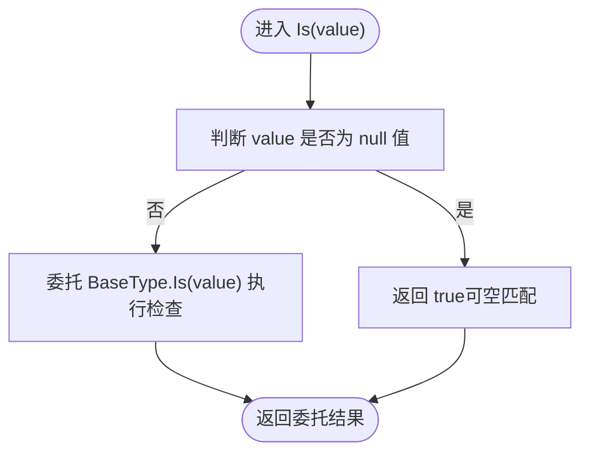
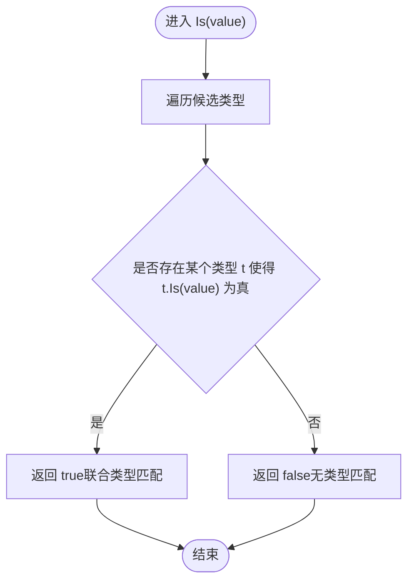
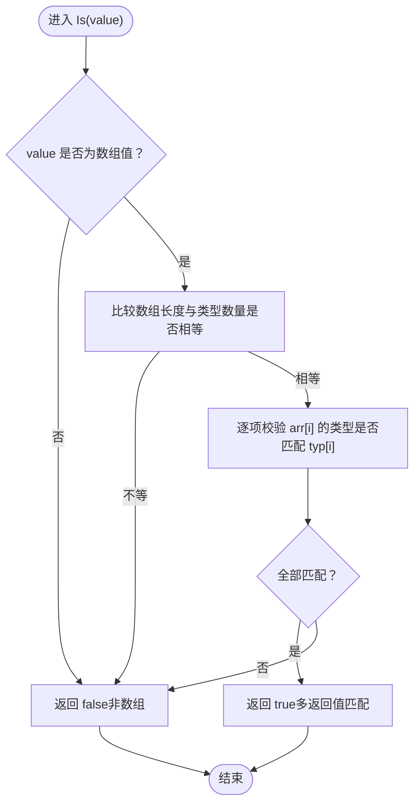
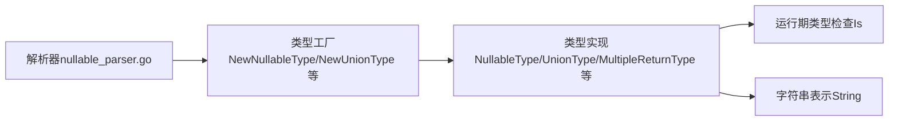

# 类型修饰符

<cite>
**本文引用的文件**
- [types.go](file://data/types.go)
- [nullable_parser.go](file://parser/nullable_parser.go)
- [constructor_union_type.zy](file://tests/basic/constructor_union_type.zy)
- [type_mixed.go](file://data/type_mixed.go)
- [type_array.go](file://data/type_array.go)
- [type_generic.go](file://data/type_generic.go)
</cite>

## 目录
1. [引言](#引言)
2. [项目结构](#项目结构)
3. [核心组件](#核心组件)
4. [架构总览](#架构总览)
5. [详细组件分析](#详细组件分析)
6. [依赖关系分析](#依赖关系分析)
7. [性能考量](#性能考量)
8. [故障排查指南](#故障排查指南)
9. [结论](#结论)
10. [附录](#附录)

## 引言
本文件聚焦于类型修饰符的详细API文档，涵盖以下内容：
- 可空类型（NullableType）：支持问号前缀语法的类型修饰；构造函数与类型检查逻辑；字符串表示。
- 联合类型（UnionType）：支持管道分隔的多类型组合；构造函数与类型检查逻辑；字符串表示。
- 多返回值类型（MultipleReturnType）：以数组形式表达函数/方法的多返回值；构造函数与类型检查逻辑；字符串表示。
同时给出组合使用的示例与注意事项，并通过测试用例路径展示在构造函数参数、接口返回类型等场景中的应用。

## 项目结构
类型修饰符的核心实现位于数据层（data），解析器层（parser）包含可空类型声明的解析流程；测试用例展示了联合类型在构造函数参数中的使用。

图表来源
- [types.go:1-262](file://data/types.go#L1-L262)
- [nullable_parser.go:1-58](file://parser/nullable_parser.go#L1-L58)
- [type_mixed.go:1-12](file://data/type_mixed.go#L1-L12)
- [type_array.go:1-20](file://data/type_array.go#L1-L20)
- [type_generic.go:1-18](file://data/type_generic.go#L1-L18)
- [constructor_union_type.zy:1-21](file://tests/basic/constructor_union_type.zy#L1-L21)

章节来源
- [types.go:1-262](file://data/types.go#L1-L262)
- [nullable_parser.go:1-58](file://parser/nullable_parser.go#L1-L58)
- [constructor_union_type.zy:1-21](file://tests/basic/constructor_union_type.zy#L1-L21)

## 核心组件
本节概述三类类型修饰符的职责与行为：
- 可空类型（NullableType）：在基础类型基础上允许值为 null。
- 联合类型（UnionType）：在多个候选类型中任选其一。
- 多返回值类型（MultipleReturnType）：对函数/方法返回值的元组式约束，要求返回数组且长度与元素类型一一对应。

章节来源
- [types.go:34-106](file://data/types.go#L34-L106)

## 架构总览
类型系统采用统一接口 Types，所有具体类型实现 Is 与 String 方法。解析器负责从源码中识别并构建相应类型对象，随后在运行期用于值的类型检查与描述。

图表来源
- [types.go:5-106](file://data/types.go#L5-L106)
- [type_mixed.go:3-11](file://data/type_mixed.go#L3-L11)
- [type_array.go:3-19](file://data/type_array.go#L3-L19)
- [type_generic.go:6-17](file://data/type_generic.go#L6-L17)

## 详细组件分析

### 可空类型（NullableType）
- 定义与用途
  - 在基础类型之上允许值为 null。
- 构造函数
  - 通过工厂函数创建，接收一个基础类型对象。
- 类型检查逻辑
  - 若值为 null，则直接匹配成功；否则委托给基础类型进行检查。
- 字符串表示
  - 以“?”前缀拼接基础类型的字符串表示。
- 解析器行为
  - 解析器读取“?”后跟随的类型标识符与变量名，构造可空类型并注册到作用域，随后继续解析变量后缀表达式。

图表来源
- [types.go:39-45](file://data/types.go#L39-L45)

章节来源
- [types.go:34-49](file://data/types.go#L34-L49)
- [nullable_parser.go:24-57](file://parser/nullable_parser.go#L24-L57)

### 联合类型（UnionType）
- 定义与用途
  - 将多个候选类型以“|”连接，表示值属于其中任意一种。
- 构造函数
  - 工厂函数接收候选类型切片，内部封装为联合类型对象。
- 类型检查逻辑
  - 遍历候选类型，只要有一个匹配即返回成功。
- 字符串表示
  - 以“|”连接各候选类型的字符串表示。

图表来源
- [types.go:88-95](file://data/types.go#L88-L95)

章节来源
- [types.go:83-106](file://data/types.go#L83-L106)

### 多返回值类型（MultipleReturnType）
- 定义与用途
  - 以数组形式表达函数/方法的多返回值，要求返回值为数组且长度与元素类型一一对应。
- 构造函数
  - 工厂函数接收类型切片，封装为多返回值类型对象。
- 类型检查逻辑
  - 若值为数组，则检查数组长度与类型数量一致，并逐项校验元素类型。
- 字符串表示
  - 以逗号与空格连接各元素类型的字符串表示。

图表来源
- [types.go:56-70](file://data/types.go#L56-L70)

章节来源
- [types.go:51-81](file://data/types.go#L51-L81)

### 组合使用示例与注意事项
- 示例路径
  - 联合类型在构造函数参数中的使用：[constructor_union_type.zy:1-21](file://tests/basic/constructor_union_type.zy#L1-L21)
- 组合要点
  - 可空类型与联合类型可叠加使用，例如“T|null”或“A|B|null”，由基础类型解析器在字符串层面识别“?”与“|”并构造相应类型对象。
  - 多返回值类型通常用于函数/方法返回值的元组式约束，需确保返回数组的长度与类型切片一致。
- 注意事项
  - 联合类型检查顺序可能影响性能，建议将更常见的类型置于前面。
  - 多返回值类型检查会遍历数组元素，注意避免过长的返回元组导致额外开销。
  - 可空类型与联合类型在解析阶段由解析器处理，确保“?”与“|”语法正确出现。

章节来源
- [types.go:172-187](file://data/types.go#L172-L187)
- [constructor_union_type.zy:1-21](file://tests/basic/constructor_union_type.zy#L1-L21)

## 依赖关系分析
- 类型接口与实现
  - 所有具体类型均实现 Types 接口的 Is 与 String 方法，保证统一的行为契约。
- 基础类型与修饰符的关系
  - 可空类型、联合类型、多返回值类型均以基础类型（如 Mixed、Arrays、Generic 等）为基础单元。
- 解析器与类型系统的交互
  - 解析器在词法/语法阶段识别类型声明，调用类型工厂函数生成类型对象，并将其注入作用域或参数签名中。

图表来源
- [nullable_parser.go:47](file://parser/nullable_parser.go#L47)
- [types.go:191-198](file://data/types.go#L191-L198)
- [types.go:108-110](file://data/types.go#L108-L110)

章节来源
- [types.go:191-198](file://data/types.go#L191-L198)
- [nullable_parser.go:47](file://parser/nullable_parser.go#L47)

## 性能考量
- 联合类型检查
  - 由于需要逐一尝试候选类型，建议将高概率匹配的类型前置，减少平均检查次数。
- 多返回值类型检查
  - 数组长度与元素个数成正比，应避免过长的返回元组；若频繁使用，可在上层缓存类型信息以减少重复计算。
- 可空类型检查
  - 优先判断 null 值可快速短路，降低对基础类型的检查成本。

## 故障排查指南
- 可空类型解析错误
  - 当“?”后缺少合法类型标识符或变量名缺失时，解析器会抛出错误并终止当前节点处理。
- 联合类型匹配失败
  - 若值不属于任何候选类型，Is 返回 false；请核对候选类型集合与值的实际类型。
- 多返回值类型匹配失败
  - 若返回值不是数组、长度不一致或元素类型不匹配，Is 返回 false；请核对返回数组结构与类型切片。

章节来源
- [nullable_parser.go:31-41](file://parser/nullable_parser.go#L31-L41)
- [types.go:56-70](file://data/types.go#L56-L70)
- [types.go:88-95](file://data/types.go#L88-L95)

## 结论
类型修饰符为 Origami 的类型系统提供了灵活而强大的表达能力：
- 可空类型通过“?”前缀扩展基础类型，满足 PHP 中可空参数/属性的常见需求；
- 联合类型通过“|”连接多种候选类型，覆盖复杂签名场景；
- 多返回值类型通过数组形式约束函数/方法的返回结构，便于与 PHP 的多返回值特性对接。
结合解析器与运行期检查，三者共同构成完整的类型修饰符体系，并可通过测试用例验证其在真实场景中的行为。

## 附录
- 相关类型实现参考
  - Mixed 类型：[type_mixed.go:1-12](file://data/type_mixed.go#L1-L12)
  - Arrays 类型：[type_array.go:1-20](file://data/type_array.go#L1-L20)
  - Generic 泛型类型：[type_generic.go:1-18](file://data/type_generic.go#L1-L18)
- 测试用例参考
  - 联合类型在构造函数参数中的使用：[constructor_union_type.zy:1-21](file://tests/basic/constructor_union_type.zy#L1-L21)