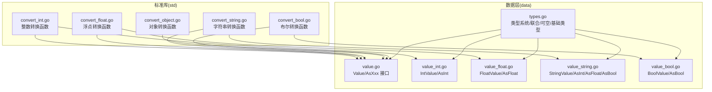
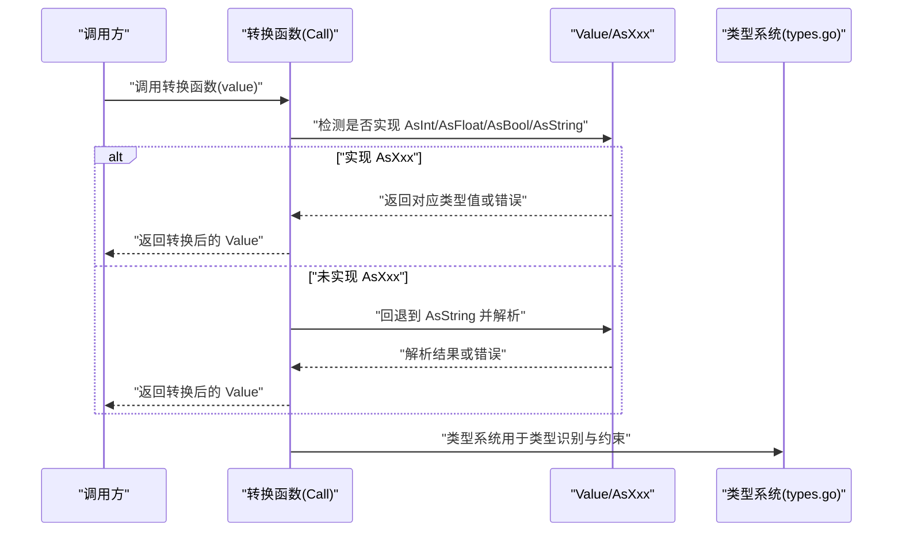
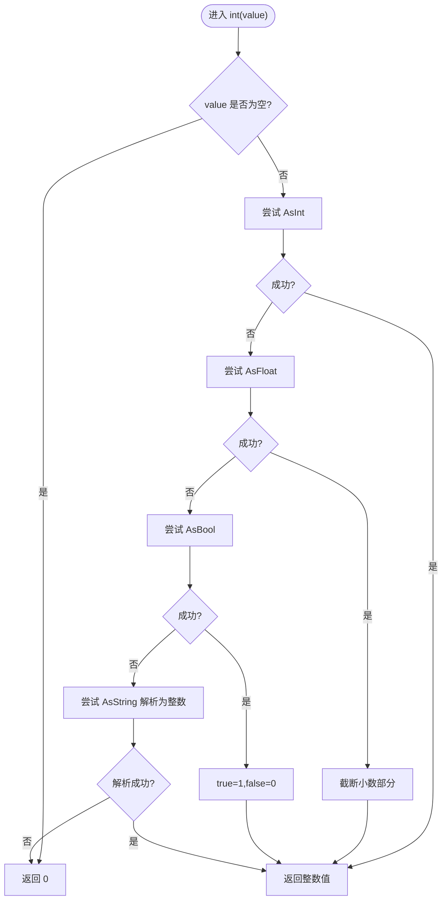
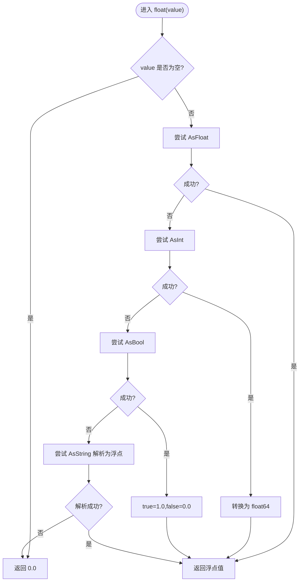
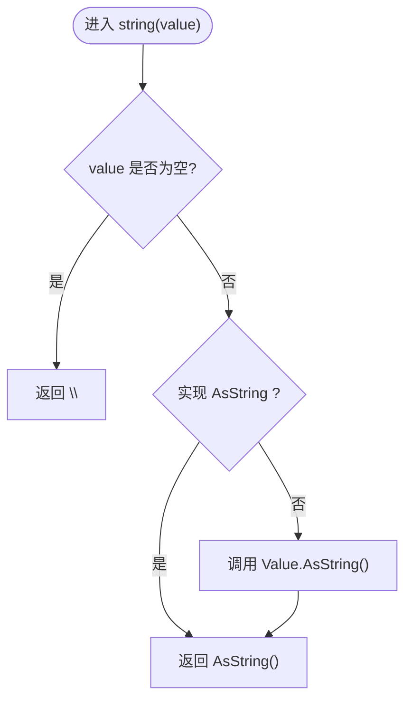
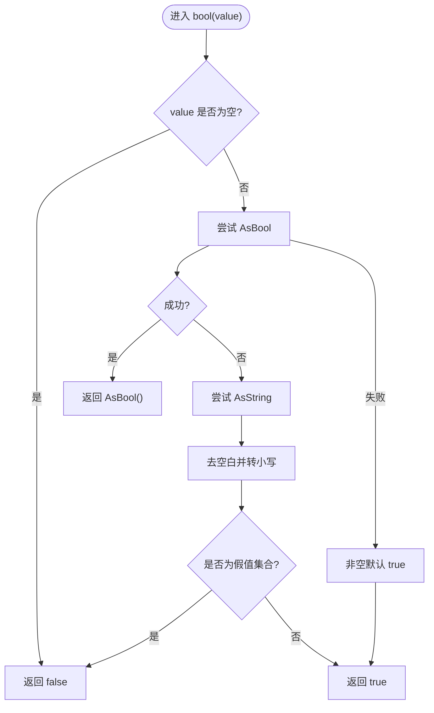
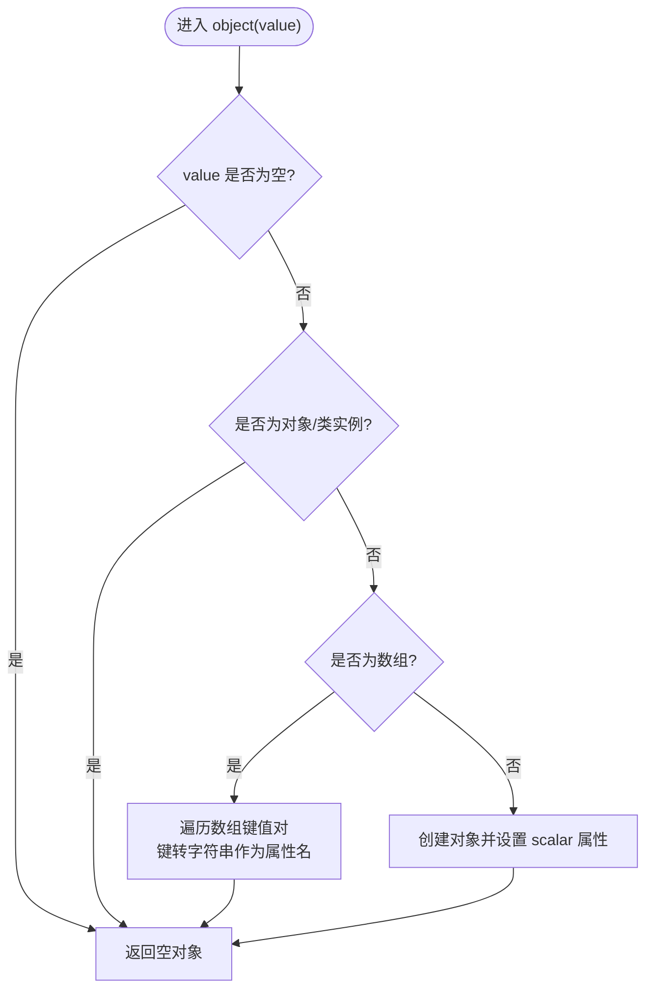
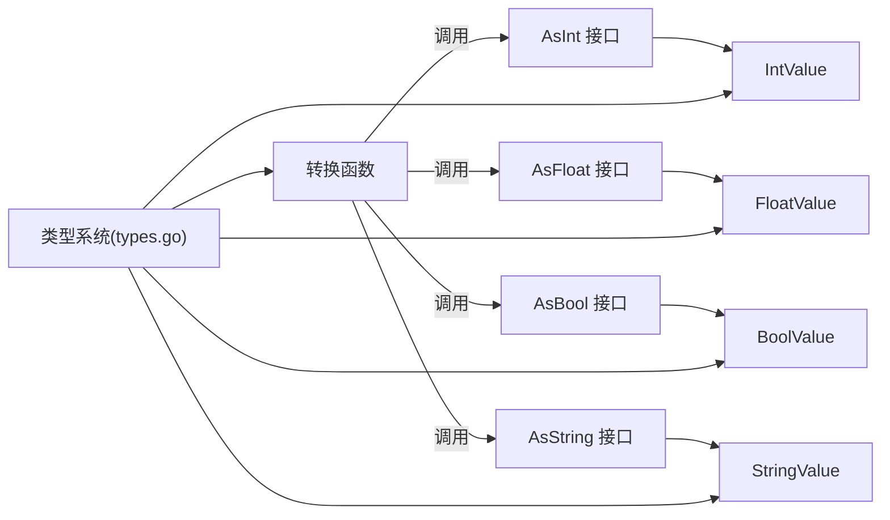

# 类型转换API

<cite>
**本文引用的文件**
- [convert_int.go](file://std/convert_int.go)
- [convert_float.go](file://std/convert_float.go)
- [convert_string.go](file://std/convert_string.go)
- [convert_bool.go](file://std/convert_bool.go)
- [convert_object.go](file://std/convert_object.go)
- [types.go](file://data/types.go)
- [value.go](file://data/value.go)
- [value_int.go](file://data/value_int.go)
- [value_float.go](file://data/value_float.go)
- [value_string.go](file://data/value_string.go)
- [value_bool.go](file://data/value_bool.go)
</cite>

## 目录
1. [简介](#简介)
2. [项目结构](#项目结构)
3. [核心组件](#核心组件)
4. [架构总览](#架构总览)
5. [详细组件分析](#详细组件分析)
6. [依赖分析](#依赖分析)
7. [性能考虑](#性能考虑)
8. [故障排查指南](#故障排查指南)
9. [结论](#结论)
10. [附录](#附录)

## 简介
本文件为类型转换API的完整参考文档，覆盖数值、字符串、布尔、对象等类型的转换函数，以及隐式与显式类型转换的差异与规则。文档基于仓库中的标准库实现与数据模型，系统性说明各转换函数的参数、返回值、转换策略与边界行为，并提供最佳实践与常见陷阱提示。

## 项目结构
类型转换API位于标准库模块 std 下，分别实现整数、浮点、字符串、布尔、对象五类转换函数；其底层类型系统与值类型均位于 data 模块中，统一通过 AsXxx 接口与具体 Value 实现协作完成转换。

图表来源
- [convert_int.go:1-65](file://std/convert_int.go#L1-L65)
- [convert_float.go:1-64](file://std/convert_float.go#L1-L64)
- [convert_string.go:1-39](file://std/convert_string.go#L1-L39)
- [convert_bool.go:1-52](file://std/convert_bool.go#L1-L52)
- [convert_object.go:1-67](file://std/convert_object.go#L1-L67)
- [types.go:1-262](file://data/types.go#L1-L262)
- [value.go:1-39](file://data/value.go#L1-L39)
- [value_int.go:1-52](file://data/value_int.go#L1-L52)
- [value_float.go:1-63](file://data/value_float.go#L1-L63)
- [value_string.go:1-86](file://data/value_string.go#L1-L86)
- [value_bool.go:1-47](file://data/value_bool.go#L1-L47)

章节来源
- [convert_int.go:1-65](file://std/convert_int.go#L1-L65)
- [convert_float.go:1-64](file://std/convert_float.go#L1-L64)
- [convert_string.go:1-39](file://std/convert_string.go#L1-L39)
- [convert_bool.go:1-52](file://std/convert_bool.go#L1-L52)
- [convert_object.go:1-67](file://std/convert_object.go#L1-L67)
- [types.go:1-262](file://data/types.go#L1-L262)
- [value.go:1-39](file://data/value.go#L1-L39)
- [value_int.go:1-52](file://data/value_int.go#L1-L52)
- [value_float.go:1-63](file://data/value_float.go#L1-L63)
- [value_string.go:1-86](file://data/value_string.go#L1-L86)
- [value_bool.go:1-47](file://data/value_bool.go#L1-L47)

## 核心组件
- 整数转换函数：将输入转换为整数，优先尝试 AsInt/AsFloat/AsBool/AsString，最后回退到字符串解析。
- 浮点转换函数：将输入转换为浮点数，优先尝试 AsFloat/AsInt/AsBool/AsString，最后回退到字符串解析。
- 字符串转换函数：将输入转换为字符串，若实现 AsString 则直接使用，否则通过 Value 的 AsString 统一转换。
- 布尔转换函数：将输入转换为布尔，优先尝试 AsBool/AsString，空字符串与特定“假”字符串视为 false，其余非空视为 true。
- 对象转换函数：将输入转换为对象，数组转为对象（键名作为属性名，数值键转为字符串），对象/类实例直接返回，其他标量包装为带 scalar 属性的对象。

章节来源
- [convert_int.go:14-50](file://std/convert_int.go#L14-L50)
- [convert_float.go:14-49](file://std/convert_float.go#L14-L49)
- [convert_string.go:12-24](file://std/convert_string.go#L12-L24)
- [convert_bool.go:14-37](file://std/convert_bool.go#L14-L37)
- [convert_object.go:21-52](file://std/convert_object.go#L21-L52)

## 架构总览
类型转换函数通过上下文获取第一个参数，依据参数实现的 AsXxx 接口顺序尝试转换，必要时回退到字符串解析；最终统一以对应 Value 类型封装返回。类型系统与值类型在 data 层提供统一的类型识别与值能力。

图表来源
- [convert_int.go:14-50](file://std/convert_int.go#L14-L50)
- [convert_float.go:14-49](file://std/convert_float.go#L14-L49)
- [convert_string.go:12-24](file://std/convert_string.go#L12-L24)
- [convert_bool.go:14-37](file://std/convert_bool.go#L14-L37)
- [types.go:142-188](file://data/types.go#L142-L188)

## 详细组件分析

### 整数转换函数
- 函数名：int
- 参数：value（mixed）
- 返回值：int
- 转换规则：
  - 若为空值，返回 0。
  - 依次尝试 AsInt、AsFloat、AsBool、AsString；AsInt/AsFloat 成功即返回；AsBool 成功则 1 或 0。
  - 若仅实现 AsString，则尝试字符串解析为整数；失败回退 0。
- 边界行为：
  - 浮点到整数：截断小数部分。
  - 字符串解析失败：返回 0。
- 性能要点：
  - 优先使用原生 AsInt/AsFloat/AsBool，避免字符串解析成本。

图表来源
- [convert_int.go:14-50](file://std/convert_int.go#L14-L50)
- [value_int.go:30-40](file://data/value_int.go#L30-L40)
- [value_float.go:37-46](file://data/value_float.go#L37-L46)
- [value_string.go:28-34](file://data/value_string.go#L28-L34)

章节来源
- [convert_int.go:14-50](file://std/convert_int.go#L14-L50)
- [value_int.go:30-40](file://data/value_int.go#L30-L40)
- [value_float.go:37-46](file://data/value_float.go#L37-L46)
- [value_string.go:28-34](file://data/value_string.go#L28-L34)

### 浮点转换函数
- 函数名：float
- 参数：value（mixed）
- 返回值：float
- 转换规则：
  - 若为空值，返回 0.0。
  - 依次尝试 AsFloat、AsInt、AsBool、AsString；AsFloat/AsInt 成功即返回；AsBool 成功则 1.0 或 0.0。
  - 若仅实现 AsString，则尝试字符串解析为浮点；失败回退 0.0。
- 边界行为：
  - 整数到浮点：保持数值精度。
  - 字符串解析失败：返回 0.0。
- 性能要点：
  - 优先使用原生 AsFloat/AsInt，避免字符串解析成本。

图表来源
- [convert_float.go:14-49](file://std/convert_float.go#L14-L49)
- [value_float.go:37-50](file://data/value_float.go#L37-L50)
- [value_int.go:34-36](file://data/value_int.go#L34-L36)
- [value_string.go:32-34](file://data/value_string.go#L32-L34)

章节来源
- [convert_float.go:14-49](file://std/convert_float.go#L14-L49)
- [value_float.go:37-50](file://data/value_float.go#L37-L50)
- [value_int.go:34-36](file://data/value_int.go#L34-L36)
- [value_string.go:32-34](file://data/value_string.go#L32-L34)

### 字符串转换函数
- 函数名：string
- 参数：value（mixed）
- 返回值：string
- 转换规则：
  - 若为空值，返回空字符串。
  - 若实现 AsString，直接返回 AsString 结果。
  - 否则回退到 Value.AsString 统一转换。
- 边界行为：
  - 所有 Value 均可转换为字符串，保证不会失败。
- 性能要点：
  - 优先使用 AsString，避免二次转换。

图表来源
- [convert_string.go:12-24](file://std/convert_string.go#L12-L24)
- [value_string.go:24-26](file://data/value_string.go#L24-L26)

章节来源
- [convert_string.go:12-24](file://std/convert_string.go#L12-L24)
- [value_string.go:24-26](file://data/value_string.go#L24-L26)

### 布尔转换函数
- 函数名：bool
- 参数：value（mixed）
- 返回值：bool
- 转换规则：
  - 若为空值，返回 false。
  - 若实现 AsBool，直接返回 AsBool 结果。
  - 若实现 AsString，先去除空白并转小写，匹配空串、“0”、“false”、“no”、“off”、“null”、“nil”时返回 false，否则返回 true。
  - 回退：非空值默认 true。
- 边界行为：
  - 字符串比较严格区分大小写与空白。
- 性能要点：
  - 优先使用 AsBool，避免字符串处理。

图表来源
- [convert_bool.go:14-37](file://std/convert_bool.go#L14-L37)
- [value_bool.go:32-34](file://data/value_bool.go#L32-L34)
- [value_string.go:71-73](file://data/value_string.go#L71-L73)

章节来源
- [convert_bool.go:14-37](file://std/convert_bool.go#L14-L37)
- [value_bool.go:32-34](file://data/value_bool.go#L32-L34)
- [value_string.go:71-73](file://data/value_string.go#L71-L73)

### 对象转换函数
- 函数名：object
- 参数：value（mixed）
- 返回值：object
- 转换规则：
  - 若为空值，返回空对象。
  - 若已为对象或类实例，直接返回。
  - 若为数组，将数组元素转为对象属性（数值键转为字符串）。
  - 其他标量值，包装为带 scalar 属性的对象。
- 边界行为：
  - 数组键名自动转为字符串属性名。
  - 空值与 nil 元素映射为 null 属性值。
- 性能要点：
  - 数组到对象的属性复制为 O(n)。

图表来源
- [convert_object.go:21-52](file://std/convert_object.go#L21-L52)

章节来源
- [convert_object.go:21-52](file://std/convert_object.go#L21-L52)

## 依赖分析
- 转换函数依赖 data.Value 与 AsXxx 接口，确保不同值类型具备统一转换能力。
- 类型系统 types.go 提供基础类型、联合类型、可空类型等，支撑类型识别与约束。
- 各 Value 实现（IntValue/FloatValue/StringValue/BoolValue）提供 AsXxx 能力，决定转换优先级与行为。

图表来源
- [convert_int.go:20-41](file://std/convert_int.go#L20-L41)
- [convert_float.go:20-40](file://std/convert_float.go#L20-L40)
- [convert_bool.go:20-33](file://std/convert_bool.go#L20-L33)
- [convert_string.go:18-23](file://std/convert_string.go#L18-L23)
- [types.go:142-188](file://data/types.go#L142-L188)
- [value_int.go:13-40](file://data/value_int.go#L13-L40)
- [value_float.go:13-50](file://data/value_float.go#L13-L50)
- [value_string.go:12-73](file://data/value_string.go#L12-L73)
- [value_bool.go:13-34](file://data/value_bool.go#L13-L34)

章节来源
- [convert_int.go:20-41](file://std/convert_int.go#L20-L41)
- [convert_float.go:20-40](file://std/convert_float.go#L20-L40)
- [convert_bool.go:20-33](file://std/convert_bool.go#L20-L33)
- [convert_string.go:18-23](file://std/convert_string.go#L18-L23)
- [types.go:142-188](file://data/types.go#L142-L188)
- [value_int.go:13-40](file://data/value_int.go#L13-L40)
- [value_float.go:13-50](file://data/value_float.go#L13-L50)
- [value_string.go:12-73](file://data/value_string.go#L12-L73)
- [value_bool.go:13-34](file://data/value_bool.go#L13-L34)

## 性能考虑
- 优先使用原生 AsXxx 接口，避免字符串解析带来的额外开销。
- 字符串解析（如 strconv.Atoi/ParseFloat）应尽量减少重复调用，必要时缓存中间结果。
- 对象转换涉及数组遍历，大数组场景需关注 O(n) 复杂度。
- 布尔转换对字符串进行预处理（去空白、转小写），建议在上层统一规范化输入。

## 故障排查指南
- 转换结果与预期不符：
  - 检查输入是否实现了 AsXxx 接口；若未实现，将触发回退逻辑。
  - 对于字符串解析，确认字符串格式是否符合目标类型（如整数/浮点的合法范围与格式）。
- 布尔转换异常：
  - 确认字符串是否包含空白字符或大小写差异；空串与指定假值集合会返回 false。
- 对象转换异常：
  - 确认数组键名是否需要字符串化；空值与 nil 将映射为 null 属性。
- 性能问题：
  - 避免频繁进行字符串解析；优先传递已具备 AsXxx 能力的值。

章节来源
- [convert_int.go:38-48](file://std/convert_int.go#L38-L48)
- [convert_float.go:37-46](file://std/convert_float.go#L37-L46)
- [convert_bool.go:26-32](file://std/convert_bool.go#L26-L32)
- [convert_object.go:34-51](file://std/convert_object.go#L34-L51)

## 结论
类型转换API通过统一的 AsXxx 接口与 Value 实现，提供了稳定、可扩展的转换机制。合理利用 AsXxx 与回退策略，可在保证正确性的同时提升性能；理解各类转换的边界行为有助于避免常见陷阱。

## 附录

### 隐式类型转换与显式类型转换
- 显式类型转换：通过明确的转换函数（如 int、float、string、bool、object）进行转换，适用于需要明确控制转换行为的场景。
- 隐式类型转换：由类型系统与值实现共同决定，当值实现 AsXxx 接口时，可被当作目标类型使用（例如 bool 类型声明允许标量参与）。这在函数签名匹配与运行时类型判断中体现。

章节来源
- [types.go:83-106](file://data/types.go#L83-L106)
- [types.go:190-198](file://data/types.go#L190-L198)
- [value_bool.go:6-17](file://data/value_bool.go#L6-L17)