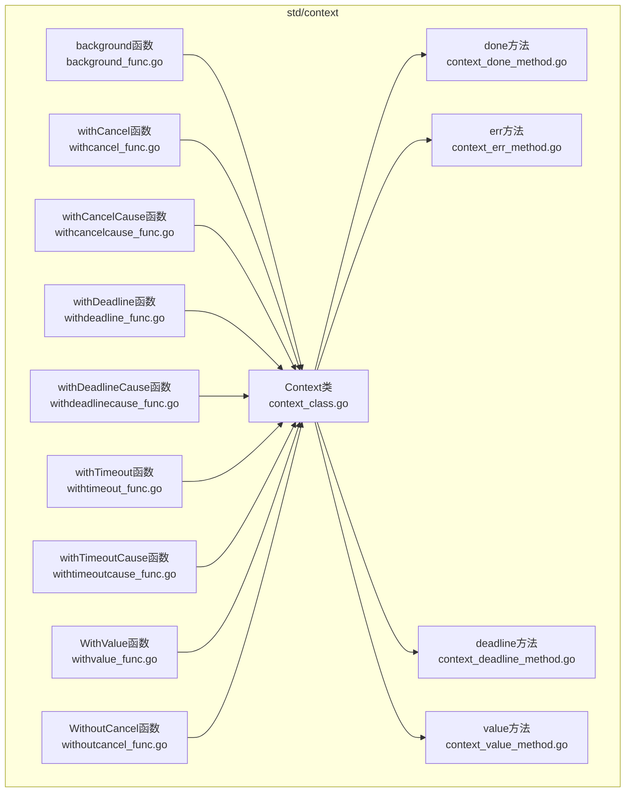
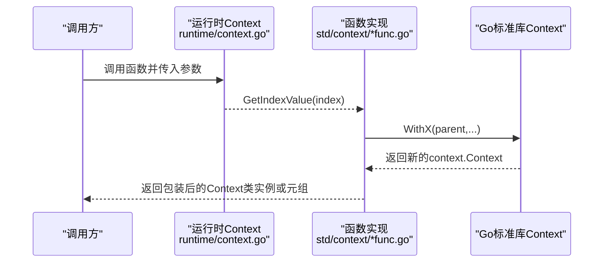
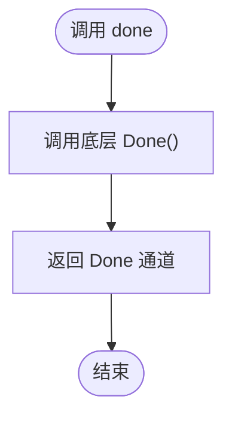
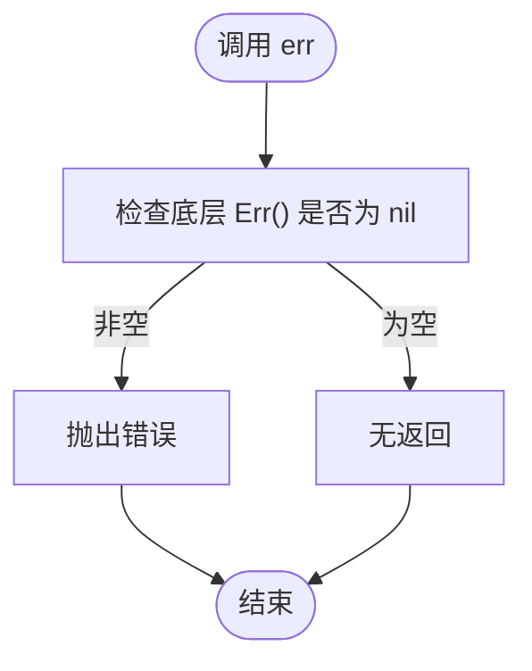
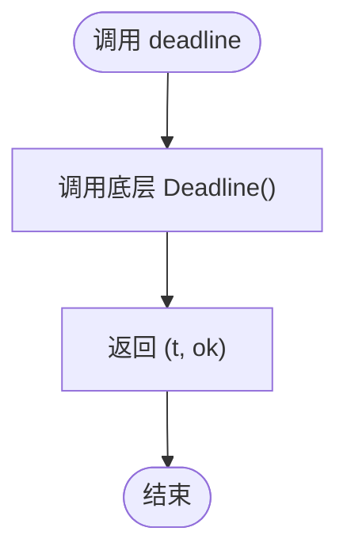
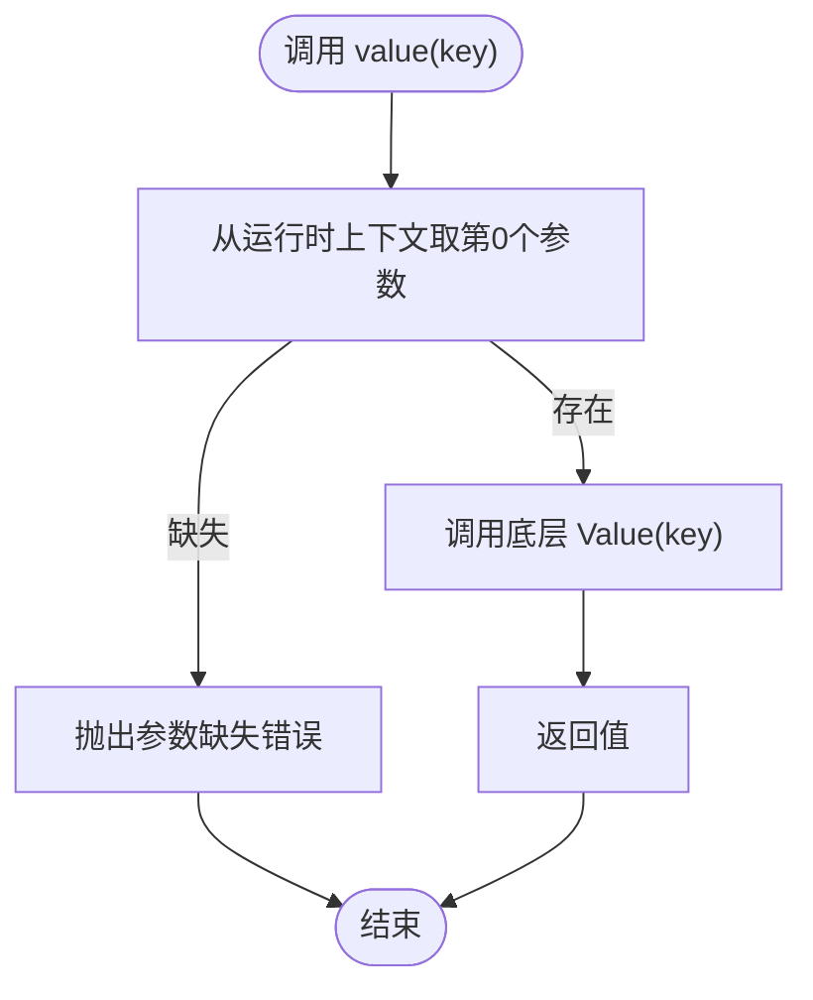
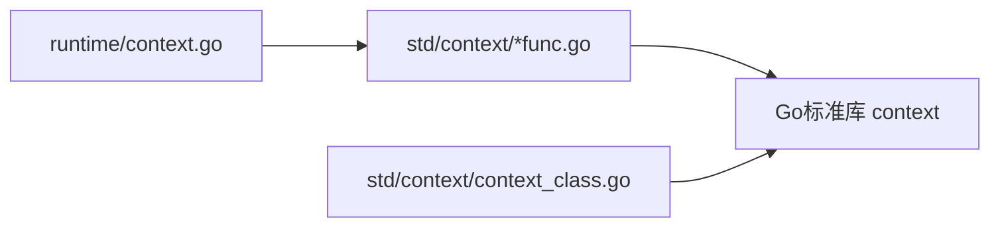
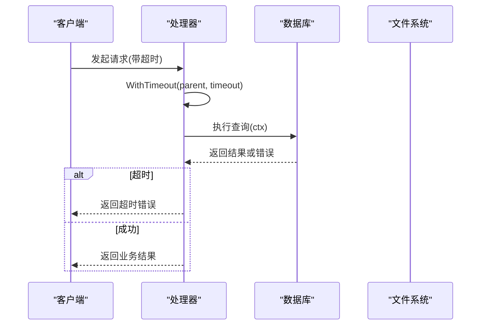

# Context上下文API

<cite>
**本文引用的文件**
- [context_class.go](file://std/context/context_class.go)
- [context_done_method.go](file://std/context/context_done_method.go)
- [context_err_method.go](file://std/context/context_err_method.go)
- [context_deadline_method.go](file://std/context/context_deadline_method.go)
- [context_value_method.go](file://std/context/context_value_method.go)
- [background_func.go](file://std/context/background_func.go)
- [withcancel_func.go](file://std/context/withcancel_func.go)
- [withcancelcause_func.go](file://std/context/withcancelcause_func.go)
- [withdeadline_func.go](file://std/context/withdeadline_func.go)
- [withdeadlinecause_func.go](file://std/context/withdeadlinecause_func.go)
- [withtimeout_func.go](file://std/context/withtimeout_func.go)
- [withtimeoutcause_func.go](file://std/context/withtimeoutcause_func.go)
- [withvalue_func.go](file://std/context/withvalue_func.go)
- [withoutcancel_func.go](file://std/context/withoutcancel_func.go)
- [context.go](file://runtime/context.go)
</cite>

## 目录
1. [简介](#简介)
2. [项目结构](#项目结构)
3. [核心组件](#核心组件)
4. [架构总览](#架构总览)
5. [详细组件分析](#详细组件分析)
6. [依赖分析](#依赖分析)
7. [性能考虑](#性能考虑)
8. [故障排查指南](#故障排查指南)
9. [结论](#结论)
10. [附录](#附录)

## 简介
本文件为 Origami 语言中 Context 上下文模块的完整 API 文档，覆盖以下内容：
- Context 类的公开方法：Done、Err、Deadline、Value 的行为与返回值
- 函数族：background、withCancel、withCancelCause、withDeadline、withDeadlineCause、withTimeout、withTimeoutCause、WithValue、WithoutCancel
- 取消机制与超时处理原理
- 在 HTTP 请求、数据库操作、文件操作等场景中的传递与使用建议
- Context 的嵌套组合与链式调用模式
- 并发编程中的最佳实践与注意事项

## 项目结构
Context 模块位于 std/context 目录，采用“类适配器 + 函数族”的设计：
- 类适配器：将 Go 标准库 context.Context 包装为 Origami 的 Context 类型，暴露 deadline、done、err、value 方法
- 函数族：提供背景上下文创建与派生上下文的工厂函数，统一参数校验与错误抛出

图表来源
- [context_class.go:10-64](file://std/context/context_class.go#L10-L64)
- [context_done_method.go:8-30](file://std/context/context_done_method.go#L8-L30)
- [context_err_method.go:10-34](file://std/context/context_err_method.go#L10-L34)
- [context_deadline_method.go:8-30](file://std/context/context_deadline_method.go#L8-L30)
- [context_value_method.go:12-45](file://std/context/context_value_method.go#L12-L45)
- [background_func.go:8-30](file://std/context/background_func.go#L8-L30)
- [withcancel_func.go:12-60](file://std/context/withcancel_func.go#L12-L60)
- [withcancelcause_func.go:12-60](file://std/context/withcancelcause_func.go#L12-L60)
- [withdeadline_func.go:13-81](file://std/context/withdeadline_func.go#L13-L81)
- [withdeadlinecause_func.go:13-105](file://std/context/withdeadlinecause_func.go#L13-L105)
- [withtimeout_func.go:13-73](file://std/context/withtimeout_func.go#L13-L73)
- [withtimeoutcause_func.go:13-97](file://std/context/withtimeoutcause_func.go#L13-L97)
- [withvalue_func.go:12-108](file://std/context/withvalue_func.go#L12-L108)
- [withoutcancel_func.go:12-60](file://std/context/withoutcancel_func.go#L12-L60)

章节来源
- [context_class.go:10-64](file://std/context/context_class.go#L10-L64)
- [background_func.go:8-30](file://std/context/background_func.go#L8-L30)

## 核心组件
- Context 类：封装底层 context.Context，提供 deadline、done、err、value 四个方法
- 工厂函数族：background、withCancel/withCancelCause、withDeadline/withDeadlineCause、withTimeout/withTimeoutCause、WithValue、WithoutCancel

章节来源
- [context_class.go:20-64](file://std/context/context_class.go#L20-L64)
- [context_done_method.go:8-30](file://std/context/context_done_method.go#L8-L30)
- [context_err_method.go:10-34](file://std/context/context_err_method.go#L10-L34)
- [context_deadline_method.go:8-30](file://std/context/context_deadline_method.go#L8-L30)
- [context_value_method.go:12-45](file://std/context/context_value_method.go#L12-L45)

## 架构总览
Context 在 Origami 中以“类 + 方法 + 函数族”的形式呈现，底层统一委托给 Go 标准库 context。运行时通过 runtime/context.go 提供的 Context 结构承载参数与变量，函数调用时从运行时上下文中取参并进行类型转换。

图表来源
- [runtime/context.go:52-65](file://runtime/context.go#L52-L65)
- [withvalue_func.go:18-88](file://std/context/withvalue_func.go#L18-L88)
- [withcancel_func.go:18-44](file://std/context/withcancel_func.go#L18-L44)
- [withdeadline_func.go:19-63](file://std/context/withdeadline_func.go#L19-L63)
- [withtimeout_func.go:18-55](file://std/context/withtimeout_func.go#L18-L55)

## 详细组件分析

### Context 类与方法
- 类名：Context\Context
- 方法列表：deadline、done、err、value
- 方法行为要点：
  - done：返回底层 Done 通道
  - err：若已取消/超时则抛出错误；否则无返回
  - deadline：返回截止时间和是否存在截止时间
  - value(key)：根据键从上下文取值

章节来源
- [context_class.go:33-64](file://std/context/context_class.go#L33-L64)
- [context_done_method.go:12-30](file://std/context/context_done_method.go#L12-L30)
- [context_err_method.go:14-34](file://std/context/context_err_method.go#L14-L34)
- [context_deadline_method.go:12-30](file://std/context/context_deadline_method.go#L12-L30)
- [context_value_method.go:16-45](file://std/context/context_value_method.go#L16-L45)

### 函数族：background
- 名称：context\background
- 参数：无
- 返回：Context 类实例（内部持有 Go context.Context）
- 典型用途：作为根上下文，用于程序启动阶段或顶层任务

章节来源
- [background_func.go:14-30](file://std/context/background_func.go#L14-L30)

### 函数族：withCancel
- 名称：context\withCancel
- 参数：
  - parent：context\Context 或其包装值
- 返回：两个元素的数组 [ctx, cancelFunc]
- 注意事项：
  - cancelFunc 需要显式调用以取消
  - 若 parent 已取消，返回的 ctx 也会立即取消

章节来源
- [withcancel_func.go:18-60](file://std/context/withcancel_func.go#L18-L60)

### 函数族：withCancelCause
- 名称：context\withCancelCause
- 参数：
  - parent：context\Context 或其包装值
- 返回：两个元素的数组 [ctx, cancelFunc]
- 特点：可携带取消原因（cause），便于诊断

章节来源
- [withcancelcause_func.go:18-60](file://std/context/withcancelcause_func.go#L18-L60)

### 函数族：withDeadline
- 名称：context\withDeadline
- 参数：
  - parent：context\Context 或其包装值
  - d：time.Time 截止时间
- 返回：两个元素的数组 [ctx, cancelFunc]
- 注意事项：当到达截止时间自动取消

章节来源
- [withdeadline_func.go:19-81](file://std/context/withdeadline_func.go#L19-L81)

### 函数族：withDeadlineCause
- 名称：context\withDeadlineCause
- 参数：
  - parent：context\Context 或其包装值
  - d：time.Time 截止时间
  - cause：error 取消原因
- 返回：两个元素的数组 [ctx, cancelFunc]
- 特点：带取消原因

章节来源
- [withdeadlinecause_func.go:19-105](file://std/context/withdeadlinecause_func.go#L19-L105)

### 函数族：withTimeout
- 名称：context\withTimeout
- 参数：
  - parent：context\Context 或其包装值
  - timeout：整数（毫秒）超时时间
- 返回：两个元素的数组 [ctx, cancelFunc]
- 注意事项：内部转换为 time.Duration 进行计算

章节来源
- [withtimeout_func.go:18-73](file://std/context/withtimeout_func.go#L18-L73)

### 函数族：withTimeoutCause
- 名称：context\withTimeoutCause
- 参数：
  - parent：context\Context 或其包装值
  - timeout：整数（毫秒）超时时间
  - cause：error 取消原因
- 返回：两个元素的数组 [ctx, cancelFunc]
- 特点：带取消原因

章节来源
- [withtimeoutcause_func.go:18-97](file://std/context/withtimeoutcause_func.go#L18-L97)

### 函数族：WithValue
- 名称：context\WithValue
- 参数：
  - parent：context\Context 或其包装值
  - key：任意键
  - val：任意值
- 返回：Context 类实例（新上下文，携带键值对）
- 注意事项：key 类型需可比较；val 可为任意类型

章节来源
- [withvalue_func.go:18-108](file://std/context/withvalue_func.go#L18-L108)

### 函数族：WithoutCancel
- 名称：context\WithoutCancel
- 参数：
  - parent：context\Context 或其包装值
- 返回：Context 类实例（取消链路被剥离）
- 适用场景：需要传递值但不希望接收取消信号

章节来源
- [withoutcancel_func.go:18-60](file://std/context/withoutcancel_func.go#L18-L60)

### Context 方法的行为流程图

#### 方法：done

图表来源
- [context_done_method.go:12-16](file://std/context/context_done_method.go#L12-L16)

#### 方法：err

图表来源
- [context_err_method.go:14-20](file://std/context/context_err_method.go#L14-L20)

#### 方法：deadline

图表来源
- [context_deadline_method.go:12-16](file://std/context/context_deadline_method.go#L12-L16)

#### 方法：value(key)

图表来源
- [context_value_method.go:16-27](file://std/context/context_value_method.go#L16-L27)

## 依赖分析
- Context 类依赖 Go 标准库 context.Context，并通过 NewContextClassFrom 将底层对象注入
- 各函数族均依赖 runtime/context.go 提供的参数读取能力（GetIndexValue）
- 错误处理统一通过 utils.NewThrow 抛出

图表来源
- [runtime/context.go:52-65](file://runtime/context.go#L52-L65)
- [withvalue_func.go:18-88](file://std/context/withvalue_func.go#L18-L88)
- [context_class.go:10-18](file://std/context/context_class.go#L10-L18)

章节来源
- [runtime/context.go:52-65](file://runtime/context.go#L52-L65)
- [withvalue_func.go:18-88](file://std/context/withvalue_func.go#L18-L88)
- [context_class.go:10-18](file://std/context/context_class.go#L10-L18)

## 性能考虑
- Context 传递为指针语义，开销极低
- WithX 函数仅创建新的 context.Context 并返回，避免复制
- 建议在高频路径中复用 Context，减少重复派生
- 对于 WithValue，尽量使用稳定且可比较的 key 类型，避免频繁分配

## 故障排查指南
- 参数缺失或类型不匹配：函数族会在运行时抛出错误，定位到具体索引
- Err 方法抛错：表示上下文已被取消或超时，应检查上游取消来源
- Deadline 返回 ok=false：表示未设置截止时间
- value(key) 返回 nil：可能是 key 不匹配或值不存在

章节来源
- [withvalue_func.go:20-21](file://std/context/withvalue_func.go#L20-L21)
- [withdeadline_func.go:21-29](file://std/context/withdeadline_func.go#L21-L29)
- [withtimeout_func.go:21-29](file://std/context/withtimeout_func.go#L21-L29)
- [context_err_method.go:16-19](file://std/context/context_err_method.go#L16-L19)
- [context_deadline_method.go:14-15](file://std/context/context_deadline_method.go#L14-L15)
- [context_value_method.go:25](file://std/context/context_value_method.go#L25)

## 结论
Origami 的 Context 模块以最小侵入的方式桥接 Go 标准库，既保持了原生语义，又提供了统一的参数校验与错误抛出机制。通过函数族与 Context 类的配合，开发者可以在 HTTP、数据库、文件等多场景中安全地传递取消与超时信号，并结合 WithValue 传递请求级或任务级的元数据。

## 附录

### 使用场景与最佳实践
- HTTP 请求
  - 使用 background 创建根上下文，随请求进入服务端入口
  - 使用 withTimeout 为单次请求设置超时
  - 使用 WithValue 传递用户 ID、Trace ID 等
  - 在处理链路中透传 Context，确保异常能及时返回
- 数据库操作
  - 为查询设置合理超时，避免长事务阻塞
  - 使用 WithCancel 在上层取消时快速中断
  - 使用 WithValue 传递连接池标签或租户信息
- 文件操作
  - 对大文件上传/下载设置超时
  - 在取消时主动关闭资源句柄

### 取消与超时处理流程

[此图为概念性流程示意，无需图表来源]