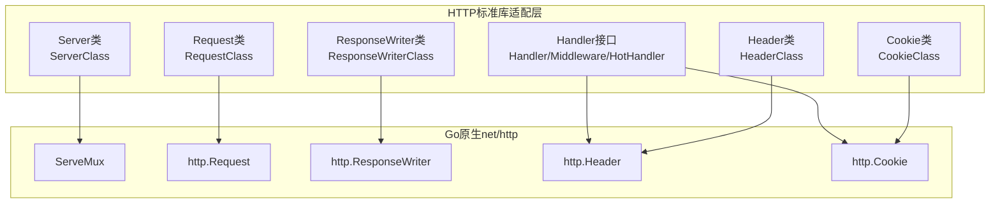
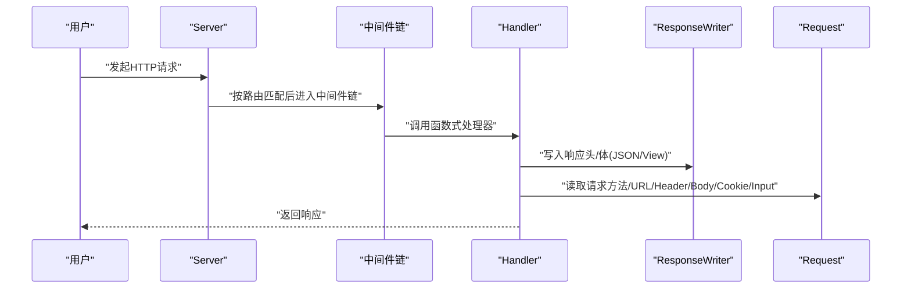
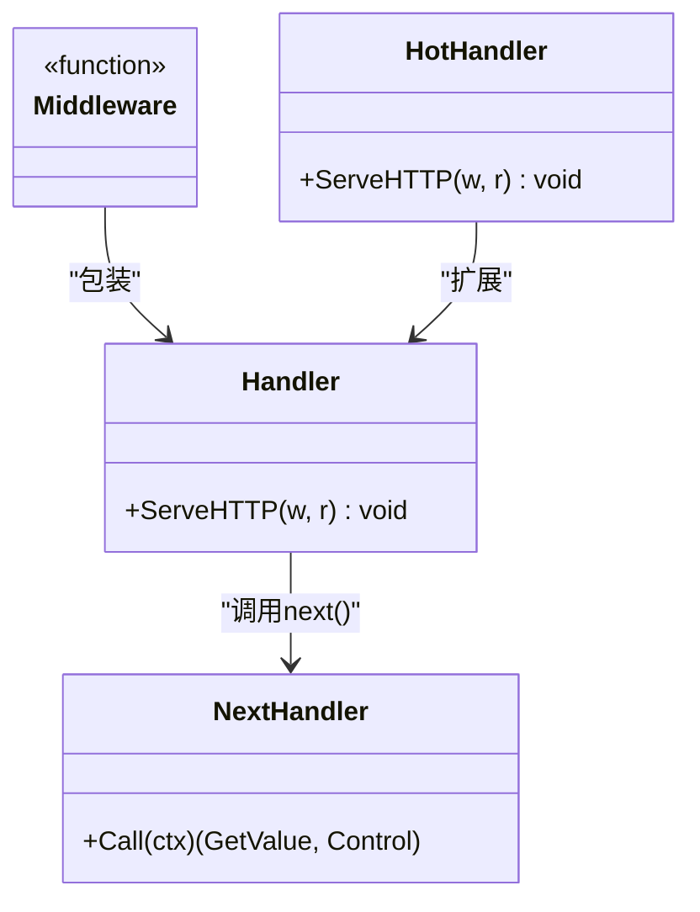
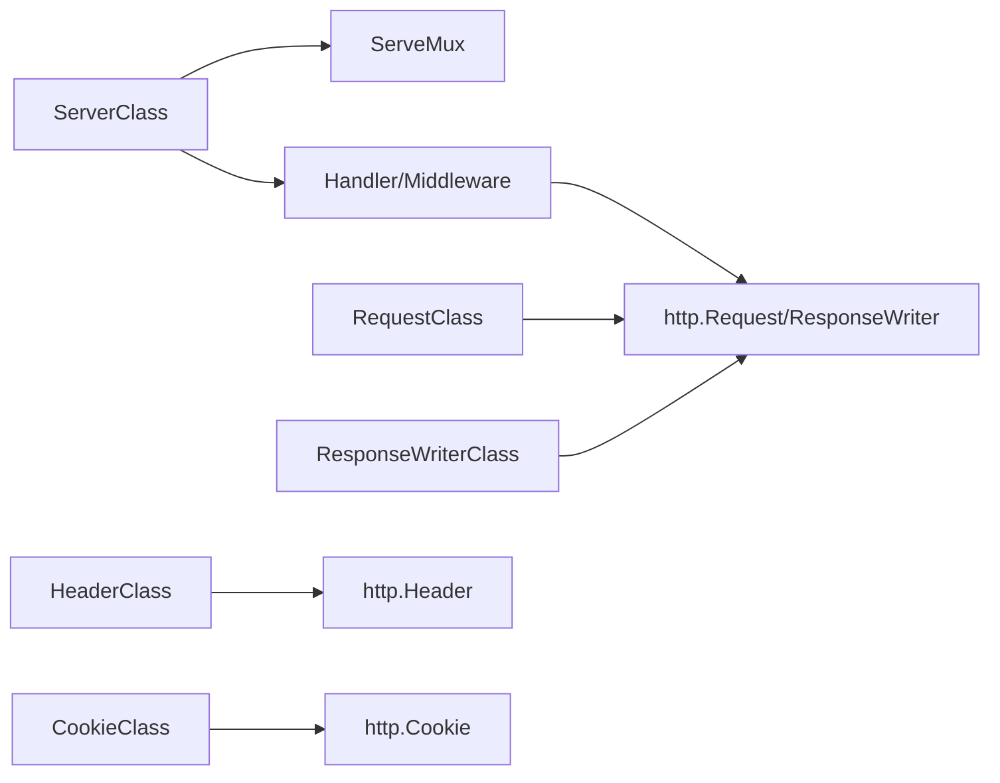

# HTTP服务器API

<cite>
**本文引用的文件**
- [server_class.go](file://std/net/http/server_class.go)
- [server_construct.go](file://std/net/http/server_construct.go)
- [server_run.go](file://std/net/http/server_run.go)
- [server_servehttp_method.go](file://std/net/http/server_servehttp_method.go)
- [server_group.go](file://std/net/http/server_group.go)
- [server_middleware.go](file://std/net/http/server_middleware.go)
- [server_static_method.go](file://std/net/http/server_static_method.go)
- [request_class.go](file://std/net/http/request_class.go)
- [request_method_method.go](file://std/net/http/request_method_method.go)
- [responsewriter_class.go](file://std/net/http/responsewriter_class.go)
- [responsewriter_write_method.go](file://std/net/http/responsewriter_write_method.go)
- [handler.go](file://std/net/http/handler.go)
- [header_class.go](file://std/net/http/header_class.go)
- [cookie_class.go](file://std/net/http/cookie_class.go)
</cite>

## 目录
1. [简介](#简介)
2. [项目结构](#项目结构)
3. [核心组件](#核心组件)
4. [架构总览](#架构总览)
5. [详细组件分析](#详细组件分析)
6. [依赖关系分析](#依赖关系分析)
7. [性能考量](#性能考量)
8. [故障排查指南](#故障排查指南)
9. [结论](#结论)
10. [附录](#附录)

## 简介
本文件为HTTP服务器模块的完整API文档，覆盖以下内容：
- Server类：构造函数、Run方法、ServeHTTP方法、Group方法、Middleware方法、静态文件服务等
- Request类：方法族如Method、URL、Header、Body、Cookie、Input等
- ResponseWriter类：方法族如Write、WriteHeader、Header、JSON、View等
- Handler接口及中间件机制
- Header类与Cookie类的完整API
- 路由配置、中间件使用、静态文件服务等实际应用场景

## 项目结构
HTTP服务器模块位于标准库的网络HTTP子系统中，采用“类适配器”模式封装Go原生net/http能力，并通过自研运行时与数据模型桥接，形成统一的API形态。

图表来源
- [server_class.go:26-35](file://std/net/http/server_class.go#L26-L35)
- [request_class.go:88-91](file://std/net/http/request_class.go#L88-L91)
- [responsewriter_class.go:22-25](file://std/net/http/responsewriter_class.go#L22-L25)
- [handler.go:57-60](file://std/net/http/handler.go#L57-L60)
- [header_class.go:38-41](file://std/net/http/header_class.go#L38-L41)
- [cookie_class.go:30-33](file://std/net/http/cookie_class.go#L30-L33)

章节来源
- [server_class.go:10-96](file://std/net/http/server_class.go#L10-L96)
- [request_class.go:32-251](file://std/net/http/request_class.go#L32-L251)
- [responsewriter_class.go:10-71](file://std/net/http/responsewriter_class.go#L10-L71)
- [handler.go:13-150](file://std/net/http/handler.go#L13-L150)
- [header_class.go:10-104](file://std/net/http/header_class.go#L10-L104)
- [cookie_class.go:14-226](file://std/net/http/cookie_class.go#L14-L226)

## 核心组件
- Server类：提供路由注册、静态文件服务、中间件挂载、启动监听、直接ServeHTTP分发等能力
- Request类：提供对http.Request的只读访问与便捷方法（方法、URL、Header、Body、Cookie、Input、文件上传等）
- ResponseWriter类：提供对http.ResponseWriter的便捷写入与渲染方法（Write、WriteHeader、Header、JSON、View）
- Handler接口：将函数式处理器桥接到http.Handler，支持中间件链式调用与异常传播
- Header类：对http.Header的封装，提供增删改查与写入方法
- Cookie类：对http.Cookie的封装，提供属性访问与字符串化、有效性检查

章节来源
- [server_class.go:26-96](file://std/net/http/server_class.go#L26-L96)
- [request_class.go:88-251](file://std/net/http/request_class.go#L88-L251)
- [responsewriter_class.go:22-71](file://std/net/http/responsewriter_class.go#L22-L71)
- [handler.go:57-150](file://std/net/http/handler.go#L57-L150)
- [header_class.go:38-104](file://std/net/http/header_class.go#L38-L104)
- [cookie_class.go:30-226](file://std/net/http/cookie_class.go#L30-L226)

## 架构总览
Server类内部持有net/http.ServeMux实例，通过方法映射将HTTP动词映射到ServerHandleMethod；同时支持静态文件服务、中间件链、以及直接ServeHTTP分发。Handler与Middleware负责将函数式处理器桥接至http.Handler并支持异常控制流。

图表来源
- [server_class.go:46-64](file://std/net/http/server_class.go#L46-L64)
- [handler.go:62-76](file://std/net/http/handler.go#L62-L76)
- [responsewriter_write_method.go:15-26](file://std/net/http/responsewriter_write_method.go#L15-L26)
- [request_method_method.go:14-19](file://std/net/http/request_method_method.go#L14-L19)

## 详细组件分析

### Server类API
- 构造函数
  - 名称：__construct
  - 参数：host(string, 默认"0.0.0.0")、port(int, 默认80)
  - 返回：void
  - 行为：初始化Server对象的Host与Port字段
  - 最佳实践：在生产环境建议显式传入host与port，避免默认绑定到0.0.0.0:80
  章节来源
  - [server_construct.go:13-44](file://std/net/http/server_construct.go#L13-L44)

- Run方法
  - 名称：run
  - 参数：无
  - 返回：void
  - 行为：以Host:Port组合启动HTTP服务，内部调用ListenAndServe
  - 异常：若监听失败，抛出异常
  - 最佳实践：在应用启动阶段调用，确保端口未被占用
  章节来源
  - [server_run.go:15-33](file://std/net/http/server_run.go#L15-L33)

- ServeHTTP方法
  - 名称：serveHTTP
  - 参数：w(ResponseWriter)、r(Request)
  - 返回：void
  - 行为：直接委托底层ServeMux.ServeHTTP进行路由分发
  - 应用场景：无需监听端口，仅进行请求分发（如反向代理或嵌入式场景）
  章节来源
  - [server_servehttp_method.go:14-43](file://std/net/http/server_servehttp_method.go#L14-L43)

- Group方法
  - 名称：group
  - 参数：prefix(string)
  - 返回：Server实例（同源ServeMux，共享Middlewares，继承Host/Port）
  - 行为：基于当前Server创建带前缀的新Server实例，便于模块化路由分组
  - 最佳实践：结合中间件使用，实现模块级中间件隔离
  章节来源
  - [server_group.go:13-38](file://std/net/http/server_group.go#L13-L38)

- Middleware方法
  - 名称：middleware
  - 参数：mid(function)，形如function(r, w, next)
  - 返回：void
  - 行为：将函数式中间件包装为Middleware并追加到Middlewares列表
  - 异常：参数非闭包或变量数不足时抛出异常
  - 最佳实践：next()必须在中间件逻辑中显式调用以传递控制权
  章节来源
  - [server_middleware.go:15-46](file://std/net/http/server_middleware.go#L15-L46)
  - [handler.go:23-47](file://std/net/http/handler.go#L23-L47)

- 静态文件服务
  - 名称：static
  - 参数：prefix(string, 可选，默认"/assets/")、dir(string, 可选，默认当前目录)
  - 返回：void
  - 行为：注册GET/HEAD路由，StripPrefix后交由http.FileServer提供静态资源
  - 校验：提前校验目录存在性与合法性；自动规范化路径与末尾斜杠
  - 最佳实践：将静态资源目录置于只读位置，避免误写；合理设置prefix避免冲突
  章节来源
  - [server_static_method.go:20-97](file://std/net/http/server_static_method.go#L20-L97)

- 动词路由快捷方法
  - 名称：get/post/put/delete/head/options/patch/trace/any
  - 参数：pattern(string)、handler(function)
  - 返回：void
  - 行为：将函数式处理器注册到ServeMux对应HTTP动词下
  - 最佳实践：使用any方法实现通配路由，但需谨慎避免与更精确路由冲突
  章节来源
  - [server_class.go:46-64](file://std/net/http/server_class.go#L46-L64)

### Request类API
- 方法族概览（部分）
  - method(): string
    - 返回：HTTP请求方法
    - 章节来源
      - [request_method_method.go:14-27](file://std/net/http/request_method_method.go#L14-L27)
  - url()/fullUrl()/path(): string
    - 返回：URL、完整URL、路径
  - query(): map[string]string
    - 返回：查询参数映射
  - header(): Header
    - 返回：Header对象（可读写）
  - ip(): string
    - 返回：客户端IP
  - has(name): bool
    - 判断是否存在指定键
  - input(name): string
    - 获取输入值（表单/JSON/原始）
  - only()/except()/all(): map[string]string
    - 过滤性获取输入
  - file(name): File
    - 获取上传文件句柄
  - isMethod(method): bool
    - 判断是否为指定方法
  - isSecure(): bool
    - 是否HTTPS
  - bind(model): void
    - 将输入绑定到模型
  - body(): string
    - 获取原始请求体
  - cookies()/cookie(name)/cookiesNamed(name): Cookie[]
    - Cookie集合与单项访问
  - userAgent()/referer(): string
    - 用户代理与来源页
  - multipartReader()/parseMultipartForm()/formValue()/postFormValue()/formFile()
    - 多部分解析与表单值访问
  - clone()/withContext()/context()
    - 请求克隆与上下文
  - write()/writeProxy()
    - 写入响应（内部使用）

说明：上述方法均通过RequestClass.GetMethod映射到具体实现，所有属性访问通过方法进行，对象为只读。

章节来源
- [request_class.go:124-207](file://std/net/http/request_class.go#L124-L207)
- [request_class.go:248-251](file://std/net/http/request_class.go#L248-L251)

### ResponseWriter类API
- 方法族概览（部分）
  - write(data): int
    - 写入字节数据，返回写入长度；失败抛出异常
    - 章节来源
      - [responsewriter_write_method.go:15-42](file://std/net/http/responsewriter_write_method.go#L15-L42)
  - writeHeader(statusCode): void
    - 设置状态码
  - header(): Header
    - 获取Header对象（可读写）
  - json(data): void
    - JSON序列化并输出
  - view(template, data): void
    - 渲染模板并输出

说明：ResponseWriter类方法直接桥接http.ResponseWriter能力，提供便捷的写入与渲染。

章节来源
- [responsewriter_class.go:36-60](file://std/net/http/responsewriter_class.go#L36-L60)

### Handler接口与中间件
- Handler
  - 作用：将函数式处理器桥接为http.Handler，注入r、w两个参数
  - ServeHTTP：创建上下文，注入r/w，执行函数，异常通过panic传播
  章节来源
  - [handler.go:57-76](file://std/net/http/handler.go#L57-L76)

- Middleware
  - 定义：接收http.Handler并返回包装后的http.Handler
  - newMiddleware：将函数式中间件包装为Middleware，注入r、w、next三个参数
  - applyMiddlewares：逆序应用中间件链
  章节来源
  - [handler.go:20-55](file://std/net/http/handler.go#L20-L55)

- NextHandler
  - 作用：在中间件中调用next()以继续后续处理
  - Call：捕获panic并将异常透传给上层
  章节来源
  - [handler.go:101-131](file://std/net/http/handler.go#L101-L131)

- HotHandler
  - 作用：热重载场景下的请求期临时VM隔离
  章节来源
  - [handler.go:78-99](file://std/net/http/handler.go#L78-L99)

图表来源
- [handler.go:57-76](file://std/net/http/handler.go#L57-L76)
- [handler.go:101-131](file://std/net/http/handler.go#L101-L131)
- [handler.go:78-99](file://std/net/http/handler.go#L78-L99)

### Header类API
- 方法族
  - get(key): string
  - set(key, value): void
  - values(key): string[]
  - add(key, value): void
  - del(key): void
  - clone(): Header
  - write(w): void
  - writeSubset(w, exclude): void
- 用途：对http.Header进行增删改查与写入操作
- 最佳实践：使用write/writeSubset在合适时机写入响应头

章节来源
- [header_class.go:60-80](file://std/net/http/header_class.go#L60-L80)
- [header_class.go:38-104](file://std/net/http/header_class.go#L38-L104)

### Cookie类API
- 属性（可读写）
  - Name、Value、Quoted、Path、Domain、Expires、RawExpires、MaxAge、Secure、HttpOnly、SameSite、Partitioned、Raw、Unparsed
- 方法
  - string(): string
  - valid(): bool
- 最佳实践：设置Secure/HttpOnly提升安全性；SameSite合理选择防止CSRF

章节来源
- [cookie_class.go:65-116](file://std/net/http/cookie_class.go#L65-L116)
- [cookie_class.go:118-226](file://std/net/http/cookie_class.go#L118-L226)

## 依赖关系分析
- ServerClass依赖net/http.ServeMux进行路由注册与分发
- Handler/Middleware/NextHandler桥接函数式处理器与http.Handler生态
- RequestClass/ResponseWriterClass分别封装http.Request与http.ResponseWriter
- HeaderClass/CookieClass封装http.Header与http.Cookie

图表来源
- [server_class.go:26-35](file://std/net/http/server_class.go#L26-L35)
- [handler.go:57-60](file://std/net/http/handler.go#L57-L60)
- [request_class.go:88-91](file://std/net/http/request_class.go#L88-L91)
- [responsewriter_class.go:22-25](file://std/net/http/responsewriter_class.go#L22-L25)
- [header_class.go:38-41](file://std/net/http/header_class.go#L38-L41)
- [cookie_class.go:30-33](file://std/net/http/cookie_class.go#L30-L33)

## 性能考量
- 中间件链顺序：越靠前的中间件影响范围越大，应尽量将高频短路逻辑前置
- 静态文件服务：StripPrefix与ServeMux配合，注意前缀规范化避免多余匹配开销
- 请求体与表单解析：仅在必要时调用parseMultipartForm/formValue，避免重复解析
- JSON输出：优先复用缓冲区，减少GC压力

## 故障排查指南
- 中间件未调用next()
  - 现象：请求卡住，无响应
  - 处理：确保中间件内显式调用next()
  章节来源
  - [handler.go:106-131](file://std/net/http/handler.go#L106-L131)

- 静态文件目录不存在或非目录
  - 现象：启动时报错
  - 处理：确认dir存在且为目录，使用绝对路径
  章节来源
  - [server_static_method.go:53-59](file://std/net/http/server_static_method.go#L53-L59)

- 中间件参数不正确
  - 现象：注册中间件时报错
  - 处理：确保传入闭包且至少包含r、w、next三个参数
  章节来源
  - [server_middleware.go:15-30](file://std/net/http/server_middleware.go#L15-L30)
  - [handler.go:23-27](file://std/net/http/handler.go#L23-L27)

- 写入响应失败
  - 现象：write方法抛出异常
  - 处理：检查写入数据与连接状态，避免重复写入头部
  章节来源
  - [responsewriter_write_method.go:21-25](file://std/net/http/responsewriter_write_method.go#L21-L25)

## 结论
本模块通过清晰的类封装与函数式处理器桥接，提供了易用且强大的HTTP服务器能力。结合中间件链、静态文件服务与丰富的Request/Response工具方法，能够满足从简单Web服务到复杂业务系统的开发需求。建议在实际工程中遵循参数校验、中间件顺序与资源管理的最佳实践，以获得稳定与高性能的表现。

## 附录
- 实际应用场景示例（步骤化）
  - 启动服务器
    - 创建Server实例并调用__construct(host, port)
    - 注册路由：get/post/put/delete等
    - 调用run()启动监听
  - 中间件使用
    - 在Server上注册middleware，形如function(r, w, next)
    - 在中间件中进行鉴权、日志、限流等处理
  - 静态文件服务
    - 调用static(prefix, dir)注册静态资源路由
    - 注意前缀与目录规范化
  - 处理器编写
    - 编写函数式处理器，接收r、w两个参数
    - 使用r.method/url/header/body等方法读取请求
    - 使用w.write/json/view等方法输出响应