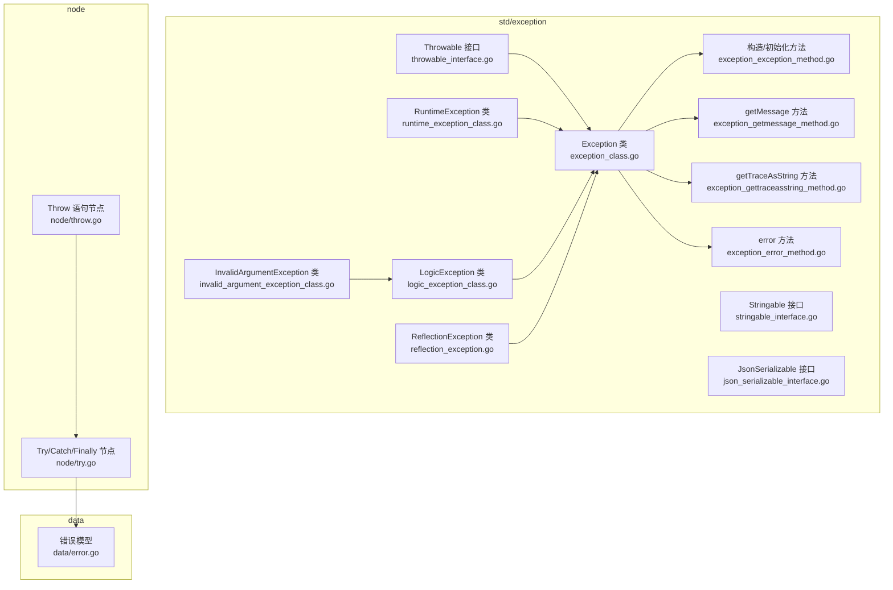
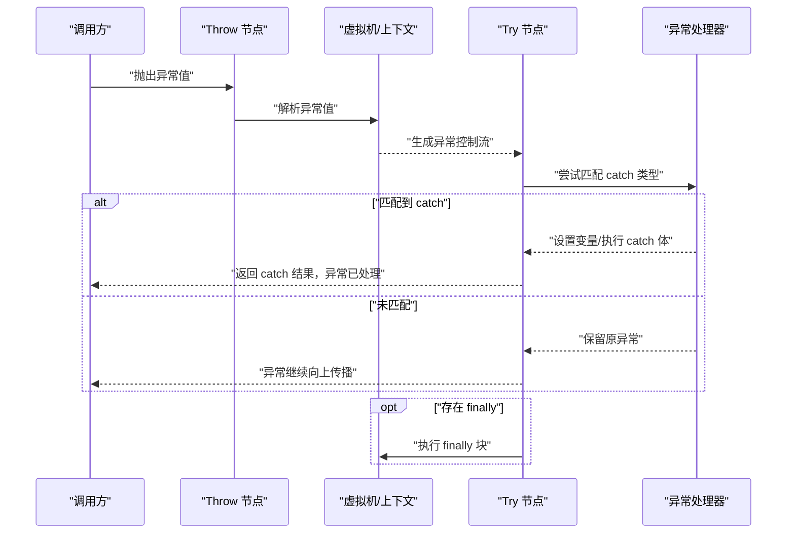
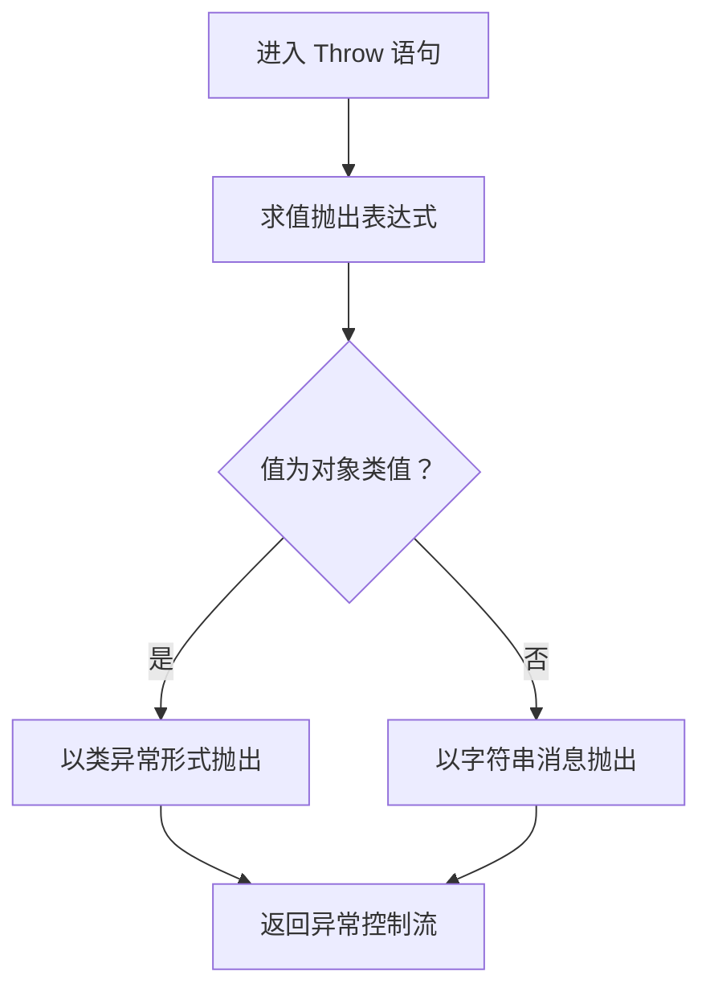
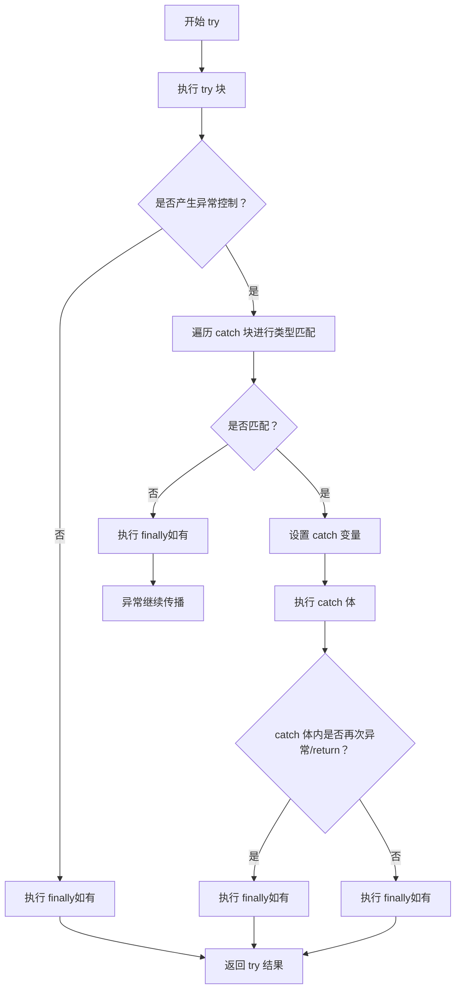
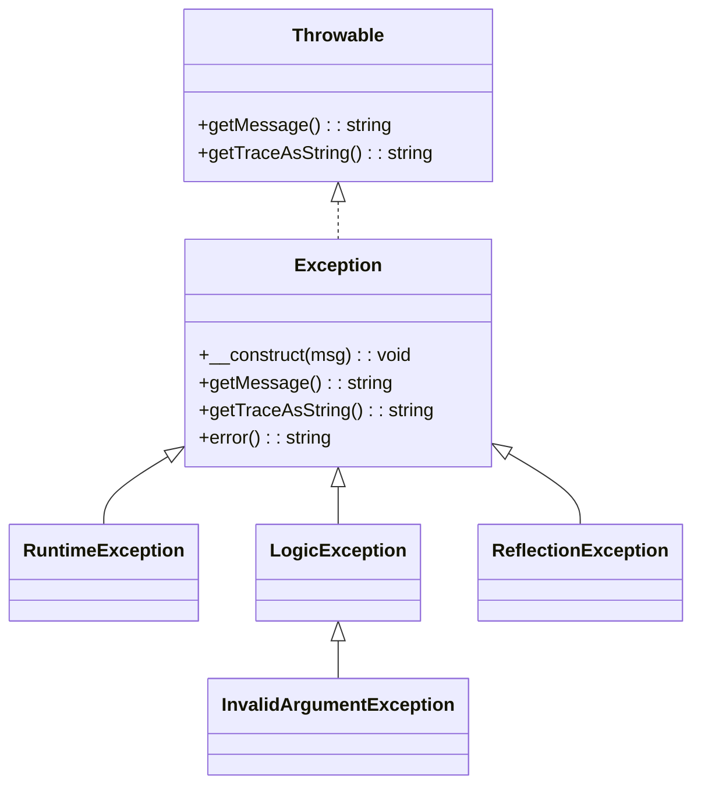

# 异常处理API

<cite>
**本文引用的文件**
- [std/exception/throwable_interface.go](file://std/exception/throwable_interface.go)
- [std/exception/exception_class.go](file://std/exception/exception_class.go)
- [std/exception/exception_exception_method.go](file://std/exception/exception_exception_method.go)
- [std/exception/exception_getmessage_method.go](file://std/exception/exception_getmessage_method.go)
- [std/exception/exception_gettraceasstring_method.go](file://std/exception/exception_gettraceasstring_method.go)
- [std/exception/exception_error_method.go](file://std/exception/exception_error_method.go)
- [std/exception/runtime_exception_class.go](file://std/exception/runtime_exception_class.go)
- [std/exception/logic_exception_class.go](file://std/exception/logic_exception_class.go)
- [std/exception/invalid_argument_exception_class.go](file://std/exception/invalid_argument_exception_class.go)
- [std/exception/reflection_exception.go](file://std/exception/reflection_exception.go)
- [std/exception/stringable_interface.go](file://std/exception/stringable_interface.go)
- [std/exception/json_serializable_interface.go](file://std/exception/json_serializable_interface.go)
- [node/throw.go](file://node/throw.go)
- [node/try.go](file://node/try.go)
- [data/error.go](file://data/error.go)
</cite>

## 目录
1. [简介](#简介)
2. [项目结构](#项目结构)
3. [核心组件](#核心组件)
4. [架构总览](#架构总览)
5. [详细组件分析](#详细组件分析)
6. [依赖分析](#依赖分析)
7. [性能考虑](#性能考虑)
8. [故障排查指南](#故障排查指南)
9. [结论](#结论)
10. [附录](#附录)

## 简介
本文件系统性梳理运行时中的异常处理API，覆盖以下主题：
- Throwable 接口与 Exception 类的定义与方法
- 内置异常类族：RuntimeException、LogicException、InvalidArgumentException、ReflectionException
- Stringable 与 JsonSerializable 接口
- 抛出、捕获与处理机制（throw/try/catch/finally）
- 自定义异常类的创建与使用
- 参数说明、返回值、使用示例与最佳实践
- 错误处理、调试信息与异常传播的实际应用

## 项目结构
异常处理相关代码主要位于 std/exception 目录，配合 node 层的 throw/try 控制流节点与 data 层的错误模型。

图表来源
- [std/exception/throwable_interface.go:1-20](file://std/exception/throwable_interface.go#L1-L20)
- [std/exception/exception_class.go:1-93](file://std/exception/exception_class.go#L1-L93)
- [std/exception/exception_exception_method.go:1-50](file://std/exception/exception_exception_method.go#L1-L50)
- [std/exception/exception_getmessage_method.go:1-39](file://std/exception/exception_getmessage_method.go#L1-L39)
- [std/exception/exception_gettraceasstring_method.go:1-39](file://std/exception/exception_gettraceasstring_method.go#L1-L39)
- [std/exception/exception_error_method.go:1-39](file://std/exception/exception_error_method.go#L1-L39)
- [std/exception/runtime_exception_class.go:1-92](file://std/exception/runtime_exception_class.go#L1-L92)
- [std/exception/logic_exception_class.go:1-92](file://std/exception/logic_exception_class.go#L1-L92)
- [std/exception/invalid_argument_exception_class.go:1-92](file://std/exception/invalid_argument_exception_class.go#L1-L92)
- [std/exception/reflection_exception.go:1-90](file://std/exception/reflection_exception.go#L1-L90)
- [std/exception/stringable_interface.go:1-17](file://std/exception/stringable_interface.go#L1-L17)
- [std/exception/json_serializable_interface.go:1-17](file://std/exception/json_serializable_interface.go#L1-L17)
- [node/throw.go:1-37](file://node/throw.go#L1-L37)
- [node/try.go:1-122](file://node/try.go#L1-L122)
- [data/error.go:1-50](file://data/error.go#L1-L50)

章节来源
- [std/exception/throwable_interface.go:1-20](file://std/exception/throwable_interface.go#L1-L20)
- [std/exception/exception_class.go:1-93](file://std/exception/exception_class.go#L1-L93)
- [node/throw.go:1-37](file://node/throw.go#L1-L37)
- [node/try.go:1-122](file://node/try.go#L1-L122)
- [data/error.go:1-50](file://data/error.go#L1-L50)

## 核心组件
- Throwable 接口：定义异常对象必须具备的方法签名，用于类型提示与 instanceof 判断。
- Exception 类：标准异常类，实现 Throwable 接口，提供构造、消息获取、堆栈字符串化等方法。
- 内置异常类族：RuntimeException、LogicException、InvalidArgumentException、ReflectionException，均继承自 Exception 或其上层逻辑类。
- Stringable 接口：约束对象可被转换为字符串。
- JsonSerializable 接口：约束对象在 JSON 编码时可自定义序列化行为。
- 抛出与捕获：Throw 语句节点负责抛出异常；Try 语句节点负责捕获与处理异常，支持 finally 块。

章节来源
- [std/exception/throwable_interface.go:8-19](file://std/exception/throwable_interface.go#L8-L19)
- [std/exception/exception_class.go:20-93](file://std/exception/exception_class.go#L20-L93)
- [std/exception/runtime_exception_class.go:20-92](file://std/exception/runtime_exception_class.go#L20-L92)
- [std/exception/logic_exception_class.go:20-92](file://std/exception/logic_exception_class.go#L20-L92)
- [std/exception/invalid_argument_exception_class.go:20-92](file://std/exception/invalid_argument_exception_class.go#L20-L92)
- [std/exception/reflection_exception.go:11-90](file://std/exception/reflection_exception.go#L11-L90)
- [std/exception/stringable_interface.go:8-17](file://std/exception/stringable_interface.go#L8-L17)
- [std/exception/json_serializable_interface.go:8-17](file://std/exception/json_serializable_interface.go#L8-L17)
- [node/throw.go:9-37](file://node/throw.go#L9-L37)
- [node/try.go:9-122](file://node/try.go#L9-L122)

## 架构总览
异常处理的运行时架构由“声明-抛出-捕获-传播-清理”构成，数据与控制流如下：

图表来源
- [node/throw.go:24-36](file://node/throw.go#L24-L36)
- [node/try.go:24-111](file://node/try.go#L24-L111)

## 详细组件分析

### Throwable 接口
- 目标：为异常对象提供统一的类型提示与 instanceof 支持。
- 方法
  - getMessage(): string
  - getTraceAsString(): string
- 设计要点：方法签名最小化，与当前 Exception 实现对齐，便于类型约束与反射判断。

章节来源
- [std/exception/throwable_interface.go:8-19](file://std/exception/throwable_interface.go#L8-L19)

### Exception 类
- 继承关系：实现 Throwable 接口。
- 构造与初始化
  - 构造函数：接收消息参数，内部完成异常状态初始化。
  - 初始化方法：用于在构造阶段设置消息与上下文。
- 常用方法
  - getMessage(): string —— 获取异常消息。
  - getTraceAsString(): string —— 获取格式化的堆栈跟踪字符串。
  - error(): string —— 获取异常的字符串化表示（与 __toString 约束相关）。
- 类值与方法映射：通过 GetMethod/GetMethods 提供方法查找与列表。

章节来源
- [std/exception/exception_class.go:20-93](file://std/exception/exception_class.go#L20-L93)
- [std/exception/exception_exception_method.go:8-50](file://std/exception/exception_exception_method.go#L8-L50)
- [std/exception/exception_getmessage_method.go:7-39](file://std/exception/exception_getmessage_method.go#L7-L39)
- [std/exception/exception_gettraceasstring_method.go:7-39](file://std/exception/exception_gettraceasstring_method.go#L7-L39)
- [std/exception/exception_error_method.go:7-39](file://std/exception/exception_error_method.go#L7-L39)

### RuntimeException 类
- 继承关系：继承 Exception。
- 用途：表示运行时发生的错误（如资源不可用、状态不合法等）。
- 方法：与 Exception 一致，复用相同方法实现。

章节来源
- [std/exception/runtime_exception_class.go:20-92](file://std/exception/runtime_exception_class.go#L20-L92)

### LogicException 类
- 继承关系：继承 Exception。
- 用途：表示程序逻辑错误（如前置条件不满足、算法前提破坏等）。
- 方法：与 Exception 一致。

章节来源
- [std/exception/logic_exception_class.go:20-92](file://std/exception/logic_exception_class.go#L20-L92)

### InvalidArgumentException 类
- 继承关系：继承 LogicException。
- 用途：表示传入参数不符合要求。
- 方法：与 Exception 一致。

章节来源
- [std/exception/invalid_argument_exception_class.go:20-92](file://std/exception/invalid_argument_exception_class.go#L20-L92)

### ReflectionException 类
- 继承关系：继承 Exception，并实现 Throwable 接口。
- 用途：反射操作失败时抛出。
- 特性：IsThrow 返回 true，表明该类专门用于异常传播。

章节来源
- [std/exception/reflection_exception.go:11-90](file://std/exception/reflection_exception.go#L11-L90)

### Stringable 接口
- 目标：约束对象可被转换为字符串。
- 方法
  - __toString(): string
- 应用：与异常类的字符串化输出相关联，便于日志与调试。

章节来源
- [std/exception/stringable_interface.go:8-17](file://std/exception/stringable_interface.go#L8-L17)

### JsonSerializable 接口
- 目标：在 JSON 编码时允许对象自定义序列化结果。
- 方法
  - jsonSerialize(): mixed
- 应用：异常对象若实现此接口，可在 JSON 场景下输出结构化的错误信息。

章节来源
- [std/exception/json_serializable_interface.go:8-17](file://std/exception/json_serializable_interface.go#L8-L17)

### 抛出与捕获机制

#### 抛出（throw）
- 语义：将异常值转化为异常控制流，中断正常执行路径。
- 行为：
  - 解析抛出值，若为对象类值则以类异常形式抛出；否则以字符串消息抛出。
  - 生成对应的异常控制对象并返回给上层执行器。

图表来源
- [node/throw.go:24-36](file://node/throw.go#L24-L36)

章节来源
- [node/throw.go:9-37](file://node/throw.go#L9-L37)

#### 捕获与处理（try/catch/finally）
- 语义：执行 try 块，若发生异常则按 catch 类型匹配并执行相应块；最后无论是否异常均执行 finally。
- 关键流程：
  - 执行 try 块，遇到异常控制即停止并进入异常处理分支。
  - 遍历 catch 块，使用类型判断匹配异常值；命中后将异常赋值给 catch 变量并执行 catch 体。
  - 若 catch 体内再次抛出异常或 return，则立即返回；否则标记异常已处理。
  - finally 块始终执行；若 finally 内部抛出新异常，则覆盖之前的异常。
- 异常传播：未匹配的异常将继续向上传播。

图表来源
- [node/try.go:24-111](file://node/try.go#L24-L111)

章节来源
- [node/try.go:9-122](file://node/try.go#L9-L122)

### 自定义异常类的创建与使用
- 步骤
  - 定义类并选择合适的父类（如 Exception、LogicException、RuntimeException 等）。
  - 实现必要的构造与初始化方法，确保消息与上下文正确设置。
  - 如需参与类型提示或 instanceof 判断，确保实现 Throwable 接口（通过继承 Exception 即可）。
  - 在业务逻辑中使用 throw 抛出自定义异常，在 try/catch 中捕获并处理。
- 最佳实践
  - 明确异常语义，避免滥用通用异常。
  - 提供清晰的消息与堆栈信息，便于定位问题。
  - 使用 finally 清理资源，保证稳定性。
  - 对于 JSON 场景，可实现 JsonSerializable 以便结构化输出。

章节来源
- [std/exception/exception_class.go:55-58](file://std/exception/exception_class.go#L55-L58)
- [std/exception/reflection_exception.go:54-57](file://std/exception/reflection_exception.go#L54-L57)
- [node/throw.go:24-36](file://node/throw.go#L24-L36)
- [node/try.go:79-111](file://node/try.go#L79-L111)

## 依赖分析
- 接口与类的关系
  - Throwable → Exception → RuntimeException/LogicException → InvalidArgumentException
  - ReflectionException → Exception（并实现 Throwable）
- 控制流依赖
  - Throw 节点依赖 data 层的异常控制对象。
  - Try 节点依赖 data 层的错误模型与类型判断能力。
- 数据模型
  - data.Error 提供错误来源、消息、原因与子错误树，支撑异常传播与聚合。

图表来源
- [std/exception/throwable_interface.go:8-19](file://std/exception/throwable_interface.go#L8-L19)
- [std/exception/exception_class.go:20-93](file://std/exception/exception_class.go#L20-L93)
- [std/exception/runtime_exception_class.go:20-92](file://std/exception/runtime_exception_class.go#L20-L92)
- [std/exception/logic_exception_class.go:20-92](file://std/exception/logic_exception_class.go#L20-L92)
- [std/exception/invalid_argument_exception_class.go:20-92](file://std/exception/invalid_argument_exception_class.go#L20-L92)
- [std/exception/reflection_exception.go:11-90](file://std/exception/reflection_exception.go#L11-L90)

章节来源
- [std/exception/throwable_interface.go:8-19](file://std/exception/throwable_interface.go#L8-L19)
- [std/exception/exception_class.go:20-93](file://std/exception/exception_class.go#L20-L93)
- [std/exception/runtime_exception_class.go:20-92](file://std/exception/runtime_exception_class.go#L20-L92)
- [std/exception/logic_exception_class.go:20-92](file://std/exception/logic_exception_class.go#L20-L92)
- [std/exception/invalid_argument_exception_class.go:20-92](file://std/exception/invalid_argument_exception_class.go#L20-L92)
- [std/exception/reflection_exception.go:11-90](file://std/exception/reflection_exception.go#L11-L90)

## 性能考虑
- 异常抛出与捕获的成本较高，应仅在真正异常场景使用，避免用作常规流程控制。
- catch 匹配采用类型判断，尽量减少 catch 分支数量与复杂度。
- finally 块中的逻辑应简洁，避免引入额外开销。
- 对于高频路径，优先通过返回值与错误码区分错误，必要时再使用异常。

## 故障排查指南
- 常见问题
  - 未捕获异常导致程序退出：检查 try/catch 是否覆盖关键路径，确认 finally 是否正确清理。
  - catch 未生效：核对 catch 类型与异常实例是否匹配；注意 UnionType 的任一匹配规则。
  - finally 覆盖异常：若 finally 抛出新异常，旧异常将丢失，请在 finally 内谨慎处理。
- 调试建议
  - 使用 getTraceAsString 获取堆栈信息，结合日志定位问题。
  - 在异常类中实现 JsonSerializable，输出结构化错误，便于监控与告警。
  - 对于反射相关错误，使用 ReflectionException 并确保实现 Throwable 接口。

章节来源
- [node/try.go:64-76](file://node/try.go#L64-L76)
- [node/try.go:105-111](file://node/try.go#L105-L111)
- [std/exception/reflection_exception.go:54-57](file://std/exception/reflection_exception.go#L54-L57)
- [std/exception/exception_gettraceasstring_method.go:11-13](file://std/exception/exception_gettraceasstring_method.go#L11-L13)

## 结论
本异常处理API以 Throwable 接口为边界，围绕 Exception 及其子类构建了完善的异常体系，并通过 Throw/Try 节点实现抛出与捕获的运行时控制。配合 Stringable 与 JsonSerializable 接口，可实现从调试到监控的全链路错误管理。建议在实际开发中遵循“明确语义、最小化异常使用、结构化输出”的原则，提升系统的稳定性与可观测性。

## 附录

### API 速查表
- Throwable 接口
  - getMessage(): string —— 获取异常消息
  - getTraceAsString(): string —— 获取堆栈跟踪字符串
- Exception 类
  - __construct(msg): void —— 初始化异常消息
  - getMessage(): string —— 获取异常消息
  - getTraceAsString(): string —— 获取堆栈跟踪字符串
  - error(): string —— 获取异常字符串化表示
- 内置异常类
  - RuntimeException —— 运行时错误
  - LogicException —— 逻辑错误
  - InvalidArgumentException —— 参数非法
  - ReflectionException —— 反射错误
- 接口
  - Stringable::__toString(): string
  - JsonSerializable::jsonSerialize(): mixed
- 抛出与捕获
  - throw 表达式：将值转换为异常控制流
  - try/catch/finally：捕获并处理异常，finally 总执行

章节来源
- [std/exception/throwable_interface.go:12-16](file://std/exception/throwable_interface.go#L12-L16)
- [std/exception/exception_class.go:70-87](file://std/exception/exception_class.go#L70-L87)
- [std/exception/runtime_exception_class.go:67-78](file://std/exception/runtime_exception_class.go#L67-L78)
- [std/exception/logic_exception_class.go:67-78](file://std/exception/logic_exception_class.go#L67-L78)
- [std/exception/invalid_argument_exception_class.go:67-78](file://std/exception/invalid_argument_exception_class.go#L67-L78)
- [std/exception/reflection_exception.go:67-77](file://std/exception/reflection_exception.go#L67-L77)
- [std/exception/stringable_interface.go:12-13](file://std/exception/stringable_interface.go#L12-L13)
- [std/exception/json_serializable_interface.go:12-13](file://std/exception/json_serializable_interface.go#L12-L13)
- [node/throw.go:24-36](file://node/throw.go#L24-L36)
- [node/try.go:24-111](file://node/try.go#L24-L111)