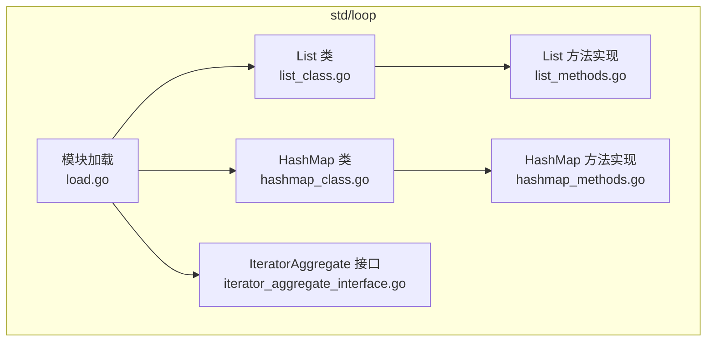
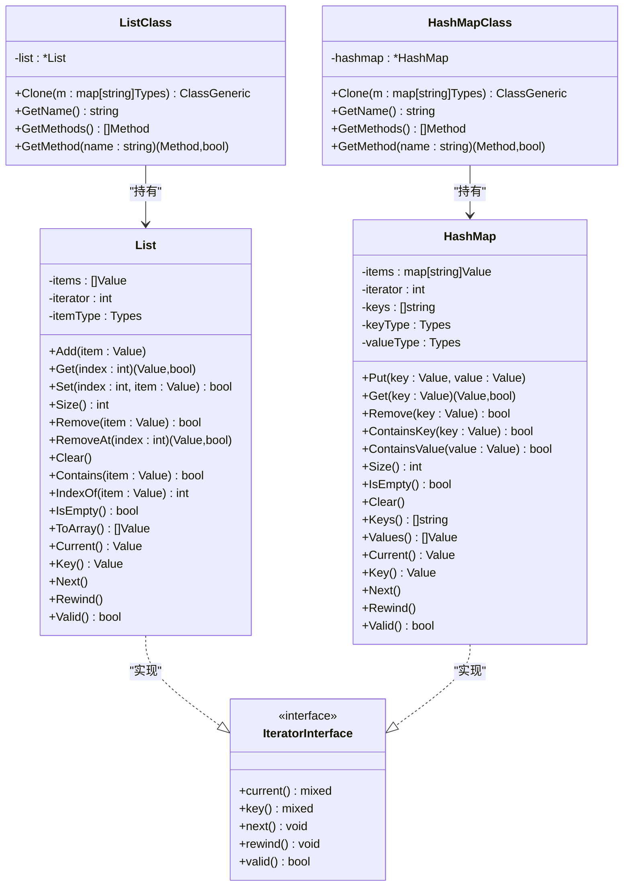
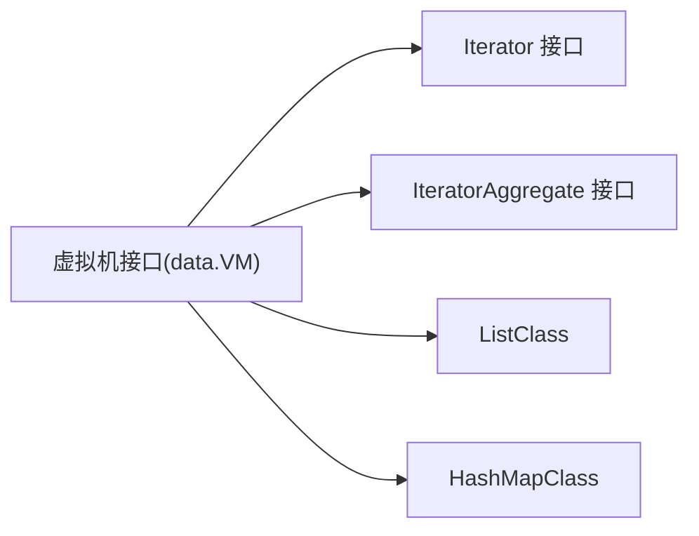

# 循环迭代API

<cite>
**本文引用的文件**
- [list_class.go](file://std/loop/list_class.go)
- [list_methods.go](file://std/loop/list_methods.go)
- [hashmap_class.go](file://std/loop/hashmap_class.go)
- [hashmap_methods.go](file://std/loop/hashmap_methods.go)
- [iterator_aggregate_interface.go](file://std/loop/iterator_aggregate_interface.go)
- [load.go](file://std/loop/load.go)
- [iterator.md](file://docs/iterator.md)
- [iterator-foreach.md](file://docs/iterator-foreach.md)
- [test_iterator_to_array.zy](file://test_iterator_to_array.zy)
</cite>

## 目录
1. [简介](#简介)
2. [项目结构](#项目结构)
3. [核心组件](#核心组件)
4. [架构总览](#架构总览)
5. [详细组件分析](#详细组件分析)
6. [依赖关系分析](#依赖关系分析)
7. [性能考量](#性能考量)
8. [故障排查指南](#故障排查指南)
9. [结论](#结论)
10. [附录](#附录)

## 简介
本文件系统性地记录循环迭代模块的完整API，覆盖 List<T> 与 HashMap<K,V> 两类集合容器，包括：
- 列表与哈希表的增删改查、包含判断、索引定位、清空与判空、转数组等集合操作
- 迭代器接口 Iterator 与聚合接口 IteratorAggregate 的实现与注册
- 遍历方法与迭代器模式的使用
- 排序、查找、过滤等常见操作的实现思路与最佳实践
- 序列化与反序列化能力（基于运行时序列化机制）
- 性能特性与使用场景建议
- 数据处理、缓存管理、配置存储等实际应用示例

## 项目结构
循环迭代模块位于 std/loop 目录，主要由以下文件组成：
- list_class.go：List<T> 类型定义与方法绑定
- list_methods.go：List<T> 的具体方法实现（含构造、增删改查、迭代器方法）
- hashmap_class.go：HashMap<K,V> 类型定义与方法绑定
- hashmap_methods.go：HashMap<K,V> 的具体方法实现（含构造、增删改查、迭代器方法）
- iterator_aggregate_interface.go：IteratorAggregate 接口定义（用于 getIterator）
- load.go：模块加载入口，注册接口与类

图表来源
- [load.go:25-31](file://std/loop/load.go#L25-L31)
- [list_class.go:142-324](file://std/loop/list_class.go#L142-L324)
- [hashmap_class.go:149-331](file://std/loop/hashmap_class.go#L149-L331)

章节来源
- [load.go:1-31](file://std/loop/load.go#L1-L31)

## 核心组件
- List<T>：基于切片的有序集合，支持泛型元素类型约束，实现 Iterator 接口
- HashMap<K,V>：基于 map 的键值集合，支持泛型键值类型约束，实现 Iterator 接口
- Iterator 接口：统一的迭代器协议（current/key/next/rewind/valid）
- IteratorAggregate 接口：提供 getIterator() 方法以支持 foreach 聚合遍历

章节来源
- [list_class.go:7-140](file://std/loop/list_class.go#L7-L140)
- [hashmap_class.go:7-147](file://std/loop/hashmap_class.go#L7-L147)
- [load.go:8-23](file://std/loop/load.go#L8-L23)
- [iterator_aggregate_interface.go:8-17](file://std/loop/iterator_aggregate_interface.go#L8-L17)

## 架构总览
List 与 HashMap 通过各自的 Class 结构体将方法与内部状态绑定，并在模块加载时注册到虚拟机。两者均实现 Iterator 接口，支持手动遍历与 foreach 语法。

图表来源
- [list_class.go:142-324](file://std/loop/list_class.go#L142-L324)
- [hashmap_class.go:149-331](file://std/loop/hashmap_class.go#L149-L331)
- [load.go:8-23](file://std/loop/load.go#L8-L23)

## 详细组件分析

### List<T> API

- 类型与构造
  - 泛型参数：T 表示元素类型
  - 构造函数：NewList(itemType) 创建空列表
  - 注册名称：List

- 核心集合方法
  - Add(item: Value)：追加元素；类型不匹配时抛出异常
  - Get(index: int) -> (Value,bool)：按索引取值，越界返回 false
  - Set(index: int, item: Value) -> bool：按索引设置，越界返回 false
  - Remove(item: Value) -> bool：按值删除首个匹配项
  - RemoveAt(index: int) -> (Value,bool)：按索引删除并返回被删元素
  - Clear()：清空列表并重置迭代器
  - Contains(item: Value) -> bool：按值包含判断（字符串比较）
  - IndexOf(item: Value) -> int：返回首个匹配索引，不存在返回 -1
  - Size() -> int：返回元素数量
  - IsEmpty() -> bool：判断是否为空
  - ToArray() -> []Value：复制为新数组

- 迭代器方法（实现 Iterator 接口）
  - Current() -> Value：返回当前元素
  - Key() -> Value：返回当前索引（整型包装）
  - Next() -> void：前进到下一元素
  - Rewind() -> void：重置到起始位置
  - Valid() -> bool：检查当前位置是否有效

- 方法绑定与调用
  - ListClass.Clone(m)：根据泛型参数创建实例并绑定所有方法
  - GetMethod(name)：按名称返回对应 Method
  - GetMethods()：返回全部方法集合

- 参数与返回值约定
  - 所有方法均通过 data.Context 获取参数，返回 data.GetValue 或布尔/整型包装
  - 类型检查在方法调用时进行，不符合泛型约束将抛出异常

- 使用示例与最佳实践
  - 手动遍历：先 Rewind，循环调用 Valid/Next
  - foreach 支持：List 实现 Iterator，可直接用于 foreach
  - 安全访问：越界访问返回默认值或 false，避免 panic
  - 类型安全：构造时指定泛型类型，Add/Set 时自动校验

章节来源
- [list_class.go:7-140](file://std/loop/list_class.go#L7-L140)
- [list_class.go:142-324](file://std/loop/list_class.go#L142-L324)
- [list_methods.go:11-769](file://std/loop/list_methods.go#L11-L769)

### HashMap<K,V> API

- 类型与构造
  - 泛型参数：K（键）、V（值）
  - 构造函数：NewHashMap(keyType, valueType) 创建空哈希表
  - 注册名称：HashMap

- 核心集合方法
  - Put(key: Value, value: Value)：添加或更新键值对；新增键时维护 keys 顺序
  - Get(key: Value) -> (Value,bool)：按键取值，不存在返回 false
  - Remove(key: Value) -> bool：按键删除，同时从 keys 数组移除
  - ContainsKey(key: Value) -> bool：按键包含判断
  - ContainsValue(value: Value) -> bool：按值包含判断（字符串比较）
  - Size() -> int：返回键值对数量
  - IsEmpty() -> bool：判断是否为空
  - Clear()：清空并重置迭代器
  - Keys() -> []string：返回键副本
  - Values() -> []Value：按 keys 顺序返回值副本

- 迭代器方法（实现 Iterator 接口）
  - Current() -> Value：返回当前键对应的值
  - Key() -> Value：返回当前键（字符串包装）
  - Next() -> void：前进到下一键值对
  - Rewind() -> void：重置到起始位置
  - Valid() -> bool：检查当前位置是否有效

- 方法绑定与调用
  - HashMapClass.Clone(m)：根据前两个泛型参数创建实例并绑定所有方法
  - GetMethod(name)：按名称返回对应 Method
  - GetMethods()：返回全部方法集合

- 参数与返回值约定
  - 所有方法均通过 data.Context 获取参数，返回 data.GetValue 或布尔/整型包装
  - 键与值类型在方法调用时进行泛型约束校验

- 使用示例与最佳实践
  - 手动遍历：先 Rewind，循环调用 Valid/Next
  - foreach 支持：HashMap 实现 Iterator，可直接用于 foreach
  - 键顺序：Put 新键时追加到 keys，遍历时按插入顺序
  - 类型安全：构造时指定键值类型，Put/Get/Contains 时自动校验

章节来源
- [hashmap_class.go:7-147](file://std/loop/hashmap_class.go#L7-L147)
- [hashmap_class.go:149-331](file://std/loop/hashmap_class.go#L149-L331)
- [hashmap_methods.go:11-720](file://std/loop/hashmap_methods.go#L11-L720)

### 迭代器接口与聚合接口

- Iterator 接口
  - 方法：current()/key()/next()/rewind()/valid()
  - 返回类型：current/key 返回 mixed，next/rewind 返回 void，valid 返回 bool
  - 作用：统一遍历协议，支持手动与 foreach

- IteratorAggregate 接口
  - 方法：getIterator(): Traversable
  - 作用：提供聚合遍历入口，支持 foreach on object

- 模块加载
  - Load(vm)：注册 Iterator 与 IteratorAggregate 接口，以及 List、HashMap 类

章节来源
- [load.go:8-23](file://std/loop/load.go#L8-L23)
- [iterator_aggregate_interface.go:8-17](file://std/loop/iterator_aggregate_interface.go#L8-L17)

### 遍历方法与迭代器模式

- 手动遍历流程
  - Rewind() 初始化迭代器
  - while (Valid()) 读取 Current()，必要时 Key()，然后 Next()
  - 适合条件筛选、提前退出、反向遍历等复杂逻辑

- foreach 支持
  - List 与 HashMap 均实现 Iterator，可直接用于 foreach
  - foreach 会自动调用 rewind/valid/current/key/next

- 嵌套迭代与状态管理
  - 可在同一进程中多次重置与遍历
  - 建议在迭代过程中避免修改集合，如需修改，先收集再批量删除/更新

章节来源
- [iterator.md:17-186](file://docs/iterator.md#L17-L186)
- [iterator-foreach.md:11-284](file://docs/iterator-foreach.md#L11-L284)

### 排序、查找、过滤等操作

- 排序
  - List<T>：可通过 ToArray() 获取数组后进行排序（外部排序）
  - HashMap<K,V>：Keys()/Values() 获取键值后进行排序（外部排序）

- 查找
  - List：Contains/IndexOf/Get
  - HashMap：ContainsKey/ContainsValue/Get

- 过滤
  - 建议通过手动遍历或 foreach 配合条件判断实现
  - 可结合 ToArray() 生成临时数组进行过滤后再回填

章节来源
- [list_methods.go:408-502](file://std/loop/list_methods.go#L408-L502)
- [hashmap_methods.go:225-333](file://std/loop/hashmap_methods.go#L225-L333)

### 序列化与反序列化

- 运行时序列化
  - 通过运行时提供的 serialize/unserialize 能力，可对 List/HashMap 进行序列化与反序列化
  - 适用于缓存、持久化、跨进程传输等场景

- 与迭代器的关系
  - 序列化后恢复的集合仍保持迭代器状态一致性
  - 建议在序列化前确保迭代器处于稳定状态（如已完成遍历或已重置）

章节来源
- [test_iterator_to_array.zy:57-89](file://test_iterator_to_array.zy#L57-L89)

## 依赖关系分析

图表来源
- [load.go:25-31](file://std/loop/load.go#L25-L31)

章节来源
- [load.go:25-31](file://std/loop/load.go#L25-L31)

## 性能考量
- 时间复杂度
  - List<T>：Add/Remove/Contains/Set/IndexOf/Get/RemoveAt/Size/IsEmpty/ToArray 均为 O(n)（按值比较与切片操作）
  - HashMap<K,V>：Put/Get/Remove/ContainsKey/ContainsValue/Size/IsEmpty/Keys/Values 均为平均 O(1)，Keys/Values 为 O(k)
- 空间复杂度
  - List<T>：O(n)
  - HashMap<K,V>：O(k)（k 为键数量）
- 迭代性能
  - 手动遍历优于频繁调用 Get(index)，避免重复索引计算
  - foreach 与手动遍历性能相当，选择取决于语义清晰度
- 内存效率
  - 迭代器本身占用常数空间，适合大集合的流式处理
- 并发注意
  - 迭代器非线程安全，不建议在多线程中共享同一迭代器实例

章节来源
- [iterator.md:474-514](file://docs/iterator.md#L474-L514)

## 故障排查指南
- 类型不匹配
  - 现象：Add/Set/Put 抛出类型错误
  - 原因：传入值类型与泛型约束不符
  - 解决：构造时指定正确泛型类型，或在调用前进行类型转换

- 索引越界
  - 现象：Get/Set/RemoveAt 返回默认值或 false
  - 原因：索引小于 0 或大于等于 Size()
  - 解决：在访问前检查 Size() 与索引范围

- 迭代器状态问题
  - 现象：foreach 无法进入或提前结束
  - 原因：未调用 Rewind 或在遍历中修改集合
  - 解决：先 Rewind，避免在遍历中修改集合；如需修改，先收集再批量处理

- 空集合访问
  - 现象：isEmpty() 为真时仍尝试遍历
  - 解决：在遍历前检查 isEmpty()

章节来源
- [list_methods.go:78-98](file://std/loop/list_methods.go#L78-L98)
- [hashmap_methods.go:80-109](file://std/loop/hashmap_methods.go#L80-L109)
- [iterator.md:651-700](file://docs/iterator.md#L651-L700)

## 结论
循环迭代模块提供了类型安全、易于使用的集合容器与迭代器协议，支持手动遍历与 foreach 两种方式。List<T> 适合有序集合与频繁插入/删除场景，HashMap<K,V> 适合键值映射与快速查找场景。通过合理的泛型约束与迭代器模式，可在数据处理、缓存管理、配置存储等场景中获得良好的性能与可维护性。

## 附录

### API 速查表

- List<T>
  - 构造：NewList(itemType)
  - 常用方法：Add/Get/Set/Size/Remove/RemoveAt/Clear/Contains/IndexOf/IsEmpty/ToArray
  - 迭代器：Current/Key/Next/Rewind/Valid

- HashMap<K,V>
  - 构造：NewHashMap(keyType, valueType)
  - 常用方法：Put/Get/Remove/ContainsKey/ContainsValue/Size/IsEmpty/Clear/Keys/Values
  - 迭代器：Current/Key/Next/Rewind/Valid

- 接口
  - Iterator：current/key/next/rewind/valid
  - IteratorAggregate：getIterator

章节来源
- [list_class.go:142-324](file://std/loop/list_class.go#L142-L324)
- [hashmap_class.go:149-331](file://std/loop/hashmap_class.go#L149-L331)
- [load.go:8-23](file://std/loop/load.go#L8-L23)