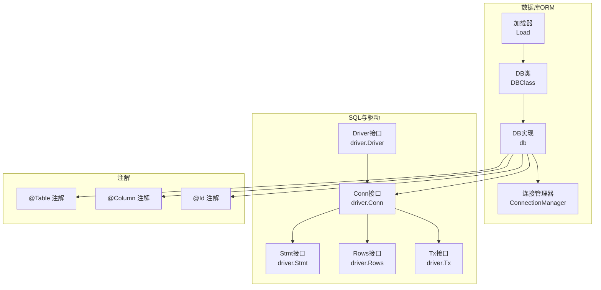
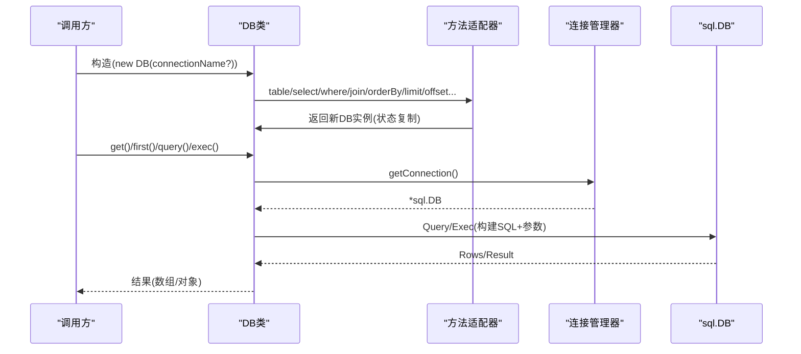
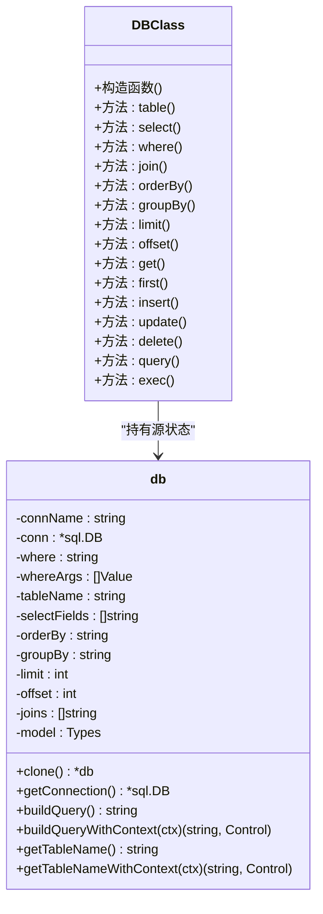
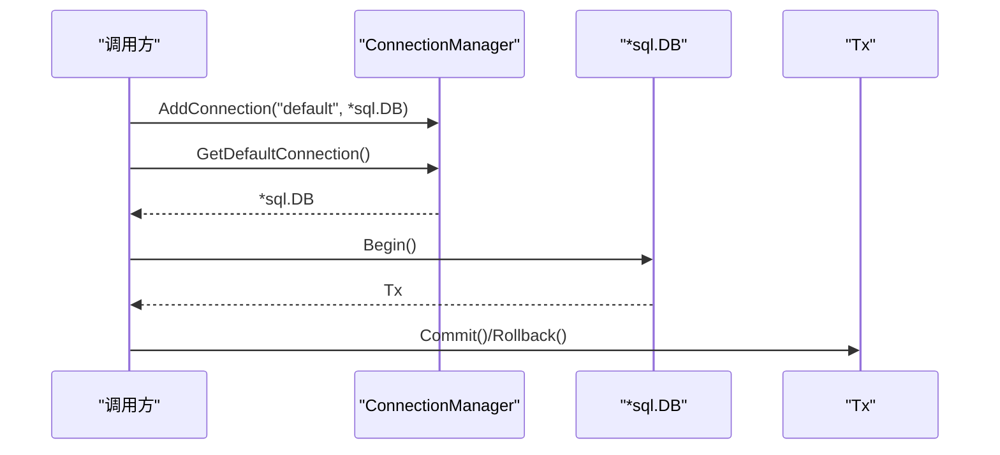
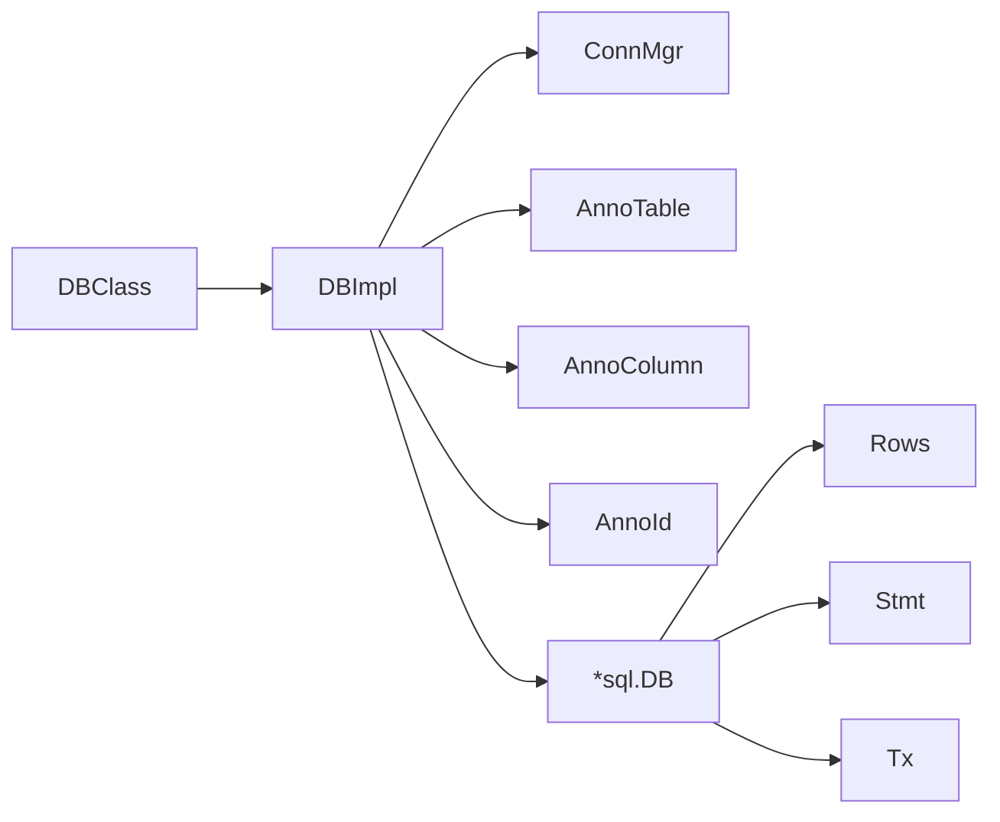

# 数据库ORM API

<cite>
**本文引用的文件**
- [std/database/db_class.go](file://std/database/db_class.go)
- [std/database/db.go](file://std/database/db.go)
- [std/database/connection_manager.go](file://std/database/connection_manager.go)
- [std/database/load.go](file://std/database/load.go)
- [std/database/db_construct.go](file://std/database/db_construct.go)
- [std/database/db_get.go](file://std/database/db_get.go)
- [std/database/db_first.go](file://std/database/db_first.go)
- [std/database/db_table.go](file://std/database/db_table.go)
- [std/database/db_select.go](file://std/database/db_select.go)
- [std/database/db_where.go](file://std/database/db_where.go)
- [std/database/db_join.go](file://std/database/db_join.go)
- [std/database/db_order_by.go](file://std/database/db_order_by.go)
- [std/database/db_limit.go](file://std/database/db_limit.go)
- [std/database/db_offset.go](file://std/database/db_offset.go)
- [std/database/db_insert.go](file://std/database/db_insert.go)
- [std/database/db_update.go](file://std/database/db_update.go)
- [std/database/db_delete.go](file://std/database/db_delete.go)
- [std/database/db_query.go](file://std/database/db_query.go)
- [std/database/db_exec.go](file://std/database/db_exec.go)
- [std/database/annotation/table_class.go](file://std/database/annotation/table_class.go)
- [std/database/annotation/column_class.go](file://std/database/annotation/column_class.go)
- [std/database/annotation/id_class.go](file://std/database/annotation/id_class.go)
- [std/database/driver/conn_class.go](file://std/database/driver/conn_class.go)
- [std/database/driver/driver_class.go](file://std/database/driver/driver_class.go)
- [std/database/driver/driver_open_method.go](file://std/database/driver/driver_open_method.go)
- [std/database/driver/stmt_class.go](file://std/database/driver/stmt_class.go)
- [std/database/driver/rows_class.go](file://std/database/driver/rows_class.go)
- [std/database/driver/result_class.go](file://std/database/driver/result_class.go)
- [std/database/driver/tx_class.go](file://std/database/driver/tx_class.go)
- [std/database/driver/conn_begin_method.go](file://std/database/driver/conn_begin_method.go)
- [std/database/driver/tx_commit_method.go](file://std/database/driver/tx_commit_method.go)
- [std/database/driver/tx_rollback_method.go](file://std/database/driver/tx_rollback_method.go)
</cite>

## 目录
1. [简介](#简介)
2. [项目结构](#项目结构)
3. [核心组件](#核心组件)
4. [架构总览](#架构总览)
5. [详细组件分析](#详细组件分析)
6. [依赖分析](#依赖分析)
7. [性能考虑](#性能考虑)
8. [故障排查指南](#故障排查指南)
9. [结论](#结论)
10. [附录](#附录)

## 简介
本文件为数据库ORM模块的完整API文档，覆盖以下方面：
- DB类的查询与链式构建方法：Table、Select、Where、Join、OrderBy、Limit、Offset等
- Query Builder的链式调用机制与返回值
- 连接管理与事务控制：Open、Begin、Commit、Rollback等
- SQL模块底层API：Conn、Stmt、Rows等类的方法
- 注解驱动的ORM：@Table、@Column、@Id等注解的使用
- 数据库驱动接口与自定义驱动开发
- 每个API的参数说明、返回值类型、使用示例与性能考虑
- 复杂查询、事务处理、批量操作等实际应用场景

## 项目结构
数据库ORM位于标准库std/database目录下，采用“类封装 + 方法适配器 + 连接管理 + 注解支持”的分层设计。核心入口通过加载器注册DB类、SQL工具与注解类，并向脚本域暴露连接管理函数。

图示来源
- [std/database/load.go:9-27](file://std/database/load.go#L9-L27)
- [std/database/db_class.go:7-168](file://std/database/db_class.go#L7-L168)
- [std/database/db.go:19-48](file://std/database/db.go#L19-L48)
- [std/database/connection_manager.go:8-66](file://std/database/connection_manager.go#L8-L66)

章节来源
- [std/database/load.go:9-27](file://std/database/load.go#L9-L27)
- [std/database/db_class.go:7-168](file://std/database/db_class.go#L7-L168)
- [std/database/db.go:19-48](file://std/database/db.go#L19-L48)
- [std/database/connection_manager.go:8-66](file://std/database/connection_manager.go#L8-L66)

## 核心组件
- DB类与方法适配器：DBClass负责声明方法集合，具体行为由各方法适配器实现（如DbGetMethod、DbFirstMethod等）。
- DB实现：db持有查询状态（where、whereArgs、tableName、selectFields、orderBy、groupBy、limit、offset、joins、model），并提供构建SQL与执行查询的能力。
- 连接管理：ConnectionManager提供全局连接注册、获取默认连接、列出连接等功能。
- 注解支持：通过注解类解析@Table、@Column、@Id等元信息，用于表名与列名映射。
- 底层驱动：Driver、Conn、Stmt、Rows、Tx接口抽象数据库交互；DB层通过连接管理器获取*sql.DB并委托底层执行。

章节来源
- [std/database/db_class.go:11-168](file://std/database/db_class.go#L11-L168)
- [std/database/db.go:19-48](file://std/database/db.go#L19-L48)
- [std/database/connection_manager.go:8-66](file://std/database/connection_manager.go#L8-L66)

## 架构总览
DB类通过方法适配器实现链式查询构建与执行。每次链式调用返回新的DB实例以保持不可变性，最终在执行方法（如get、first、query、exec）时构建SQL并交由连接管理器提供的连接执行。

图示来源
- [std/database/db_construct.go:12-20](file://std/database/db_construct.go#L12-L20)
- [std/database/db_table.go:14-30](file://std/database/db_table.go#L14-L30)
- [std/database/db_where.go:14-39](file://std/database/db_where.go#L14-L39)
- [std/database/db_get.go:15-69](file://std/database/db_get.go#L15-L69)
- [std/database/connection_manager.go:20-47](file://std/database/connection_manager.go#L20-L47)

## 详细组件分析

### DB类与方法适配器
DBClass声明了所有公开方法，包括：
- 查询构建：table、select、where、join、orderBy、groupBy、limit、offset
- 查询执行：get、first
- CRUD：insert、update、delete
- 原生SQL：query、exec

每个方法由独立的适配器实现，调用时复制当前db状态，设置新状态后返回新的DB实例，保证链式调用的不可变性与可组合性。

图示来源
- [std/database/db_class.go:11-168](file://std/database/db_class.go#L11-L168)
- [std/database/db.go:19-78](file://std/database/db.go#L19-L78)

章节来源
- [std/database/db_class.go:122-159](file://std/database/db_class.go#L122-L159)
- [std/database/db.go:50-78](file://std/database/db.go#L50-L78)

### 查询构建器：链式调用与返回值
- table(name): 设置显式表名，返回新的DB实例
- select(fields): 设置字段列表，返回新的DB实例
- where(sql, args?): 设置WHERE子句及参数，返回新的DB实例
- join(joinSql): 追加JOIN子句，返回新的DB实例
- orderBy(order): 设置ORDER BY，返回新的DB实例
- groupBy(group): 设置GROUP BY，返回新的DB实例
- limit(n): 设置LIMIT，返回新的DB实例
- offset(n): 设置OFFSET，返回新的DB实例

返回值均为Database\DB实例，支持继续链式调用。

章节来源
- [std/database/db_table.go:14-30](file://std/database/db_table.go#L14-L30)
- [std/database/db_select.go:15-38](file://std/database/db_select.go#L15-L38)
- [std/database/db_where.go:14-39](file://std/database/db_where.go#L14-L39)
- [std/database/db_join.go:14-30](file://std/database/db_join.go#L14-L30)
- [std/database/db_order_by.go:14-30](file://std/database/db_order_by.go#L14-L30)
- [std/database/db_limit.go:14-31](file://std/database/db_limit.go#L14-L31)
- [std/database/db_offset.go:14-31](file://std/database/db_offset.go#L14-L31)

### 查询执行：get、first
- get(): 构建SQL并执行查询，按模型类型扫描每行，返回对象数组
- first(): 构建SQL并执行查询，仅取首行，返回单个对象或null

两者的差异在于first会在未显式limit时自动追加LIMIT 1。

章节来源
- [std/database/db_get.go:15-69](file://std/database/db_get.go#L15-L69)
- [std/database/db_first.go:16-58](file://std/database/db_first.go#L16-L58)

### 原生SQL：query、exec
- query(sql, params?): 执行查询，返回行数组（每行对象包含列名键）
- exec(sql, params?): 执行非查询语句，返回包含rowsAffected、lastInsertId、success的对象

章节来源
- [std/database/db_query.go:16-97](file://std/database/db_query.go#L16-L97)
- [std/database/db_exec.go:15-76](file://std/database/db_exec.go#L15-L76)

### CRUD：insert、update、delete
- insert(data): 支持类实例或对象，自动进行注解列名映射，返回包含insertId、rowsAffected、success的对象
- update(data): 支持类实例或对象，忽略null值（保留0/false/空串），返回包含rowsAffected、success的对象
- delete(): 基于当前where条件删除，返回包含rowsAffected、success的对象

章节来源
- [std/database/db_insert.go:15-115](file://std/database/db_insert.go#L15-L115)
- [std/database/db_update.go:16-119](file://std/database/db_update.go#L16-L119)
- [std/database/db_delete.go:15-61](file://std/database/db_delete.go#L15-L61)

### 连接管理与事务控制
- 连接管理：通过全局ConnectionManager注册/获取连接，默认连接名为"default"
- 事务控制：底层驱动提供Conn.Begin/Commit/Rollback，DB层通过连接管理器获取*sql.DB并委托执行

图示来源
- [std/database/connection_manager.go:29-47](file://std/database/connection_manager.go#L29-L47)
- [std/database/driver/conn_begin_method.go:1-200](file://std/database/driver/conn_begin_method.go#L1-L200)
- [std/database/driver/tx_commit_method.go:1-200](file://std/database/driver/tx_commit_method.go#L1-L200)
- [std/database/driver/tx_rollback_method.go:1-200](file://std/database/driver/tx_rollback_method.go#L1-L200)

章节来源
- [std/database/connection_manager.go:29-65](file://std/database/connection_manager.go#L29-L65)
- [std/database/driver/conn_begin_method.go:1-200](file://std/database/driver/conn_begin_method.go#L1-L200)
- [std/database/driver/tx_commit_method.go:1-200](file://std/database/driver/tx_commit_method.go#L1-L200)
- [std/database/driver/tx_rollback_method.go:1-200](file://std/database/driver/tx_rollback_method.go#L1-L200)

### SQL模块底层API：Conn、Stmt、Rows
- Conn：提供Prepare、Begin、Close等方法，用于准备语句与开启事务
- Stmt：提供Exec、Query方法，绑定参数执行SQL
- Rows：提供Columns、Next、Scan、Close等方法，迭代扫描结果集
- Result：提供LastInsertId、RowsAffected等方法

章节来源
- [std/database/driver/conn_class.go:1-200](file://std/database/driver/conn_class.go#L1-L200)
- [std/database/driver/stmt_class.go:1-200](file://std/database/driver/stmt_class.go#L1-L200)
- [std/database/driver/rows_class.go:1-200](file://std/database/driver/rows_class.go#L1-L200)
- [std/database/driver/result_class.go:1-200](file://std/database/driver/result_class.go#L1-L200)

### 注解驱动的ORM：@Table、@Column、@Id
- @Table：用于类级别，声明表名；若未提供，可通过类名推导
- @Column：用于属性级别，声明数据库列名；若未提供，使用属性名
- @Id：用于标识主键属性（注解类存在）

DB在构建查询与CRUD时，优先使用注解映射的列名，确保模型与数据库字段的一致性。

章节来源
- [std/database/db.go:290-322](file://std/database/db.go#L290-L322)
- [std/database/db.go:341-396](file://std/database/db.go#L341-L396)
- [std/database/db.go:398-445](file://std/database/db.go#L398-L445)
- [std/database/annotation/table_class.go:1-200](file://std/database/annotation/table_class.go#L1-L200)
- [std/database/annotation/column_class.go:1-200](file://std/database/annotation/column_class.go#L1-L200)
- [std/database/annotation/id_class.go:1-200](file://std/database/annotation/id_class.go#L1-L200)

### 数据库驱动接口与自定义驱动开发
- Driver：定义Open方法创建连接
- Conn：定义Prepare、Begin、Close等
- Stmt：定义Exec、Query
- Rows：定义Columns、Next、Scan、Close
- Tx：定义Commit、Rollback

DB层通过连接管理器获取*sql.DB，从而复用标准库的数据库驱动生态；开发者可基于此接口扩展自定义驱动。

章节来源
- [std/database/driver/driver_class.go:1-200](file://std/database/driver/driver_class.go#L1-L200)
- [std/database/driver/driver_open_method.go:1-200](file://std/database/driver/driver_open_method.go#L1-L200)
- [std/database/driver/conn_class.go:1-200](file://std/database/driver/conn_class.go#L1-L200)
- [std/database/driver/stmt_class.go:1-200](file://std/database/driver/stmt_class.go#L1-L200)
- [std/database/driver/rows_class.go:1-200](file://std/database/driver/rows_class.go#L1-L200)
- [std/database/driver/result_class.go:1-200](file://std/database/driver/result_class.go#L1-L200)
- [std/database/driver/tx_class.go:1-200](file://std/database/driver/tx_class.go#L1-L200)

## 依赖分析
- DB类依赖ConnectionManager获取连接
- DB实现依赖注解解析与列名映射
- SQL执行依赖*sql.DB及其Rows/Result
- 事务控制依赖Conn.Begin/Tx.Commit/Rollback

图示来源
- [std/database/db_class.go:41-84](file://std/database/db_class.go#L41-L84)
- [std/database/db.go:80-101](file://std/database/db.go#L80-L101)
- [std/database/connection_manager.go:20-47](file://std/database/connection_manager.go#L20-L47)

章节来源
- [std/database/db_class.go:41-84](file://std/database/db_class.go#L41-L84)
- [std/database/db.go:80-101](file://std/database/db.go#L80-L101)
- [std/database/connection_manager.go:20-47](file://std/database/connection_manager.go#L20-L47)

## 性能考虑
- 链式构建：每次调用均复制内部状态，避免共享可变状态，适合并发场景；但频繁链式调用会产生临时对象，建议在热点路径上合并条件
- SQL生成：buildQuery/buildQueryWithContext按顺序拼接子句，注意避免重复设置limit/offset导致的额外开销
- 参数绑定：统一转换为Go类型后传入底层驱动，减少类型判断成本
- 查询优化：优先使用索引列作为where条件；合理使用select字段列表减少I/O；对大数据量分页使用合适的limit/offset
- 事务：批量写入建议使用事务包裹，减少往返与锁竞争
- 连接池：通过*sql.DB复用连接池，避免频繁打开/关闭连接

## 故障排查指南
- 数据库连接不可用：检查ConnectionManager是否已注册默认连接；确认驱动可用
- 表名解析失败：若未显式设置表名，需确保模型类存在且可被VM加载；注解@Table缺失时回退至类名推导
- 列名映射异常：检查@column注解是否正确配置；属性与列名不一致时以注解为准
- 查询失败：查看query/exec返回的错误信息与SQL片段；核对参数数量与类型
- 事务未生效：确认Begin/Commit/Rollback调用顺序与异常处理；确保使用同一连接

章节来源
- [std/database/db_get.go:18-20](file://std/database/db_get.go#L18-L20)
- [std/database/db_first.go:18-21](file://std/database/db_first.go#L18-L21)
- [std/database/db_query.go:52-54](file://std/database/db_query.go#L52-L54)
- [std/database/db_exec.go:51-54](file://std/database/db_exec.go#L51-L54)
- [std/database/db.go:290-322](file://std/database/db.go#L290-L322)

## 结论
该ORM模块以DB类为核心，结合方法适配器实现链式查询构建，配合注解驱动的表/列映射与底层*sql.DB执行，形成简洁易用的查询与CRUD能力。通过ConnectionManager与驱动接口，具备良好的扩展性与兼容性。建议在生产环境中结合事务、索引与分页策略，获得更优的性能与稳定性。

## 附录

### API速查：DB类方法
- table(name: string): 返回Database\DB
- select(fields: string): 返回Database\DB
- where(sql: string, args?: array): 返回Database\DB
- join(joinSql: string): 返回Database\DB
- orderBy(order: string): 返回Database\DB
- groupBy(group: string): 返回Database\DB
- limit(n: int): 返回Database\DB
- offset(n: int): 返回Database\DB
- get(): 返回数组
- first(): 返回<T>|null
- insert(data: object|class): 返回包含insertId、rowsAffected、success的对象
- update(data: object|class): 返回包含rowsAffected、success的对象
- delete(): 返回包含rowsAffected、success的对象
- query(sql: string, params?: array): 返回行数组
- exec(sql: string, params?: array): 返回包含rowsAffected、lastInsertId、success的对象

章节来源
- [std/database/db_table.go:56-58](file://std/database/db_table.go#L56-L58)
- [std/database/db_select.go:64-66](file://std/database/db_select.go#L64-L66)
- [std/database/db_where.go:67-70](file://std/database/db_where.go#L67-L70)
- [std/database/db_join.go:56-58](file://std/database/db_join.go#L56-L58)
- [std/database/db_order_by.go:56-58](file://std/database/db_order_by.go#L56-L58)
- [std/database/db_limit.go:58-60](file://std/database/db_limit.go#L58-L60)
- [std/database/db_offset.go:58-60](file://std/database/db_offset.go#L58-L60)
- [std/database/db_get.go:92-94](file://std/database/db_get.go#L92-L94)
- [std/database/db_first.go:129-132](file://std/database/db_first.go#L129-L132)
- [std/database/db_insert.go:141-143](file://std/database/db_insert.go#L141-L143)
- [std/database/db_update.go:145-147](file://std/database/db_update.go#L145-L147)
- [std/database/db_delete.go:83-85](file://std/database/db_delete.go#L83-L85)
- [std/database/db_query.go:125-127](file://std/database/db_query.go#L125-L127)
- [std/database/db_exec.go:104-106](file://std/database/db_exec.go#L104-L106)

### 使用示例（步骤化）
- 复杂查询
  - 步骤1：new DB() 或 new DB("连接名")
  - 步骤2：table("users").select("id,name,email").join("left join profiles on users.id=profiles.user_id").where("users.status=?", ["active"]).groupBy("users.status").orderBy("users.created_at desc").limit(10).offset(20)
  - 步骤3：get() 获取数组，或 first() 获取单个对象
- 事务处理
  - 步骤1：conn := GetConnectionManager().GetDefaultConnection()
  - 步骤2：tx := conn.Begin()
  - 步骤3：执行多条insert/update/delete
  - 步骤4：tx.Commit() 或 tx.Rollback()
- 批量操作
  - 步骤1：将多个对象放入数组
  - 步骤2：循环调用insert或update
  - 步骤3：在事务中提交

章节来源
- [std/database/db_table.go:14-30](file://std/database/db_table.go#L14-L30)
- [std/database/db_select.go:15-38](file://std/database/db_select.go#L15-L38)
- [std/database/db_join.go:14-30](file://std/database/db_join.go#L14-L30)
- [std/database/db_where.go:14-39](file://std/database/db_where.go#L14-L39)
- [std/database/db_group_by.go:1-200](file://std/database/db_group_by.go#L1-L200)
- [std/database/db_order_by.go:14-30](file://std/database/db_order_by.go#L14-L30)
- [std/database/db_limit.go:14-31](file://std/database/db_limit.go#L14-L31)
- [std/database/db_offset.go:14-31](file://std/database/db_offset.go#L14-L31)
- [std/database/db_get.go:15-69](file://std/database/db_get.go#L15-L69)
- [std/database/db_first.go:16-58](file://std/database/db_first.go#L16-L58)
- [std/database/connection_manager.go:29-47](file://std/database/connection_manager.go#L29-L47)
- [std/database/driver/conn_begin_method.go:1-200](file://std/database/driver/conn_begin_method.go#L1-L200)
- [std/database/driver/tx_commit_method.go:1-200](file://std/database/driver/tx_commit_method.go#L1-L200)
- [std/database/driver/tx_rollback_method.go:1-200](file://std/database/driver/tx_rollback_method.go#L1-L200)