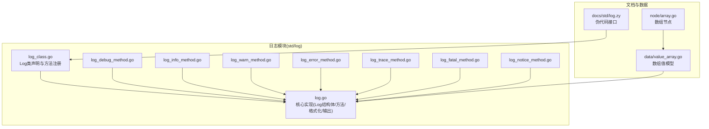
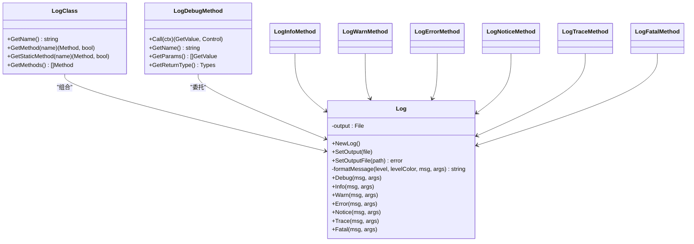
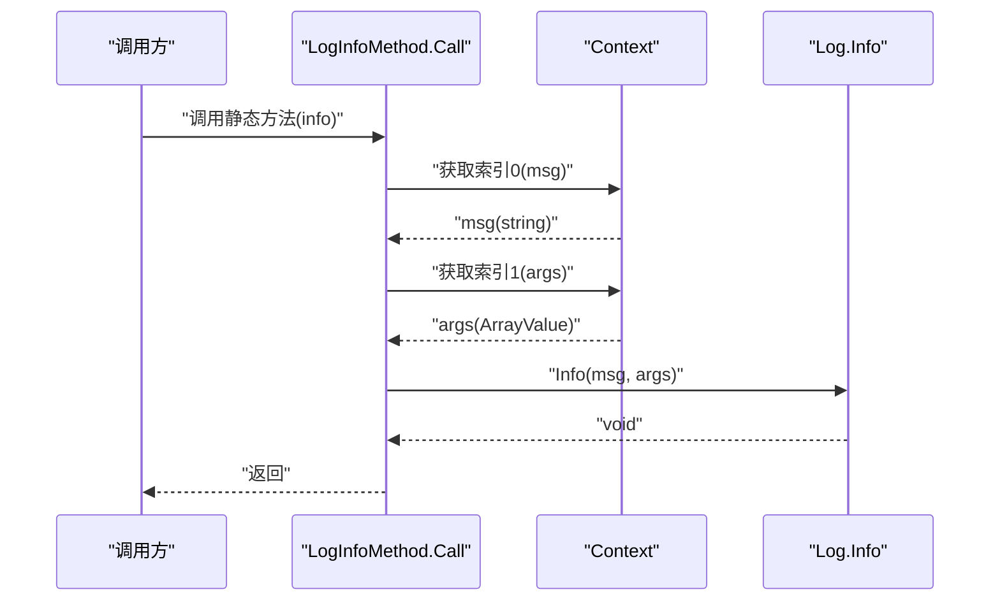
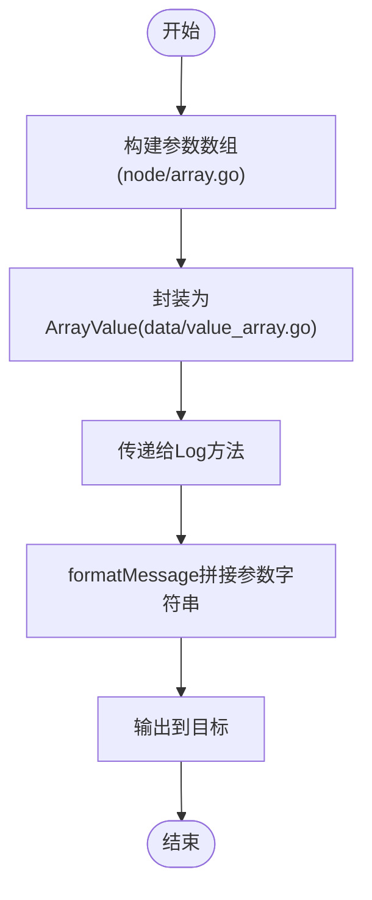
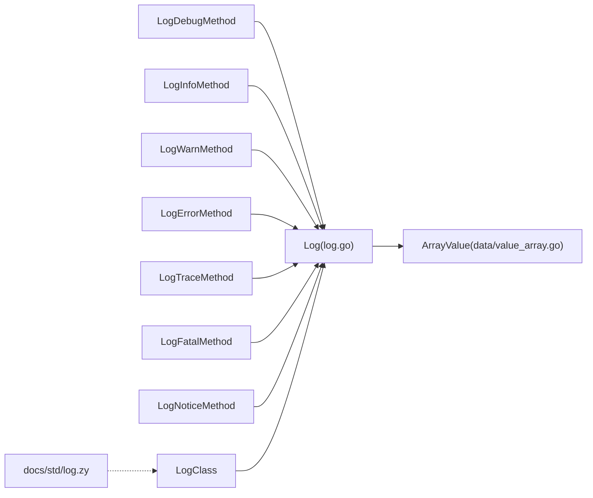
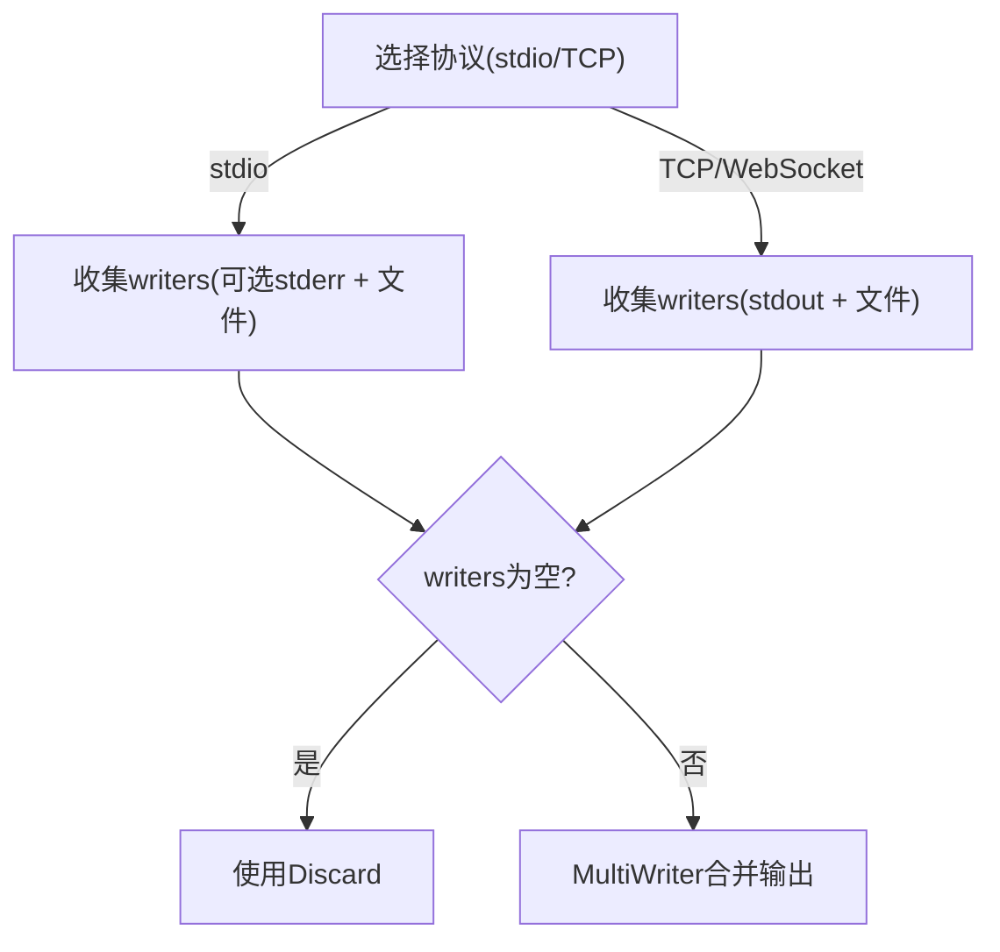

# 日志系统API

<cite>
**本文引用的文件**
- [std/log/log.go](file://std/log/log.go)
- [std/log/log_class.go](file://std/log/log_class.go)
- [std/log/log_debug_method.go](file://std/log/log_debug_method.go)
- [std/log/log_info_method.go](file://std/log/log_info_method.go)
- [std/log/log_warn_method.go](file://std/log/log_warn_method.go)
- [std/log/log_error_method.go](file://std/log/log_error_method.go)
- [std/log/log_trace_method.go](file://std/log/log_trace_method.go)
- [std/log/log_fatal_method.go](file://std/log/log_fatal_method.go)
- [std/log/log_notice_method.go](file://std/log/log_notice_method.go)
- [docs/std/log.zy](file://docs/std/log.zy)
- [data/value_array.go](file://data/value_array.go)
- [node/array.go](file://node/array.go)
- [tools/lsp/main.go](file://tools/lsp/main.go)
</cite>

## 目录
1. [简介](#简介)
2. [项目结构](#项目结构)
3. [核心组件](#核心组件)
4. [架构总览](#架构总览)
5. [详细组件分析](#详细组件分析)
6. [依赖分析](#依赖分析)
7. [性能考虑](#性能考虑)
8. [故障排除指南](#故障排除指南)
9. [结论](#结论)
10. [附录](#附录)

## 简介
本文件为日志系统模块的完整API文档，覆盖Log类的日志级别方法（Debug、Info、Warn、Error、Trace、Fatal、Notice）、参数与使用方式、日志格式化选项、输出目标配置、级别过滤与调试模式、文件管理与轮转策略、结构化日志与上下文信息添加，并提供错误追踪、性能监控、调试辅助等实际应用场景及配置示例与故障排除建议。

## 项目结构
日志系统位于标准库模块std/log中，采用“核心实现 + 方法适配 + 文档伪代码”的组织方式：
- 核心实现：Log结构体与各日志级别方法、输出目标设置、消息格式化
- 方法适配：LogXxxMethod系列，将静态方法调用桥接到Log实例
- 文档伪代码：docs/std/log.zy提供对外API的伪代码接口定义
- 数据结构：data/value_array.go与node/array.go支撑参数数组的构造与传递

**图表来源**
- [std/log/log.go:24-108](file://std/log/log.go#L24-L108)
- [std/log/log_class.go:8-112](file://std/log/log_class.go#L8-L112)
- [std/log/log_debug_method.go:11-61](file://std/log/log_debug_method.go#L11-L61)
- [std/log/log_info_method.go:11-61](file://std/log/log_info_method.go#L11-L61)
- [std/log/log_warn_method.go:11-60](file://std/log/log_warn_method.go#L11-L60)
- [std/log/log_error_method.go:11-61](file://std/log/log_error_method.go#L11-L61)
- [std/log/log_trace_method.go:11-61](file://std/log/log_trace_method.go#L11-L61)
- [std/log/log_fatal_method.go:11-60](file://std/log/log_fatal_method.go#L11-L60)
- [std/log/log_notice_method.go:11-61](file://std/log/log_notice_method.go#L11-L61)
- [docs/std/log.zy:15-75](file://docs/std/log.zy#L15-L75)
- [data/value_array.go:32-162](file://data/value_array.go#L32-L162)
- [node/array.go:7-48](file://node/array.go#L7-L48)

**章节来源**
- [std/log/log.go:24-108](file://std/log/log.go#L24-L108)
- [std/log/log_class.go:8-112](file://std/log/log_class.go#L8-L112)
- [docs/std/log.zy:15-75](file://docs/std/log.zy#L15-L75)
- [data/value_array.go:32-162](file://data/value_array.go#L32-L162)
- [node/array.go:7-48](file://node/array.go#L7-L48)

## 核心组件
- Log结构体：封装输出目标与格式化逻辑，提供各日志级别方法
- 输出目标：默认输出到标准输出；支持设置到文件
- 日志级别：Debug、Info、Warn、Error、Trace、Fatal、Notice
- 参数模型：使用data.ArrayValue承载可变参数，支持结构化上下文
- 方法适配：LogXxxMethod系列将静态方法调用映射到Log实例方法

关键能力与限制
- 支持彩色终端输出（不同级别颜色区分）
- 消息格式包含级别、时间戳、消息正文与可选参数字符串
- Fatal级别会终止进程
- 未内置级别过滤与调试模式开关；可通过外部工具或包装器实现

**章节来源**
- [std/log/log.go:24-108](file://std/log/log.go#L24-L108)
- [std/log/log_class.go:21-112](file://std/log/log_class.go#L21-L112)
- [std/log/log_debug_method.go:11-61](file://std/log/log_debug_method.go#L11-L61)
- [std/log/log_info_method.go:11-61](file://std/log/log_info_method.go#L11-L61)
- [std/log/log_warn_method.go:11-60](file://std/log/log_warn_method.go#L11-L60)
- [std/log/log_error_method.go:11-61](file://std/log/log_error_method.go#L11-L61)
- [std/log/log_trace_method.go:11-61](file://std/log/log_trace_method.go#L11-L61)
- [std/log/log_fatal_method.go:11-60](file://std/log/log_fatal_method.go#L11-L60)
- [std/log/log_notice_method.go:11-61](file://std/log/log_notice_method.go#L11-L61)

## 架构总览
日志模块采用“核心实现 + 方法适配 + 文档伪代码”的分层设计：
- 核心实现层：log.go提供Log结构体与方法，负责格式化与输出
- 方法适配层：各LogXxxMethod实现调用约定，将静态方法调用转发至Log实例
- 文档伪代码层：docs/std/log.zy描述对外API形态，便于集成与IDE提示
- 数据结构层：data/value_array.go与node/array.go支撑参数数组的构建与传递

**图表来源**
- [std/log/log.go:24-108](file://std/log/log.go#L24-L108)
- [std/log/log_class.go:21-112](file://std/log/log_class.go#L21-L112)
- [std/log/log_debug_method.go:11-61](file://std/log/log_debug_method.go#L11-L61)
- [std/log/log_info_method.go:11-61](file://std/log/log_info_method.go#L11-L61)
- [std/log/log_warn_method.go:11-60](file://std/log/log_warn_method.go#L11-L60)
- [std/log/log_error_method.go:11-61](file://std/log/log_error_method.go#L11-L61)
- [std/log/log_trace_method.go:11-61](file://std/log/log_trace_method.go#L11-L61)
- [std/log/log_fatal_method.go:11-60](file://std/log/log_fatal_method.go#L11-L60)
- [std/log/log_notice_method.go:11-61](file://std/log/log_notice_method.go#L11-L61)

## 详细组件分析

### Log结构体与核心方法
- 结构体字段：output为输出文件指针，默认指向标准输出
- 工厂函数：NewLog创建默认实例
- 输出目标设置：
  - SetOutput：设置任意os.File作为输出
  - SetOutputFile：以追加模式打开文件作为输出，失败返回错误
- 消息格式化：formatMessage统一格式，包含级别、时间戳、消息正文与参数字符串
- 日志级别方法：
  - Debug：蓝色级别标识
  - Info：绿色级别标识
  - Warn：黄色级别标识
  - Error：红色级别标识
  - Notice：紫色级别标识
  - Trace：青色级别标识
  - Fatal：粗体红色级别标识后终止进程

参数与返回
- 参数：msg为字符串，args为data.ArrayValue（可变参数数组）
- 返回：各方法返回void（在运行时表现为无返回值）

使用场景与最佳实践
- Debug：开发阶段的详细流程与变量值跟踪
- Info：常规业务事件与状态变更
- Warn：潜在问题但可恢复的情况
- Error：异常或错误发生，需关注
- Notice：重要但非错误的信息
- Trace：极细粒度的调试信息（可能产生大量输出）
- Fatal：不可恢复错误，记录后立即退出

错误处理
- SetOutputFile失败时返回错误，调用方应妥善处理
- Fatal方法在输出后调用os.Exit(1)，确保进程退出

**章节来源**
- [std/log/log.go:24-108](file://std/log/log.go#L24-L108)
- [data/value_array.go:32-162](file://data/value_array.go#L32-L162)

### 方法适配层（LogXxxMethod）
- 统一行为：从上下文ctx按索引取参，校验参数存在性，转换为期望类型后调用Log实例方法
- 参数约定：第一个参数为msg（字符串），第二个参数为args（数组）
- 可变参数：args支持零个或多个附加参数，最终由Log.formatMessage拼接为字符串
- 返回类型：均为void

典型调用序列（以LogInfoMethod为例）

**图表来源**
- [std/log/log_info_method.go:15-29](file://std/log/log_info_method.go#L15-L29)
- [std/log/log.go:93-96](file://std/log/log.go#L93-L96)

**章节来源**
- [std/log/log_debug_method.go:15-29](file://std/log/log_debug_method.go#L15-L29)
- [std/log/log_info_method.go:15-29](file://std/log/log_info_method.go#L15-L29)
- [std/log/log_warn_method.go:15-27](file://std/log/log_warn_method.go#L15-L27)
- [std/log/log_error_method.go:15-29](file://std/log/log_error_method.go#L15-L29)
- [std/log/log_trace_method.go:15-29](file://std/log/log_trace_method.go#L15-L29)
- [std/log/log_fatal_method.go:15-27](file://std/log/log_fatal_method.go#L15-L27)
- [std/log/log_notice_method.go:15-29](file://std/log/log_notice_method.go#L15-L29)

### 文档伪代码接口
- Log类提供public static方法：debug、info、warn、error、notice、trace、fatal
- 参数：第一个为msg（字符串），其余为可变参数（...$args）
- 作用：对外暴露API形态，便于IDE提示与集成

**章节来源**
- [docs/std/log.zy:15-75](file://docs/std/log.zy#L15-L75)

### 参数数组与结构化上下文
- 数组节点：node/array.go支持数组字面量构建与展开运算符
- 数组值：data/value_array.go提供ArrayValue，支持Assemble为字符串、迭代、方法集合等
- 上下文信息：通过args传入键值对或对象，最终由formatMessage拼接为字符串

**图表来源**
- [node/array.go:12-47](file://node/array.go#L12-L47)
- [data/value_array.go](file://data/value_array.go#L7, L67-L78, L155-L162)
- [std/log/log.go:52-65](file://std/log/log.go#L52-L65)

**章节来源**
- [node/array.go:12-47](file://node/array.go#L12-L47)
- [data/value_array.go](file://data/value_array.go#L7, L67-L78, L155-L162)
- [std/log/log.go:52-65](file://std/log/log.go#L52-L65)

## 依赖分析
- Log依赖data.ArrayValue进行参数处理
- LogXxxMethod依赖data.Context取参与utils.NewThrow抛出参数缺失错误
- LogClass聚合Log实例与各方法适配器
- 文档伪代码与实现解耦，便于维护与扩展

**图表来源**
- [std/log/log.go:24-108](file://std/log/log.go#L24-L108)
- [std/log/log_class.go:8-19](file://std/log/log_class.go#L8-L19)
- [std/log/log_debug_method.go:11-13](file://std/log/log_debug_method.go#L11-L13)
- [std/log/log_info_method.go:11-13](file://std/log/log_info_method.go#L11-L13)
- [std/log/log_warn_method.go:11-13](file://std/log/log_warn_method.go#L11-L13)
- [std/log/log_error_method.go:11-13](file://std/log/log_error_method.go#L11-L13)
- [std/log/log_trace_method.go:11-13](file://std/log/log_trace_method.go#L11-L13)
- [std/log/log_fatal_method.go:11-13](file://std/log/log_fatal_method.go#L11-L13)
- [std/log/log_notice_method.go:11-13](file://std/log/log_notice_method.go#L11-L13)
- [docs/std/log.zy:15-75](file://docs/std/log.zy#L15-L75)

**章节来源**
- [std/log/log.go:24-108](file://std/log/log.go#L24-L108)
- [std/log/log_class.go:8-19](file://std/log/log_class.go#L8-L19)
- [std/log/log_debug_method.go:11-13](file://std/log/log_debug_method.go#L11-L13)
- [std/log/log_info_method.go:11-13](file://std/log/log_info_method.go#L11-L13)
- [std/log/log_warn_method.go:11-13](file://std/log/log_warn_method.go#L11-L13)
- [std/log/log_error_method.go:11-13](file://std/log/log_error_method.go#L11-L13)
- [std/log/log_trace_method.go:11-13](file://std/log/log_trace_method.go#L11-L13)
- [std/log/log_fatal_method.go:11-13](file://std/log/log_fatal_method.go#L11-L13)
- [std/log/log_notice_method.go:11-13](file://std/log/log_notice_method.go#L11-L13)
- [docs/std/log.zy:15-75](file://docs/std/log.zy#L15-L75)

## 性能考虑
- 输出路径：默认输出到标准输出；若切换到文件，注意磁盘I/O开销与同步策略
- 彩色输出：在非TTY环境可能被忽略，避免不必要的ANSI转义开销
- 参数拼接：formatMessage会将args.AsString()拼接到消息末尾，参数过多会增加字符串拼接成本
- Fatal路径：直接退出进程，避免后续清理逻辑执行

[本节为通用指导，无需特定文件引用]

## 故障排除指南
常见问题与解决思路
- 参数缺失：LogXxxMethod在索引0或1缺失时会抛出参数缺失错误。请确保传入msg与args
- 文件输出失败：SetOutputFile返回错误时，请检查文件路径权限与目录是否存在
- 输出目标异常：若需要同时输出到控制台与文件，可参考工具链中的多路写入模式（例如LSP工具的多Writer策略）

参考实现模式（多路输出）

**图表来源**
- [tools/lsp/main.go:100-130](file://tools/lsp/main.go#L100-L130)

**章节来源**
- [std/log/log_debug_method.go:17-25](file://std/log/log_debug_method.go#L17-L25)
- [std/log/log_info_method.go:17-25](file://std/log/log_info_method.go#L17-L25)
- [std/log/log_warn_method.go:16-24](file://std/log/log_warn_method.go#L16-L24)
- [std/log/log_error_method.go:17-25](file://std/log/log_error_method.go#L17-L25)
- [std/log/log_trace_method.go:17-25](file://std/log/log_trace_method.go#L17-L25)
- [std/log/log_fatal_method.go:16-24](file://std/log/log_fatal_method.go#L16-L24)
- [std/log/log_notice_method.go:17-25](file://std/log/log_notice_method.go#L17-L25)
- [std/log/log.go:42-49](file://std/log/log.go#L42-L49)
- [tools/lsp/main.go:100-130](file://tools/lsp/main.go#L100-L130)

## 结论
日志系统模块提供了简洁高效的日志记录能力，支持多种日志级别、彩色输出与灵活的输出目标配置。通过方法适配层与文档伪代码，实现了清晰的API形态与良好的可扩展性。对于更高级的需求（如级别过滤、调试模式、文件轮转），可在上层通过包装器或外部工具实现。

[本节为总结性内容，无需特定文件引用]

## 附录

### API定义与参数说明
- Log类静态方法
  - debug(msg, ...args): 记录调试信息
  - info(msg, ...args): 记录一般信息
  - warn(msg, ...args): 记录警告信息
  - error(msg, ...args): 记录错误信息
  - notice(msg, ...args): 记录通知信息
  - trace(msg, ...args): 记录跟踪信息
  - fatal(msg, ...args): 记录致命错误并退出

参数
- msg: 字符串，必填
- args: 可变参数数组，可选，用于结构化上下文

返回
- 所有方法返回void

使用场景与最佳实践
- Debug：开发与本地调试，记录变量、路径与中间结果
- Info：生产环境常规事件，如请求到达、任务开始/结束
- Warn：可恢复异常或潜在风险，如降级策略触发
- Error：异常或失败，需人工介入
- Notice：重要但非错误信息，如配置变更
- Trace：极细粒度调试，谨慎使用
- Fatal：不可恢复错误，记录后立即退出

错误追踪与性能监控
- 错误追踪：结合args记录上下文（用户ID、请求ID、参数快照），便于定位问题
- 性能监控：在关键路径使用Info/Debug记录耗时与指标，避免在高频路径使用Trace

日志配置示例（概念性）
- 输出到文件：调用SetOutputFile设置日志文件路径
- 多路输出：在应用层组合多个Writer（如stdout与文件），实现同时输出
- 级别过滤与调试模式：在应用层封装Log，增加级别过滤与调试开关

[本节为概念性内容，无需特定文件引用]