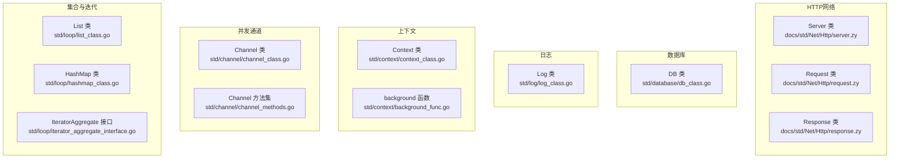
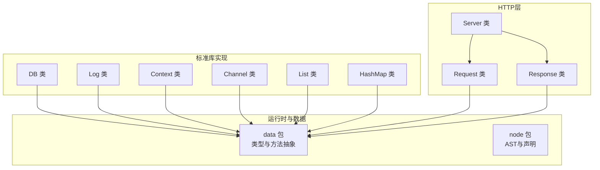
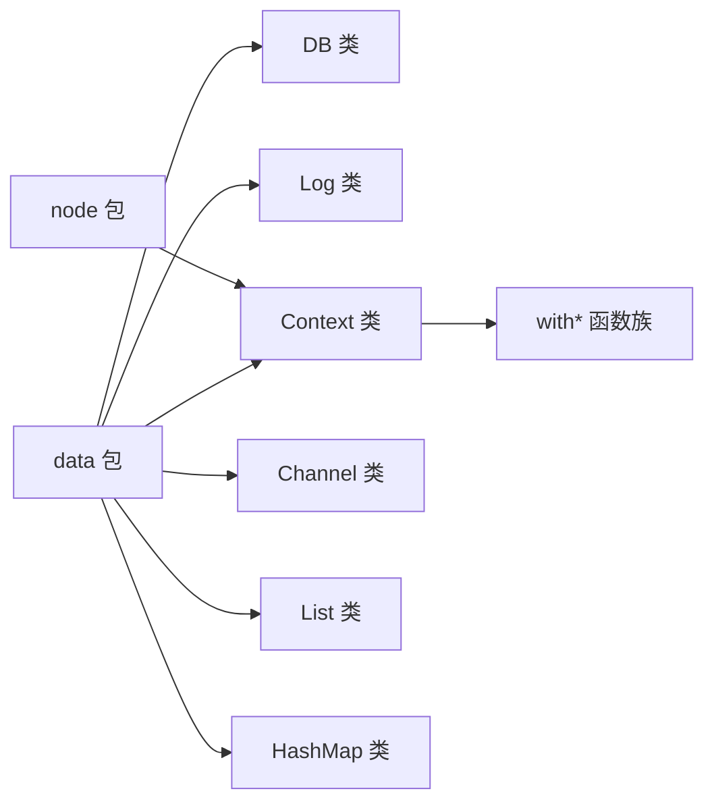

# 标准库API

<cite>
**本文引用的文件**
- [std/database/db_class.go](file://std/database/db_class.go)
- [std/log/log_class.go](file://std/log/log_class.go)
- [docs/std/Net/Http/server.zy](file://docs/std/Net/Http/server.zy)
- [docs/std/Net/Http/request.zy](file://docs/std/Net/Http/request.zy)
- [docs/std/Net/Http/response.zy](file://docs/std/Net/Http/response.zy)
- [std/context/context_class.go](file://std/context/context_class.go)
- [std/context/background_func.go](file://std/context/background_func.go)
- [std/channel/channel_class.go](file://std/channel/channel_class.go)
- [std/channel/channel_methods.go](file://std/channel/channel_methods.go)
- [std/loop/hashmap_class.go](file://std/loop/hashmap_class.go)
- [std/loop/list_class.go](file://std/loop/list_class.go)
- [std/loop/iterator_aggregate_interface.go](file://std/loop/iterator_aggregate_interface.go)
</cite>

## 目录
1. [简介](#简介)
2. [项目结构](#项目结构)
3. [核心组件](#核心组件)
4. [架构总览](#架构总览)
5. [详细组件分析](#详细组件分析)
6. [依赖分析](#依赖分析)
7. [性能考虑](#性能考虑)
8. [故障排查指南](#故障排查指南)
9. [结论](#结论)
10. [附录](#附录)

## 简介
本文件为标准库模块的完整API参考文档，覆盖以下子系统：
- HTTP服务器API：Server类、Request类、ResponseWriter类及其方法
- 数据库ORM API：DB类、查询构建器方法、连接管理
- 日志系统API：Log类的日志级别方法
- Context API：Context类及with*函数族
- Channel API：Channel类及并发通信方法
- Loop API：Iterator接口与集合类（List、HashMap）方法

文档为每个类与方法提供参数说明、返回值描述与使用示例路径，帮助开发者快速上手与正确使用。

## 项目结构
标准库API分布在多个子目录中，按功能域组织：
- HTTP网络：docs/std/Net/Http/*.zy（伪代码接口定义）
- 数据库：std/database/*
- 日志：std/log/*
- 上下文：std/context/*
- 并发通道：std/channel/*
- 集合与迭代：std/loop/*

**图表来源**
- [docs/std/Net/Http/server.zy:1-109](file://docs/std/Net/Http/server.zy#L1-L109)
- [docs/std/Net/Http/request.zy:1-197](file://docs/std/Net/Http/request.zy#L1-L197)
- [docs/std/Net/Http/response.zy:1-53](file://docs/std/Net/Http/response.zy#L1-L53)
- [std/database/db_class.go:1-168](file://std/database/db_class.go#L1-L168)
- [std/log/log_class.go:1-113](file://std/log/log_class.go#L1-L113)
- [std/context/context_class.go:1-64](file://std/context/context_class.go#L1-L64)
- [std/context/background_func.go:1-30](file://std/context/background_func.go#L1-L30)
- [std/channel/channel_class.go:1-99](file://std/channel/channel_class.go#L1-L99)
- [std/channel/channel_methods.go:1-300](file://std/channel/channel_methods.go#L1-L300)
- [std/loop/list_class.go:1-324](file://std/loop/list_class.go#L1-L324)
- [std/loop/hashmap_class.go:1-331](file://std/loop/hashmap_class.go#L1-L331)
- [std/loop/iterator_aggregate_interface.go:1-18](file://std/loop/iterator_aggregate_interface.go#L1-L18)

**章节来源**
- [docs/std/Net/Http/server.zy:1-109](file://docs/std/Net/Http/server.zy#L1-L109)
- [docs/std/Net/Http/request.zy:1-197](file://docs/std/Net/Http/request.zy#L1-L197)
- [docs/std/Net/Http/response.zy:1-53](file://docs/std/Net/Http/response.zy#L1-L53)
- [std/database/db_class.go:1-168](file://std/database/db_class.go#L1-L168)
- [std/log/log_class.go:1-113](file://std/log/log_class.go#L1-L113)
- [std/context/context_class.go:1-64](file://std/context/context_class.go#L1-L64)
- [std/context/background_func.go:1-30](file://std/context/background_func.go#L1-L30)
- [std/channel/channel_class.go:1-99](file://std/channel/channel_class.go#L1-L99)
- [std/channel/channel_methods.go:1-300](file://std/channel/channel_methods.go#L1-L300)
- [std/loop/list_class.go:1-324](file://std/loop/list_class.go#L1-L324)
- [std/loop/hashmap_class.go:1-331](file://std/loop/hashmap_class.go#L1-L331)
- [std/loop/iterator_aggregate_interface.go:1-18](file://std/loop/iterator_aggregate_interface.go#L1-L18)

## 核心组件
本节概述各模块的核心类与职责：
- HTTP服务器：Server负责路由注册与中间件；Request提供请求上下文与解析工具；Response提供响应写入与头部操作。
- 数据库：DB类封装查询构建器与原生SQL执行，支持连接管理与事务。
- 日志：Log类提供多级别日志输出方法。
- Context：Context类封装超时、取消、错误与值传递；background函数提供根上下文。
- Channel：Channel类提供发送、接收、关闭、长度与容量查询等并发通信方法。
- Loop：List与HashMap实现泛型集合与迭代器接口，支持常用集合操作。

**章节来源**
- [docs/std/Net/Http/server.zy:17-107](file://docs/std/Net/Http/server.zy#L17-L107)
- [docs/std/Net/Http/request.zy:17-195](file://docs/std/Net/Http/request.zy#L17-L195)
- [docs/std/Net/Http/response.zy:17-51](file://docs/std/Net/Http/response.zy#L17-L51)
- [std/database/db_class.go:11-167](file://std/database/db_class.go#L11-L167)
- [std/log/log_class.go:21-112](file://std/log/log_class.go#L21-L112)
- [std/context/context_class.go:20-63](file://std/context/context_class.go#L20-L63)
- [std/context/background_func.go:8-29](file://std/context/background_func.go#L8-L29)
- [std/channel/channel_class.go:8-93](file://std/channel/channel_class.go#L8-L93)
- [std/channel/channel_methods.go:11-300](file://std/channel/channel_methods.go#L11-L300)
- [std/loop/list_class.go:142-324](file://std/loop/list_class.go#L142-L324)
- [std/loop/hashmap_class.go:149-331](file://std/loop/hashmap_class.go#L149-L331)

## 架构总览
标准库通过“类+方法集”的方式对外暴露API，配合伪代码接口定义（HTTP部分）与Go实现（其他模块）共同构成完整的API体系。HTTP模块以伪代码形式给出接口签名，便于跨语言一致性；其余模块以Go实现具体行为。

**图表来源**
- [docs/std/Net/Http/server.zy:17-107](file://docs/std/Net/Http/server.zy#L17-L107)
- [docs/std/Net/Http/request.zy:17-195](file://docs/std/Net/Http/request.zy#L17-L195)
- [docs/std/Net/Http/response.zy:17-51](file://docs/std/Net/Http/response.zy#L17-L51)
- [std/database/db_class.go:11-167](file://std/database/db_class.go#L11-L167)
- [std/log/log_class.go:21-112](file://std/log/log_class.go#L21-L112)
- [std/context/context_class.go:20-63](file://std/context/context_class.go#L20-L63)
- [std/channel/channel_class.go:8-93](file://std/channel/channel_class.go#L8-L93)
- [std/loop/list_class.go:142-324](file://std/loop/list_class.go#L142-L324)
- [std/loop/hashmap_class.go:149-331](file://std/loop/hashmap_class.go#L149-L331)

## 详细组件分析

### HTTP服务器API

#### Server 类
- 方法概览
  - get(path, handle): 注册GET路由
  - post(path, handle): 注册POST路由
  - put(path, handle): 注册PUT路由
  - delete(path, handle): 注册DELETE路由
  - head(path, handle): 注册HEAD路由
  - options(path, handle): 注册OPTIONS路由
  - patch(path, handle): 注册PATCH路由
  - trace(path, handle): 注册TRACE路由
  - group(prefix): 返回子Server，支持路径前缀分组
  - middleware(mid): 注册中间件
  - run(): 启动服务
- 参数说明
  - path: 字符串，路由路径
  - handle: 回调处理器
  - prefix: 字符串，路由前缀
  - mid: 中间件处理器
- 返回值
  - group(): 返回Server实例
  - 其他方法通常无显式返回或返回void
- 使用示例
  - 参考示例路径：examples/http/http.zy
  - 示例路径：examples/html/main.zy

**章节来源**
- [docs/std/Net/Http/server.zy:17-107](file://docs/std/Net/Http/server.zy#L17-L107)

#### Request 类
- 静态方法概览
  - userAgent(): 获取User-Agent
  - cookiesNamed(name): 获取命名Cookie
  - pathValue(key): 获取路径参数值
  - setPathValue(key, val): 设置路径参数
  - context(): 返回请求上下文对象
  - postFormValue(key): 获取POST表单字段
  - protoAtLeast(version, min): 协议版本检查
  - cookies(): 获取所有Cookie
  - parseMultipartForm(maxMemory): 解析multipart表单
  - addCookie(cookie): 添加Cookie
  - clone(): 克隆请求
  - formFile(name): 获取表单文件
  - basicAuth(): 获取基础认证信息
  - cookie(name): 获取Cookie
  - referer(): 获取Referer
  - writeProxy(writer): 写入代理
  - parseForm(): 解析表单
  - withContext(ctx): 绑定上下文
  - write(data): 写入响应体
  - formValue(name): 获取表单值
  - multipartReader(): 获取multipart读取器
  - setBasicAuth(username, password): 设置基础认证
- 参数说明
  - name/key: 字符串，键名
  - val: 任意类型，值
  - version/min: 版本号
  - maxMemory: 整数，最大内存
  - writer: 写入器
  - ctx: 上下文对象
  - data: 响应数据
  - username/password: 认证凭据
- 返回值
  - 多数方法返回对应值或对象；write、run等可能返回void
- 使用示例
  - 参考示例路径：examples/http/http.zy
  - 示例路径：examples/gateway/main.zy

**章节来源**
- [docs/std/Net/Http/request.zy:17-195](file://docs/std/Net/Http/request.zy#L17-L195)

#### Response 类
- 静态方法概览
  - json(data): 输出JSON响应
  - header(): 返回Header对象
  - write(data): 写入响应体
  - writeHeader(status): 写入状态码
- 参数说明
  - data: JSON数据对象
  - status: 整数，HTTP状态码
- 返回值
  - header(): 返回Header对象
  - 其他方法通常返回void
- 使用示例
  - 参考示例路径：examples/html/main.zy

**章节来源**
- [docs/std/Net/Http/response.zy:17-51](file://docs/std/Net/Http/response.zy#L17-L51)

### 数据库ORM API

#### DB 类
- 类与方法
  - 构造与克隆：NewDBClass、Clone、CloneWithSource
  - 查询构建器方法：get、first、where、table、select、orderBy、groupBy、limit、offset、join
  - CRUD方法：insert、update、delete
  - 原生SQL方法：query、exec
  - 泛型参数：GenericList返回[M]
  - 名称与元信息：GetName、GetExtend、GetImplements、GetProperty、GetMethods、GetConstruct
- 参数说明
  - 通用：链式调用返回DB实例或结果集
  - CRUD：insert支持批量/单条插入；update支持条件更新；delete支持条件删除
  - 原生SQL：query执行查询返回结果集；exec执行非查询语句
- 返回值
  - 查询构建器方法返回DB实例（支持链式）
  - CRUD与query/exec返回结果集或影响行数
- 使用示例
  - 参考示例路径：examples/database/database.zy
  - 示例路径：examples/team-navigation/src/main.zy

**章节来源**
- [std/database/db_class.go:11-167](file://std/database/db_class.go#L11-L167)

### 日志系统API

#### Log 类
- 方法
  - debug(msg): 输出调试日志
  - error(msg): 输出错误日志
  - fatal(msg): 输出致命错误日志
  - info(msg): 输出信息日志
  - notice(msg): 输出注意日志
  - trace(msg): 输出跟踪日志
  - warn(msg): 输出警告日志
- 参数说明
  - msg: 日志消息
- 返回值
  - 所有方法返回void
- 使用示例
  - 参考示例路径：examples/gateway/main.zy

**章节来源**
- [std/log/log_class.go:21-112](file://std/log/log_class.go#L21-L112)

### Context API

#### Context 类
- 方法
  - deadline(): 返回截止时间
  - done(): 返回已取消信号
  - err(): 返回取消原因
  - value(key): 返回绑定值
- 参数说明
  - key: 键名
- 返回值
  - deadline(): 返回时间点
  - done()/err(): 返回通道/错误
  - value(): 返回值
- 使用示例
  - 参考示例路径：examples/http/http.zy

**章节来源**
- [std/context/context_class.go:20-63](file://std/context/context_class.go#L20-L63)

#### with* 函数族
- background(): 返回根上下文
- withCancel、withCancelCause、withDeadline、withDeadlineCause、withoutCancel、withTimeout、withTimeoutCause、withValue
- 作用
  - 提供带取消、超时、截止时间、值绑定的上下文
- 使用示例
  - 参考示例路径：examples/http/http.zy

**章节来源**
- [std/context/background_func.go:8-29](file://std/context/background_func.go#L8-L29)

### Channel API

#### Channel 类
- 方法
  - send(value): 发送数据，返回布尔成功标志
  - receive(): 接收数据，返回值或空
  - close(): 关闭通道
  - isClosed(): 判断是否关闭
  - len(): 当前长度
  - cap(): 容量
  - __construct(capacity): 构造函数，可选容量
- 参数说明
  - value: 任意类型
  - capacity: 整数，可选
- 返回值
  - send/receive/close/isClosed/len/cap：见方法说明
  - __construct：返回void
- 使用示例
  - 参考示例路径：examples/websocket/

**章节来源**
- [std/channel/channel_class.go:8-93](file://std/channel/channel_class.go#L8-L93)
- [std/channel/channel_methods.go:11-300](file://std/channel/channel_methods.go#L11-L300)

### Loop API

#### Iterator 接口
- 语言级接口：IteratorAggregate
- 方法
  - getIterator(): 返回遍历器
- 作用
  - 为集合类提供统一的迭代入口

**章节来源**
- [std/loop/iterator_aggregate_interface.go:11-17](file://std/loop/iterator_aggregate_interface.go#L11-L17)

#### List 类
- 泛型：List<T>
- 方法
  - add(item)、get(index)、set(index, item)、size()、remove(item)、removeAt(index)、clear()、contains(item)、indexOf(item)、isEmpty()、toArray()
  - 迭代器方法：current()、key()、next()、rewind()、valid()
- 参数说明
  - item：元素
  - index：整数索引
- 返回值
  - 多数方法返回布尔或元素；迭代器方法返回当前值/键/有效性
- 使用示例
  - 参考示例路径：examples/database/database.zy

**章节来源**
- [std/loop/list_class.go:142-324](file://std/loop/list_class.go#L142-L324)

#### HashMap 类
- 泛型：HashMap<K,V>
- 方法
  - put(key, value)、get(key)、remove(key)、containsKey(key)、containsValue(value)、size()、isEmpty()、clear()、keys()、values()
  - 迭代器方法：current()、key()、next()、rewind()、valid()
- 参数说明
  - key/value：键值
- 返回值
  - 多数方法返回布尔或元素；迭代器方法返回当前值/键/有效性
- 使用示例
  - 参考示例路径：examples/team-navigation/src/main.zy

**章节来源**
- [std/loop/hashmap_class.go:149-331](file://std/loop/hashmap_class.go#L149-L331)

## 依赖分析
- 模块内聚性
  - HTTP模块以伪代码接口为主，便于跨语言一致性
  - 数据库、日志、上下文、并发、集合模块均以Go实现，内部耦合度低
- 外部依赖
  - data包提供类型与方法抽象
  - node包提供AST与声明
  - context包提供根上下文
- 循环依赖
  - 未发现直接循环依赖

**图表来源**
- [std/database/db_class.go:11-167](file://std/database/db_class.go#L11-L167)
- [std/log/log_class.go:21-112](file://std/log/log_class.go#L21-L112)
- [std/context/context_class.go:20-63](file://std/context/context_class.go#L20-L63)
- [std/channel/channel_class.go:8-93](file://std/channel/channel_class.go#L8-L93)
- [std/loop/list_class.go:142-324](file://std/loop/list_class.go#L142-L324)
- [std/loop/hashmap_class.go:149-331](file://std/loop/hashmap_class.go#L149-L331)

**章节来源**
- [std/database/db_class.go:11-167](file://std/database/db_class.go#L11-L167)
- [std/log/log_class.go:21-112](file://std/log/log_class.go#L21-L112)
- [std/context/context_class.go:20-63](file://std/context/context_class.go#L20-L63)
- [std/channel/channel_class.go:8-93](file://std/channel/channel_class.go#L8-L93)
- [std/loop/list_class.go:142-324](file://std/loop/list_class.go#L142-L324)
- [std/loop/hashmap_class.go:149-331](file://std/loop/hashmap_class.go#L149-L331)

## 性能考虑
- 数据库
  - 使用链式查询构建器减少重复SQL拼接
  - 合理使用limit与offset进行分页
  - 对大结果集采用流式读取（如Rows.Next）
- 日志
  - 在高并发场景下避免在热路径频繁格式化日志
  - 使用合适的日志级别，避免输出冗余信息
- Context
  - 合理设置超时与截止时间，避免资源泄漏
  - 使用withValue传递必要上下文数据，避免全局变量
- Channel
  - 控制通道容量，避免阻塞与内存占用过高
  - 使用select处理多路复用与超时
- Loop
  - List适合顺序访问；HashMap适合键值查找
  - 避免在迭代过程中修改集合大小

## 故障排查指南
- HTTP
  - 路由不生效：确认Server.run()已调用且中间件顺序正确
  - 请求解析失败：检查parseForm/parseMultipartForm调用与内存限制
- 数据库
  - 查询无结果：检查where条件与表名
  - 连接异常：确认连接池配置与事务提交/回滚
- 日志
  - 日志未输出：检查日志级别与目标输出
- Context
  - 上下文未取消：确认取消信号通道是否被监听
- Channel
  - 发送/接收阻塞：检查容量与是否正确关闭
- Loop
  - 迭代异常：确保迭代期间不修改集合大小

## 结论
本文档系统梳理了标准库的HTTP服务器、数据库ORM、日志、Context、Channel与Loop API，提供了类与方法的参数、返回值与使用示例路径。建议在实际开发中结合示例路径与伪代码接口定义，确保API使用的一致性与正确性。

## 附录
- 示例路径
  - HTTP：examples/http/http.zy、examples/html/main.zy
  - 数据库：examples/database/database.zy、examples/team-navigation/src/main.zy
  - Gateway：examples/gateway/main.zy
  - WebSocket：examples/websocket/
- 伪代码接口
  - HTTP：docs/std/Net/Http/*.zy