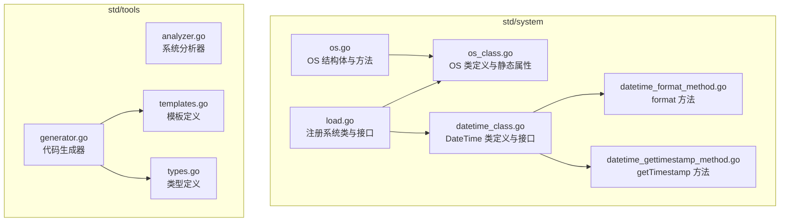
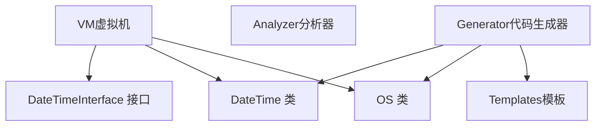
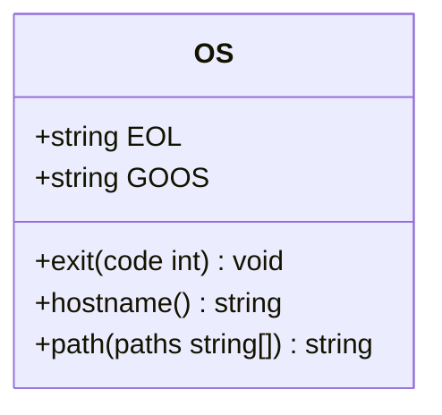
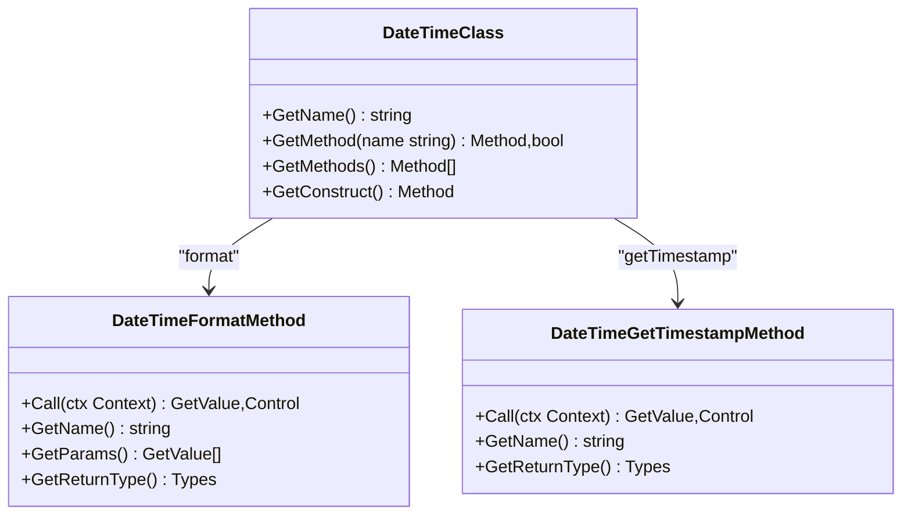
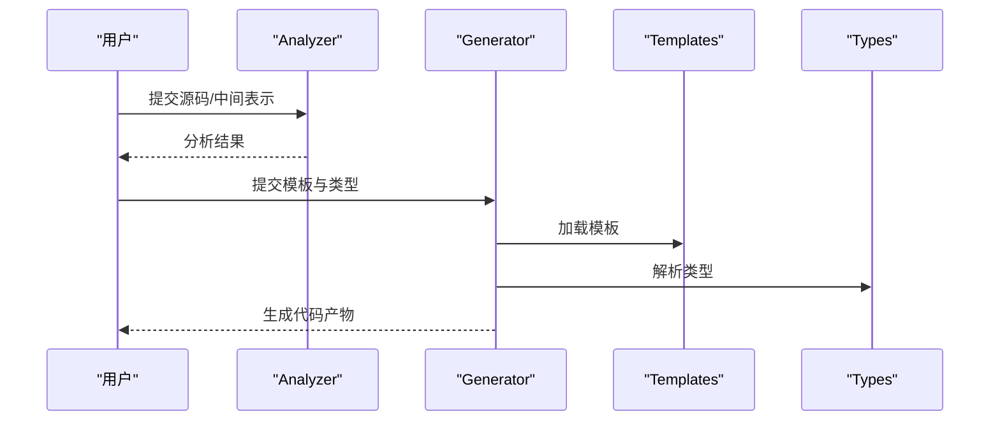
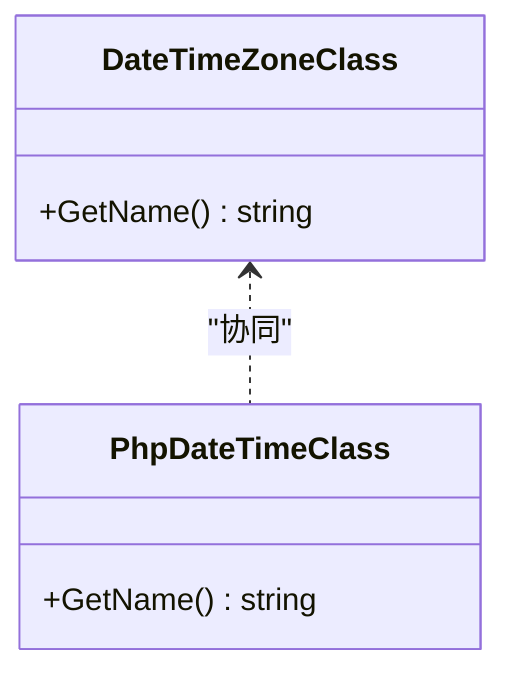
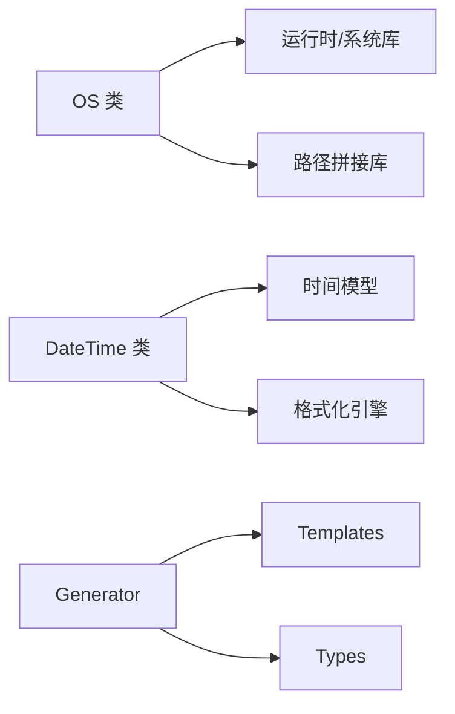

# 系统工具API

<cite>
**本文引用的文件**
- [std/system/os/os.go](file://std/system/os/os.go)
- [std/system/os/os_class.go](file://std/system/os/os_class.go)
- [std/system/os/os_exit_method.go](file://std/system/os/os_exit_method.go)
- [std/system/os/os_hostname_method.go](file://std/system/os/os_hostname_method.go)
- [std/system/os/os_path_method.go](file://std/system/os/os_path_method.go)
- [std/system/datetime_class.go](file://std/system/datetime_class.go)
- [std/system/datetime_format_method.go](file://std/system/datetime_format_method.go)
- [std/system/datetime_gettimestamp_method.go](file://std/system/datetime_gettimestamp_method.go)
- [std/system/load.go](file://std/system/load.go)
- [std/system/datetime.go](file://std/system/datetime.go)
- [std/system/datetime_interface.go](file://std/system/datetime_interface.go)
- [std/system/datetime_php_class.go](file://std/system/datetime_php_class.go)
- [std/system/datetime_timezone_class.go](file://std/system/datetime_timezone_class.go)
- [std/tools/analyzer.go](file://std/tools/analyzer.go)
- [std/tools/generator.go](file://std/tools/generator.go)
- [std/tools/templates.go](file://std/tools/templates.go)
- [std/tools/types.go](file://std/tools/types.go)
</cite>

## 目录
1. [简介](#简介)
2. [项目结构](#项目结构)
3. [核心组件](#核心组件)
4. [架构总览](#架构总览)
5. [详细组件分析](#详细组件分析)
6. [依赖分析](#依赖分析)
7. [性能考虑](#性能考虑)
8. [故障排查指南](#故障排查指南)
9. [结论](#结论)
10. [附录](#附录)

## 简介
本文件为系统工具模块的完整API文档，覆盖以下能力：
- OS 类：系统级方法（Exit、Hostname、Path），以及静态属性（EOL、GOOS）
- DateTime 类：日期时间处理（Format、GetTimestamp）与接口映射
- 系统分析器与代码生成器：工具模块的API与模板机制
- 文件系统与进程管理：通过标准库PHP扩展映射实现
- 系统信息与环境变量：通过全局常量与运行时信息暴露
- 时间格式化与时区处理：DateTime 与 DateTimeZone 的集成

本文件提供每个API的参数说明、返回值、使用示例与注意事项，并给出系统监控、时间处理、文件操作等实际应用场景。

## 项目结构
系统工具模块位于 std/system 与 std/tools 下，分别提供系统级能力与开发辅助工具；OS 与 DateTime 是两大核心命名空间类，分别对应系统进程控制与时间处理。

**图表来源**
- [std/system/os/os.go:1-43](file://std/system/os/os.go#L1-L43)
- [std/system/os/os_class.go:1-98](file://std/system/os/os_class.go#L1-L98)
- [std/system/datetime_class.go:1-64](file://std/system/datetime_class.go#L1-L64)
- [std/system/datetime_format_method.go:1-51](file://std/system/datetime_format_method.go#L1-L51)
- [std/system/datetime_gettimestamp_method.go:1-38](file://std/system/datetime_gettimestamp_method.go#L1-L38)
- [std/system/load.go:1-12](file://std/system/load.go#L1-L12)
- [std/tools/analyzer.go](file://std/tools/analyzer.go)
- [std/tools/generator.go](file://std/tools/generator.go)
- [std/tools/templates.go](file://std/tools/templates.go)
- [std/tools/types.go](file://std/tools/types.go)

**章节来源**
- [std/system/os/os.go:1-43](file://std/system/os/os.go#L1-L43)
- [std/system/os/os_class.go:1-98](file://std/system/os/os_class.go#L1-L98)
- [std/system/datetime_class.go:1-64](file://std/system/datetime_class.go#L1-L64)
- [std/system/datetime_format_method.go:1-51](file://std/system/datetime_format_method.go#L1-L51)
- [std/system/datetime_gettimestamp_method.go:1-38](file://std/system/datetime_gettimestamp_method.go#L1-L38)
- [std/system/load.go:1-12](file://std/system/load.go#L1-L12)
- [std/tools/analyzer.go](file://std/tools/analyzer.go)
- [std/tools/generator.go](file://std/tools/generator.go)
- [std/tools/templates.go](file://std/tools/templates.go)
- [std/tools/types.go](file://std/tools/types.go)

## 核心组件
- OS 类：提供进程退出、主机名查询、路径拼接等系统级能力，支持静态属性 EOL 与 GOOS。
- DateTime 类：提供日期时间格式化与时间戳获取，实现 PHP 顶层接口 DateTimeInterface。
- 工具模块：Analyzer 与 Generator 提供系统分析与代码生成能力，配合模板与类型系统工作。

**章节来源**
- [std/system/os/os.go:25-42](file://std/system/os/os.go#L25-L42)
- [std/system/os/os_class.go:48-57](file://std/system/os/os_class.go#L48-L57)
- [std/system/datetime_class.go:31-34](file://std/system/datetime_class.go#L31-L34)
- [std/system/datetime_format_method.go:48-50](file://std/system/datetime_format_method.go#L48-L50)
- [std/system/datetime_gettimestamp_method.go:35-37](file://std/system/datetime_gettimestamp_method.go#L35-L37)
- [std/tools/analyzer.go](file://std/tools/analyzer.go)
- [std/tools/generator.go](file://std/tools/generator.go)

## 架构总览
系统工具模块通过 VM 注册类与接口，OS 与 DateTime 作为全局可用类，工具模块通过模板与类型系统支撑生成流程。

**图表来源**
- [std/system/load.go:7-11](file://std/system/load.go#L7-L11)
- [std/system/datetime_class.go:31-34](file://std/system/datetime_class.go#L31-L34)
- [std/tools/generator.go](file://std/tools/generator.go)
- [std/tools/templates.go](file://std/tools/templates.go)

## 详细组件分析

### OS 类 API
- 类名：OS
- 静态属性
  - EOL：当前平台换行符（字符串）
  - GOOS：运行时操作系统标识（字符串）
- 实例方法
  - exit(code: int): void
    - 参数：code（整数，进程退出码）
    - 返回：无
    - 行为：调用底层退出逻辑
    - 注意事项：调用后立即终止进程
  - hostname(): string
    - 参数：无
    - 返回：主机名（字符串），失败抛出异常
    - 注意事项：可能因系统限制或权限不足而失败
  - path(paths: array<string>): string
    - 参数：paths（字符串数组，待拼接的路径片段）
    - 返回：拼接后的路径（字符串）
    - 行为：使用平台分隔符拼接路径
    - 注意事项：输入元素会被转换为字符串
- 使用示例场景
  - 进程退出：在错误处理中统一退出码
  - 主机名采集：用于日志标记或运维监控
  - 跨平台路径拼接：避免手动拼接导致的分隔符问题

**图表来源**
- [std/system/os/os.go:21-42](file://std/system/os/os.go#L21-L42)
- [std/system/os/os_class.go:20-26](file://std/system/os/os_class.go#L20-L26)

**章节来源**
- [std/system/os/os.go:25-42](file://std/system/os/os.go#L25-L42)
- [std/system/os/os_class.go:48-57](file://std/system/os/os_class.go#L48-L57)
- [std/system/os/os_exit_method.go:15-24](file://std/system/os/os_exit_method.go#L15-L24)
- [std/system/os/os_hostname_method.go:12-18](file://std/system/os/os_hostname_method.go#L12-L18)
- [std/system/os/os_path_method.go:15-22](file://std/system/os/os_path_method.go#L15-L22)

### DateTime 类 API
- 类名：System\DateTime
- 实现接口：DateTimeInterface
- 方法
  - format(format: string): string
    - 参数：format（格式化模式字符串）
    - 返回：按格式化规则输出的日期时间字符串
    - 注意事项：格式化规则遵循 PHP 风格
  - getTimestamp(): int
    - 参数：无
    - 返回：自 1970-01-01 UTC 起的秒级时间戳（整数）
- 使用示例场景
  - 日志时间戳：获取时间戳用于索引与排序
  - 可读时间格式：根据模板输出人类可读的时间字符串

**图表来源**
- [std/system/datetime_class.go:8-63](file://std/system/datetime_class.go#L8-L63)
- [std/system/datetime_format_method.go:11-50](file://std/system/datetime_format_method.go#L11-L50)
- [std/system/datetime_gettimestamp_method.go:7-37](file://std/system/datetime_gettimestamp_method.go#L7-L37)

**章节来源**
- [std/system/datetime_class.go:31-34](file://std/system/datetime_class.go#L31-L34)
- [std/system/datetime_format_method.go:48-50](file://std/system/datetime_format_method.go#L48-L50)
- [std/system/datetime_gettimestamp_method.go:35-37](file://std/system/datetime_gettimestamp_method.go#L35-L37)

### 系统分析器与代码生成器 API
- Analyzer（分析器）
  - 职责：对系统进行静态分析，收集元数据与依赖关系
  - 输入：源码或中间表示
  - 输出：分析结果（结构化数据）
  - 注意事项：需结合模板与类型系统进行后续生成
- Generator（代码生成器）
  - 职责：基于模板与类型系统生成目标代码
  - 输入：模板、类型定义、分析结果
  - 输出：生成的代码文件
- 模板与类型
  - Templates：预定义模板集合
  - Types：类型系统定义，用于约束生成过程

**图表来源**
- [std/tools/analyzer.go](file://std/tools/analyzer.go)
- [std/tools/generator.go](file://std/tools/generator.go)
- [std/tools/templates.go](file://std/tools/templates.go)
- [std/tools/types.go](file://std/tools/types.go)

**章节来源**
- [std/tools/analyzer.go](file://std/tools/analyzer.go)
- [std/tools/generator.go](file://std/tools/generator.go)
- [std/tools/templates.go](file://std/tools/templates.go)
- [std/tools/types.go](file://std/tools/types.go)

### 文件系统与进程管理
- 文件系统操作
  - 通过标准库 PHP 扩展映射实现，覆盖文件读写、目录扫描、路径判断等常用能力
  - 建议在跨平台场景下优先使用 OS.path 进行路径拼接，避免硬编码分隔符
- 进程管理
  - 使用 OS.exit 统一退出流程，便于监控与日志追踪
  - 在需要子进程协作的场景，建议结合外部进程与信号处理策略

[本节为概念性说明，不直接分析具体文件，故无“章节来源”]

### 系统信息与环境变量
- 系统信息
  - OS.EOL：当前平台换行符
  - OS.GOOS：运行时操作系统标识
- 环境变量
  - 通过标准库 PHP 扩展提供的全局变量访问能力，可在运行时读取与设置环境变量

[本节为概念性说明，不直接分析具体文件，故无“章节来源”]

### 时间格式化与时区处理
- 时间格式化
  - DateTime.format 支持 PHP 风格格式化规则，适用于日志、报表与展示层
- 时区处理
  - DateTimeZone 类提供时区对象，与 DateTime 协同完成跨时区时间计算与显示

**图表来源**
- [std/system/datetime_timezone_class.go](file://std/system/datetime_timezone_class.go)
- [std/system/datetime_php_class.go](file://std/system/datetime_php_class.go)

**章节来源**
- [std/system/datetime_timezone_class.go](file://std/system/datetime_timezone_class.go)
- [std/system/datetime_php_class.go](file://std/system/datetime_php_class.go)

## 依赖分析
- OS 类依赖底层运行时与路径拼接库，提供进程退出、主机名与路径拼接能力
- DateTime 类依赖内部时间模型与格式化实现，提供格式化与时间戳获取
- 工具模块依赖模板与类型系统，完成从分析到生成的闭环

**图表来源**
- [std/system/os/os.go:3-8](file://std/system/os/os.go#L3-L8)
- [std/system/datetime.go](file://std/system/datetime.go)
- [std/tools/generator.go](file://std/tools/generator.go)
- [std/tools/templates.go](file://std/tools/templates.go)
- [std/tools/types.go](file://std/tools/types.go)

**章节来源**
- [std/system/os/os.go:3-8](file://std/system/os/os.go#L3-L8)
- [std/system/datetime.go](file://std/system/datetime.go)
- [std/tools/generator.go](file://std/tools/generator.go)
- [std/tools/templates.go](file://std/tools/templates.go)
- [std/tools/types.go](file://std/tools/types.go)

## 性能考虑
- OS.exit 会立即终止进程，适合在错误路径快速退出，避免资源泄漏
- DateTime.format 与 getTimestamp 为轻量操作，但频繁格式化可能带来字符串分配开销，建议缓存热点格式串
- 工具生成器在大规模代码生成时应关注模板解析与类型推断的成本，必要时进行批处理与增量更新

[本节为通用指导，不直接分析具体文件，故无“章节来源”]

## 故障排查指南
- OS.exit 无效
  - 检查调用位置是否在异常分支中被提前捕获或包装
  - 确认传入的退出码是否符合预期范围
- hostname 失败
  - 检查系统权限与网络配置
  - 查看返回的错误信息以定位具体原因
- path 拼接异常
  - 确认传入数组元素均为字符串或可转换为字符串
  - 在 Windows 平台注意正反斜杠的混用
- DateTime.format 报错
  - 检查格式化字符串是否符合 PHP 风格规范
- 生成器产出不符合预期
  - 核对模板与类型定义是否匹配
  - 检查分析阶段的数据完整性

**章节来源**
- [std/system/os/os_exit_method.go:15-24](file://std/system/os/os_exit_method.go#L15-L24)
- [std/system/os/os_hostname_method.go:12-18](file://std/system/os/os_hostname_method.go#L12-L18)
- [std/system/os/os_path_method.go:15-22](file://std/system/os/os_path_method.go#L15-L22)
- [std/system/datetime_format_method.go:15-22](file://std/system/datetime_format_method.go#L15-L22)
- [std/tools/generator.go](file://std/tools/generator.go)

## 结论
系统工具模块提供了稳定、可移植的系统级能力与开发辅助工具。OS 类覆盖进程控制与路径处理，DateTime 类满足时间处理需求，工具模块则为代码生成与系统分析提供基础。建议在实际应用中结合监控与日志体系，确保关键路径（如退出码、主机名、时间戳）的可观测性与一致性。

[本节为总结性内容，不直接分析具体文件，故无“章节来源”]

## 附录
- 注册入口
  - 系统类与接口通过 VM 注册，确保全局可用
- 实际应用场景
  - 系统监控：利用 OS.EOL、OS.GOOS 与 hostname 识别运行环境
  - 时间处理：使用 DateTime.format 与 getTimestamp 完成日志与报表
  - 开发效率：借助 Analyzer 与 Generator 快速生成重复性代码

**章节来源**
- [std/system/load.go:7-11](file://std/system/load.go#L7-L11)