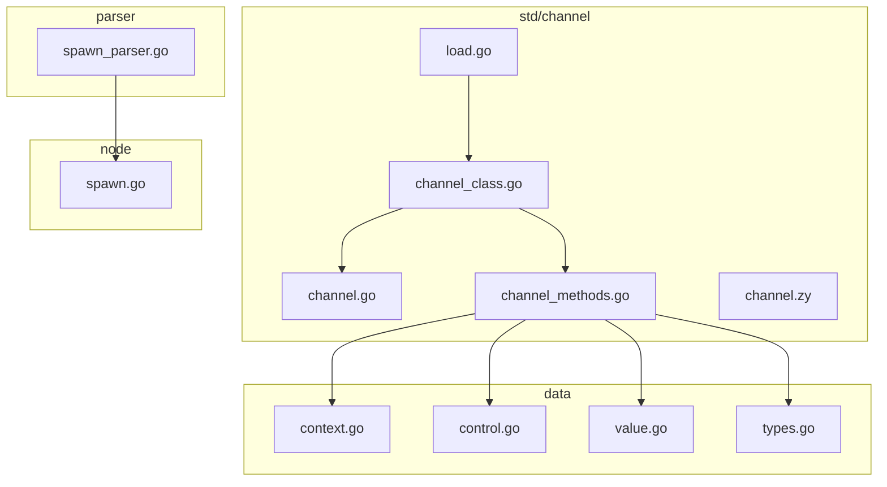
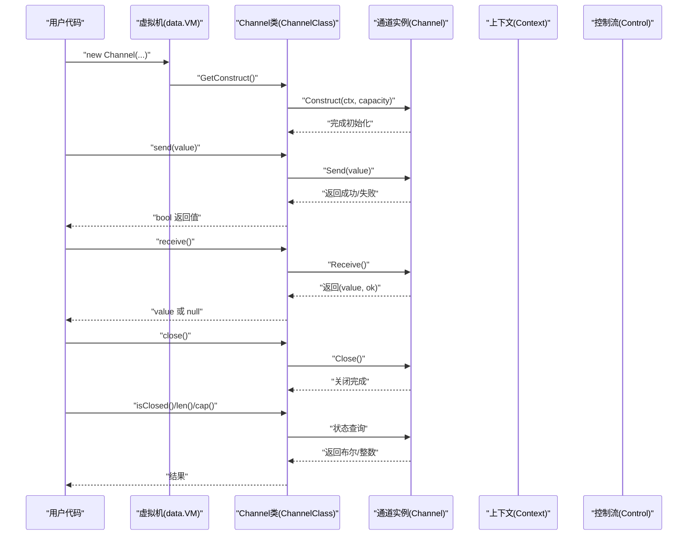
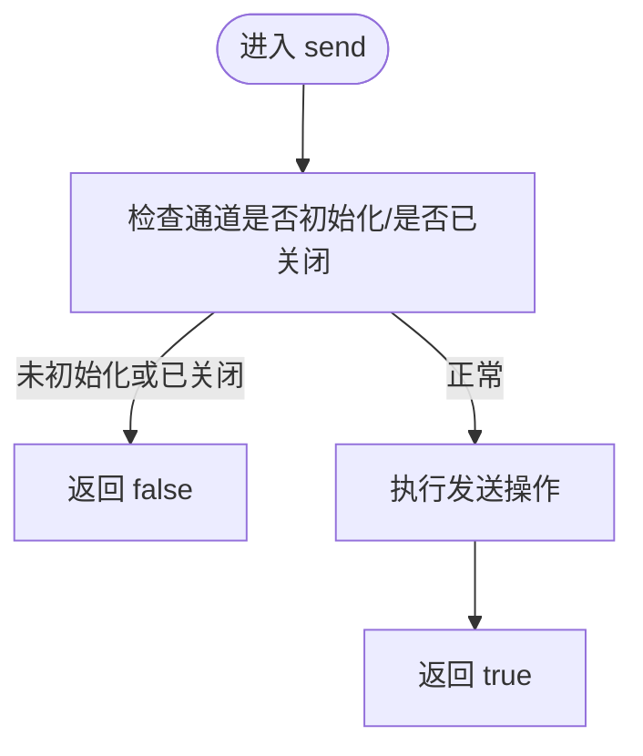
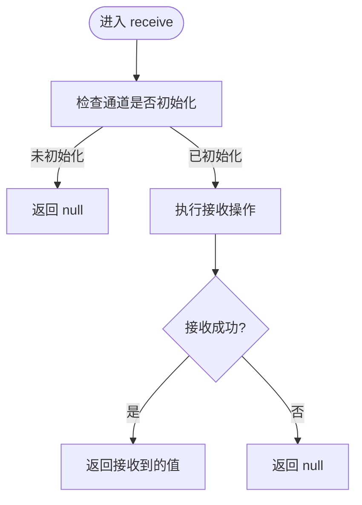
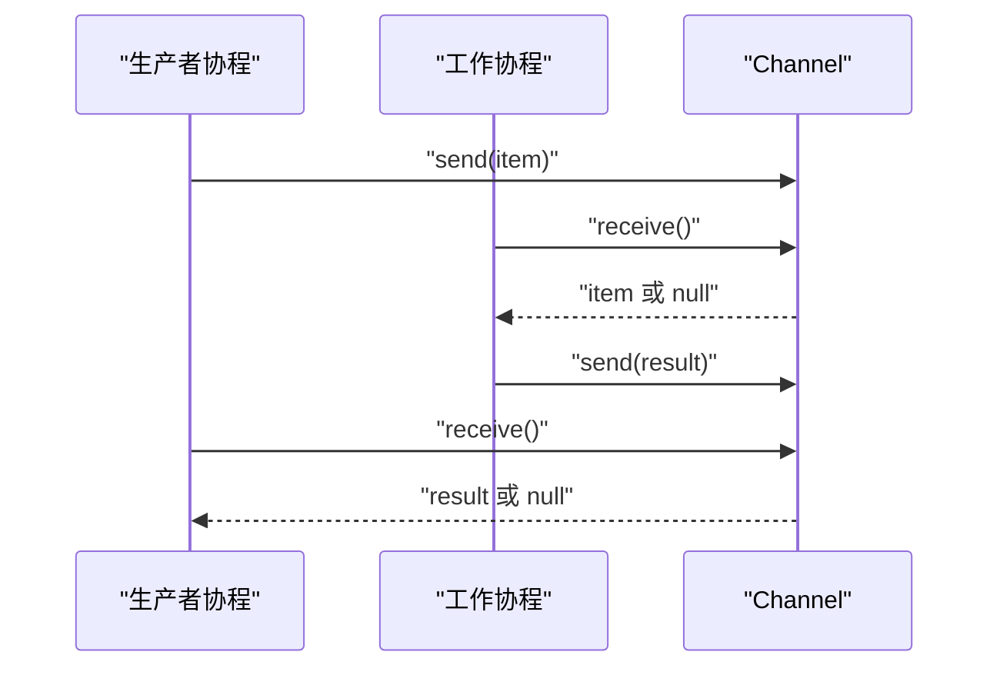

# 通道通信API

<cite>
**本文引用的文件**
- [channel.go](file://std/channel/channel.go)
- [channel_class.go](file://std/channel/channel_class.go)
- [channel_methods.go](file://std/channel/channel_methods.go)
- [load.go](file://std/channel/load.go)
- [channel.zy](file://docs/std/channel.zy)
- [context.go](file://data/context.go)
- [control.go](file://data/control.go)
- [value.go](file://data/value.go)
- [types.go](file://data/types.go)
- [spawn.go](file://node/spawn.go)
- [spawn_parser.go](file://parser/spawn_parser.go)
</cite>

## 目录
1. [简介](#简介)
2. [项目结构](#项目结构)
3. [核心组件](#核心组件)
4. [架构总览](#架构总览)
5. [详细组件分析](#详细组件分析)
6. [依赖关系分析](#依赖关系分析)
7. [性能考量](#性能考量)
8. [故障排查指南](#故障排查指南)
9. [结论](#结论)
10. [附录：常见应用场景与示例路径](#附录常见应用场景与示例路径)

## 简介
本文件为通道通信模块的完整API文档，面向使用者与开发者，系统性阐述 Channel 类的全部方法与行为，覆盖有缓冲与无缓冲模式、并发安全性与使用限制、协程间通信模式、关闭时机与错误处理、与其他并发原语的配合使用，并提供生产者-消费者、工作池、信号量等典型场景的实践指引。文档严格基于仓库源码与伪接口定义，避免臆测。

## 项目结构
通道模块位于 std/channel 目录，核心由以下文件组成：
- channel.go：Channel 结构体与底层方法（构造、发送、接收、关闭、状态查询、容量与长度查询）
- channel_class.go：Channel 类的注册与方法映射
- channel_methods.go：各方法的调用包装（参数校验、返回值类型、异常抛出）
- load.go：模块加载入口，向虚拟机注册 Channel 类
- channel.zy：伪接口定义，用于参考 Channel 类的公开API签名
- 相关运行时与并发基础设施：data/context.go、data/control.go、data/value.go、data/types.go
- 协程原语：node/spawn.go、parser/spawn_parser.go

**图表来源**
- [load.go:1-13](file://std/channel/load.go#L1-L13)
- [channel_class.go:1-99](file://std/channel/channel_class.go#L1-L99)
- [channel.go:1-93](file://std/channel/channel.go#L1-L93)
- [channel_methods.go:1-300](file://std/channel/channel_methods.go#L1-L300)
- [context.go:1-349](file://data/context.go#L1-L349)
- [control.go:1-61](file://data/control.go#L1-L61)
- [value.go:1-39](file://data/value.go#L1-L39)
- [types.go:1-262](file://data/types.go#L1-L262)
- [spawn.go:1-31](file://node/spawn.go#L1-L31)
- [spawn_parser.go:1-54](file://parser/spawn_parser.go#L1-L54)

**章节来源**
- [load.go:1-13](file://std/channel/load.go#L1-L13)
- [channel_class.go:1-99](file://std/channel/channel_class.go#L1-L99)
- [channel_methods.go:1-300](file://std/channel/channel_methods.go#L1-L300)
- [channel.zy:1-67](file://docs/std/channel.zy#L1-L67)

## 核心组件
- Channel 结构体：封装底层 Go chan，维护 closed 状态与内部通道
- Channel 类：将 Channel 封装为可实例化的类，暴露构造、send、receive、close、isClosed、len、cap 等方法
- 方法包装：每个方法均在调用前进行参数校验与初始化检查，必要时抛出异常
- 模块加载：通过 Load 函数向虚拟机注册 Channel 类

关键职责与边界：
- 数据类型：通过 data.Value 传递，兼容混合类型
- 并发模型：基于 Go goroutine 与 channel 的同步语义
- 错误处理：未初始化或非法参数时抛出异常；接收失败返回空值或布尔标志

**章节来源**
- [channel.go:7-93](file://std/channel/channel.go#L7-L93)
- [channel_class.go:7-99](file://std/channel/channel_class.go#L7-L99)
- [channel_methods.go:11-300](file://std/channel/channel_methods.go#L11-L300)
- [value.go:3-39](file://data/value.go#L3-L39)
- [types.go:142-188](file://data/types.go#L142-L188)

## 架构总览
下图展示 Channel 类在运行时的调用链路与与虚拟机、上下文、控制流的关系：

**图表来源**
- [channel_class.go:90-93](file://std/channel/channel_class.go#L90-L93)
- [channel_methods.go:16-27](file://std/channel/channel_methods.go#L16-L27)
- [channel_methods.go:62-76](file://std/channel/channel_methods.go#L62-L76)
- [channel_methods.go:111-123](file://std/channel/channel_methods.go#L111-L123)
- [channel_methods.go:154-161](file://std/channel/channel_methods.go#L154-L161)
- [channel_methods.go:192-199](file://std/channel/channel_methods.go#L192-L199)
- [channel_methods.go:230-237](file://std/channel/channel_methods.go#L230-L237)
- [channel_methods.go:268-275](file://std/channel/channel_methods.go#L268-L275)
- [channel.go:18-41](file://std/channel/channel.go#L18-L41)
- [channel.go:43-63](file://std/channel/channel.go#L43-L63)
- [channel.go:65-71](file://std/channel/channel.go#L65-L71)
- [context.go:8-31](file://data/context.go#L8-L31)
- [control.go:1-61](file://data/control.go#L1-L61)

## 详细组件分析

### Channel 类与方法总览
- 类名：Channel
- 方法清单：
  - __construct(capacity?: int): void
  - send(value): bool
  - receive(): mixed
  - close(): void
  - isClosed(): bool
  - len(): int
  - cap(): int

上述签名与返回类型来自伪接口定义与方法包装实现。

**章节来源**
- [channel.zy:14-65](file://docs/std/channel.zy#L14-L65)
- [channel_class.go:60-88](file://std/channel/channel_class.go#L60-L88)
- [channel_methods.go:16-55](file://std/channel/channel_methods.go#L16-L55)
- [channel_methods.go:62-104](file://std/channel/channel_methods.go#L62-L104)
- [channel_methods.go:111-147](file://std/channel/channel_methods.go#L111-L147)
- [channel_methods.go:154-185](file://std/channel/channel_methods.go#L154-L185)
- [channel_methods.go:192-223](file://std/channel/channel_methods.go#L192-L223)
- [channel_methods.go:230-261](file://std/channel/channel_methods.go#L230-L261)
- [channel_methods.go:268-299](file://std/channel/channel_methods.go#L268-L299)

### 构造方法 __construct
- 参数
  - capacity: int（可选）；若为负则按0处理
- 行为
  - 若已有通道且未关闭，先关闭旧通道
  - 创建底层通道，容量为非负整数
  - 初始化 closed=false
- 返回
  - void
- 异常
  - 无显式抛出；参数校验在方法包装层进行（见下）

**章节来源**
- [channel.go:18-41](file://std/channel/channel.go#L18-L41)
- [channel_methods.go:16-27](file://std/channel/channel_methods.go#L16-L27)
- [channel_methods.go:41-55](file://std/channel/channel_methods.go#L41-L55)

### 发送方法 send
- 参数
  - value: mixed（任意值）
- 行为
  - 若通道未初始化或已关闭，返回 false
  - 否则执行发送操作
- 返回
  - bool：true 表示发送成功；false 表示发送失败（通道未初始化或已关闭）
- 异常
  - 若通道未初始化，方法包装会抛出异常

**图表来源**
- [channel.go:43-52](file://std/channel/channel.go#L43-L52)
- [channel_methods.go:62-76](file://std/channel/channel_methods.go#L62-L76)

**章节来源**
- [channel.go:43-52](file://std/channel/channel.go#L43-L52)
- [channel_methods.go:62-76](file://std/channel/channel_methods.go#L62-L76)

### 接收方法 receive
- 参数
  - 无
- 行为
  - 若通道未初始化，返回 null
  - 否则执行接收操作；若接收失败（如关闭），返回 null
- 返回
  - mixed：接收到的值或 null
- 异常
  - 若通道未初始化，方法包装会抛出异常

**图表来源**
- [channel.go:54-63](file://std/channel/channel.go#L54-L63)
- [channel_methods.go:111-123](file://std/channel/channel_methods.go#L111-L123)

**章节来源**
- [channel.go:54-63](file://std/channel/channel.go#L54-L63)
- [channel_methods.go:111-123](file://std/channel/channel_methods.go#L111-L123)

### 关闭方法 close
- 参数
  - 无
- 行为
  - 若通道未关闭且已初始化，则标记 closed=true 并关闭底层通道
- 返回
  - void
- 异常
  - 若通道未初始化，方法包装会抛出异常

**章节来源**
- [channel.go:65-71](file://std/channel/channel.go#L65-L71)
- [channel_methods.go:154-161](file://std/channel/channel_methods.go#L154-L161)

### 状态查询方法
- isClosed(): bool
  - 返回通道是否已关闭
- len(): int
  - 返回通道中当前缓冲的数据个数
- cap(): int
  - 返回通道容量

**章节来源**
- [channel.go:73-92](file://std/channel/channel.go#L73-L92)
- [channel_methods.go:192-199](file://std/channel/channel_methods.go#L192-L199)
- [channel_methods.go:230-237](file://std/channel/channel_methods.go#L230-L237)
- [channel_methods.go:268-275](file://std/channel/channel_methods.go#L268-L275)

### 通道模式：有缓冲与无缓冲
- 无缓冲：capacity=0，发送与接收必须成对出现（同步）
- 有缓冲：capacity>0，发送可立即返回（只要缓冲未满），接收可立即取走（只要缓冲非空）
- 容量为负时，按0处理（等价于无缓冲）

**章节来源**
- [channel.go:25-36](file://std/channel/channel.go#L25-L36)
- [channel_methods.go:41-45](file://std/channel/channel_methods.go#L41-L45)

### 并发安全特性与使用限制
- 并发安全：底层基于 Go channel，具备天然的并发安全；但 Channel 类本身未引入额外互斥锁
- 使用限制
  - 通道未初始化或已关闭时，send 返回 false；receive 返回 null；close 与状态查询抛出异常
  - 接收返回的 ok 标志在底层 Receive 方法中体现为“接收成功与否”的布尔值
- 建议
  - 在协程间通信前确保通道已正确初始化
  - 明确关闭时机，避免在发送/接收过程中访问已关闭通道

**章节来源**
- [channel.go:43-63](file://std/channel/channel.go#L43-L63)
- [channel_methods.go:62-76](file://std/channel/channel_methods.go#L62-L76)
- [channel_methods.go:111-123](file://std/channel/channel_methods.go#L111-L123)
- [channel_methods.go:154-161](file://std/channel/channel_methods.go#L154-L161)

### 与协程原语的配合
- spawn 语句用于启动异步协程，适合与 Channel 组合实现生产者-消费者、工作池等模式
- spawn 语法解析与执行分别由解析器与节点层负责，执行时通过 go 语句异步运行

**图表来源**
- [spawn.go:19-30](file://node/spawn.go#L19-L30)
- [spawn_parser.go:20-54](file://parser/spawn_parser.go#L20-L54)
- [channel_methods.go:62-76](file://std/channel/channel_methods.go#L62-L76)
- [channel_methods.go:111-123](file://std/channel/channel_methods.go#L111-L123)

**章节来源**
- [spawn.go:19-30](file://node/spawn.go#L19-L30)
- [spawn_parser.go:20-54](file://parser/spawn_parser.go#L20-L54)

## 依赖关系分析
- Channel 类依赖 data.Value 作为数据载体，支持混合类型
- 方法包装依赖 data.Context 获取参数、data.Control 抛出异常
- 模块加载通过 data.VM 注册类，供运行时使用

```mermaid
classDiagram
class Channel {
-bool closed
-chan data.Value channel
+Construct(ctx, capacity)
+Send(value) bool
+Receive() (data.Value, bool)
+Close()
+IsClosed() bool
+Len() int
+Cap() int
}
class ChannelClass {
-Channel* channel
+GetConstruct() Method
+GetMethod(name) (Method, bool)
+GetMethods() []Method
}
class ChannelSendMethod {
-ChannelClass* source
+Call(ctx) (GetValue, Control)
}
class ChannelReceiveMethod {
-ChannelClass* source
+Call(ctx) (GetValue, Control)
}
class ChannelCloseMethod {
-ChannelClass* source
+Call(ctx) (GetValue, Control)
}
class ChannelIsClosedMethod {
-ChannelClass* source
+Call(ctx) (GetValue, Control)
}
class ChannelLenMethod {
-ChannelClass* source
+Call(ctx) (GetValue, Control)
}
class ChannelCapMethod {
-ChannelClass* source
+Call(ctx) (GetValue, Control)
}
ChannelClass --> Channel : "持有"
ChannelSendMethod --> ChannelClass : "调用"
ChannelReceiveMethod --> ChannelClass : "调用"
ChannelCloseMethod --> ChannelClass : "调用"
ChannelIsClosedMethod --> ChannelClass : "调用"
ChannelLenMethod --> ChannelClass : "调用"
ChannelCapMethod --> ChannelClass : "调用"
```

**图表来源**
- [channel.go:7-93](file://std/channel/channel.go#L7-L93)
- [channel_class.go:7-99](file://std/channel/channel_class.go#L7-L99)
- [channel_methods.go:11-300](file://std/channel/channel_methods.go#L11-L300)

**章节来源**
- [value.go:3-39](file://data/value.go#L3-L39)
- [types.go:142-188](file://data/types.go#L142-L188)
- [context.go:8-31](file://data/context.go#L8-L31)
- [control.go:1-61](file://data/control.go#L1-L61)

## 性能考量
- 无缓冲通道：同步阻塞，适合严格配对的生产-消费；CPU占用低，但吞吐受限
- 有缓冲通道：提升吞吐，减少阻塞等待；需合理设置容量以平衡内存与延迟
- 发送/接收失败成本：底层为通道操作，失败路径开销小；建议在上层根据返回值快速分支
- 关闭时机：尽早关闭不再使用的通道，释放资源；避免在高并发下频繁创建/销毁通道
- 与协程配合：spawn 启动的协程应尽量短生命周期，避免长时间占用通道

[本节为通用指导，不直接分析特定文件]

## 故障排查指南
- “通道未初始化”异常
  - 触发点：调用 send/receive/close/isClosed/len/cap 前未正确构造或已关闭
  - 处理：确保先调用 __construct(capacity?)，并在合适时机调用 close
- send 返回 false
  - 触发点：通道未初始化或已关闭
  - 处理：检查通道状态，避免重复关闭
- receive 返回 null
  - 触发点：通道未初始化或接收失败（如已关闭）
  - 处理：在上层根据返回值判断并重试或结束
- 容量异常
  - 触发点：传入负容量
  - 处理：传入非负整数；若需无缓冲，传入 0

**章节来源**
- [channel_methods.go:63-71](file://std/channel/channel_methods.go#L63-L71)
- [channel_methods.go:112-114](file://std/channel/channel_methods.go#L112-L114)
- [channel_methods.go:155-157](file://std/channel/channel_methods.go#L155-L157)
- [channel_methods.go:193-195](file://std/channel/channel_methods.go#L193-L195)
- [channel_methods.go:231-233](file://std/channel/channel_methods.go#L231-L233)
- [channel_methods.go:269-271](file://std/channel/channel_methods.go#L269-L271)
- [channel.go:25-36](file://std/channel/channel.go#L25-L36)

## 结论
通道通信模块提供了与 Go channel 对齐的简洁API，覆盖构造、发送、接收、关闭与状态查询等核心能力。其并发安全由底层 Go 通道保证，使用时需关注初始化与关闭时机、缓冲模式选择以及与协程原语的配合。结合伪接口定义与源码实现，可稳定构建生产者-消费者、工作池、信号量等并发模式。

[本节为总结性内容，不直接分析特定文件]

## 附录：常见应用场景与示例路径
- 生产者-消费者
  - 思路：生产者协程通过 spawn 启动，使用 Channel.send 发送任务；消费者协程通过 Channel.receive 接收并处理；完成后可关闭通道
  - 参考：spawn 语法与执行、Channel.send/receive
- 工作池
  - 思路：多个工作协程同时从同一 Channel 接收任务；通过关闭通道通知工作结束
  - 参考：spawn 与 Channel.close
- 信号量
  - 思路：使用容量为 N 的有缓冲通道模拟信号量；发送 N 个占位元素作为初始可用许可；接收/发送对应获取/释放许可
  - 参考：Channel.__construct(capacity) 与 Channel.send/receive

**章节来源**
- [spawn.go:19-30](file://node/spawn.go#L19-L30)
- [spawn_parser.go:20-54](file://parser/spawn_parser.go#L20-L54)
- [channel_methods.go:62-76](file://std/channel/channel_methods.go#L62-L76)
- [channel_methods.go:111-123](file://std/channel/channel_methods.go#L111-L123)
- [channel.go:18-41](file://std/channel/channel.go#L18-L41)