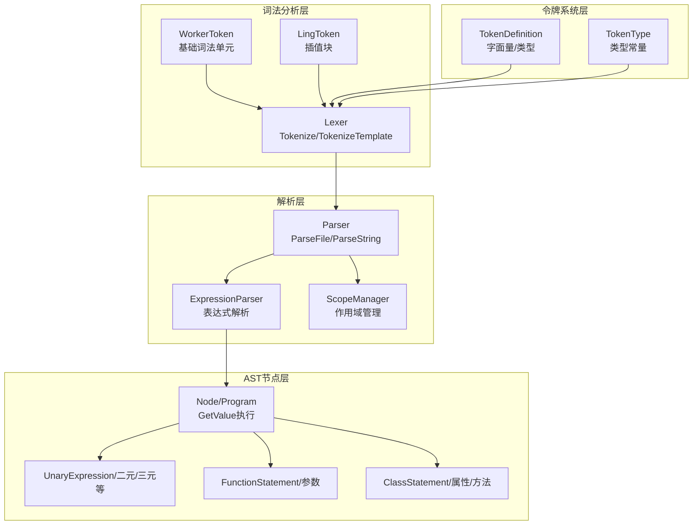
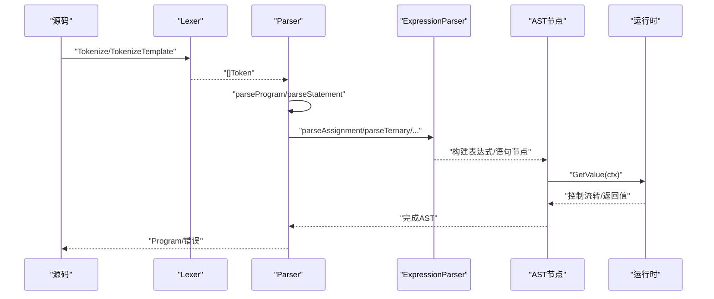
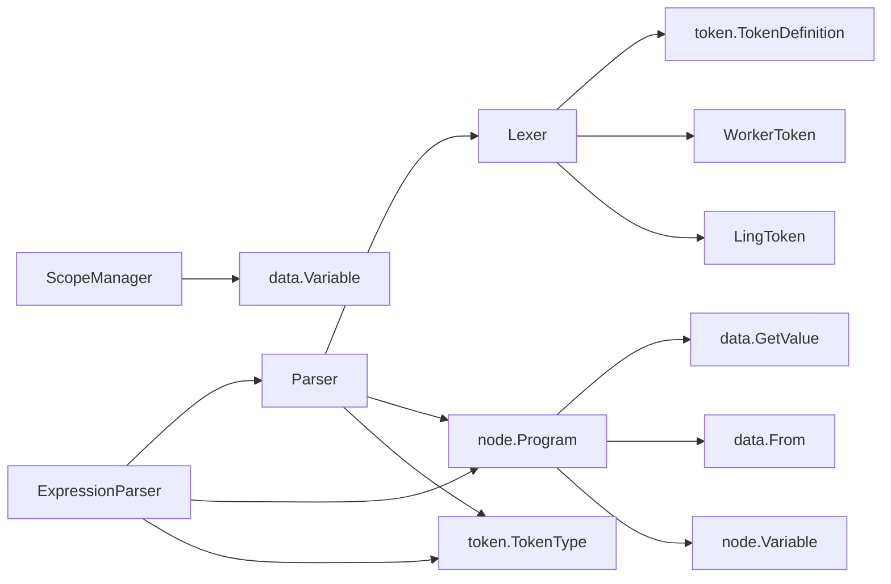

# 编译器API

<cite>
**本文档引用的文件**
- [parser.go](file://parser/parser.go)
- [expression_parser.go](file://parser/expression_parser.go)
- [scope_manager.go](file://parser/scope_manager.go)
- [lexer.go](file://lexer/lexer.go)
- [ling_token.go](file://lexer/ling_token.go)
- [worker_token.go](file://lexer/worker_token.go)
- [token.go](file://token/token.go)
- [type_config.go](file://token/type_config.go)
- [node.go](file://node/node.go)
- [expression.go](file://node/expression.go)
- [var.go](file://node/var.go)
- [function.go](file://node/function.go)
- [class.go](file://node/class.go)
- [node.go](file://data/node.go)
- [value.go](file://data/value.go)
</cite>

## 目录
1. [简介](#简介)
2. [项目结构](#项目结构)
3. [核心组件](#核心组件)
4. [架构总览](#架构总览)
5. [详细组件分析](#详细组件分析)
6. [依赖分析](#依赖分析)
7. [性能考虑](#性能考虑)
8. [故障排查指南](#故障排查指南)
9. [结论](#结论)
10. [附录](#附录)

## 简介
本文件为编译器系统的完整API参考文档，覆盖解析器、词法分析器、AST节点、令牌系统与作用域管理五大模块。文档面向开发者与集成者，提供方法级接口说明、使用示例与集成指南，帮助快速理解与扩展编译器能力。

## 项目结构
编译器采用分层设计：
- 词法分析层：负责将源码切分为Token序列，并提供预处理与HTML模式支持。
- 解析层：基于Token流构建AST，包含表达式解析器与语句解析器。
- AST节点层：定义各类语法节点及运行时求值接口。
- 令牌系统层：统一管理Token类型、字面量与定义。
- 作用域管理层：维护变量作用域与查找。

图表来源
- [lexer.go:88-248](file://lexer/lexer.go#L88-L248)
- [parser.go:86-122](file://parser/parser.go#L86-L122)
- [expression_parser.go:26-33](file://parser/expression_parser.go#L26-L33)
- [scope_manager.go:64-100](file://parser/scope_manager.go#L64-L100)
- [node.go:30-42](file://node/node.go#L30-L42)
- [expression.go:5-19](file://node/expression.go#L5-L19)
- [function.go:9-32](file://node/function.go#L9-L32)
- [class.go:11-26](file://node/class.go#L11-L26)
- [token.go:23-31](file://token/token.go#L23-L31)
- [type_config.go:3-198](file://token/type_config.go#L3-L198)

章节来源
- [parser.go:17-50](file://parser/parser.go#L17-L50)
- [lexer.go:41-67](file://lexer/lexer.go#L41-L67)
- [token.go:23-31](file://token/token.go#L23-L31)

## 核心组件
- 解析器API（Parser）
  - 构造与克隆：NewParser、Clone
  - 文件/字符串解析：ParseFile、ParseString、ParseExpressionFromString
  - 词法与AST：Tokenize、parseProgram、parseStatement、parseBlock
  - 位置与来源：FromCurrentToken、FromPositionRange、newFrom
  - 作用域与类路径：SetVM、SetClassPathManager、GetClassPathManager
  - 错误处理：ShowControl、printDetailedError、printRuntimeError
- 表达式解析器API（ExpressionParser）
  - 语法优先级链：parseAssignment → parseTernary → parseConcatenation → … → parsePrimary
  - 特殊语法：instanceof、空合并、Elvis、三元、后缀自增/减、可空类型声明
  - 插值字符串：parseLingToken、parseTokensAsExpression
- 词法分析器API（Lexer）
  - Tokenize/TokenizeTemplate：主入口，支持Shebang跳过、HTML模式、空白处理
  - DAG匹配：matchLongestToken、matchTokenWithDAG、matchKeywordWithDAG
  - Token类型：WorkerToken、LingToken
- AST节点API（node.*）
  - 基础：Node、Program、GetValue接口
  - 表达式：UnaryExpression、BinaryExpression、TernaryExpression、NullCoalesceExpression、InstanceOfExpression、VarVar、ValueReference、UnaryIncr/Decr、PostfixIncr/Decr、BinaryLink
  - 语句：VarStatement、StaticVarStatement、FunctionStatement、ClassStatement
- 令牌系统API（token.*）
  - TokenDefinition：类型、字面量、词性
  - TokenType：关键字、运算符、字面量、标识符、HTML、注释、EOF等
  - 工具：GetTokenDefinitions、GetLiteralByType
- 作用域管理API（ScopeManager）
  - Scope接口：AddVariable、GetVariable、GetVariables、SetVariable、IsLambda、SetLambda
  - ScopeManager：NewScope、PopScope、CurrentScope、LookupVariable、LookupParentVariable
  - DefaultScope：默认实现

章节来源
- [parser.go:36-122](file://parser/parser.go#L36-L122)
- [parser.go:160-250](file://parser/parser.go#L160-L250)
- [parser.go:368-470](file://parser/parser.go#L368-L470)
- [parser.go:602-664](file://parser/parser.go#L602-L664)
- [parser.go:681-730](file://parser/parser.go#L681-L730)
- [expression_parser.go:26-749](file://parser/expression_parser.go#L26-L749)
- [lexer.go:88-248](file://lexer/lexer.go#L88-L248)
- [lexer.go:250-349](file://lexer/lexer.go#L250-L349)
- [ling_token.go:5-62](file://lexer/ling_token.go#L5-L62)
- [worker_token.go:5-55](file://lexer/worker_token.go#L5-L55)
- [node.go:7-42](file://node/node.go#L7-L42)
- [expression.go:5-56](file://node/expression.go#L5-L56)
- [var.go:10-45](file://node/var.go#L10-L45)
- [function.go:9-195](file://node/function.go#L9-L195)
- [class.go:11-182](file://node/class.go#L11-L182)
- [token.go:23-212](file://token/token.go#L23-L212)
- [type_config.go:3-198](file://token/type_config.go#L3-L198)
- [scope_manager.go:18-100](file://parser/scope_manager.go#L18-L100)

## 架构总览
编译流程从词法分析开始，生成Token序列；随后由解析器驱动表达式解析器构建AST；AST节点通过GetValue接口在运行时求值；作用域管理贯穿变量声明与查找；令牌系统提供统一的类型与字面量定义。

图表来源
- [lexer.go:88-248](file://lexer/lexer.go#L88-L248)
- [parser.go:86-122](file://parser/parser.go#L86-L122)
- [expression_parser.go:26-33](file://parser/expression_parser.go#L26-L33)
- [node.go:44-70](file://node/node.go#L44-L70)

## 详细组件分析

### 解析器API（Parser）
- 构造与克隆
  - NewParser：初始化词法分析器、作用域管理器、类路径管理器与表达式解析器
  - Clone：复制解析器状态，新建独立实例
- 文件与字符串解析
  - ParseFile：读取文件、Tokenize、parseProgram，返回Program或错误
  - ParseString：在给定文件路径上下文中解析字符串为Program
  - ParseExpressionFromString/WithPosition：解析表达式字符串，支持位置偏移调整
- 语法与AST构建
  - parseProgram：遍历Token，构建Program语句列表
  - parseStatement：根据当前Token类型分派至表达式解析器或HTML节点
  - parseBlock：解析语句块，支持分号跳过与右花括号匹配
  - parseValue：解析字面量与变量表达式
- 位置与来源
  - FromCurrentToken/FromPositionRange/newFrom：生成TokenFrom用于错误定位
  - StartTracking/Start/End：位置跟踪与范围计算
- 类名与命名空间解析
  - getClassName/findFullClassNameByNamespace/findFullFunNameByNamespace：类/函数名解析策略
- 作用域与类路径
  - SetVM/SetClassPathManager/GetClassPathManager：设置虚拟机与类路径管理器
  - GetVariables：查询当前作用域变量
- 错误处理
  - ShowControl：格式化并输出错误与调用栈
  - printDetailedError/printRuntimeError：详细错误输出

使用示例（路径引用）
- [解析文件示例:86-122](file://parser/parser.go#L86-L122)
- [解析字符串示例:636-664](file://parser/parser.go#L636-L664)
- [表达式解析示例:602-634](file://parser/parser.go#L602-L634)

章节来源
- [parser.go:36-80](file://parser/parser.go#L36-L80)
- [parser.go:86-122](file://parser/parser.go#L86-L122)
- [parser.go:124-158](file://parser/parser.go#L124-L158)
- [parser.go:160-250](file://parser/parser.go#L160-L250)
- [parser.go:368-470](file://parser/parser.go#L368-L470)
- [parser.go:588-600](file://parser/parser.go#L588-L600)
- [parser.go:602-664](file://parser/parser.go#L602-L664)
- [parser.go:681-730](file://parser/parser.go#L681-L730)

### 表达式解析器API（ExpressionParser）
- 语法优先级链
  - parseAssignment：赋值与多重赋值、复合赋值
  - parseTernary：Elvis、三元、空合并、空安全调用?->、可空类型声明
  - parseConcatenation：字符串连接
  - parseLogicalOr/And：逻辑或/与
  - parseEquality：相等性与like
  - parseBitwiseAnd/Xor/Or：按位与/异或/或
  - parseComparison：比较
  - parseShift：位移
  - parseTerm/Factor：加减/乘除取模
  - parseUnary：一元运算、引用取值&、前缀自增/减、instanceof
  - parsePrimary：字面量、插值字符串、DOCTYPE、JS_SERVER、变量变量$$var
- 插值字符串
  - parseLingToken：将LingToken拆分为字符串与表达式片段并链接
  - parseTokensAsExpression：将子Token序列解析为表达式

使用示例（路径引用）
- [表达式解析链路:26-749](file://parser/expression_parser.go#L26-L749)
- [插值字符串解析:751-755](file://parser/expression_parser.go#L751-L755)

章节来源
- [expression_parser.go:14-24](file://parser/expression_parser.go#L14-L24)
- [expression_parser.go:26-749](file://parser/expression_parser.go#L26-L749)
- [expression_parser.go:751-755](file://parser/expression_parser.go#L751-L755)

### 词法分析器API（Lexer）
- Tokenize/TokenizeTemplate
  - 跳过Shebang、识别HTML模式、空白与换行处理、特殊Token处理
  - DAG匹配关键字与运算符、标识符解析、UTF-8错误处理
- DAG匹配
  - matchLongestToken：最长匹配
  - matchTokenWithDAG/matchKeywordWithDAG：基于DAG的关键字/运算符匹配
- Token类型
  - WorkerToken：普通词法单元
  - LingToken：插值块，包含子Token列表

使用示例（路径引用）
- [主入口与空白处理:88-248](file://lexer/lexer.go#L88-L248)
- [DAG匹配:250-349](file://lexer/lexer.go#L250-L349)
- [WorkerToken/LingToken:5-55](file://lexer/worker_token.go#L5-L55)
- [LingToken:5-62](file://lexer/ling_token.go#L5-L62)

章节来源
- [lexer.go:88-248](file://lexer/lexer.go#L88-L248)
- [lexer.go:250-349](file://lexer/lexer.go#L250-L349)
- [worker_token.go:5-55](file://lexer/worker_token.go#L5-L55)
- [ling_token.go:5-62](file://lexer/ling_token.go#L5-L62)

### AST节点API（node.*）
- 基础节点
  - Node：包含来源信息From
  - Program：语句列表，逐条GetValue，支持Return/Label/Goto控制
- 表达式节点
  - UnaryExpression：一元运算（-、!、~）
  - BinaryExpression：二元运算（+、-、*、/、%、比较、逻辑、位运算、赋值）
  - TernaryExpression：三元运算
  - NullCoalesceExpression：空合并
  - InstanceOfExpression：instanceof
  - VarVar：变量变量$$var
  - ValueReference：引用取值&
  - UnaryIncr/Decr/PostfixIncr/Decr：自增/自减
  - BinaryLink：插值字符串链接
- 语句节点
  - VarStatement/StaticVarStatement：变量/静态变量声明
  - FunctionStatement：函数定义，含参数、变量表、返回类型、生成器判定
  - ClassStatement：类定义，含属性、方法、静态属性、构造函数、注解
- 接口
  - GetValue：所有节点均实现GetValue(ctx)，返回值或控制流转

使用示例（路径引用）
- [Program执行:44-98](file://node/node.go#L44-L98)
- [一元表达式:5-56](file://node/expression.go#L5-L56)
- [变量声明:10-45](file://node/var.go#L10-L45)
- [函数定义与参数:9-195](file://node/function.go#L9-L195)
- [类定义与方法:11-182](file://node/class.go#L11-L182)

章节来源
- [node.go:7-42](file://node/node.go#L7-L42)
- [expression.go:5-56](file://node/expression.go#L5-L56)
- [var.go:10-45](file://node/var.go#L10-L45)
- [function.go:9-195](file://node/function.go#L9-L195)
- [class.go:11-182](file://node/class.go#L11-L182)

### 令牌系统API（token.*）
- TokenDefinition
  - Type/Literal/WordType：定义关键字、运算符、字面量、HTML、注释等
- TokenType
  - 关键字：if/else/for/...、类/接口/trait、命名空间/use/as、函数/方法修饰符、枚举/只读、JS_SERVER等
  - 运算符：+、-、*、/、%、=、==、!=、===、!==、<、>、<=、>=、&&、||、!、&、|、^、~、<<、>>、++、--、->、=>、?:、::、@、#、$、,、;、(、)、{、}、[、]、<=>、??->、??、??=、**、**=、+=、-=、*=、/=、%=、.=、&=、|=、^=、<<=、>>=、\、.、...、..、<!DOCTYPE
  - 字面量：null/true/false/bool、number/int/float/string/heredoc/nowdoc、byte
  - 其他：identifier、variable、comment、whitespace、eof、newline、start_tag、end_tag、html_tag、unknown
- 工具
  - GetTokenDefinitions：按类型聚合字面量
  - GetLiteralByType：按类型返回字面量

使用示例（路径引用）
- [令牌定义:34-181](file://token/token.go#L34-L181)
- [类型常量:7-198](file://token/type_config.go#L7-L198)
- [工具函数:187-212](file://token/token.go#L187-L212)

章节来源
- [token.go:23-212](file://token/token.go#L23-L212)
- [type_config.go:3-198](file://token/type_config.go#L3-L198)

### 作用域管理API（ScopeManager）
- Scope接口
  - AddVariable/GetVariable/GetVariables/SetVariable：变量增删改查
  - GetNextIndex/SetNextIndex/IsLambda/SetLambda：索引与lambda标记
  - GetParent/SetParent：父子作用域
- ScopeManager
  - NewScope/PopScope/CurrentScope：作用域栈管理
  - LookupVariable/LookupParentVariable：变量查找
- DefaultScope
  - 默认实现，维护变量映射与下一个索引

使用示例（路径引用）
- [作用域接口与实现:18-100](file://parser/scope_manager.go#L18-L100)
- [作用域栈操作:80-95](file://parser/scope_manager.go#L80-L95)
- [变量查找:115-135](file://parser/scope_manager.go#L115-L135)

章节来源
- [scope_manager.go:18-100](file://parser/scope_manager.go#L18-L100)
- [scope_manager.go:115-135](file://parser/scope_manager.go#L115-L135)

## 依赖分析
- Parser依赖
  - lexer.Lexer：Tokenize/TokenizeTemplate
  - node.Program：AST根节点
  - data.VM：类/函数/接口注册与查找
  - token.TokenType：语法判定
- ExpressionParser依赖
  - Parser：位置跟踪、类名解析、作用域变量
  - node.*：表达式/语句节点
  - token.TokenType：语法判定
- Lexer依赖
  - token.TokenDefinition：DAG构建与匹配
  - lexer.LingToken/WorkerToken：Token实现
- AST节点依赖
  - data.GetValue/Control：运行时求值与控制流转
  - data.From：来源定位
- 作用域管理依赖
  - data.Variable：变量抽象
  - node.Variable：变量节点

图表来源
- [parser.go:18-34](file://parser/parser.go#L18-L34)
- [expression_parser.go:14-17](file://parser/expression_parser.go#L14-L17)
- [lexer.go:3-10](file://lexer/lexer.go#L3-L10)
- [token.go:23-31](file://token/token.go#L23-L31)
- [node.go:3-5](file://node/node.go#L3-L5)
- [scope_manager.go:10-16](file://parser/scope_manager.go#L10-L16)

章节来源
- [parser.go:18-34](file://parser/parser.go#L18-L34)
- [expression_parser.go:14-17](file://parser/expression_parser.go#L14-L17)
- [lexer.go:3-10](file://lexer/lexer.go#L3-L10)
- [token.go:23-31](file://token/token.go#L23-L31)
- [node.go:3-5](file://node/node.go#L3-L5)
- [scope_manager.go:10-16](file://parser/scope_manager.go#L10-L16)

## 性能考虑
- 词法分析
  - DAG匹配避免回溯，提高关键字与运算符识别效率
  - 预处理阶段跳过Shebang与空白，减少后续解析负担
- 解析与AST
  - 表达式解析采用优先级下降法，避免递归下降的深度问题
  - 插值字符串解析通过子Token序列直接构建表达式链，减少中间结构
- 运行时
  - Program逐条执行语句，遇到Return/Label/Goto即时中断，降低无效遍历
  - 作用域变量表按索引访问，避免频繁查找

[本节为通用指导，无需特定文件引用]

## 故障排查指南
- 解析错误定位
  - 使用FromCurrentToken/FromPositionRange生成来源信息，结合ShowControl输出详细错误与调用栈
- 常见问题
  - 三元运算符缺少冒号：检查?:语法
  - Elvis运算符与空安全调用：区分?与?->的解析
  - instanceof优先级：确保一元运算符与instanceof的结合符合PHP语义
  - 变量变量$$var：当前仅支持$$var形式
- 作用域问题
  - 变量未定义：检查LookupVariable/GetVariables与作用域栈
  - Lambda作用域：IsLambda/SetLambda影响变量捕获与索引分配

章节来源
- [parser.go:251-298](file://parser/parser.go#L251-L298)
- [parser.go:100-122](file://parser/parser.go#L100-L122)
- [expression_parser.go:100-198](file://parser/expression_parser.go#L100-L198)
- [scope_manager.go:115-135](file://parser/scope_manager.go#L115-L135)

## 结论
本API文档系统性梳理了解析器、词法分析器、AST节点、令牌系统与作用域管理的接口与实现要点。通过清晰的层次划分与优先级链路，编译器能够稳定地将源码转换为可执行的AST，并在运行时提供可控的求值与错误处理机制。建议在扩展新语法时遵循现有优先级与来源定位约定，确保一致性与可维护性。

[本节为总结性内容，无需特定文件引用]

## 附录
- 集成指南
  - 初始化：调用NewParser创建解析器实例
  - 解析：使用ParseFile或ParseString获取Program
  - 运行：遍历Program.Statements调用GetValue
  - 错误：通过ShowControl统一处理
- 数据接口
  - GetValue：节点求值接口
  - Value/CallableValue：值与可调用值接口
  - SetProperty/GetProperty/GetMethod：属性与方法访问接口

章节来源
- [node.go:3-7](file://data/node.go#L3-L7)
- [value.go:3-38](file://data/value.go#L3-L38)
- [parser.go:86-122](file://parser/parser.go#L86-L122)
- [node.go:44-98](file://node/node.go#L44-L98)