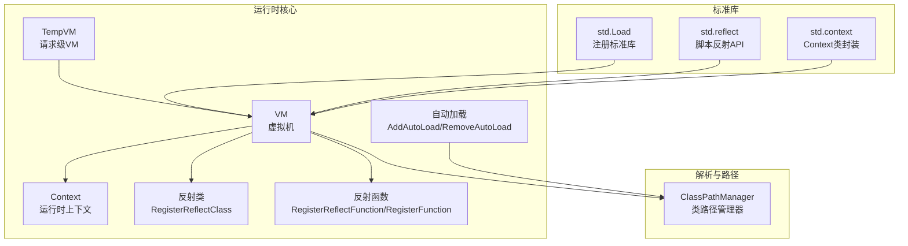
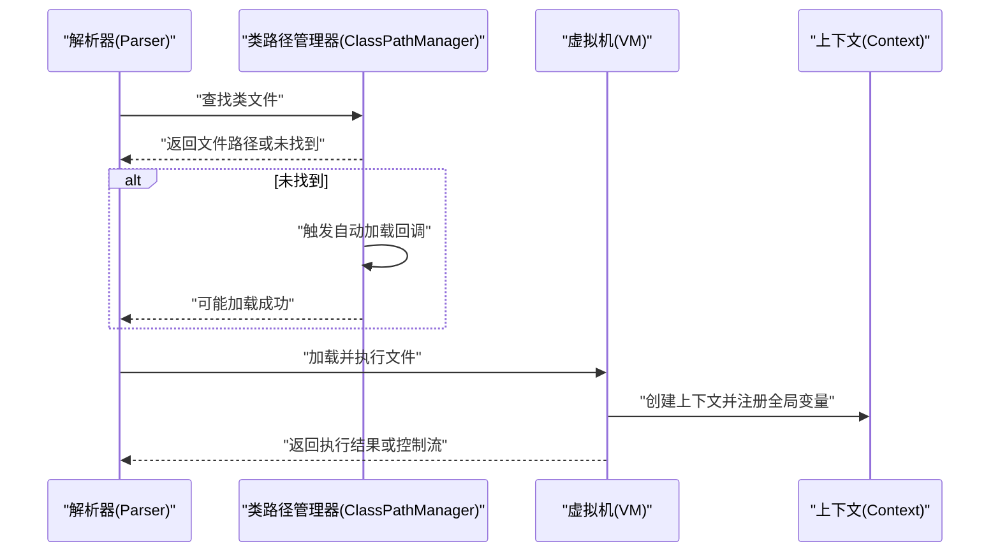
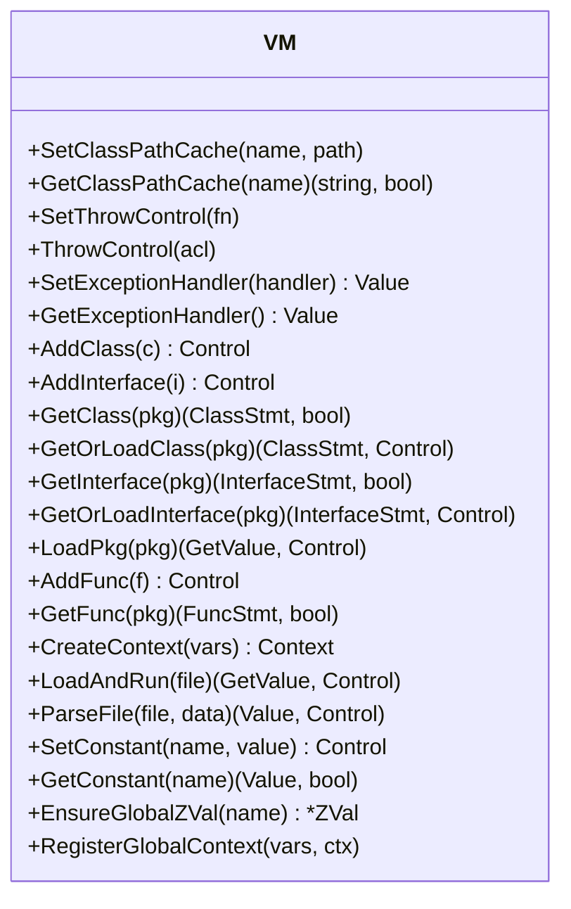
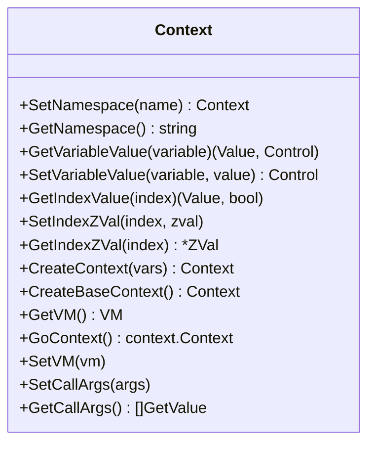
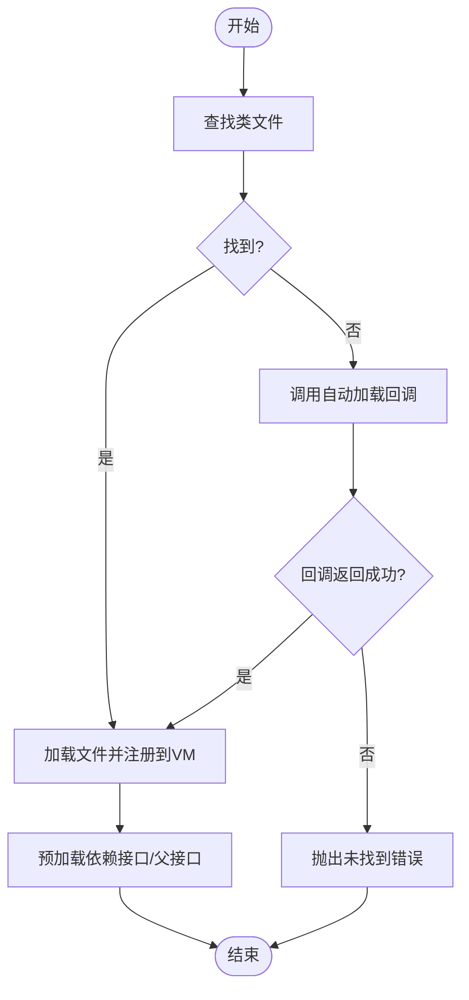
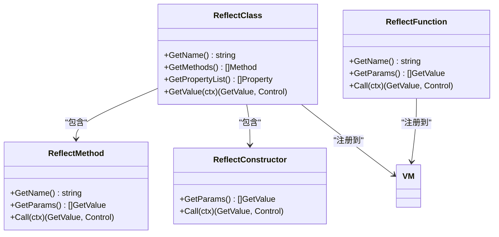
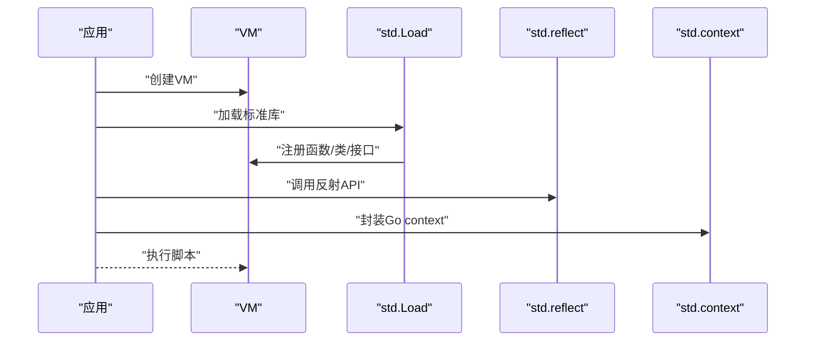
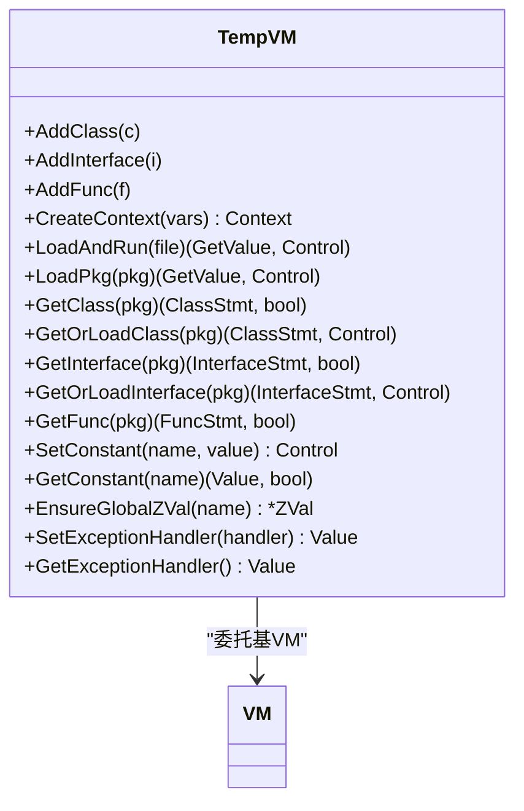
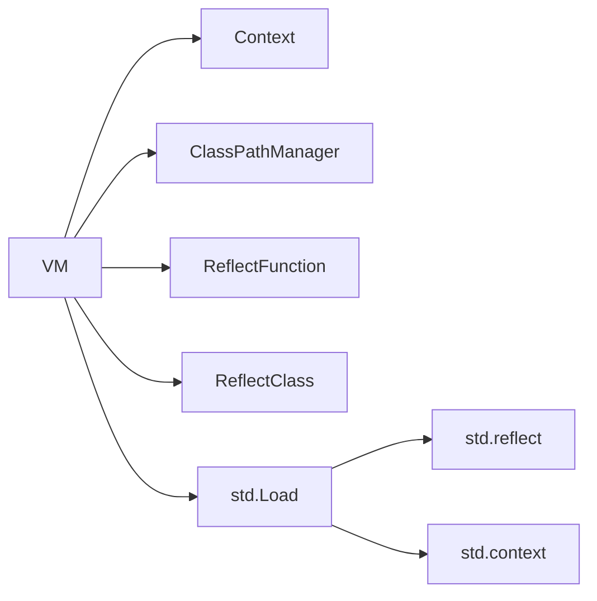

# 运行时API

<cite>
**本文引用的文件**
- [runtime/vm.go](file://runtime/vm.go)
- [runtime/context.go](file://runtime/context.go)
- [runtime/autoload.go](file://runtime/autoload.go)
- [runtime/reflect_class.go](file://runtime/reflect_class.go)
- [runtime/reflect_register.go](file://runtime/reflect_register.go)
- [runtime/vm_temp.go](file://runtime/vm_temp.go)
- [parser/class_path_manager.go](file://parser/class_path_manager.go)
- [std/load.go](file://std/load.go)
- [std/context/context_class.go](file://std/context/context_class.go)
- [std/reflect/reflect.go](file://std/reflect/reflect.go)
- [std/reflect/methods.go](file://std/reflect/methods.go)
- [data/interface.go](file://data/interface.go)
- [data/value.go](file://data/value.go)
</cite>

## 目录
1. [简介](#简介)
2. [项目结构](#项目结构)
3. [核心组件](#核心组件)
4. [架构总览](#架构总览)
5. [详细组件分析](#详细组件分析)
6. [依赖分析](#依赖分析)
7. [性能考量](#性能考量)
8. [故障排查指南](#故障排查指南)
9. [结论](#结论)
10. [附录](#附录)

## 简介
本文件为运行时系统的完整API参考文档，覆盖以下方面：
- 虚拟机API：VM类的方法与指令执行接口
- 上下文管理API：Context类的创建、传播与取消
- 自动加载API：类与函数的自动加载机制
- 反射API：类反射、方法反射与属性反射接口
- 扩展加载API：标准库与自定义扩展的注册与调用机制

文档对每个API提供参数说明、返回值描述与典型使用场景，帮助开发者快速集成与扩展。

## 项目结构
运行时系统主要由以下模块构成：
- 运行时核心：VM、Context、自动加载、反射注册
- 解析与路径管理：类路径管理器与自动加载回调
- 标准库扩展：日志、数据库、反射、系统、通道等
- 数据与类型：值接口、可调用值、迭代器、生成器等

**图表来源**
- [runtime/vm.go:14-391](file://runtime/vm.go#L14-L391)
- [runtime/context.go:12-140](file://runtime/context.go#L12-L140)
- [runtime/autoload.go:8-15](file://runtime/autoload.go#L8-L15)
- [runtime/reflect_class.go:520-524](file://runtime/reflect_class.go#L520-L524)
- [runtime/reflect_register.go:181-189](file://runtime/reflect_register.go#L181-L189)
- [runtime/vm_temp.go:10-228](file://runtime/vm_temp.go#L10-L228)
- [parser/class_path_manager.go:13-428](file://parser/class_path_manager.go#L13-L428)
- [std/load.go:14-39](file://std/load.go#L14-L39)
- [std/reflect/reflect.go:8-93](file://std/reflect/reflect.go#L8-L93)
- [std/context/context_class.go:10-64](file://std/context/context_class.go#L10-L64)

**章节来源**
- [runtime/vm.go:14-391](file://runtime/vm.go#L14-L391)
- [runtime/context.go:12-140](file://runtime/context.go#L12-L140)
- [parser/class_path_manager.go:13-428](file://parser/class_path_manager.go#L13-L428)
- [std/load.go:14-39](file://std/load.go#L14-L39)

## 核心组件
- 虚拟机（VM）
  - 负责类/接口/函数/常量注册与查询、全局变量与常量管理、异常处理回调、文件解析与执行、命名空间与类路径缓存。
- 上下文（Context）
  - 维护变量符号表、函数/方法调用参数列表、命名空间、与VM的绑定关系；提供变量读写、上下文复制与传播。
- 自动加载（AutoLoad）
  - 通过注册回调函数实现类/函数的按需加载；支持移除与链式调用。
- 反射（Reflect）
  - 将Go类型/函数包装为脚本可用的类/方法/函数，支持类型转换与调用。
- 临时VM（TempVM）
  - 请求级隔离的VM，支持热重载与路由缓存，委托大部分操作至基VM。

**章节来源**
- [runtime/vm.go:36-116](file://runtime/vm.go#L36-L116)
- [runtime/context.go:13-125](file://runtime/context.go#L13-L125)
- [runtime/autoload.go:8-15](file://runtime/autoload.go#L8-L15)
- [runtime/reflect_class.go:12-136](file://runtime/reflect_class.go#L12-L136)
- [runtime/reflect_register.go:12-105](file://runtime/reflect_register.go#L12-L105)
- [runtime/vm_temp.go:34-228](file://runtime/vm_temp.go#L34-L228)

## 架构总览
运行时系统采用“解析-执行-反射-扩展”的分层设计：
- 解析层：解析器负责词法/语法分析，类路径管理器负责自动加载与路径查找。
- 运行时层：VM与Context负责执行环境、变量与异常处理。
- 反射层：将Go类型/函数映射为脚本可用的类/方法/函数。
- 扩展层：标准库与用户自定义扩展通过统一接口注册到VM。

**图表来源**
- [parser/class_path_manager.go:327-382](file://parser/class_path_manager.go#L327-L382)
- [runtime/vm.go:275-332](file://runtime/vm.go#L275-L332)

## 详细组件分析

### 虚拟机API（VM）
- NewVM(parser)
  - 参数：解析器指针
  - 返回：虚拟机实例
  - 作用：初始化VM，绑定解析器与上下文，设置ACL回调
  - 使用场景：应用启动时创建全局VM
- SetClassPathCache(name, path)/GetClassPathCache(name)
  - 作用：缓存类到文件的映射，避免重复加载
  - 使用场景：解析阶段加速类定位
- SetThrowControl(fn)/ThrowControl(acl)
  - 作用：设置/触发异常处理回调；优先调用PHP侧set_exception_handler注册的闭包
  - 使用场景：统一异常处理与日志上报
- SetExceptionHandler(handler)/GetExceptionHandler()
  - 作用：注册/获取PHP级异常处理器
  - 使用场景：自定义异常处理逻辑
- AddClass/AddInterface/GetClass/GetOrLoadClass/GetInterface/GetOrLoadInterface/LoadPkg
  - 作用：注册与查询类/接口；支持自动加载
  - 使用场景：标准库与扩展注册、按需加载
- AddFunc/GetFunc
  - 作用：注册与查询函数
  - 使用场景：反射函数注册、标准库函数注册
- CreateContext(vars)
  - 作用：基于变量列表创建上下文
  - 使用场景：函数/方法调用时创建局部上下文
- LoadAndRun(file)/ParseFile(file, data)
  - 作用：解析并执行文件；支持将对象/类的属性注入到文件域变量
  - 使用场景：脚本执行、模板渲染、动态DIY解析
- SetConstant/GetConstant
  - 作用：设置/获取全局常量
  - 使用场景：框架配置、编译期常量注入
- EnsureGlobalZVal/RegisterGlobalContext
  - 作用：确保全局变量存在并注册顶层变量到全局表
  - 使用场景：global语句支持、跨作用域共享状态

**图表来源**
- [runtime/vm.go:36-391](file://runtime/vm.go#L36-L391)

**章节来源**
- [runtime/vm.go:14-391](file://runtime/vm.go#L14-L391)

### 上下文管理API（Context）
- NewContext(vm)
  - 作用：创建上下文并绑定VM
  - 使用场景：VM创建根上下文
- SetNamespace/GetNamespace
  - 作用：设置/获取命名空间
  - 使用场景：命名空间解析与类查找
- GetVariableValue/SetVariableValue
  - 作用：读取/设置变量值；支持引用与深拷贝
  - 使用场景：变量赋值、数组/对象按值复制
- GetIndexValue/SetIndexZVal/GetIndexZVal
  - 作用：按索引访问ZVal
  - 使用场景：函数参数传递、局部变量管理
- CreateContext/CreateBaseContext
  - 作用：复制上下文；创建空上下文
  - 使用场景：函数调用栈、生成器协程
- GetVM/GoContext/SetVM
  - 作用：获取/替换VM；桥接到Go context
  - 使用场景：跨语言集成、异步任务
- SetCallArgs/GetCallArgs
  - 作用：记录/获取调用参数表达式列表
  - 使用场景：func_get_args等内置函数支持

**图表来源**
- [runtime/context.go:13-125](file://runtime/context.go#L13-L125)

**章节来源**
- [runtime/context.go:12-140](file://runtime/context.go#L12-L140)

### 自动加载API
- AddAutoLoad(fun)/RemoveAutoLoad(fun)
  - 作用：注册/移除自动加载回调
  - 使用场景：PSR-4自动加载、插件系统、按需加载
- ClassPathManager接口与默认实现
  - AddNamespace(namespace, path)：注册命名空间到物理路径
  - FindClassFile(className)：查找类文件
  - LoadClass(className, parser)：加载类并提前加载其依赖的接口/父接口
- CallAutoLoad(name, ctx)
  - 作用：遍历已注册回调，传入类名，返回是否成功加载

**图表来源**
- [parser/class_path_manager.go:327-382](file://parser/class_path_manager.go#L327-L382)
- [runtime/autoload.go:8-15](file://runtime/autoload.go#L8-L15)

**章节来源**
- [runtime/autoload.go:8-15](file://runtime/autoload.go#L8-L15)
- [parser/class_path_manager.go:13-428](file://parser/class_path_manager.go#L13-L428)

### 反射API
- 反射类（RegisterReflectClass）
  - NewReflectClass(name, instance)：基于Go实例创建反射类
  - GetValue(ctx)：每次创建新实例并返回ClassValue
  - GetMethods/GetPropertyList等：暴露方法与属性
  - 使用场景：将Go结构体/接口暴露为脚本类
- 反射函数（RegisterReflectFunction/RegisterFunction）
  - NewReflectFunction(name, fn)：基于Go函数创建反射函数
  - Call(ctx)：参数类型转换与返回值转换
  - 使用场景：将Go函数注册为脚本函数
- 批量注册（RegisterReflectFunctions）
  - 作用：批量注册函数，遇到错误记录但不中断
  - 使用场景：扩展模块集中注册

**图表来源**
- [runtime/reflect_class.go:12-136](file://runtime/reflect_class.go#L12-L136)
- [runtime/reflect_class.go:520-524](file://runtime/reflect_class.go#L520-L524)
- [runtime/reflect_register.go:12-105](file://runtime/reflect_register.go#L12-L105)
- [runtime/reflect_register.go:181-189](file://runtime/reflect_register.go#L181-L189)

**章节来源**
- [runtime/reflect_class.go:12-524](file://runtime/reflect_class.go#L12-L524)
- [runtime/reflect_register.go:12-200](file://runtime/reflect_register.go#L12-L200)

### 扩展加载API
- 标准库加载（std.Load）
  - 注册常用函数、日志类、异常接口与类、系统OS类、反射模块、通道、循环、数据库等
  - 使用场景：应用启动时一次性加载标准库
- 脚本反射API（std.reflect）
  - Reflect类提供getClassInfo/getMethodInfo/getPropertyInfo/listMethods/listProperties等方法
  - 使用场景：运行时元信息查询、调试工具、IDE辅助
- Go Context封装（std.context）
  - NewContextClassFrom(source)：将Go context封装为脚本类，暴露deadline/done/err/value方法
  - 使用场景：与Go生态集成、超时控制、取消信号传递

**图表来源**
- [std/load.go:14-39](file://std/load.go#L14-L39)
- [std/reflect/reflect.go:8-93](file://std/reflect/reflect.go#L8-L93)
- [std/context/context_class.go:10-64](file://std/context/context_class.go#L10-L64)

**章节来源**
- [std/load.go:14-39](file://std/load.go#L14-L39)
- [std/reflect/reflect.go:8-93](file://std/reflect/reflect.go#L8-L93)
- [std/context/context_class.go:10-64](file://std/context/context_class.go#L10-L64)

### 请求级VM（TempVM）
- NewTempVM(vm)
  - 作用：基于现有VM创建请求级VM，隔离类/接口/函数注册
- AddClass/AddInterface/AddFunc
  - 作用：仅注册到临时映射，不影响基VM
- GetClass/GetOrLoadClass/GetInterface/GetOrLoadInterface/GetFunc
  - 作用：优先返回临时注册项，否则回退到基VM或自动加载
- LoadAndRun/ParseFile
  - 作用：克隆解析器并绑定临时VM，支持热重载
- SetConstant/GetConstant/EnsureGlobalZVal/SetExceptionHandler
  - 作用：委托给基VM，保证全局一致性

**图表来源**
- [runtime/vm_temp.go:34-228](file://runtime/vm_temp.go#L34-L228)

**章节来源**
- [runtime/vm_temp.go:10-228](file://runtime/vm_temp.go#L10-L228)

## 依赖分析
- VM与Context
  - VM持有Context工厂能力，Context持有VM引用，二者强耦合但职责清晰
- VM与ClassPathManager
  - VM通过解析器间接依赖类路径管理器，实现自动加载与类缓存
- VM与反射
  - VM通过反射注册函数/类，实现Go与脚本的双向桥接
- VM与标准库
  - std.Load集中注册各类/函数/接口，VM作为统一容器

**图表来源**
- [runtime/vm.go:14-391](file://runtime/vm.go#L14-L391)
- [parser/class_path_manager.go:13-428](file://parser/class_path_manager.go#L13-L428)
- [std/load.go:14-39](file://std/load.go#L14-L39)

**章节来源**
- [runtime/vm.go:14-391](file://runtime/vm.go#L14-L391)
- [parser/class_path_manager.go:13-428](file://parser/class_path_manager.go#L13-L428)
- [std/load.go:14-39](file://std/load.go#L14-L39)

## 性能考量
- 类路径缓存
  - 通过SetClassPathCache/GetClassPathCache减少重复文件查找与解析
- 并发安全
  - VM内部使用读写锁保护类/接口/函数/常量映射，避免竞态
- 变量复制策略
  - 对数组/对象进行结构级克隆，避免隐式共享导致的数据竞争
- 自动加载短路
  - 若自动加载回调返回成功，可避免后续解析失败

[本节为通用指导，无需特定文件来源]

## 故障排查指南
- 未找到类/接口
  - 检查命名空间与路径是否正确注册；确认自动加载回调是否返回成功
  - 参考：类路径查找与自动加载流程
- 重复加载类
  - 解析器会检测类路径缓存并阻止重复加载
- 异常处理
  - 优先调用PHP侧set_exception_handler；若回调内部再次抛出未捕获异常，将回落到底层ACL处理
- 反射类型转换失败
  - 检查脚本值到Go类型的映射是否支持；确保参数/返回值类型一致

**章节来源**
- [parser/class_path_manager.go:327-382](file://parser/class_path_manager.go#L327-L382)
- [runtime/vm.go:69-116](file://runtime/vm.go#L69-L116)
- [runtime/reflect_class.go:276-347](file://runtime/reflect_class.go#L276-L347)
- [runtime/reflect_register.go:107-178](file://runtime/reflect_register.go#L107-L178)

## 结论
本运行时系统提供了完整的虚拟机执行环境、上下文管理、自动加载、反射与扩展加载能力。通过VM与Context的清晰职责划分、ClassPathManager的高效路径查找与自动加载机制、反射层的类型转换与函数桥接，以及标准库的集中注册，开发者可以便捷地构建高性能、可扩展的脚本运行时。

[本节为总结性内容，无需特定文件来源]

## 附录

### 数据与类型接口摘要
- Value/CallableValue/Iterator/Generator等接口定义
  - 作用：统一值、可调用、迭代与生成器抽象
- 使用场景：反射函数/类的返回值与参数类型转换、生成器协程支持

**章节来源**
- [data/value.go:3-39](file://data/value.go#L3-L39)
- [data/interface.go:3-59](file://data/interface.go#L3-L59)