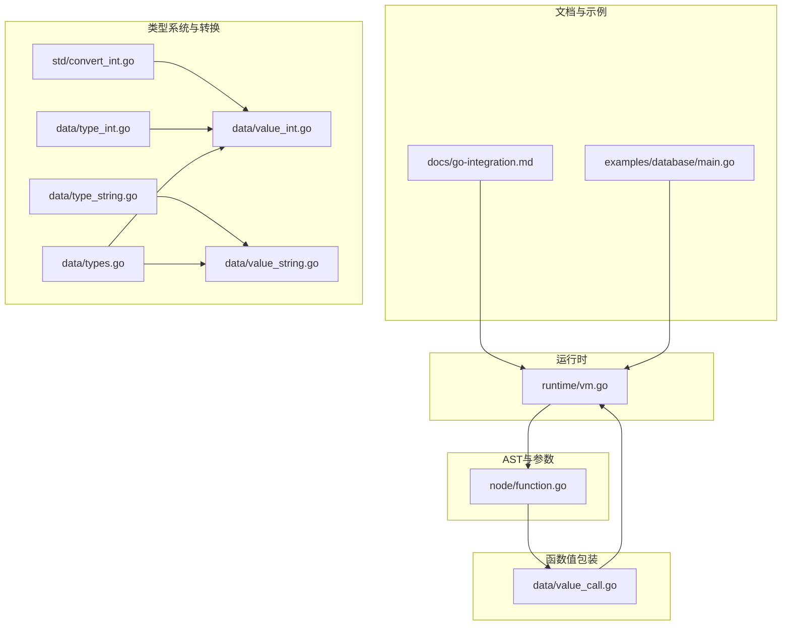
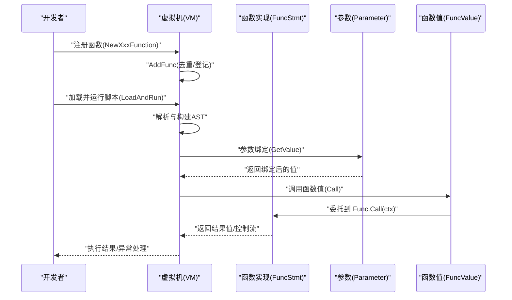
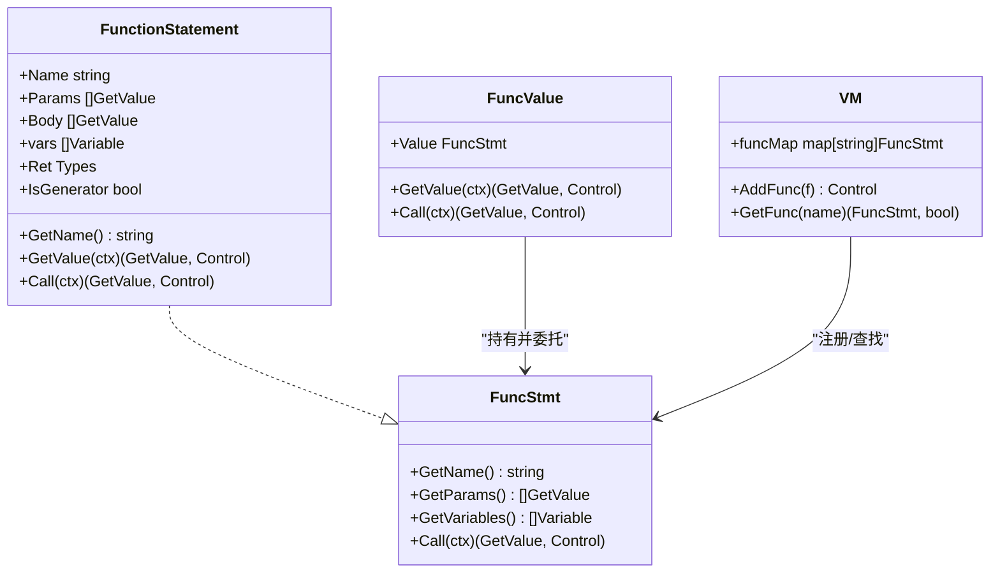
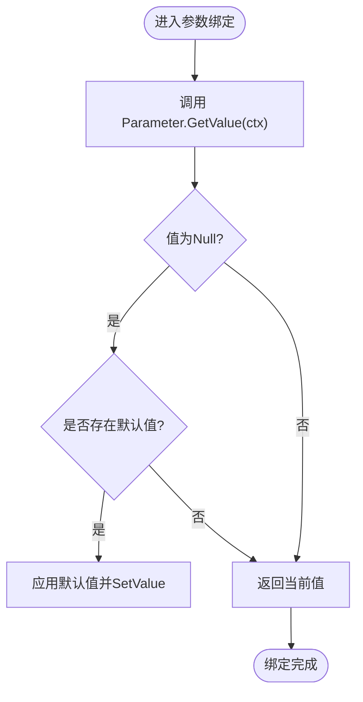
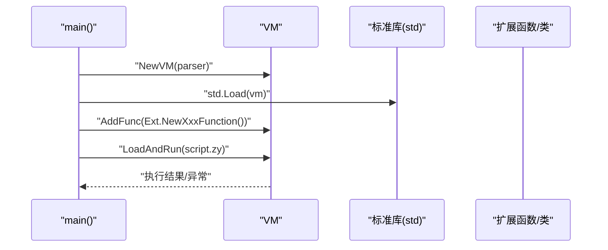
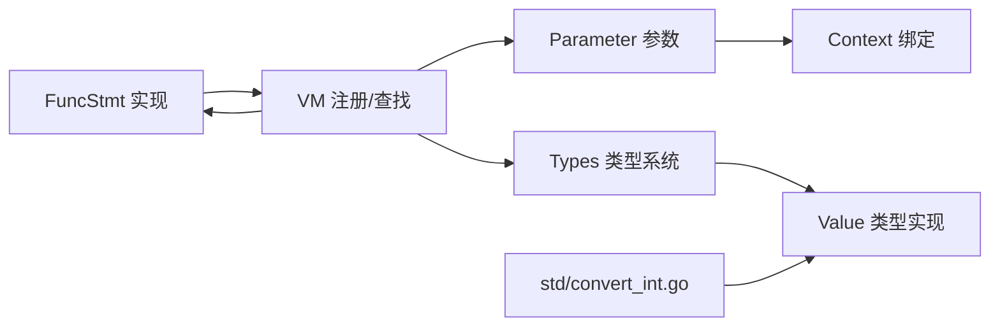

# Go函数集成

<cite>
**本文引用的文件**
- [docs/go-integration.md](file://docs/go-integration.md)
- [runtime/vm.go](file://runtime/vm.go)
- [node/function.go](file://node/function.go)
- [data/value_call.go](file://data/value_call.go)
- [data/context.go](file://data/context.go)
- [data/types.go](file://data/types.go)
- [data/type_int.go](file://data/type_int.go)
- [data/type_string.go](file://data/type_string.go)
- [data/value_int.go](file://data/value_int.go)
- [data/value_string.go](file://data/value_string.go)
- [std/convert_int.go](file://std/convert_int.go)
- [examples/database/main.go](file://examples/database/main.go)
</cite>

## 目录
1. [简介](#简介)
2. [项目结构](#项目结构)
3. [核心组件](#核心组件)
4. [架构总览](#架构总览)
5. [组件详解](#组件详解)
6. [依赖关系分析](#依赖关系分析)
7. [性能考量](#性能考量)
8. [故障排查指南](#故障排查指南)
9. [结论](#结论)
10. [附录](#附录)

## 简介
本文件面向希望将 Go 函数注册为脚本函数的开发者，系统性阐述从函数结构体定义、实现 FuncStmt 接口、参数绑定与类型转换、返回值处理，到最终在虚拟机中注册与调用的完整流程。文档同时给出无参、带参数、带返回值三类函数的实现范式，并总结错误处理、性能优化与调试技巧的最佳实践。

## 项目结构
围绕 Go 函数集成的关键目录与文件：
- 文档与示例：docs/go-integration.md 提供集成指南与示例
- 运行时与注册：runtime/vm.go 提供虚拟机与函数注册入口
- AST 与参数：node/function.go 定义参数节点与函数声明节点
- 函数值包装：data/value_call.go 提供 FuncValue 包装以参与求值与调用
- 类型系统与转换：data/types.go、data/type_int.go、data/type_string.go、data/value_int.go、data/value_string.go、std/convert_int.go
- 示例入口：examples/database/main.go 展示如何在主程序中创建 VM 并加载标准库与脚本

**图表来源**
- [runtime/vm.go:14-33](file://runtime/vm.go#L14-L33)
- [node/function.go:1-450](file://node/function.go#L1-L450)
- [data/value_call.go:1-29](file://data/value_call.go#L1-L29)
- [data/types.go:1-262](file://data/types.go#L1-L262)
- [data/type_int.go:1-17](file://data/type_int.go#L1-L17)
- [data/type_string.go:1-17](file://data/type_string.go#L1-L17)
- [data/value_int.go:1-52](file://data/value_int.go#L1-L52)
- [data/value_string.go:1-86](file://data/value_string.go#L1-L86)
- [std/convert_int.go:1-64](file://std/convert_int.go#L1-L64)
- [examples/database/main.go:1-41](file://examples/database/main.go#L1-L41)

**章节来源**
- [docs/go-integration.md:1-643](file://docs/go-integration.md#L1-L643)
- [runtime/vm.go:14-33](file://runtime/vm.go#L14-L33)
- [node/function.go:1-450](file://node/function.go#L1-L450)
- [data/value_call.go:1-29](file://data/value_call.go#L1-L29)
- [data/types.go:1-262](file://data/types.go#L1-L262)
- [data/type_int.go:1-17](file://data/type_int.go#L1-L17)
- [data/type_string.go:1-17](file://data/type_string.go#L1-L17)
- [data/value_int.go:1-52](file://data/value_int.go#L1-L52)
- [data/value_string.go:1-86](file://data/value_string.go#L1-L86)
- [std/convert_int.go:1-64](file://std/convert_int.go#L1-L64)
- [examples/database/main.go:1-41](file://examples/database/main.go#L1-L41)

## 核心组件
- FuncStmt 接口：函数的最小契约，要求实现 GetName、GetParams、GetVariables、Call
- 参数节点 Parameter：承载参数名、索引、类型与默认值，参与参数绑定与类型检查
- 函数值包装 FuncValue：将 FuncStmt 包装为可求值对象，统一调用入口
- 类型系统 Types：提供类型判断与字符串化，支撑类型安全与错误提示
- 基础类型与转换：Int、String 及其 Value 实现，以及 AsInt、AsString 接口
- 虚拟机 VM：负责函数注册、查找、异常处理与脚本执行

**章节来源**
- [data/context.go:131-138](file://data/context.go#L131-L138)
- [node/function.go:152-244](file://node/function.go#L152-L244)
- [data/value_call.go:5-29](file://data/value_call.go#L5-L29)
- [data/types.go:5-188](file://data/types.go#L5-L188)
- [data/type_int.go:1-17](file://data/type_int.go#L1-L17)
- [data/type_string.go:1-17](file://data/type_string.go#L1-L17)
- [data/value_int.go:13-51](file://data/value_int.go#L13-L51)
- [data/value_string.go:12-85](file://data/value_string.go#L12-L85)
- [runtime/vm.go:245-259](file://runtime/vm.go#L245-L259)

## 架构总览
下图展示了从函数实现到虚拟机注册与调用的整体流程。

**图表来源**
- [runtime/vm.go:245-259](file://runtime/vm.go#L245-L259)
- [runtime/vm.go:275-289](file://runtime/vm.go#L275-L289)
- [node/function.go:82-88](file://node/function.go#L82-L88)
- [data/value_call.go:15-21](file://data/value_call.go#L15-L21)

## 组件详解

### 函数注册与调用流程
- 函数实现需满足 FuncStmt 接口：GetName、GetParams、GetVariables、Call
- 函数定义节点 FunctionStatement 在 GetValue 时向 VM 注册自身
- 调用时，FuncValue 将 Call 委托给底层 FuncStmt
- VM 负责参数绑定、类型检查与异常处理

**图表来源**
- [data/context.go:131-138](file://data/context.go#L131-L138)
- [node/function.go:9-101](file://node/function.go#L9-L101)
- [data/value_call.go:11-21](file://data/value_call.go#L11-L21)
- [runtime/vm.go:245-259](file://runtime/vm.go#L245-L259)

**章节来源**
- [node/function.go:82-88](file://node/function.go#L82-L88)
- [data/value_call.go:15-21](file://data/value_call.go#L15-L21)
- [runtime/vm.go:245-259](file://runtime/vm.go#L245-L259)

### 参数绑定与类型转换机制
- 参数节点 Parameter 支持类型约束与默认值；GetValue 时完成绑定与默认值填充
- 类型转换通过 AsInt、AsString 等接口实现，如字符串转整数、整数转字符串等
- 类型系统 Types 提供 Is 判断，配合基础类型 Int、String 实现类型安全

**图表来源**
- [node/function.go:226-244](file://node/function.go#L226-L244)

**章节来源**
- [node/function.go:152-244](file://node/function.go#L152-L244)
- [data/types.go:5-188](file://data/types.go#L5-L188)
- [data/type_int.go:1-17](file://data/type_int.go#L1-L17)
- [data/type_string.go:1-17](file://data/type_string.go#L1-L17)
- [data/value_int.go:13-51](file://data/value_int.go#L13-L51)
- [data/value_string.go:12-85](file://data/value_string.go#L12-L85)
- [std/convert_int.go:14-50](file://std/convert_int.go#L14-L50)

### 函数类型实现示例

- 无参函数
  - 实现要点：GetName 返回函数名；GetParams 返回空；Call 执行业务逻辑
  - 参考路径：[docs/go-integration.md:18-67](file://docs/go-integration.md#L18-L67)

- 带参数函数
  - 实现要点：GetParams 定义参数节点；Call 中通过 GetValue 获取实参；使用 AsString/AsInt 等接口进行类型转换
  - 参考路径：[docs/go-integration.md:32-61](file://docs/go-integration.md#L32-L61)

- 带返回值函数
  - 实现要点：Call 返回 data.GetValue；可使用 NewIntValue/NewStringValue 等工厂函数构造返回值
  - 参考路径：[docs/go-integration.md:69-110](file://docs/go-integration.md#L69-L110)

**章节来源**
- [docs/go-integration.md:18-110](file://docs/go-integration.md#L18-L110)

### 虚拟机注册与脚本运行
- 在 main 中创建 VM，加载标准库与自定义函数/类，然后 LoadAndRun 执行脚本
- VM.AddFunc 完成函数注册，内部进行去重与登记
- VM.LoadAndRun 负责解析与执行，支持全局变量注册

**图表来源**
- [examples/database/main.go:15-40](file://examples/database/main.go#L15-L40)
- [runtime/vm.go:245-259](file://runtime/vm.go#L245-L259)
- [runtime/vm.go:275-289](file://runtime/vm.go#L275-L289)

**章节来源**
- [examples/database/main.go:15-40](file://examples/database/main.go#L15-L40)
- [runtime/vm.go:245-259](file://runtime/vm.go#L245-L259)
- [runtime/vm.go:275-289](file://runtime/vm.go#L275-L289)

## 依赖关系分析
- 函数实现依赖 VM 的注册与查找能力
- 参数节点依赖上下文完成变量绑定与默认值填充
- 类型系统与 Value 实现共同保障类型安全与转换
- 标准库函数（如 int 转换）示范了 AsInt/AsString 的使用模式

**图表来源**
- [runtime/vm.go:245-259](file://runtime/vm.go#L245-L259)
- [node/function.go:152-244](file://node/function.go#L152-L244)
- [data/types.go:5-188](file://data/types.go#L5-L188)
- [data/value_int.go:13-51](file://data/value_int.go#L13-L51)
- [data/value_string.go:12-85](file://data/value_string.go#L12-L85)
- [std/convert_int.go:14-50](file://std/convert_int.go#L14-L50)

**章节来源**
- [runtime/vm.go:245-259](file://runtime/vm.go#L245-L259)
- [node/function.go:152-244](file://node/function.go#L152-L244)
- [data/types.go:5-188](file://data/types.go#L5-L188)
- [data/value_int.go:13-51](file://data/value_int.go#L13-L51)
- [data/value_string.go:12-85](file://data/value_string.go#L12-L85)
- [std/convert_int.go:14-50](file://std/convert_int.go#L14-L50)

## 性能考量
- 类型转换与默认值填充发生在参数绑定阶段，建议在函数实现中尽量减少重复转换
- 使用 AsInt/AsString 等接口进行安全转换，避免不必要的字符串解析
- 对于热点路径，可考虑缓存中间结果或复用对象，降低分配开销
- 异常处理与日志记录应避免在高频路径中频繁输出

[本节为通用指导，无需特定文件引用]

## 故障排查指南
- 类型转换失败
  - 现象：参数无法按期望类型转换
  - 处理：使用类型断言与默认值策略；参考安全转换示例
  - 参考路径：[docs/go-integration.md:575-600](file://docs/go-integration.md#L575-L600)

- 内存泄漏
  - 现象：长时间运行后内存增长
  - 处理：及时清理资源，确保在函数结束时释放临时资源
  - 参考路径：[docs/go-integration.md:602-624](file://docs/go-integration.md#L602-L624)

- 参数验证
  - 建议：在 Call 前对参数数量与非空进行校验，必要时抛出明确错误
  - 参考路径：[docs/go-integration.md:555-571](file://docs/go-integration.md#L555-L571)

- 日志与调试
  - 建议：在关键路径打印上下文与参数摘要，便于定位问题
  - 参考路径：[docs/go-integration.md:534-553](file://docs/go-integration.md#L534-L553)

**章节来源**
- [docs/go-integration.md:534-624](file://docs/go-integration.md#L534-L624)

## 结论
通过 FuncStmt 接口与参数节点 Parameter 的协作，结合 VM 的注册与调用机制，开发者可以将任意 Go 函数无缝集成到脚本环境中。借助类型系统与 AsInt/AsString 等接口，可以在保证类型安全的前提下实现灵活的参数绑定与返回值处理。配合错误处理、性能优化与调试技巧，可构建稳定高效的扩展函数体系。

[本节为总结性内容，无需特定文件引用]

## 附录

### 快速上手清单
- 定义函数结构体并实现 FuncStmt 接口
- 在函数中通过 GetParams/GetValue 获取参数并进行类型转换
- 使用 NewIntValue/NewStringValue 等工厂函数返回值
- 在 main 中创建 VM，加载标准库与扩展，注册函数并运行脚本
- 参考示例路径：[docs/go-integration.md:18-110](file://docs/go-integration.md#L18-L110)，[examples/database/main.go:15-40](file://examples/database/main.go#L15-L40)

**章节来源**
- [docs/go-integration.md:18-110](file://docs/go-integration.md#L18-L110)
- [examples/database/main.go:15-40](file://examples/database/main.go#L15-L40)