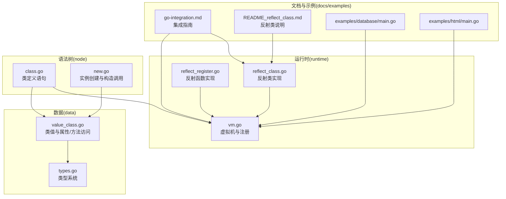
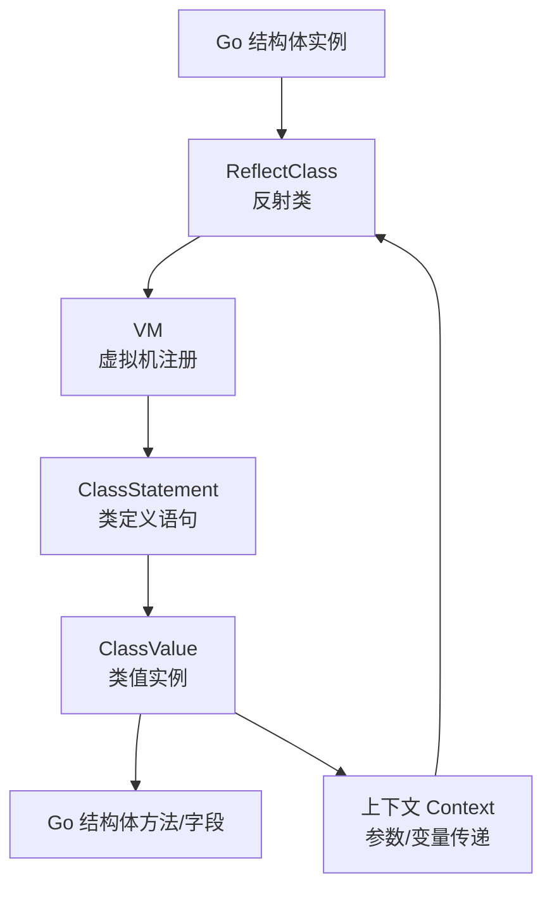
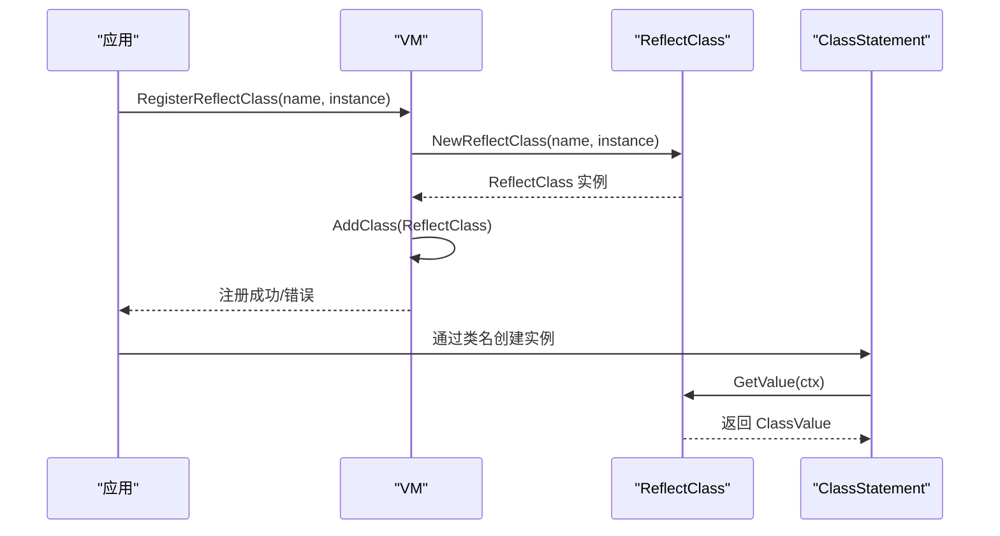
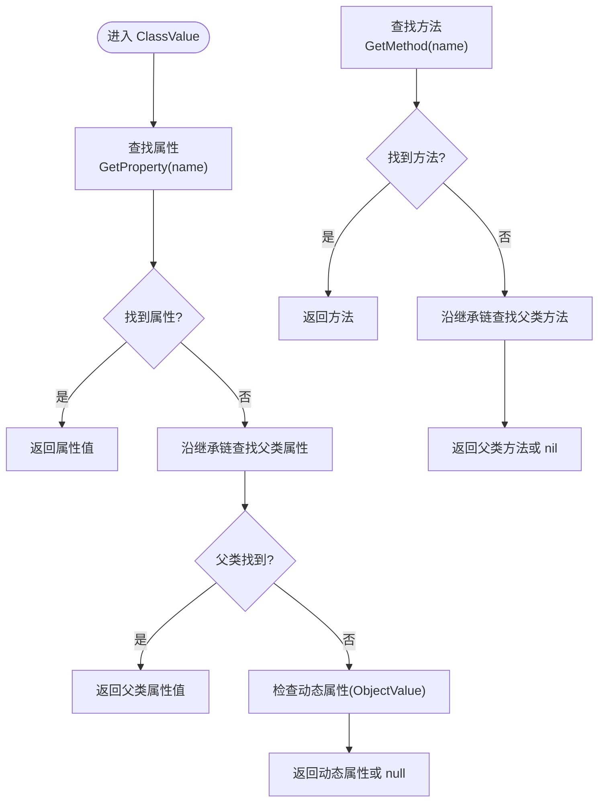
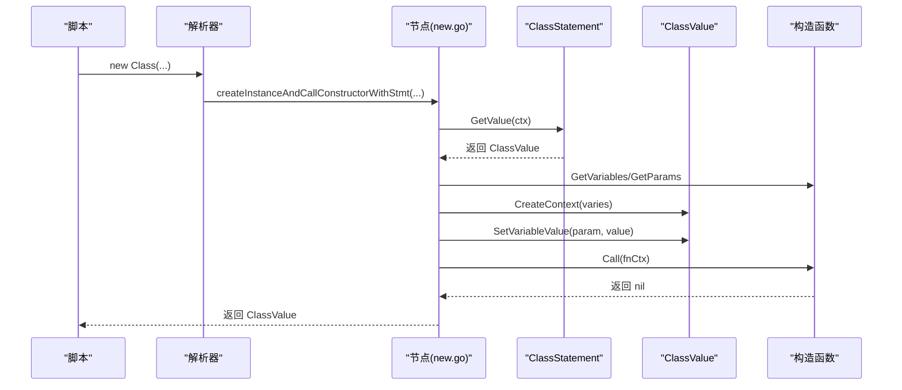
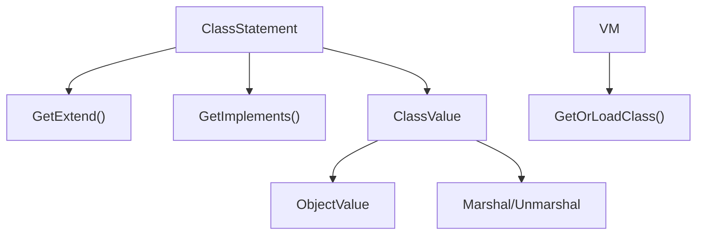
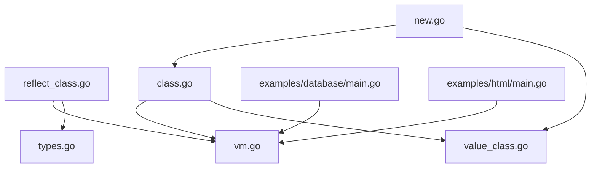

# Go类集成

<cite>
**本文档引用的文件**
- [reflect_class.go](file://runtime/reflect_class.go)
- [reflect_register.go](file://runtime/reflect_register.go)
- [vm.go](file://runtime/vm.go)
- [class.go](file://node/class.go)
- [value_class.go](file://data/value_class.go)
- [types.go](file://data/types.go)
- [go-integration.md](file://docs/go-integration.md)
- [README_reflect_class.md](file://runtime/README_reflect_class.md)
- [class_parser.go](file://parser/class_parser.go)
- [new.go](file://node/new.go)
- [db_scan.go](file://std/database/db_scan.go)
- [go-integration示例-数据库/main.go](file://examples/database/main.go)
- [go-integration示例-HTML/main.go](file://examples/html/main.go)
</cite>

## 目录
1. [简介](#简介)
2. [项目结构](#项目结构)
3. [核心组件](#核心组件)
4. [架构总览](#架构总览)
5. [详细组件分析](#详细组件分析)
6. [依赖分析](#依赖分析)
7. [性能考虑](#性能考虑)
8. [故障排查指南](#故障排查指南)
9. [结论](#结论)
10. [附录](#附录)

## 简介
本文件面向希望将 Go 结构体无缝注册为脚本类的开发者，系统性阐述从结构体定义、类注册、属性访问、方法调用，到实例创建与生命周期管理的完整流程。文档同时覆盖反射类注册、类继承与接口实现、实例管理与最佳实践，帮助读者在不编写繁琐包装代码的前提下，快速将现有 Go 类型暴露给脚本层。

## 项目结构
围绕“Go类集成”的关键代码分布在以下模块：
- 运行时（runtime）：提供反射类注册、函数反射注册、虚拟机（VM）注册接口
- 语法树与节点（node）：类定义语句、构造函数调用、方法调用等
- 数据模型（data）：类值、类型系统、值容器等
- 文档与示例（docs、examples）：集成指南与示例工程入口



**图表来源**
- [reflect_class.go:1-524](file://runtime/reflect_class.go#L1-L524)
- [reflect_register.go:1-200](file://runtime/reflect_register.go#L1-L200)
- [vm.go:1-391](file://runtime/vm.go#L1-L391)
- [class.go:1-528](file://node/class.go#L1-L528)
- [value_class.go:1-295](file://data/value_class.go#L1-L295)
- [types.go:1-262](file://data/types.go#L1-L262)
- [go-integration.md:1-643](file://docs/go-integration.md#L1-L643)
- [README_reflect_class.md:1-205](file://runtime/README_reflect_class.md#L1-L205)
- [new.go:194-292](file://node/new.go#L194-L292)
- [go-integration示例-数据库/main.go:1-41](file://examples/database/main.go#L1-L41)
- [go-integration示例-HTML/main.go:1-50](file://examples/html/main.go#L1-L50)

**章节来源**
- [reflect_class.go:1-524](file://runtime/reflect_class.go#L1-L524)
- [reflect_register.go:1-200](file://runtime/reflect_register.go#L1-L200)
- [vm.go:1-391](file://runtime/vm.go#L1-L391)
- [class.go:1-528](file://node/class.go#L1-L528)
- [value_class.go:1-295](file://data/value_class.go#L1-L295)
- [types.go:1-262](file://data/types.go#L1-L262)
- [go-integration.md:1-643](file://docs/go-integration.md#L1-L643)
- [README_reflect_class.md:1-205](file://runtime/README_reflect_class.md#L1-L205)
- [new.go:194-292](file://node/new.go#L194-L292)
- [go-integration示例-数据库/main.go:1-41](file://examples/database/main.go#L1-L41)
- [go-integration示例-HTML/main.go:1-50](file://examples/html/main.go#L1-L50)

## 核心组件
- 反射类（ReflectClass）：将 Go 结构体自动转换为脚本类，自动发现公开方法并生成脚本方法，支持构造函数参数映射与类型转换。
- 反射函数（ReflectFunction）：将 Go 函数注册为脚本函数，支持参数与返回值的双向类型转换。
- 虚拟机（VM）：统一注册与管理类、接口、函数、常量与全局变量，提供类加载与路径缓存。
- 类定义语句（ClassStatement）：描述脚本类的属性、方法、继承与实现，支持构造函数与默认属性初始化。
- 类值（ClassValue）：类的运行时实例，封装属性访问、方法查找、继承链遍历与上下文管理。
- 类型系统（Types）：提供基础类型、联合类型、可空类型、泛型类型等，支撑类型检查与转换。

**章节来源**
- [reflect_class.go:12-131](file://runtime/reflect_class.go#L12-L131)
- [reflect_register.go:12-105](file://runtime/reflect_register.go#L12-L105)
- [vm.go:36-130](file://runtime/vm.go#L36-L130)
- [class.go:11-84](file://node/class.go#L11-L84)
- [value_class.go:21-295](file://data/value_class.go#L21-L295)
- [types.go:5-262](file://data/types.go#L5-L262)

## 架构总览
下图展示了“Go类集成”的整体架构：从 Go 结构体出发，通过反射类注册到 VM，脚本层通过类名创建实例，实例内部委托到 Go 结构体的方法与属性。



**图表来源**
- [reflect_class.go:219-274](file://runtime/reflect_class.go#L219-L274)
- [vm.go:118-130](file://runtime/vm.go#L118-L130)
- [class.go:28-84](file://node/class.go#L28-L84)
- [value_class.go:8-15](file://data/value_class.go#L8-L15)
- [new.go:194-292](file://node/new.go#L194-L292)

**章节来源**
- [reflect_class.go:219-274](file://runtime/reflect_class.go#L219-L274)
- [vm.go:118-130](file://runtime/vm.go#L118-L130)
- [class.go:28-84](file://node/class.go#L28-L84)
- [value_class.go:8-15](file://data/value_class.go#L8-L15)
- [new.go:194-292](file://node/new.go#L194-L292)

## 详细组件分析

### 反射类（ReflectClass）与反射方法（ReflectMethod）
- 反射类负责：
  - 保存类名、Go 类型、方法与属性映射
  - 在 GetValue 时创建新的 Go 实例并返回代理类值
  - 分析公开方法并生成脚本可用的方法包装
- 反射方法负责：
  - 参数解析：从上下文获取参数值，结合 Go 方法签名进行类型转换
  - 返回值转换：将 Go 返回值转换为脚本值
  - 调用 Go 方法：通过 reflect.Value.Call 执行

```mermaid
classDiagram
class ReflectClass {
+string name
+reflect.Type instanceType
+map~string,Method~ methods
+map~string,Property~ properties
+interface{} instance
+GetName() string
+GetExtend() *string
+GetImplements() []string
+GetProperty(name) (Property,bool)
+GetPropertyList() []Property
+GetMethod(name) (Method,bool)
+GetMethods() []Method
+GetConstruct() Method
+GetValue(ctx) (GetValue,Control)
+AsString() string
+GetFrom() From
-analyzeMethods()
}
class ReflectMethod {
+string name
+reflect.Method method
+interface{} instance
+reflect.Type instanceType
+GetName() string
+GetModifier() Modifier
+GetIsStatic() bool
+GetParams() []GetValue
+GetVariables() []Variable
+GetReturnType() Types
+Call(ctx) (GetValue,Control)
-convertToGoValue(scriptValue,goType) (reflect.Value,error)
-convertToScriptValue(goValue) (GetValue,error)
}
class ReflectConstructor {
+string className
+reflect.Type instanceType
+interface{} instance
+GetName() string
+GetModifier() Modifier
+GetIsStatic() bool
+GetParams() []GetValue
+GetVariables() []Variable
+GetReturnType() Types
+Call(ctx) (GetValue,Control)
-setFieldValue(instance,fieldName,value) error
}
ReflectClass --> ReflectMethod : "持有"
ReflectClass --> ReflectConstructor : "持有"
```

**图表来源**
- [reflect_class.go:13-131](file://runtime/reflect_class.go#L13-L131)
- [reflect_class.go:144-274](file://runtime/reflect_class.go#L144-L274)
- [reflect_class.go:350-448](file://runtime/reflect_class.go#L350-L448)

**章节来源**
- [reflect_class.go:13-131](file://runtime/reflect_class.go#L13-L131)
- [reflect_class.go:144-274](file://runtime/reflect_class.go#L144-L274)
- [reflect_class.go:350-448](file://runtime/reflect_class.go#L350-L448)

### 虚拟机（VM）与类注册
- VM 提供 AddClass/AddFunc/AddInterface 等注册入口，确保类名唯一性与接口一致性
- GetOrLoadClass 支持自动加载类定义文件，配合 classMap 与 classPathMap 实现缓存
- RegisterReflectClass 将反射类注册到 VM，供脚本层使用



**图表来源**
- [vm.go:118-130](file://runtime/vm.go#L118-L130)
- [reflect_class.go:219-274](file://runtime/reflect_class.go#L219-L274)
- [class.go:28-84](file://node/class.go#L28-L84)

**章节来源**
- [vm.go:118-130](file://runtime/vm.go#L118-L130)
- [reflect_class.go:219-274](file://runtime/reflect_class.go#L219-L274)
- [class.go:28-84](file://node/class.go#L28-L84)

### 类值（ClassValue）与属性/方法访问
- ClassValue 封装实例属性与方法查找，支持继承链上的属性与方法遍历
- GetProperty/GetPropertyStmt 支持从类定义与父类继承链获取属性
- GetMethod 支持从类与继承链查找方法
- SetProperty 支持动态属性设置与克隆（数组/对象）



**图表来源**
- [value_class.go:83-137](file://data/value_class.go#L83-L137)
- [value_class.go:225-238](file://data/value_class.go#L225-L238)

**章节来源**
- [value_class.go:83-137](file://data/value_class.go#L83-L137)
- [value_class.go:225-238](file://data/value_class.go#L225-L238)

### 实例创建与构造函数调用
- createInstanceAndCallConstructorWithStmt 负责：
  - 通过类定义语句创建类值实例
  - 解析构造函数参数，设置到函数上下文
  - 处理属性提升参数，将参数值写入实例属性
  - 调用构造函数并返回实例



**图表来源**
- [new.go:194-292](file://node/new.go#L194-L292)
- [class.go:28-84](file://node/class.go#L28-L84)
- [value_class.go:210-219](file://data/value_class.go#L210-L219)

**章节来源**
- [new.go:194-292](file://node/new.go#L194-L292)
- [class.go:28-84](file://node/class.go#L28-L84)
- [value_class.go:210-219](file://data/value_class.go#L210-L219)

### 类继承、接口实现与实例管理
- 类继承：ClassStatement.GetValue 会沿 Extends 链初始化父类默认属性
- 接口实现：ClassStatement.GetImplements 返回实现的接口列表，VM.GetOrLoadClass 支持按命名空间加载
- 实例管理：ClassValue 持有 ObjectValue，支持属性范围遍历与序列化/反序列化



**图表来源**
- [class.go:118-129](file://node/class.go#L118-L129)
- [class.go:44-81](file://node/class.go#L44-L81)
- [vm.go:162-181](file://runtime/vm.go#L162-L181)
- [value_class.go:284-295](file://data/value_class.go#L284-L295)

**章节来源**
- [class.go:118-129](file://node/class.go#L118-L129)
- [class.go:44-81](file://node/class.go#L44-L81)
- [vm.go:162-181](file://runtime/vm.go#L162-L181)
- [value_class.go:284-295](file://data/value_class.go#L284-L295)

### 反射函数与批量注册
- ReflectFunction 将任意 Go 函数注册为脚本函数，支持参数与返回值类型转换
- RegisterReflectFunctions 支持批量注册，便于扩展库初始化

**章节来源**
- [reflect_register.go:12-105](file://runtime/reflect_register.go#L12-L105)
- [reflect_register.go:191-200](file://runtime/reflect_register.go#L191-L200)

## 依赖分析
- 反射类依赖 VM 的 AddClass 与类加载机制
- 类值依赖类型系统进行类型检查与转换
- 实例创建依赖类定义语句与构造函数
- 示例工程通过 main.go 展示如何加载标准库与注册反射类



**图表来源**
- [reflect_class.go:1-524](file://runtime/reflect_class.go#L1-L524)
- [vm.go:1-391](file://runtime/vm.go#L1-L391)
- [class.go:1-528](file://node/class.go#L1-L528)
- [value_class.go:1-295](file://data/value_class.go#L1-L295)
- [new.go:194-292](file://node/new.go#L194-L292)
- [go-integration示例-数据库/main.go:1-41](file://examples/database/main.go#L1-L41)
- [go-integration示例-HTML/main.go:1-50](file://examples/html/main.go#L1-L50)

**章节来源**
- [reflect_class.go:1-524](file://runtime/reflect_class.go#L1-L524)
- [vm.go:1-391](file://runtime/vm.go#L1-L391)
- [class.go:1-528](file://node/class.go#L1-L528)
- [value_class.go:1-295](file://data/value_class.go#L1-L295)
- [new.go:194-292](file://node/new.go#L194-L292)
- [go-integration示例-数据库/main.go:1-41](file://examples/database/main.go#L1-L41)
- [go-integration示例-HTML/main.go:1-50](file://examples/html/main.go#L1-L50)

## 性能考虑
- 反射调用存在一定开销，建议对热点路径进行缓存或改用手动包装类
- 参数与返回值的类型转换为必要成本，尽量减少复杂类型（如切片、映射）的频繁转换
- 构造函数参数提升与默认值处理在实例创建阶段完成，避免运行期重复计算

[本节为通用指导，无需特定文件引用]

## 故障排查指南
- 类名冲突：VM.AddClass 会在同名类或接口已存在时返回错误，检查命名空间与注册顺序
- 类加载失败：GetOrLoadClass 会在找不到类时抛出错误，确认类文件命名与命名空间一致
- 反射方法不存在：ReflectMethod 仅发现公开方法（首字母大写），检查方法可见性
- 类型转换失败：ReflectMethod/ReflectFunction 在参数或返回值转换失败时抛出错误，检查脚本传入类型与 Go 方法签名

**章节来源**
- [vm.go:118-130](file://runtime/vm.go#L118-L130)
- [vm.go:162-181](file://runtime/vm.go#L162-L181)
- [reflect_class.go:276-327](file://runtime/reflect_class.go#L276-L327)
- [reflect_register.go:107-158](file://runtime/reflect_register.go#L107-L158)

## 结论
通过反射类与反射函数，Origami 能够将 Go 结构体与函数无缝暴露给脚本层，显著降低集成成本。结合 VM 的统一注册与类加载机制、ClassStatement 的类定义与继承支持、ClassValue 的实例管理与属性/方法访问，开发者可以在不编写大量包装代码的前提下，实现高性能、类型安全的扩展能力。

[本节为总结，无需特定文件引用]

## 附录

### 类注册流程（从结构体到实例）
- 定义 Go 结构体与方法
- 在 main.go 中创建 VM 并加载标准库
- 调用 vm.RegisterReflectClass 注册反射类
- 脚本中通过 new Class(...) 创建实例
- 实例内部委托到 Go 结构体的方法与属性

**章节来源**
- [README_reflect_class.md:14-84](file://runtime/README_reflect_class.md#L14-L84)
- [go-integration.md:248-278](file://docs/go-integration.md#L248-L278)
- [go-integration示例-数据库/main.go:22-26](file://examples/database/main.go#L22-L26)
- [go-integration示例-HTML/main.go:24-28](file://examples/html/main.go#L24-L28)

### 类属性与方法实现示例
- 构造函数：ReflectConstructor 支持按结构体字段作为参数，自动设置字段值
- 普通方法：ReflectMethod 通过反射调用，自动进行类型转换
- 静态方法：可通过手动包装类实现静态方法（参考集成指南）

**章节来源**
- [reflect_class.go:424-448](file://runtime/reflect_class.go#L424-L448)
- [reflect_class.go:230-274](file://runtime/reflect_class.go#L230-L274)
- [go-integration.md:112-246](file://docs/go-integration.md#L112-L246)

### 属性值获取与设置机制
- 属性访问：ClassValue.GetProperty 按顺序查找类定义属性、父类属性与动态属性
- 属性设置：SetProperty 支持克隆数组/对象，避免共享状态引发副作用

**章节来源**
- [value_class.go:83-100](file://data/value_class.go#L83-L100)
- [value_class.go:225-238](file://data/value_class.go#L225-L238)

### 方法参数处理方式
- 参数解析：ReflectMethod/ReflectFunction 从上下文获取参数值并转换为 Go 类型
- 返回值处理：将 Go 返回值转换为脚本值，不支持的类型通过字符串化处理

**章节来源**
- [reflect_class.go:276-327](file://runtime/reflect_class.go#L276-L327)
- [reflect_register.go:107-178](file://runtime/reflect_register.go#L107-L178)

### 类继承、接口实现与实例管理最佳实践
- 继承链初始化：ClassStatement.GetValue 会沿 Extends 链初始化默认属性
- 接口实现：通过 GetImplements 返回接口列表，VM.GetOrLoadClass 支持按命名空间加载
- 实例管理：ClassValue 支持序列化/反序列化与属性范围遍历，适合持久化与调试

**章节来源**
- [class.go:44-81](file://node/class.go#L44-L81)
- [vm.go:162-181](file://runtime/vm.go#L162-L181)
- [value_class.go:284-295](file://data/value_class.go#L284-L295)