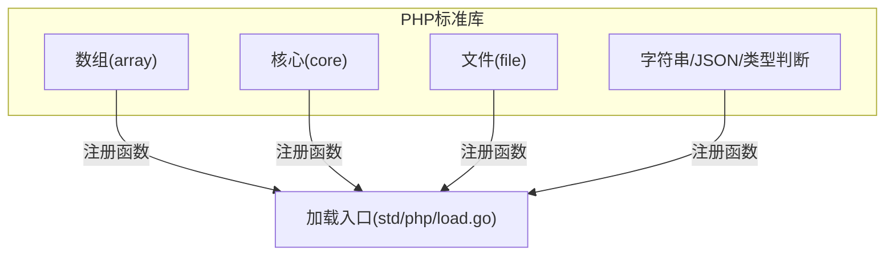
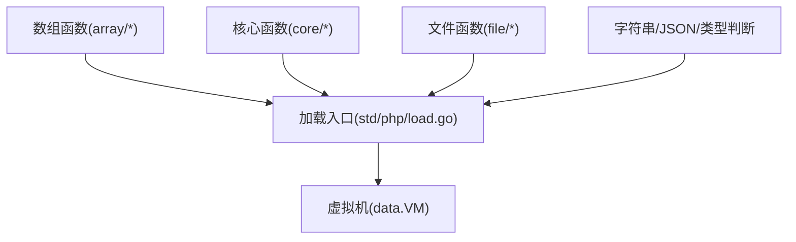
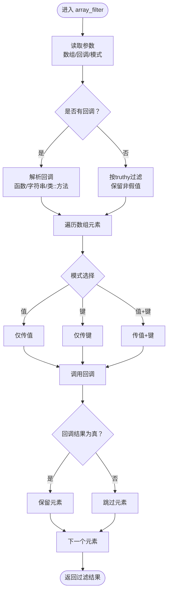
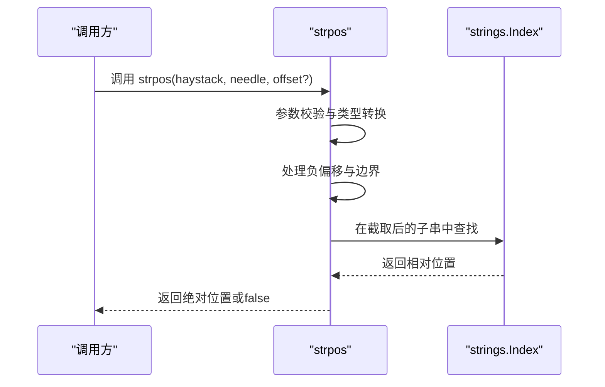
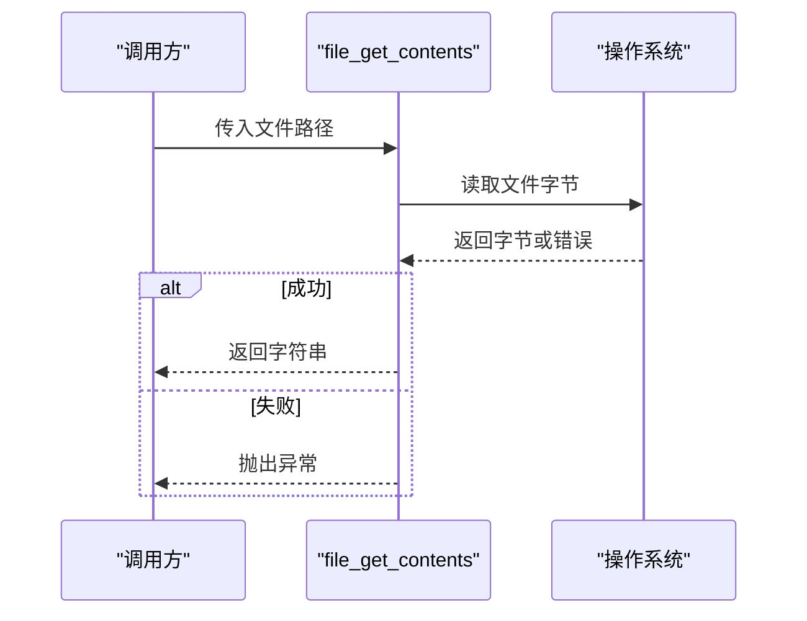
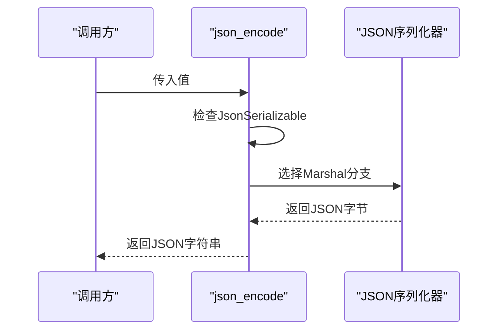
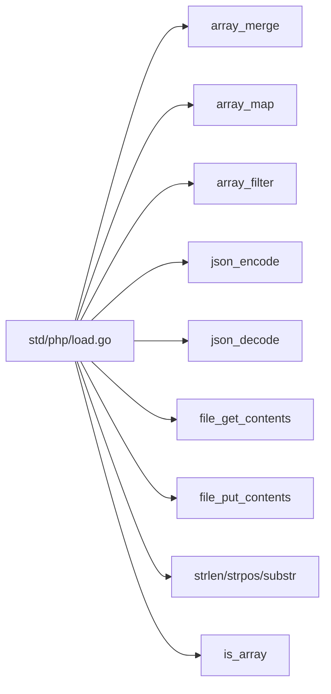

# PHP标准库

<cite>
**本文引用的文件**
- [std/php/load.go](file://std/php/load.go)
- [std/php/README.md](file://std/php/README.md)
- [std/php/array/array_merge.go](file://std/php/array/array_merge.go)
- [std/php/array/array_map.go](file://std/php/array/array_map.go)
- [std/php/core/array_filter.go](file://std/php/core/array_filter.go)
- [std/php/strlen.go](file://std/php/strlen.go)
- [std/php/strpos.go](file://std/php/strpos.go)
- [std/php/substr.go](file://std/php/substr.go)
- [std/php/file_get_contents.go](file://std/php/file_get_contents.go)
- [std/php/file_put_contents.go](file://std/php/file_put_contents.go)
- [std/php/is_array.go](file://std/php/is_array.go)
- [std/php/json_encode.go](file://std/php/json_encode.go)
- [std/php/json_decode.go](file://std/php/json_decode.go)
</cite>

## 目录
1. [简介](#简介)
2. [项目结构](#项目结构)
3. [核心组件](#核心组件)
4. [架构总览](#架构总览)
5. [详细组件分析](#详细组件分析)
6. [依赖关系分析](#依赖关系分析)
7. [性能考量](#性能考量)
8. [故障排查指南](#故障排查指南)
9. [结论](#结论)
10. [附录](#附录)

## 简介
本文件面向Origami运行时的PHP标准库支持，系统性梳理数组、字符串、文件系统、JSON、类型判断等模块的函数签名、参数与返回值、行为语义、与原生PHP的差异与兼容性、以及性能特性与使用建议。文档同时提供流程图与序列图帮助理解关键函数的工作流。

## 项目结构
PHP标准库位于std/php目录下，采用按功能域分包的方式组织：
- array：数组操作族函数（如array_merge、array_map、array_filter等）
- core：核心语言级函数（如array_filter、basename、dirname、call_user_func等）
- file：文件存在性与元数据检查
- 其他：字符串处理（如strlen、strpos、substr）、JSON编解码、类型判断（如is_array）、文件读写（file_get_contents、file_put_contents）等

图表来源
- [std/php/load.go:19-212](file://std/php/load.go#L19-L212)

章节来源
- [std/php/load.go:19-212](file://std/php/load.go#L19-L212)
- [std/php/README.md:1](file://std/php/README.md#L1)

## 核心组件
本节概述PHP标准库的关键模块及其职责：
- 数组操作：提供数组合并、映射、过滤、排序、切片、栈操作等
- 字符串处理：提供长度、位置查询、子串提取、大小写转换、拆分与拼接等
- 文件系统访问：提供文件存在性、可读写性、大小、修改时间等检查
- JSON编解码：提供对象/数组与JSON字符串之间的双向转换
- 类型判断：提供is_*系列函数，用于判断值的类型
- 其他：时间、正则、序列化/反序列化、进程与流等

章节来源
- [std/php/load.go:19-212](file://std/php/load.go#L19-L212)

## 架构总览
PHP标准库通过加载入口集中注册函数与常量，并在运行时由虚拟机统一调度。数组与核心函数分别在各自包内实现，再由load.go统一导入。

图表来源
- [std/php/load.go:19-212](file://std/php/load.go#L19-L212)

## 详细组件分析

### 数组操作
- array_merge
  - 功能：合并多个数组。纯列表数组合并为列表；遇到关联数组则统一转为对象表示，字符串键覆盖策略遵循PHP语义
  - 参数与返回：可变参数，接收若干数组；返回合并后的数组（列表或对象）
  - 复杂度：O(N)，N为所有输入元素总数
  - 兼容性：与原生PHP行为一致，但内部以ArrayValue/ObjectValue抽象表示
  - 示例路径：[std/php/array/array_merge.go:10-108](file://std/php/array/array_merge.go#L10-L108)

- array_map
  - 功能：对一个或多个数组的对应元素调用回调，返回映射结果
  - 参数与返回：第一个参数为回调，后续为数组；返回映射后的数组
  - 复杂度：O(M*N)，M为数组数量，N为最短数组长度
  - 兼容性：支持匿名函数与实现可调用接口的对象；多数组按最短长度对齐
  - 示例路径：[std/php/array/array_map.go:14-136](file://std/php/array/array_map.go#L14-L136)

- array_filter
  - 功能：根据回调或truthy规则过滤数组元素；支持三种模式（值、键、值+键）
  - 参数与返回：数组、可选回调、可选模式；返回过滤后的数组
  - 复杂度：O(N)，N为数组元素数
  - 兼容性：与原生PHP一致；回调解析支持字符串函数名与类静态方法数组形式
  - 示例路径：[std/php/core/array_filter.go:52-356](file://std/php/core/array_filter.go#L52-L356)

图表来源
- [std/php/core/array_filter.go:58-205](file://std/php/core/array_filter.go#L58-L205)

章节来源
- [std/php/array/array_merge.go:10-108](file://std/php/array/array_merge.go#L10-L108)
- [std/php/array/array_map.go:14-136](file://std/php/array/array_map.go#L14-L136)
- [std/php/core/array_filter.go:52-356](file://std/php/core/array_filter.go#L52-L356)

### 字符串处理
- strlen
  - 功能：返回字符串长度；对null返回0
  - 参数与返回：单个字符串参数；返回整数
  - 示例路径：[std/php/strlen.go:8-51](file://std/php/strlen.go#L8-L51)

- strpos
  - 功能：查找子串首次出现位置；支持偏移量（含负值）
  - 参数与返回：源串、子串、可选偏移；返回位置或false
  - 示例路径：[std/php/strpos.go:10-85](file://std/php/strpos.go#L10-L85)

- substr
  - 功能：提取子串；支持负起始与负长度
  - 参数与返回：源串、起始、可选长度；返回子串
  - 示例路径：[std/php/substr.go:8-106](file://std/php/substr.go#L8-L106)

图表来源
- [std/php/strpos.go:16-64](file://std/php/strpos.go#L16-L64)

章节来源
- [std/php/strlen.go:8-51](file://std/php/strlen.go#L8-L51)
- [std/php/strpos.go:10-85](file://std/php/strpos.go#L10-L85)
- [std/php/substr.go:8-106](file://std/php/substr.go#L8-L106)

### 文件系统访问
- file_get_contents
  - 功能：读取文件内容为字符串
  - 参数与返回：文件路径；返回文件内容字符串
  - 错误处理：路径缺失或读取失败抛出异常
  - 示例路径：[std/php/file_get_contents.go:11-58](file://std/php/file_get_contents.go#L11-L58)

- file_put_contents
  - 功能：将数据写入文件
  - 参数与返回：文件路径、数据；返回写入字节数
  - 错误处理：路径缺失或写入失败抛出异常
  - 示例路径：[std/php/file_put_contents.go:11-70](file://std/php/file_put_contents.go#L11-L70)

图表来源
- [std/php/file_get_contents.go:17-42](file://std/php/file_get_contents.go#L17-L42)

章节来源
- [std/php/file_get_contents.go:11-58](file://std/php/file_get_contents.go#L11-L58)
- [std/php/file_put_contents.go:11-70](file://std/php/file_put_contents.go#L11-L70)

### JSON编解码
- json_encode
  - 功能：将值序列化为JSON字符串；支持实现JsonSerializable的对象
  - 参数与返回：任意值；返回JSON字符串
  - 示例路径：[std/php/json_encode.go:11-106](file://std/php/json_encode.go#L11-L106)

- json_decode
  - 功能：将JSON字符串反序列化为通用对象或指定类实例
  - 参数与返回：JSON字符串、可选类名；返回对象或类实例
  - 示例路径：[std/php/json_decode.go:9-121](file://std/php/json_decode.go#L9-L121)

图表来源
- [std/php/json_encode.go:19-89](file://std/php/json_encode.go#L19-L89)

章节来源
- [std/php/json_encode.go:11-106](file://std/php/json_encode.go#L11-L106)
- [std/php/json_decode.go:9-121](file://std/php/json_decode.go#L9-L121)

### 类型判断
- is_array
  - 功能：判断值是否为数组（数字索引或字符串键）
  - 参数与返回：任意值；返回布尔
  - 示例路径：[std/php/is_array.go:8-47](file://std/php/is_array.go#L8-L47)

章节来源
- [std/php/is_array.go:8-47](file://std/php/is_array.go#L8-L47)

## 依赖关系分析
- 加载入口集中注册所有PHP标准库函数与常量，形成统一的函数表
- 数组与核心函数分别在各自包内实现，通过load.go聚合
- JSON编解码依赖独立的JSON序列化器模块

图表来源
- [std/php/load.go:19-212](file://std/php/load.go#L19-L212)

章节来源
- [std/php/load.go:19-212](file://std/php/load.go#L19-L212)

## 性能考量
- 数组操作
  - array_merge：合并N个数组的时间复杂度为O(N)，注意混合列表与关联数组时的内部表示切换
  - array_map：按最短数组长度线性扫描，回调调用开销取决于回调实现
  - array_filter：线性扫描，回调调用与truthy判断为O(1)，整体O(N)
- 字符串操作
  - strpos基于标准库字符串查找，substr按字节切片；负索引与边界处理为O(1)
- 文件I/O
  - file_get_contents/file_put_contents为阻塞式系统调用，建议结合异步或缓存策略
- JSON编解码
  - 依赖独立序列化器，编码/解码为线性复杂度；对象实现JsonSerializable时需额外方法调用

## 故障排查指南
- 文件读写
  - 症状：抛出“无文件路径”或“读取/写入失败”
  - 排查：确认路径非空且具有正确权限；检查文件是否存在
  - 参考：[std/php/file_get_contents.go:21-42](file://std/php/file_get_contents.go#L21-L42)、[std/php/file_put_contents.go:22-52](file://std/php/file_put_contents.go#L22-L52)
- JSON编解码
  - 症状：返回null或异常
  - 排查：确认JSON字符串合法；若指定类名，确认类已注册且可实例化
  - 参考：[std/php/json_decode.go:43-101](file://std/php/json_decode.go#L43-L101)
- array_filter回调
  - 症状：回调不可调用或返回值不符合预期
  - 排查：确认回调为函数、字符串函数名或类静态方法数组；检查truthy逻辑
  - 参考：[std/php/core/array_filter.go:208-255](file://std/php/core/array_filter.go#L208-L255)

章节来源
- [std/php/file_get_contents.go:21-42](file://std/php/file_get_contents.go#L21-L42)
- [std/php/file_put_contents.go:22-52](file://std/php/file_put_contents.go#L22-L52)
- [std/php/json_decode.go:43-101](file://std/php/json_decode.go#L43-L101)
- [std/php/core/array_filter.go:208-255](file://std/php/core/array_filter.go#L208-L255)

## 结论
Origami的PHP标准库以模块化方式实现主流PHP函数，通过统一加载入口注册至虚拟机，保证了与原生PHP的高一致性。数组、字符串、文件系统、JSON与类型判断等核心能力覆盖广泛，适合在脚本中直接调用。建议在性能敏感场景关注数组与字符串操作的复杂度，并结合I/O与JSON编解码的异步策略提升吞吐。

## 附录
- 常量与默认定义：加载入口还集中设置了目录分隔符、数组排序常量、错误级别常量、PHP版本与系统信息常量、数学常量与整/浮点范围常量等
  - 参考：[std/php/load.go:214-294](file://std/php/load.go#L214-L294)

章节来源
- [std/php/load.go:214-294](file://std/php/load.go#L214-L294)