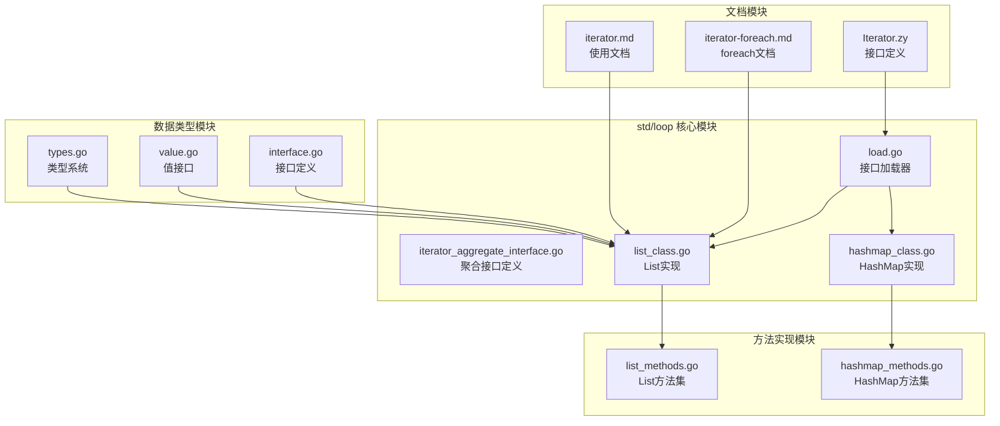
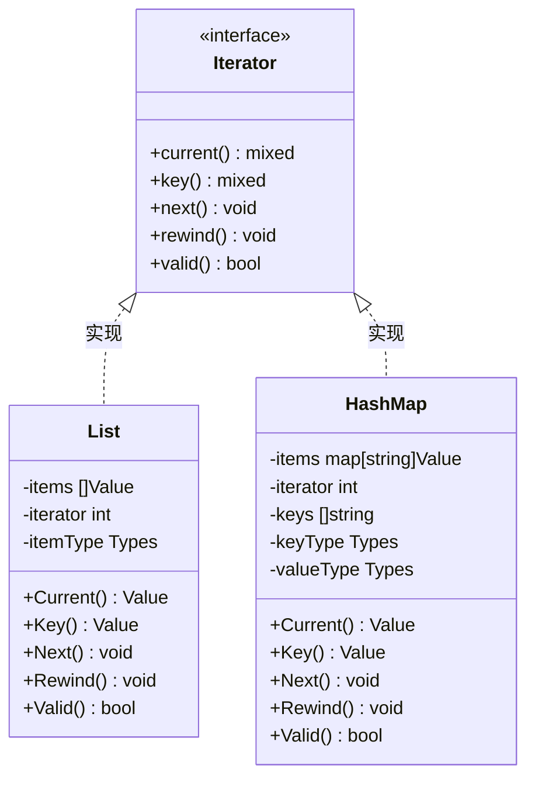
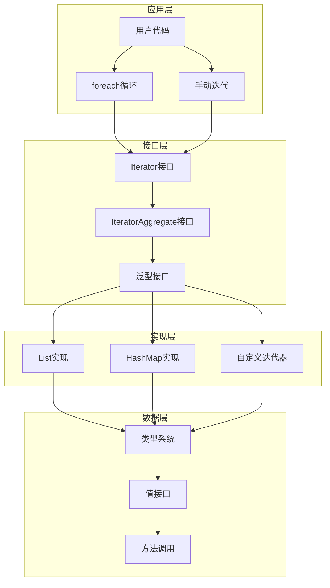
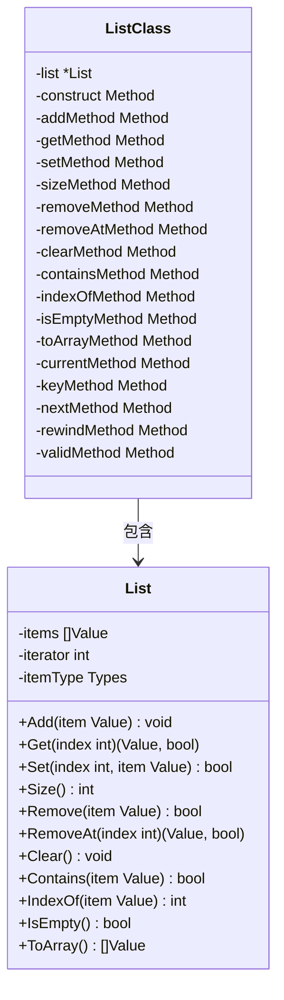
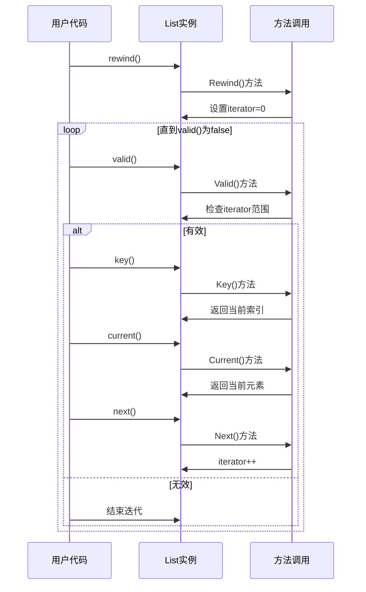
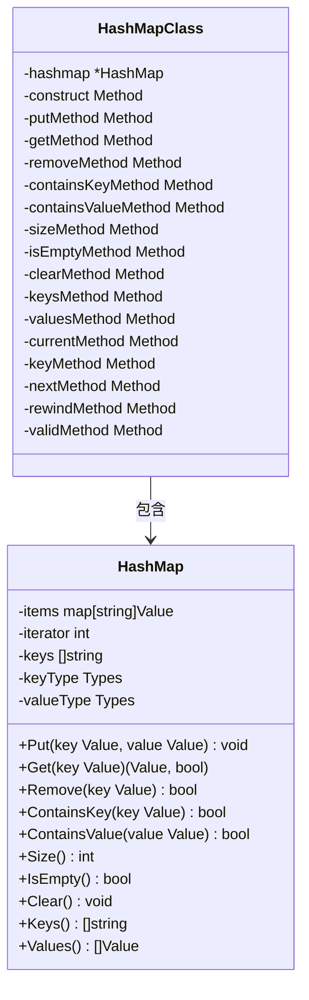
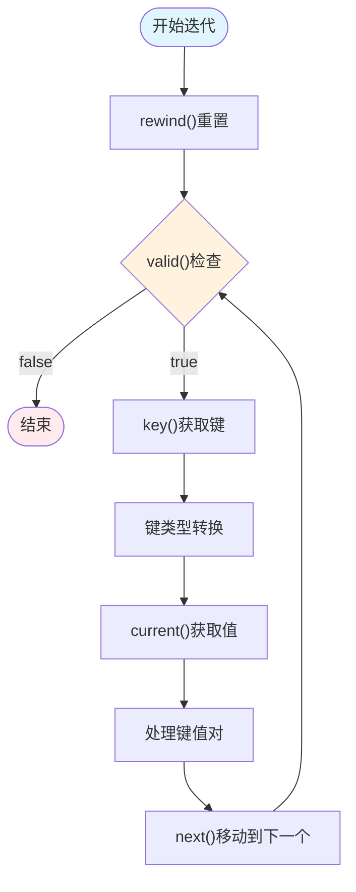
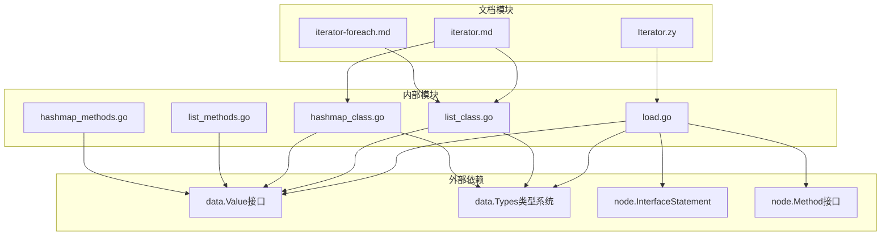

# PHP迭代器接口体系

<cite>
**本文档引用的文件**
- [load.go](file://std/loop/load.go)
- [iterator_aggregate_interface.go](file://std/loop/iterator_aggregate_interface.go)
- [list_class.go](file://std/loop/list_class.go)
- [hashmap_class.go](file://std/loop/hashmap_class.go)
- [list_methods.go](file://std/loop/list_methods.go)
- [hashmap_methods.go](file://std/loop/hashmap_methods.go)
- [iterator.md](file://docs/iterator.md)
- [iterator-foreach.md](file://docs/iterator-foreach.md)
- [Iterator.zy](file://docs/std/loop/Iterator.zy)
- [types.go](file://data/types.go)
- [value.go](file://data/value.go)
- [interface.go](file://data/interface.go)
</cite>

## 目录
1. [简介](#简介)
2. [项目结构](#项目结构)
3. [核心组件](#核心组件)
4. [架构概览](#架构概览)
5. [详细组件分析](#详细组件分析)
6. [依赖关系分析](#依赖关系分析)
7. [性能考量](#性能考量)
8. [故障排除指南](#故障排除指南)
9. [结论](#结论)

## 简介

Origami语言的PHP迭代器接口体系是一个完整的、类型安全的迭代器实现框架，提供了与PHP原生迭代器接口高度兼容的抽象。该体系包含了泛型列表(List<T>)和泛型哈希表(HashMap<K,V>)两种核心数据结构，每种结构都实现了标准的Iterator接口，支持手动迭代和foreach循环遍历。

该迭代器接口体系的设计目标是在保持PHP语法习惯的同时，提供更好的类型安全性和性能表现。通过泛型支持，开发者可以在编译时确保数据类型的正确性，避免运行时类型错误。

## 项目结构

迭代器接口体系主要位于`std/loop`目录下，采用模块化设计，包含以下关键组件：

**图表来源**
- [load.go:1-31](file://std/loop/load.go#L1-L31)
- [list_class.go:1-324](file://std/loop/list_class.go#L1-L324)
- [hashmap_class.go:1-331](file://std/loop/hashmap_class.go#L1-L331)

**章节来源**
- [load.go:1-31](file://std/loop/load.go#L1-L31)
- [iterator_aggregate_interface.go:1-18](file://std/loop/iterator_aggregate_interface.go#L1-L18)

## 核心组件

### Iterator接口定义

迭代器接口是整个体系的核心抽象，定义了标准的五种迭代方法：

**图表来源**
- [interface.go:26-38](file://data/interface.go#L26-L38)
- [list_class.go:109-140](file://std/loop/list_class.go#L109-L140)
- [hashmap_class.go:112-147](file://std/loop/hashmap_class.go#L112-L147)

### 泛型支持系统

系统提供了完整的泛型类型支持，包括：

- **List<T>**: 单一类型参数的列表容器
- **HashMap<K,V>**: 双类型参数的键值对容器
- **类型检查**: 运行时类型验证和转换
- **类型推断**: 基于上下文的类型自动推断

**章节来源**
- [list_class.go:143-242](file://std/loop/list_class.go#L143-L242)
- [hashmap_class.go:149-251](file://std/loop/hashmap_class.go#L149-L251)
- [types.go:142-219](file://data/types.go#L142-L219)

## 架构概览

迭代器接口体系采用分层架构设计，确保了良好的模块化和可扩展性：

**图表来源**
- [load.go:25-30](file://std/loop/load.go#L25-L30)
- [list_methods.go:11-43](file://std/loop/list_methods.go#L11-L43)
- [hashmap_methods.go:11-43](file://std/loop/hashmap_methods.go#L11-L43)

## 详细组件分析

### List<T>泛型列表

List<T>是迭代器接口体系中最基础的数据结构，提供了数组式的数据存储和访问功能：

#### 核心特性

| 特性 | 描述 | 实现方式 |
|------|------|----------|
| 泛型类型 | 支持任意类型T的参数化 | 通过GenericList()方法实现 |
| 动态扩容 | 自动调整底层数组大小 | 使用Go切片实现 |
| 类型安全 | 运行时类型检查 | 在方法调用时验证 |
| 迭代支持 | 完整的Iterator接口实现 | current(), key(), next()等 |

#### 数据结构设计

**图表来源**
- [list_class.go:7-100](file://std/loop/list_class.go#L7-L100)
- [list_class.go:143-324](file://std/loop/list_class.go#L143-L324)

#### 迭代器实现细节

List<T>的迭代器实现遵循标准的PHP迭代器协议：

**图表来源**
- [list_methods.go:582-769](file://std/loop/list_methods.go#L582-L769)
- [list_class.go:111-140](file://std/loop/list_class.go#L111-L140)

**章节来源**
- [list_class.go:1-324](file://std/loop/list_class.go#L1-L324)
- [list_methods.go:1-769](file://std/loop/list_methods.go#L1-L769)

### HashMap<K,V>泛型哈希表

HashMap<K,V>提供了键值对存储和访问功能，支持任意类型的键和值：

#### 核心特性

| 特性 | 描述 | 实现方式 |
|------|------|----------|
| 双泛型参数 | 支持键类型K和值类型V | 通过GenericList()方法实现 |
| 哈希存储 | 使用Go map实现高效查找 | O(1)平均时间复杂度 |
| 键值对迭代 | 支持键和值的双重迭代 | 维护键顺序数组 |
| 类型安全 | 分别验证键和值的类型 | 独立的类型检查机制 |

#### 数据结构设计

**图表来源**
- [hashmap_class.go:7-92](file://std/loop/hashmap_class.go#L7-L92)
- [hashmap_class.go:149-331](file://std/loop/hashmap_class.go#L149-L331)

#### 键值对迭代流程

HashMap的迭代过程涉及键的字符串化和类型转换：

**图表来源**
- [hashmap_methods.go:533-605](file://std/loop/hashmap_methods.go#L533-L605)
- [hashmap_class.go:123-132](file://std/loop/hashmap_class.go#L123-L132)

**章节来源**
- [hashmap_class.go:1-331](file://std/loop/hashmap_class.go#L1-L331)
- [hashmap_methods.go:1-720](file://std/loop/hashmap_methods.go#L1-L720)

### 方法调用机制

每个数据结构都提供了完整的方法集，支持类型安全的调用：

#### 方法分类

| 方法类别 | List<T>方法 | HashMap<K,V>方法 | 功能描述 |
|----------|-------------|------------------|----------|
| 构造方法 | __construct | __construct | 初始化容器 |
| 访问方法 | get, set, add | put, get | 数据访问 |
| 查询方法 | size, isEmpty, contains, indexOf | size, isEmpty, containsKey, containsValue | 数据查询 |
| 修改方法 | remove, removeAt, clear | remove, clear | 数据修改 |
| 迭代方法 | current, key, next, rewind, valid | current, key, next, rewind, valid | 迭代控制 |
| 辅助方法 | toArray | keys, values | 数据转换 |

#### 类型安全机制

系统通过以下机制确保类型安全：

1. **参数类型检查**: 在方法调用时验证参数类型
2. **返回类型检查**: 确保返回值符合预期类型
3. **泛型类型约束**: 编译时确定的类型约束
4. **运行时类型验证**: 动态类型检查和转换

**章节来源**
- [list_methods.go:1-769](file://std/loop/list_methods.go#L1-L769)
- [hashmap_methods.go:1-720](file://std/loop/hashmap_methods.go#L1-L720)

## 依赖关系分析

迭代器接口体系的依赖关系相对简单，主要依赖于核心数据类型系统：

**图表来源**
- [load.go:3-6](file://std/loop/load.go#L3-L6)
- [list_class.go:3-5](file://std/loop/list_class.go#L3-L5)
- [hashmap_class.go:3-5](file://std/loop/hashmap_class.go#L3-L5)

### 核心依赖关系

1. **data.Value接口**: 所有值操作的基础接口
2. **data.Types类型系统**: 泛型类型检查和验证
3. **node.InterfaceStatement**: 语言级接口定义
4. **node.Method接口**: 方法调用机制

这些依赖关系确保了迭代器接口体系与核心运行时系统的无缝集成。

**章节来源**
- [load.go:1-31](file://std/loop/load.go#L1-L31)
- [types.go:1-262](file://data/types.go#L1-L262)
- [value.go:1-39](file://data/value.go#L1-L39)

## 性能考量

### 时间复杂度分析

| 操作 | List<T> | HashMap<K,V> | 说明 |
|------|---------|--------------|------|
| 访问元素 | O(1) | O(1) | 数组索引访问 |
| 查找元素 | O(n) | 平均O(1) | 需要遍历或哈希查找 |
| 插入元素 | O(1)摊销 | O(1)摊销 | 切片动态扩容 |
| 删除元素 | O(n) | O(1) | 需要维护顺序数组 |
| 迭代遍历 | O(n) | O(n) | 需要遍历所有元素 |

### 内存使用优化

1. **延迟初始化**: 容器在首次使用时才分配内存
2. **动态扩容**: 切片按需增长，避免过度分配
3. **键顺序维护**: HashMap维护键的插入顺序
4. **类型缓存**: 泛型类型信息的缓存机制

### 迭代器性能优化

1. **状态缓存**: 迭代器状态在对象内缓存
2. **零拷贝设计**: 直接引用底层数据结构
3. **批量操作**: 支持批量转换为数组
4. **惰性求值**: 按需计算当前值

## 故障排除指南

### 常见问题及解决方案

#### 类型不匹配错误

**问题**: 添加不兼容类型的元素到List<T>
**解决方案**: 
- 确保泛型参数与实际数据类型一致
- 使用类型检查方法验证数据类型
- 在添加前进行显式类型转换

#### 迭代器状态异常

**问题**: 迭代过程中修改集合导致的状态不一致
**解决方案**:
- 遵循"先收集后修改"的原则
- 使用临时数组存储待删除元素
- 避免在迭代过程中直接修改集合

#### 内存泄漏问题

**问题**: 大型集合的内存使用过高
**解决方案**:
- 及时清理不再使用的集合引用
- 使用迭代器逐个处理元素而非一次性转换
- 监控集合大小，必要时进行分批处理

### 调试技巧

1. **启用详细日志**: 在关键方法中添加调试输出
2. **单元测试**: 为每个方法编写独立的测试用例
3. **边界条件测试**: 测试空集合、单元素集合等边界情况
4. **性能监控**: 监控内存使用和执行时间

**章节来源**
- [iterator.md:651-776](file://docs/iterator.md#L651-L776)
- [list_methods.go:78-98](file://std/loop/list_methods.go#L78-L98)
- [hashmap_methods.go:80-109](file://std/loop/hashmap_methods.go#L80-L109)

## 结论

Origami语言的PHP迭代器接口体系是一个设计精良、类型安全的迭代器实现框架。通过以下关键特性，该体系为开发者提供了强大而易用的迭代器功能：

### 主要优势

1. **完整的PHP兼容性**: 与PHP原生迭代器接口完全兼容
2. **强类型安全**: 通过泛型系统提供编译时类型检查
3. **高性能实现**: 优化的算法和数据结构设计
4. **易于使用**: 直观的API设计和丰富的文档支持

### 技术特色

- **双泛型支持**: List<T>和HashMap<K,V>提供灵活的类型约束
- **完整的迭代协议**: 支持手动迭代和foreach循环
- **类型安全保证**: 运行时类型检查和转换
- **内存效率优化**: 智能的内存管理和缓存机制

### 应用场景

该迭代器接口体系适用于各种需要高效数据遍历和处理的应用场景，包括但不限于：

- 数据处理和分析应用
- Web应用的模板渲染
- 配置管理和数据绑定
- 缓存和会话管理
- 日志记录和监控系统

通过持续的优化和完善，该迭代器接口体系将继续为Origami语言生态系统提供坚实的数据结构基础。