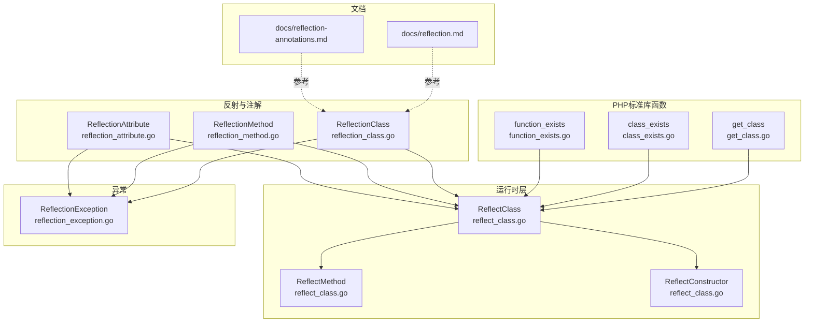
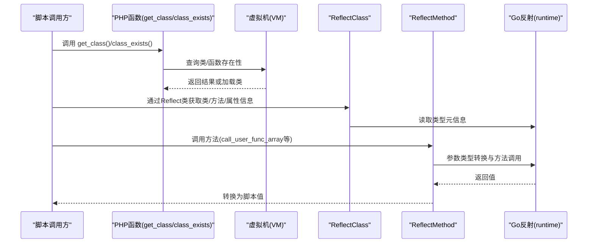
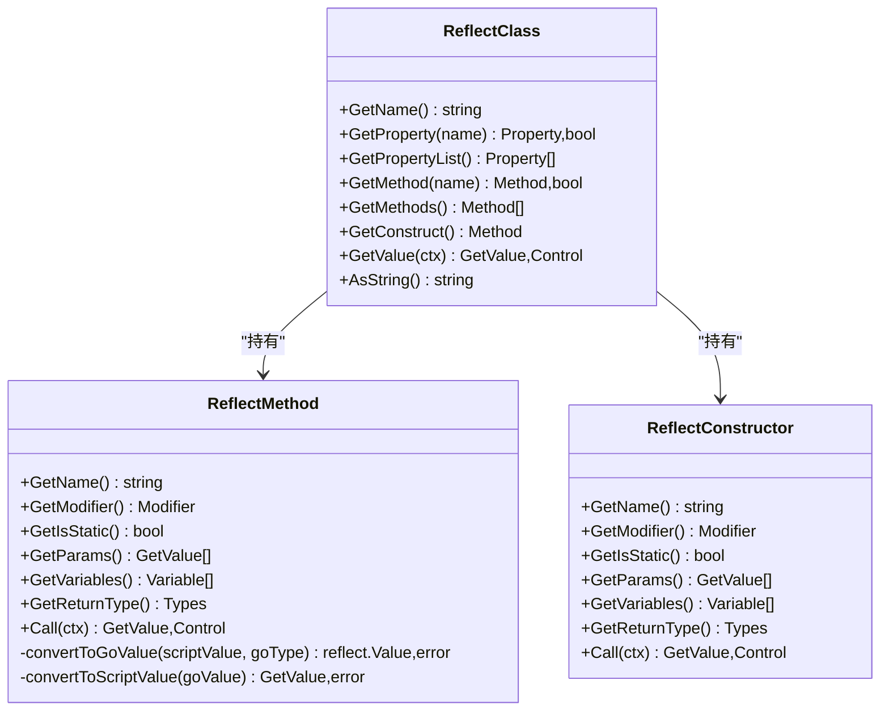
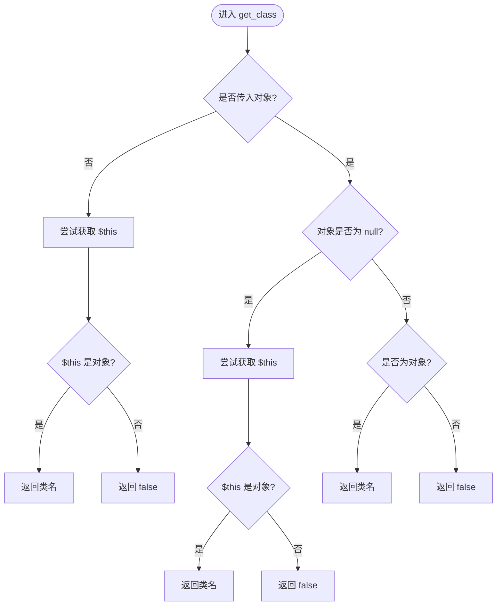
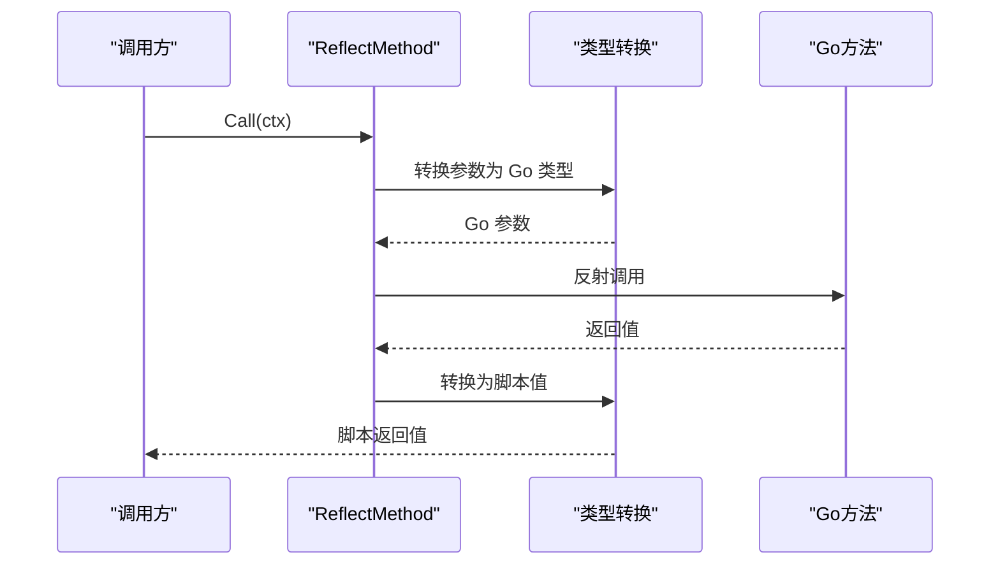
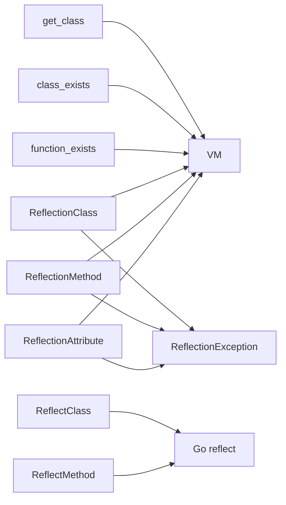

# 反射函数

<cite>
**本文引用的文件**
- [runtime/reflect_class.go](file://runtime/reflect_class.go)
- [std/php/get_class.go](file://std/php/get_class.go)
- [std/php/class_exists.go](file://std/php/class_exists.go)
- [std/php/function_exists.go](file://std/php/function_exists.go)
- [std/php/reflection/reflection_class.go](file://std/php/reflection/reflection_class.go)
- [std/php/reflection/reflection_method.go](file://std/php/reflection/reflection_method.go)
- [std/php/reflection/reflection_attribute.go](file://std/php/reflection/reflection_attribute.go)
- [std/exception/reflection_exception.go](file://std/exception/reflection_exception.go)
- [docs/reflection.md](file://docs/reflection.md)
- [docs/reflection-annotations.md](file://docs/reflection-annotations.md)
</cite>

## 目录
1. [简介](#简介)
2. [项目结构](#项目结构)
3. [核心组件](#核心组件)
4. [架构总览](#架构总览)
5. [组件详解](#组件详解)
6. [依赖关系分析](#依赖关系分析)
7. [性能考量](#性能考量)
8. [故障排查指南](#故障排查指南)
9. [结论](#结论)
10. [附录](#附录)

## 简介
本文件系统化梳理 Origami 对 PHP 反射 API 的支持与实现，覆盖类反射（get_class、class_exists、interface_exists、trait_exists）、方法反射（get_methods、get_method、call_user_func_array）、属性反射（get_properties、get_property）、函数反射（function_exists、get_defined_functions）、参数反射（get_function_args）等主题。文档解释反射机制的实现原理、性能影响与使用场景，并给出动态类型检查、元编程与插件系统的实践范式；同时说明反射 API 与原生 PHP 的兼容性与差异，提供最佳实践与性能优化建议，强调其在框架开发与扩展中的关键作用。

## 项目结构
围绕反射功能的相关代码主要分布在以下区域：
- 运行时层：提供反射类与方法的底层封装，负责类型识别、方法调用桥接与值转换。
- PHP 标准库函数：实现原生 PHP 风格的反射相关函数（如 get_class、class_exists、function_exists 等）。
- 反射类与方法：面向脚本的 Reflect 类与注解读取能力，支撑元编程与框架自动化。
- 文档：官方文档对反射模块的使用方法、API 与注解反射做了详尽说明。

图表来源
- [runtime/reflect_class.go:1-524](file://runtime/reflect_class.go#L1-L524)
- [std/php/get_class.go:1-77](file://std/php/get_class.go#L1-L77)
- [std/php/class_exists.go:1-66](file://std/php/class_exists.go#L1-L66)
- [std/php/function_exists.go:1-40](file://std/php/function_exists.go#L1-L40)
- [std/php/reflection/reflection_class.go](file://std/php/reflection/reflection_class.go)
- [std/php/reflection/reflection_method.go](file://std/php/reflection/reflection_method.go)
- [std/php/reflection/reflection_attribute.go](file://std/php/reflection/reflection_attribute.go)
- [std/exception/reflection_exception.go](file://std/exception/reflection_exception.go)
- [docs/reflection.md:1-277](file://docs/reflection.md#L1-L277)
- [docs/reflection-annotations.md:1-377](file://docs/reflection-annotations.md#L1-L377)

章节来源
- [runtime/reflect_class.go:1-524](file://runtime/reflect_class.go#L1-L524)
- [std/php/get_class.go:1-77](file://std/php/get_class.go#L1-L77)
- [std/php/class_exists.go:1-66](file://std/php/class_exists.go#L1-L66)
- [std/php/function_exists.go:1-40](file://std/php/function_exists.go#L1-L40)
- [docs/reflection.md:1-277](file://docs/reflection.md#L1-L277)
- [docs/reflection-annotations.md:1-377](file://docs/reflection-annotations.md#L1-L377)

## 核心组件
- 运行时反射类与方法
  - ReflectClass：封装被代理对象的类型信息，提供方法与属性的查询与调用桥接。
  - ReflectMethod：封装 Go 反射方法，负责参数类型转换、调用与返回值转换。
  - ReflectConstructor：封装构造函数逻辑，按结构体字段映射参数并设置初始值。
- PHP 标准库反射函数
  - get_class：获取对象类名或在无对象时回退到当前上下文的类名。
  - class_exists：检查类是否存在，支持 autoload 控制。
  - function_exists：检查函数是否存在。
- 反射与注解
  - ReflectionClass/ReflectionMethod/ReflectionAttribute：面向脚本的反射类与注解读取能力。
  - ReflectionException：统一的反射异常类型。

章节来源
- [runtime/reflect_class.go:12-131](file://runtime/reflect_class.go#L12-L131)
- [runtime/reflect_class.go:143-274](file://runtime/reflect_class.go#L143-L274)
- [runtime/reflect_class.go:349-448](file://runtime/reflect_class.go#L349-L448)
- [std/php/get_class.go:8-60](file://std/php/get_class.go#L8-L60)
- [std/php/class_exists.go:9-47](file://std/php/class_exists.go#L9-L47)
- [std/php/function_exists.go:8-23](file://std/php/function_exists.go#L8-L23)
- [std/php/reflection/reflection_class.go](file://std/php/reflection/reflection_class.go)
- [std/php/reflection/reflection_method.go](file://std/php/reflection/reflection_method.go)
- [std/php/reflection/reflection_attribute.go](file://std/php/reflection/reflection_attribute.go)
- [std/exception/reflection_exception.go](file://std/exception/reflection_exception.go)

## 架构总览
下图展示从脚本调用到运行时反射与 Go 反射之间的交互路径，以及与 VM 的集成关系。

图表来源
- [std/php/get_class.go:18-60](file://std/php/get_class.go#L18-L60)
- [std/php/class_exists.go:19-46](file://std/php/class_exists.go#L19-L46)
- [runtime/reflect_class.go:42-131](file://runtime/reflect_class.go#L42-L131)
- [runtime/reflect_class.go:231-274](file://runtime/reflect_class.go#L231-L274)

## 组件详解

### 运行时反射类与方法
- ReflectClass
  - 负责以被代理实例为载体，暴露类名、方法集合与属性集合。
  - 支持每次 GetValue 时创建新实例并重新分析公开方法，确保一致性。
- ReflectMethod
  - 通过 Go reflect.Method 获取方法签名，过滤非公开方法。
  - 参数列表优先使用结构体字段名作为参数名，其余使用 paramN 形式。
  - 调用时将脚本参数转换为 Go 类型后调用，再将返回值转换回脚本值。
- ReflectConstructor
  - 将构造函数参数映射为结构体公开字段，按字段类型进行赋值。
  - 支持按需设置字段值，未传参则跳过。

图表来源
- [runtime/reflect_class.go:12-131](file://runtime/reflect_class.go#L12-L131)
- [runtime/reflect_class.go:143-274](file://runtime/reflect_class.go#L143-L274)
- [runtime/reflect_class.go:349-448](file://runtime/reflect_class.go#L349-L448)

章节来源
- [runtime/reflect_class.go:12-131](file://runtime/reflect_class.go#L12-L131)
- [runtime/reflect_class.go:143-274](file://runtime/reflect_class.go#L143-L274)
- [runtime/reflect_class.go:349-448](file://runtime/reflect_class.go#L349-L448)

### PHP 标准库反射函数
- get_class
  - 支持无参或传入对象，若无对象则尝试从上下文获取 $this 并返回其类名；否则返回 false。
  - 严格区分 null 与非对象，null 时同样回退 $this。
- class_exists
  - 第二个参数控制是否尝试自动加载：false 仅检查内存，true 则尝试加载并判定存在性。
  - 通过 VM 的 GetClass/GetOrLoadClass 实现。
- function_exists
  - 通过 VM 的 GetFunc 查询函数是否存在。

图表来源
- [std/php/get_class.go:18-60](file://std/php/get_class.go#L18-L60)

章节来源
- [std/php/get_class.go:8-60](file://std/php/get_class.go#L8-L60)
- [std/php/class_exists.go:9-47](file://std/php/class_exists.go#L9-L47)
- [std/php/function_exists.go:8-23](file://std/php/function_exists.go#L8-L23)

### 反射与注解（面向脚本的 Reflect 类）
- Reflect 类提供：
  - getClassInfo/listMethods/listProperties：查询类结构与成员列表。
  - getMethodInfo/getPropertyInfo：获取方法与属性的详细信息（含修饰符、静态性、参数计数等）。
  - 注解读取：getAllAnnotations/getClassAnnotations/getPropertyAnnotations/getMethodAnnotations/getAnnotationDetails。
- 应用场景：
  - 框架自动注册控制器、依赖注入、路由注册等元数据驱动功能。
  - 结合缓存策略提升性能，避免在热路径频繁反射。

章节来源
- [docs/reflection.md:127-211](file://docs/reflection.md#L127-L211)
- [docs/reflection-annotations.md:18-110](file://docs/reflection-annotations.md#L18-L110)
- [docs/reflection-annotations.md:164-208](file://docs/reflection-annotations.md#L164-L208)
- [docs/reflection-annotations.md:235-308](file://docs/reflection-annotations.md#L235-L308)

### 反射 API 与原生 PHP 的兼容性与差异
- 兼容性
  - get_class、class_exists、function_exists 的行为与原生 PHP 保持一致，支持 autoload 控制与 $this 回退。
  - Reflect 类的 API 与文档描述的返回格式（JSON 字符串）一致，便于解析。
- 差异
  - 运行时层采用 Go 反射桥接，参数与返回值在脚本值与 Go 值之间转换，类型约束以脚本类型系统为准。
  - 注解读取通过 Reflect 类实现，而非原生 Reflection 扩展，但语义上等价。

章节来源
- [std/php/get_class.go:8-60](file://std/php/get_class.go#L8-L60)
- [std/php/class_exists.go:9-47](file://std/php/class_exists.go#L9-L47)
- [std/php/function_exists.go:8-23](file://std/php/function_exists.go#L8-L23)
- [docs/reflection.md:127-211](file://docs/reflection.md#L127-L211)
- [docs/reflection-annotations.md:18-110](file://docs/reflection-annotations.md#L18-L110)

### 动态类型检查、元编程与插件系统示例
- 动态类型检查
  - 通过 get_class 判定对象类型，结合 Reflect 的属性/方法列表进行运行时校验。
- 元编程
  - 使用 Reflect 注解读取实现依赖注入容器、路由注册与控制器自动装配。
- 插件系统
  - 通过 class_exists 与 autoload 控制扫描类集合，结合注解识别插件入口与配置。

章节来源
- [docs/reflection-annotations.md:235-308](file://docs/reflection-annotations.md#L235-L308)

### 方法调用流程（call_user_func_array）
- 调用链
  - 通过 ReflectMethod 的 Call 接口，先将脚本参数转换为 Go 类型，再调用 Go 方法，最后将返回值转换回脚本值。
- 参数与返回值转换
  - 支持 string/int/float/bool 等基础类型的双向转换；未知类型以字符串形式兜底。

图表来源
- [runtime/reflect_class.go:231-274](file://runtime/reflect_class.go#L231-L274)
- [runtime/reflect_class.go:277-347](file://runtime/reflect_class.go#L277-L347)

## 依赖关系分析
- 运行时反射类依赖 Go 标准库 reflect 进行类型与方法枚举。
- PHP 函数通过 VM 查询类/函数存在性，必要时触发加载。
- 反射与注解模块依赖 VM 的类注册表与函数表。
- 异常模块提供统一的反射异常类型，便于错误传播与捕获。

图表来源
- [std/php/get_class.go:18-60](file://std/php/get_class.go#L18-L60)
- [std/php/class_exists.go:19-46](file://std/php/class_exists.go#L19-L46)
- [std/php/function_exists.go:14-23](file://std/php/function_exists.go#L14-L23)
- [std/php/reflection/reflection_class.go](file://std/php/reflection/reflection_class.go)
- [std/php/reflection/reflection_method.go](file://std/php/reflection/reflection_method.go)
- [std/php/reflection/reflection_attribute.go](file://std/php/reflection/reflection_attribute.go)
- [std/exception/reflection_exception.go](file://std/exception/reflection_exception.go)
- [runtime/reflect_class.go:42-131](file://runtime/reflect_class.go#L42-L131)
- [runtime/reflect_class.go:231-274](file://runtime/reflect_class.go#L231-L274)

章节来源
- [std/php/get_class.go:18-60](file://std/php/get_class.go#L18-L60)
- [std/php/class_exists.go:19-46](file://std/php/class_exists.go#L19-L46)
- [std/php/function_exists.go:14-23](file://std/php/function_exists.go#L14-L23)
- [std/php/reflection/reflection_class.go](file://std/php/reflection/reflection_class.go)
- [std/php/reflection/reflection_method.go](file://std/php/reflection/reflection_method.go)
- [std/php/reflection/reflection_attribute.go](file://std/php/reflection/reflection_attribute.go)
- [std/exception/reflection_exception.go](file://std/exception/reflection_exception.go)
- [runtime/reflect_class.go:42-131](file://runtime/reflect_class.go#L42-L131)
- [runtime/reflect_class.go:231-274](file://runtime/reflect_class.go#L231-L274)

## 性能考量
- 反射成本
  - 运行时反射涉及类型枚举与方法查找，属于相对昂贵的操作，应避免在高频请求路径中重复调用。
- 缓存策略
  - 对类结构、方法列表与注解信息进行缓存，减少重复反射带来的开销。
- 参数与返回值转换
  - 类型转换发生在调用链中，尽量减少不必要的转换与装箱。
- autoload 控制
  - 在 class_exists 中合理设置 autoload=false，仅在必要时触发加载。

章节来源
- [docs/reflection-annotations.md:325-341](file://docs/reflection-annotations.md#L325-L341)
- [std/php/class_exists.go:19-46](file://std/php/class_exists.go#L19-L46)

## 故障排查指南
- 常见问题
  - 传入非对象导致 get_class 返回 false：确认传入值类型或使用 $this 上下文。
  - autoload=false 导致 class_exists 返回 false：确认类是否已加载或允许自动加载。
  - 注解读取为空：检查类是否正确标注注解且命名空间完整。
- 异常处理
  - 使用统一的反射异常类型进行捕获与诊断，定位到具体成员与类型。

章节来源
- [std/php/get_class.go:18-60](file://std/php/get_class.go#L18-L60)
- [std/php/class_exists.go:19-46](file://std/php/class_exists.go#L19-L46)
- [std/exception/reflection_exception.go](file://std/exception/reflection_exception.go)

## 结论
Origami 的反射体系以运行时反射类与 PHP 标准库函数为核心，结合面向脚本的 Reflect 类与注解读取能力，实现了与原生 PHP 反射 API 的高兼容性与可扩展性。通过合理的缓存与 autoload 控制，可在框架与插件系统中高效利用反射进行元编程与自动化配置。建议在冷启动阶段完成反射初始化，在热路径避免重复反射，以获得更优的性能表现。

## 附录
- 实践建议
  - 在应用启动时扫描并缓存类结构与注解信息。
  - 对高频调用的方法采用静态绑定或编译期优化替代反射。
  - 明确 autoload 策略，避免不必要的类加载。
- 参考文档
  - 反射模块使用与 API 说明
  - 反射与注解系统使用指南

章节来源
- [docs/reflection.md:1-277](file://docs/reflection.md#L1-L277)
- [docs/reflection-annotations.md:1-377](file://docs/reflection-annotations.md#L1-L377)