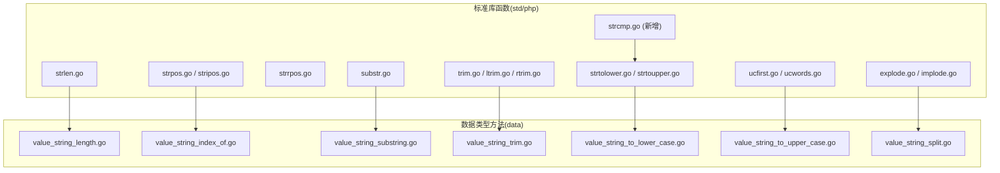
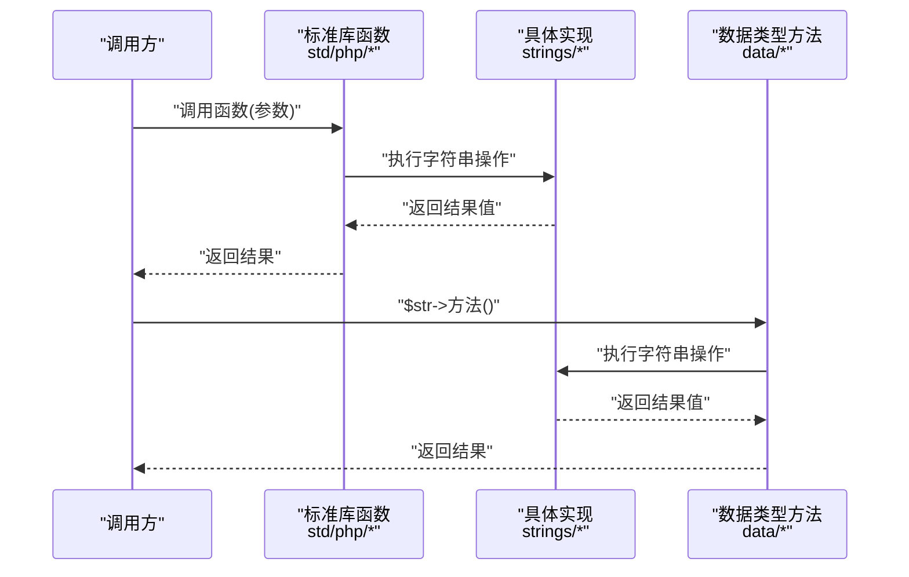
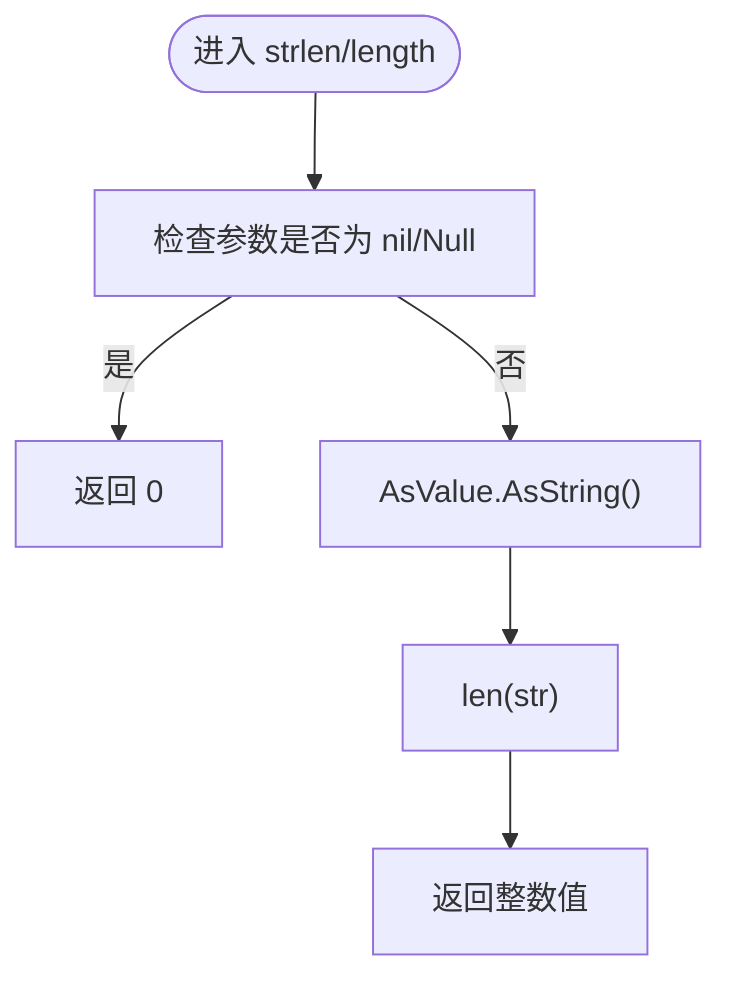
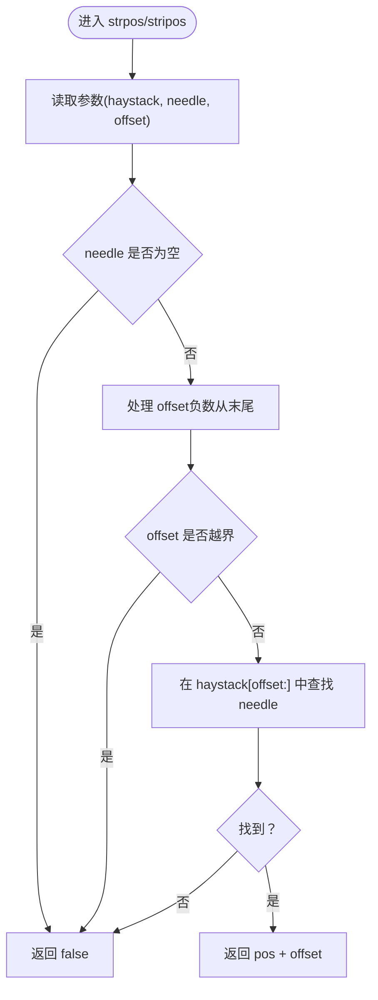
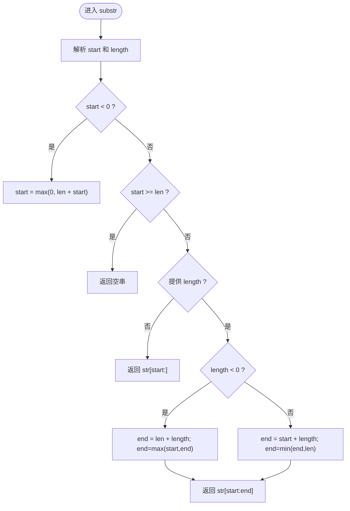
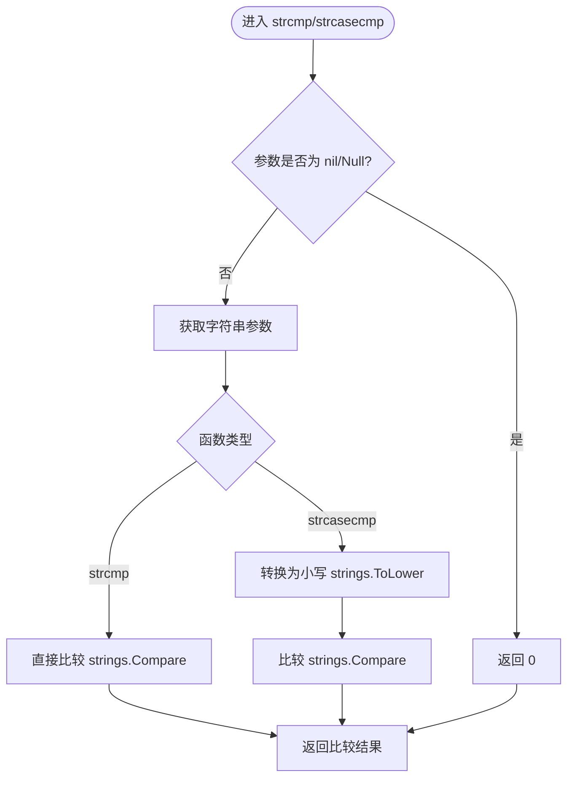
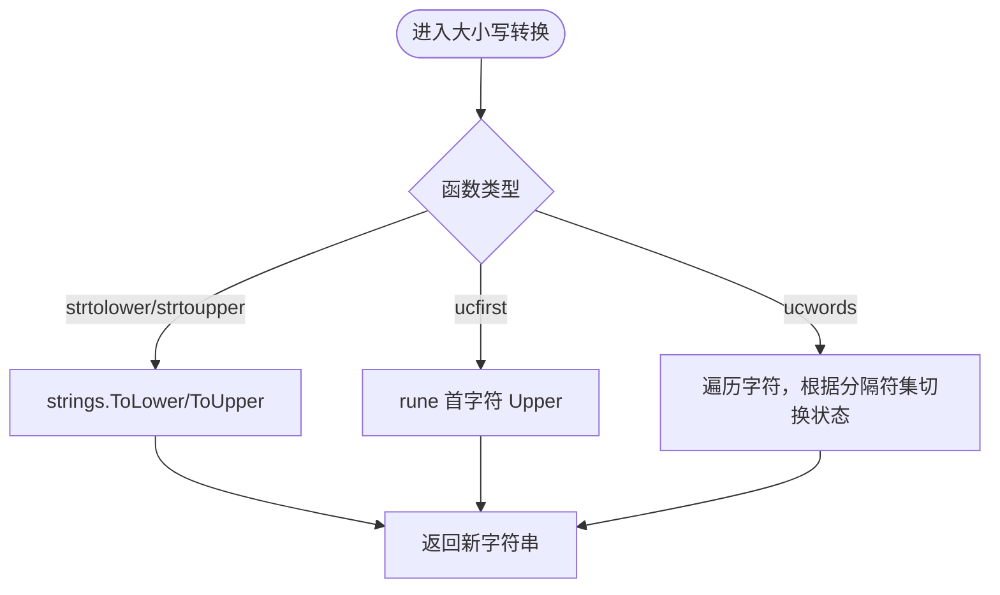
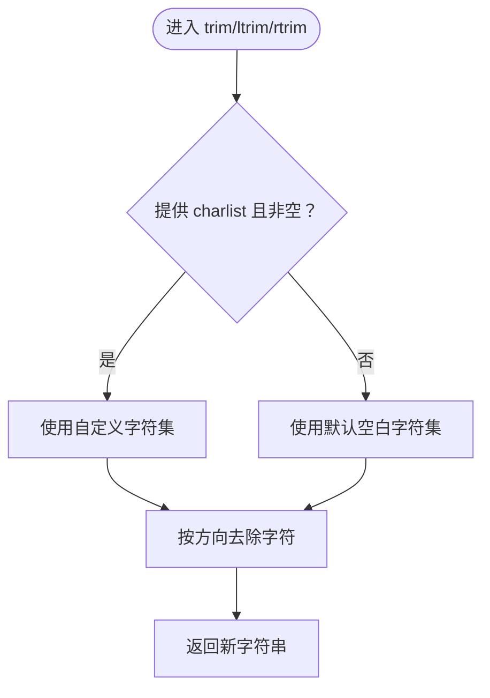
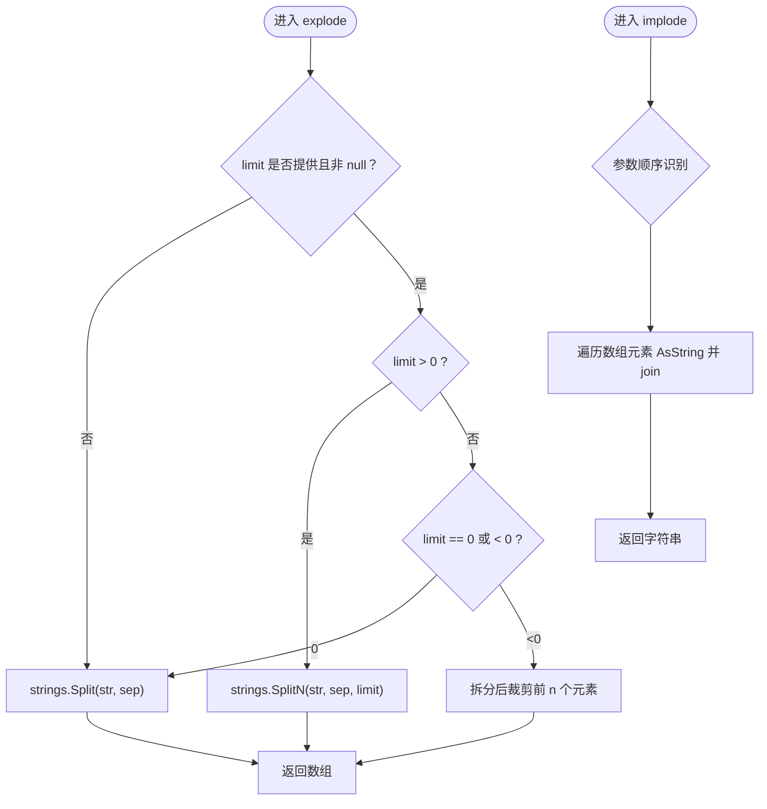
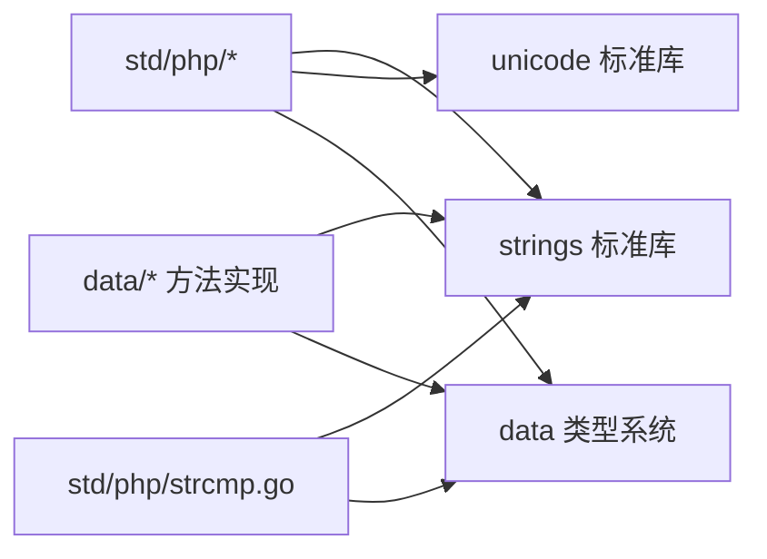

# 字符串函数

<cite>
**本文引用的文件**
- [std/php/strlen.go](file://std/php/strlen.go)
- [std/php/strpos.go](file://std/php/strpos.go)
- [std/php/stripos.go](file://std/php/stripos.go)
- [std/php/strrpos.go](file://std/php/strrpos.go)
- [std/php/substr.go](file://std/php/substr.go)
- [std/php/strcmp.go](file://std/php/strcmp.go)
- [std/php/lowercase 相关实现](file://std/php/strtolower.go)
- [std/php/uppercase 相关实现](file://std/php/strtoupper.go)
- [std/php/ucfirst.go](file://std/php/ucfirst.go)
- [std/php/ucwords.go](file://std/php/ucwords.go)
- [std/php/trim.go](file://std/php/trim.go)
- [std/php/ltrim.go](file://std/php/ltrim.go)
- [std/php/rtrim.go](file://std/php/rtrim.go)
- [std/php/explode.go](file://std/php/explode.go)
- [std/php/implode.go](file://std/php/implode.go)
- [data/value_string_length.go](file://data/value_string_length.go)
- [data/value_string_index_of.go](file://data/value_string_index_of.go)
- [data/value_string_substring.go](file://data/value_string_substring.go)
- [data/value_string_trim.go](file://data/value_string_trim.go)
- [data/value_string_to_lower_case.go](file://data/value_string_to_lower_case.go)
- [data/value_string_to_upper_case.go](file://data/value_string_to_upper_case.go)
- [data/value_string_split.go](file://data/value_string_split.go)
- [tests/strings/length.zy](file://tests/strings/length.zy)
- [tests/strings/indexOf.zy](file://tests/strings/indexOf.zy)
- [tests/strings/substring.zy](file://tests/strings/substring.zy)
- [tests/strings/trim.zy](file://tests/strings/trim.zy)
- [tests/strings/split.zy](file://tests/strings/split.zy)
</cite>

## 更新摘要
**所做更改**
- 新增字符串比较功能章节，详细介绍 strcmp() 和 strcasecmp() 函数
- 更新核心组件部分，添加字符串比较功能
- 更新架构总览图，包含新的比较函数调用链
- 新增字符串比较功能的性能分析和最佳实践
- 更新兼容性说明，涵盖与原生PHP的比较行为对比

## 目录
1. [简介](#简介)
2. [项目结构](#项目结构)
3. [核心组件](#核心组件)
4. [架构总览](#架构总览)
5. [详细组件分析](#详细组件分析)
6. [依赖分析](#依赖分析)
7. [性能考量](#性能考量)
8. [故障排查指南](#故障排查指南)
9. [结论](#结论)
10. [附录](#附录)

## 简介
本文件系统化梳理 Origami 对 PHP 字符串处理函数的支持，覆盖长度计算、位置查找、子串提取、大小写转换、空白字符处理、分割与连接以及**新增的字符串比较功能**等常用操作。文档重点说明：
- 各函数在运行时的调用路径与数据流
- Unicode 支持现状与边界行为
- 性能特征与内存使用特性
- 兼容性与差异点（与原生 PHP 的行为对比）
- 最佳实践与优化建议
- 实际应用场景与测试用例参考

## 项目结构
与字符串处理相关的核心代码分布在两处：
- 标准库函数实现：位于 std/php 下，提供与 PHP 语义一致的函数式封装
- 数据类型方法实现：位于 data 下，提供面向对象风格的方法（如 $str->length()、$str->indexOf(...) 等）

**图表来源**
- [std/php/strlen.go:1-51](file://std/php/strlen.go#L1-L51)
- [std/php/strpos.go:1-85](file://std/php/strpos.go#L1-L85)
- [std/php/strrpos.go:1-195](file://std/php/strrpos.go#L1-L195)
- [std/php/substr.go:1-106](file://std/php/substr.go#L1-L106)
- [std/php/strcmp.go:1-141](file://std/php/strcmp.go#L1-L141)
- [std/php/strtolower.go:1-47](file://std/php/strtolower.go#L1-L47)
- [std/php/strtoupper.go:1-47](file://std/php/strtoupper.go#L1-L47)
- [std/php/ucfirst.go:1-54](file://std/php/ucfirst.go#L1-L54)
- [std/php/ucwords.go:1-73](file://std/php/ucwords.go#L1-L73)
- [std/php/trim.go:1-60](file://std/php/trim.go#L1-L60)
- [std/php/ltrim.go:1-60](file://std/php/ltrim.go#L1-L60)
- [std/php/rtrim.go:1-60](file://std/php/rtrim.go#L1-L60)
- [std/php/explode.go:1-96](file://std/php/explode.go#L1-L96)
- [std/php/implode.go:1-73](file://std/php/implode.go#L1-L73)
- [data/value_string_length.go:1-35](file://data/value_string_length.go#L1-L35)
- [data/value_string_index_of.go:1-77](file://data/value_string_index_of.go#L1-L77)
- [data/value_string_substring.go:1-130](file://data/value_string_substring.go#L1-L130)
- [data/value_string_trim.go:1-38](file://data/value_string_trim.go#L1-L38)
- [data/value_string_to_lower_case.go:1-38](file://data/value_string_to_lower_case.go#L1-L38)
- [data/value_string_to_upper_case.go:1-38](file://data/value_string_to_upper_case.go#L1-L38)
- [data/value_string_split.go:1-91](file://data/value_string_split.go#L1-L91)

**章节来源**
- [std/php/strlen.go:1-51](file://std/php/strlen.go#L1-L51)
- [std/php/strpos.go:1-85](file://std/php/strpos.go#L1-L85)
- [std/php/strrpos.go:1-195](file://std/php/strrpos.go#L1-L195)
- [std/php/substr.go:1-106](file://std/php/substr.go#L1-L106)
- [std/php/strcmp.go:1-141](file://std/php/strcmp.go#L1-L141)
- [std/php/strtolower.go:1-47](file://std/php/strtolower.go#L1-L47)
- [std/php/strtoupper.go:1-47](file://std/php/strtoupper.go#L1-L47)
- [std/php/ucfirst.go:1-54](file://std/php/ucfirst.go#L1-L54)
- [std/php/ucwords.go:1-73](file://std/php/ucwords.go#L1-L73)
- [std/php/trim.go:1-60](file://std/php/trim.go#L1-L60)
- [std/php/ltrim.go:1-60](file://std/php/ltrim.go#L1-L60)
- [std/php/rtrim.go:1-60](file://std/php/rtrim.go#L1-L60)
- [std/php/explode.go:1-96](file://std/php/explode.go#L1-L96)
- [std/php/implode.go:1-73](file://std/php/implode.go#L1-L73)
- [data/value_string_length.go:1-35](file://data/value_string_length.go#L1-L35)
- [data/value_string_index_of.go:1-77](file://data/value_string_index_of.go#L1-L77)
- [data/value_string_substring.go:1-130](file://data/value_string_substring.go#L1-L130)
- [data/value_string_trim.go:1-38](file://data/value_string_trim.go#L1-L38)
- [data/value_string_to_lower_case.go:1-38](file://data/value_string_to_lower_case.go#L1-L38)
- [data/value_string_to_upper_case.go:1-38](file://data/value_string_to_upper_case.go#L1-L38)
- [data/value_string_split.go:1-91](file://data/value_string_split.go#L1-L91)

## 核心组件
- 长度计算：strlen（函数式）与 length（方法式）
- 位置查找：strpos、stripos（大小写敏感/不敏感）、strrpos、strripos（反向查找）
- 子串提取：substr
- **字符串比较：strcmp（区分大小写）、strcasecmp（不区分大小写）**
- 大小写转换：strtolower、strtoupper、ucfirst、ucwords
- 空白字符处理：trim、ltrim、rtrim
- 分割与连接：explode、implode
- 数据类型方法：length、indexOf、substring、trim、toLowerCase、toUpperCase、split

**章节来源**
- [std/php/strlen.go:1-51](file://std/php/strlen.go#L1-L51)
- [data/value_string_length.go:1-35](file://data/value_string_length.go#L1-L35)
- [std/php/strpos.go:1-85](file://std/php/strpos.go#L1-L85)
- [std/php/stripos.go:1-85](file://std/php/stripos.go#L1-L85)
- [std/php/strrpos.go:1-195](file://std/php/strrpos.go#L1-L195)
- [std/php/substr.go:1-106](file://std/php/substr.go#L1-L106)
- [std/php/strcmp.go:1-141](file://std/php/strcmp.go#L1-L141)
- [std/php/strtolower.go:1-47](file://std/php/strtolower.go#L1-L47)
- [std/php/strtoupper.go:1-47](file://std/php/strtoupper.go#L1-L47)
- [std/php/ucfirst.go:1-54](file://std/php/ucfirst.go#L1-L54)
- [std/php/ucwords.go:1-73](file://std/php/ucwords.go#L1-L73)
- [std/php/trim.go:1-60](file://std/php/trim.go#L1-L60)
- [std/php/ltrim.go:1-60](file://std/php/ltrim.go#L1-L60)
- [std/php/rtrim.go:1-60](file://std/php/rtrim.go#L1-L60)
- [std/php/explode.go:1-96](file://std/php/explode.go#L1-L96)
- [std/php/implode.go:1-73](file://std/php/implode.go#L1-L73)
- [data/value_string_index_of.go:1-77](file://data/value_string_index_of.go#L1-L77)
- [data/value_string_substring.go:1-130](file://data/value_string_substring.go#L1-L130)
- [data/value_string_trim.go:1-38](file://data/value_string_trim.go#L1-L38)
- [data/value_string_to_lower_case.go:1-38](file://data/value_string_to_lower_case.go#L1-L38)
- [data/value_string_to_upper_case.go:1-38](file://data/value_string_to_upper_case.go#L1-L38)
- [data/value_string_split.go:1-91](file://data/value_string_split.go#L1-L91)

## 架构总览
下图展示字符串函数在运行时的调用链与数据流，从标准库函数入口到具体实现，再到底层字符串操作。

**图表来源**
- [std/php/strlen.go:14-34](file://std/php/strlen.go#L14-L34)
- [std/php/strpos.go:16-64](file://std/php/strpos.go#L16-L64)
- [std/php/strrpos.go:17-98](file://std/php/strrpos.go#L17-L98)
- [std/php/substr.go:14-85](file://std/php/substr.go#L14-L85)
- [std/php/strcmp.go:42-74](file://std/php/strcmp.go#L42-L74)
- [std/php/strtolower.go:16-30](file://std/php/strtolower.go#L16-L30)
- [std/php/strtoupper.go:16-30](file://std/php/strtoupper.go#L16-L30)
- [std/php/ucfirst.go:16-37](file://std/php/ucfirst.go#L16-L37)
- [std/php/ucwords.go:17-54](file://std/php/ucwords.go#L17-L54)
- [std/php/trim.go:16-41](file://std/php/trim.go#L16-L41)
- [std/php/ltrim.go:16-41](file://std/php/ltrim.go#L16-L41)
- [std/php/rtrim.go:16-41](file://std/php/rtrim.go#L16-L41)
- [std/php/explode.go:16-75](file://std/php/explode.go#L16-L75)
- [std/php/implode.go:16-54](file://std/php/implode.go#L16-L54)
- [data/value_string_length.go:7-10](file://data/value_string_length.go#L7-L10)
- [data/value_string_index_of.go:11-48](file://data/value_string_index_of.go#L11-L48)
- [data/value_string_substring.go:11-99](file://data/value_string_substring.go#L11-L99)
- [data/value_string_trim.go:9-13](file://data/value_string_trim.go#L9-L13)
- [data/value_string_to_lower_case.go:9-13](file://data/value_string_to_lower_case.go#L9-L13)
- [data/value_string_to_upper_case.go:9-13](file://data/value_string_to_upper_case.go#L9-L13)
- [data/value_string_split.go:11-62](file://data/value_string_split.go#L11-L62)

## 详细组件分析

### 长度计算：strlen 与 length
- 功能：返回字符串字节数（基于 Go string 的 len）
- 参数：string
- 返回：int
- 行为要点：
  - 对 nil/Null 值返回 0
  - 通过 AsString 统一转换
- Unicode 支持：按字节计数，非 Unicode 码点计数；多字节字符（如 UTF-8 中的中文）会按字节数累加
- 性能与内存：O(1) 时间与空间复杂度，仅读取一次字符串长度

**图表来源**
- [std/php/strlen.go:14-34](file://std/php/strlen.go#L14-L34)
- [data/value_string_length.go:7-10](file://data/value_string_length.go#L7-L10)

**章节来源**
- [std/php/strlen.go:1-51](file://std/php/strlen.go#L1-L51)
- [data/value_string_length.go:1-35](file://data/value_string_length.go#L1-L35)

### 位置查找：strpos、stripos、strrpos、strripos
- 功能：在主串中查找子串首次或最后一次出现的位置
- 参数：haystack、needle、offset（可选）
- 返回：int（位置）或布尔（未找到）
- 行为要点：
  - strpos/strrpos 区分大小写；stripos/strripos 不区分大小写（内部先转小写）
  - offset 为负时，从末尾开始计算；越界则返回"未找到"
  - needle 为空字符串时，返回"未找到"（与 strpos 保持一致）
- Unicode 支持：按字节索引，非 Unicode 码点；多字节字符需注意偏移
- 性能与内存：字符串索引使用标准库 strings.Index/LastIndex，时间复杂度近似 O(n*m)，空间开销低

**图表来源**
- [std/php/strpos.go:16-64](file://std/php/strpos.go#L16-L64)
- [std/php/stripos.go:17-64](file://std/php/stripos.go#L17-L64)
- [std/php/strrpos.go:17-98](file://std/php/strrpos.go#L17-L98)

**章节来源**
- [std/php/strpos.go:1-85](file://std/php/strpos.go#L1-L85)
- [std/php/stripos.go:1-85](file://std/php/stripos.go#L1-L85)
- [std/php/strrpos.go:1-195](file://std/php/strrpos.go#L1-L195)

### 子串提取：substr
- 功能：从字符串中提取子串
- 参数：string、start、length（可选）
- 返回：string
- 行为要点：
  - start 为负：从末尾开始计算，但最小不低于 0
  - length 为负：表示从末尾截取，若 end < start 则返回空串
  - 未提供 length：从 start 截取到末尾
- Unicode 支持：按字节切片，非 Unicode 码点；多字节字符可能被截断
- 性能与内存：切片操作 O(k)，k 为子串长度；额外分配 O(k) 内存

**图表来源**
- [std/php/substr.go:14-85](file://std/php/substr.go#L14-L85)

**章节来源**
- [std/php/substr.go:1-106](file://std/php/substr.go#L1-L106)

### 字符串比较：strcmp 与 strcasecmp
- 功能：二进制安全字符串比较
- 参数：str1、str2
- 返回：int（-1 表示 str1 < str2，0 表示相等，1 表示 str1 > str2）
- 行为要点：
  - strcmp 区分大小写，使用 strings.Compare 进行字典序比较
  - strcasecmp 不区分大小写，先将字符串转换为小写后再比较
  - 对 nil/Null 值返回 0，保持与原生 PHP 一致的行为
- Unicode 支持：strcmp 基于字节比较，strcasecmp 先进行小写转换再比较
- 性能与内存：字符串比较 O(n)，其中 n 为较短字符串的长度；额外内存开销较小
- 兼容性：与 PHP 原生 strcmp/strcasecmp 完全兼容，返回值约定一致

**图表来源**
- [std/php/strcmp.go:42-74](file://std/php/strcmp.go#L42-L74)
- [std/php/strcmp.go:107-140](file://std/php/strcmp.go#L107-L140)

**章节来源**
- [std/php/strcmp.go:1-141](file://std/php/strcmp.go#L1-L141)

### 大小写转换：strtolower、strtoupper、ucfirst、ucwords
- 功能：全小写、全大写、首字母大写、单词首字母大写
- 参数：string（ucwords 可选 delimiters）
- 返回：string
- 行为要点：
  - strtolower/strtoupper 使用 strings.ToLower/ToUpper
  - ucfirst 使用 unicode.ToUpper 转换单个字符
  - ucwords 使用 unicode 与 strings 判断分隔符，默认分隔符集合包含空白字符
- Unicode 支持：ucfirst/ucwords 基于 rune 进行码点级处理，更符合多语言场景；strtolower/strtoupper 使用标准库，通常适用于 ASCII 或已知区域设置
- 性能与内存：字符串复制 O(n)，额外分配 O(n) 内存

**图表来源**
- [std/php/strtolower.go:16-30](file://std/php/strtolower.go#L16-L30)
- [std/php/strtoupper.go:16-30](file://std/php/strtoupper.go#L16-L30)
- [std/php/ucfirst.go:16-37](file://std/php/ucfirst.go#L16-L37)
- [std/php/ucwords.go:17-54](file://std/php/ucwords.go#L17-L54)

**章节来源**
- [std/php/strtolower.go:1-47](file://std/php/strtolower.go#L1-L47)
- [std/php/strtoupper.go:1-47](file://std/php/strtoupper.go#L1-L47)
- [std/php/ucfirst.go:1-54](file://std/php/ucfirst.go#L1-L54)
- [std/php/ucwords.go:1-73](file://std/php/ucwords.go#L1-L73)

### 空白字符处理：trim、ltrim、rtrim
- 功能：去除首尾/左侧/右侧空白字符
- 参数：string、charlist（可选）
- 返回：string
- 行为要点：
  - 未提供 charlist 或其非空字符串时，使用自定义字符集；否则使用默认空白字符集
  - trim 默认使用 strings.TrimSpace
- Unicode 支持：基于空白字符集合判断，通常包含常见空白字符
- 性能与内存：线性扫描 O(n)，额外分配 O(n) 内存

**图表来源**
- [std/php/trim.go:16-41](file://std/php/trim.go#L16-L41)
- [std/php/ltrim.go:16-41](file://std/php/ltrim.go#L16-L41)
- [std/php/rtrim.go:16-41](file://std/php/rtrim.go#L16-L41)

**章节来源**
- [std/php/trim.go:1-60](file://std/php/trim.go#L1-L60)
- [std/php/ltrim.go:1-60](file://std/php/ltrim.go#L1-L60)
- [std/php/rtrim.go:1-60](file://std/php/rtrim.go#L1-L60)

### 分割与连接：explode、implode
- 功能：explode 按分隔符拆分为数组；implode 将数组元素连接为字符串
- 参数：
  - explode(separator, string, limit?)
  - implode(separator?, array) 或 implode(array, separator?)
- 返回：
  - explode：array<string>
  - implode：string
- 行为要点：
  - explode limit=0 视为 1；limit<0 时返回除最后 -limit 个元素外的所有元素；未提供或为 null 时拆分全部
  - implode 支持两种参数顺序，自动识别数组与分隔符
- Unicode 支持：按字节分隔/连接，多字节字符需谨慎
- 性能与内存：explode 使用 strings.Split/SplitN/Split，时间复杂度近似 O(n)；implode 线性拼接 O(n)

**图表来源**
- [std/php/explode.go:16-75](file://std/php/explode.go#L16-L75)
- [std/php/implode.go:16-54](file://std/php/implode.go#L16-L54)

**章节来源**
- [std/php/explode.go:1-96](file://std/php/explode.go#L1-L96)
- [std/php/implode.go:1-73](file://std/php/implode.go#L1-L73)

### 数据类型方法映射
- length：对应 length.go
- indexOf：对应 value_string_index_of.go
- substring：对应 value_string_substring.go
- trim：对应 value_string_trim.go
- toLowerCase：对应 value_string_to_lower_case.go
- toUpperCase：对应 value_string_to_upper_case.go
- split：对应 value_string_split.go

**章节来源**
- [data/value_string_length.go:1-35](file://data/value_string_length.go#L1-L35)
- [data/value_string_index_of.go:1-77](file://data/value_string_index_of.go#L1-L77)
- [data/value_string_substring.go:1-130](file://data/value_string_substring.go#L1-L130)
- [data/value_string_trim.go:1-38](file://data/value_string_trim.go#L1-L38)
- [data/value_string_to_lower_case.go:1-38](file://data/value_string_to_lower_case.go#L1-L38)
- [data/value_string_to_upper_case.go:1-38](file://data/value_string_to_upper_case.go#L1-L38)
- [data/value_string_split.go:1-91](file://data/value_string_split.go#L1-L91)

## 依赖分析
- 所有字符串函数均依赖 data 层的类型系统与上下文参数传递机制
- 大多数函数依赖 strings 标准库进行底层字符串操作
- Unicode 相关处理依赖 unicode 包（如 ucfirst/ucwords）
- **字符串比较功能依赖 strings.Compare 进行字典序比较**
- 数据类型方法与标准库函数在语义上一一对应，形成"函数式/方法式"双入口

**图表来源**
- [std/php/strcmp.go:3-8](file://std/php/strcmp.go#L3-L8)
- [std/php/strtolower.go:3-4](file://std/php/strtolower.go#L3-L4)
- [std/php/ucfirst.go](file://std/php/ucfirst.go#L4)
- [std/php/ucwords.go:4-5](file://std/php/ucwords.go#L4-L5)
- [data/value_string_to_lower_case.go](file://data/value_string_to_lower_case.go#L3)
- [data/value_string_to_upper_case.go](file://data/value_string_to_upper_case.go#L3)
- [data/value_string_substring.go](file://data/value_string_substring.go#L4)
- [data/value_string_index_of.go](file://data/value_string_index_of.go#L4)

**章节来源**
- [std/php/strcmp.go:1-141](file://std/php/strcmp.go#L1-L141)
- [std/php/strtolower.go:1-47](file://std/php/strtolower.go#L1-L47)
- [std/php/strtoupper.go:1-47](file://std/php/strtoupper.go#L1-L47)
- [std/php/ucfirst.go:1-54](file://std/php/ucfirst.go#L1-L54)
- [std/php/ucwords.go:1-73](file://std/php/ucwords.go#L1-L73)
- [data/value_string_to_lower_case.go:1-38](file://data/value_string_to_lower_case.go#L1-L38)
- [data/value_string_to_upper_case.go:1-38](file://data/value_string_to_upper_case.go#L1-L38)
- [data/value_string_substring.go:1-130](file://data/value_string_substring.go#L1-L130)
- [data/value_string_index_of.go:1-77](file://data/value_string_index_of.go#L1-L77)

## 性能考量
- 时间复杂度
  - 长度计算：O(1)
  - 位置查找：平均 O(n+m)，最坏 O(n*m)
  - 子串提取：O(k)，k 为子串长度
  - **字符串比较：O(n)，n 为较短字符串长度**
  - 大小写转换：O(n)
  - 空白处理：O(n)
  - 分割/连接：O(n)
- 空间复杂度
  - 多数函数返回新字符串，额外分配 O(n) 空间
  - explode/implode 会构建中间切片/数组，整体 O(n)
  - **字符串比较函数额外分配 O(n) 内存用于小写转换（strcasecmp）**
- Unicode 注意
  - 按字节处理可能导致多字节字符截断
  - **strcmp 基于字节比较，strcasecmp 先进行小写转换**
  - 需要按码点处理时，优先使用基于 rune 的方法（如 ucfirst/ucwords）
- 优化建议
  - 避免在循环内重复进行昂贵的字符串操作
  - 对大量连接操作，考虑使用缓冲或预估容量
  - 使用 explode 的 limit 参数控制结果规模
  - 对大小写转换，尽量一次性处理完整字符串而非多次调用
  - **在高频比较场景下，优先使用 strcmp 而非 strcasecmp 以避免小写转换开销**

## 故障排查指南
- 常见问题
  - 空指针/空值：函数与方法实现均对 nil/Null 值做了保护，返回 0 或空串
  - needle 为空：strpos/stripos 返回"未找到"，保持与原生 PHP 一致
  - offset 越界：返回"未找到"
  - substr 负 length 导致 end < start：返回空串
  - explode limit<0 且未找到分隔符：返回空数组
  - **strcmp/strcasecmp 参数为 nil：返回 0，符合 PHP 行为**
- 排查步骤
  - 确认输入参数类型与顺序（explode/implode 支持两种参数顺序）
  - 检查是否传入了空字符串或 null
  - 验证 Unicode 场景是否需要基于码点的处理
  - **对于字符串比较，确认是否需要区分大小写（strcmp vs strcasecmp）**
- 测试参考
  - 长度测试：[tests/strings/length.zy:1-53](file://tests/strings/length.zy#L1-L53)
  - 位置查找测试：[tests/strings/indexOf.zy:1-95](file://tests/strings/indexOf.zy#L1-L95)
  - 子串提取测试：[tests/strings/substring.zy:1-78](file://tests/strings/substring.zy#L1-L78)
  - 去空白测试：[tests/strings/trim.zy:1-101](file://tests/strings/trim.zy#L1-L101)
  - 分割测试：[tests/strings/split.zy:1-83](file://tests/strings/split.zy#L1-L83)

**章节来源**
- [tests/strings/length.zy:1-53](file://tests/strings/length.zy#L1-L53)
- [tests/strings/indexOf.zy:1-95](file://tests/strings/indexOf.zy#L1-L95)
- [tests/strings/substring.zy:1-78](file://tests/strings/substring.zy#L1-L78)
- [tests/strings/trim.zy:1-101](file://tests/strings/trim.zy#L1-L101)
- [tests/strings/split.zy:1-83](file://tests/strings/split.zy#L1-L83)

## 结论
Origami 的字符串函数模块提供了与 PHP 语义高度一致的实现，覆盖了常用的字符串处理场景。**新增的 strcmp 和 strcasecmp 函数进一步完善了字符串比较能力，提供了二进制安全的比较操作**。在性能方面，大多数操作为线性复杂度，内存开销可控。需要注意的是，当前实现主要基于字节层面的操作，在处理多字节字符时应结合基于码点的方法（如 ucfirst/ucwords）以获得正确的 Unicode 语义。**字符串比较功能与 PHP 原生行为完全兼容，strcmp 用于区分大小写的比较，strcasecmp 用于不区分大小写的比较**。通过合理的参数选择与流程设计，可在保证正确性的前提下取得良好的性能表现。

## 附录
- 与原生 PHP 的兼容性提示
  - strpos/stripos/strrpos/strripos：行为与原生 PHP 一致，含 offset 与空 needle 的处理
  - substr：行为与原生 PHP 一致，含负 start/length 的处理
  - **strcmp/strcasecmp：与 PHP 原生完全兼容，返回 -1/0/1 的约定一致**
  - explode：limit=0 视为 1；limit<0 的裁剪逻辑与原生一致
  - implode：支持两种参数顺序，自动识别数组与分隔符
  - 大小写转换：strtolower/strtoupper 使用标准库；ucfirst/ucwords 基于码点，更适合多语言
- 最佳实践
  - 明确 Unicode 需求，必要时使用基于码点的方法
  - 控制 explode 的 limit，避免产生过大的中间数组
  - 在高频场景下合并多次字符串操作，减少临时对象创建
  - 对用户输入进行 trim 与长度校验，防止异常输入导致的错误
  - **根据业务需求选择合适的比较函数：需要严格区分大小写时使用 strcmp，需要忽略大小写时使用 strcasecmp**
  - **在性能敏感的场景下，优先考虑 strcmp 而非 strcasecmp 以避免小写转换的额外开销**