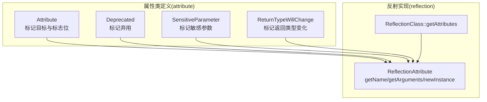
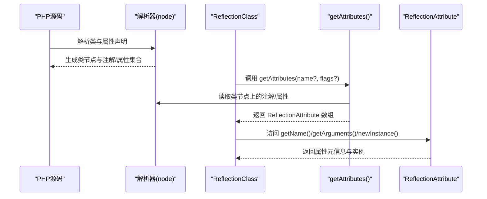
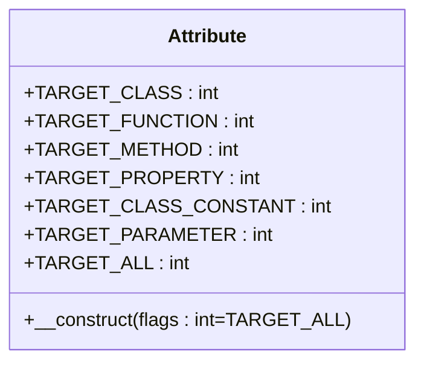
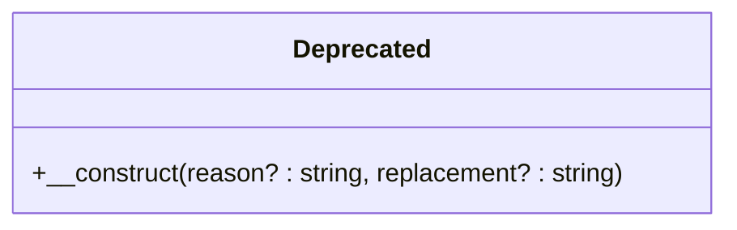
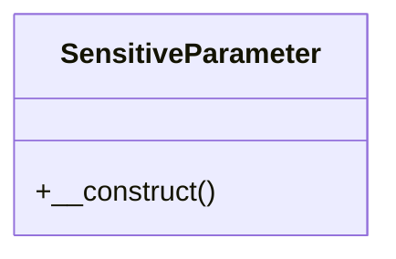
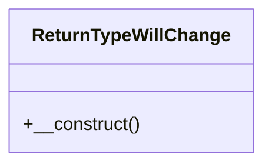
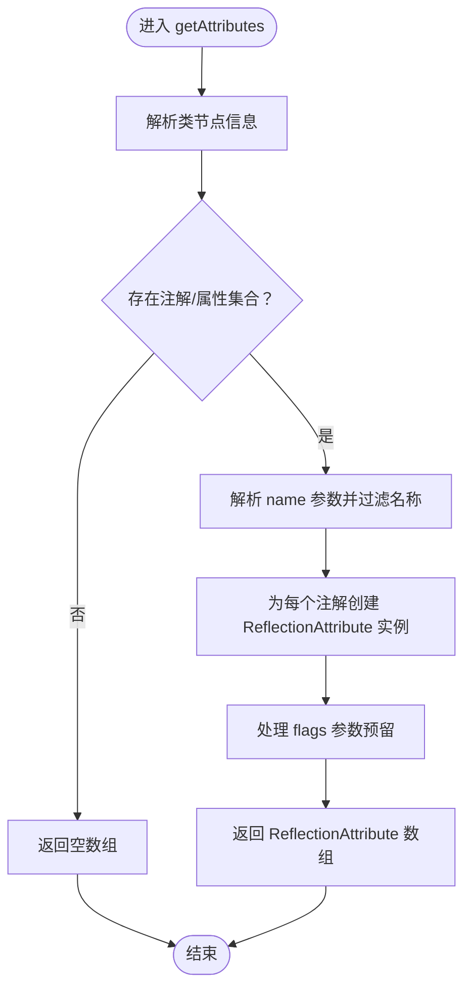
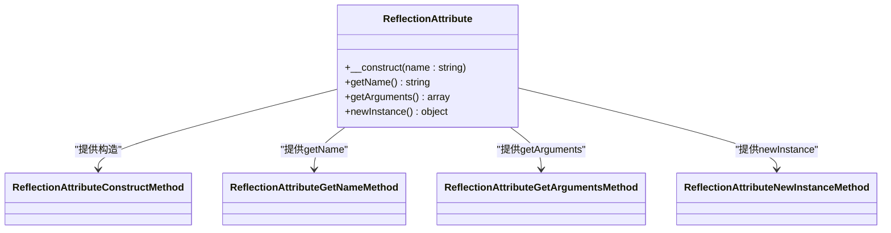
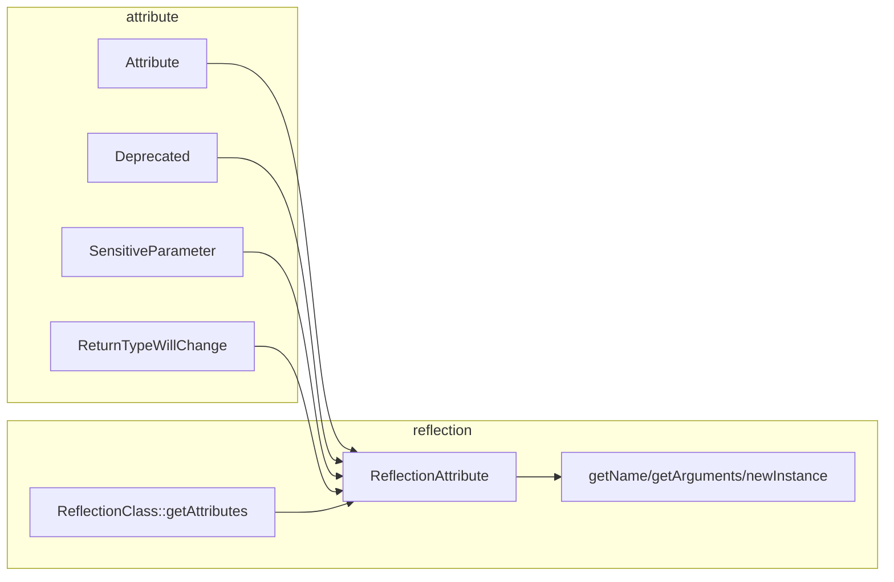

# 属性函数

<cite>
**本文引用的文件**
- [std/php/attribute/attribute_class.go](file://std/php/attribute/attribute_class.go)
- [std/php/attribute/deprecated_class.go](file://std/php/attribute/deprecated_class.go)
- [std/php/attribute/sensitive_parameter_class.go](file://std/php/attribute/sensitive_parameter_class.go)
- [std/php/attribute/return_type_will_change_class.go](file://std/php/attribute/return_type_will_change_class.go)
- [std/php/reflection/get_attributes.go](file://std/php/reflection/get_attributes.go)
- [std/php/reflection/reflection_attribute.go](file://std/php/reflection/reflection_attribute.go)
- [std/php/reflection/reflection_attribute_construct.go](file://std/php/reflection/reflection_attribute_construct.go)
- [std/php/reflection/reflection_attribute_get_arguments.go](file://std/php/reflection/reflection_attribute_get_arguments.go)
- [std/php/reflection/reflection_attribute_get_name.go](file://std/php/reflection/reflection_attribute_get_name.go)
- [std/php/reflection/reflection_attribute_new_instance.go](file://std/php/reflection/reflection_attribute_new_instance.go)
</cite>

## 目录
1. [引言](#引言)
2. [项目结构](#项目结构)
3. [核心组件](#核心组件)
4. [架构总览](#架构总览)
5. [详细组件分析](#详细组件分析)
6. [依赖分析](#依赖分析)
7. [性能考量](#性能考量)
8. [故障排查指南](#故障排查指南)
9. [结论](#结论)
10. [附录](#附录)

## 引言
本文件系统性阐述 Origami 对 PHP 属性（Attributes）的支持与实现，覆盖属性类定义（Attribute、Deprecated、SensitiveParameter、ReturnTypeWillChange 等）、属性获取与检查机制（get_attributes、attribute_exists 的语义与实现）、属性处理流程、声明语法与使用场景、以及与注解（Annotations）的关系与兼容性。文档还提供元数据标注、代码生成与框架扩展的应用示例思路、最佳实践与性能影响分析，并展望属性在现代 PHP 开发中的作用与未来方向。

## 项目结构
本专题聚焦于标准库中“php/attribute”与“php/reflection”两个子域：
- attribute 子域：提供原生 PHP 8.x+ 属性类的最小实现，用于标记目标与承载语义。
- reflection 子域：提供反射 API 的实现，包括获取属性、读取属性名、获取参数、新建实例等。

图示来源
- [std/php/attribute/attribute_class.go:1-130](file://std/php/attribute/attribute_class.go#L1-L130)
- [std/php/attribute/deprecated_class.go:1-101](file://std/php/attribute/deprecated_class.go#L1-L101)
- [std/php/attribute/sensitive_parameter_class.go:1-95](file://std/php/attribute/sensitive_parameter_class.go#L1-L95)
- [std/php/attribute/return_type_will_change_class.go:1-95](file://std/php/attribute/return_type_will_change_class.go#L1-L95)
- [std/php/reflection/get_attributes.go:1-97](file://std/php/reflection/get_attributes.go#L1-L97)
- [std/php/reflection/reflection_attribute.go:1-83](file://std/php/reflection/reflection_attribute.go#L1-L83)

章节来源
- [std/php/attribute/attribute_class.go:1-130](file://std/php/attribute/attribute_class.go#L1-L130)
- [std/php/attribute/deprecated_class.go:1-101](file://std/php/attribute/deprecated_class.go#L1-L101)
- [std/php/attribute/sensitive_parameter_class.go:1-95](file://std/php/attribute/sensitive_parameter_class.go#L1-L95)
- [std/php/attribute/return_type_will_change_class.go:1-95](file://std/php/attribute/return_type_will_change_class.go#L1-L95)
- [std/php/reflection/get_attributes.go:1-97](file://std/php/reflection/get_attributes.go#L1-L97)
- [std/php/reflection/reflection_attribute.go:1-83](file://std/php/reflection/reflection_attribute.go#L1-L83)

## 核心组件
- Attribute 类：用于标记一个类可以作为属性使用，并提供目标类型标志位（TARGET_*）。
- Deprecated 类：标记代码元素已弃用，支持 reason/replacement 元信息。
- SensitiveParameter 类：标记参数为敏感（如密码、密钥），便于运行时安全处理。
- ReturnTypeWillChange 类：标记返回类型在未来版本中可能改变，避免兼容性警告。
- ReflectionClass::getAttributes：返回类上声明的属性集合（以 ReflectionAttribute 包装）。
- ReflectionAttribute：封装单个属性实例，提供 getName、getArguments、newInstance 等方法。

章节来源
- [std/php/attribute/attribute_class.go:8-130](file://std/php/attribute/attribute_class.go#L8-L130)
- [std/php/attribute/deprecated_class.go:8-101](file://std/php/attribute/deprecated_class.go#L8-L101)
- [std/php/attribute/sensitive_parameter_class.go:8-95](file://std/php/attribute/sensitive_parameter_class.go#L8-L95)
- [std/php/attribute/return_type_will_change_class.go:8-95](file://std/php/attribute/return_type_will_change_class.go#L8-L95)
- [std/php/reflection/get_attributes.go:8-97](file://std/php/reflection/get_attributes.go#L8-L97)
- [std/php/reflection/reflection_attribute.go:9-83](file://std/php/reflection/reflection_attribute.go#L9-L83)

## 架构总览
下图展示属性在解析与反射阶段的整体交互：属性类在编译期被识别为可作为属性的目标；运行时通过反射 API 获取属性并封装为 ReflectionAttribute 对象，以便框架或工具链进一步处理。

图示来源
- [std/php/reflection/get_attributes.go:47-96](file://std/php/reflection/get_attributes.go#L47-L96)
- [std/php/reflection/reflection_attribute.go:39-67](file://std/php/reflection/reflection_attribute.go#L39-L67)

## 详细组件分析

### Attribute 类与目标标志位
- 作用：标记类可作为属性使用，并提供目标类型标志位（类、函数、方法、属性、类常量、参数、全部）。
- 关键点：
  - 构造函数签名携带 flags 参数，用于限制属性可应用的目标。
  - 静态常量提供 TARGET_* 值，便于组合筛选。
- 使用场景：当自定义属性类需要限定适用范围时，通过 flags 控制。

图示来源
- [std/php/attribute/attribute_class.go:10-130](file://std/php/attribute/attribute_class.go#L10-L130)

章节来源
- [std/php/attribute/attribute_class.go:8-130](file://std/php/attribute/attribute_class.go#L8-L130)

### Deprecated 类
- 作用：标记代码元素已弃用，可携带 reason 与 replacement 提示。
- 关键点：
  - 构造函数接受可选 reason 与 replacement。
  - 通常配合工具链或运行时告警机制使用。

图示来源
- [std/php/attribute/deprecated_class.go:10-101](file://std/php/attribute/deprecated_class.go#L10-L101)

章节来源
- [std/php/attribute/deprecated_class.go:8-101](file://std/php/attribute/deprecated_class.go#L8-L101)

### SensitiveParameter 类
- 作用：标记参数为敏感，便于日志、调试或错误报告时屏蔽敏感内容。
- 关键点：
  - 无参构造，仅起到标记作用。

图示来源
- [std/php/attribute/sensitive_parameter_class.go:10-95](file://std/php/attribute/sensitive_parameter_class.go#L10-L95)

章节来源
- [std/php/attribute/sensitive_parameter_class.go:8-95](file://std/php/attribute/sensitive_parameter_class.go#L8-L95)

### ReturnTypeWillChange 类
- 作用：标记返回类型在未来版本中可能改变，避免兼容性警告。
- 关键点：
  - 无参构造，仅起到标记作用。

图示来源
- [std/php/attribute/return_type_will_change_class.go:10-95](file://std/php/attribute/return_type_will_change_class.go#L10-L95)

章节来源
- [std/php/attribute/return_type_will_change_class.go:8-95](file://std/php/attribute/return_type_will_change_class.go#L8-L95)

### ReflectionClass::getAttributes 与属性获取流程
- 功能：返回类上声明的属性（以 ReflectionAttribute 包装），支持按名称过滤，flags 参数预留扩展。
- 处理流程要点：
  - 从上下文解析出被反射的类节点。
  - 读取类节点上的注解/属性集合。
  - 若指定 name，则进行名称过滤。
  - 将每个注解包装为 ReflectionAttribute 实例并返回数组。
  - flags 参数目前未实现具体过滤逻辑（保留扩展空间）。

图示来源
- [std/php/reflection/get_attributes.go:47-96](file://std/php/reflection/get_attributes.go#L47-L96)

章节来源
- [std/php/reflection/get_attributes.go:8-97](file://std/php/reflection/get_attributes.go#L8-L97)

### ReflectionAttribute 类族与方法
- ReflectionAttribute：封装单个属性实例，提供以下方法：
  - getName：返回属性类名。
  - getArguments：返回传入属性的参数数组（当前实现返回空数组，因参数在实例化时已消费）。
  - newInstance：基于注解创建新实例。
- 构造函数：接收注解对象（ClassValue），并将其存储在实例属性中，供后续方法读取。

图示来源
- [std/php/reflection/reflection_attribute.go:11-83](file://std/php/reflection/reflection_attribute.go#L11-L83)
- [std/php/reflection/reflection_attribute_construct.go:12-65](file://std/php/reflection/reflection_attribute_construct.go#L12-L65)
- [std/php/reflection/reflection_attribute_get_name.go:9-52](file://std/php/reflection/reflection_attribute_get_name.go#L9-L52)
- [std/php/reflection/reflection_attribute_get_arguments.go:9-52](file://std/php/reflection/reflection_attribute_get_arguments.go#L9-L52)
- [std/php/reflection/reflection_attribute_new_instance.go:11-59](file://std/php/reflection/reflection_attribute_new_instance.go#L11-L59)

章节来源
- [std/php/reflection/reflection_attribute.go:9-83](file://std/php/reflection/reflection_attribute.go#L9-L83)
- [std/php/reflection/reflection_attribute_construct.go:10-65](file://std/php/reflection/reflection_attribute_construct.go#L10-L65)
- [std/php/reflection/reflection_attribute_get_name.go:7-52](file://std/php/reflection/reflection_attribute_get_name.go#L7-L52)
- [std/php/reflection/reflection_attribute_get_arguments.go:7-52](file://std/php/reflection/reflection_attribute_get_arguments.go#L7-L52)
- [std/php/reflection/reflection_attribute_new_instance.go:9-59](file://std/php/reflection/reflection_attribute_new_instance.go#L9-L59)

## 依赖分析
- 组件内聚与耦合：
  - attribute 子域各属性类彼此独立，仅在语义层面共同服务于标记能力。
  - reflection 子域围绕 ReflectionAttribute 封装，方法之间通过上下文共享注解对象。
- 外部依赖：
  - 依赖数据模型与节点抽象（data、node），用于表示类值、参数、变量与类型。
- 潜在循环依赖：
  - 当前实现未见循环导入；反射层通过上下文间接访问注解对象，避免直接耦合。

图示来源
- [std/php/attribute/attribute_class.go:1-130](file://std/php/attribute/attribute_class.go#L1-L130)
- [std/php/attribute/deprecated_class.go:1-101](file://std/php/attribute/deprecated_class.go#L1-L101)
- [std/php/attribute/sensitive_parameter_class.go:1-95](file://std/php/attribute/sensitive_parameter_class.go#L1-L95)
- [std/php/attribute/return_type_will_change_class.go:1-95](file://std/php/attribute/return_type_will_change_class.go#L1-L95)
- [std/php/reflection/get_attributes.go:1-97](file://std/php/reflection/get_attributes.go#L1-L97)
- [std/php/reflection/reflection_attribute.go:1-83](file://std/php/reflection/reflection_attribute.go#L1-L83)

## 性能考量
- 反射开销：每次调用 getAttributes 会遍历类节点上的注解/属性集合，时间复杂度与属性数量线性相关。建议在高频路径中缓存结果或延迟加载。
- 参数解析：getArguments 当前返回空数组，避免额外解析成本；若未来支持参数还原，需评估解析与序列化成本。
- 实例化成本：newInstance 会复制属性对象的属性映射，注意在大规模场景下的内存占用。
- 缓存策略：框架可对类级属性结果进行进程内缓存，减少重复反射带来的性能损耗。

## 故障排查指南
- getAttributes 返回空数组
  - 检查类节点是否正确解析出注解/属性集合。
  - 确认 flags/name 参数是否导致过滤过严。
- ReflectionAttribute::newInstance 抛错
  - 确保构造时传入的是有效的注解对象（ClassValue）。
  - 确认注解对象的类节点有效且可实例化。
- getName 返回空字符串
  - 检查注解对象是否正确存储在实例属性中。
- 参数过滤未生效
  - flags 参数目前未实现具体过滤逻辑，请确认业务侧是否依赖该行为。

章节来源
- [std/php/reflection/get_attributes.go:47-96](file://std/php/reflection/get_attributes.go#L47-L96)
- [std/php/reflection/reflection_attribute_construct.go:42-64](file://std/php/reflection/reflection_attribute_construct.go#L42-L64)
- [std/php/reflection/reflection_attribute_get_name.go:35-51](file://std/php/reflection/reflection_attribute_get_name.go#L35-L51)
- [std/php/reflection/reflection_attribute_new_instance.go:39-58](file://std/php/reflection/reflection_attribute_new_instance.go#L39-L58)

## 结论
Origami 在 attribute 与 reflection 两域提供了对 PHP 属性的最小可用实现：通过 Attribute 系列类表达语义与目标约束，通过反射 API 提供统一的属性读取与实例化能力。当前实现聚焦于基本语义与兼容性，为上层框架与工具链提供扩展基础。随着 flags 等参数的完善与参数还原能力的引入，属性在元数据标注、代码生成与框架扩展中的价值将进一步提升。

## 附录

### 属性声明语法与使用场景
- 声明语法：在类、方法、属性、参数、常量等位置使用方括号包裹属性类，可带参数。
- 使用场景：
  - 元数据标注：结合反射读取属性，驱动配置或中间件。
  - 兼容性提示：使用 Deprecated 标记弃用项，提供迁移指引。
  - 安全防护：使用 SensitiveParameter 标记敏感参数，避免泄露。
  - 版本演进：使用 ReturnTypeWillChange 标记潜在变更，平滑升级。

### 与注解（Annotations）的关系与兼容性
- 关系：属性（Attributes）是 PHP 8+ 的原生特性，注解（Annotations）在 PHP 中通常指通过解析器收集的注释式元数据。Origami 在反射层统一封装为 ReflectionAttribute，便于与现有注解生态兼容。
- 兼容性：对于历史注解，可通过解析器映射到属性对象，保持上层 API 一致。

### 最佳实践
- 明确目标：使用 Attribute 的 flags 精准限定属性适用范围。
- 语义清晰：为属性类提供明确的参数与用途说明，便于工具链理解。
- 缓存优先：在高频路径中缓存属性查询结果，降低反射开销。
- 安全意识：对敏感参数使用 SensitiveParameter 标记，避免日志与调试输出泄露。

### 未来发展方向
- 参数还原：支持 getArguments 返回原始参数，增强元数据完整性。
- 继承与合并：完善 flags 的继承与合并策略，支持更复杂的属性组合。
- 工具链集成：提供代码生成器模板，自动根据属性生成配置或路由。