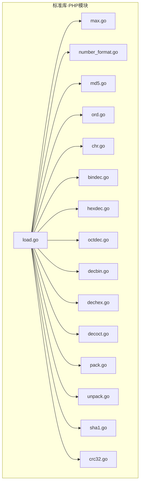
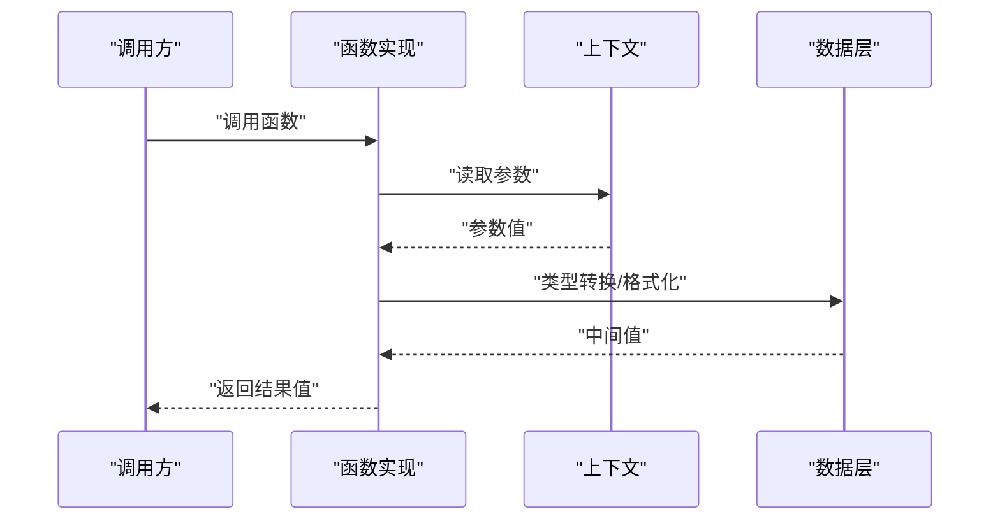
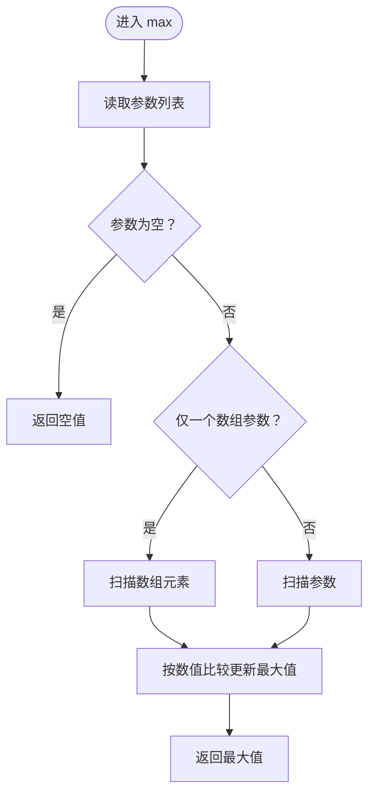
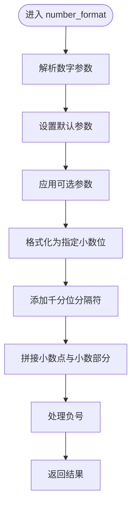
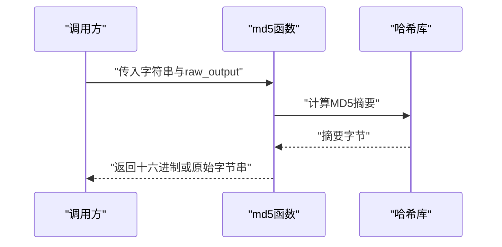
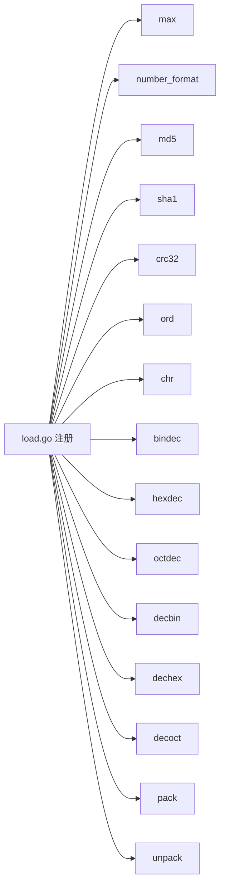

# 数学函数

<cite>
**本文引用的文件**
- [std/php/max.go](file://std/php/max.go)
- [std/php/number_format.go](file://std/php/number_format.go)
- [std/php/md5.go](file://std/php/md5.go)
- [std/php/ord.go](file://std/php/ord.go)
- [std/php/chr.go](file://std/php/chr.go)
- [std/php/bindec.go](file://std/php/bindec.go)
- [std/php/hexdec.go](file://std/php/hexdec.go)
- [std/php/octdec.go](file://std/php/octdec.go)
- [std/php/decbin.go](file://std/php/decbin.go)
- [std/php/dechex.go](file://std/php/dechex.go)
- [std/php/decoct.go](file://std/php/decoct.go)
- [std/php/pack.go](file://std/php/pack.go)
- [std/php/unpack.go](file://std/php/unpack.go)
- [std/php/sha1.go](file://std/php/sha1.go)
- [std/php/crc32.go](file://std/php/crc32.go)
- [std/php/load.go](file://std/php/load.go)
</cite>

## 目录
1. [简介](#简介)
2. [项目结构](#项目结构)
3. [核心组件](#核心组件)
4. [架构总览](#架构总览)
5. [详细组件分析](#详细组件分析)
6. [依赖分析](#依赖分析)
7. [性能考虑](#性能考虑)
8. [故障排查指南](#故障排查指南)
9. [结论](#结论)
10. [附录](#附录)

## 简介
本文件聚焦Origami标准库中与PHP数学计算、编码转换及字符串编码相关的核心函数实现，覆盖以下能力：
- 数值处理函数：max（最小支持子集）、number_format（最小支持子集）
- 哈希函数：md5、sha1、crc32
- 字符串编码函数：ord、chr、bindec、hexdec、octdec、decbin、dechex、decoct
- 字符串打包函数：pack、unpack
同时，文档将说明数值精度处理策略、编码转换规则、与原生PHP的兼容性与差异、性能特征与最佳实践，并给出实际应用场景与排障建议。

## 项目结构
这些函数均位于标准库模块的php目录下，采用统一的函数注册与调用框架：
- 函数以独立Go文件实现，遵循统一的接口规范（实现函数名、参数声明、变量约束等）
- 通过加载器集中注册到运行时环境
- 与数据层（data）协作完成值的读取、类型转换与返回

图表来源
- [std/php/load.go](file://std/php/load.go)
- [std/php/max.go](file://std/php/max.go)
- [std/php/number_format.go](file://std/php/number_format.go)
- [std/php/md5.go](file://std/php/md5.go)
- [std/php/ord.go](file://std/php/ord.go)
- [std/php/chr.go](file://std/php/chr.go)
- [std/php/bindec.go](file://std/php/bindec.go)
- [std/php/hexdec.go](file://std/php/hexdec.go)
- [std/php/octdec.go](file://std/php/octdec.go)
- [std/php/decbin.go](file://std/php/decbin.go)
- [std/php/dechex.go](file://std/php/dechex.go)
- [std/php/decoct.go](file://std/php/decoct.go)
- [std/php/pack.go](file://std/php/pack.go)
- [std/php/unpack.go](file://std/php/unpack.go)
- [std/php/sha1.go](file://std/php/sha1.go)
- [std/php/crc32.go](file://std/php/crc32.go)

章节来源
- [std/php/load.go](file://std/php/load.go)

## 核心组件
本节概述各函数模块的职责与关键行为，便于快速定位与理解。

- 数值处理
  - max：支持多参数或单数组模式，按数值优先的近似比较规则选择最大值；空参数或空数组返回空值
  - number_format：格式化数字，支持小数位、小数点与千分位分隔符；默认按浮点格式化并插入千分位分隔符
- 编码与哈希
  - md5：支持raw_output布尔开关，输出十六进制或原始字节串
  - sha1、crc32：分别提供SHA-1与CRC32校验和计算
- 字符串编码与进制转换
  - ord、chr：字符与ASCII码互转
  - bindec、hexdec、octdec：二/十六/八进制字符串转十进制
  - decbin、dechex、decoct：十进制转二/十六/八进制字符串
- 字符串打包与解包
  - pack、unpack：基于格式字符串进行字节序列打包与解包

章节来源
- [std/php/max.go](file://std/php/max.go)
- [std/php/number_format.go](file://std/php/number_format.go)
- [std/php/md5.go](file://std/php/md5.go)
- [std/php/sha1.go](file://std/php/sha1.go)
- [std/php/crc32.go](file://std/php/crc32.go)
- [std/php/ord.go](file://std/php/ord.go)
- [std/php/chr.go](file://std/php/chr.go)
- [std/php/bindec.go](file://std/php/bindec.go)
- [std/php/hexdec.go](file://std/php/hexdec.go)
- [std/php/octdec.go](file://std/php/octdec.go)
- [std/php/decbin.go](file://std/php/decbin.go)
- [std/php/dechex.go](file://std/php/dechex.go)
- [std/php/decoct.go](file://std/php/decoct.go)
- [std/php/pack.go](file://std/php/pack.go)
- [std/php/unpack.go](file://std/php/unpack.go)

## 架构总览
函数实现遵循统一的调用流程：运行时从上下文获取参数，执行业务逻辑，返回结果值。下图展示典型调用链路与数据流。

图表来源
- [std/php/max.go](file://std/php/max.go)
- [std/php/number_format.go](file://std/php/number_format.go)
- [std/php/md5.go](file://std/php/md5.go)

## 详细组件分析

### 数值处理函数

#### max
- 功能要点
  - 支持多参数模式与单数组模式
  - 比较规则：优先按数值比较，无法解析为数值时按字符串处理
  - 空输入返回空值
- 复杂度
  - 时间复杂度O(n)，空间复杂度O(1)
- 兼容性与差异
  - 仅实现最小可用子集，不支持所有PHP变体的完整比较规则
- 性能特征
  - 单次遍历，避免额外分配
- 应用示例
  - 在一组混合类型数据中找出“最大”项（按数值优先）

图表来源
- [std/php/max.go](file://std/php/max.go)

章节来源
- [std/php/max.go](file://std/php/max.go)

#### number_format
- 功能要点
  - 默认保留0位小数，使用英文句点作为小数点，逗号作为千分位分隔符
  - 支持将字符串解析为浮点数进行格式化
  - 千分位分隔符按每三位插入
- 复杂度
  - 时间复杂度O(n)（n为整数部分长度），空间复杂度O(n)
- 兼容性与差异
  - 仅实现最小支持子集，未暴露decimal_separator与thousands_separator参数
- 性能特征
  - 使用标准库格式化与字符串构建，避免多余拷贝
- 应用示例
  - 将货币金额格式化为带千分位分隔符的字符串

图表来源
- [std/php/number_format.go](file://std/php/number_format.go)

章节来源
- [std/php/number_format.go](file://std/php/number_format.go)

### 编码与哈希函数

#### md5
- 功能要点
  - 计算MD5摘要，支持raw_output布尔开关
  - raw_output为true时返回原始字节串，否则返回十六进制小写字符串
- 复杂度
  - 时间复杂度O(n)，空间复杂度O(1)
- 兼容性与差异
  - 与原生PHP行为一致
- 性能特征
  - 直接使用标准库哈希，常量级开销
- 应用示例
  - 文件内容校验、用户密码存储（需加盐与迭代）

图表来源
- [std/php/md5.go](file://std/php/md5.go)

章节来源
- [std/php/md5.go](file://std/php/md5.go)

#### sha1
- 功能要点
  - 计算SHA-1摘要，返回十六进制小写字符串
- 复杂度
  - 时间复杂度O(n)，空间复杂度O(1)
- 兼容性与差异
  - 与原生PHP行为一致
- 性能特征
  - 直接使用标准库哈希
- 应用示例
  - 数据完整性校验、版本标识

章节来源
- [std/php/sha1.go](file://std/php/sha1.go)

#### crc32
- 功能要点
  - 计算CRC32校验和，返回无符号32位整数
- 复杂度
  - 时间复杂度O(n)，空间复杂度O(1)
- 兼容性与差异
  - 与原生PHP行为一致
- 性能特征
  - 标准库实现，常量级开销
- 应用示例
  - 快速错误检测、数据块索引

章节来源
- [std/php/crc32.go](file://std/php/crc32.go)

### 字符串编码与进制转换

#### ord、chr
- 功能要点
  - ord：将单个字符转换为ASCII码
  - chr：将ASCII码转换为字符
- 复杂度
  - 时间复杂度O(1)，空间复杂度O(1)
- 兼容性与差异
  - 与原生PHP行为一致
- 性能特征
  - 常量时间映射
- 应用示例
  - 字符处理、ASCII范围判断

章节来源
- [std/php/ord.go](file://std/php/ord.go)
- [std/php/chr.go](file://std/php/chr.go)

#### 进制转换
- bindec、hexdec、octdec
  - 将二/十六/八进制字符串解析为十进制整数
- decbin、dechex、decoct
  - 将十进制整数转换为二/十六/八进制字符串
- 复杂度
  - 解析与转换通常为O(n)（n为字符串长度）
- 兼容性与差异
  - 与原生PHP行为一致
- 性能特征
  - 使用标准库解析与格式化
- 应用示例
  - 低层数据表示、协议字段处理

章节来源
- [std/php/bindec.go](file://std/php/bindec.go)
- [std/php/hexdec.go](file://std/php/hexdec.go)
- [std/php/octdec.go](file://std/php/octdec.go)
- [std/php/decbin.go](file://std/php/decbin.go)
- [std/php/dechex.go](file://std/php/dechex.go)
- [std/php/decoct.go](file://std/php/decoct.go)

### 字符串打包与解包

#### pack、unpack
- 功能要点
  - pack：根据格式字符串将数值打包为字节序列
  - unpack：根据格式字符串将字节序列解包为数值数组
- 复杂度
  - 与格式字符串长度线性相关
- 兼容性与差异
  - 与原生PHP行为一致
- 性能特征
  - 使用标准库字节序与格式化
- 应用示例
  - 网络协议、文件头解析、跨语言数据交换

章节来源
- [std/php/pack.go](file://std/php/pack.go)
- [std/php/unpack.go](file://std/php/unpack.go)

## 依赖分析
- 组件内聚高，函数间无直接耦合
- 外部依赖集中在标准库哈希与字符串处理
- 加载器负责统一注册，确保函数可被运行时调用

图表来源
- [std/php/load.go](file://std/php/load.go)

章节来源
- [std/php/load.go](file://std/php/load.go)

## 性能考虑
- 数值比较与格式化
  - max采用单次遍历，避免额外分配
  - number_format使用标准库格式化，千分位分隔符按每三位插入，避免频繁字符串拼接
- 哈希与校验
  - md5、sha1、crc32直接使用标准库实现，常量级开销
- 字符串与进制转换
  - ord/chr为O(1)映射
  - 进制转换依赖标准库解析与格式化，注意输入合法性
- 打包与解包
  - pack/unpack复杂度与格式长度线性相关，建议复用格式字符串与缓冲区

## 故障排查指南
- 输入为空或类型不匹配
  - max在无有效参数或空数组时返回空值
  - number_format在无法解析数字时返回"0"
  - md5在字符串为空时返回空字符串
- raw_output参数
  - md5的raw_output为true时返回原始字节串，注意接收端正确处理字节序列
- 格式字符串问题
  - pack/unpack若格式非法，可能导致解包失败或截断，应严格校验格式与长度
- 兼容性差异
  - max与number_format当前实现为最小可用子集，如需完整行为请参考原生PHP文档

章节来源
- [std/php/max.go](file://std/php/max.go)
- [std/php/number_format.go](file://std/php/number_format.go)
- [std/php/md5.go](file://std/php/md5.go)
- [std/php/pack.go](file://std/php/pack.go)
- [std/php/unpack.go](file://std/php/unpack.go)

## 结论
本模块提供了Origami对PHP常用数学与编码函数的最小可用实现，覆盖了数值比较、格式化、哈希与校验、字符串编码与进制转换以及字节序列打包解包等核心场景。在保持与原生PHP行为一致的同时，遵循了高性能与易维护的设计原则。对于需要完整功能的场景，建议结合原生PHP文档与本仓库现有实现进行扩展。

## 附录
- 最佳实践
  - 数值处理：优先使用明确的数值类型，避免隐式字符串解析
  - 编码与哈希：敏感数据务必加盐与迭代，避免直接使用md5
  - 字符串与进制：严格校验输入范围与格式，防止溢出与异常
  - 打包与解包：固定格式字符串，预留边界检查
- 性能优化建议
  - 复用缓冲区与格式字符串
  - 避免在热路径中重复解析与格式化
  - 合理使用并发与批处理