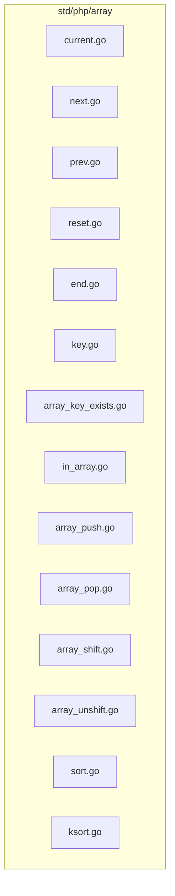
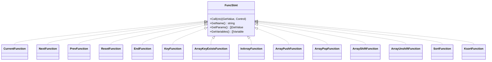
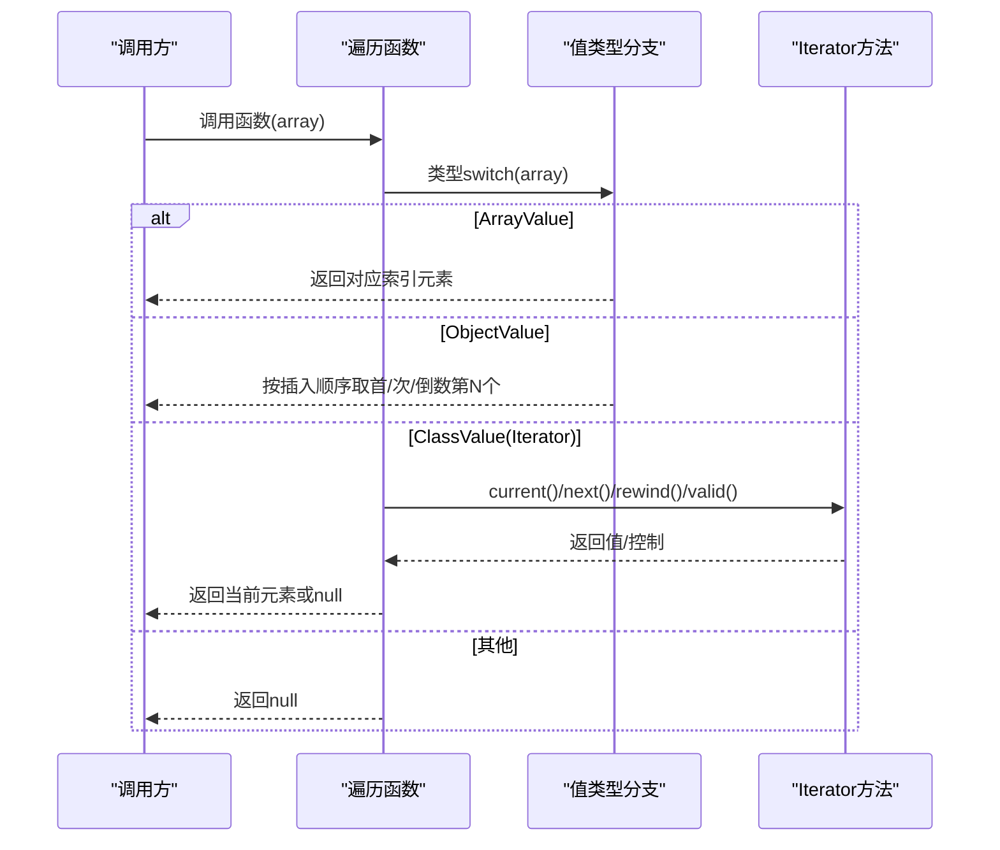
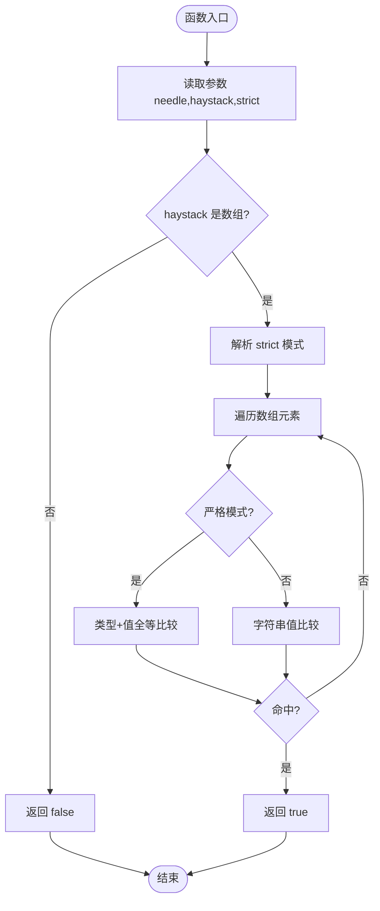
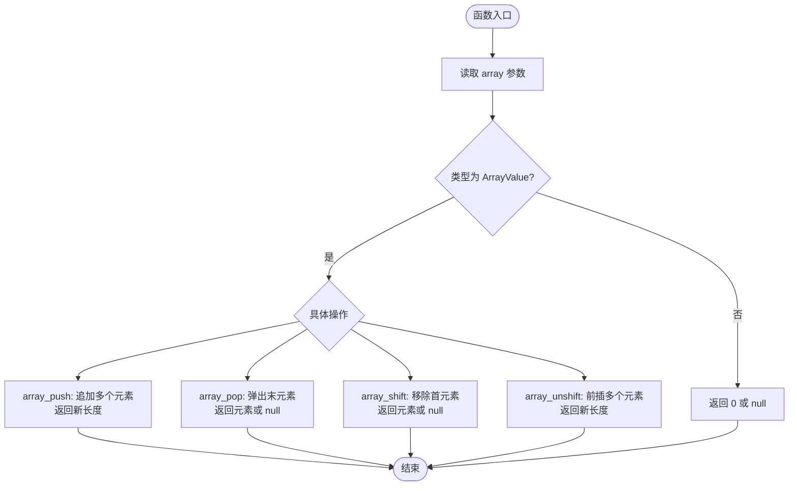
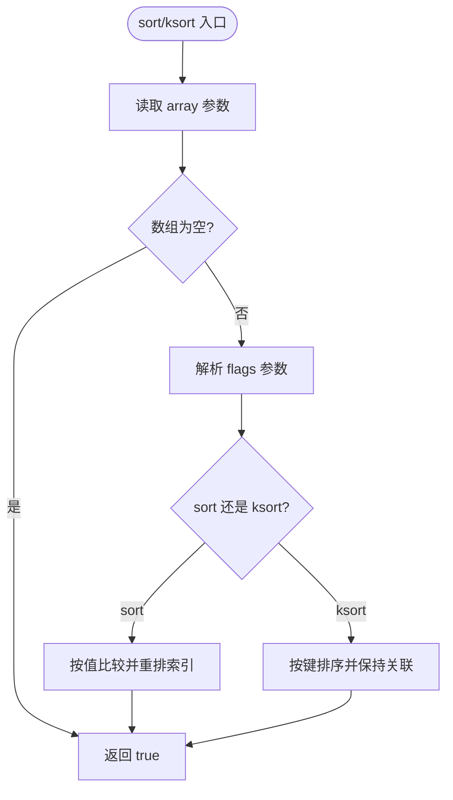
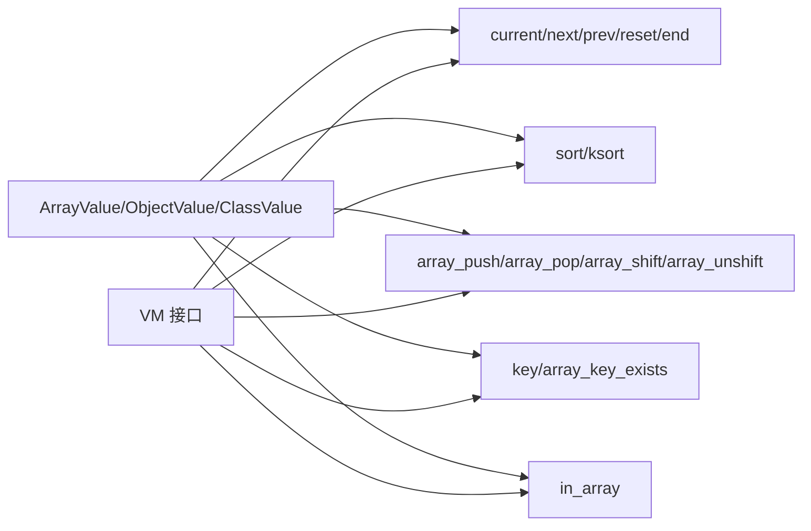

# 数组函数

<cite>
**本文引用的文件**
- [std/php/array/current.go](file://std/php/array/current.go)
- [std/php/array/next.go](file://std/php/array/next.go)
- [std/php/array/prev.go](file://std/php/array/prev.go)
- [std/php/array/reset.go](file://std/php/array/reset.go)
- [std/php/array/end.go](file://std/php/array/end.go)
- [std/php/array/key.go](file://std/php/array/key.go)
- [std/php/array/array_key_exists.go](file://std/php/array/array_key_exists.go)
- [std/php/array/array_push.go](file://std/php/array/array_push.go)
- [std/php/array/array_pop.go](file://std/php/array/array_pop.go)
- [std/php/array/array_shift.go](file://std/php/array/array_shift.go)
- [std/php/array/array_unshift.go](file://std/php/array/array_unshift.go)
- [std/php/array/sort.go](file://std/php/array/sort.go)
- [std/php/array/ksort.go](file://std/php/array/ksort.go)
- [std/php/in_array.go](file://std/php/in_array.go)
</cite>

## 目录
1. [简介](#简介)
2. [项目结构](#项目结构)
3. [核心组件](#核心组件)
4. [架构总览](#架构总览)
5. [详细组件分析](#详细组件分析)
6. [依赖分析](#依赖分析)
7. [性能考虑](#性能考虑)
8. [故障排查指南](#故障排查指南)
9. [结论](#结论)
10. [附录](#附录)

## 简介
本文件系统性梳理 Origami 对 PHP 数组函数的支持，覆盖数组遍历（current、next、prev、reset、end）、数组搜索（key、array_key_exists、in_array）、数组修改（array_push、array_pop、array_shift、array_unshift）、数组排序（sort、ksort、asort）。文档从实现原理、参数规范、返回值类型、边界条件处理等方面展开，并结合仓库现有实现给出兼容性与性能差异说明，同时提供优化建议与常见陷阱。

## 项目结构
数组函数位于标准库模块 std/php/array 下，采用“按功能分文件”的组织方式，每个函数独立实现为一个可调用的 FuncStmt 类型对象。遍历、搜索、修改、排序分别对应不同文件，便于维护与测试。

图表来源
- [std/php/array/current.go](file://std/php/array/current.go)
- [std/php/array/next.go](file://std/php/array/next.go)
- [std/php/array/prev.go](file://std/php/array/prev.go)
- [std/php/array/reset.go](file://std/php/array/reset.go)
- [std/php/array/end.go](file://std/php/array/end.go)
- [std/php/array/key.go](file://std/php/array/key.go)
- [std/php/array/array_key_exists.go](file://std/php/array/array_key_exists.go)
- [std/php/array/array_push.go](file://std/php/array/array_push.go)
- [std/php/array/array_pop.go](file://std/php/array/array_pop.go)
- [std/php/array/array_shift.go](file://std/php/array/array_shift.go)
- [std/php/array/array_unshift.go](file://std/php/array/array_unshift.go)
- [std/php/array/sort.go](file://std/php/array/sort.go)
- [std/php/array/ksort.go](file://std/php/array/ksort.go)
- [std/php/in_array.go](file://std/php/in_array.go)

章节来源
- [std/php/array/current.go](file://std/php/array/current.go)
- [std/php/array/next.go](file://std/php/array/next.go)
- [std/php/array/prev.go](file://std/php/array/prev.go)
- [std/php/array/reset.go](file://std/php/array/reset.go)
- [std/php/array/end.go](file://std/php/array/end.go)
- [std/php/array/key.go](file://std/php/array/key.go)
- [std/php/array/array_key_exists.go](file://std/php/array/array_key_exists.go)
- [std/php/array/array_push.go](file://std/php/array/array_push.go)
- [std/php/array/array_pop.go](file://std/php/array/array_pop.go)
- [std/php/array/array_shift.go](file://std/php/array/array_shift.go)
- [std/php/array/array_unshift.go](file://std/php/array/array_unshift.go)
- [std/php/array/sort.go](file://std/php/array/sort.go)
- [std/php/array/ksort.go](file://std/php/array/ksort.go)
- [std/php/in_array.go](file://std/php/in_array.go)

## 核心组件
- 遍历函数族：current、next、prev、reset、end，用于移动/读取内部指针位置并返回当前元素或键。
- 搜索函数族：key、array_key_exists、in_array，用于读取当前键、判断键存在性、在数组中查找值。
- 修改函数族：array_push、array_pop、array_shift、array_unshift，用于在数组两端增删改。
- 排序函数族：sort、ksort、asort，用于对数组进行升序排序（键重排/保持键）。

章节来源
- [std/php/array/current.go](file://std/php/array/current.go)
- [std/php/array/next.go](file://std/php/array/next.go)
- [std/php/array/prev.go](file://std/php/array/prev.go)
- [std/php/array/reset.go](file://std/php/array/reset.go)
- [std/php/array/end.go](file://std/php/array/end.go)
- [std/php/array/key.go](file://std/php/array/key.go)
- [std/php/array/array_key_exists.go](file://std/php/array/array_key_exists.go)
- [std/php/in_array.go](file://std/php/in_array.go)
- [std/php/array/array_push.go](file://std/php/array/array_push.go)
- [std/php/array/array_pop.go](file://std/php/array/array_pop.go)
- [std/php/array/array_shift.go](file://std/php/array/array_shift.go)
- [std/php/array/array_unshift.go](file://std/php/array/array_unshift.go)
- [std/php/array/sort.go](file://std/php/array/sort.go)
- [std/php/array/ksort.go](file://std/php/array/ksort.go)

## 架构总览
各数组函数均实现 data.FuncStmt 接口，统一通过 Call(ctx) 接收上下文参数，根据第一个参数（通常为数组或对象）进行类型分支处理。对于实现 Iterator 接口的对象，函数通过反射调用其 current/next/rewind/valid/key 等方法来模拟 PHP 行为。

图表来源
- [std/php/array/current.go](file://std/php/array/current.go)
- [std/php/array/next.go](file://std/php/array/next.go)
- [std/php/array/prev.go](file://std/php/array/prev.go)
- [std/php/array/reset.go](file://std/php/array/reset.go)
- [std/php/array/end.go](file://std/php/array/end.go)
- [std/php/array/key.go](file://std/php/array/key.go)
- [std/php/array/array_key_exists.go](file://std/php/array/array_key_exists.go)
- [std/php/in_array.go](file://std/php/in_array.go)
- [std/php/array/array_push.go](file://std/php/array/array_push.go)
- [std/php/array/array_pop.go](file://std/php/array/array_pop.go)
- [std/php/array/array_shift.go](file://std/php/array/array_shift.go)
- [std/php/array/array_unshift.go](file://std/php/array/array_unshift.go)
- [std/php/array/sort.go](file://std/php/array/sort.go)
- [std/php/array/ksort.go](file://std/php/array/ksort.go)

## 详细组件分析

### 遍历函数族（current、next、prev、reset、end）
- current：返回“当前”元素。对 ArrayValue 返回首个元素；对 ObjectValue 返回插入顺序第一个属性值；对实现 Iterator 的对象，调用 current。
- next：移动指针到下一个位置并返回元素。对 ArrayValue 返回索引为 1 的元素；对 ObjectValue 返回第二个属性值；对 Iterator 对象，调用 next 并校验 valid 后返回 current。
- prev：向后移动指针（注意：标准 Iterator 无 prev，返回 null）。对 ArrayValue 返回倒数第二个元素；对 ObjectValue 计算总数后定位倒数第二项。
- reset：将指针重置到第一个位置。对 ArrayValue/ObjectValue 返回首个元素；对 Iterator 对象调用 rewind/valid/current。
- end：将指针移动到最后一个位置。对 ArrayValue 返回末元素；对 ObjectValue 遍历到最后一个；对 Iterator 对象循环 valid+next 到末尾并返回。

图表来源
- [std/php/array/current.go](file://std/php/array/current.go)
- [std/php/array/next.go](file://std/php/array/next.go)
- [std/php/array/prev.go](file://std/php/array/prev.go)
- [std/php/array/reset.go](file://std/php/array/reset.go)
- [std/php/array/end.go](file://std/php/array/end.go)

章节来源
- [std/php/array/current.go](file://std/php/array/current.go)
- [std/php/array/next.go](file://std/php/array/next.go)
- [std/php/array/prev.go](file://std/php/array/prev.go)
- [std/php/array/reset.go](file://std/php/array/reset.go)
- [std/php/array/end.go](file://std/php/array/end.go)

### 搜索函数族（key、array_key_exists、in_array）
- key：返回“当前”键。ArrayValue 返回 0；ObjectValue 返回首个键；Iterator 对象调用 key。
- array_key_exists：检查键是否存在。ArrayValue 检查数值索引；ObjectValue 检查属性键；返回布尔。
- in_array：在数组中查找值。支持严格模式（===），非严格模式比较字符串值；返回布尔。

图表来源
- [std/php/in_array.go](file://std/php/in_array.go)

章节来源
- [std/php/array/key.go](file://std/php/array/key.go)
- [std/php/array/array_key_exists.go](file://std/php/array/array_key_exists.go)
- [std/php/in_array.go](file://std/php/in_array.go)

### 修改函数族（array_push、array_pop、array_shift、array_unshift）
- array_push：向数组末尾追加多个元素，返回新长度。若第一个参数不是数组，返回 0。
- array_pop：弹出并返回最后一个元素；空数组或非数组返回 null。
- array_shift：移除并返回第一个元素；空数组或非数组返回 null。
- array_unshift：在数组开头插入多个元素，返回新长度；无插入元素时直接返回当前长度。

图表来源
- [std/php/array/array_push.go](file://std/php/array/array_push.go)
- [std/php/array/array_pop.go](file://std/php/array/array_pop.go)
- [std/php/array/array_shift.go](file://std/php/array/array_shift.go)
- [std/php/array/array_unshift.go](file://std/php/array/array_unshift.go)

章节来源
- [std/php/array/array_push.go](file://std/php/array/array_push.go)
- [std/php/array/array_pop.go](file://std/php/array/array_pop.go)
- [std/php/array/array_shift.go](file://std/php/array/array_shift.go)
- [std/php/array/array_unshift.go](file://std/php/array/array_unshift.go)

### 排序函数族（sort、ksort、asort）
- sort：对数组进行升序排序并重新索引键。支持多种 flags（常规/数值/字符串/自然排序/本地化字符串等），内部通过 compareValues 分派比较策略。
- ksort：按键排序，保持键到值的关联，不重新索引键。对 ArrayValue（整数键）视为无需重排；对 ObjectValue（字符串键）收集键并排序后重建属性映射。
- asort：按值排序，保持键到值的关联，不重新索引键。（注：仓库未提供 asort 实现文件）

图表来源
- [std/php/array/sort.go](file://std/php/array/sort.go)
- [std/php/array/ksort.go](file://std/php/array/ksort.go)

章节来源
- [std/php/array/sort.go](file://std/php/array/sort.go)
- [std/php/array/ksort.go](file://std/php/array/ksort.go)

## 依赖分析
- 内部依赖：所有数组函数均依赖 data 包中的 ArrayValue、ObjectValue、ClassValue、Value 接口及类型转换能力；部分函数通过 VM 接口查询/校验接口实现。
- 外部依赖：sort.go 使用 Go 标准库 sort；compareNatural 等函数为简化实现。
- 耦合度：函数间低耦合，各自独立处理参数与类型分支；对 Iterator 的调用通过反射方法名完成，避免强绑定。

图表来源
- [std/php/array/current.go](file://std/php/array/current.go)
- [std/php/array/next.go](file://std/php/array/next.go)
- [std/php/array/prev.go](file://std/php/array/prev.go)
- [std/php/array/reset.go](file://std/php/array/reset.go)
- [std/php/array/end.go](file://std/php/array/end.go)
- [std/php/array/sort.go](file://std/php/array/sort.go)
- [std/php/array/ksort.go](file://std/php/array/ksort.go)
- [std/php/array/array_push.go](file://std/php/array/array_push.go)
- [std/php/array/array_pop.go](file://std/php/array/array_pop.go)
- [std/php/array/array_shift.go](file://std/php/array/array_shift.go)
- [std/php/array/array_unshift.go](file://std/php/array/array_unshift.go)
- [std/php/array/key.go](file://std/php/array/key.go)
- [std/php/array/array_key_exists.go](file://std/php/array/array_key_exists.go)
- [std/php/in_array.go](file://std/php/in_array.go)

章节来源
- [std/php/array/current.go](file://std/php/array/current.go)
- [std/php/array/next.go](file://std/php/array/next.go)
- [std/php/array/prev.go](file://std/php/array/prev.go)
- [std/php/array/reset.go](file://std/php/array/reset.go)
- [std/php/array/end.go](file://std/php/array/end.go)
- [std/php/array/sort.go](file://std/php/array/sort.go)
- [std/php/array/ksort.go](file://std/php/array/ksort.go)
- [std/php/array/array_push.go](file://std/php/array/array_push.go)
- [std/php/array/array_pop.go](file://std/php/array/array_pop.go)
- [std/php/array/array_shift.go](file://std/php/array/array_shift.go)
- [std/php/array/array_unshift.go](file://std/php/array/array_unshift.go)
- [std/php/array/key.go](file://std/php/array/key.go)
- [std/php/array/array_key_exists.go](file://std/php/array/array_key_exists.go)
- [std/php/in_array.go](file://std/php/in_array.go)

## 性能考虑
- 时间复杂度
  - 遍历函数：current/next/prev/reset/end 对 ArrayValue/ObjectValue 为 O(1)/O(n)（取决于遍历策略），对 Iterator 为 O(1)~O(n)（取决于迭代器实现）。
  - 搜索函数：key 为 O(1)，array_key_exists 对 ArrayValue 为 O(1)，对 ObjectValue 为 O(n)；in_array 为 O(n)。
  - 修改函数：array_push/unshift 为 O(k)（k 为追加元素数），array_pop 为 O(1)，array_shift 为 O(n)（需移动切片）。
  - 排序函数：sort/ksort 为 O(n log n)，asort 未提供实现文件。
- 空间复杂度
  - ksort 在重建 ObjectValue 属性映射时会分配新对象，空间开销与键数量线性相关。
- 优化建议
  - 避免在大数组上频繁 array_shift，优先使用双端队列或反向遍历减少移动成本。
  - in_array 非严格模式下字符串比较可缓存 AsString 结果，减少重复转换。
  - sort/ksort 使用合适的 flags，尽量避免复杂比较逻辑。
  - 对频繁访问的键，优先使用关联数组（ObjectValue）以获得 O(1) 访问收益。

## 故障排查指南
- 参数类型错误
  - 遍历/搜索/修改/排序函数对非数组输入通常返回 null/false/0，需确保传入正确的数组类型。
- 空数组处理
  - array_pop/array_shift 返回 null；array_push/array_unshift 返回 0/当前长度；sort/ksort 返回 true。
- 迭代器兼容性
  - 仅当对象实现 Iterator 接口时，current/next/rewind/valid/key 才生效；否则返回 null。
- 严格模式陷阱
  - in_array 严格模式下按值类型全等比较，注意不同基础类型的比较结果。
- 键存在性判断
  - array_key_exists 对 ArrayValue 仅支持数值索引；对 ObjectValue 支持字符串键。

章节来源
- [std/php/array/current.go](file://std/php/array/current.go)
- [std/php/array/next.go](file://std/php/array/next.go)
- [std/php/array/prev.go](file://std/php/array/prev.go)
- [std/php/array/reset.go](file://std/php/array/reset.go)
- [std/php/array/end.go](file://std/php/array/end.go)
- [std/php/array/key.go](file://std/php/array/key.go)
- [std/php/array/array_key_exists.go](file://std/php/array/array_key_exists.go)
- [std/php/in_array.go](file://std/php/in_array.go)
- [std/php/array/array_push.go](file://std/php/array/array_push.go)
- [std/php/array/array_pop.go](file://std/php/array/array_pop.go)
- [std/php/array/array_shift.go](file://std/php/array/array_shift.go)
- [std/php/array/array_unshift.go](file://std/php/array/array_unshift.go)
- [std/php/array/sort.go](file://std/php/array/sort.go)
- [std/php/array/ksort.go](file://std/php/array/ksort.go)

## 结论
Origami 的数组函数模块以清晰的职责划分与一致的接口设计实现了对 PHP 数组操作的广泛覆盖。通过类型分支与 Iterator 反射调用，既保证了与 PHP 语义的兼容，又兼顾了运行时性能。建议在工程实践中遵循参数类型约束、合理选择排序与查找策略，并关注空数组与迭代器边界行为，以获得稳定高效的数组处理体验。

## 附录
- 与原生 PHP 的兼容性要点
  - 遍历函数：行为与 PHP 一致，但对 Iterator 的支持依赖方法名匹配。
  - 搜索函数：in_array 的严格模式与字符串比较策略与 PHP 一致。
  - 修改函数：array_shift 的键重排语义在 ObjectValue 上不适用，当前实现按 ArrayValue 语义处理。
  - 排序函数：sort/ksort 的 flags 支持为简化实现，完整语义请参考 PHP 文档。
- 性能差异
  - Go 标准库 sort 的稳定性与比较函数实现可能与 PHP 不完全一致，排序稳定性以 Go 为准。
  - array_shift 的 O(n) 移动成本在大数组上尤为明显，应谨慎使用。