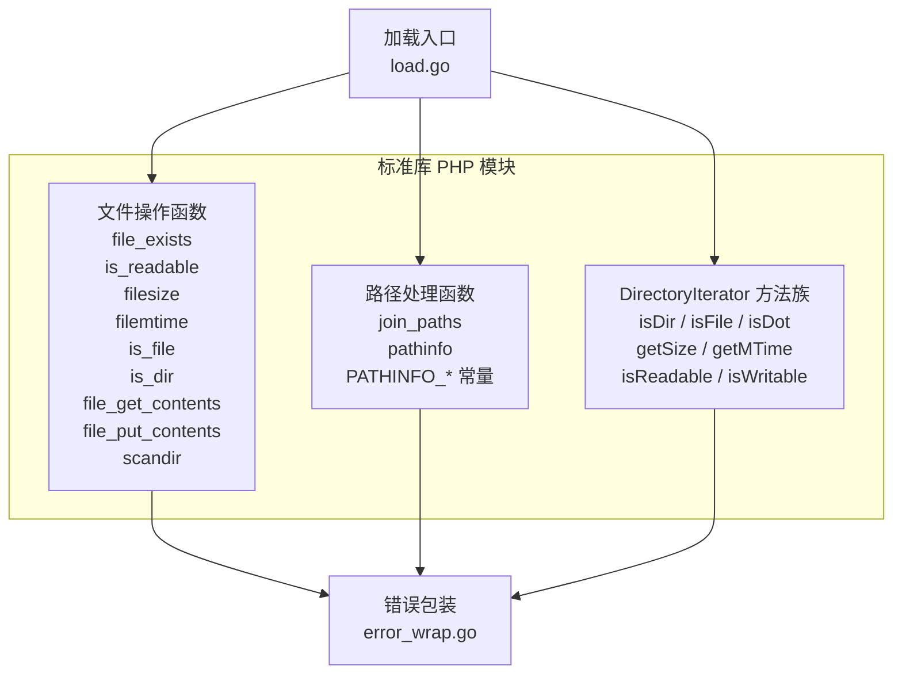
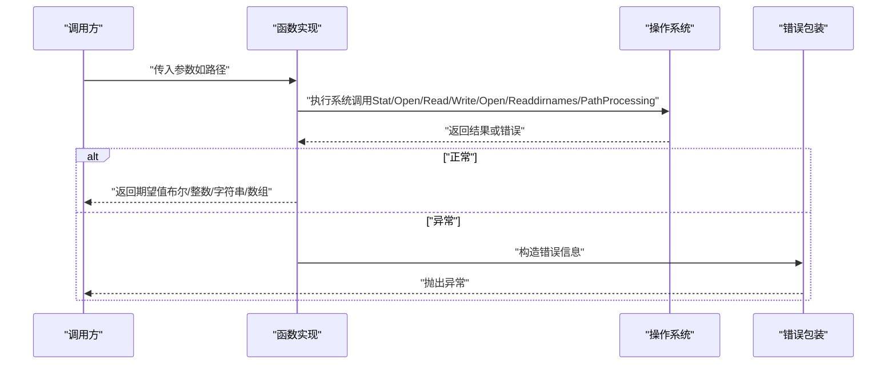
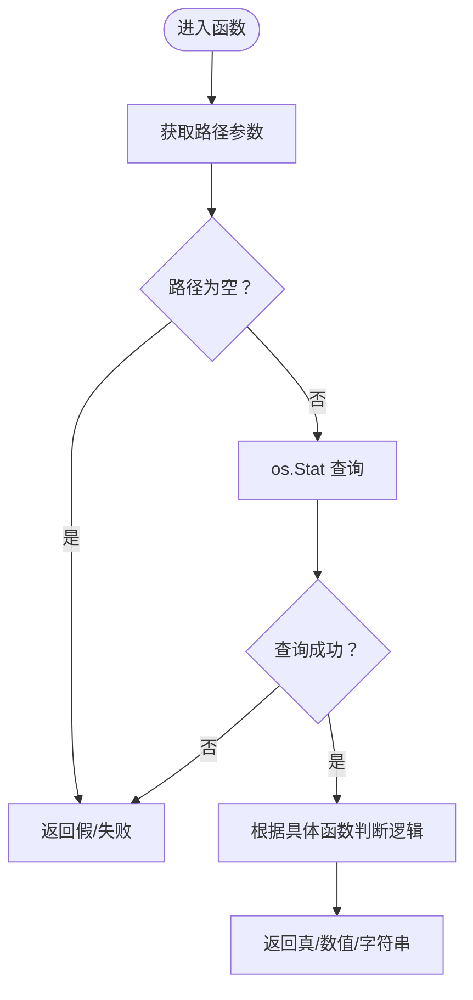
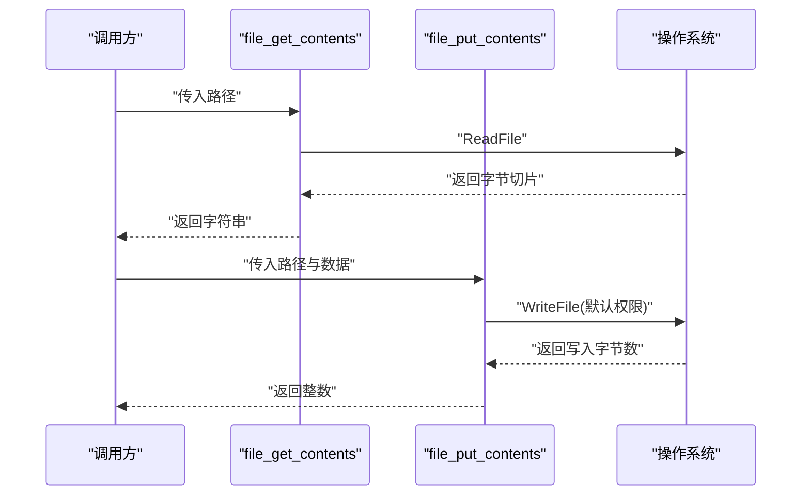
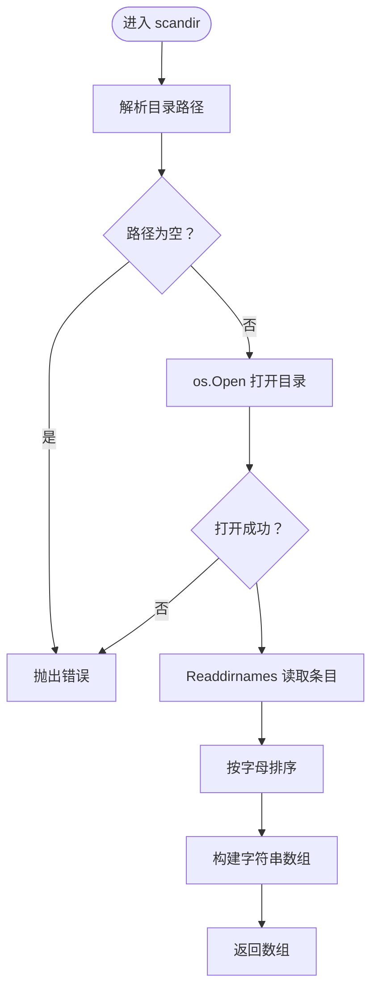
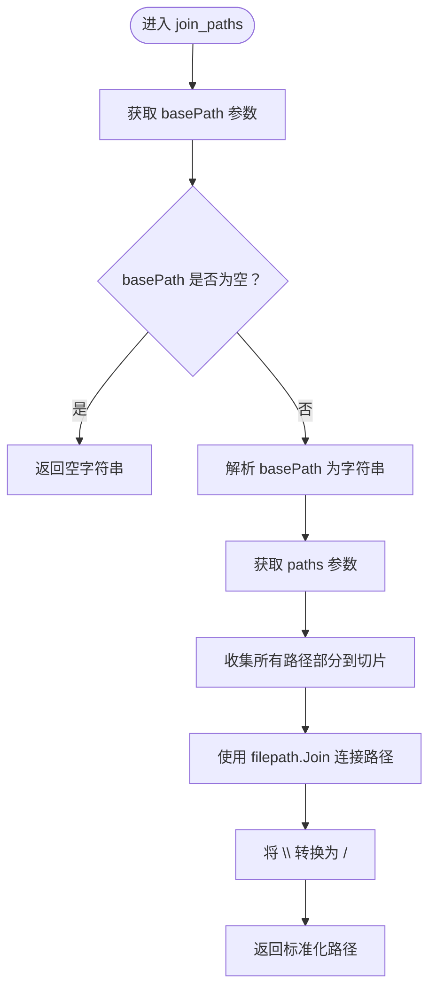
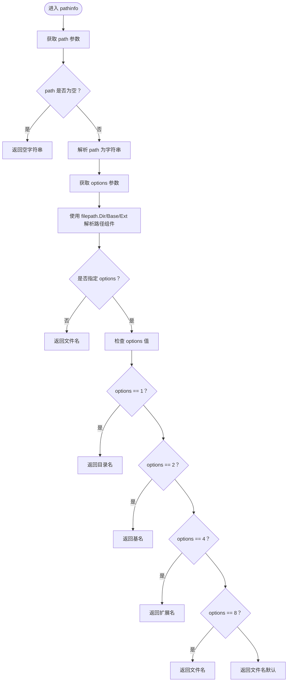
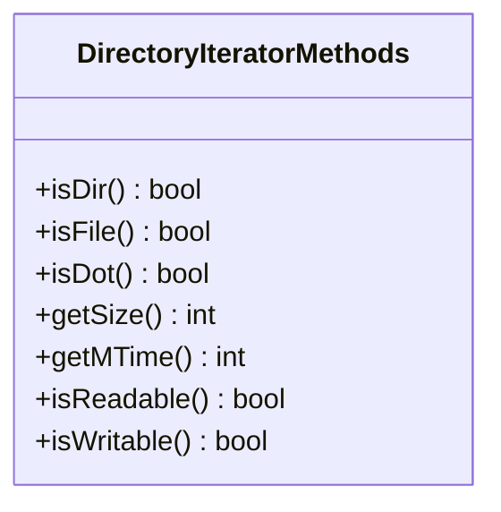
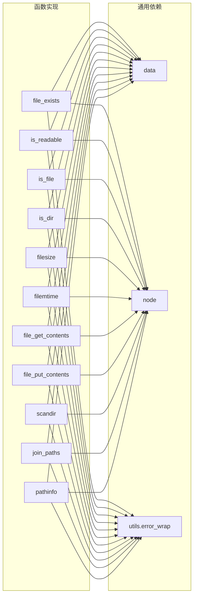

# 文件系统函数

<cite>
**本文引用的文件**
- [std/php/file/file_exists.go](file://std/php/file/file_exists.go)
- [std/php/file/is_readable.go](file://std/php/file/is_readable.go)
- [std/php/file/filesize.go](file://std/php/file/filesize.go)
- [std/php/file/filemtime.go](file://std/php/file/filemtime.go)
- [std/php/is_file.go](file://std/php/is_file.go)
- [std/php/is_dir.go](file://std/php/is_dir.go)
- [std/php/file_get_contents.go](file://std/php/file_get_contents.go)
- [std/php/file_put_contents.go](file://std/php/file_put_contents.go)
- [std/php/scandir.go](file://std/php/scandir.go)
- [std/php/directory/directory_iterator_methods.go](file://std/php/directory/directory_iterator_methods.go)
- [std/php/join_paths.go](file://std/php/join_paths.go)
- [std/php/pathinfo.go](file://std/php/pathinfo.go)
- [std/php/pathinfo_const.go](file://std/php/pathinfo_const.go)
- [std/php/load.go](file://std/php/load.go)
- [utils/error_wrap.go](file://utils/error_wrap.go)
</cite>

## 更新摘要
**变更内容**
- 新增路径处理功能章节，详细介绍 join_paths() 和 pathinfo() 函数
- 更新核心组件部分，添加新的路径处理函数
- 更新架构总览，包含新的路径处理函数
- 新增路径处理函数的详细组件分析
- 更新依赖分析，包含新的路径处理函数
- 新增路径处理的最佳实践和安全性考虑

## 目录
1. [简介](#简介)
2. [项目结构](#项目结构)
3. [核心组件](#核心组件)
4. [架构总览](#架构总览)
5. [详细组件分析](#详细组件分析)
6. [依赖分析](#依赖分析)
7. [性能考量](#性能考量)
8. [故障排除指南](#故障排除指南)
9. [结论](#结论)
10. [附录](#附录)

## 简介
本文件系统函数模块文档面向使用 Origami 运行时的开发者，系统性梳理与 PHP 兼容的文件与目录操作能力，覆盖以下方面：
- 文件存在性与属性检查：file_exists、is_readable、is_writable、is_file、is_dir、filesize、filemtime、stat（通过 DirectoryIterator 方法族）
- 文件读写：file_get_contents、file_put_contents
- 目录遍历：scandir
- **新增** 路径处理：join_paths、pathinfo 及相关常量
- 权限检查、错误处理机制
- 安全性考虑与最佳实践
- 跨平台兼容性与性能优化策略
- 常见错误处理与故障排除

## 项目结构
该模块位于标准库子包 std/php 下，按功能域分层组织：
- 核心函数：file_exists、is_readable、filesize、filemtime、is_file、is_dir、file_get_contents、file_put_contents、scandir
- **新增** 路径处理函数：join_paths、pathinfo 及 PATHINFO_* 常量
- 目录迭代器方法：DirectoryIterator 的 isDir、isFile、isDot、getSize、getMTime、isReadable、isWritable 等
- 加载入口：load.go 中注册上述函数与类方法
- 错误包装：utils/error_wrap.go 提供统一的异常抛出工具

**图表来源**
- [std/php/load.go](file://std/php/load.go)
- [std/php/join_paths.go](file://std/php/join_paths.go)
- [std/php/pathinfo.go](file://std/php/pathinfo.go)
- [std/php/pathinfo_const.go](file://std/php/pathinfo_const.go)

## 核心组件
- 存在性与属性检查
  - file_exists：检查文件或目录是否存在
  - is_readable：检查文件是否可读（非目录）
  - is_file / is_dir：判断路径是否为文件/目录
  - filesize：获取文件大小（字节），目录返回失败
  - filemtime：获取文件修改时间（Unix 时间戳）
- 文件读写
  - file_get_contents：读取整个文件内容为字符串
  - file_put_contents：写入数据到文件，返回写入字节数
- 目录操作
  - scandir：列出目录下所有条目名称并按字母排序
- **新增** 路径处理
  - join_paths：连接多个路径部分，返回标准化的路径字符串
  - pathinfo：解析文件路径信息，支持返回目录名、文件名、扩展名等
  - PATHINFO_DIRNAME、PATHINFO_BASENAME、PATHINFO_EXTENSION、PATHINFO_FILENAME 常量
- 目录迭代器方法（通过 DirectoryIterator）
  - isDir / isFile / isDot：判断当前项类型
  - getSize / getMTime：获取大小与修改时间
  - isReadable / isWritable：判断可读/可写

**章节来源**
- [std/php/join_paths.go](file://std/php/join_paths.go)
- [std/php/pathinfo.go](file://std/php/pathinfo.go)
- [std/php/pathinfo_const.go](file://std/php/pathinfo_const.go)

## 架构总览
这些函数均以统一的函数声明接口实现，遵循运行时上下文参数解析与返回值封装规范；错误通过统一的错误包装工具抛出，保证行为与 PHP 一致。新增的路径处理函数同样遵循这一架构模式。

**图表来源**
- [std/php/join_paths.go](file://std/php/join_paths.go)
- [std/php/pathinfo.go](file://std/php/pathinfo.go)
- [utils/error_wrap.go](file://utils/error_wrap.go)

## 详细组件分析

### 文件存在性与属性检查
- file_exists
  - 行为：对路径调用系统状态查询，存在即返回真，否则返回假
  - 边界：空路径返回假
  - 错误：非致命，仅返回假
- is_readable
  - 行为：先确认为文件（非目录），再尝试打开验证可读性
  - 边界：空路径、目录、不可读均返回假
- is_file / is_dir
  - 行为：基于系统状态判断是否为文件/目录
  - 边界：空路径返回假
- filesize
  - 行为：返回文件大小（字节），目录返回失败
  - 边界：空路径返回失败
- filemtime
  - 行为：返回修改时间的 Unix 时间戳
  - 边界：空路径返回失败

**图表来源**
- [std/php/file/file_exists.go](file://std/php/file/file_exists.go)
- [std/php/file/is_readable.go](file://std/php/file/is_readable.go)
- [std/php/file/filesize.go](file://std/php/file/filesize.go)
- [std/php/file/filemtime.go](file://std/php/file/filemtime.go)
- [std/php/is_file.go](file://std/php/is_file.go)
- [std/php/is_dir.go](file://std/php/is_dir.go)

### 文件读写
- file_get_contents
  - 行为：读取整个文件内容为字符串
  - 参数：首个参数为文件路径（支持非字符串自动转字符串）
  - 错误：路径为空或读取失败时抛出异常
- file_put_contents
  - 行为：将数据写入文件，默认权限掩码（需结合安全策略）
  - 参数：文件路径与数据（字符串或可转字符串）
  - 返回：写入字节数
  - 错误：路径为空或写入失败时抛出异常

**图表来源**
- [std/php/file_get_contents.go](file://std/php/file_get_contents.go)
- [std/php/file_put_contents.go](file://std/php/file_put_contents.go)

### 目录操作
- scandir
  - 行为：打开目录、读取条目名称、按字母排序、返回字符串数组
  - 参数：目录路径
  - 错误：路径为空或打开/读取失败时抛出异常
  - 注意：返回数组元素为条目名称（不含完整路径）

**图表来源**
- [std/php/scandir.go](file://std/php/scandir.go)

### 路径处理函数

#### join_paths 函数
- 功能：连接多个路径部分，返回标准化的路径字符串
- 签名：`join_paths(string $basePath, string ...$paths): string`
- 行为：
  - 接受基础路径和可变数量的路径片段
  - 使用 `filepath.Join` 进行路径连接
  - 将 Windows 风格路径转换为 Unix 风格（反斜杠转斜杠）
  - 支持混合平台路径分隔符
- 参数：
  - `$basePath`：基础路径字符串
  - `$paths`：可变参数数组，包含要连接的路径片段
- 返回：连接后的标准化路径字符串
- 错误：参数为空时返回空字符串

#### pathinfo 函数
- 功能：解析文件路径信息，返回指定的路径组件
- 签名：`pathinfo(string $path, int $options = null): string|array`
- 行为：
  - 解析给定路径的目录名、基名、扩展名和文件名
  - 支持通过 options 参数指定返回特定组件
  - 默认返回文件名（不包含扩展名）
- 参数：
  - `$path`：要解析的路径字符串
  - `$options`：可选的选项常量（PATHINFO_DIRNAME、PATHINFO_BASENAME、PATHINFO_EXTENSION、PATHINFO_FILENAME）
- 返回：根据 options 参数返回字符串或数组
- 常量：
  - `PATHINFO_DIRNAME`：返回目录名
  - `PATHINFO_BASENAME`：返回基名（包含扩展名）
  - `PATHINFO_EXTENSION`：返回扩展名
  - `PATHINFO_FILENAME`：返回文件名（不包含扩展名）

**图表来源**
- [std/php/join_paths.go](file://std/php/join_paths.go)

**图表来源**
- [std/php/pathinfo.go](file://std/php/pathinfo.go)

**章节来源**
- [std/php/join_paths.go](file://std/php/join_paths.go)
- [std/php/pathinfo.go](file://std/php/pathinfo.go)
- [std/php/pathinfo_const.go](file://std/php/pathinfo_const.go)

### 目录迭代器方法（DirectoryIterator）
- 方法族：isDir、isFile、isDot、getSize、getMTime、isReadable、isWritable
- 行为：从迭代器状态中读取当前条目的元信息，返回布尔或整数
- 错误：若迭代器状态缺失，返回假或零值

**图表来源**
- [std/php/directory/directory_iterator_methods.go](file://std/php/directory/directory_iterator_methods.go)

## 依赖分析
- 统一依赖
  - 数据与节点模型：data、node
  - 错误包装：utils.error_wrap
  - 标准库加载：std/php/load.go
- 函数间耦合
  - 各函数相对独立，主要共享参数解析与错误包装
  - 目录迭代器方法与目录相关函数形成互补（scandir 与 DirectoryIterator 方法族）
  - **新增** 路径处理函数依赖标准库的字符串处理和文件系统操作

**图表来源**
- [std/php/join_paths.go](file://std/php/join_paths.go)
- [std/php/pathinfo.go](file://std/php/pathinfo.go)
- [utils/error_wrap.go](file://utils/error_wrap.go)

**章节来源**
- [std/php/join_paths.go](file://std/php/join_paths.go)
- [std/php/pathinfo.go](file://std/php/pathinfo.go)
- [std/php/load.go](file://std/php/load.go)

## 性能考量
- I/O 批量与缓冲
  - file_get_contents 一次性读取整个文件，适合小/中文件；大文件建议分块读取或流式处理
  - file_put_contents 默认一次写入，适合小/中数据；大文件建议使用流或分块写入
- 目录扫描
  - scandir 会读取全部条目并排序，目录项较多时应考虑分页或过滤策略
- 权限检查
  - is_readable 会尝试打开文件进行验证，频繁调用可能带来额外开销；可结合缓存或延迟检查
- **新增** 路径处理性能
  - join_paths 使用标准库的 filepath.Join，性能优化良好
  - pathinfo 函数仅进行字符串解析，复杂度低
  - 多个路径连接时，建议预分配切片容量以减少内存重新分配
- 跨平台差异
  - 文件系统语义在不同平台略有差异（如符号链接、权限模型），建议在部署环境统一测试

## 故障排除指南
- 常见错误与定位
  - 路径为空：多数函数对空路径返回假/失败，请检查输入参数
  - 文件不存在：file_exists 返回假；file_get_contents/filesize/filemtime 抛出异常
  - 不可读：is_readable 返回假；file_get_contents 抛出异常
  - 目录场景：filesize 对目录返回失败；is_readable 对目录返回假
  - 目录打开失败：scandir 抛出异常，检查目录权限与路径正确性
  - **新增** 路径处理问题：
    - join_paths 返回空字符串：检查输入参数是否为空
    - pathinfo 返回意外结果：确认路径格式和 options 常量使用正确
- 排错步骤
  - 校验路径合法性与可访问性
  - 使用 file_exists/is_readable 预检
  - 分别测试读/写/列目录等单一操作
  - **新增** 使用 join_paths 和 pathinfo 进行路径验证
  - 结合日志与异常消息定位具体调用点

**章节来源**
- [std/php/join_paths.go](file://std/php/join_paths.go)
- [std/php/pathinfo.go](file://std/php/pathinfo.go)
- [std/php/file_get_contents.go](file://std/php/file_get_contents.go)
- [std/php/file_put_contents.go](file://std/php/file_put_contents.go)
- [std/php/scandir.go](file://std/php/scandir.go)

## 结论
本模块提供了与 PHP 文件系统 API 兼容的核心能力，涵盖存在性检查、属性查询、读写与目录遍历。**新增的路径处理功能进一步增强了 Origami 的文件系统操作能力，提供了与 PHP 兼容的路径拼接和解析功能**。通过统一的参数解析与错误包装机制，确保行为稳定且易于排查。建议在生产环境中结合安全策略与性能优化，谨慎处理大文件与高并发场景，充分利用新增的路径处理功能简化路径操作。

## 附录
- 安全性与最佳实践
  - 输入校验：始终校验路径非空与合法
  - 权限最小化：写入时避免过度宽松权限
  - 原子写入：重要配置建议临时文件+重命名
  - **新增** 路径安全：
    - 使用 join_paths 替代手动字符串拼接路径
    - 验证 pathinfo 返回结果的有效性
    - 避免路径注入攻击，对用户输入进行严格验证
  - 超时与重试：网络文件系统或远程存储建议增加超时控制
- 跨平台注意事项
  - 路径分隔符与大小写敏感性差异
  - 权限模型与 ACL 差异
  - 符号链接与硬链接语义差异
  - **新增** 路径处理的跨平台兼容性：join_paths 和 pathinfo 已内置跨平台支持