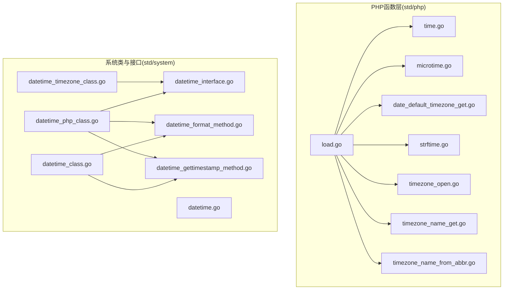
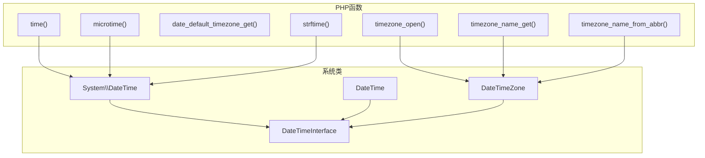
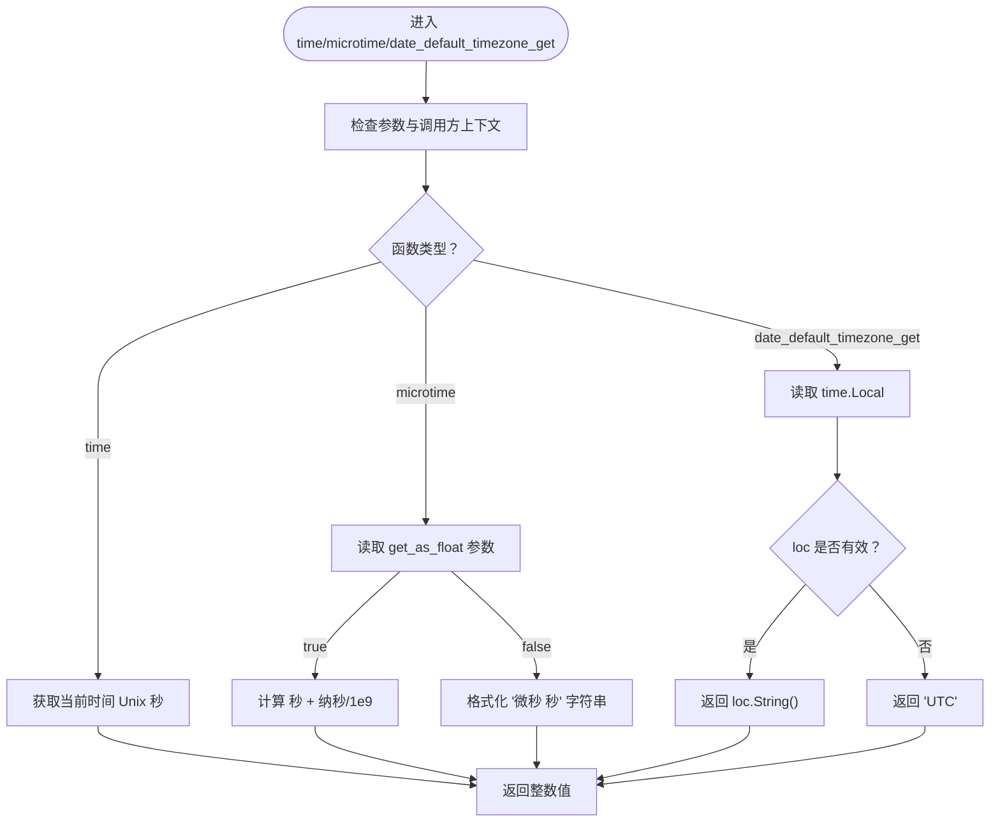
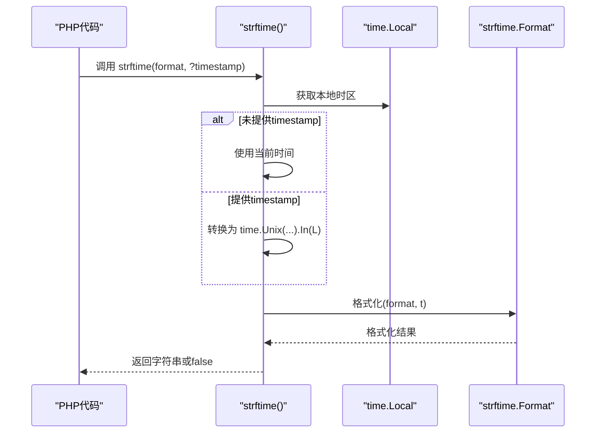
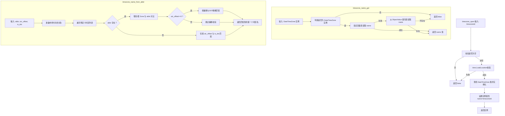
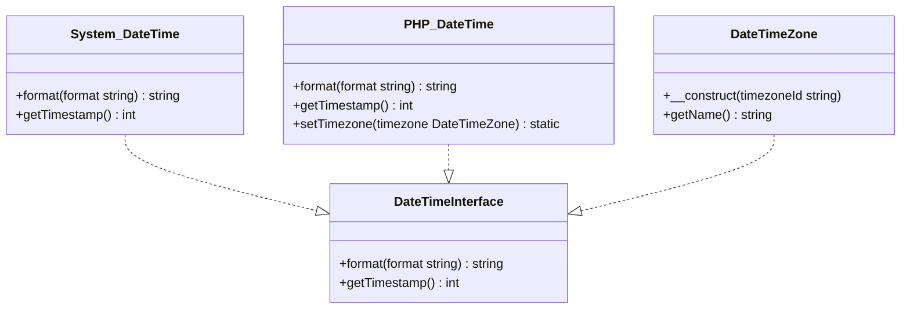
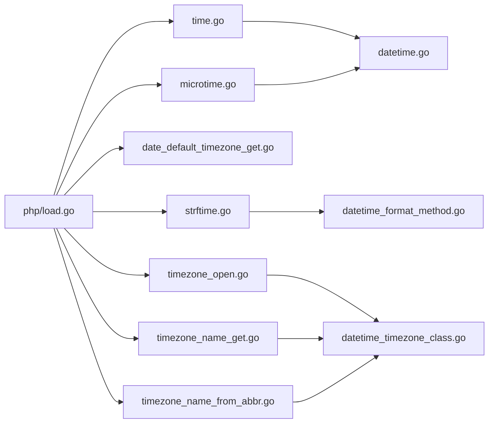

# 日期时间函数

<cite>
**本文引用的文件**
- [std/php/time.go](file://std/php/time.go)
- [std/php/microtime.go](file://std/php/microtime.go)
- [std/php/date_default_timezone_get.go](file://std/php/date_default_timezone_get.go)
- [std/php/strftime.go](file://std/php/strftime.go)
- [std/php/timezone_name_get.go](file://std/php/timezone_name_get.go)
- [std/php/timezone_name_from_abbr.go](file://std/php/timezone_name_from_abbr.go)
- [std/php/timezone_open.go](file://std/php/timezone_open.go)
- [std/system/datetime.go](file://std/system/datetime.go)
- [std/system/datetime_class.go](file://std/system/datetime_class.go)
- [std/system/datetime_format_method.go](file://std/system/datetime_format_method.go)
- [std/system/datetime_gettimestamp_method.go](file://std/system/datetime_gettimestamp_method.go)
- [std/system/datetime_interface.go](file://std/system/datetime_interface.go)
- [std/system/datetime_php_class.go](file://std/system/datetime_php_class.go)
- [std/system/datetime_timezone_class.go](file://std/system/datetime_timezone_class.go)
- [std/php/load.go](file://std/php/load.go)
</cite>

## 目录
1. [引言](#引言)
2. [项目结构](#项目结构)
3. [核心组件](#核心组件)
4. [架构总览](#架构总览)
5. [详细组件分析](#详细组件分析)
6. [依赖分析](#依赖分析)
7. [性能考虑](#性能考虑)
8. [故障排查指南](#故障排查指南)
9. [结论](#结论)
10. [附录](#附录)

## 引言
本文件面向Origami运行时的PHP日期时间能力，系统性梳理以下主题：
- 时间获取：time、microtime、date_default_timezone_get
- 格式化：date（通过System\DateTime与PHP DateTime的format）、strftime
- 时区：timezone_name_get、timezone_name_from_abbr、timezone_open
- 时间戳转换与本地化
- 与原生PHP的兼容性与差异
- 性能与最佳实践
- 夏令时与时区转换注意事项

目标是帮助读者在不深入源码的前提下，理解并正确使用这些日期时间功能。

## 项目结构
与日期时间相关的实现主要分布在两个子系统：
- PHP层函数：位于std/php目录，提供与PHP函数语义一致的实现
- 系统类与接口：位于std/system目录，提供System\DateTime、PHP DateTime、DateTimeZone以及DateTimeInterface等

下图给出与日期时间相关的模块关系概览：

图表来源
- [std/php/load.go:19-212](file://std/php/load.go#L19-L212)
- [std/system/datetime_class.go:14-63](file://std/system/datetime_class.go#L14-L63)
- [std/system/datetime_php_class.go:21-78](file://std/system/datetime_php_class.go#L21-L78)
- [std/system/datetime_timezone_class.go:22-80](file://std/system/datetime_timezone_class.go#L22-L80)

章节来源
- [std/php/load.go:19-212](file://std/php/load.go#L19-L212)

## 核心组件
- 时间获取函数
  - time：返回当前Unix秒级时间戳（整数）
  - microtime：可选返回字符串或浮点数格式的“微秒 秒”表示
  - date_default_timezone_get：返回当前默认时区IANA名称，若不可用则回退UTC
- 格式化函数
  - strftime：按本地时区格式化，空格式返回false，支持可选timestamp
  - date：通过System\DateTime与PHP DateTime的format方法实现
- 时区处理函数
  - timezone_open：打开并返回DateTimeZone对象（或false）
  - timezone_name_get：从DateTimeZone实例读取name属性（或false）
  - timezone_name_from_abbr：根据缩写/UTC偏移/是否夏令时匹配IANA时区名
- 日期时间对象
  - System\DateTime：提供format与getTimestamp
  - PHP DateTime：提供format、getTimestamp、setTimezone（简单返回$this）
  - DateTimeZone：提供__construct与getName

章节来源
- [std/php/time.go:9-22](file://std/php/time.go#L9-L22)
- [std/php/microtime.go:11-57](file://std/php/microtime.go#L11-L57)
- [std/php/date_default_timezone_get.go:17-49](file://std/php/date_default_timezone_get.go#L17-L49)
- [std/php/strftime.go:18-86](file://std/php/strftime.go#L18-L86)
- [std/system/datetime_format_method.go:15-50](file://std/system/datetime_format_method.go#L15-L50)
- [std/system/datetime_gettimestamp_method.go:11-37](file://std/system/datetime_gettimestamp_method.go#L11-L37)
- [std/php/timezone_open.go:19-73](file://std/php/timezone_open.go#L19-L73)
- [std/php/timezone_name_get.go:17-72](file://std/php/timezone_name_get.go#L17-L72)
- [std/php/timezone_name_from_abbr.go:21-81](file://std/php/timezone_name_from_abbr.go#L21-L81)
- [std/system/datetime_php_class.go:80-119](file://std/system/datetime_php_class.go#L80-L119)
- [std/system/datetime_timezone_class.go:82-171](file://std/system/datetime_timezone_class.go#L82-L171)

## 架构总览
下图展示从PHP函数到系统类的调用关系与职责分工：

图表来源
- [std/php/time.go:9-22](file://std/php/time.go#L9-L22)
- [std/php/microtime.go:11-57](file://std/php/microtime.go#L11-L57)
- [std/php/strftime.go:18-86](file://std/php/strftime.go#L18-L86)
- [std/php/timezone_open.go:19-73](file://std/php/timezone_open.go#L19-L73)
- [std/php/timezone_name_get.go:17-72](file://std/php/timezone_name_get.go#L17-L72)
- [std/php/timezone_name_from_abbr.go:21-81](file://std/php/timezone_name_from_abbr.go#L21-L81)
- [std/system/datetime_interface.go:10-33](file://std/system/datetime_interface.go#L10-L33)
- [std/system/datetime_class.go:14-63](file://std/system/datetime_class.go#L14-L63)
- [std/system/datetime_php_class.go:21-78](file://std/system/datetime_php_class.go#L21-L78)
- [std/system/datetime_timezone_class.go:22-80](file://std/system/datetime_timezone_class.go#L22-L80)

## 详细组件分析

### 时间获取函数
- time
  - 功能：返回当前Unix秒级时间戳（整数）
  - 实现要点：基于Go标准库time.Now().Unix()
- microtime
  - 功能：可选返回字符串“微秒 秒”或浮点数（微秒精度）
  - 实现要点：支持参数控制返回类型；浮点数为秒+纳秒转微秒
- date_default_timezone_get
  - 功能：返回默认时区IANA名称；不可用时回退UTC
  - 实现要点：优先使用time.Local，若为空或Local则回退UTC

图表来源
- [std/php/time.go:17-18](file://std/php/time.go#L17-L18)
- [std/php/microtime.go:19-41](file://std/php/microtime.go#L19-L41)
- [std/php/date_default_timezone_get.go:25-35](file://std/php/date_default_timezone_get.go#L25-L35)

章节来源
- [std/php/time.go:9-22](file://std/php/time.go#L9-L22)
- [std/php/microtime.go:11-57](file://std/php/microtime.go#L11-L57)
- [std/php/date_default_timezone_get.go:17-49](file://std/php/date_default_timezone_get.go#L17-L49)

### 格式化函数
- strftime
  - 功能：按本地时区格式化时间；空format返回false；timestamp可选
  - 实现要点：使用time.Local作为默认时区；当结果过长时返回false
- date（通过System\DateTime与PHP DateTime）
  - 功能：通过format方法进行格式化
  - 实现要点：System\DateTime与PHP DateTime均提供format(string) -> string

图表来源
- [std/php/strftime.go:26-67](file://std/php/strftime.go#L26-L67)

章节来源
- [std/php/strftime.go:18-86](file://std/php/strftime.go#L18-L86)
- [std/system/datetime_format_method.go:15-50](file://std/system/datetime_format_method.go#L15-L50)

### 时区处理函数
- timezone_open
  - 功能：打开并返回DateTimeZone对象（或false）
  - 实现要点：使用time.LoadLocation校验时区ID；成功后创建实例并设置name属性
- timezone_name_get
  - 功能：从DateTimeZone实例读取name属性（或false）
  - 实现要点：优先通过变量表读取同名变量，回退从ObjectValue属性表读取
- timezone_name_from_abbr
  - 功能：根据缩写/UTC偏移/是否夏令时匹配IANA时区名
  - 实现要点：在预定义列表中查找；使用冬夏两季Zone信息比对；支持偏移精确匹配

图表来源
- [std/php/timezone_open.go:27-56](file://std/php/timezone_open.go#L27-L56)
- [std/php/timezone_name_get.go:25-55](file://std/php/timezone_name_get.go#L25-L55)
- [std/php/timezone_name_from_abbr.go:29-154](file://std/php/timezone_name_from_abbr.go#L29-L154)

章节来源
- [std/php/timezone_open.go:19-73](file://std/php/timezone_open.go#L19-L73)
- [std/php/timezone_name_get.go:17-72](file://std/php/timezone_name_get.go#L17-L72)
- [std/php/timezone_name_from_abbr.go:21-81](file://std/php/timezone_name_from_abbr.go#L21-L81)

### 日期时间对象与接口
- System\DateTime
  - 方法：format(string) -> string、getTimestamp() -> int
  - 实现：委托底层DateTime结构体
- PHP DateTime
  - 方法：format、getTimestamp、setTimezone（简单返回$this）
  - 实现：与System\DateTime共享format与getTimestamp，setTimezone为占位实现
- DateTimeZone
  - 方法：__construct(string $timezoneId)、getName(): string
  - 实现：构造时校验并保存name属性；getName读取name属性
- DateTimeInterface
  - 方法：format(string)、getTimestamp(): int
  - 作用：作为类型提示与instanceof检查的基础接口

图表来源
- [std/system/datetime_interface.go:10-33](file://std/system/datetime_interface.go#L10-L33)
- [std/system/datetime_class.go:14-63](file://std/system/datetime_class.go#L14-L63)
- [std/system/datetime_php_class.go:21-78](file://std/system/datetime_php_class.go#L21-L78)
- [std/system/datetime_timezone_class.go:22-80](file://std/system/datetime_timezone_class.go#L22-L80)

章节来源
- [std/system/datetime_interface.go:10-33](file://std/system/datetime_interface.go#L10-L33)
- [std/system/datetime_class.go:14-63](file://std/system/datetime_class.go#L14-L63)
- [std/system/datetime_php_class.go:21-78](file://std/system/datetime_php_class.go#L21-L78)
- [std/system/datetime_timezone_class.go:22-80](file://std/system/datetime_timezone_class.go#L22-L80)

## 依赖分析
- 函数注册
  - 所有日期时间相关函数在php包的Load中集中注册，确保VM可用
- 时区依赖
  - timezone_open与DateTimeZone::__construct均依赖Go标准库time.LoadLocation进行合法性校验
  - timezone_name_from_abbr依赖预定义的IANA时区列表与冬夏两季Zone信息
- 格式化依赖
  - strftime依赖第三方strftime库进行格式化
- 对象依赖
  - System\DateTime与PHP DateTime共享format与getTimestamp方法实现
  - DateTimeZone通过name属性承载时区ID，供timezone_name_get读取

图表来源
- [std/php/load.go:19-212](file://std/php/load.go#L19-L212)
- [std/php/timezone_open.go:39-42](file://std/php/timezone_open.go#L39-L42)
- [std/php/timezone_name_from_abbr.go:92-95](file://std/php/timezone_name_from_abbr.go#L92-L95)
- [std/php/strftime.go:63](file://std/php/strftime.go#L63)
- [std/system/datetime_format_method.go:21](file://std/system/datetime_format_method.go#L21)

章节来源
- [std/php/load.go:19-212](file://std/php/load.go#L19-L212)

## 性能考虑
- 时间获取
  - time与microtime均为轻量操作，建议在高频路径中复用当前时间，避免重复调用
  - microtime在需要高精度微秒时使用浮点数形式，注意浮点运算开销
- 格式化
  - strftime依赖第三方库，建议缓存常用格式串；避免在热路径频繁创建临时字符串
- 时区
  - timezone_open与DateTimeZone::__construct会进行time.LoadLocation校验，建议在应用启动阶段预热常用时区
  - timezone_name_from_abbr遍历预定义列表，尽量传入更精确的参数以减少匹配成本
- 对象
  - System\DateTime与PHP DateTime的format与getTimestamp为简单委托，性能开销极低

## 故障排查指南
- strftime返回false
  - 可能原因：format为空；结果长度超过阈值；timestamp类型不合法
  - 建议：检查format与timestamp；确认输出长度限制
- timezone_open返回false
  - 可能原因：时区ID为空；time.LoadLocation失败
  - 建议：验证IANA时区名；确保系统tz数据可用
- timezone_name_get返回false
  - 可能原因：输入非DateTimeZone实例；实例缺少name属性
  - 建议：确认通过timezone_open或DateTimeZone::__construct创建实例；检查属性注入
- timezone_name_from_abbr返回false
  - 可能原因：缩写/偏移/夏令时不匹配；不在预定义列表
  - 建议：提供更精确的utc_offset与is_dst；确认缩写正确
- setTimezone无效
  - 当前实现为占位返回$this，不执行实际时区切换
  - 建议：在需要真实时区切换的场景，自行维护时间戳或使用外部库

章节来源
- [std/php/strftime.go:32-42](file://std/php/strftime.go#L32-L42)
- [std/php/timezone_open.go:35-42](file://std/php/timezone_open.go#L35-L42)
- [std/php/timezone_name_get.go:28-39](file://std/php/timezone_name_get.go#L28-L39)
- [std/php/timezone_name_from_abbr.go:57-61](file://std/php/timezone_name_from_abbr.go#L57-L61)
- [std/system/datetime_php_class.go:84-89](file://std/system/datetime_php_class.go#L84-L89)

## 结论
Origami在日期时间方面提供了与PHP相近的函数与对象能力：
- 时间获取与格式化：time、microtime、strftime覆盖常用需求
- 时区支持：timezone_open、timezone_name_get、timezone_name_from_abbr满足基本时区管理
- 对象模型：System\DateTime与PHP DateTime、DateTimeZone及DateTimeInterface构成清晰的类型体系

在使用中需关注：
- 与原生PHP的差异（如setTimezone占位实现）
- 夏令时与偏移匹配的准确性
- 性能敏感路径的优化策略

## 附录
- 与原生PHP的兼容性与差异
  - setTimezone：当前返回$this，不执行真实时区切换
  - 时区名称：优先使用IANA名称；不可用时回退UTC
  - 格式化：strftime依赖第三方库，行为与PHP一致但实现不同
- 实际示例（步骤说明）
  - 获取当前时间戳：调用time()
  - 获取微秒时间：调用microtime(true)获取浮点数，或不带参数获取字符串
  - 设置默认时区：调用date_default_timezone_get()获取当前默认时区
  - 格式化时间：通过System\DateTime或PHP DateTime的format方法
  - 解析时区：使用timezone_open打开时区，再用timezone_name_get读取名称
  - 缩写映射：使用timezone_name_from_abbr根据缩写/偏移/夏令时查找IANA时区名