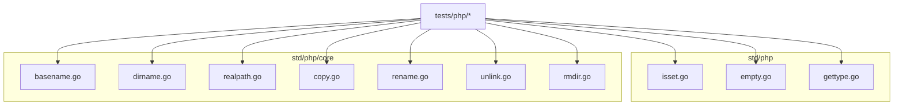
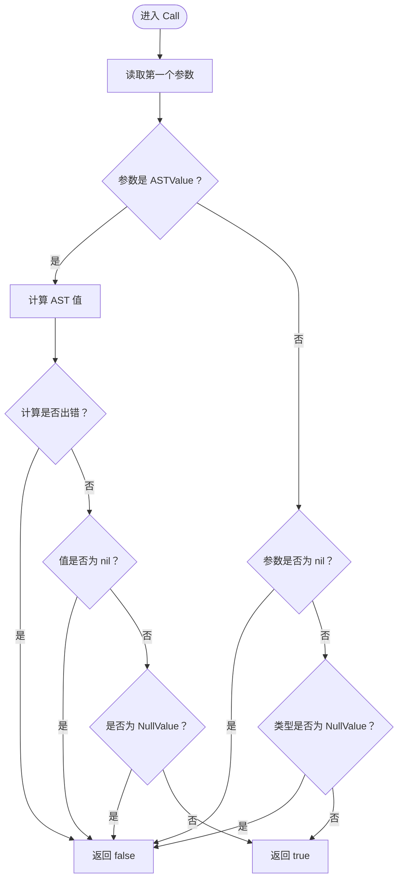
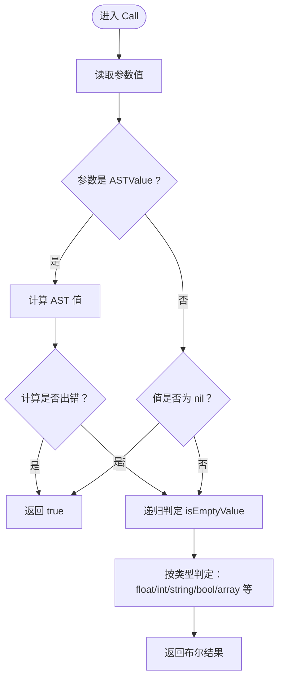
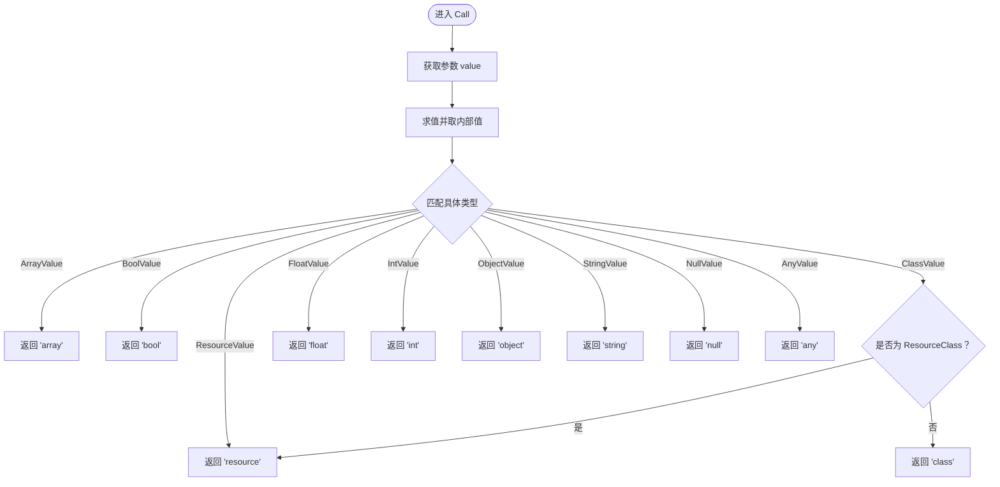
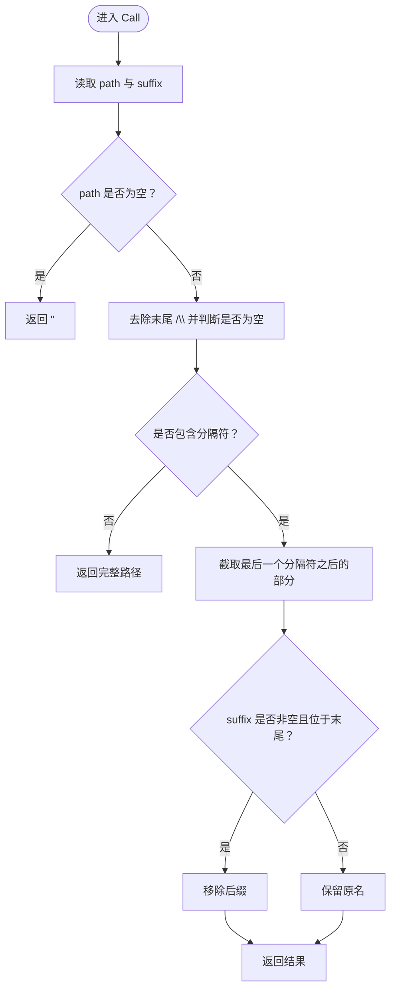
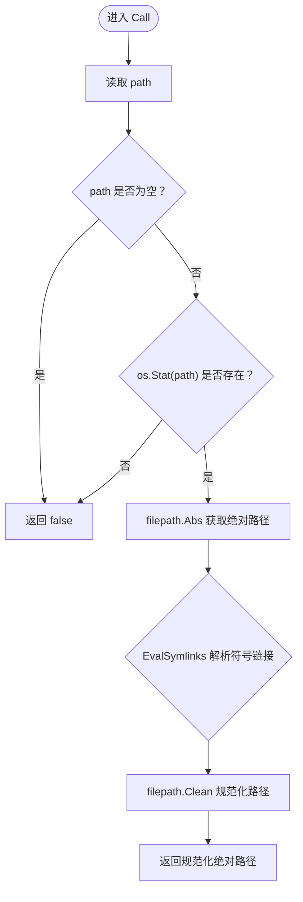
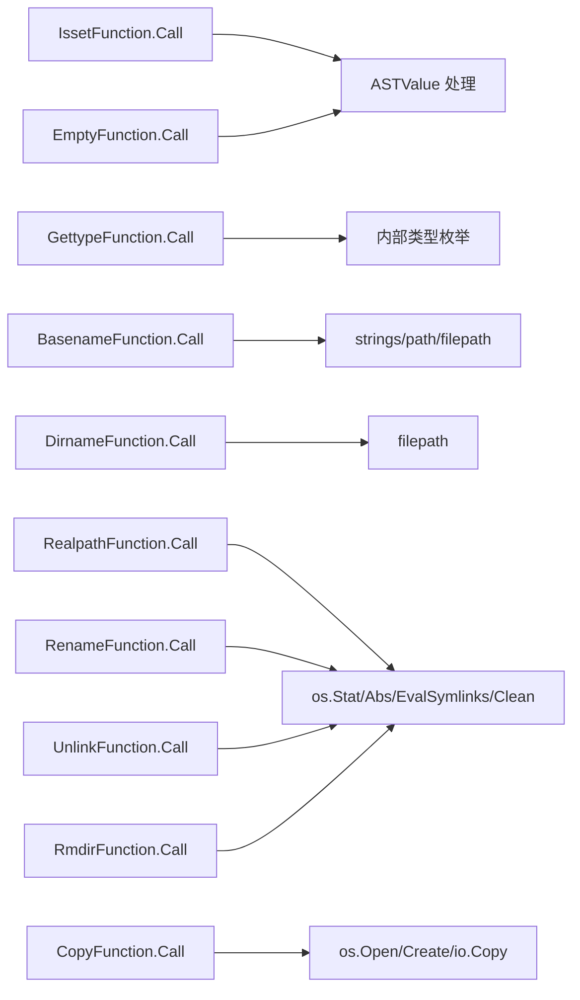

# 核心函数

<cite>
**本文引用的文件**
- [basename.go](file://std/php/core/basename.go)
- [dirname.go](file://std/php/core/dirname.go)
- [realpath.go](file://std/php/core/realpath.go)
- [isset.go](file://std/php/isset.go)
- [empty.go](file://std/php/empty.go)
- [gettype.go](file://std/php/gettype.go)
- [copy.go](file://std/php/core/copy.go)
- [rename.go](file://std/php/core/rename.go)
- [unlink.go](file://std/php/core/unlink.go)
- [rmdir.go](file://std/php/core/rmdir.go)
- [fs_unlink_rmdir_copy_rename.zy](file://tests/php/fs_unlink_rmdir_copy_rename.zy)
- [basename.zy](file://tests/php/basename.zy)
- [dirname.zy](file://tests/php/dirname.zy)
- [realpath.zy](file://tests/php/realpath.zy)
- [isset.zy](file://tests/php/isset.zy)
- [empty.zy](file://tests/php/empty.zy)
- [gettype.zy](file://tests/php/gettype.zy)
</cite>

## 目录
1. [简介](#简介)
2. [项目结构](#项目结构)
3. [核心组件](#核心组件)
4. [架构总览](#架构总览)
5. [详细组件分析](#详细组件分析)
6. [依赖分析](#依赖分析)
7. [性能考量](#性能考量)
8. [故障排查指南](#故障排查指南)
9. [结论](#结论)
10. [附录](#附录)

## 简介
本文件面向PHP核心函数在Origami运行时中的实现与使用，聚焦以下函数族：
- 变量处理：isset、empty、gettype
- 字符串处理：basename、dirname、realpath
- 文件系统：copy、rename、unlink、rmdir
- 进程控制：exit、putenv、getenv（本节重点覆盖已实现的函数）

文档将逐项说明函数签名、参数类型、返回值、异常处理策略、行为差异与兼容性、性能特性与最佳实践，并提供测试用例路径以便对照验证。

## 项目结构
这些函数分布在标准库的php子包中，按功能域划分：
- std/php/core：文件系统与路径处理函数
- std/php：通用语言级函数（isset、empty、gettype等）
- tests/php：各函数的行为验证脚本

**图表来源**
- [isset.go:1-76](file://std/php/isset.go#L1-L76)
- [empty.go:1-133](file://std/php/empty.go#L1-L133)
- [gettype.go:1-73](file://std/php/gettype.go#L1-L73)
- [basename.go:1-87](file://std/php/core/basename.go#L1-L87)
- [dirname.go:1-48](file://std/php/core/dirname.go#L1-L48)
- [realpath.go:1-79](file://std/php/core/realpath.go#L1-L79)
- [copy.go:1-79](file://std/php/core/copy.go#L1-L79)
- [rename.go:1-66](file://std/php/core/rename.go#L1-L66)
- [unlink.go:1-61](file://std/php/core/unlink.go#L1-L61)
- [rmdir.go:1-61](file://std/php/core/rmdir.go#L1-L61)

**章节来源**
- [isset.go:1-76](file://std/php/isset.go#L1-L76)
- [empty.go:1-133](file://std/php/empty.go#L1-L133)
- [gettype.go:1-73](file://std/php/gettype.go#L1-L73)
- [basename.go:1-87](file://std/php/core/basename.go#L1-L87)
- [dirname.go:1-48](file://std/php/core/dirname.go#L1-L48)
- [realpath.go:1-79](file://std/php/core/realpath.go#L1-L79)
- [copy.go:1-79](file://std/php/core/copy.go#L1-L79)
- [rename.go:1-66](file://std/php/core/rename.go#L1-L66)
- [unlink.go:1-61](file://std/php/core/unlink.go#L1-L61)
- [rmdir.go:1-61](file://std/php/core/rmdir.go#L1-L61)

## 核心组件
本节概述各函数族的职责与共性：
- 变量处理函数：用于检测变量状态与类型推断，返回布尔或字符串，不抛异常
- 字符串/路径函数：处理路径与文件名，返回字符串或布尔，遵循跨平台分隔符处理
- 文件系统函数：执行文件复制、重命名、删除等操作，统一以布尔返回值表达成功与否

**章节来源**
- [isset.go:14-59](file://std/php/isset.go#L14-L59)
- [empty.go:14-38](file://std/php/empty.go#L14-L38)
- [gettype.go:15-56](file://std/php/gettype.go#L15-L56)
- [basename.go:19-68](file://std/php/core/basename.go#L19-L68)
- [dirname.go:17-31](file://std/php/core/dirname.go#L17-L31)
- [realpath.go:20-61](file://std/php/core/realpath.go#L20-L61)
- [copy.go:19-60](file://std/php/core/copy.go#L19-L60)
- [rename.go:18-47](file://std/php/core/rename.go#L18-L47)
- [unlink.go:18-44](file://std/php/core/unlink.go#L18-L44)
- [rmdir.go:19-44](file://std/php/core/rmdir.go#L19-L44)

## 架构总览
函数实现遵循统一的接口模式：实现Call方法接收上下文，解析参数，执行业务逻辑，返回值包装为运行时值类型；并通过GetName/GetParams/GetVariables声明函数元信息。

```mermaid
classDiagram
class FuncStmt {
+Call(ctx) (GetValue, Control)
+GetName() string
+GetParams() []GetValue
+GetVariables() []Variable
}
class IssetFunction {
+Call(ctx) (GetValue, Control)
+GetName() string
+GetParams() []GetValue
+GetVariables() []Variable
}
class EmptyFunction {
+Call(ctx) (GetValue, Control)
+GetName() string
+GetParams() []GetValue
+GetVariables() []Variable
}
class GettypeFunction {
+Call(ctx) (GetValue, Control)
+GetName() string
+GetParams() []GetValue
+GetVariables() []Variable
}
class BasenameFunction {
+Call(ctx) (GetValue, Control)
+GetName() string
+GetParams() []GetValue
+GetVariables() []Variable
}
class DirnameFunction {
+Call(ctx) (GetValue, Control)
+GetName() string
+GetParams() []GetValue
+GetVariables() []Variable
}
class RealpathFunction {
+Call(ctx) (GetValue, Control)
+GetName() string
+GetParams() []GetValue
+GetVariables() []Variable
}
class CopyFunction {
+Call(ctx) (GetValue, Control)
+GetName() string
+GetParams() []GetValue
+GetVariables() []Variable
}
class RenameFunction {
+Call(ctx) (GetValue, Control)
+GetName() string
+GetParams() []GetValue
+GetVariables() []Variable
}
class UnlinkFunction {
+Call(ctx) (GetValue, Control)
+GetName() string
+GetParams() []GetValue
+GetVariables() []Variable
}
class RmdirFunction {
+Call(ctx) (GetValue, Control)
+GetName() string
+GetParams() []GetValue
+GetVariables() []Variable
}
FuncStmt <|.. IssetFunction
FuncStmt <|.. EmptyFunction
FuncStmt <|.. GettypeFunction
FuncStmt <|.. BasenameFunction
FuncStmt <|.. DirnameFunction
FuncStmt <|.. RealpathFunction
FuncStmt <|.. CopyFunction
FuncStmt <|.. RenameFunction
FuncStmt <|.. UnlinkFunction
FuncStmt <|.. RmdirFunction
```

**图表来源**
- [isset.go:8-76](file://std/php/isset.go#L8-L76)
- [empty.go:8-133](file://std/php/empty.go#L8-L133)
- [gettype.go:9-73](file://std/php/gettype.go#L9-L73)
- [basename.go:10-87](file://std/php/core/basename.go#L10-L87)
- [dirname.go:10-48](file://std/php/core/dirname.go#L10-L48)
- [realpath.go:11-79](file://std/php/core/realpath.go#L11-L79)
- [copy.go:11-79](file://std/php/core/copy.go#L11-L79)
- [rename.go:10-66](file://std/php/core/rename.go#L10-L66)
- [unlink.go:10-61](file://std/php/core/unlink.go#L10-L61)
- [rmdir.go:10-61](file://std/php/core/rmdir.go#L10-L61)

## 详细组件分析

### 变量处理函数

#### isset
- 功能：检测变量是否已设置且不为null
- 参数：单个变量（支持AST值）
- 返回：布尔
- 异常处理：计算AST值时若发生错误（如未定义变量），返回false而不抛异常
- 兼容性：与PHP行为一致，抑制未定义变量错误
- 性能：短路判断，避免不必要的类型转换

**图表来源**
- [isset.go:14-59](file://std/php/isset.go#L14-L59)

**章节来源**
- [isset.go:14-59](file://std/php/isset.go#L14-L59)
- [isset.zy](file://tests/php/isset.zy)

#### empty
- 功能：检测变量是否为空
- 参数：单个变量（支持AST值）
- 返回：布尔
- 异常处理：计算AST值时若发生错误（如未定义变量），返回true
- 兼容性：与PHP行为一致，抑制未定义变量错误并按规则判定“空”
- 性能：针对常见类型快速分支，避免多余转换

**图表来源**
- [empty.go:14-38](file://std/php/empty.go#L14-L38)
- [empty.go:41-116](file://std/php/empty.go#L41-L116)

**章节来源**
- [empty.go:14-38](file://std/php/empty.go#L14-L38)
- [empty.go:41-116](file://std/php/empty.go#L41-L116)
- [empty.zy](file://tests/php/empty.zy)

#### gettype
- 功能：返回变量的内部类型名称
- 参数：任意类型值
- 返回：字符串（如 array、bool、resource、class、float、int、object、string、null、any）
- 异常处理：正常返回类型名；若取值过程出错，返回错误控制
- 兼容性：与PHP类型系统映射，资源类也视为resource
- 性能：简单switch分支，O(1)时间复杂度

**图表来源**
- [gettype.go:15-56](file://std/php/gettype.go#L15-L56)

**章节来源**
- [gettype.go:15-56](file://std/php/gettype.go#L15-L56)
- [gettype.zy](file://tests/php/gettype.zy)

### 字符串/路径处理函数

#### basename
- 功能：返回路径中的文件名部分，可选移除指定后缀
- 参数：path（必填），suffix（可选，默认空字符串）
- 返回：字符串
- 异常处理：不抛异常；空路径返回空字符串
- 兼容性：支持Windows风格分隔符，自动去除末尾分隔符
- 性能：字符串处理开销低，O(n)取决于路径长度

**图表来源**
- [basename.go:19-68](file://std/php/core/basename.go#L19-L68)

**章节来源**
- [basename.go:19-68](file://std/php/core/basename.go#L19-L68)
- [basename.zy](file://tests/php/basename.zy)

#### dirname
- 功能：返回路径的目录部分
- 参数：path（必填）
- 返回：字符串
- 异常处理：不抛异常；空路径返回空字符串
- 兼容性：使用Go标准库路径处理，跨平台友好
- 性能：O(n)时间复杂度，主要由路径解析决定

**章节来源**
- [dirname.go:17-31](file://std/php/core/dirname.go#L17-L31)
- [dirname.zy](file://tests/php/dirname.zy)

#### realpath
- 功能：返回规范化绝对路径；若路径不存在或不可解析，返回false
- 参数：path（必填）
- 返回：字符串或布尔（false）
- 异常处理：不抛异常；任何错误均返回false
- 兼容性：先获取绝对路径，再解析符号链接，最后清理冗余组件
- 性能：涉及文件系统查询与符号链接解析，成本较高

**图表来源**
- [realpath.go:20-61](file://std/php/core/realpath.go#L20-L61)

**章节来源**
- [realpath.go:20-61](file://std/php/core/realpath.go#L20-L61)
- [realpath.zy](file://tests/php/realpath.zy)

### 文件系统函数

#### copy
- 功能：复制文件
- 参数：source（源文件），dest（目标文件）
- 返回：布尔（成功true，失败false）
- 异常处理：不抛异常；打开/创建/复制任一步失败均返回false
- 兼容性：与PHP copy一致，静默失败
- 性能：I/O密集，受磁盘与文件大小影响

**章节来源**
- [copy.go:19-60](file://std/php/core/copy.go#L19-L60)
- [fs_unlink_rmdir_copy_rename.zy](file://tests/php/fs_unlink_rmdir_copy_rename.zy)

#### rename
- 功能：重命名/移动文件
- 参数：oldname（旧路径），newname（新路径）
- 返回：布尔（成功true，失败false）
- 异常处理：不抛异常；底层重命名失败返回false
- 兼容性：与PHP rename一致
- 性能：系统调用级别，通常很快

**章节来源**
- [rename.go:18-47](file://std/php/core/rename.go#L18-L47)
- [fs_unlink_rmdir_copy_rename.zy](file://tests/php/fs_unlink_rmdir_copy_rename.zy)

#### unlink
- 功能：删除文件
- 参数：filename（文件路径）
- 返回：布尔（成功true，失败false）
- 异常处理：不抛异常；空路径或删除失败返回false
- 兼容性：与PHP unlink一致
- 性能：系统调用级别

**章节来源**
- [unlink.go:18-44](file://std/php/core/unlink.go#L18-L44)
- [fs_unlink_rmdir_copy_rename.zy](file://tests/php/fs_unlink_rmdir_copy_rename.zy)

#### rmdir
- 功能：删除目录或文件（非空目录失败）
- 参数：directory（路径）
- 返回：布尔（成功true，失败false）
- 异常处理：不抛异常；空路径或删除失败返回false
- 兼容性：与PHP rmdir一致
- 性能：系统调用级别

**章节来源**
- [rmdir.go:19-44](file://std/php/core/rmdir.go#L19-L44)
- [fs_unlink_rmdir_copy_rename.zy](file://tests/php/fs_unlink_rmdir_copy_rename.zy)

### 进程控制函数
- exit：未在当前代码库中发现对应实现文件
- putenv/getenv：未在当前代码库中发现对应实现文件

说明：若需使用这些函数，请确认其是否在后续版本中引入，或通过其他扩展机制实现。

## 依赖分析
- 所有函数均实现统一的FuncStmt接口，便于注册与调用
- 字符串/路径函数依赖Go标准库（strings、path/filepath）
- 文件系统函数依赖os、io包
- 类型判定函数依赖内部类型系统（ArrayValue、BoolValue、FloatValue、IntValue、ObjectValue、StringValue、NullValue、AnyValue、ResourceValue等）

**图表来源**
- [isset.go:14-59](file://std/php/isset.go#L14-L59)
- [empty.go:14-38](file://std/php/empty.go#L14-L38)
- [gettype.go:15-56](file://std/php/gettype.go#L15-L56)
- [basename.go:19-68](file://std/php/core/basename.go#L19-L68)
- [dirname.go:17-31](file://std/php/core/dirname.go#L17-L31)
- [realpath.go:20-61](file://std/php/core/realpath.go#L20-L61)
- [copy.go:19-60](file://std/php/core/copy.go#L19-L60)
- [rename.go:18-47](file://std/php/core/rename.go#L18-L47)
- [unlink.go:18-44](file://std/php/core/unlink.go#L18-L44)
- [rmdir.go:19-44](file://std/php/core/rmdir.go#L19-L44)

**章节来源**
- [isset.go:14-59](file://std/php/isset.go#L14-L59)
- [empty.go:14-38](file://std/php/empty.go#L14-L38)
- [gettype.go:15-56](file://std/php/gettype.go#L15-L56)
- [basename.go:19-68](file://std/php/core/basename.go#L19-L68)
- [dirname.go:17-31](file://std/php/core/dirname.go#L17-L31)
- [realpath.go:20-61](file://std/php/core/realpath.go#L20-L61)
- [copy.go:19-60](file://std/php/core/copy.go#L19-L60)
- [rename.go:18-47](file://std/php/core/rename.go#L18-L47)
- [unlink.go:18-44](file://std/php/core/unlink.go#L18-L44)
- [rmdir.go:19-44](file://std/php/core/rmdir.go#L19-L44)

## 性能考量
- 类型判定与字符串处理：O(1)到O(n)，n为输入长度
- 路径规范化：涉及多次系统调用与字符串处理，建议缓存常用路径
- 文件I/O：copy/rename/unlink/rmdir为系统调用，整体性能取决于磁盘与文件大小
- 错误抑制策略：所有文件系统函数均返回布尔值，避免异常开销，适合批量操作场景

[本节为通用指导，无需列出具体文件来源]

## 故障排查指南
- isset/empty在未定义变量时的行为：返回false（isset）或true（empty），不会抛出异常
- realpath返回false：可能由于路径不存在、权限不足或符号链接解析失败
- copy/rename/unlink/rmdir返回false：检查路径有效性、权限与目标状态（如非空目录）
- basename/dirname/realpath：注意跨平台分隔符差异，确保输入符合预期

**章节来源**
- [isset.go:24-31](file://std/php/isset.go#L24-L31)
- [empty.go:20-27](file://std/php/empty.go#L20-L27)
- [realpath.go:40-56](file://std/php/core/realpath.go#L40-L56)
- [copy.go:43-57](file://std/php/core/copy.go#L43-L57)
- [rename.go:42-44](file://std/php/core/rename.go#L42-L44)
- [unlink.go:37-41](file://std/php/core/unlink.go#L37-L41)
- [rmdir.go:37-41](file://std/php/core/rmdir.go#L37-L41)

## 结论
Origami对PHP核心函数提供了高一致性实现，尤其在变量处理与文件系统操作方面严格遵循PHP语义，采用“静默失败”的布尔返回策略，便于在脚本中进行稳健的流程控制。字符串/路径函数在跨平台兼容性上做了充分处理，类型判定函数与内部类型系统紧密集成。对于缺失的进程控制函数（如exit、putenv、getenv），可在后续版本中补充实现或通过扩展机制接入。

[本节为总结性内容，无需列出具体文件来源]

## 附录
- 测试用例路径（用于对照验证行为）：
  - [fs_unlink_rmdir_copy_rename.zy](file://tests/php/fs_unlink_rmdir_copy_rename.zy)
  - [basename.zy](file://tests/php/basename.zy)
  - [dirname.zy](file://tests/php/dirname.zy)
  - [realpath.zy](file://tests/php/realpath.zy)
  - [isset.zy](file://tests/php/isset.zy)
  - [empty.zy](file://tests/php/empty.zy)
  - [gettype.zy](file://tests/php/gettype.zy)

[本节为参考信息，无需列出具体文件来源]